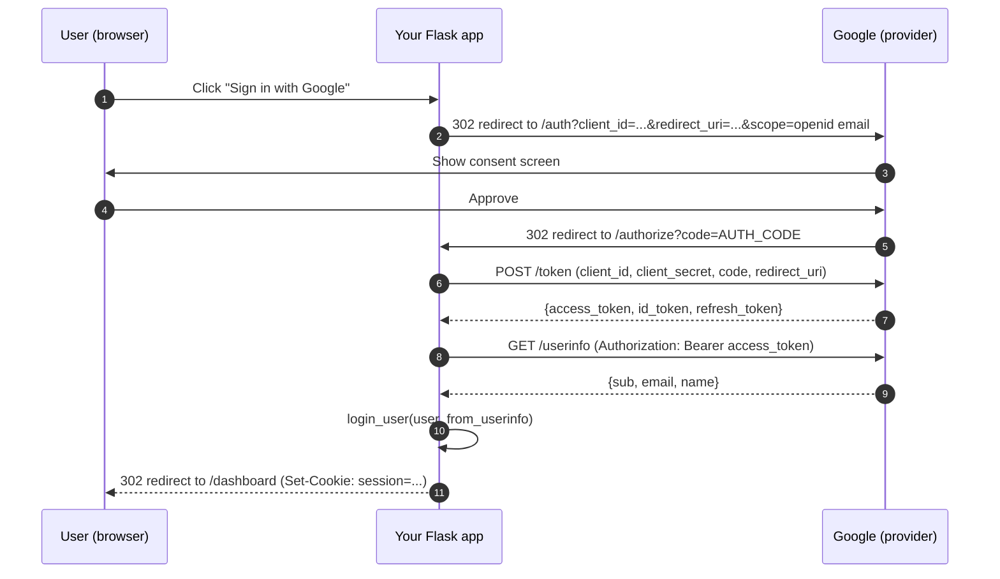
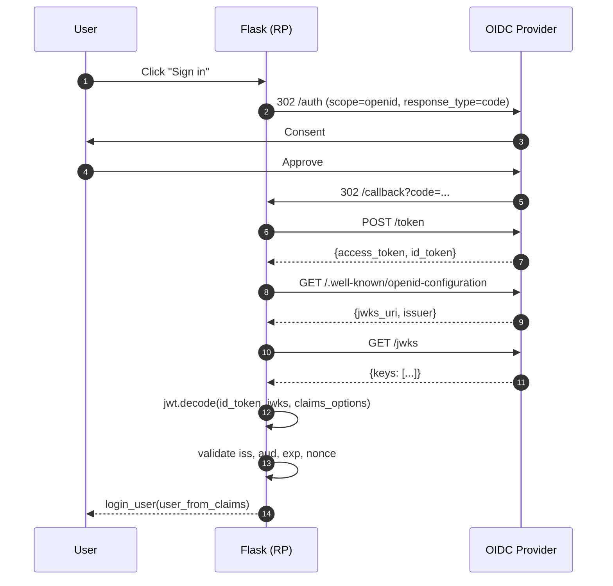
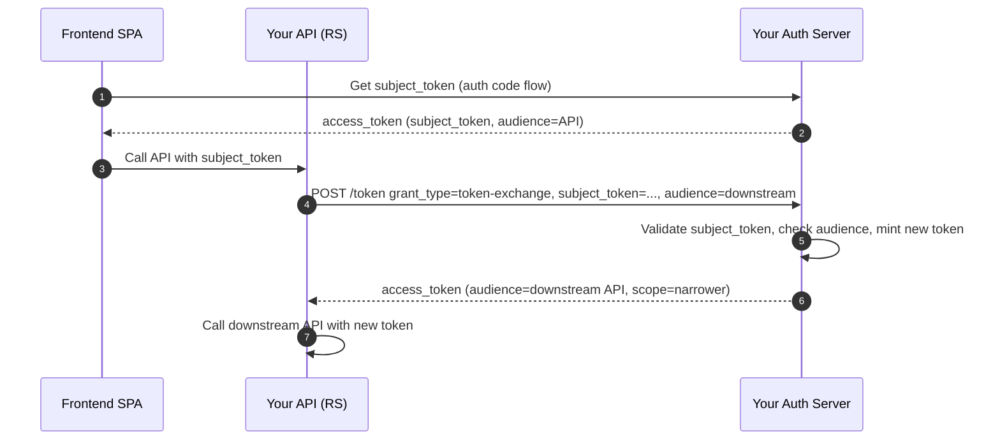
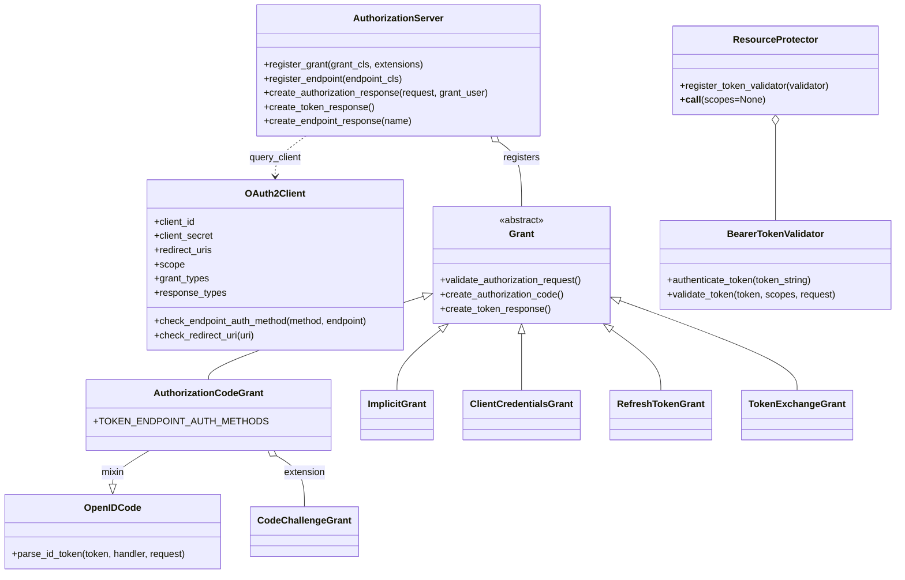
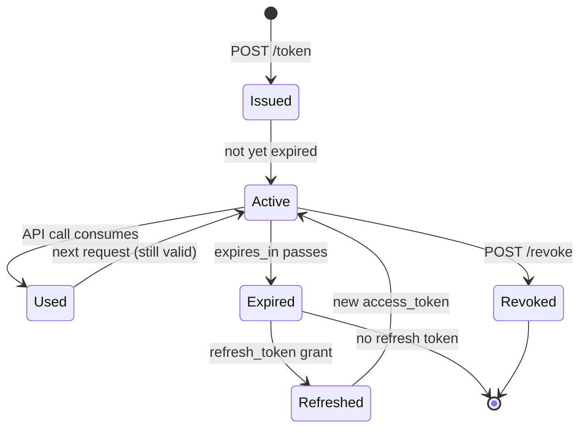
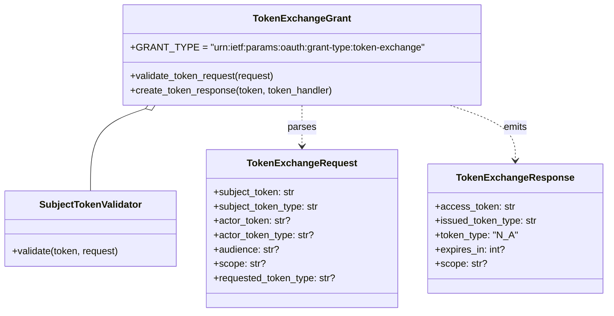
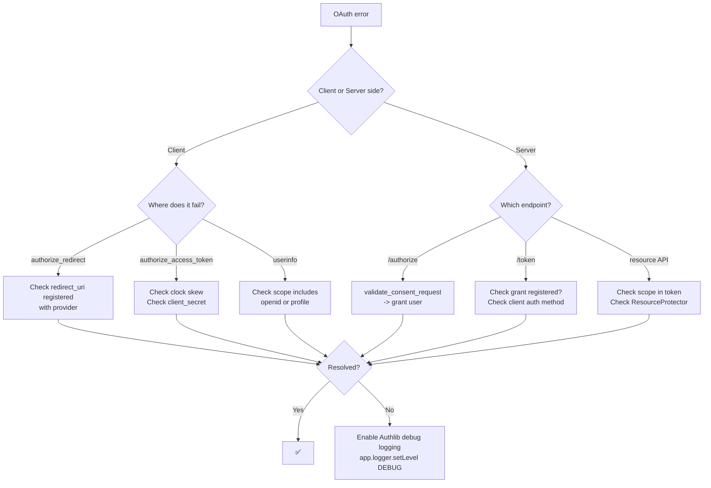
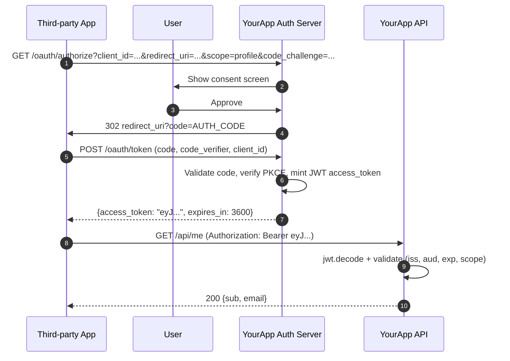

# Flask-Authlib

#flask #authentication #oauth #oauth2 #oidc #jwt #security #authorization

> [!info] The unified OAuth / OIDC / JOSE toolkit for Flask
> **Authlib** is a modern Python library covering the entire OAuth, OpenID Connect, and JOSE (JWT/JWS/JWE/JWK) specification surface. Its Flask integration lives in `authlib.integrations.flask_client` (for being an OAuth **client** — "log in with Google") and `authlib.integrations.flask_oauth2` (for being an OAuth **server/provider** — "build your own Google"). It is the official successor to the abandoned **Flask-OAuthlib** and is actively maintained.

Think of Authlib as a **passport office** with two counters: at one counter you go to get a stamp on your own passport so you can enter someone else's country (OAuth *client*); at the other counter you sit behind the desk and issue passports to other people who want to enter *your* country (OAuth *server*). The library also runs the back-office printing press that produces the secure watermarked paper the passports are printed on (the JOSE layer: JWT, JWS, JWE, JWK).

---

## 1. Overview & Metaphor

### Why Authlib exists

The Python ecosystem used to be a patchwork: `Flask-OAuthlib` for OAuth clients and servers, `PyJWT` for JSON Web Tokens, `oauthlib` for low-level OAuth primitives, `python-jose` for encrypted JWTs. None of them shared a JOSE implementation, OIDC was an afterthought, and Flask-OAuthlib went unmaintained around 2019. **Authlib** consolidated all of this into one specification-faithful library with first-class async support, Flask/Django/Starlette/FastAPI/AIOHTTP integrations, and an active maintainer (Hsiaoming Yang).

Authlib covers three big domains:

| Domain | What it does | Module path |
|---|---|---|
| **OAuth 1.0 / 2.0 client** | Let your users "Sign in with Google / GitHub / Twitter / etc." | `authlib.integrations.flask_client` |
| **OAuth 2.0 / OIDC server** | Build your own authorization server (issue tokens to third parties) | `authlib.integrations.flask_oauth2`, `flask_oidc` |
| **JOSE** | Encode/decode JWT, JWS (signed), JWE (encrypted), manage JWK keys | `authlib.jose` |

> [!tip] The metaphor
> Authlib is a **diplomatic protocol office**. The *client* side is your embassy abroad: you show your credentials to a foreign country (Google) and get back a visa (an access token) you can use to enter restricted areas (the Google API). The *server* side is your own country's visa office: foreign nationals (third-party apps) apply for visas, you check their paperwork (the `client_id` / `redirect_uri`), and you issue them tokens. The JOSE layer is the secure document factory: watermarked paper, holographic seals, tamper-evident envelopes — all the cryptography that makes a visa impossible to forge.

### What Authlib does NOT do

| Concern | Who handles it |
|---|---|
| Session management for *your* users after OAuth completes | [[Flask-Login]] |
| Local password hashing | `werkzeug.security` or `passlib` |
| Role/permission checks on endpoints | [[Flask-Principal]] (or roll your own) |
| HTTP Basic / Token auth on APIs | [[Flask-HTTPAuth]] |
| API request rate limiting | [[Flask-Limiter]] |
| Server-side session storage | [[Flask-Session]] |

### Authlib vs Flask-Dance vs Flask-OAuthlib

| Feature | **Authlib** | [[Flask-Dance]] | Flask-OAuthlib (dead) |
|---|---|---|---|
| OAuth 2.0 client | ✅ | ✅ (pre-built blueprints) | ✅ |
| OAuth 1.0 client | ✅ | ⚠️ (legacy only) | ✅ |
| OAuth 2.0 server (provider) | ✅ | ❌ | ✅ |
| OpenID Connect (client) | ✅ | ⚠️ (via authlib) | ❌ |
| OpenID Connect (server) | ✅ | ❌ | ❌ |
| JOSE (JWT/JWS/JWE/JWK) | ✅ | ❌ | ❌ |
| Maintained | ✅ (active) | ✅ (active) | ❌ (abandoned 2019) |
| Pre-built provider blueprints | ❌ | ✅ (Google/GitHub/Twitter/etc.) | ❌ |
| Best for | OAuth provider + JOSE | Quick OAuth client | — |

> [!example] When to pick Authlib vs Flask-Dance
> - You are **building your own OAuth provider** → Authlib (Flask-Dance cannot do this).
> - You need **OpenID Connect** (sign-in with Google/Facebook with ID tokens) → Authlib.
> - You need **JWT signing/encryption** beyond what [[Flask-JWT-Extended]] offers (e.g., JWE) → Authlib.
> - You just want **"Log in with GitHub"** with the least possible code → Flask-Dance.

---

## 2. Installation

```bash
(venv) $ pip install "Authlib[flask]"
```

The `flask` extra pulls in `Flask` and `requests` (used by the client). For full JOSE support (encryption), also install `cryptography`:

```bash
(venv) $ pip install Authlib flask cryptography requests
```

Versions referenced in this note:

| Package | Version |
|---|---|
| Flask | 3.0.x |
| Authlib | 1.3.x |
| cryptography | 42.x |
| requests | 2.31.x |

> [!warning] Authlib 1.x vs 0.x
> Authlib 1.0 (released 2022) dropped Python 3.6 support and reorganised the Flask integration. If you find old Stack Overflow answers referencing `authlib.flask` (without `integrations`), they are pre-1.0 and will not work. The correct modern import is `authlib.integrations.flask_client`.

---

## 3. Configuration

### Minimal OAuth client setup

```python
# app/extensions.py
from authlib.integrations.flask_client import OAuth

oauth = OAuth()
oauth.init_app(app)  # in create_app() instead — see below
```

```python
# app/__init__.py
from flask import Flask
from authlib.integrations.flask_client import OAuth

def create_app() -> Flask:
    app = Flask(__name__)
    app.config["SECRET_KEY"] = "change-me"
    app.config["GOOGLE_CLIENT_ID"] = os.environ["GOOGLE_CLIENT_ID"]
    app.config["GOOGLE_CLIENT_SECRET"] = os.environ["GOOGLE_CLIENT_SECRET"]

    oauth = OAuth(app)

    # Register a remote app — config keys are automatically picked up
    # from app.config by upper-casing the name and adding _CLIENT_ID etc.
    oauth.register(
        name="google",
        server_metadata_url="https://accounts.google.com/.well-known/openid-configuration",
        client_kwargs={"scope": "openid email profile"},
    )

    app.extensions["oauth"] = oauth
    return app
```

### `oauth.register()` parameters

| Parameter | Type | Description |
|---|---|---|
| `name` | `str` | The key you use to access the client (`oauth.google`). |
| `client_id` | `str` | OAuth client ID. If omitted, read from `app.config["<NAME>_CLIENT_ID"]`. |
| `client_secret` | `str` | OAuth client secret. Same auto-config behaviour. |
| `access_token_url` | `str` | OAuth 2.0 token endpoint. Optional if `server_metadata_url` is set. |
| `authorize_url` | `str` | OAuth 2.0 authorization endpoint. Optional if `server_metadata_url` is set. |
| `api_base_url` | `str` | Base URL prepended to relative paths in `client.get(...)`. |
| `server_metadata_url` | `str` | OIDC discovery URL (`.well-known/openid-configuration`). Authlib will fetch all endpoints from here. |
| `client_kwargs` | `dict` | Extra kwargs passed to the underlying `OAuth2Client`: `scope`, `prompt`, `access_type`, etc. |
| `fetch_token` | `callable` | Function to load a stored token from the session/DB for a returning user. |
| `update_token` | `callable` | Function called when a token is refreshed. |

### OIDC discovery: the magic of `server_metadata_url`

Modern OAuth providers publish a JSON document at `/.well-known/openid-configuration` listing every endpoint you need. Authlib fetches it once and caches it. This is why the registration above is so short:

```json
{
  "issuer": "https://accounts.google.com",
  "authorization_endpoint": "https://accounts.google.com/o/oauth2/v2/auth",
  "token_endpoint": "https://oauth2.googleapis.com/token",
  "userinfo_endpoint": "https://openidconnect.googleapis.com/v1/userinfo",
  "jwks_uri": "https://www.googleapis.com/oauth2/v3/certs",
  "scopes_supported": ["openid", "email", "profile", "..."]
}
```

> [!tip] Always prefer discovery
> Hard-coding authorization/token URLs means your app breaks if the provider rotates endpoints. Discovery URLs are stable. Authlib caches the document in-memory so there is no per-request fetch overhead.

### Server-side configuration (OAuth provider)

```python
# app/extensions.py
from authlib.integrations.flask_oauth2 import AuthorizationServer
from authlib.integrations.sqla_oauth2 import (
    create_query_client_func,
    create_save_token_func,
)
from app.extensions import db

# `query_client` and `save_token` are auto-generated from SQLAlchemy models
query_client = create_query_client_func(db.session, OAuth2Client)
save_token = create_save_token_func(db.session, OAuth2Token)

authorization = AuthorizationServer(
    query_client=query_client,
    save_token=save_token,
)
```

| Server config | Description |
|---|---|
| `AUTHLIB_AUTH_HEADER` | Default `'Authorization'`. Override if you must accept tokens from a non-standard header. |
| `OAUTH2_TOKEN_EXPIRES_IN` | Dict mapping grant type → seconds. e.g., `{"authorization_code": 3600, "refresh_token": 2592000}`. |
| `OAUTH2_REFRESH_TOKEN_GENERATOR` | `True` (use Authlib's default) or a callable returning the refresh token string. |

---

## 4. Basic Usage

### 4.1 OAuth client — "Sign in with Google"

```python
# app/auth/google.py
from flask import Blueprint, redirect, url_for, session, current_app
from flask_login import login_user
from app.models.user import User
from app.extensions import db

google_bp = Blueprint("google", __name__)

@google_bp.route("/login/google")
def login():
    oauth = current_app.extensions["oauth"]
    redirect_uri = url_for("google.authorize", _external=True)
    return oauth.google.authorize_redirect(redirect_uri)

@google_bp.route("/login/google/authorize")
def authorize():
    oauth = current_app.extensions["oauth"]
    token = oauth.google.authorize_access_token()
    userinfo = oauth.google.userinfo()   # OIDC: hits the userinfo endpoint
    # userinfo = {"sub": "...", "email": "alice@example.com", "name": "Alice"}

    user = db.session.scalar(
        db.select(User).where(User.google_sub == userinfo["sub"])
    )
    if user is None:
        user = User(
            email=userinfo["email"],
            name=userinfo["name"],
            google_sub=userinfo["sub"],
        )
        db.session.add(user)
        db.session.commit()

    login_user(user)   # see [[Flask-Login]]
    return redirect(url_for("main.dashboard"))
```

### 4.2 OAuth 2.0 authorization-code flow (sequence)



### 4.3 OAuth server — building a provider

The four pieces you need:

1. **Client model** — third-party apps that have registered with you.
2. **Token model** — issued access/refresh tokens.
3. **Authorization endpoint** — the consent screen.
4. **Token endpoint** — exchanges `code` for `access_token`.

```python
# app/models/oauth.py
from authlib.integrations.sqla_oauth2 import (
    OAuth2ClientMixin, OAuth2TokenMixin, OAuth2AuthorizationCodeMixin,
)
from app.extensions import db

class OAuth2Client(db.Model, OAuth2ClientMixin):
    __tablename__ = "oauth2_clients"
    id = db.Column(db.Integer, primary_key=True)
    user_id = db.Column(db.Integer, db.ForeignKey("users.id", ondelete="CASCADE"))

class OAuth2Token(db.Model, OAuth2TokenMixin):
    __tablename__ = "oauth2_tokens"
    id = db.Column(db.Integer, primary_key=True)
    user_id = db.Column(db.Integer, db.ForeignKey("users.id", ondelete="CASCADE"))

    def is_refresh_token_active(self):
        if self.revoked:
            return False
        expires_at = self.issued_at + self.expires_in
        return expires_at >= time.time()
```

```python
# app/oauth/views.py
from authlib.integrations.flask_oauth2 import AuthorizationServer
from authlib.oauth2.rfc6749 import grants
from flask import Blueprint, request, current_user

oauth_bp = Blueprint("oauth", __name__)

# 1. Consent screen
@oauth_bp.route("/oauth/authorize", methods=["GET", "POST"])
def authorize():
    if request.method == "GET":
        # Render consent UI
        grant = authorization.validate_consent_request(end_user=current_user)
        return render_template("oauth/consent.html", grant=grant, user=current_user)
    # POST: user clicked "Allow"
    return authorization.create_authorization_response(request=request, grant_user=current_user)

# 2. Token endpoint
@oauth_bp.route("/oauth/token", methods=["POST"])
def issue_token():
    return authorization.create_token_response()

# 3. Revocation endpoint
@oauth_bp.route("/oauth/revoke", methods=["POST"])
def revoke_token():
    return authorization.create_endpoint_response("revocation")
```

### 4.4 Registering grant types

```python
# app/oauth/grants.py
from authlib.oauth2.rfc6749 import grants
from authlib.oauth2.rfc7636 import CodeChallengeGrant
from authlib.oidc.core import OpenIDCode, UserInfo
from authlib.oauth2.rfc7009 import RevocationEndpoint
from authlib.oauth2.rfc7592 import (
    AuthorizationCodeGrant as _AuthorizationCodeGrant,
)

class AuthorizationCodeGrant(_AuthorizationCodeGrant, OpenIDCode):
    def create_authorization_code(self, client, grant_user, request):
        code = generate_token(48)
        db.session.add(AuthorizationCode(
            code=code,
            client_id=client.client_id,
            redirect_uri=request.redirect_uri,
            scope=request.scope,
            user_id=grant_user.id,
            code_challenge=request.data.get("code_challenge"),
            code_challenge_method=request.data.get("code_challenge_method"),
        ))
        db.session.commit()
        return code

    def parse_id_token(self, token, token_handler, request):
        return UserInfo(sub=str(request.user.id), email=request.user.email)

class RefreshTokenGrant(grants.RefreshTokenGrant):
    INCLUDE_NEW_REFRESH_TOKEN = True
    def authenticate_refresh_token(self, refresh_token):
        return OAuth2Token.query.filter_by(refresh_token=refresh_token).first()

# Wire them up in create_app:
authorization.register_grant(AuthorizationCodeGrant, [CodeChallengeGrant(required=True)])
authorization.register_grant(RefreshTokenGrant)
authorization.register_endpoint(RevocationEndpoint)
```

### 4.5 JOSE — JWT signing & verification

```python
from authlib.jose import jwt, JsonWebKey
import time

# Generate a key pair (do once, store the private key in a secret manager)
key = JsonWebKey.generate_key("RSA", 2048, is_private=True)
private_jwk = key.as_dict(is_private=True)
public_jwk  = key.as_dict(is_private=False)

# Sign a JWT
header = {"alg": "RS256", "kid": "key-1"}
payload = {
    "sub": "user-42",
    "iss": "https://auth.example.com",
    "iat": int(time.time()),
    "exp": int(time.time()) + 3600,
    "email": "alice@example.com",
    "roles": ["admin", "editor"],
}
encoded = jwt.encode(header, payload, private_jwk)

# Verify a JWT
claims = jwt.decode(encoded, public_jwk, claims_options={
    "iss": {"essential": True, "value": "https://auth.example.com"},
    "exp": {"essential": True},
})
claims.validate()   # raises InvalidClaimError / ExpiredTokenError on failure
print(claims["email"])  # -> "alice@example.com"
```

---

## 5. Intermediate Patterns

### 5.1 Storing tokens in the session vs the database

For a single-user browser app, the Flask session is fine:

```python
@google_bp.route("/login/google/authorize")
def authorize():
    oauth = current_app.extensions["oauth"]
    token = oauth.google.authorize_access_token()
    session["google_token"] = token
    return redirect(url_for("main.dashboard"))
```

When you call `oauth.google.get(...)`, Authlib will look up the token via the `fetch_token` callback:

```python
oauth.register(
    name="google",
    server_metadata_url="https://accounts.google.com/.well-known/openid-configuration",
    fetch_token=lambda: session.get("google_token"),
    client_kwargs={"scope": "openid email profile"},
)
```

For multi-user apps with long-lived access, store the token in the DB:

```python
def fetch_google_token():
    return current_user.oauth_tokens.filter_by(provider="google").first().to_dict()

def update_google_token(token):
    current_user.update_oauth_token("google", token)
    db.session.commit()
```

### 5.2 OIDC flow (with ID token validation)

OpenID Connect is OAuth 2.0 + an **ID token** (a JWT containing the user's identity). The ID token must be validated — not just decoded — to prevent token-substitution attacks.



Authlib's `authorize_access_token()` does all of this for you **if** the `scope` includes `openid`:

```python
token = oauth.google.authorize_access_token()
userinfo = oauth.google.userinfo()  # Authlib validated the ID token for you
# userinfo is the *claims* from the id_token if /userinfo is unavailable
```

### 5.3 Token exchange sequence (RFC 8693)

When you need to exchange one token for another (e.g., a frontend SPAs asks your backend to mint a more narrowly-scoped token for a downstream API):



```python
from authlib.oauth2.rfc8693 import TokenExchangeGrant
authorization.register_grant(TokenExchangeGrant)
```

### 5.4 Resource protection on your API

If your Flask app is an OAuth *resource server* (it accepts tokens issued by your Authlib-based provider, or by Auth0, Okta, etc.):

```python
from authlib.integrations.flask_oauth2 import ResourceProtector
from authlib.oauth2.rfc6750 import BearerTokenValidator
from authlib.oauth2.rfc7662 import IntrospectionTokenValidator

require_oauth = ResourceProtector()

# Option A: JWT validation (no network call to /introspect)
class MyJWTValidator(BearerTokenValidator):
    def authenticate_token(self, token_string):
        return jwt.decode(token_string, public_jwks)
    def validate_token(self, token, scopes, request):
        super().validate_token(token, scopes, request)
        # custom checks: aud, iss, etc.

# Option B: introspection (revocation-aware, requires a network call)
class MyIntrospectionValidator(IntrospectionTokenValidator):
    def introspect_token(self, token_string):
        return requests.post(
            "https://auth.example.com/oauth/introspect",
            data={"token": token_string},
            auth=(CLIENT_ID, CLIENT_SECRET),
        ).json()

require_oauth.register_token_validator(MyJWTValidator())
# OR: require_oauth.register_token_validator(MyIntrospectionValidator())

@app.route("/api/me")
@require_oauth(scopes=["profile"])
def me():
    return {"id": require_oauth.token["sub"], "email": require_oauth.token["email"]}
```

### 5.5 JWE — encrypted tokens

JWTs are only signed; anyone can read their contents. If a token must carry private data (PII, internal IDs), encrypt it:

```python
from authlib.jose import jwe

header = {"alg": "RSA-OAEP", "enc": "A256GCM"}
encrypted = jwe.encrypt(header, b'{"sub":"user-42","email":"alice@example.com"}', recipient_public_jwk)

# Decrypt with the private key
plaintext = jwe.decrypt(encrypted, private_jwk)
```

---

## 6. Advanced Usage

### 6.1 PKCE (Proof Key for Code Exchange)

For mobile apps and SPAs that cannot keep a `client_secret`, PKCE replaces the secret with a one-time challenge. Authlib supports it natively:

```python
oauth.register(
    name="google",
    server_metadata_url="https://accounts.google.com/.well-known/openid-configuration",
    client_kwargs={
        "scope": "openid email profile",
        "code_challenge_method": "S256",   # <-- enable PKCE
    },
)

# authorize_redirect() will automatically generate & store the verifier
```

### 6.2 Multiple providers with one blueprint

```python
oauth.register(name="google",  server_metadata_url="https://accounts.google.com/.well-known/openid-configuration",
               client_kwargs={"scope": "openid email profile"})
oauth.register(name="github",  authorize_url="https://github.com/login/oauth/authorize",
               access_token_url="https://github.com/login/oauth/access_token",
               api_base_url="https://api.github.com/")
oauth.register(name="twitter", ...)

# Generic callback handler
@app.route("/login/<provider>")
def login_with(provider):
    client = oauth.create_client(provider)
    redirect_uri = url_for("callback", provider=provider, _external=True)
    return client.authorize_redirect(redirect_uri)

@app.route("/login/<provider>/callback")
def callback(provider):
    client = oauth.create_client(provider)
    token = client.authorize_access_token()
    # provider-specific userinfo fetching here
```

### 6.3 Custom grant types

If you need a non-standard grant (e.g., "device flow" for TVs, or a legacy grant your company invented):

```python
from authlib.oauth2.rfc6749 import grants

class DeviceCodeGrant(grants.AuthorizationCodeGrant):
    TOKEN_ENDPOINT_AUTH_METHODS = ["none"]   # public clients
    GRANT_TYPE = "urn:ietf:params:oauth:grant-type:device_code"

    def validate_device_code(self, request):
        device_code = request.form.get("device_code")
        record = DeviceCode.query.filter_by(device_code=device_code).first()
        if not record:
            raise InvalidGrantError("invalid device_code")
        if record.is_pending():
            raise AuthorizationPendingError()
        return record

authorization.register_grant(DeviceCodeGrant)
```

### 6.4 End-to-end OIDC provider class diagram



### 6.5 Token lifecycle state machine (server side)



### 6.6 Token-exchange class diagram



---

## 7. Common Pitfalls & Troubleshooting

| Symptom | Likely cause | Fix |
|---|---|---|
| `MismatchingStateError: mismatching state` | The `state` parameter in the callback doesn't match what was stored in the session. Usually caused by session loss between requests. | Ensure `SECRET_KEY` is set and stable; ensure the session cookie isn't being cleared between the redirect and the callback. Use server-side sessions ([[Flask-Session]]) if cookies are large. |
| `CSRF Warning: State token not found in session` | Browser blocked third-party cookies; the cookie set on the authorize redirect wasn't sent on the callback. | Set `SESSION_COOKIE_SAMESITE="Lax"`. For cross-site flows, use `SameSite=None; Secure`. |
| `invalid_grant: bad authorization code` | Code already used, expired (default 5 min), or `redirect_uri` differs between authorize and token requests. | Compare the `redirect_uri` strings byte-for-byte; ensure the user didn't click the link twice. |
| `id_token: aud claim mismatch` | Your `client_id` doesn't match the `aud` (audience) claim in the ID token. | Verify the OAuth client you registered is the same one that issued the token. |
| `IntrospectionError: 401 Unauthorized` | The introspection endpoint credentials (`client_id` / `client_secret`) on your resource server are wrong. | Re-check the `auth=(...)` tuple on `IntrospectionTokenValidator.introspect_token`. |
| `JWKNotFoundError: no key matching kid=...` | The provider rotated their signing keys and Authlib's cache is stale. | Restart the worker, or pass `claims_cls=None` to bypass caching; or fetch `jwks_uri` on demand. |
| `InsecureTransportError` | You're testing on `http://localhost` and Authlib refuses to send tokens over plain HTTP. | Set `app.config["OAUTHLIB_INSECURE_TRANSPORT"] = True` in dev only. Never in production. |
| `InvalidGrantError: client is not authenticated` | The client is using `client_credentials` grant but didn't authenticate at the token endpoint. | Either send `client_id`+`client_secret` in the body, or set `Authorization: Basic <base64(client:secret)>`. |
| `Authlib does not refresh tokens automatically` | `update_token` callback not registered. | Register `update_token=...` when calling `oauth.register(...)`; it is invoked when the OAuth2Client refreshes. |
| `Confused about ImplicitGrant` | Implicit grant is deprecated (OAuth 2.1) and removed from many providers. | Use authorization-code + PKCE instead. Authlib still ships `ImplicitGrant` for backwards compatibility but providers like Google no longer support it. |

### Troubleshooting decision tree



> [!danger] Never log raw tokens
> It's tempting to add `app.logger.debug(f"token={token}")` while debugging. Don't. Access tokens in logs are a common source of breach. Use `token["access_token"][:8] + "..."` to log only the prefix.

---

## 8. Best Practices

1. **Use OIDC discovery** (`server_metadata_url`) for every provider that supports it — Google, Microsoft, Okta, Keycloak all do. You'll automatically pick up endpoint rotations.
2. **PKCE everywhere.** Even for server-side apps with `client_secret`, PKCE adds defence-in-depth against code interception.
3. **Validate ID tokens.** Don't trust `token["id_token"]` without `jwt.decode(...)` + `claims.validate()`. Authlib does this for you in `authorize_access_token()` — only call the URL yourself if you know what you're doing.
4. **Store tokens in the DB, not the session.** The Flask session is bounded by cookie size (≈4 KB). A token + refresh token + userinfo can easily exceed that. Use [[Flask-Session]] server-side or a dedicated `OAuth2Token` table.
5. **Encrypt refresh tokens at rest.** They're long-lived credentials. Use Fernet from `cryptography.fernet` on the column.
6. **Rotate the signing key.** OIDC providers rotate keys; you should too. Maintain multiple JWKs simultaneously and only retire one after all tokens signed by it have expired.
7. **Set sane `expires_in` values.** Authorization codes: 60 seconds. Access tokens: 1 hour. Refresh tokens: 30 days. ID tokens: 1 hour.
8. **Always check `scope` on protected endpoints.** `@require_oauth()` with no scope lets any token in; be explicit: `@require_oauth(scopes=["write:tasks"])`.
9. **Don't roll your own crypto.** Use Authlib's `JsonWebKey.generate_key()` for key generation. Never `RSA.generate_private_key()` directly and hand-rolling JWK serialization.
10. **Disable implicit grant.** It's deprecated and dangerous. Use authorization-code + PKCE.
11. **Always use HTTPS in production.** Set `OAUTHLIB_INSECURE_TRANSPORT = False` (default) and never override.
12. **Centralize error handling.** Authlib raises `OAuth2Error` subclasses (`InvalidGrantError`, `InvalidClientError`, etc.). Register a Flask error handler that maps each to the right HTTP status.

---

## 9. Integration with Other Extensions

### [[Flask-Login]]

After OAuth completes, hand off to Flask-Login for session management:

```python
from flask_login import login_user, current_user

@google_bp.route("/login/google/authorize")
def authorize():
    oauth = current_app.extensions["oauth"]
    token = oauth.google.authorize_access_token()
    userinfo = oauth.google.userinfo()

    user = upsert_user_from_oidc(userinfo)
    login_user(user, remember=True)   # <-- the bridge
    return redirect(url_for("main.dashboard"))
```

See [[Flask-Login]] §10 for the `user_loader` setup.

### [[Flask-JWT-Extended]]

If your API uses JWTs for first-party auth and OAuth for third-party, you can issue a [[Flask-JWT-Extended]] token after the OAuth dance:

```python
from flask_jwt_extended import create_access_token

@google_bp.route("/login/google/authorize")
def authorize():
    oauth = current_app.extensions["oauth"]
    token = oauth.google.authorize_access_token()
    user = upsert_user_from_oidc(oauth.google.userinfo())
    jwt_token = create_access_token(identity=user.id)
    return redirect(f"/#access_token={jwt_token}")
```

### [[Flask-Principal]]

After OIDC, populate identity with roles from the ID token's `realm_access.roles` claim:

```python
from flask_principal import identity_changed, Identity, RoleNeed

def upsert_user_from_oidc(userinfo):
    user = ...
    identity_changed.send(current_app._get_current_object(), identity=Identity(user.id))
    for role in userinfo.get("realm_access", {}).get("roles", []):
        # Need added in @identity_loaded handler — see [[Flask-Principal]] §4
        pass
    return user
```

### [[Flask-SQLAlchemy]]

Authlib ships SQLAlchemy mixins for OAuth2 client/token/authorization-code models — see `authlib.integrations.sqla_oauth2`. They save you writing the schema by hand and handle the `client_id`/`client_secret` hashing.

### [[Flask-Session]]

For multi-server deployments, store the OAuth `state` token in a server-side session ([[Flask-Session]]) rather than the default signed cookie. The default cookie can grow large with provider metadata and risk being rejected by browsers.

### [[Flask-Limiter]]

Rate-limit the token endpoint to prevent brute-forcing of authorization codes:

```python
from flask_limiter import Limiter
limiter = Limiter(key_func=get_remote_address)

@oauth_bp.route("/oauth/token", methods=["POST"])
@limiter.limit("10/minute")
def issue_token():
    return authorization.create_token_response()
```

---

## 10. Real-World Example: OAuth Provider + Resource Server

A complete Authlib-based provider that lets third-party apps "Sign in with YourApp", issues JWT access tokens, and validates them on a protected API.

```python
# app/__init__.py
from flask import Flask
from authlib.integrations.flask_oauth2 import AuthorizationServer, ResourceProtector
from authlib.integrations.flask_client import OAuth
from authlib.jose import JsonWebKey
from app.extensions import db, login_manager
from app.oauth.grants import AuthorizationCodeGrant, RefreshTokenGrant
from app.oauth.models import OAuth2Client, OAuth2Token
from authlib.integrations.sqla_oauth2 import create_query_client_func, create_save_token_func

def load_jwks():
    # In production: load from a secret manager, not a file
    return {"keys": [JsonWebKey.generate_key("RSA", 2048, is_private=True).as_dict()]}

def create_app() -> Flask:
    app = Flask(__name__)
    app.config["SECRET_KEY"] = os.environ["SECRET_KEY"]
    app.config["OAUTH2_TOKEN_EXPIRES_IN"] = {
        "authorization_code": 3600,
        "refresh_token": 2592000,
    }
    app.config["OAUTH2_JWT_KEY"] = load_jwks()
    app.config["OAUTH2_JWT_ISS"] = "https://auth.example.com"
    app.config["OAUTH2_JWT_AUD"] = "https://api.example.com"

    db.init_app(app)
    login_manager.init_app(app)

    authorization = AuthorizationServer(
        query_client=create_query_client_func(db.session, OAuth2Client),
        save_token=create_save_token_func(db.session, OAuth2Token),
    )
    authorization.init_app(app)

    # Register grants
    from authlib.oauth2.rfc7636 import CodeChallengeGrant
    from authlib.oauth2.rfc7009 import RevocationEndpoint
    from authlib.oauth2.rfc7662 import IntrospectionEndpoint
    authorization.register_grant(AuthorizationCodeGrant, [CodeChallengeGrant(required=True)])
    authorization.register_grant(RefreshTokenGrant)
    authorization.register_endpoint(RevocationEndpoint)
    authorization.register_endpoint(IntrospectionEndpoint)

    # Resource protector (validates JWTs)
    from authlib.oauth2.rfc6750 import BearerTokenValidator
    from authlib.oauth2.rfc9068 import JWTBearerTokenValidator

    class MyJWTValidator(JWTBearerTokenValidator):
        def get_jwks(self):
            return app.config["OAUTH2_JWT_KEY"]

    require_oauth = ResourceProtector()
    require_oauth.register_token_validator(MyJWTValidator())
    app.extensions["require_oauth"] = require_oauth
    app.extensions["authorization"] = authorization

    from app.oauth.views import oauth_bp
    from app.api.views import api_bp
    app.register_blueprint(oauth_bp, url_prefix="/oauth")
    app.register_blueprint(api_bp, url_prefix="/api")
    return app
```

```python
# app/api/views.py
from flask import Blueprint, jsonify
from app import current_app

api_bp = Blueprint("api", __name__)

@api_bp.route("/me")
@current_app.extensions["require_oauth"](scopes=["profile"])
def me():
    token = current_app.extensions["require_oauth"].token
    return jsonify({"sub": token["sub"], "email": token.get("email")})

@api_bp.route("/admin/users")
@current_app.extensions["require_oauth"](scopes=["admin"])
def list_users():
    from app.models.user import User
    return jsonify([{"id": u.id, "email": u.email} for u in User.query.all()])
```

### End-to-end sequence



---

## 11. References

- **Official docs**: <https://docs.authlib.org/>
- **Flask client integration**: <https://docs.authlib.org/en/latest/flask/1/>
- **Flask OAuth 2.0 server**: <https://docs.authlib.org/en/latest/flask/2/>
- **OIDC server**: <https://docs.authlib.org/en/latest/flask/2/oidc-server/>
- **JOSE (JWT/JWS/JWE/JWK)**: <https://docs.authlib.org/en/latest/jose/jwt/>
- **GitHub**: <https://github.com/lepture/authlib>
- **Specifications**:
  - RFC 6749 — OAuth 2.0 Framework
  - RFC 6750 — Bearer Token Usage
  - RFC 7009 — Token Revocation
  - RFC 7662 — Token Introspection
  - RFC 7591 / 7592 — Dynamic Client Registration
  - RFC 7636 — PKCE
  - RFC 8693 — Token Exchange
  - RFC 9068 — JWT-encoded Access Tokens
  - OpenID Connect Core 1.0
  - JWS (RFC 7515), JWE (RFC 7516), JWK (RFC 7517), JWT (RFC 7519)
- **Related notes**: [[Flask-Login]] · [[Flask-JWT-Extended]] · [[Flask-Dance]] · [[Flask-HTTPAuth]] · [[Flask-Principal]] · [[Flask-Session]] · [[Security-Best-Practices]] · [[Flask-SQLAlchemy]]
