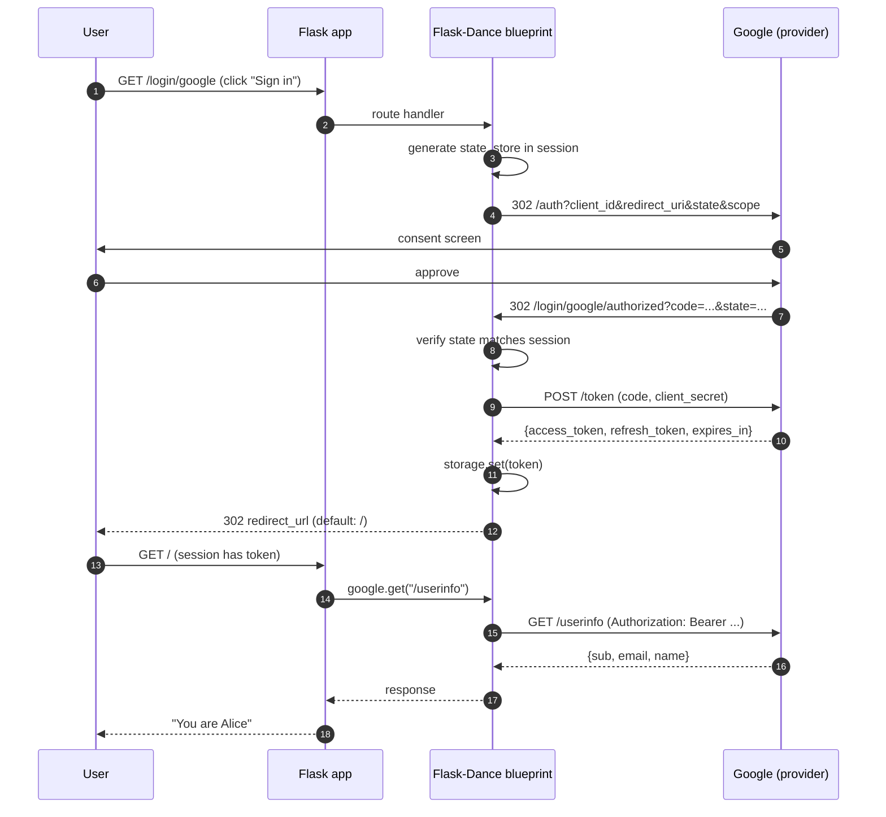
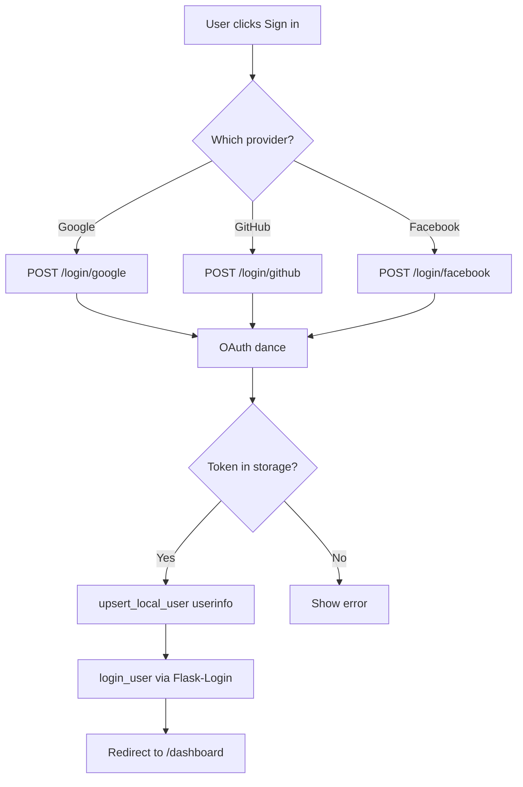
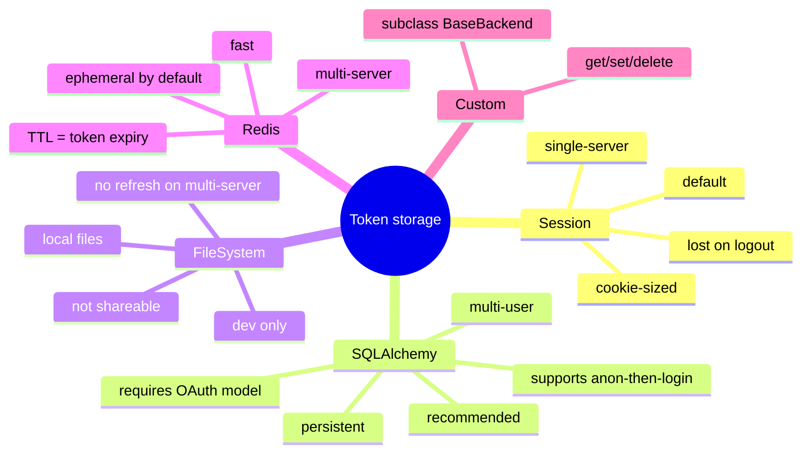
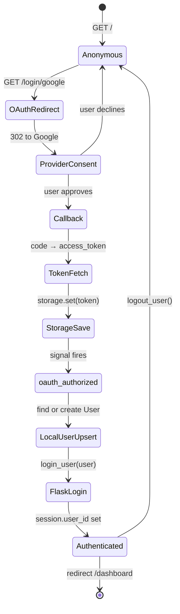
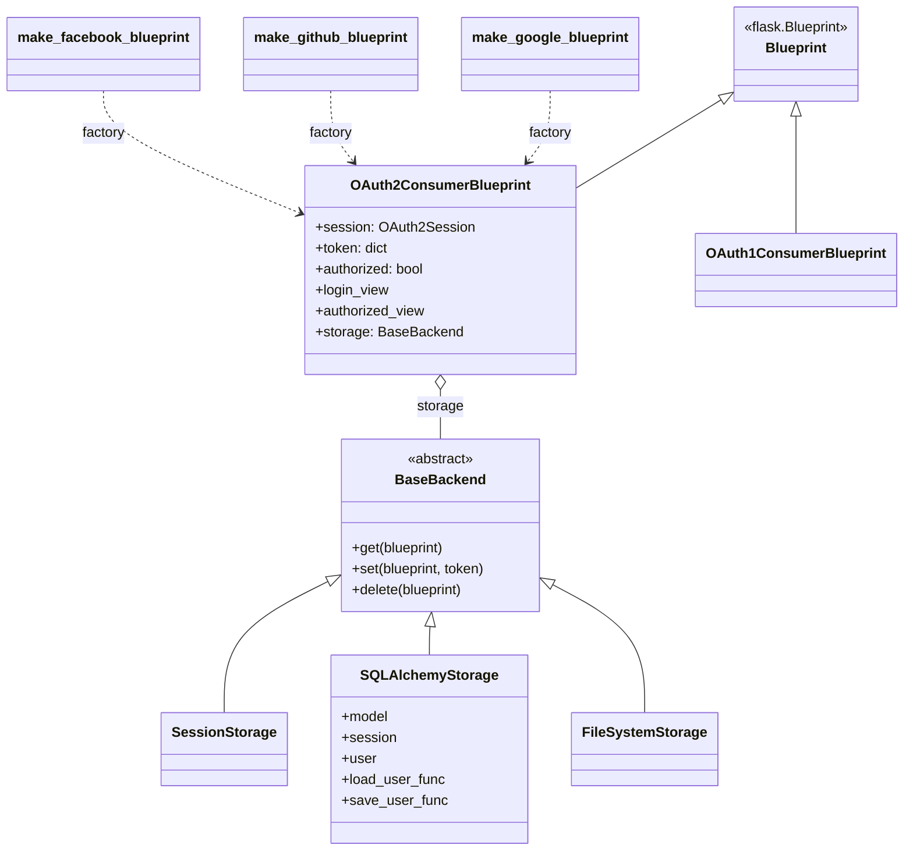
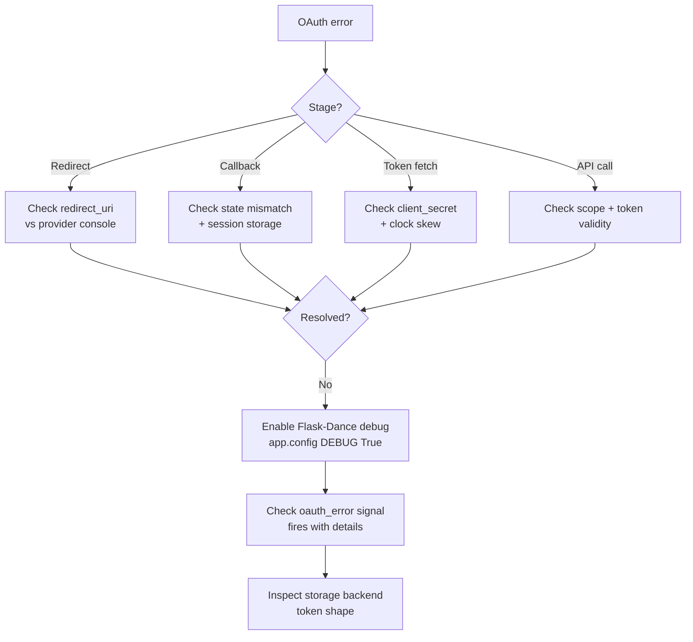
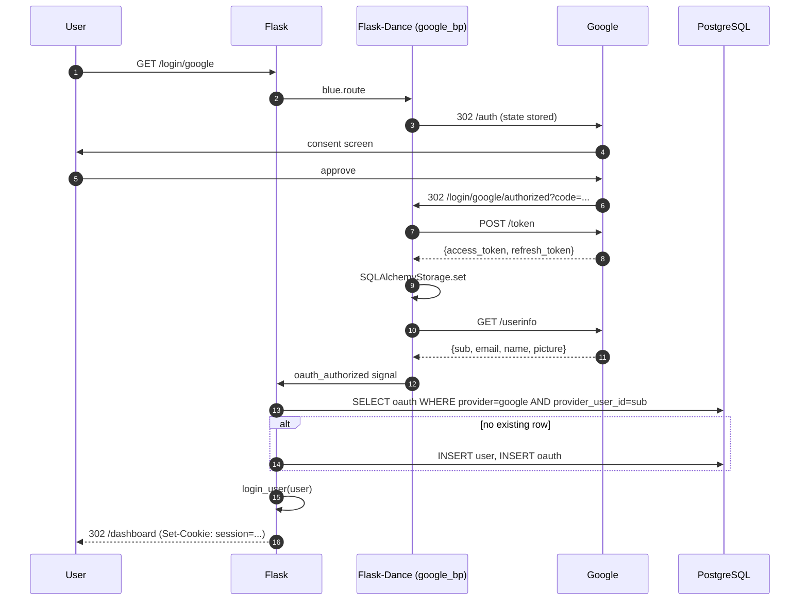

# Flask-Dance

#flask #authentication #oauth #oauth2 #social-login #google #github #security

> [!info] The pre-built OAuth blueprints library for Flask
> **Flask-Dance** provides ready-made Flask blueprints for dozens of OAuth providers — Google, GitHub, Twitter, Facebook, GitLab, Dropbox, Discord, Slack, Spotify, and many more. Each provider is one function call: `make_google_blueprint()`. Under the hood, each blueprint is an `OAuth2ConsumerBlueprint` that handles redirect URIs, state CSRF protection, token storage, and refresh for you.

Think of Flask-Dance as a **vending machine of OAuth blueprints**. Walk up, pick a provider (press the "Google" button), insert your `client_id` and `client_secret`, and out drops a fully wired Blueprint with `/login/google` and `/login/google/authorized` endpoints. By contrast, [[Flask-Authlib]] gives you a Swiss army knife — you have to assemble the flow yourself, but you can build any flow you want (including being an OAuth *provider*, which Flask-Dance cannot do).

---

## 1. Overview & Metaphor

### Why Flask-Dance exists

OAuth flows are repetitive: every provider has the same shape — redirect to consent → callback with `code` → exchange for `access_token` → call `/userinfo`. But every provider is also slightly different: different scope syntax, different userinfo URL, different ways to refresh tokens, different quirks around `state`. Flask-Dance packages up those quirks per-provider so you write **one line per provider** instead of fifty.

It's built on top of `requests-oauthlib` (which is itself built on `oauthlib` + `requests`). It does **not** implement JOSE, JWT, or being an OAuth server — for those use [[Flask-Authlib]].

### What Flask-Dance does NOT do

| Concern | Who handles it |
|---|---|
| OAuth 2.0 *server* (be a provider) | [[Flask-Authlib]] |
| OpenID Connect (ID token validation) | [[Flask-Authlib]] (Flask-Dance uses OAuth2 only) |
| JWT signing/verification | [[Flask-Authlib]] or [[Flask-JWT-Extended]] |
| Session management for your users | [[Flask-Login]] |
| Token auth on your own API | [[Flask-HTTPAuth]] |
| Role-based permissions | [[Flask-Principal]] |
| Server-side session storage | [[Flask-Session]] |

### Flask-Dance vs Authlib (client side)

| Feature | Flask-Dance | [[Flask-Authlib]] |
|---|---|---|
| Pre-built provider blueprints | ✅ 30+ providers | ❌ you write `oauth.register(name=...)` |
| Token storage backends | ✅ SQLAlchemy / session / filesystem | ❌ you write `fetch_token`/`update_token` |
| Local user model binding | ✅ `backend` writes to `User.oauth_tokens` | ❌ you wire it up |
| OAuth 1.0 client | ⚠️ legacy only (`make_twitter_blueprint` was OAuth 1) | ✅ |
| OIDC ID-token validation | ❌ | ✅ |
| Be an OAuth provider | ❌ | ✅ |
| Best for | Quick "log in with X" | Multi-provider + provider-side |

> [!tip] The metaphor
> Flask-Dance is a **key-cutting machine**. Each provider is a different brand of lock — Google's lock uses a 7-pin tumbler, GitHub's uses a 5-pin, Twitter's uses a dimple key. You don't want to learn every brand; you just want a key that opens one. Walk up to the machine, press the Google button, insert your `client_id` blank, and out pops a finished key. You don't get to design a new kind of lock (use Authlib for that), but for "log in with Google", you get a key in 30 seconds.

---

## 2. Installation

```bash
(venv) $ pip install Flask-Dance
```

For SQLAlchemy-backed token storage (recommended for production):

```bash
(venv) $ pip install Flask-Dance[sqla]
```

For the Google blueprint (which uses `oauthlib`'s scope validator):

```bash
(venv) $ pip install Flask-Dance[google]
```

Or all extras at once:

```bash
(venv) $ pip install "Flask-Dance[sqla,redis]"
```

Versions referenced in this note:

| Package | Version |
|---|---|
| Flask | 3.0.x |
| Flask-Dance | 7.0.x |
| Flask-SQLAlchemy | 3.1.x |
| oauthlib | 3.2.x |
| requests-oauthlib | 1.3.x |

> [!warning] Flask-Dance 7.x vs 6.x
> 7.x dropped Python 3.7 support and removed the deprecated `make_twitter_blueprint` (Twitter/X has effectively killed free OAuth 1.0a API access). If you have old code using Twitter OAuth 1.0a, you'll need to migrate to OAuth 2.0 or pin Flask-Dance 6.x.

---

## 3. Configuration

### Minimal Google login

```python
# app/extensions.py
from flask_dance.contrib.google import make_google_blueprint

google_bp = make_google_blueprint(
    client_id=os.environ["GOOGLE_OAUTH_CLIENT_ID"],
    client_secret=os.environ["GOOGLE_OAUTH_CLIENT_SECRET"],
    scope=["openid", "email", "profile"],
    offline=True,           # request a refresh token
    reprompt_consent=True,  # force Google to show the consent screen every time
)
```

```python
# app/__init__.py
from flask import Flask, redirect, url_for
from app.extensions import google_bp
from flask_dance.contrib.google import google

def create_app() -> Flask:
    app = Flask(__name__)
    app.config["SECRET_KEY"] = "change-me"
    app.config["SESSION_TYPE"] = "filesystem"

    app.register_blueprint(google_bp, url_prefix="/login")

    @app.route("/")
    def index():
        if not google.authorized:
            return '<a href="/login/google">Sign in with Google</a>'
        resp = google.get("/oauth2/v2/userinfo")
        return f"You are {resp.json()['name']}"

    return app
```

### Common `make_*_blueprint` parameters

| Parameter | Type | Description |
|---|---|---|
| `client_id` | `str` | OAuth client ID. If omitted, read from `app.config["<PROVIDER>_OAUTH_CLIENT_ID"]`. |
| `client_secret` | `str` | OAuth client secret. Same auto-config behaviour. |
| `scope` | `list[str]` \| `str` | OAuth scopes to request. |
| `redirect_url` | `str` | URL to redirect to *after* the OAuth dance completes (inside your app). Mutually exclusive with `redirect_to`. |
| `redirect_to` | `str` | Flask endpoint name to redirect to after OAuth completes. |
| `login_url` | `str` | The URL of the "start OAuth" view. Default `/google`. |
| `authorized_url` | `str` | The URL of the OAuth callback view. Default `/google/authorized`. |
| `offline` | `bool` | If True, request a refresh token (Google: `access_type=offline`). |
| `reprompt_consent` | `bool` | Force the consent screen on every login. |
| `storage` | `BaseBackend` | Token storage backend (see §5). Default: `LocalStorage` (session). |
| `rule_kwargs` | `dict` | Extra kwargs passed to `app.add_url_rule` for both endpoints. |

### Provider discovery via environment

Most `make_*` functions auto-read config keys. Naming convention:

```bash
export GOOGLE_OAUTH_CLIENT_ID="..."
export GOOGLE_OAUTH_CLIENT_SECRET="..."
export GITHUB_OAUTH_CLIENT_ID="..."
export GITHUB_OAUTH_CLIENT_SECRET="..."
```

Then in Python you can omit them entirely:

```python
google_bp = make_google_blueprint(scope=["openid", "email", "profile"])
github_bp = make_github_blueprint(scope="user:email")
```

> [!tip] Keep secrets out of source
> Use a `.env` file with `python-dotenv` in dev, and your platform's secret store (AWS Secrets Manager, GCP Secret Manager, etc.) in production. Never commit `client_secret` to git.

---

## 4. Basic Usage

### 4.1 The OAuth 2.0 flow with Flask-Dance



### 4.2 The `google` proxy

Flask-Dance exposes a `requests.Session`-like object per provider, named after the blueprint:

```python
from flask_dance.contrib.google import google

@app.route("/profile")
def profile():
    if not google.authorized:
        return redirect(url_for("google.login"))

    resp = google.get("/oauth2/v2/userinfo")
    if not resp.ok:
        return "Failed to fetch user info", 502

    info = resp.json()
    return f"Hello {info['name']} ({info['email']})"
```

`google` is a `LocalProxy` to the `OAuth2Session` for the current request. `google.authorized` is `True` if a valid token is in storage. `google.get/post/put/...` automatically attach the `Authorization: Bearer ...` header.

### 4.3 Calling provider APIs

```python
# GitHub: list the user's repositories
from flask_dance.contrib.github import github

@app.route("/repos")
def repos():
    if not github.authorized:
        return redirect(url_for("github.login"))
    resp = github.get("/user/repos?sort=updated&per_page=10")
    repos = resp.json()
    return render_template("repos.html", repos=repos)
```

```python
# Spotify: get the user's top tracks
from flask_dance.contrib.spotify import spotify

@app.route("/top-tracks")
def top_tracks():
    resp = spotify.get("/v1/me/top/tracks?limit=5&time_range=short_term")
    tracks = resp.json()["items"]
    return render_template("tracks.html", tracks=tracks)
```

### 4.4 Multi-provider setup

```python
# app/extensions.py
from flask_dance.contrib.google import make_google_blueprint
from flask_dance.contrib.github import make_github_blueprint
from flask_dance.contrib.facebook import make_facebook_blueprint
from flask_dance.contrib.gitlab import make_gitlab_blueprint

google_bp   = make_google_blueprint(scope=["openid", "email", "profile"])
github_bp   = make_github_blueprint(scope="user:email")
facebook_bp = make_facebook_blueprint(scope=["email", "public_profile"])
gitlab_bp   = make_gitlab_blueprint(scope="read_user")
```

```python
# app/__init__.py
def create_app():
    app = Flask(__name__)
    app.register_blueprint(google_bp,   url_prefix="/login/google")
    app.register_blueprint(github_bp,   url_prefix="/login/github")
    app.register_blueprint(facebook_bp, url_prefix="/login/facebook")
    app.register_blueprint(gitlab_bp,   url_prefix="/login/gitlab")
    ...
```

```html
<!-- templates/login.html -->
<h2>Sign in with:</h2>
<a href="{{ url_for('google.login')   }}">Google</a>
<a href="{{ url_for('github.login')   }}">GitHub</a>
<a href="{{ url_for('facebook.login') }}">Facebook</a>
<a href="{{ url_for('gitlab.login')   }}">GitLab</a>
```

### 4.5 Multi-provider decision flow



---

## 5. Intermediate Patterns

### 5.1 Token storage backends

By default Flask-Dance stores the OAuth token in the Flask **session** (a cookie). This works for toy apps but breaks in production for two reasons: (1) the cookie is size-limited (≈4 KB), and a token + refresh + userinfo can exceed that; (2) the token is lost when the user clears cookies, which means silent re-authentication fails.

Flask-Dance ships three storage backends:

| Backend | Module | Use case |
|---|---|---|
| `SessionStorage` | `flask_dance.consumer.storage.session` | **Default.** Toy apps, single-server. |
| `SQLAlchemyStorage` | `flask_dance.consumer.storage.sqla` | **Recommended.** Persistent, multi-user. |
| `FileSystemStorage` | `flask_dance.consumer.storage.file` | Local dev, no DB. |
| `RedisStorage` | `flask_dance.consumer.storage.redis` | Multi-server, fast, ephemeral. |

#### SQLAlchemy storage

```python
# app/models/oauth.py
from datetime import datetime
from flask_dance.consumer.storage.sqla import OAuthConsumerMixin
from app.extensions import db

class OAuth(OAuthConsumerMixin, db.Model):
    """One row per (user, provider). Stores provider + access_token + refresh_token."""
    __tablename__ = "oauth_tokens"
    user_id = db.Column(db.Integer, db.ForeignKey("users.id"), nullable=False)
    user = db.relationship("User", backref=db.backref("oauth_tokens", cascade="all, delete-orphan"))

    @property
    def provider_user_id(self):
        return self.provider_userinfo.get("id") if self.provider_userinfo else None
```

```python
# app/extensions.py
from flask_dance.consumer.storage.sqla import SQLAlchemyStorage
from app.models.oauth import OAuth

google_bp = make_google_blueprint(
    scope=["openid", "email", "profile"],
    storage=SQLAlchemyStorage(OAuth, db.session, user=current_user),
)
```

`SQLAlchemyStorage(OAuth, db.session, user=current_user)` does three things:
1. When a token is acquired, it inserts/updates a row in the `oauth` table scoped to `current_user`.
2. When a request comes in and Flask-Dance needs the token, it queries `OAuth` for `(user=current_user, provider="google")`.
3. When the provider refreshes the token, the row is updated in place.

> [!warning] `user=current_user` is a `LocalProxy`
> You must pass `current_user` (not `current_user._get_current_object()`) and `db.session` (not `db.session()`) so the storage backend resolves them at request time, not at import time.

#### Anonymous users (login flow)

Before the OAuth dance, there is no `current_user`. You need a "load by provider user ID" callback so the storage can find an existing row even when the user hasn't logged in yet:

```python
from flask_dance.consumer import oauth_authorized

@google_bp.before_app_request
def google_logged_in():
    pass  # see next section

@oauth_authorized.connect_via(google_bp)
def google_logged_in(blueprint, token):
    # 1. Fetch userinfo from Google
    resp = blueprint.session.get("/oauth2/v2/userinfo")
    userinfo = resp.json()

    # 2. Find or create a local user
    user = upsert_user_from_google(userinfo)

    # 3. Log them in via Flask-Login
    login_user(user)

    # 4. Return False to prevent Flask-Dance from saving the token in the session
    #    (the SQLAlchemyStorage already saved it via user=current_user)
    return False
```

### 5.2 The `oauth_authorized` signal

Flask-Dance emits signals at every stage of the OAuth dance. The most useful is `oauth_authorized`, fired after the token is fetched but before the storage backend saves it.

```python
from flask_dance.consumer import oauth_authorized, oauth_error
from flask_login import login_user

@oauth_authorized.connect_via(github_bp)
def github_logged_in(blueprint, token):
    if not token:
        flash("Failed to log in with GitHub.", category="error")
        return False

    resp = blueprint.session.get("/user")
    if not resp.ok:
        flash("Failed to fetch GitHub user info.", category="error")
        return False

    github_info = resp.json()
    github_user_id = str(github_info["id"])

    # Find existing OAuth row, or create one + a user
    oauth = OAuth.query.filter_by(
        provider=blueprint.name, provider_user_id=github_user_id,
    ).first()
    if oauth is None:
        user = User(email=github_info["email"] or f"{github_info['login']}@users.noreply.github.com",
                    name=github_info["name"] or github_info["login"])
        oauth = OAuth(provider=blueprint.name, provider_user_id=github_user_id, user=user)
        db.session.add_all([user, oauth])
    else:
        user = oauth.user

    db.session.commit()
    login_user(user)
    flash(f"Signed in as {user.email}.", category="success")

    # Return False so Flask-Dance doesn't double-save (storage backend will)
    return False

@oauth_error.connect_via(github_bp)
def github_error(blueprint, error, error_description=None, error_uri=None):
    msg = f"OAuth error from {blueprint.name}: {error} — {error_description}"
    flash(msg, category="error")
```

### 5.3 Backend selection mindmap



---

## 6. Advanced Usage

### 6.1 Custom provider (any OAuth 2.0 server)

Flask-Dance ships `make_*` functions for ~30 providers, but you can wire any OAuth 2.0 server with `OAuth2ConsumerBlueprint`:

```python
from flask_dance.consumer import OAuth2ConsumerBlueprint

acme_bp = OAuth2ConsumerBlueprint(
    "acme", __name__,
    client_id=os.environ["ACME_CLIENT_ID"],
    client_secret=os.environ["ACME_CLIENT_SECRET"],
    scope=["read", "write"],
    base_url="https://api.acme.example.com/",
    authorization_url="https://auth.acme.example.com/oauth/authorize",
    token_url="https://auth.acme.example.com/oauth/token",
    redirect_url="/dashboard",
)
# Use acme_bp.session.get("/v1/widgets") in views.
```

### 6.2 Refreshing tokens automatically

If you requested `offline=True`, the provider returns a `refresh_token`. Flask-Dance auto-refreshes expired tokens when the storage backend supports it (SQLAlchemy does; Session does too):

```python
# Tokens auto-refresh on the next google.get(...) call after expiry.
# The refreshed token is saved back to storage automatically.
```

For manual refresh:

```python
from flask_dance.consumer import oauth_refresh
token = google_bp.session.refresh_token(url_for("google.token", _external=True))
```

### 6.3 Combining with [[Flask-Login]] — full state diagram



### 6.4 Per-request token override

For server-to-server calls where you don't want to clobber the user's token, use a fresh session:

```python
from oauthlib.oauth2 import BackendApplicationClient
from requests_oauthlib import OAuth2Session

client = BackendApplicationClient(client_id=SERVICE_ACCOUNT_ID)
service_session = OAuth2Session(client=client)
service_session.fetch_token(
    token_url="https://oauth2.googleapis.com/token",
    client_id=SERVICE_ACCOUNT_ID,
    client_secret=SERVICE_ACCOUNT_SECRET,
    scope=["https://www.googleapis.com/auth/cloud-platform"],
)
# Use service_session.get(...) for service-account calls
```

### 6.5 Grouping providers in a blueprint class diagram



---

## 7. Common Pitfalls & Troubleshooting

| Symptom | Likely cause | Fix |
|---|---|---|
| `MismatchingStateError` | Session lost between the authorize redirect and the callback. Often because the cookie is too large or the server rotated `SECRET_KEY`. | Use [[Flask-Session]] server-side storage, or shrink the cookie by using SQLAlchemy token storage. |
| `Token is None` after `authorized` | `oauth_authorized` signal handler returned `False` but no SQLAlchemy storage was configured to save it. | Configure `storage=SQLAlchemyStorage(...)`, OR return `None` from the signal handler. |
| `redirect_uri_mismatch` | The URL you registered with the provider differs by trailing slash, port, or scheme from the one Flask generates. | Print `url_for("google.authorized", _external=True)` and paste it exactly into the provider console. |
| `401 invalid_client` | Wrong `client_id`/`client_secret` pair, or the env vars are not set in the current process. | `print(os.environ.get("GOOGLE_OAUTH_CLIENT_ID"))` to verify. Restart the shell after `export`. |
| Cookie overflow (4xx, "Cookie too large") | Default `SessionStorage` puts the entire token JSON in the cookie. | Switch to `SQLAlchemyStorage` (§5.1). |
| Token works once, then 401s | The provider invalidated the token after one use but Flask-Dance didn't notice. | Ensure `offline=True` was set so a `refresh_token` is available, and the storage backend supports refresh. |
| Login works but `current_user` is anonymous | You forgot to call `login_user(user)` in the `oauth_authorized` handler, or you returned `False` before doing so. | Call `login_user()` first, then `return False`. |
| `oauth_authorized` fires twice | The signal is connected both via `@oauth_authorized.connect_via(bp)` and via `@bp.before_app_request`. | Pick one. The decorator is the recommended pattern. |
| Twitter OAuth 1.0a no longer works | Flask-Dance 7 removed `make_twitter_blueprint`. | Use OAuth 2.0 with `OAuth2ConsumerBlueprint` for Twitter, or pin to Flask-Dance 6.x. |
| Multiple providers clobber each other | All blueprints use the default `SessionStorage` and write to the same `oauth_token` session key. | Use a per-provider key by subclassing the backend, or use `SQLAlchemyStorage` which keys on `(user, provider)`. |

### Troubleshooting flowchart



> [!danger] Don't return `True` from `oauth_authorized` unless you mean it
> Returning a truthy value tells Flask-Dance to skip its default storage. That's correct when you've already saved the token in your own backend. Returning `True` *by accident* (e.g., returning the result of `db.session.commit()`, which is `None`) will leave you with no token saved.

---

## 8. Best Practices

1. **Always use SQLAlchemy storage in production.** The default session storage breaks the moment you add a second user, a second server, or a token larger than the cookie limit.
2. **Connect `oauth_authorized` for every provider.** This is where you upsert your local `User` and call `login_user`. Without it, `google.authorized` will be true but `current_user` will still be anonymous.
3. **Return `False` from `oauth_authorized` when using a backend.** Otherwise Flask-Dance writes to *both* the backend and the session.
4. **Use `offline=True` for long-lived access.** Without a refresh token, your user must re-authorize every hour (Google's access token lifetime).
5. **Map provider user IDs, not emails, to local users.** Emails change; provider user IDs don't. Use `OAuth(provider_user_id=...)` as your join key.
6. **Set `reprompt_consent=True` for shared machines.** Otherwise the consent screen only appears once and any user on that browser is silently logged in.
7. **Use a per-provider `url_prefix`.** `/login/google`, `/login/github`, etc. — it makes routing explicit and avoids endpoint-name clashes.
8. **Don't trust `email` as identity without verification.** GitHub lets you push any email to your account. Use the `/user/emails` endpoint with `verified=true` filter, or use Google's `email_verified` claim from the ID token.
9. **Handle `oauth_error` signals globally.** A 429 from the provider during a token refresh will otherwise cause an unhandled exception in a background request.
10. **Rotate `client_secret`s periodically.** Most providers support multiple concurrent secrets during rotation. Add the new one, deploy, then delete the old one a week later.
11. **Scope minimally.** Don't request `repo` from GitHub if you only need `user:email`. Each scope is a liability surface.
12. **Test with a sandbox provider account.** Most providers offer a "test mode" or rate-limit-free sandbox; use it for CI.

---

## 9. Integration with Other Extensions

### [[Flask-Login]]

The canonical pattern: Flask-Dance does OAuth, Flask-Login does sessions.

```python
from flask_login import LoginManager, login_user, current_user, logout_user

login_manager = LoginManager()

@login_manager.user_loader
def load_user(user_id):
    return db.session.get(User, int(user_id))

@oauth_authorized.connect_via(google_bp)
def google_logged_in(blueprint, token):
    user = upsert_user_from_google(blueprint.session.get("/oauth2/v2/userinfo").json())
    login_user(user)
    return False

@app.route("/logout")
@login_required
def logout():
    logout_user()
    # Optionally revoke the OAuth token
    if google.authorized:
        google.post("/oauth2/v2/revoke", params={"token": google.access_token})
        google_bp.storage.delete(google_bp)
    return redirect(url_for("index"))
```

### [[Flask-Authlib]]

Use Flask-Dance for "log in with X" (client) and Authlib for being your own OAuth provider. They coexist fine — just keep blueprint URL prefixes separate.

### [[Flask-SQLAlchemy]]

Required for `SQLAlchemyStorage`. The `OAuthConsumerMixin` adds `provider`, `provider_user_id`, `access_token`, `refresh_token`, `expires_at`, etc. — see `flask_dance.consumer.storage.sqla`.

### [[Flask-Session]]

Strongly recommended when using the default `SessionStorage` — Flask's signed cookie is bounded at ≈4 KB. Switch to `SESSION_TYPE="redis"` for any multi-user deployment.

### [[Flask-Limiter]]

Rate-limit the OAuth callback to prevent login-bombing:

```python
from flask_limiter import Limiter
limiter = Limiter(key_func=get_remote_address)

@app.route("/login/google/authorized")
@limiter.limit("5/minute")
def google_authorized():
    ...
```

---

## 10. Real-World Example: Multi-Provider Social Login

A complete app that lets users sign in with Google, GitHub, or GitLab, links each provider to a single local account, and stores OAuth tokens in PostgreSQL.

```python
# app/models.py
from flask_login import UserMixin
from flask_dance.consumer.storage.sqla import OAuthConsumerMixin
from app.extensions import db

class User(UserMixin, db.Model):
    __tablename__ = "users"
    id = db.Column(db.Integer, primary_key=True)
    email = db.Column(db.String(255), unique=True, nullable=False)
    name = db.Column(db.String(255), nullable=False)
    avatar_url = db.Column(db.String(512))
    created_at = db.Column(db.DateTime, default=datetime.utcnow)

class OAuth(OAuthConsumerMixin, db.Model):
    __tablename__ = "oauth_tokens"
    user_id = db.Column(db.Integer, db.ForeignKey("users.id", ondelete="CASCADE"))
    user = db.relationship(User, backref=db.backref("oauth_tokens", cascade="all, delete-orphan"))
```

```python
# app/extensions.py
import os
from flask_dance.contrib.google import make_google_blueprint
from flask_dance.contrib.github import make_github_blueprint
from flask_dance.contrib.gitlab import make_gitlab_blueprint
from flask_dance.consumer.storage.sqla import SQLAlchemyStorage
from flask_login import current_user
from app.extensions import db
from app.models import OAuth, User

google_bp = make_google_blueprint(
    scope=["openid", "email", "profile"],
    storage=SQLAlchemyStorage(OAuth, db.session, user=current_user),
)
github_bp = make_github_blueprint(
    scope=["user:email", "read:user"],
    storage=SQLAlchemyStorage(OAuth, db.session, user=current_user),
)
gitlab_bp = make_gitlab_blueprint(
    scope="read_user",
    storage=SQLAlchemyStorage(OAuth, db.session, user=current_user),
)
```

```python
# app/auth.py
from flask import Blueprint, redirect, url_for, flash
from flask_dance.consumer import oauth_authorized, oauth_error
from flask_login import login_user, current_user, logout_user, login_required
from app.extensions import db
from app.models import User, OAuth

auth_bp = Blueprint("auth", __name__)

def upsert_user(provider, provider_user_id, userinfo):
    oauth = OAuth.query.filter_by(
        provider=provider, provider_user_id=provider_user_id,
    ).first()
    if oauth is not None:
        # update stored profile fields if changed
        user = oauth.user
        user.email = userinfo.get("email", user.email)
        user.name = userinfo.get("name", user.name)
        user.avatar_url = userinfo.get("avatar_url") or userinfo.get("picture")
        db.session.commit()
        return user

    # New link — but maybe user already logged in via another provider?
    if current_user.is_authenticated:
        user = current_user
    else:
        user = User(
            email=userinfo["email"],
            name=userinfo.get("name", userinfo["email"]),
            avatar_url=userinfo.get("avatar_url") or userinfo.get("picture"),
        )
        db.session.add(user)
        db.session.commit()

    oauth = OAuth(provider=provider, provider_user_id=provider_user_id, user=user)
    db.session.add(oauth)
    db.session.commit()
    return user


@oauth_authorized.connect_via(google_bp)
def google_logged_in(blueprint, token):
    if not token:
        flash("Google did not return a token.", "error")
        return False
    resp = blueprint.session.get("/oauth2/v2/userinfo")
    if not resp.ok:
        flash("Failed to fetch Google user info.", "error")
        return False
    info = resp.json()
    user = upsert_user("google", info["sub"], {
        "email": info["email"], "name": info["name"], "picture": info["picture"],
    })
    login_user(user)
    flash(f"Signed in with Google as {user.email}.", "success")
    return False


@oauth_authorized.connect_via(github_bp)
def github_logged_in(blueprint, token):
    if not token:
        return False
    user_resp = blueprint.session.get("/user")
    emails_resp = blueprint.session.get("/user/emails")
    info = user_resp.json()
    primary_verified = next(
        (e for e in emails_resp.json() if e["primary"] and e["verified"]), None
    )
    if not primary_verified:
        flash("No verified primary email on GitHub.", "error")
        return False
    user = upsert_user("github", str(info["id"]), {
        "email": primary_verified["email"],
        "name": info.get("name") or info["login"],
        "avatar_url": info["avatar_url"],
    })
    login_user(user)
    flash(f"Signed in with GitHub as {user.email}.", "success")
    return False


@oauth_authorized.connect_via(gitlab_bp)
def gitlab_logged_in(blueprint, token):
    if not token:
        return False
    info = blueprint.session.get("/api/v4/user").json()
    user = upsert_user("gitlab", str(info["id"]), {
        "email": info["email"], "name": info["name"], "avatar_url": info["avatar_url"],
    })
    login_user(user)
    return False


@auth_bp.route("/logout")
@login_required
def logout():
    logout_user()
    flash("Signed out.", "info")
    return redirect(url_for("index"))
```

```python
# app/__init__.py
def create_app():
    app = Flask(__name__)
    app.config["SECRET_KEY"] = os.environ["SECRET_KEY"]
    app.config["SQLALCHEMY_DATABASE_URI"] = os.environ["DATABASE_URL"]

    db.init_app(app)
    login_manager.init_app(app)
    from app.extensions import google_bp, github_bp, gitlab_bp
    app.register_blueprint(google_bp, url_prefix="/login/google")
    app.register_blueprint(github_bp, url_prefix="/login/github")
    app.register_blueprint(gitlab_bp, url_prefix="/login/gitlab")
    app.register_blueprint(auth_bp)
    return app
```

### Full sequence



---

## 11. References

- **Official docs**: <https://flask-dance.readthedocs.io/>
- **Provider list**: <https://flask-dance.readthedocs.io/en/latest/providers.html>
- **Storage backends**: <https://flask-dance.readthedocs.io/en/latest/storages.html>
- **Signals**: <https://flask-dance.readthedocs.io/en/latest/signals.html>
- **GitHub**: <https://github.com/singingwolfboy/flask-dance>
- **Built on**: `requests-oauthlib` (<https://requests-oauthlib.readthedocs.io/>) · `oauthlib` (<https://oauthlib.readthedocs.io/>)
- **Related notes**: [[Flask-Login]] · [[Flask-Authlib]] · [[Flask-SQLAlchemy]] · [[Flask-Session]] · [[Flask-Limiter]] · [[Security-Best-Practices]]
