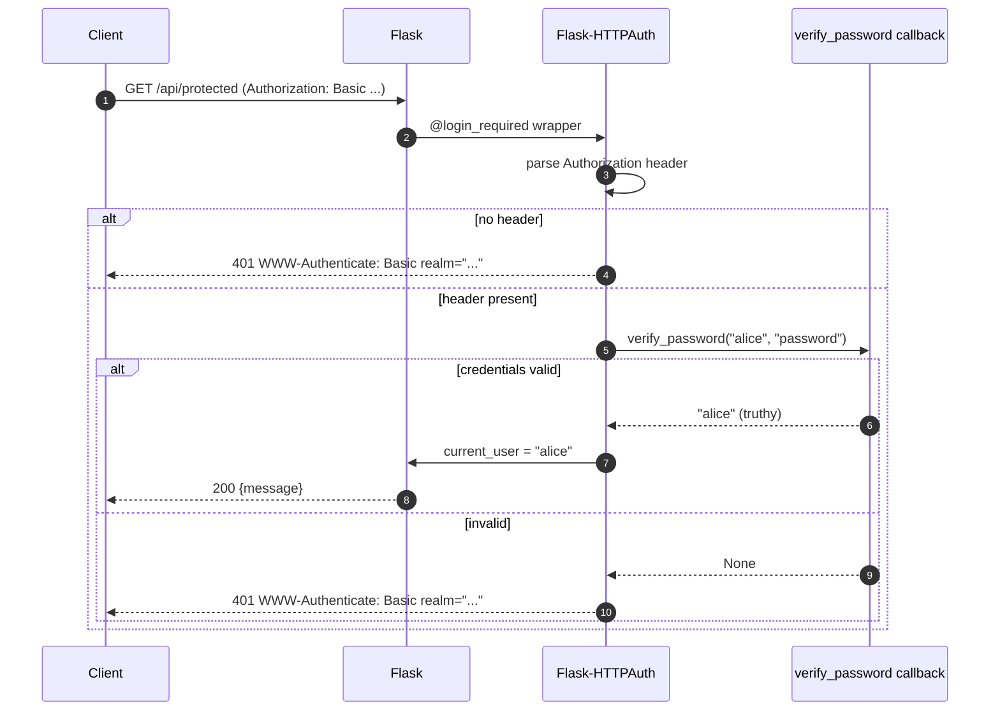
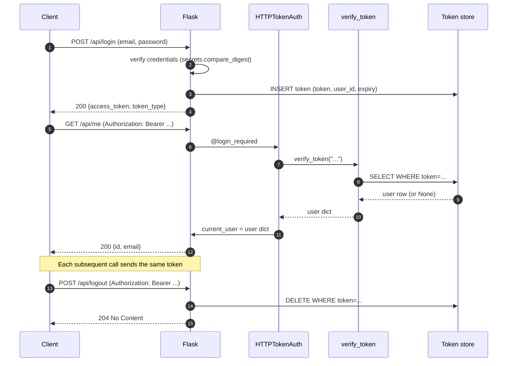
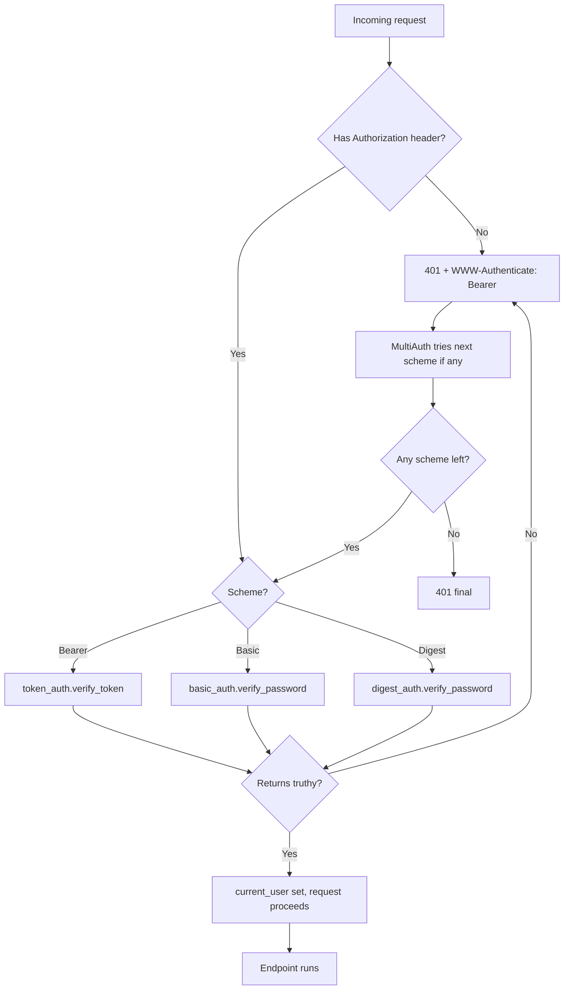
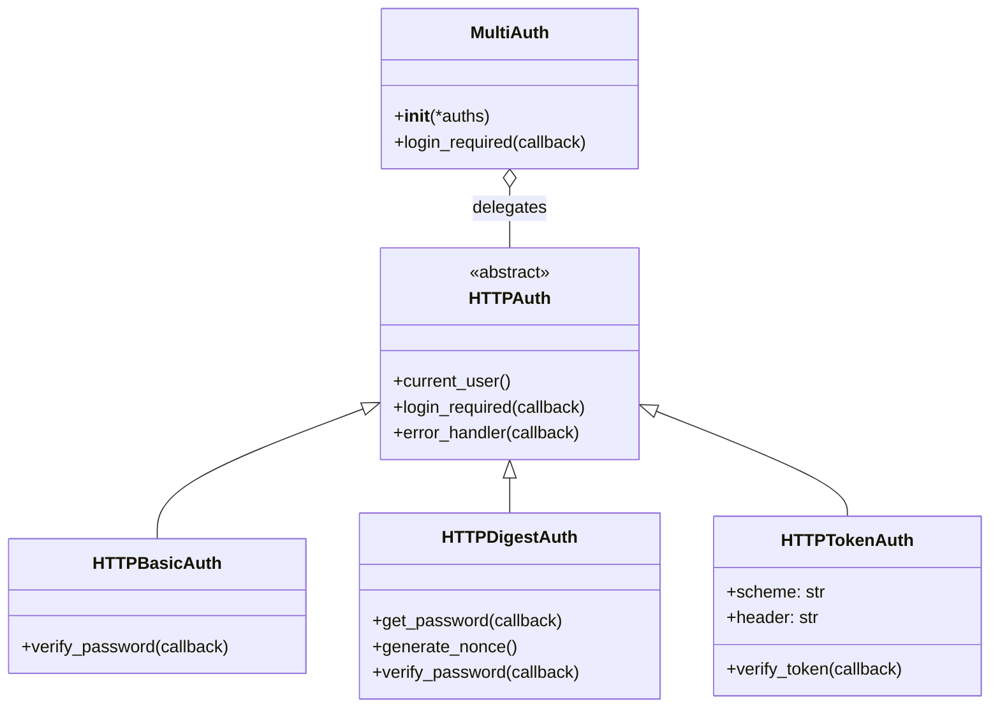
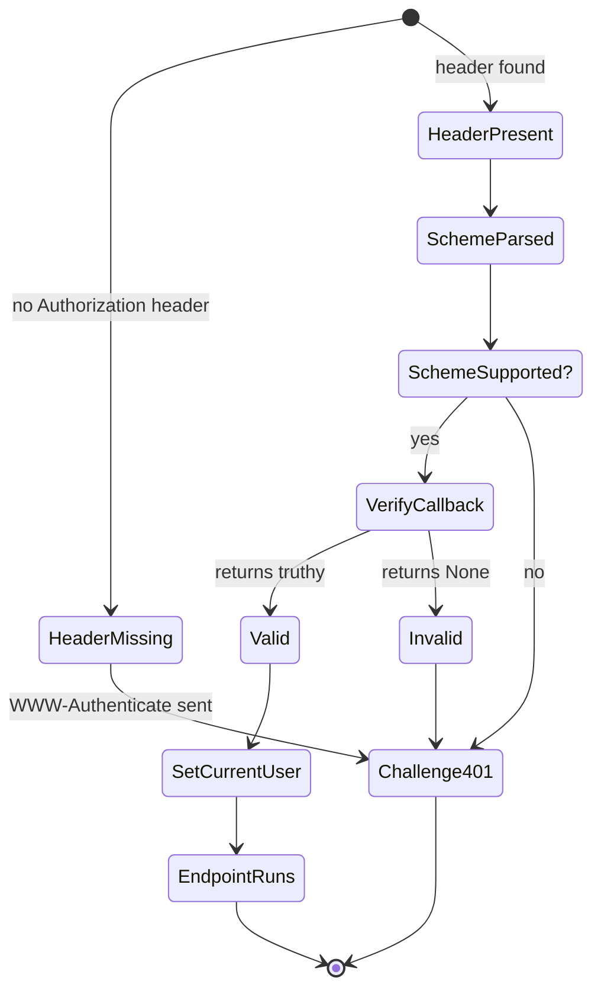
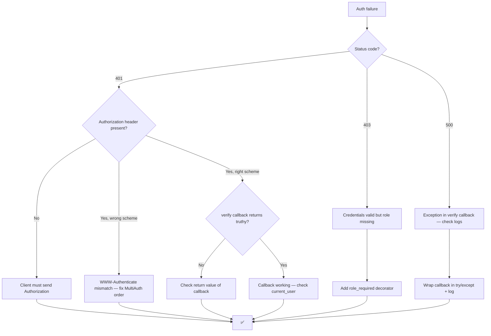
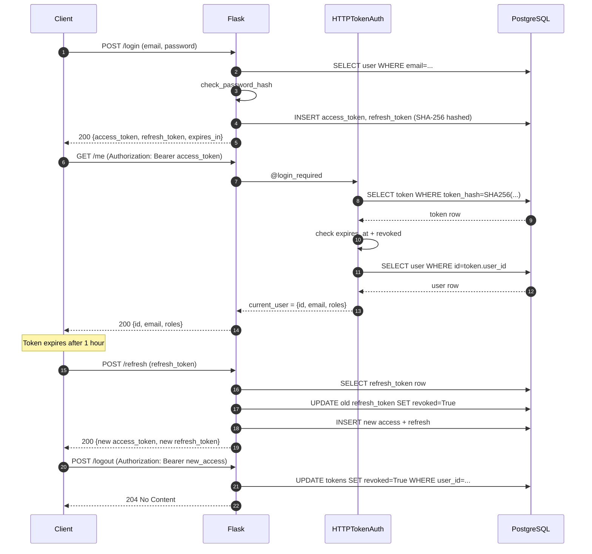

# Flask-HTTPAuth

#flask #authentication #http #basic-auth #digest-auth #token-auth #api #security

> [!info] HTTP protocol-level authentication for Flask APIs
> **Flask-HTTPAuth** provides HTTP Basic, Digest, and Token authentication for Flask applications. Unlike [[Flask-Login]] (which is session-based and cookie-based) or [[Flask-JWT-Extended]] (which is a full JWT/OAuth framework), Flask-HTTPAuth implements the **raw HTTP `WWW-Authenticate` / `Authorization` headers** as defined by RFC 7617 (Basic), RFC 7616 (Digest), and RFC 6750 (Bearer). It is the lightest possible way to protect a Flask API.

Think of Flask-HTTPAuth as a **gate guard who only checks ID cards**. There's no membership database, no wristband, no logbook — just "show me a valid card and I'll let you through". The card can be a username+password (Basic), a hashed challenge response (Digest), or an opaque string (Token). Flask-HTTPAuth reads the card from the `Authorization` header, hands it to a callback you write, and either lets the request through or returns `401 Unauthorized` with the correct `WWW-Authenticate` challenge.

---

## 1. Overview & Metaphor

### Why HTTP auth?

Session cookies (used by [[Flask-Login]]) are great for browser apps but awkward for APIs:

- APIs are usually called by other programs, not browsers. Cookies require a "cookie jar" client-side.
- Cookies are vulnerable to CSRF unless you also add CSRF tokens, doubling the complexity.
- APIs are often stateless and horizontally scalable — there's no shared session store.
- Browsers' native `Authorization: Basic ...` prompt is fine for internal tools.

HTTP authentication (`Authorization` / `WWW-Authenticate` headers) solves this: it's stateless, framework-agnostic, and built into every HTTP client since 1996.

### The four classes

| Class | Header it sends | Header it reads | Use case |
|---|---|---|---|
| `HTTPBasicAuth` | `WWW-Authenticate: Basic realm="..."` | `Authorization: Basic base64(user:pass)` | Internal tools, simple APIs, dev/test |
| `HTTPDigestAuth` | `WWW-Authenticate: Digest realm=..., nonce=...` | `Authorization: Digest username=..., response=...` | Slightly safer than Basic over plain HTTP (still prefer HTTPS) |
| `HTTPTokenAuth` | `WWW-Authenticate: Bearer realm="..."` (customisable) | `Authorization: Bearer <token>` (or query string / cookie) | Stateless API tokens, mobile apps, machine-to-machine |
| `MultiAuth` | (delegates to one of the above) | (tries each in order) | Gradual migration, mixed client types |

### What Flask-HTTPAuth does NOT do

| Concern | Who handles it |
|---|---|
| Password hashing | `werkzeug.security` or `passlib` |
| Token issuance (login endpoint) | You write it; see §4.4 |
| Token revocation lists | You maintain a `revoked_tokens` table |
| JWT signing & validation | [[Flask-JWT-Extended]] (Flask-HTTPAuth can *use* a JWT via a custom verifier) |
| Role-based permissions | [[Flask-Principal]] |
| Rate limiting brute force | [[Flask-Limiter]] |
| Session management for browser users | [[Flask-Login]] |

### Flask-HTTPAuth vs alternatives

| Feature | Flask-HTTPAuth | [[Flask-Login]] | [[Flask-JWT-Extended]] |
|---|---|---|---|
| Transport | HTTP headers | Cookie | HTTP header (Bearer JWT) |
| Stateless | ✅ | ❌ (needs session store) | ✅ |
| Browser login form | ⚠️ (browser prompt only) | ✅ | ✅ |
| Built-in token expiry/refresh | ❌ | ❌ | ✅ |
| Built-in token issuance endpoint | ❌ | ❌ | ✅ (`/login`) |
| Best for | API tokens, dev tools | Web apps with forms | Modern SPA / mobile backends |

> [!tip] The metaphor
> Flask-HTTPAuth is a **bouncer with a clipboard of valid IDs**. The bouncer doesn't issue IDs — you (the developer) write a callback that says "is this ID valid?". The bouncer just collects IDs from the `Authorization` header and consults your callback. If the callback says "yes", the request goes through; if "no", the bouncer shouts `401` and tells the client what kind of ID to bring next time (`WWW-Authenticate: Bearer realm="..."`).

---

## 2. Installation

```bash
(venv) $ pip install Flask-HTTPAuth
```

Versions referenced in this note:

| Package | Version |
|---|---|
| Flask | 3.0.x |
| Flask-HTTPAuth | 4.8.x |

Pure Python, no native dependencies. If you want JWT-backed tokens, also install:

```bash
(venv) $ pip install PyJWT
```

> [!warning] Flask-HTTPAuth 4.x vs 3.x
> 4.x dropped Python 3.7 support, removed the deprecated `MultiAuth` keyword args (`__init__(basic_auth, token_auth)`), and introduced `HTTPTokenAuth`'s `header` callback for fully custom header parsing. The public API you actually use (`@auth.verify_password`, `@auth.login_required`) is unchanged.

---

## 3. Configuration

Flask-HTTPAuth reads **no** `app.config` keys directly — all configuration is via the auth object's attributes and decorators.

### `HTTPBasicAuth` constructor and attributes

```python
from flask_httpauth import HTTPBasicAuth
auth = HTTPBasicAuth()
```

| Attribute | Default | Description |
|---|---|---|
| `auth.error_handler` | (built-in) | Decorator: `@auth.error_handler` registers a custom 401 response. |
| `auth.verify_password` | (required) | Decorator: `@auth.verify_password` registers the callback that validates `(username, password)`. |
| `auth.get_password` | `None` | Deprecated legacy callback (use `verify_password` instead). |
| `auth.hash_password` | `None` | Deprecated legacy callback for hashing the password before comparison. |

### `HTTPTokenAuth` constructor and attributes

```python
from flask_httpauth import HTTPTokenAuth
token_auth = HTTPTokenAuth(scheme="Bearer")
```

| Attribute | Default | Description |
|---|---|---|
| `scheme` | `"Bearer"` | The scheme name in `WWW-Authenticate: <scheme> realm="..."`. Common: `"Bearer"`, `"Token"`. |
| `header` | `"Authorization"` | Which header to read. Override only if your client can't send `Authorization` (e.g., due to CORS preflight). |
| `auth.verify_token` | (required) | Decorator: `@auth.verify_token` registers the callback that validates a token string. |
| `auth.get_token` | `None` | Optional callback for issuing tokens (rare; usually you write a `/login` endpoint instead). |

### `HTTPDigestAuth` constructor

```python
from flask_httpauth import HTTPDigestAuth
digest = HTTPDigestAuth()
digest.generate_nonce()
digest.generate_opaque()
```

| Attribute | Default | Description |
|---|---|---|
| `realm` | `"Authentication Required"` | Realm shown in the challenge. |
| `qop` | `"auth"` | Quality of protection: `"auth"` (default) or `"auth-int"`. |
| `algorithm` | `"MD5"` | Hash algorithm. RFC 7616 also allows `"SHA-256"`. |
| `use_ha1_pw` | `False` | If True, your `get_password` callback returns `HA1 = H(user:realm:password)` instead of the plaintext password. |

> [!danger] Digest auth does not replace HTTPS
> Digest authentication protects the password from sniffing over plain HTTP, but it does **not** protect the response body. A man-in-the-middle can still tamper with the response. Always use HTTPS. Modern best practice is Basic + HTTPS or Token + HTTPS; Digest is mostly legacy.

---

## 4. Basic Usage

### 4.1 HTTP Basic auth

```python
# app/api/auth.py
from flask import Flask
from flask_httpauth import HTTPBasicAuth
from werkzeug.security import check_password_hash

app = Flask(__name__)
auth = HTTPBasicAuth()

# Mock user DB
USERS = {
    "alice": "$argon2id$..."  # generate_password_hash("password")
}

@auth.verify_password
def verify_password(username: str, password: str):
    if username in USERS and check_password_hash(USERS[username], password):
        return username
    return None

@auth.error_handler
def auth_error(status: int):
    return {"error": "Unauthorized"}, status

@app.route("/api/protected")
@auth.login_required
def protected():
    return {"message": f"Hello, {auth.current_user()}!"}

if __name__ == "__main__":
    app.run()
```

Test it:

```bash
$ curl -u alice:password http://localhost:5000/api/protected
{"message":"Hello, alice!"}

$ curl -u alice:wrong http://localhost:5000/api/protected
{"error":"Unauthorized"}   # 401
```

### 4.2 The verification flow



### 4.3 HTTP Token auth

```python
# app/api/token_auth.py
from flask_httpauth import HTTPTokenAuth
from itsdangerous import TimedJSONWebSignatureSerializer as Serializer  # legacy
# Or use PyJWT:
# import jwt; token = jwt.encode({"id": 42}, SECRET, algorithm="HS256")

token_auth = HTTPTokenAuth(scheme="Bearer")

# Mock token store: in real life, this is a DB table or signed JWT
TOKENS = {
    "abc123-secret-token": {"user_id": 42, "email": "alice@example.com"},
}

@token_auth.verify_token
def verify_token(token: str):
    return TOKENS.get(token)   # truthy on success, None on failure

@app.route("/api/me")
@token_auth.login_required
def me():
    user = token_auth.current_user()
    return {"id": user["user_id"], "email": user["email"]}
```

```bash
$ curl -H "Authorization: Bearer abc123-secret-token" http://localhost:5000/api/me
{"id":42,"email":"alice@example.com"}
```

### 4.4 Issuing tokens (the `/login` endpoint)

Flask-HTTPAuth does **not** issue tokens for you. Write your own `/login` endpoint that validates credentials and returns a token:

```python
import secrets
from flask import request, jsonify

# In-memory token store (replace with DB or signed JWT in production)
issued_tokens = {}   # token -> user_id

@app.route("/api/login", methods=["POST"])
def login():
    data = request.get_json()
    user = verify_credentials(data["email"], data["password"])
    if not user:
        return {"error": "Invalid credentials"}, 401

    token = secrets.token_urlsafe(32)
    issued_tokens[token] = user.id
    return {"access_token": token, "token_type": "Bearer"}
```

### 4.5 The full token lifecycle



### 4.6 HTTP Digest auth

```python
from flask_httpauth import HTTPDigestAuth

digest_auth = HTTPDigestAuth()

USERS = {"alice": "password123"}  # plaintext password (digest requires it)

@digest_auth.get_password
def get_pw(username: str):
    return USERS.get(username)

@app.route("/api/digest-protected")
@digest_auth.login_required
def digest_protected():
    return f"Hello, {digest_auth.username()}!"
```

```bash
$ curl --digest -u alice:password123 http://localhost:5000/api/digest-protected
Hello, alice!
```

The flow is two round-trips: the first request gets `401` with a `nonce`; the client hashes the password with the nonce and resends.

> [!warning] Digest auth requires storing plaintext passwords
> Classic RFC 2617 Digest requires your server to know the plaintext password (or the `HA1` hash of `username:realm:password`). This is incompatible with modern password hashing (bcrypt, argon2). If you must use Digest, set `use_ha1_pw=True` and store `HA1` per user — but really, just use Basic + HTTPS instead.

---

## 5. Intermediate Patterns

### 5.1 `MultiAuth` — combining schemes

`MultiAuth` tries each auth scheme in order. Useful for: (a) gradual migration from Basic to Token; (b) supporting both browser-native Basic and Bearer tokens for API clients.

```python
from flask_httpauth import MultiAuth

multi_auth = MultiAuth(token_auth, basic_auth)

@app.route("/api/data")
@multi_auth.login_required
def data():
    user = multi_auth.current_user()
    return {"user": user}
```

A request with `Authorization: Bearer <token>` is verified by `token_auth`. A request with `Authorization: Basic <base64>` falls through to `basic_auth`. If both fail, `MultiAuth` returns `401` with the first scheme's challenge.

### 5.2 Multi-auth decision flow



### 5.3 Custom error responses

By default Flask-HTTPAuth returns a plain-text 401. Most APIs want JSON:

```python
@auth.error_handler
def auth_error(status: int):
    return (
        jsonify({
            "error": "invalid_credentials",
            "message": "The Authorization header is missing or invalid.",
            "status": status,
        }),
        status,
        {"WWW-Authenticate": 'Bearer realm="api.example.com", error="invalid_token"'},
    )
```

### 5.4 Token in query string (for SSE / WebSocket / downloads)

Some clients (EventSource, file downloads) can't set custom headers. Flask-HTTPAuth supports token-as-query-parameter:

```python
@token_auth.verify_token
def verify_token(token: str):
    return TOKENS.get(token)

# Permit ?access_token=... on routes that need it
@app.route("/events")
@token_auth.login_required(parameter="access_token")
def events():
    ...
```

> [!warning] Tokens in URLs leak
> Tokens in query strings end up in nginx access logs, browser history, the `Referer` header to third-party sites, and proxy caches. Restrict this to specific routes (SSE, downloads) and rotate tokens frequently.

### 5.5 Token verification with JWT (PyJWT)

```python
import jwt
from flask import current_app
from flask_httpauth import HTTPTokenAuth

jwt_auth = HTTPTokenAuth(scheme="Bearer")

@jwt_auth.verify_token
def verify_jwt(token: str):
    try:
        payload = jwt.decode(
            token,
            current_app.config["JWT_PUBLIC_KEY"],
            algorithms=["RS256"],
            audience="api.example.com",
            issuer="https://auth.example.com",
        )
    except jwt.PyJWTError:
        return None
    # Optionally check a revocation list
    if is_revoked(payload["jti"]):
        return None
    return payload   # the entire claims dict becomes current_user
```

### 5.6 Optional authentication

Sometimes you want to allow anonymous access but still authenticate if credentials are present. Use a custom callback:

```python
@token_auth.verify_token
def verify_token(token: str):
    if not token:
        return None
    return TOKENS.get(token)

@app.route("/api/posts")
def list_posts():
    user = token_auth.current_user()   # None if anonymous
    if user and user.get("is_premium"):
        posts = Post.query.limit(100).all()
    else:
        posts = Post.query.filter_by(public=True).limit(20).all()
    return jsonify([p.to_dict() for p in posts])
```

---

## 6. Advanced Usage

### 6.1 Role-based access via `verify_*` return values

A common pattern: the `verify_*` callback returns the user object (truthy) on success, `None` on failure. You can extend this with a `role` argument to `@login_required`:

```python
from functools import wraps

def role_required(role: str):
    def decorator(f):
        @wraps(f)
        @token_auth.login_required
        def wrapper(*args, **kwargs):
            user = token_auth.current_user()
            if role not in user.get("roles", []):
                return {"error": "forbidden"}, 403
            return f(*args, **kwargs)
        return wrapper
    return decorator

@app.route("/api/admin/users")
@role_required("admin")
def admin_list_users():
    ...
```

For full RBAC, see [[Flask-Principal]].

### 6.2 Per-route scheme selection with MultiAuth

```python
from flask_httpauth import MultiAuth

# Browser users hit /api/admin with Basic (browser shows the prompt);
# API clients hit /api/data with Bearer tokens.
multi = MultiAuth(token_auth, basic_auth)

@app.route("/api/data")
@token_auth.login_required
def data(): ...

@app.route("/api/admin")
@multi.login_required
def admin(): ...
```

### 6.3 Custom header parsing

Some legacy clients send `X-Auth-Token: <token>` instead of `Authorization: Bearer <token>`:

```python
custom_auth = HTTPTokenAuth(scheme="Token", header="X-Auth-Token")

@custom_auth.verify_token
def verify(token):
    return TOKENS.get(token)
```

### 6.4 Class diagram: auth object composition



### 6.5 State machine: token verification



### 6.6 Anonymous + authenticated hybrid

```python
@token_auth.verify_token
def verify(token: str):
    if not token:
        return "anonymous"   # truthy — but a special sentinel
    return TOKENS.get(token) or None

@app.route("/api/feed")
@token_auth.login_required
def feed():
    user = token_auth.current_user()
    if user == "anonymous":
        return jsonify(Post.query.filter_by(public=True).limit(10).all())
    return jsonify(Post.query.filter_by(user_id=user["id"]).limit(50).all())
```

> [!danger] Don't use a real user ID as the "anonymous" sentinel
> Returning a falsy value (e.g., `0` or `""`) will be treated as authentication failure. Always pick a truthy sentinel like `"anonymous"` or a special `AnonymousUser` instance.

---

## 7. Common Pitfalls & Troubleshooting

| Symptom | Likely cause | Fix |
|---|---|---|
| `401` even with correct credentials | `verify_password`/`verify_token` returns `None` or `False`. Print the return value to confirm. | Make sure your callback returns a **truthy** value (the user object, a username string, anything truthy). `0` and `""` are falsy! |
| Browser shows the Basic prompt twice | The browser is prefetching or the response sets `WWW-Authenticate` even on success. | Don't set `WWW-Authenticate` in 200 responses. Only the error handler should set it. |
| `WWW-Authenticate: Bearer` returned even when client sent `Basic` | Using `MultiAuth` but the first scheme in the list is `token_auth`. | Order `MultiAuth(basic_auth, token_auth)` so the matching scheme is tried first. |
| Token works on local dev but not on production | HTTPS stripping the `Authorization` header (some proxies do this). | Configure the reverse proxy (`ProxyPreserveHost On` in nginx) and inspect `request.headers` to confirm. |
| `verify_password` called with empty strings | Browser sent an empty `Authorization: Basic Og==` (base64 of `:`). | Guard: `if not username or not password: return None`. |
| CORS preflight `OPTIONS` returns 401 | `@login_required` runs on the preflight, which has no credentials. | Exempt `OPTIONS`: `if request.method == "OPTIONS": return "", 204` at the top of the view, or use `after_request` to handle CORS preflight centrally. |
| `auth.current_user()` returns `None` in tests | You didn't call the endpoint through Flask's test client with the right header. | Use `self.client.get("/api/me", headers={"Authorization": "Bearer ..."})`. |
| Digest auth fails on second request | Nonce expired. Flask-HTTPAuth stores nonces in memory by default; on a multi-process server they aren't shared. | Avoid Digest in production, or implement a shared nonce store (Redis). |
| Tokens never expire | You're using a static dict, not a DB with `expires_at`. | Store tokens in a DB and check `expires_at` in `verify_token`. |
| Login works but logout doesn't invalidate | Tokens are stateless; you only deleted them from a local cache. | Maintain a revocation list (jti for JWTs) and check it on every request — at the cost of state. |

### Troubleshooting decision tree



> [!danger] Never store plaintext passwords for Digest auth
> Digest requires either plaintext or HA1. If you must, store HA1 (MD5 of `user:realm:password`) — but MD5 is broken. Modern advice: don't use Digest auth at all; use Basic + HTTPS or Token + HTTPS.

---

## 8. Best Practices

1. **Always use HTTPS.** Basic auth sends `base64(user:pass)` — that's plaintext over HTTP. Tokens are equally vulnerable.
2. **Hash passwords with bcrypt or argon2.** Never store plaintext. Never use MD5.
3. **Use opaque random tokens, not predictable IDs.** `secrets.token_urlsafe(32)` is the right tool. Don't use `random.random()` or `uuid.uuid1()` (predictable).
4. **Store tokens hashed at rest.** If your DB is breached, the attacker shouldn't be able to use the tokens directly. Hash with SHA-256 and store the hash.
5. **Set a sane expiry.** 1 hour for access tokens, 30 days for refresh tokens. Force re-login for sensitive operations.
6. **Maintain a revocation list** if you need logout to actually invalidate the token. Store `jti` (JWT ID) or the token hash in a `revoked_tokens` table.
7. **Use `MultiAuth` only for migration.** Long-term, pick one scheme (Bearer tokens) and stick with it.
8. **Don't put tokens in URLs.** They leak into logs and Referer headers. Use the `Authorization` header.
9. **Exempt `OPTIONS` from auth.** CORS preflight requests never carry credentials; they must always return 204.
10. **Rate-limit `/login`.** Brute-force attacks concentrate on the login endpoint. See [[Flask-Limiter]].
11. **Return the same error for "wrong username" and "wrong password".** Don't leak which one was wrong — that lets attackers enumerate accounts.
12. **Log auth failures with the IP, not the credentials.** Knowing which IPs are hammering `/login` is useful; logging passwords is a breach waiting to happen.

---

## 9. Integration with Other Extensions

### [[Flask-Login]]

Use Flask-Login for browser sessions and Flask-HTTPAuth for API endpoints in the same app:

```python
from flask_login import login_required, current_user
from flask_httpauth import HTTPTokenAuth

token_auth = HTTPTokenAuth()

@app.route("/dashboard")              # browser
@login_required
def dashboard(): ...

@app.route("/api/me")                 # API
@token_auth.login_required
def api_me(): ...
```

### [[Flask-JWT-Extended]]

For modern JWT-based APIs, prefer [[Flask-JWT-Extended]] — it handles issuance, refresh, and revocation. Flask-HTTPAuth is for opaque tokens or Basic auth.

### [[Flask-Authlib]]

If your API is a *resource server* in an OAuth 2.0 flow, use Authlib's `ResourceProtector` with a `BearerTokenValidator` instead of `HTTPTokenAuth` — Authlib validates the JWT against the provider's JWKS, scopes, and issuer.

### [[Flask-Principal]]

After `verify_token` returns the user, populate the Flask-Principal identity with `Need` objects for fine-grained authorization:

```python
from flask_principal import Identity, identity_changed

@token_auth.verify_token
def verify(token):
    user = TOKENS.get(token)
    if user:
        identity_changed.send(current_app._get_current_object(),
                              identity=Identity(user["id"]))
    return user
```

### [[Flask-Limiter]]

Always rate-limit `/login` and token-refresh endpoints:

```python
from flask_limiter import Limiter
limiter = Limiter(key_func=get_remote_address)

@app.route("/api/login", methods=["POST"])
@limiter.limit("5/minute")
def login(): ...
```

### [[Flask-CORS]]

`Authorization` headers require explicit CORS allowance:

```python
from flask_cors import CORS
CORS(app, origins=["https://app.example.com"],
     allow_headers=["Authorization", "Content-Type"],
     supports_credentials=True)
```

---

## 10. Real-World Example: Token-Based API with Refresh

A complete API that issues access + refresh tokens, validates them with `HTTPTokenAuth`, and supports logout via a revocation list.

```python
# app/api/auth.py
import secrets, hashlib, datetime as dt
from flask import Blueprint, request, jsonify, current_app
from flask_httpauth import HTTPTokenAuth
from werkzeug.security import check_password_hash
from app.extensions import db
from app.models.user import User, Token

api_auth = HTTPTokenAuth(scheme="Bearer")
auth_bp = Blueprint("auth", __name__)

ACCESS_TTL  = 3600          # 1 hour
REFRESH_TTL = 30 * 86400    # 30 days

def _hash(token: str) -> str:
    return hashlib.sha256(token.encode()).hexdigest()

@api_auth.verify_token
def verify_token(token: str):
    """Validate an access token. Returns the user dict (truthy) on success."""
    if not token:
        return None
    record = db.session.scalar(
        db.select(Token).where(Token.token_hash == _hash(token))
    )
    if not record:
        return None
    if record.expires_at < dt.datetime.utcnow():
        return None
    if record.revoked:
        return None
    user = db.session.get(User, record.user_id)
    return {"id": user.id, "email": user.email, "roles": user.roles}

@api_auth.error_handler
def auth_error(status):
    return jsonify({
        "error": "unauthorized",
        "message": "Missing or invalid Bearer token.",
    }), status, {"WWW-Authenticate": 'Bearer realm="api.example.com"'}


@auth_bp.route("/login", methods=["POST"])
def login():
    data = request.get_json() or {}
    user = db.session.scalar(db.select(User).where(User.email == data.get("email", "")))
    if not user or not check_password_hash(user.password_hash, data.get("password", "")):
        return jsonify({"error": "invalid_credentials"}), 401

    access_token  = secrets.token_urlsafe(32)
    refresh_token = secrets.token_urlsafe(48)
    now = dt.datetime.utcnow()
    db.session.add_all([
        Token(user_id=user.id, kind="access",
              token_hash=_hash(access_token),
              expires_at=now + dt.timedelta(seconds=ACCESS_TTL)),
        Token(user_id=user.id, kind="refresh",
              token_hash=_hash(refresh_token),
              expires_at=now + dt.timedelta(seconds=REFRESH_TTL)),
    ])
    db.session.commit()
    return jsonify({
        "access_token": access_token,
        "refresh_token": refresh_token,
        "token_type": "Bearer",
        "expires_in": ACCESS_TTL,
    })


@auth_bp.route("/refresh", methods=["POST"])
def refresh():
    refresh_token = request.json.get("refresh_token")
    if not refresh_token:
        return jsonify({"error": "missing_refresh_token"}), 400
    record = db.session.scalar(
        db.select(Token).where(Token.token_hash == _hash(refresh_token),
                                Token.kind == "refresh"))
    if not record or record.revoked or record.expires_at < dt.datetime.utcnow():
        return jsonify({"error": "invalid_refresh_token"}), 401

    # Rotate: revoke the old refresh token, issue new access + refresh
    record.revoked = True
    new_access  = secrets.token_urlsafe(32)
    new_refresh = secrets.token_urlsafe(48)
    now = dt.datetime.utcnow()
    db.session.add_all([
        Token(user_id=record.user_id, kind="access", token_hash=_hash(new_access),
              expires_at=now + dt.timedelta(seconds=ACCESS_TTL)),
        Token(user_id=record.user_id, kind="refresh", token_hash=_hash(new_refresh),
              expires_at=now + dt.timedelta(seconds=REFRESH_TTL)),
    ])
    db.session.commit()
    return jsonify({
        "access_token": new_access,
        "refresh_token": new_refresh,
        "expires_in": ACCESS_TTL,
    })


@auth_bp.route("/logout", methods=["POST"])
@api_auth.login_required
def logout():
    user = api_auth.current_user()
    # Revoke all of this user's tokens (or just the current one)
    db.session.execute(
        db.update(Token).where(Token.user_id == user["id"]).values(revoked=True)
    )
    db.session.commit()
    return "", 204


# Protected resource
@auth_bp.route("/me")
@api_auth.login_required
def me():
    return jsonify(api_auth.current_user())
```

### Full sequence



---

## 11. References

- **Official docs**: <https://flask-httpauth.readthedocs.io/>
- **GitHub**: <https://github.com/miguelgrinberg/Flask-HTTPAuth>
- **API reference**: <https://flask-httpauth.readthedocs.io/en/latest/> (per-class pages)
- **Specifications**:
  - RFC 7617 — The Basic HTTP Authentication Scheme
  - RFC 7616 — HTTP Digest Access Authentication
  - RFC 6750 — OAuth 2.0 Bearer Token Usage
  - RFC 7235 — HTTP/1.1 Authentication
- **Author's blog**: Miguel Grinberg's "RESTful Authentication with Flask" — <https://blog.miguelgrinberg.com/>
- **Related notes**: [[Flask-Login]] · [[Flask-JWT-Extended]] · [[Flask-Authlib]] · [[Flask-Principal]] · [[Flask-Limiter]] · [[Flask-CORS]] · [[Security-Best-Practices]]
