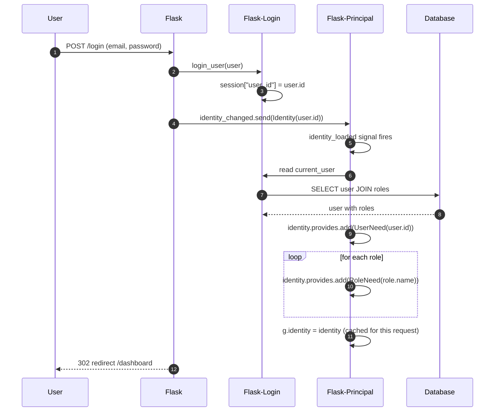
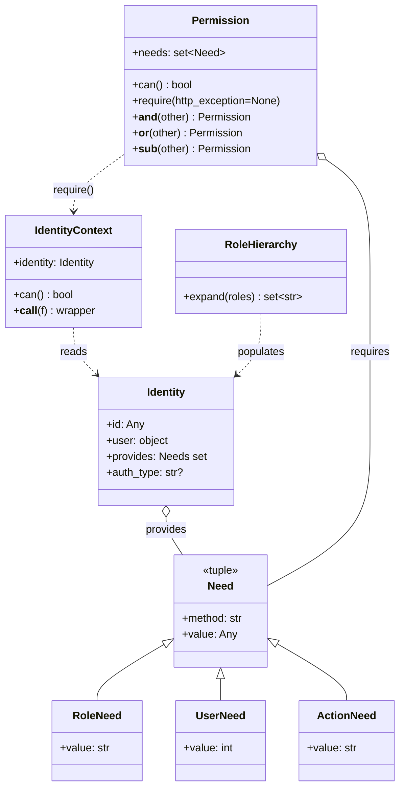
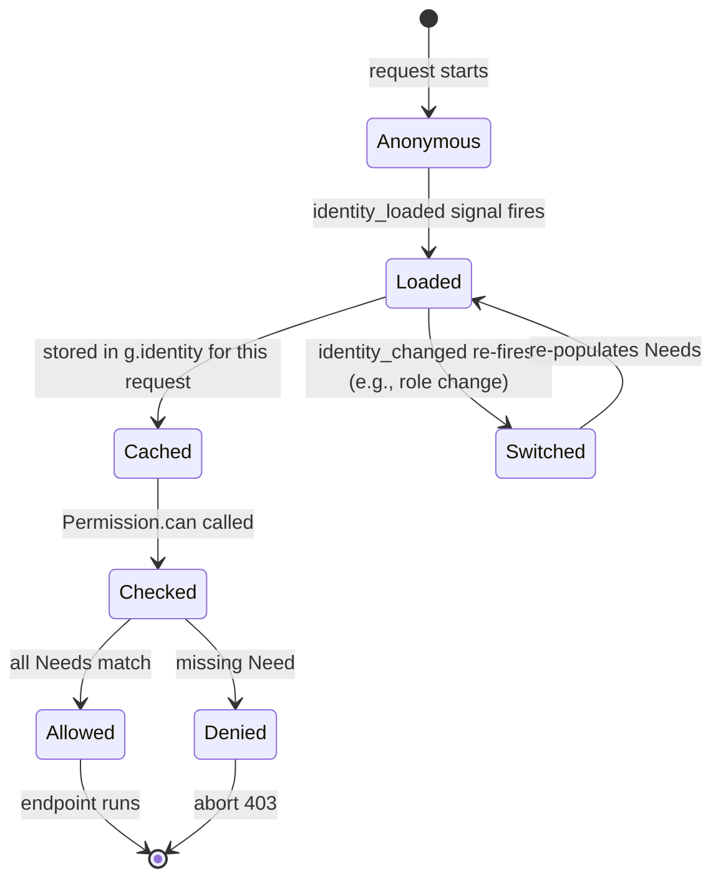
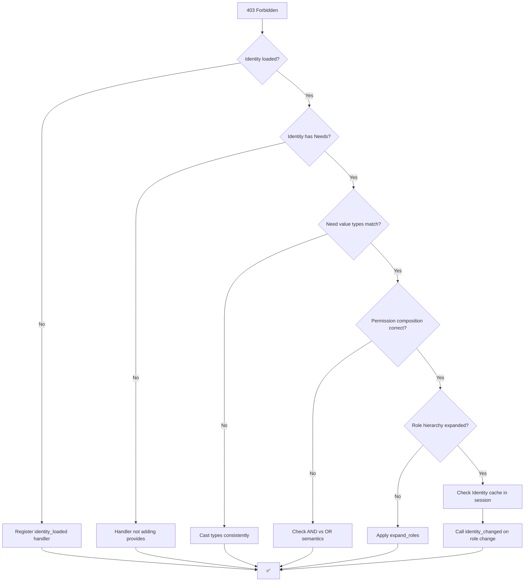
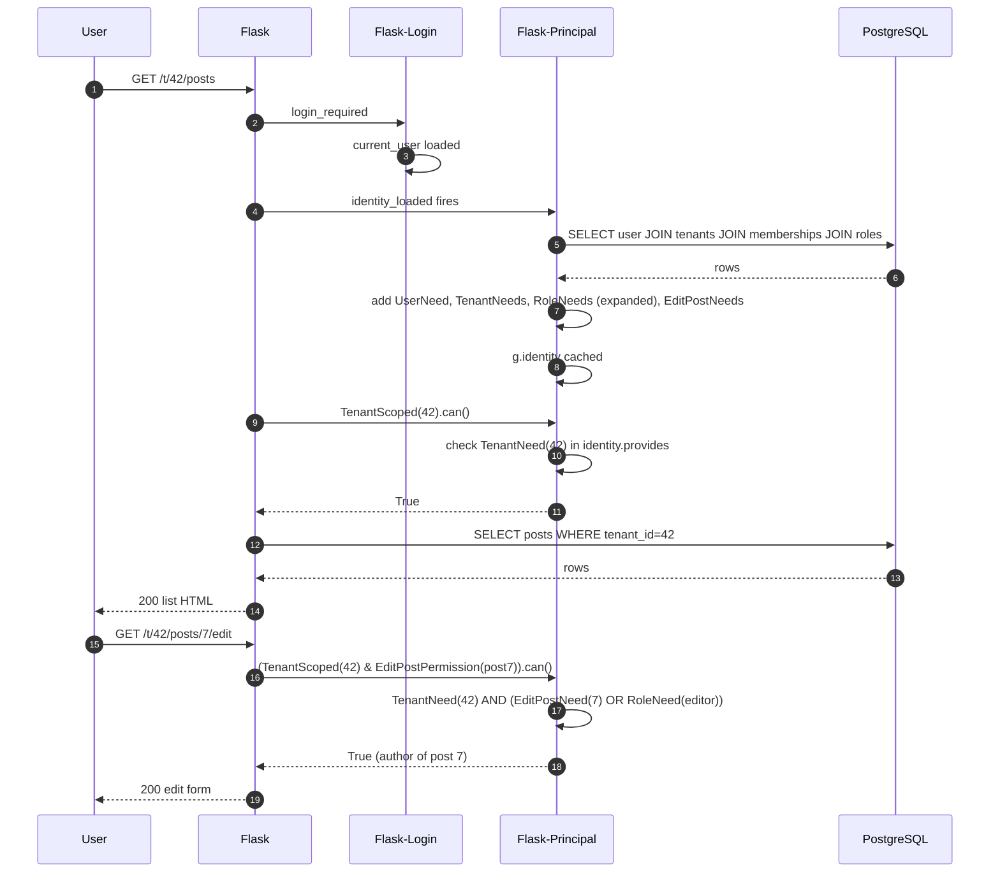

# Flask-Principal

#flask #authorization #rbac #permissions #identity #security #access-control

> [!info] Identity-based access control for Flask
> **Flask-Principal** provides a generic, framework-agnostic permission system for Flask. It implements the **Identity** pattern: each request is associated with an Identity (the user), and that Identity carries a set of **Need**s (the things they can do — a role, an ownership claim, a permission granted at runtime). Endpoints declare **Permission**s (the Needs required to access them); Flask-Principal checks that the Identity's Needs ⊇ the Permission's Needs.

Think of Flask-Principal as a **coat-check system**. At the door, you check your coat and receive a stack of tickets, each one stamped with what you're allowed to do — "Ticket #1: enter VIP room", "Ticket #2: backstage", "Ticket #3: read drinks menu". When you reach a door, the bouncer (a `@permission_required` decorator) doesn't ask "who are you?" — they ask "do you have a ticket with this exact stamp?". The user doesn't matter; the tickets matter. This is the **Identity ≠ User** distinction: the same person can have different identities (anonymous browser, logged-in user, API client), each carrying different tickets.

---

## 1. Overview & Metaphor

### Authentication vs Authorisation

- **Authentication** ("who are you?") is handled by [[Flask-Login]], [[Flask-HTTPAuth]], [[Flask-JWT-Extended]], [[Flask-Authlib]].
- **Authorisation** ("are you allowed to do this?") is what Flask-Principal does — **after** authentication.

The two are commonly conflated. `@login_required` is *authentication*: it asks "is there a current user?". `@permission_required(RoleNeed("admin"))` is *authorisation*: it asks "does the current user have the admin role?".

### The four core concepts

| Concept | Class | What it represents |
|---|---|---|
| **Need** | `Need` (tuple subclass) | A single atomic permission. Subclass or instantiate: `RoleNeed("admin")`, `ActionNeed("edit")`, `UserNeed(42)`. |
| **Identity** | `Identity` | The set of Needs the current request has. Constructed per request, set via `identity_changed.send(...)`. |
| **Permission** | `Permission` | A *requirement*: "the Identity must have all/any of these Needs". Subclass to make reusable permissions. |
| **IdentityContext** | `IdentityContext` | The request-scoped wrapper created by `permission.require()` / `permission.can()`. |

### Pre-built Need types

```python
from flask_principal import (
    Need, RoleNeed, UserNeed, ActionNeed, TypeNeed,
)
```

| Type | Constructor | Example use |
|---|---|---|
| `Need(method, value)` | Generic base | `Need("role", "admin")` |
| `RoleNeed(role_name)` | `RoleNeed("admin")` | "Must have this role" |
| `UserNeed(user_id)` | `UserNeed(42)` | "Must be user #42" |
| `ActionNeed(action_name)` | `ActionNeed("edit")` | "Must be allowed to edit" |
| `TypeNeed(type_value)` | `TypeNeed("premium")` | "Account tier" |

### What Flask-Principal does NOT do

| Concern | Who handles it |
|---|---|
| Authentication | [[Flask-Login]], [[Flask-HTTPAuth]], [[Flask-JWT-Extended]] |
| Permission storage | Your DB — `Role`, `Permission`, `user_roles` tables |
| Permission inheritance (role hierarchy) | You implement via the `identity_loaded` handler |
| Session storage | [[Flask-Session]] |
| Auditing / logging of access decisions | You wire up via signal handlers |

### Flask-Principal vs home-grown decorators

You could roll your own:

```python
def admin_required(f):
    @login_required
    @wraps(f)
    def wrapper(*args, **kwargs):
        if "admin" not in current_user.roles:
            abort(403)
        return f(*args, **kwargs)
    return wrapper
```

This works for trivial cases but breaks down when you need:

- **Multi-criteria permissions** — "admin OR (owner of this resource)".
- **Resource-level permissions** — "can edit this *specific* post" requires checking the post's `author_id`.
- **Permissions in templates** — `` needs a context variable, not a decorator.
- **Test-friendly assertions** — `permission.can()` is callable in tests without a request context.
- **Centralised policy** — one place where "who can do what" lives, not scattered across view decorators.

Flask-Principal addresses all of these.

> [!tip] The metaphor
> Flask-Principal is a **coat-check system**. You walk in, hand over your ID (authenticate via Flask-Login), the clerk looks you up in a binder and hands you a stack of pre-printed tickets (your Identity's Needs). Every restricted door in the building has a sign saying "show me a ticket with stamp X". The bouncer doesn't care who you are — they just match stamps. If your coat-check ticket matches the door's stamp, you walk in; if not, 403. Tickets can be issued per-request (e.g., "you're the author of this post, here's an `edit` Need for post #42"), and reissued when context changes.

---

## 2. Installation

```bash
(venv) $ pip install Flask-Principal
```

Versions referenced in this note:

| Package | Version |
|---|---|
| Flask | 3.0.x |
| Flask-Principal | 0.4.x |

Pure Python, no native dependencies. Flask-Principal is small (~600 lines) and stable — the API has barely changed since 2014.

> [!warning] Flask-Principal is in maintenance mode
> The maintainer (Miguel Grinberg) rarely releases new versions. The library is feature-complete for its intended scope (identity-based access control in single-process Flask apps). For complex RBAC needs (hierarchical roles, attribute-based access control, policy engines), consider `casbin` or `pyramid_authsanity`. For most Flask apps, Flask-Principal is still the right choice.

---

## 3. Configuration

Flask-Principal reads **no** `app.config` keys. All configuration is via the `Principal` extension object and signal handlers.

### Minimal setup

```python
# app/extensions.py
from flask_principal import Principal, Permission, RoleNeed

principal = Principal()
admin_permission = Permission(RoleNeed("admin"))
```

```python
# app/__init__.py
from flask import Flask
from app.extensions import principal, login_manager

def create_app() -> Flask:
    app = Flask(__name__)
    app.config["SECRET_KEY"] = "change-me"

    principal.init_app(app)
    login_manager.init_app(app)

    # Wire up identity loading (see §4.2)
    from app.identity import on_identity_loaded
    from flask_principal import identity_loaded
    identity_loaded.connect_via(app)(on_identity_loaded)

    return app
```

### `Principal()` constructor

| Parameter | Default | Description |
|---|---|---|
| `app` | `None` | Flask app; if omitted, call `principal.init_app(app)` later. |
| `use_sessions` | `True` | If True, persist the Identity in the Flask session between requests. Set False for stateless APIs. |
| `skip_static` | `True` | If True, don't run identity loading on static file requests. |

### `Permission` constructor

| Parameter | Default | Description |
|---|---|---|
| `*needs` | (required) | One or more `Need` instances. ALL must be satisfied (AND semantics). |
| `identity` | `None` | Override the current Identity (for testing). |

```python
# "Must be admin AND editor"
admin_and_editor = Permission(RoleNeed("admin"), RoleNeed("editor"))
```

For OR semantics, subclass:

```python
class AdminOrEditor(Permission):
    def __init__(self):
        # Call parent with empty Needs, then extend .needs explicitly
        super().__init__()
        self.needs = {RoleNeed("admin"), RoleNeed("editor")}
```

Or use the `|` operator:

```python
admin_perm = Permission(RoleNeed("admin"))
editor_perm = Permission(RoleNeed("editor"))
admin_or_editor = admin_perm | editor_perm   # OR semantics
```

| Operator | Semantics |
|---|---|
| `perm1 & perm2` | Both sets of Needs must be satisfied (AND) |
| `perm1 \| perm2` | Either set of Needs is sufficient (OR) |
| `perm1 - perm2` | `perm1` minus `perm2`'s Needs (exclusion) |

---

## 4. Basic Usage

### 4.1 Defining permissions

```python
# app/permissions.py
from flask_principal import Permission, RoleNeed, ActionNeed

class AdminPermission(Permission):
    def __init__(self):
        super().__init__(RoleNeed("admin"))

class EditorPermission(Permission):
    def __init__(self):
        super().__init__(RoleNeed("editor"))

class DeletePostPermission(Permission):
    def __init__(self, post_id: int):
        # Need: action "delete-post" with value post_id
        super().__init__(ActionNeed(("delete-post", post_id)))
```

### 4.2 Loading the Identity

After Flask-Login authenticates the user, you must populate the Identity with that user's Needs. The standard pattern is an `identity_loaded` signal handler:

```python
# app/identity.py
from flask import current_app
from flask_login import current_user
from flask_principal import Identity, identity_loaded, RoleNeed, UserNeed

@identity_loaded.connect_via(current_app)
def on_identity_loaded(sender, identity):
    # Set the identity's id (used by Flask-Principal for caching)
    if not current_user.is_authenticated:
        return

    identity.user = current_user
    identity.id = current_user.id

    # Add the user Need (so we can write UserNeed(user.id) checks)
    identity.provides.add(UserNeed(current_user.id))

    # Add a RoleNeed for every role the user has
    for role in current_user.roles:
        identity.provides.add(RoleNeed(role.name))
```

### 4.3 Triggering identity changes

After `login_user(user)`, fire the `identity_changed` signal so the handler runs:

```python
# app/auth/views.py
from flask import redirect, url_for
from flask_login import login_user
from flask_principal import Identity, identity_changed
from flask import current_app

@auth_bp.route("/login", methods=["POST"])
def login():
    user = verify_credentials(...)
    if user:
        login_user(user)
        identity_changed.send(current_app._get_current_object(),
                              identity=Identity(user.id))
        return redirect(url_for("main.dashboard"))
    return "Invalid credentials", 401
```

### 4.4 The identity-loading flow



### 4.5 Protecting endpoints

```python
# app/admin/views.py
from flask import abort
from app.permissions import AdminPermission

@admin_bp.route("/admin/users")
@AdminPermission().require(http_exception=403)
def list_users():
    # Only admins reach here
    return render_template("admin/users.html", users=User.query.all())
```

`.require(http_exception=403)` raises `abort(403)` if the Identity doesn't have the required Needs. Without `http_exception`, it raises `PermissionDenied`.

### 4.6 Checking permissions in templates

```python
# Inject permissions into Jinja context (do this once in create_app)
@app.context_processor
def inject_permissions():
    from app.permissions import AdminPermission, EditorPermission
    return {
        "is_admin":  AdminPermission().can(),
        "is_editor": EditorPermission().can(),
    }
```

```html
<!-- templates/base.html -->
<nav>
  
    <a href="/admin/users">User Admin</a>
  
  
    <a href="/editor/drafts">Drafts</a>
  
</nav>
```

### 4.7 Resource-level permissions

For per-resource checks (e.g., "can edit *this* post"), build the Permission dynamically inside the view:

```python
# app/blog/views.py
from flask import abort, render_template
from flask_principal import Permission, ActionNeed
from app.models.post import Post

@blog_bp.route("/posts/<int:post_id>/edit", methods=["GET", "POST"])
def edit_post(post_id: int):
    post = Post.query.get_or_404(post_id)
    # The author can always edit their own post
    perm = Permission(ActionNeed(("edit-post", post_id))) | Permission(RoleNeed("editor"))
    if not perm.can():
        abort(403)
    ...
```

For this to work, the `identity_loaded` handler must add an `ActionNeed(("edit-post", post_id))` for every post the user authored:

```python
@identity_loaded.connect_via(app)
def on_identity_loaded(sender, identity):
    if current_user.is_authenticated:
        identity.provides.add(UserNeed(current_user.id))
        for role in current_user.roles:
            identity.provides.add(RoleNeed(role.name))
        # Add ActionNeed for every post the user owns
        for post_id in current_user.authored_post_ids():
            identity.provides.add(ActionNeed(("edit-post", post_id)))
```

> [!warning] Loading too much into the Identity
> Adding per-resource Needs for every row the user can touch will bloat the Identity and slow every request. Limit this to small, bounded sets (e.g., "teams the user is a member of"). For unbounded sets (e.g., "all 10,000 documents the user can read"), check the resource at the view level using a DB query, not a Need.

---

## 5. Intermediate Patterns

### 5.1 Permission composition

```python
from flask_principal import Permission, RoleNeed, ActionNeed

admin  = Permission(RoleNeed("admin"))
editor = Permission(RoleNeed("editor"))
author = Permission(RoleNeed("author"))

# AND: must be both admin AND editor
superuser = admin & editor

# OR: must be admin OR editor
can_publish = admin | editor

# EXCLUSION: editor but not admin
limited_editor = editor - admin
```

### 5.2 Permission composition flow

```mermaid
flowchart TD
    A[Request] --> B[Identity loaded]
    B --> C[Permission.can called]
    C --> D{Permission type?}
    D -->|Basic| E[all Needs in identity.provides?]
    D -->|AND: perm1 & perm2| F[both perms .can True?]
    D -->|OR: perm1 \| perm2| G[any perm .can True?]
    D -->|EXCLUSION: perm1 - perm2| H[perm1 True AND perm2 False?]
    E --> I{All match?}
    F --> I
    G --> I
    H --> I
    I -->|Yes| J[Allow]
    I -->|No| K[Deny → 403]
```

### 5.3 Hierarchical roles

Flask-Principal does not natively support "admin implies editor implies author". You implement it in the `identity_loaded` handler:

```python
ROLE_HIERARCHY = {
    "admin":  ["editor", "author"],
    "editor": ["author"],
    "author": [],
}

def expand_roles(roles: set[str]) -> set[str]:
    expanded = set(roles)
    for role in list(roles):
        expanded.update(expand_roles(set(ROLE_HIERARCHY.get(role, []))))
    return expanded

@identity_loaded.connect_via(app)
def on_identity_loaded(sender, identity):
    if current_user.is_authenticated:
        direct_roles = {r.name for r in current_user.roles}
        for role in expand_roles(direct_roles):
            identity.provides.add(RoleNeed(role))
```

### 5.4 Role hierarchy class diagram



### 5.5 Anonymous identity

For unauthenticated users, Flask-Principal creates an `AnonymousIdentity` automatically. You can extend it:

```python
from flask_principal import AnonymousIdentity, identity_loaded

@identity_loaded.connect_via(app)
def on_identity_loaded(sender, identity):
    if isinstance(identity, AnonymousIdentity):
        # Anonymous users can read public posts
        identity.provides.add(RoleNeed("reader"))
        return
    # ... authenticated handler
```

### 5.6 API token identities

For API tokens (with [[Flask-HTTPAuth]]), populate the Identity in the token verifier:

```python
from flask_principal import Identity, identity_changed, RoleNeed

@token_auth.verify_token
def verify_token(token):
    payload = decode_token(token)
    if not payload:
        return None
    identity_changed.send(current_app._get_current_object(),
                          identity=Identity(payload["sub"]))
    return payload
```

The `identity_loaded` handler then runs and populates Needs from the JWT's `roles` claim.

---

## 6. Advanced Usage

### 6.1 Custom Permission subclasses with parameters

```python
class ItemOwnerPermission(Permission):
    """Allow access if the user owns the item with the given ID."""
    def __init__(self, item_id: int):
        super().__init__(UserNeed(item_id))   # the item's owner has UserNeed(item_id)
        # But the *current user* has UserNeed(current_user.id), not UserNeed(item_id).
        # So this only works if identity_loaded adds UserNeed(item_id) for items the user owns.
```

Or check directly:

```python
class ItemOwnerPermission(Permission):
    def __init__(self, item):
        need = UserNeed(item.owner_id)
        super().__init__(need)
```

### 6.2 Conditional permission via `__init__`

```python
class CanEditPost(Permission):
    def __init__(self, post: Post):
        super().__init__()
        needs = set()
        if post.status == "draft":
            needs.add(RoleNeed("editor"))
            needs.add(UserNeed(post.author_id))
        elif post.status == "published":
            needs.add(RoleNeed("admin"))
        else:
            needs.add(RoleNeed("admin"))
        self.needs = needs
```

### 6.3 Identity lifecycle state machine



### 6.4 Multiple identity sources (multi-tenant)

In a multi-tenant app, the Identity should carry a `TenantNeed`:

```python
from flask_principal import Need

TenantNeed = lambda tenant_id: Need("tenant", tenant_id)

@identity_loaded.connect_via(app)
def on_identity_loaded(sender, identity):
    if current_user.is_authenticated:
        for tenant_id in current_user.tenant_ids:
            identity.provides.add(TenantNeed(tenant_id))

class TenantScopedPermission(Permission):
    def __init__(self, tenant_id: int):
        super().__init__(TenantNeed(tenant_id))
```

### 6.5 Permission checks outside request context

For background jobs (Celery), tests, or admin scripts, you can build an Identity manually:

```python
from flask_principal import Identity, Permission, RoleNeed, identity_changed

def run_as_admin(app, fn):
    with app.app_context():
        ident = Identity("system")
        ident.provides.add(RoleNeed("admin"))
        from flask import g
        g.identity = ident
        return fn()
```

Or use the `Permission(identity=...)` argument:

```python
ident = Identity("u1")
ident.provides.add(RoleNeed("admin"))
perm = Permission(RoleNeed("admin"), identity=ident)
assert perm.can()
```

### 6.6 Permission decision audit log

Wire `PermissionDenied` to a logger:

```python
from flask_principal import PermissionDenied
import logging
logger = logging.getLogger("authz")

@app.errorhandler(403)
def handle_403(e):
    from flask import request, g
    ident = getattr(g, "identity", None)
    logger.warning("Denied %s %s identity=%s path=%s",
                   request.method, request.url, ident.id if ident else None,
                   request.path)
    return {"error": "forbidden"}, 403
```

---

## 7. Common Pitfalls & Troubleshooting

| Symptom | Likely cause | Fix |
|---|---|---|
| `PermissionDenied` for everyone | `identity_loaded` handler not registered. | `identity_loaded.connect_via(app)(on_identity_loaded)` in `create_app()`. |
| `PermissionDenied` only in tests | No request context, so `identity_loaded` never fired. | Use `with app.test_request_context():` or call `identity_changed.send(...)` manually. |
| Roles added but `RoleNeed("admin").can()` is False | The handler added the role to the wrong object. | `identity.provides.add(RoleNeed(...))`, not `identity.add(...)` or `identity.roles.add(...)`. |
| `AttributeError: 'AnonymousIdentity' has no attribute 'user'` | Handler assumed `current_user.is_authenticated`. | Guard with `if not current_user.is_authenticated: return`. |
| Identity lost between requests | `Principal(use_sessions=False)` was set. | Use `use_sessions=True` for browser apps (default). |
| Identity cached even after role change | Flask-Principal caches Identity in the session for `use_sessions=True`. | On role change, call `identity_changed.send(...)` again to refresh. |
| 403 on every page after logout | Stale session Identity. | Call `identity_changed.send(Identity(None))` in your logout view. |
| `Permission` `&` and `|` give weird results | Operator precedence: `&` binds tighter than `|`. Use parentheses. | `(a | b) & c`, not `a | b & c`. |
| Resource-level Needs never match | The Need value type differs (e.g., `UserNeed(42)` vs `UserNeed("42")`). | Use consistent types. `UserNeed(int(post.author_id))` not `UserNeed(str(post.author_id))`. |
| Loading user's Needs is slow | `identity_loaded` runs N+1 DB queries. | Eager-load `current_user.roles` (joinedload) or cache. |

### Troubleshooting flowchart



> [!danger] Don't check permissions by `current_user.role == "admin"`
> This bypasses Flask-Principal entirely and creates a second source of truth. As soon as you have two roles or two permissions, you'll wish you'd used `Permission`. Centralise all authorization decisions in one place.

---

## 8. Best Practices

1. **One `identity_loaded` handler per app.** Don't scatter role-adding logic across blueprints. Centralise it so it's auditable.
2. **Use `RoleNeed` for coarse permissions, `ActionNeed` for fine-grained.** Roles change rarely; actions change often.
3. **Eager-load relationships.** `current_user.roles` should be joined-loaded at login time so `identity_loaded` doesn't fire N+1 queries.
4. **Don't put unbounded sets in the Identity.** If the user can read 10,000 documents, don't add 10,000 Needs — query the DB at the view.
5. **Define Permission subclasses, not raw `Permission(RoleNeed(...))` inline.** Subclasses are reusable in templates and tests.
6. **Inject common permissions into the Jinja context** so templates don't need to know about Flask-Principal.
7. **Refresh the Identity on role changes.** After granting/revoking a role, call `identity_changed.send(...)` to repopulate Needs.
8. **Test permissions with `Permission(identity=...)`.** You don't need a full request context to assert that "an editor can publish".
9. **Use `PermissionDenied` handler for 403 logging.** Audit denied requests for intrusion-detection signals.
10. **Don't roll your own role hierarchy in templates.** If you find yourself writing ``, you've broken the single-source-of-truth rule. Expand the hierarchy in `identity_loaded` so a single `RoleNeed("editor")` check suffices.
11. **For multi-tenant apps, add a `TenantNeed`** and check it explicitly in every tenant-scoped route.
12. **Combine with [[Flask-Limiter]] for defence in depth.** Authz stops "can Alice do X?"; rate limiting stops "Alice doing X 1,000,000 times/sec".

---

## 9. Integration with Other Extensions

### [[Flask-Login]]

The standard pairing. Flask-Login authenticates; Flask-Principal authorises.

```python
from flask_login import login_user, current_user
from flask_principal import Identity, identity_changed

@auth_bp.route("/login", methods=["POST"])
def login():
    user = verify_credentials(...)
    login_user(user)
    identity_changed.send(current_app._get_current_object(),
                          identity=Identity(user.id))
    return redirect(url_for("main.dashboard"))

@auth_bp.route("/logout")
@login_required
def logout():
    from flask_principal import AnonymousIdentity
    logout_user()
    identity_changed.send(current_app._get_current_object(),
                          identity=AnonymousIdentity())
    return redirect(url_for("main.index"))
```

### [[Flask-HTTPAuth]]

After token verification, fire `identity_changed` so the `identity_loaded` handler runs:

```python
@token_auth.verify_token
def verify_token(token):
    payload = decode_token(token)
    if payload:
        identity_changed.send(current_app._get_current_object(),
                              identity=Identity(payload["sub"]))
    return payload
```

### [[Flask-JWT-Extended]]

In the `verify_jwt_in_request` callback, extract roles from the JWT and populate the Identity:

```python
from flask_jwt_extended import verify_jwt_in_request, get_jwt

@app.before_request
def load_identity_from_jwt():
    if request.path.startswith("/api/"):
        verify_jwt_in_request()
        claims = get_jwt()
        identity_changed.send(current_app._get_current_object(),
                              identity=Identity(claims["sub"]))
```

### [[Flask-Authlib]]

After OAuth/OIDC completes, fire `identity_changed` with the OIDC `sub` claim. The `identity_loaded` handler can read roles from the ID token's `realm_access.roles` claim (Keycloak) or `groups` claim (Okta).

### [[Flask-SQLAlchemy]]

Store roles in a many-to-many table:

```python
user_roles = db.Table(
    "user_roles",
    db.Column("user_id", db.Integer, db.ForeignKey("users.id"), primary_key=True),
    db.Column("role_id", db.Integer, db.ForeignKey("roles.id"), primary_key=True),
)

class Role(db.Model):
    __tablename__ = "roles"
    id = db.Column(db.Integer, primary_key=True)
    name = db.Column(db.String(64), unique=True, nullable=False)

class User(UserMixin, db.Model):
    __tablename__ = "users"
    ...
    roles = db.relationship("Role", secondary=user_roles, backref="users")
```

### [[Flask-Limiter]]

Rate-limit 403s to detect probing:

```python
from flask_limiter import Limiter
limiter = Limiter(key_func=get_remote_address)

@app.errorhandler(403)
@limiter.limit("10/minute")
def handle_403(e):
    return {"error": "forbidden"}, 403
```

---

## 10. Real-World Example: Multi-Tenant Blog Platform

A blog platform where users belong to tenants, can be admins/editors/authors within a tenant, and can edit their own posts.

```python
# app/extensions.py
from flask_principal import Principal, Permission, RoleNeed, Need, UserNeed
principal = Principal()

class AdminPermission(Permission):
    def __init__(self): super().__init__(RoleNeed("admin"))

class EditorPermission(Permission):
    def __init__(self): super().__init__(RoleNeed("editor"))

class AuthorPermission(Permission):
    def __init__(self): super().__init__(RoleNeed("author"))

def TenantNeed(tenant_id): return Need("tenant", tenant_id)
def EditPostNeed(post_id): return Need("edit-post", post_id)

class TenantScoped(Permission):
    def __init__(self, tenant_id):
        super().__init__(TenantNeed(tenant_id))

class EditPostPermission(Permission):
    def __init__(self, post):
        # author OR (editor in same tenant)
        super().__init__()
        self.needs = {
            EditPostNeed(post.id),               # author gets this via identity_loaded
            RoleNeed("editor"),                   # global editor
        }
```

```python
# app/identity.py
from flask import current_app
from flask_login import current_user
from flask_principal import Identity, identity_loaded, RoleNeed, UserNeed
from app.identity import TenantNeed, EditPostNeed
from app.extensions import db

ROLE_HIERARCHY = {
    "admin":  ["editor", "author"],
    "editor": ["author"],
    "author": [],
}

def expand_roles(roles):
    expanded = set(roles)
    for r in list(roles):
        expanded.update(expand_roles(ROLE_HIERARCHY.get(r, [])))
    return expanded

@identity_loaded.connect_via(current_app)
def on_identity_loaded(sender, identity):
    if not current_user.is_authenticated:
        return
    identity.user = current_user
    identity.id = current_user.id
    identity.provides.add(UserNeed(current_user.id))

    # Tenant membership
    for t in current_user.tenants:
        identity.provides.add(TenantNeed(t.id))

    # Direct roles expanded through hierarchy
    direct = {mr.role.name for mr in current_user.memberships}
    for role in expand_roles(direct):
        identity.provides.add(RoleNeed(role))

    # Per-resource: every post the user authored
    post_ids = db.session.scalars(
        db.select(Post.id).where(Post.author_id == current_user.id)
    ).all()
    for pid in post_ids:
        identity.provides.add(EditPostNeed(pid))
```

```python
# app/blog/views.py
from flask import abort, render_template, request, redirect, url_for
from flask_login import login_required, current_user
from app.extensions import db
from app.models.post import Post
from app.identity import TenantNeed, EditPostPermission, TenantScoped
from flask_principal import Permission

@blog_bp.route("/t/<int:tenant_id>/posts")
@login_required
def list_posts(tenant_id: int):
    if not TenantScoped(tenant_id).can():
        abort(403)
    posts = db.session.scalars(
        db.select(Post).where(Post.tenant_id == tenant_id)
    ).all()
    return render_template("blog/list.html", posts=posts, tenant_id=tenant_id)

@blog_bp.route("/t/<int:tenant_id>/posts/<int:post_id>/edit", methods=["GET", "POST"])
@login_required
def edit_post(tenant_id: int, post_id: int):
    # Both tenant-scoped AND can-edit-this-post
    if not (TenantScoped(tenant_id) & EditPostPermission(Post.query.get_or_404(post_id))).can():
        abort(403)
    post = Post.query.get_or_404(post_id)
    if request.method == "POST":
        post.body = request.form["body"]
        db.session.commit()
        return redirect(url_for("blog.list_posts", tenant_id=tenant_id))
    return render_template("blog/edit.html", post=post, tenant_id=tenant_id)
```

### End-to-end flow



---

## 11. References

- **Official docs**: <https://pythonhosted.org/Flask-Principal/>
- **GitHub**: <https://github.com/mattupstate/flask-principal>
- **Source**: ~600 lines, easy to read end-to-end.
- **Specifications / patterns**:
  - Identity pattern — <https://martinfowler.com/apsupp/auth.html>
  - RBAC (NIST) — <https://csrc.nist.gov/projects/role-based-access-control>
  - ABAC (XACML) — for attribute-based access, see `casbin`
- **Related notes**: [[Flask-Login]] · [[Flask-HTTPAuth]] · [[Flask-JWT-Extended]] · [[Flask-Authlib]] · [[Flask-SQLAlchemy]] · [[Flask-Limiter]] · [[Security-Best-Practices]]
