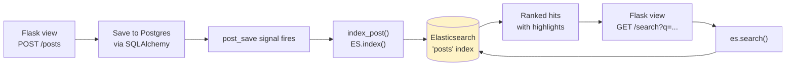
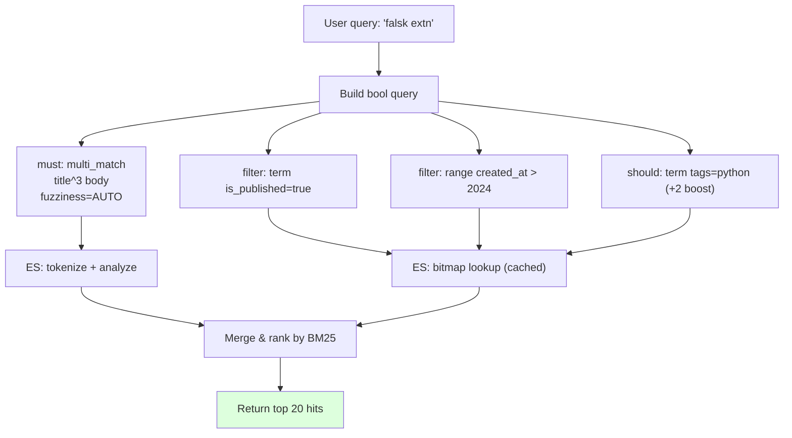
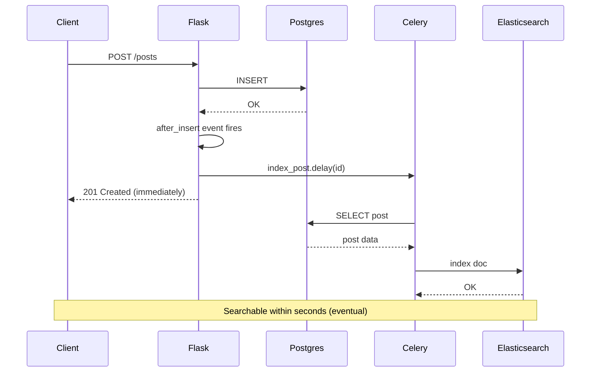
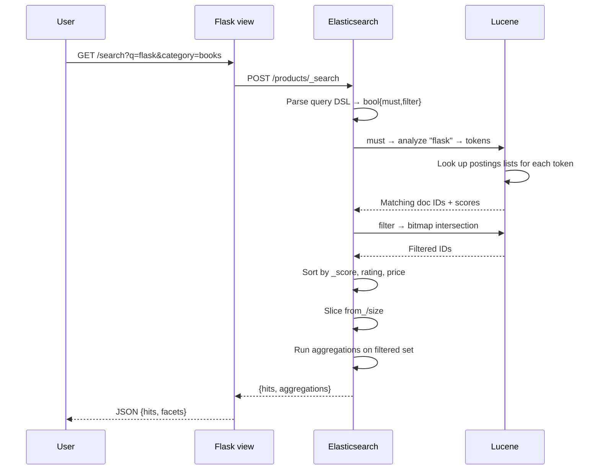
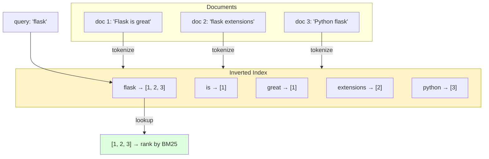

# Flask-Elasticsearch

#flask #search #elasticsearch #fulltext #lucene #nosql

> [!info] Industrial-strength full-text search for Flask
> [Elasticsearch](https://www.elastic.co/elasticsearch) is a distributed search and analytics engine built on [Apache Lucene](https://lucene.apache.org/). It powers GitHub, Wikipedia, Netflix, and most "search-as-you-type" experiences you've ever used. This note covers the [`flask-elasticsearch`](https://github.com/booking-assistant/flask-elasticsearch) extension (or just the official `elasticsearch-py` client with the extensions pattern), indexing documents, mapping & analyzers, query DSL, aggregations, and how ES compares to [[Whoosh-Search]], Meilisearch, and Typesense.

If your app needs search beyond `ILIKE '%query%'` — typo tolerance, ranking, faceted filters, autocomplete, multilingual tokenization — you need a real search engine. Elasticsearch is the heavyweight default; this note covers it in depth.

---

## 1. Overview & Metaphor

### What is a search engine?

A **search engine** is a database optimized for **relevance-ranked text queries**. SQL can do `WHERE body LIKE '%flask%'` but:
- It scans every row (no index helps).
- It can't rank by relevance (BM25, TF-IDF).
- It can't handle typos (`falsk` → `flask`).
- It can't tokenize languages (Chinese, German compounds).
- It can't do aggregations on the fly (facets like "show me laptops filtered by brand, price, RAM").

A search engine pre-computes an **inverted index**: for every word, a list of documents containing it. Lookup is O(1) per term; ranking is computed from term frequencies.

> [!tip] The metaphor
> A SQL `LIKE` query is like **flipping through every page of a book** looking for the word "flask." An inverted index is the **index at the back of the book**: look up "flask," see pages 23, 47, 102, jump directly. That's why search engines are 1000× faster for text queries.

### When Elasticsearch, when [[Whoosh-Search]], when Postgres `tsvector`?

| Need | Use |
|---|---|
| A few thousand docs, simple search | Postgres `tsvector` + GIN index |
| Tens of thousands, pure Python, no extra service | [[Whoosh-Search]] |
| Millions+ of docs, typos, facets, autocomplete, scale | **Elasticsearch** |
| Need both fast search AND a database | Postgres + ES (sync via `post_save` signal) |
| Need search as a managed service | Elastic Cloud, or [Meilisearch Cloud](https://www.meilisearch.com/) / [Typesense Cloud](https://cloud.typesense.org/) |

### What `flask-elasticsearch` adds

A small Flask wrapper:
- A single `Elasticsearch()` instance bound to `app.config`
- App-context-aware connection pool
- Helper methods for indexing Flask models

You can also just use `elasticsearch.Elasticsearch()` directly inside `extensions.py` — the wrapper is optional. We'll show both.

---

## 2. Installation

```bash
(venv) $ pip install flask-elasticsearch
# or:
(venv) $ pip install elasticsearch
```

Versions referenced:

| Package | Version |
|---|---|
| Flask | 3.0.x |
| elasticsearch-py | 8.x |
| elasticsearch server | 8.x |

You need a running Elasticsearch server. Easiest is Docker:

```bash
$ docker run -d -p 9200:9200 -p 9300:9300 \
    -e "discovery.type=single-node" \
    -e "xpack.security.enabled=false" \
    --name es docker.elastic.co/elasticsearch/elasticsearch:8.11.0
```

Or use [Elastic Cloud](https://cloud.elastic.co/) for managed ES.

---

## 3. Configuration

### Minimal setup

```python
# app/extensions.py
from elasticsearch import Elasticsearch

es = Elasticsearch()  # reads ELASTICSEARCH_URL env var
```

```python
# app/__init__.py
import os
from flask import Flask
from app.extensions import es

def create_app():
    app = Flask(__name__)
    app.config["ELASTICSEARCH_URL"] = os.environ.get("ELASTICSEARCH_URL", "http://localhost:9200")
    app.extensions["elasticsearch"] = es
    return app
```

### Configuration options

| Option | Default | Description |
|---|---|---|
| `ELASTICSEARCH_URL` | `http://localhost:9200` | Single-node URL. |
| `ELASTICSEARCH_HOSTS` | `None` | List of hosts for cluster mode. |
| `ELASTICSEARCH_USER` | `None` | Basic auth username. |
| `ELASTICSEARCH_PASSWORD` | `None` | Basic auth password. |
| `ELASTICSEARCH_API_KEY` | `None` | API key auth (alternative to basic). |
| `ELASTICSEARCH_VERIFY_CERTS` | `True` | TLS certificate verification. |
| `ELASTICSEARCH_CA_CERTS` | `None` | Path to CA bundle. |
| `ELASTICSEARCH_TIMEOUT` | `10` | Request timeout seconds. |
| `ELASTICSEARCH_MAX_RETRIES` | `3` | Retries on connection error. |
| `ELASTICSEARCH_RETRY_ON_TIMEOUT` | `True` | Retry on `TimeoutError`. |
| `ELASTICSEARCH_SNIFF_ON_START` | `False` | Discover nodes on startup. |
| `ELASTICSEARCH_SNIFF_ON_CONNECTION_FAIL` | `False` | Rediscover on failure. |

### Production-grade config

```python
# app/config.py
import os
from dotenv import load_dotenv

load_dotenv()


class Config:
    ELASTICSEARCH_URL = os.environ["ELASTICSEARCH_URL"]
    ELASTICSEARCH_API_KEY = os.environ["ELASTICSEARCH_API_KEY"]
    ELASTICSEARCH_VERIFY_CERTS = True
    ELASTICSEARCH_TIMEOUT = 30
    ELASTICSEARCH_MAX_RETRIES = 5
    ELASTICSEARCH_RETRY_ON_TIMEOUT = True


class TestingConfig(Config):
    ELASTICSEARCH_URL = os.environ.get("TEST_ELASTICSEARCH_URL", "http://localhost:9200")
```

> [!warning] Elasticsearch 8.x ships with security ON by default
> Out of the box, ES 8 enables TLS and requires authentication. For local dev, set `xpack.security.enabled=false` in `elasticsearch.yml` or pass `-e "xpack.security.enabled=false"` to Docker. **Never disable security in production** — use HTTPS + API keys.

---

## 4. Basic Usage

### Creating an index with a mapping

```python
# app/search/indices.py
from app.extensions import es

POSTS_INDEX = "posts"

POSTS_MAPPING = {
    "mappings": {
        "properties": {
            "title": {"type": "text", "analyzer": "standard"},
            "body":  {"type": "text", "analyzer": "standard"},
            "tags":  {"type": "keyword"},
            "author_id":   {"type": "integer"},
            "author_name": {"type": "text"},
            "is_published": {"type": "boolean"},
            "view_count":  {"type": "integer"},
            "created_at":  {"type": "date"},
            "suggest":     {"type": "completion"},  # for autocomplete
        }
    },
    "settings": {
        "number_of_shards": 1,
        "number_of_replicas": 0,  # bump to 1+ in prod
    },
}


def ensure_index():
    if not es.indices.exists(index=POSTS_INDEX):
        es.indices.create(index=POSTS_INDEX, **POSTS_MAPPING)
```

### Indexing documents

```python
from app.extensions import es
from app.models.post import Post
from app.search.indices import POSTS_INDEX

def index_post(post: Post):
    doc = {
        "title": post.title,
        "body": post.body,
        "tags": [t.name for t in post.tags],
        "author_id": post.author_id,
        "author_name": post.author.username,
        "is_published": post.is_published,
        "view_count": post.view_count,
        "created_at": post.created_at.isoformat(),
        "suggest": {"input": [post.title, post.title.split()[0]]},
    }
    es.index(index=POSTS_INDEX, id=post.id, document=doc, refresh=True)
    # refresh=True makes the doc immediately searchable (slow for bulk; use in tests)

def delete_post_from_index(post_id):
    es.delete(index=POSTS_INDEX, id=post_id, refresh=True)
```

### Searching

```python
def search_posts(query: str, page: int = 1, per_page: int = 20):
    response = es.search(
        index=POSTS_INDEX,
        query={
            "bool": {
                "must": [
                    {"match": {"title": query}},
                    {"match": {"body": query}},
                ],
                "filter": [
                    {"term": {"is_published": True}},
                ],
            },
        },
        from_=(page - 1) * per_page,
        size=per_page,
        highlight={"fields": {"body": {}}},
    )
    hits = response["hits"]["hits"]
    total = response["hits"]["total"]["value"]
    return {
        "items": [h["_source"] | {"_score": h["_score"], "highlight": h.get("highlight")} for h in hits],
        "total": total,
    }
```

### CRUD-style operations

```python
# Index (create or replace)
es.index(index="posts", id=1, document={...})

# Get by ID
es.get(index="posts", id=1)["_source"]

# Update (partial)
es.update(index="posts", id=1, doc={"view_count": 42})

# Delete
es.delete(index="posts", id=1)

# Bulk index (fast for many docs)
from elasticsearch.helpers import bulk
actions = [
    {"_index": "posts", "_id": p.id, "_source": serialize(p)}
    for p in Post.query.limit(10000)
]
bulk(es, actions)
```



---

## 5. Mapping & Analyzers

### Field types

| Type | Description |
|---|---|
| `text` | Full-text searchable; tokenized at index time. |
| `keyword` | Exact match; sortable, aggregatable. Used for tags, status, IDs. |
| `integer`, `long`, `float`, `double` | Numeric. |
| `boolean` | True/false. |
| `date` | ISO 8601 or epoch ms. |
| `ip` | IPv4/IPv6. |
| `object` | Nested JSON object (flattened by default). |
| `nested` | Array of objects, queried independently. |
| `geo_point` | Lat/lng, for `geo_distance` queries. |
| `completion` | Autocomplete field. |
| `search_as_you_type` | N-gram field for "typeahead" search. |

### `text` vs. `keyword` — the #1 confusion

```json
// "text" — tokenized, no exact match
{"title": {"type": "text"}}
// Indexed as: ["flask", "extensions", "vault"]
// Query "flask" matches; query "Flask Extensions Vault" (exact) does NOT reliably match

// "keyword" — exact match only
{"category": {"type": "keyword"}}
// Query "tech" matches; query "tec" does NOT match

// Multi-field: both
{"title": {
  "type": "text",
  "fields": {
    "raw": {"type": "keyword"}  // also index as "title.raw" for exact/sort
  }
}}
```

### Analyzers

An analyzer is a pipeline: **character filter → tokenizer → token filter**.

| Built-in | Behavior |
|---|---|
| `standard` (default for `text`) | Unicode tokenizer, lowercase, stop words optional. |
| `simple` | Letter tokenizer, lowercase. |
| `whitespace` | Split on whitespace only. |
| `stop` | Like `simple` but removes stop words. |
| `keyword` | No-op (whole field as one token). |
| `pattern` | Split on a regex. |
| `language` (e.g., `english`, `german`, `chinese`) | Language-specific stemming + stop words. |
| `fingerprint` | Lowercase, sort, dedupe — for clustering. |

### Custom analyzer example

```python
CUSTOM_ANALYZER = {
    "settings": {
        "analysis": {
            "tokenizer": {"edge_ngram_tokenizer": {
                "type": "edge_ngram", "min_gram": 2, "max_gram": 10,
                "token_chars": ["letter", "digit"],
            }},
            "analyzer": {"autocomplete": {
                "type": "custom",
                "tokenizer": "edge_ngram_tokenizer",
                "filter": ["lowercase"],
            }},
        },
    },
    "mappings": {
        "properties": {
            "title": {
                "type": "text",
                "analyzer": "autocomplete",
                "search_analyzer": "standard",  # at query time, don't n-gram
            },
        },
    },
}
```

> [!tip] Use the right analyzer for the language
> If your content is mostly English, the `english` analyzer applies stemming (`running` → `run`) and removes stop words (`the`, `is`). This dramatically improves recall. For multilingual content, use the **language identification** feature or per-language indices.

---

## 6. Querying

### `match` queries (full-text)

```python
es.search(query={"match": {"title": "flask extensions"}})
# Tokenizes the query, ORs the terms, ranks by BM25.

# Force AND
es.search(query={"match": {"title": {"query": "flask extensions", "operator": "and"}}})

# Phrase (terms in order)
es.search(query={"match_phrase": {"body": "flask extensions vault"}})
```

### `bool` queries (the workhorse)

```python
{
    "bool": {
        "must":   [{"match": {"title": "flask"}}],          # contributes to score
        "should": [{"match": {"tags": "python"}}],          # optional, boosts score
        "filter": [{"term": {"is_published": True}}],       # no score, just filter
        "must_not": [{"term": {"tags": "spam"}}],           # exclude
    }
}
```

- `must` — must match (AND). Affects score.
- `should` — should match (OR). Affects score. (With no `must`, at least one `should` must match.)
- `filter` — must match (AND). Does NOT affect score. Faster (cached).
- `must_not` — must NOT match.

> [!tip] Use `filter` instead of `must` for binary conditions
> `{"term": {"is_published": True}}` in `must` calculates a (useless) score. In `filter`, Elasticsearch caches the bitmap — much faster. Use `must` only for relevance-affecting text matches.

### Other query types

```python
# Term (exact match, not analyzed)
{"term": {"tags": "flask"}}

# Terms (multiple exact values)
{"terms": {"tags": ["flask", "python"]}}

# Range
{"range": {"created_at": {"gte": "2024-01-01", "lte": "2024-12-31"}}}

# Exists
{"exists": {"field": "summary"}}

# Prefix
{"prefix": {"title": "flask"}}

# Wildcard (slow, avoid)
{"wildcard": {"title": "flas*"}}

# Regex (slow, avoid)
{"regexp": {"title": "flask.*"}}

# Fuzzy (typo tolerance)
{"fuzzy": {"title": {"value": "falsk", "fuzziness": "AUTO"}}}

# More like this
{"more_like_this": {"fields": ["title", "body"], "like": "flask python web", "min_term_freq": 1, "max_query_terms": 12}}
```



### Pagination

```python
# Standard pagination — works up to 10,000 results
es.search(query=..., from_=(page - 1) * per_page, size=per_page)

# Deep pagination — use search_after (cursor-based)
response = es.search(query=..., sort=[{"created_at": "desc"}, "_id"], size=20)
last_sort = response["hits"]["hits"][-1]["sort"]
next_page = es.search(query=..., sort=[{"created_at": "desc"}, "_id"], size=20, search_after=last_sort)
```

> [!warning] `from + size` is capped at 10,000
> Deep pagination with `from=50000` is forbidden by default — it forces ES to compute scores for 50,020 docs and discard 50,000. Use **`search_after`** (cursor-based) or **scroll** (for batch exports) for deep pagination.

---

## 7. Aggregations

Aggregations = SQL `GROUP BY` + analytics on steroids. Used for **faceted search** (the "filters" sidebar on e-commerce sites).

```python
response = es.search(
    index="posts",
    query={"match": {"body": "flask"}},
    size=0,  # we only want aggregations, not hits
    aggs={
        "by_tag": {"terms": {"field": "tags", "size": 10}},
        "by_author": {"terms": {"field": "author_name.keyword", "size": 5}},
        "views_over_time": {
            "date_histogram": {
                "field": "created_at",
                "calendar_interval": "month",
            }
        },
        "avg_views": {"avg": {"field": "view_count"}},
    },
)
# response["aggregations"]["by_tag"]["buckets"] = [
#   {"key": "flask", "doc_count": 142},
#   {"key": "python", "doc_count": 98},
#   ...
# ]
```

| Aggregation type | What it does |
|---|---|
| `terms` | Group by exact value (top N). |
| `date_histogram` | Group by time bucket. |
| `histogram` | Group by numeric bucket. |
| `range`, `date_range` | Group by custom ranges. |
| `avg`, `sum`, `min`, `max`, `stats` | Compute metrics. |
| `cardinality` | Approximate distinct count (HyperLogLog). |
| `nested` | Aggregate on nested object fields. |
| `filters` | Define named buckets with queries. |

---

## 8. Autocomplete & Suggestions

### Completion field (fast autocomplete)

Defined in the mapping (`"suggest": {"type": "completion"}`). Indexed as an FST (finite state transducer) — extremely fast lookups.

```python
# Index
es.index(index="posts", id=1, document={
    "title": "Flask Extensions Vault",
    "suggest": {"input": ["Flask Extensions Vault", "FEV"], "weight": 10},
})

# Query
response = es.search(
    index="posts",
    suggest={
        "my_suggestion": {
            "prefix": "flask ext",
            "completion": {"field": "suggest", "size": 5, "skip_duplicates": True},
        }
    },
)
for opt in response["suggest"]["my_suggestion"][0]["options"]:
    print(opt["_source"]["title"], opt["_score"])
```

### Search-as-you-type (n-gram field)

```python
{"title_suggest": {"type": "search_as_you_type"}}
# Then query with multi_match:
es.search(query={"multi_match": {"query": "fla", "type": "bool_prefix", "fields": ["title_suggest", "title_suggest._2gram", "title_suggest._3gram"]}})
```

### Did-you-mean

```python
es.search(suggest={
    "text": "flsk extnsions",
    "term": {"field": "title"}
})
```

---

## 9. Keeping ES in Sync with Your DB

The classic pattern: write to SQL as the source of truth, mirror to ES on every save. See [[Flask-SQLAlchemy]] §10 for signal basics.

```python
# app/models/post.py
from sqlalchemy import event

@event.listens_for(Post, "after_insert")
@event.listens_for(Post, "after_update")
def sync_to_es(mapper, connection, target):
    if target.is_published:
        from app.search import index_post
        index_post.delay(target.id)   # Celery task — don't block the request
    else:
        from app.search import delete_post_from_index
        delete_post_from_index.delay(target.id)


@event.listens_for(Post, "after_delete")
def remove_from_es(mapper, connection, target):
    from app.search import delete_post_from_index
    delete_post_from_index.delay(target.id)
```



> [!tip] Use Celery for indexing
> Synchronous indexing blocks the request — bad UX. Push to [[Celery]] and let it happen in the background. Accept that search is **eventually consistent** with your DB (typically < 1 second lag). For "must be searchable immediately" use cases, index synchronously in the request, but benchmark it.

### Bulk reindexing

When you change a mapping, you must reindex:

```python
from elasticsearch.helpers import bulk

def reindex_all_posts():
    # Create a new index with the new mapping
    new_index = "posts_v2"
    es.indices.create(index=new_index, **NEW_MAPPING)

    # Stream from DB
    def actions():
        for post in Post.query.yield_per(1000):  # SQLAlchemy streaming
            yield {"_index": new_index, "_id": post.id, "_source": serialize(post)}

    bulk(es, actions())

    # Swap aliases
    es.indices.update_aliases(body={
        "actions": [
            {"remove": {"index": "posts_v1", "alias": "posts"}},
            {"add":    {"index": new_index,  "alias": "posts"}},
        ]
    })
    # Delete old index when ready
```

**Aliases** are critical: never write to `posts` directly — write to `posts_v1`, `posts_v2`, etc., and swap the `posts` alias. Zero-downtime reindexing.

---

## 10. Testing

Use [`pytest-elasticsearch`](https://github.com/ClearcodeHQ/pytest-elasticsearch) for an isolated test index:

```python
# tests/conftest.py
import pytest
from elasticsearch import Elasticsearch
from app import create_app
from app.extensions import es as _es

@pytest.fixture(scope="session")
def es_client():
    client = Elasticsearch("http://localhost:9201")  # test instance
    yield client
    client.indices.delete(index="test_*", allow_no_indices=True)

@pytest.fixture(autouse=True)
def clean_indices(es_client):
    yield
    es_client.indices.delete(index="test_*", ignore_unavailable=True)
```

```python
# tests/test_search.py
def test_index_and_search(es_client):
    es_client.index(index="test_posts", id=1, document={"title": "Flask intro", "body": "..."})
    es_client.indices.refresh(index="test_posts")  # make searchable immediately

    response = es_client.search(index="test_posts", query={"match": {"title": "flask"}})
    assert response["hits"]["total"]["value"] == 1
```

> [!tip] Always call `indices.refresh()` in tests
> By default, ES refreshes indices every 1 second — too slow for tests. Call `es.indices.refresh(index=...)` after writes to make them immediately searchable.

---

## 11. Performance Tips

1. **Use `filter` for binary conditions** — cached, fast, no scoring overhead.
2. **Use `keyword` for exact-match fields** — never `text` if you don't need full-text.
3. **Tune `number_of_shards`** at index creation — one shard per 50 GB of data is the rule of thumb. Too many shards = overhead; too few = hot spots.
4. **Set `number_of_replicas`** to at least 1 in production for HA.
5. **Use bulk APIs** for indexing — never loop `es.index()` for >10 docs.
6. **Avoid `wildcard` and `regexp` queries** — they force a scan of the term dictionary.
7. **Use `search_after` instead of deep `from`** for pagination beyond 10k.
8. **Disable `_source` if you don't need it** — saves disk, but you can't reindex.
9. **Use index aliases everywhere** — enables zero-downtime reindexing.
10. **Monitor slow query log** — `index.search.slowlog.threshold.query.warn: 2s`.

---

## 12. Integration with Other Extensions

### [[Flask-SQLAlchemy]]

The most common pattern: SQL as source of truth, ES as search index. Use SQLAlchemy events (§9) to sync. For read-heavy dashboards, you can also query ES directly without going through SQL.

### [[Marshmallow]]

Serialize Flask-SQLAlchemy models to JSON for indexing:

```python
from marshmallow_sqlalchemy import SQLAlchemyAutoSchema

class PostSchema(SQLAlchemyAutoSchema):
    class Meta:
        model = Post
        include_relationships = True

schema = PostSchema()
doc = schema.dump(post)  # JSON-ready dict → pass to es.index()
```

### [[Celery]]

Background indexing, reindexing, and analytics:

```python
@celery.task
def index_post(post_id):
    post = db.session.get(Post, post_id)
    if post:
        es.index(index="posts", id=post.id, document=serialize(post))

@celery.task
def reindex_all():
    # ... bulk reindex ...
```

### [[Flask-Caching]]

Cache search results for common queries:

```python
from app.extensions import cache

@cache.cached(timeout=60, key_prefix="search")
def search_posts(query):
    return es.search(index="posts", query={"match": {"body": query}})
```

---

## 13. Real-World Example: A Product Search with Facets

```python
# app/search/products.py
from app.extensions import es

PRODUCTS_INDEX = "products"

PRODUCTS_MAPPING = {
    "mappings": {
        "properties": {
            "name":        {"type": "text", "analyzer": "english", "fields": {"raw": {"type": "keyword"}}},
            "description": {"type": "text", "analyzer": "english"},
            "brand":       {"type": "keyword"},
            "category":    {"type": "keyword"},
            "price":       {"type": "float"},
            "in_stock":    {"type": "boolean"},
            "rating":      {"type": "float"},
            "tags":        {"type": "keyword"},
            "attributes":  {"type": "nested", "properties": {
                "name": {"type": "keyword"},
                "value": {"type": "keyword"},
            }},
            "created_at":  {"type": "date"},
        }
    }
}


def search_products(query, category=None, brand=None, min_price=None, max_price=None,
                    min_rating=None, in_stock_only=False, page=1, per_page=20):
    must = []
    filter = []

    if query:
        must.append({
            "multi_match": {
                "query": query,
                "fields": ["name^3", "description", "brand^2"],
                "fuzziness": "AUTO",
            }
        })

    if category:
        filter.append({"term": {"category": category}})
    if brand:
        filter.append({"term": {"brand": brand}})
    if min_price is not None or max_price is not None:
        rng = {}
        if min_price is not None: rng["gte"] = min_price
        if max_price is not None: rng["lte"] = max_price
        filter.append({"range": {"price": rng}})
    if min_rating:
        filter.append({"range": {"rating": {"gte": min_rating}}})
    if in_stock_only:
        filter.append({"term": {"in_stock": True}})

    response = es.search(
        index=PRODUCTS_INDEX,
        query={"bool": {"must": must, "filter": filter}},
        from_=(page - 1) * per_page,
        size=per_page,
        sort=[{"_score": "desc"}, {"rating": "desc"}, {"price": "asc"}],
        aggs={
            "brands":     {"terms": {"field": "brand", "size": 10}},
            "categories": {"terms": {"field": "category", "size": 10}},
            "price_ranges": {
                "range": {"field": "price", "ranges": [
                    {"to": 50}, {"from": 50, "to": 100},
                    {"from": 100, "to": 500}, {"from": 500},
                ]}
            },
            "avg_rating": {"avg": {"field": "rating"}},
        },
        highlight={"fields": {"name": {}, "description": {"fragment_size": 150}}},
    )

    return {
        "hits": [
            {**h["_source"], "_score": h["_score"], "highlight": h.get("highlight")}
            for h in response["hits"]["hits"]
        ],
        "total": response["hits"]["total"]["value"],
        "aggregations": response["aggregations"],
    }
```

### Search query execution flow



### Inverted index visualization



---

## 14. Common Pitfalls & Troubleshooting

> [!danger] Top 10 Elasticsearch mistakes
> 1. **Using `text` instead of `keyword`** for IDs, tags, categories — you'll get partial matches and slow aggregations.
> 2. **Forgetting `refresh=True` in tests** — the doc isn't searchable yet.
> 3. **Deep `from + size` pagination** — capped at 10,000 by design.
> 4. **`wildcard` queries with leading `*`** — full term-dict scan.
> 5. **No aliases** — every mapping change is a painful migration.
> 6. **Treating ES as a primary store** — eventual consistency, no transactions, no foreign keys.
> 7. **Too many small indices** — each index has overhead; consolidate.
> 8. **No replicas in production** — single-node failure = data loss.
> 9. **`refresh=True` in bulk indexing** — kills throughput. Bulk index, then refresh once.
> 10. **Ignoring `mapping explosion`** — too many fields → `Limit of total fields [1000] exceeded`. Use `dynamic: false` or `nested` carefully.

### `SearchPhaseExecutionException`

Usually a malformed query. The error message includes the offending line — read it carefully.

### `mapper_parsing_exception`

Bad mapping. Common: `text` field with `index: false` and `fielddata: true` (mutually exclusive), or unknown field type.

### `Result window is too large`

You hit the 10,000 cap on `from + size`. Use `search_after` or `scroll`.

### Cluster red

One or more primary shards are unavailable. Check `GET _cluster/health` and `GET _cat/shards?v` — find the unassigned shard, fix the node, or use `POST _cluster/reroute`.

---

## 15. Comparison: Elasticsearch vs. Whoosh vs. Meilisearch vs. Typesense

| Aspect | Elasticsearch | [[Whoosh-Search]] | Meilisearch | Typesense |
|---|---|---|---|---|
| Implementation | Java + Lucene | Pure Python | Rust | C++ |
| Scale | Billions of docs | Tens of thousands | Tens of millions | Tens of millions |
| Setup complexity | High (JVM, cluster) | Trivial (Python lib) | Low (single binary) | Low (single binary) |
| Memory | GBs+ | Small | Moderate | Moderate |
| Typos / fuzzy | First-class | Limited | First-class | First-class |
| Facets / aggregations | First-class | Limited | Limited | Limited |
| Multi-tenancy | Yes (indices, aliases) | N/A | Yes (indexes) | Yes (collections) |
| Best for | Large-scale search & analytics | Small apps, no infra | Search-as-a-service | Search-as-a-service, edge |

> [!tip] When to choose what
> - **Elasticsearch**: complex queries, aggregations, big scale, you can afford ops.
> - **Meilisearch / Typesense**: instant search UX, simpler ops, smaller scale.
> - **[[Whoosh-Search]]**: small Flask app, no extra service, pure Python.

---

## 16. Best Practices

> [!tip] Elasticsearch best practices
> 1. **Always use aliases, never write to bare index names.**
> 2. **Plan your mapping carefully** — changes require reindexing.
> 3. **Use `filter` for binary conditions** — cached and fast.
> 4. **Use `keyword` for exact-match and aggregatable fields.**
> 5. **Sync from a primary DB**, don't use ES as source of truth.
> 6. **Background indexing via Celery** — don't block requests.
> 7. **Use `bulk` for any multi-doc operation.**
> 8. **Set up replicas and snapshots** in production.
> 9. **Monitor cluster health** — `GET _cluster/health` in your dashboard.
> 10. **Cache expensive queries** with [[Flask-Caching]].

---

## 17. References & Further Reading

- [Elasticsearch docs](https://www.elastic.co/guide/en/elasticsearch/reference/current/index.html) — the canonical reference.
- [elasticsearch-py docs](https://elasticsearch-py.readthedocs.io/) — Python client.
- [Elasticsearch: The Definitive Guide](https://www.elastic.co/guide/en/elasticsearch/guide/current/index.html) — free online book.
- [Query DSL reference](https://www.elastic.co/guide/en/elasticsearch/reference/current/query-dsl.html) — every query type.
- [Aggregations reference](https://www.elastic.co/guide/en/elasticsearch/reference/current/search-aggregations.html) — buckets and metrics.
- [Meilisearch](https://www.meilisearch.com/) — lighter alternative.
- [Typesense](https://typesense.org/) — lighter alternative.

---

## 18. Cheat Sheet

```python
# Index a doc
es.index(index="posts", id=1, document={...}, refresh=True)

# Get / update / delete
es.get(index="posts", id=1)["_source"]
es.update(index="posts", id=1, doc={"view_count": 42})
es.delete(index="posts", id=1)

# Search
es.search(index="posts", query={
    "bool": {
        "must":   [{"match": {"body": "flask"}}],
        "filter": [{"term": {"is_published": True}}],
    }
}, from_=0, size=20, highlight={"fields": {"body": {}}})

# Aggregations
es.search(index="posts", size=0, aggs={
    "by_tag": {"terms": {"field": "tags", "size": 10}},
})

# Bulk
from elasticsearch.helpers import bulk
bulk(es, [{"_index": "posts", "_id": p.id, "_source": serialize(p)} for p in posts])

# Autocomplete (completion field)
es.search(suggest={"my_sug": {"prefix": "fla", "completion": {"field": "suggest"}}})

# Fuzzy search
es.search(query={"match": {"title": {"query": "falsk", "fuzziness": "AUTO"}}})

# Pagination (cursor-based)
es.search(query=..., sort=[{"created_at": "desc"}], size=20, search_after=last_sort)

# Alias swap for reindex
es.indices.update_aliases(body={"actions": [
    {"remove": {"index": "posts_v1", "alias": "posts"}},
    {"add":    {"index": "posts_v2", "alias": "posts"}},
]})
```

---

*See also: [[Flask-SQLAlchemy]] · [[Whoosh-Search]] · [[Flask-MongoEngine]] · [[Marshmallow]] · [[Celery]] · [[Flask-Caching]] · [[Project-Structure]] · [[00-Map-of-Content]]*
