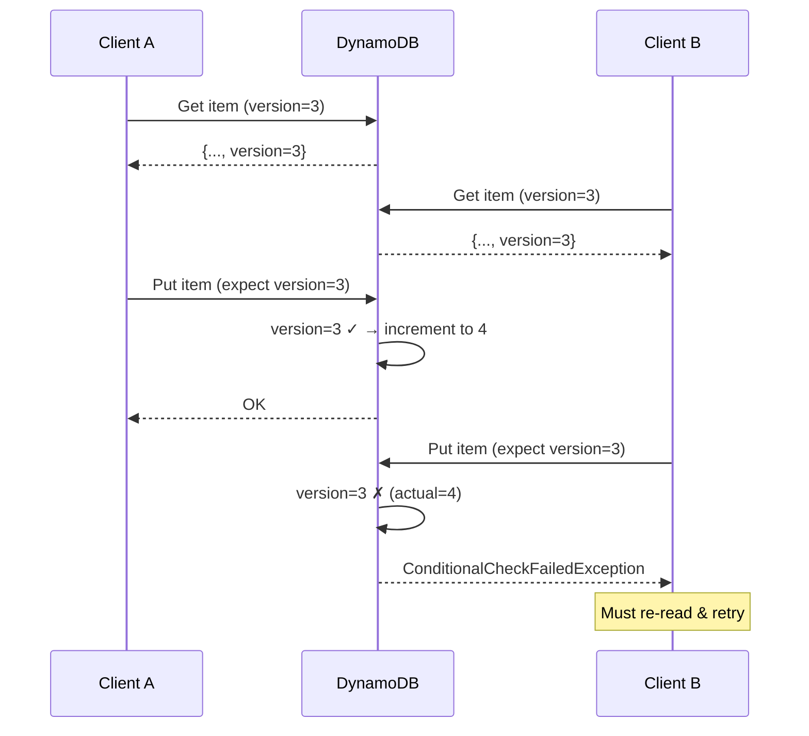
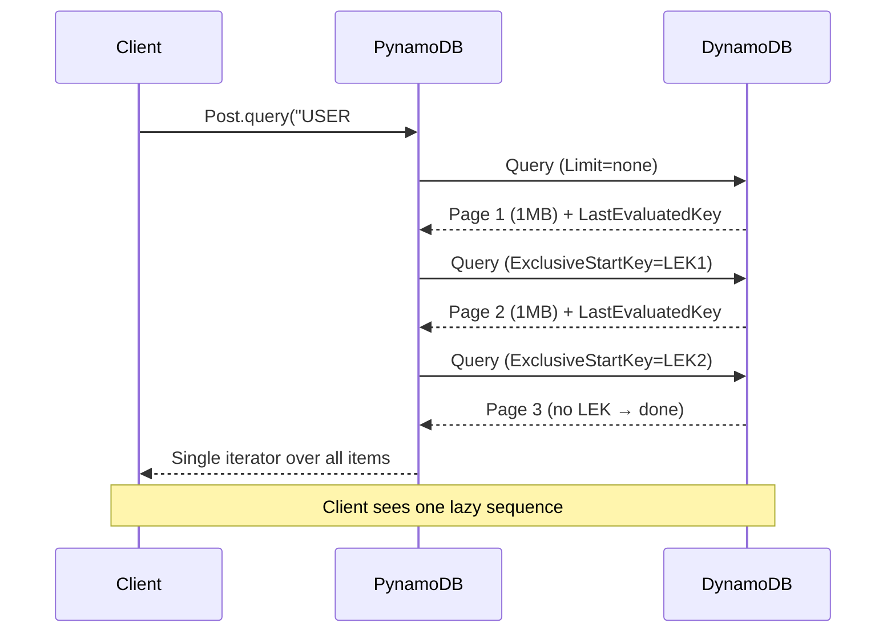
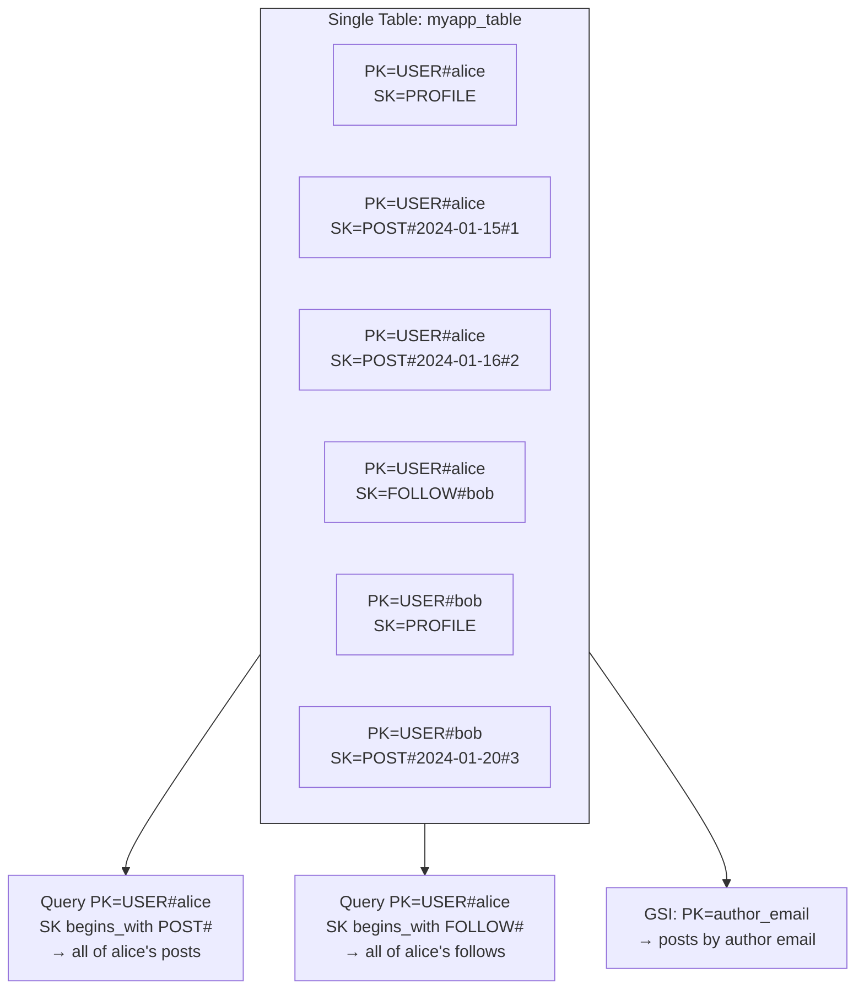
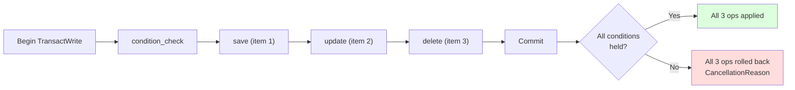
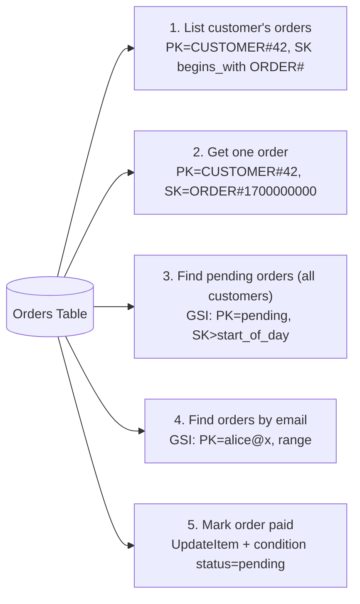

# Flask-PynamoDB

#flask #nosql #dynamodb #aws #orm #keyvalue

> [!info] The Pythonic ORM for AWS DynamoDB
> [PynamoDB](https://pynamodb.readthedocs.io/) is a strongly-typed Python ORM for AWS DynamoDB. Unlike `boto3`, which exposes a low-level `client.put_item()` API, PynamoDB lets you declare models with typed attributes, perform queries using Python syntax, and handle pagination, conditional writes, and transactions cleanly. There is **no official `Flask-PynamoDB` package** — PynamoDB is used directly with the [extensions pattern](../01-Introduction/Project-Structure.md#where-each-extension-lives) — but the integration is so common in Flask-on-AWS projects that this note covers it as part of the NoSQL family.

This note covers models, attributes, GSIs, single-table design, pagination, conditional writes, transactions, and how PynamoDB compares to raw `boto3`.

---

## 1. Overview & Metaphor

### What is DynamoDB?

DynamoDB is AWS's managed **key-value and document** database. It is **serverless** — you provision throughput (or use on-demand) and AWS handles replication, sharding, and failover. It is:

- **Fast**: single-digit-millisecond reads/writes at any scale.
- **Schema-flexible** but **schema-on-read**: each item has a partition key and optionally a sort key, plus any other attributes.
- **Not a SQL database**: no JOINs, limited ad-hoc queries, no cross-table transactions before 2018 (now supported but limited).
- **Query-driven**: you design the **table around the queries**, not the entities.

> [!tip] The metaphor
> DynamoDB is like a **filing cabinet** with strict rules: every folder goes in a drawer (partition key), and inside the drawer, folders are sorted alphabetically (sort key). You can grab a single folder instantly, or grab a range of folders from one drawer — but you **cannot** search across drawers without an index. To answer "show me all folders tagged 'invoice' across all drawers," you must have planned for that query when you built the cabinet (a GSI).

### Key concepts

| Concept | Description |
|---|---|
| **Table** | Like a collection. Holds items. |
| **Item** | A single record. Like a row, but with arbitrary attributes. Max 400 KB. |
| **Partition key (PK)** | Hash key. Determines which shard holds the item. Required. |
| **Sort key (SK)** | Range key. Lets you sort items within a partition and query ranges. Optional. |
| **Attribute** | A single field on an item. Can be string, number, binary, set, list, map, boolean, null. |
| **LSI (Local Secondary Index)** | Alternate sort key, same PK. Must be created at table creation. Max 5 per table. |
| **GSI (Global Secondary Index)** | Alternate PK + SK. Can be created any time. Eventual consistency. |
| **RCU / WCU** | Read/Write Capacity Units (provisioned mode). On-demand mode skips these. |

### Why PynamoDB?

`boto3.resource("dynamodb").Table(...)` is fine for a few operations but quickly gets painful:

```python
# Raw boto3 — error-prone, no types
table.put_item(Item={
    "PK": f"USER#{user_id}",
    "SK": "PROFILE",
    "email": email,
    "age": age,
    "created_at": int(time.time()),
})
response = table.query(
    KeyConditionExpression="PK = :pk AND begins_with(SK, :sk)",
    ExpressionAttributeValues={":pk": f"USER#{user_id}", ":sk": "POST#"},
)
```

```python
# PynamoDB — typed, validated, ergonomic
user = User(pk=f"USER#{user_id}", sk="PROFILE", email=email, age=age)
user.save()

posts = list(Post.query(f"USER#{user_id}", Post.sk.startswith("POST#")))
```

PynamoDB gives you:
- **Typed attributes** (`UnicodeAttribute`, `NumberAttribute`, `MapAttribute`, etc.)
- **Pythonic queries** (`Model.query(pk, Model.sk.startswith("POST#"))`)
- **Automatic pagination** (`.query()` returns a lazy iterator)
- **Conditional writes** (`.save(condition=...)`)
- **Transactions** (`TransactWrite`)
- **Model inheritance** for single-table design
- **Type hints** for IDE autocomplete

---

## 2. Installation

```bash
(venv) $ pip install pynamodb
```

Versions referenced in this note:

| Package | Version |
|---|---|
| Flask | 3.0.x |
| pynamodb | 5.5.x |
| boto3 | 1.34.x (transitive) |

You'll need AWS credentials. The simplest setup is `aws configure`:

```bash
$ pip install awscli
$ aws configure
AWS Access Key ID [None]: AKIA...
AWS Secret Access Key [None]: ...
Default region name [None]: us-east-1
```

Or run locally with [LocalStack](https://localstack.cloud/) or DynamoDB Local:

```bash
$ docker run -d -p 8000:8000 --name dynamodb amazon/dynamodb-local
```

---

## 3. Configuration

PynamoDB doesn't have a `flask` integration object — you set AWS config globally:

```python
# app/extensions.py
import os
from pynamodb.models import Model
from pynamodb.attributes import UnicodeAttribute


class BaseModel(Model):
    """Abstract base — sets region and table prefix per environment."""
    class Meta:
        abstract = True
        region = os.environ.get("AWS_REGION", "us-east-1")
        if os.environ.get("DYNAMODB_ENDPOINT"):
            # Point at DynamoDB Local or LocalStack
            Meta.host = os.environ["DYNAMODB_ENDPOINT"]
        # Optional: custom boto3 session
        # session = boto3.session.Session(...)
```

```python
# app/__init__.py
import os
from flask import Flask

def create_app():
    app = Flask(__name__)
    app.config["TABLE_PREFIX"] = os.environ.get("TABLE_PREFIX", f"{app.env}_")
    # ...
    return app
```

### Configuration options

| Option | Where | Default | Description |
|---|---|---|---|
| `region` | `Meta.region` | AWS default | AWS region for the table. |
| `host` | `Meta.host` | `None` | Custom endpoint URL (DynamoDB Local). |
| `table_name` | `Meta.table_name` | Class name | Override the table name. |
| `read_capacity_units` | `Meta` | `None` | Provisioned RCU (on-demand if omitted). |
| `write_capacity_units` | `Meta` | `None` | Provisioned WCU. |
| `billing_mode` | `Meta` | `"PROVISIONED"` | Use `"PAY_PER_REQUEST"` for on-demand. |
| `session` | `Meta.session` | Default | Custom `boto3.session.Session`. |
| `connect_timeout_seconds` | `Meta` | 15 | Connection timeout. |
| `read_timeout_seconds` | `Meta` | 30 | Read timeout. |
| `max_retry_attempts` | `Meta` | 3 | Retries on throttling. |
| `base_backoff_ms` | `Meta` | 25 | Initial backoff for retries. |

### Production-grade config

```python
# app/config.py
import os


class Config:
    AWS_REGION = os.environ["AWS_REGION"]
    DYNAMODB_ENDPOINT = os.environ.get("DYNAMODB_ENDPOINT")  # None in prod
    TABLE_PREFIX = os.environ.get("TABLE_PREFIX", "prod_")
    AWS_ACCESS_KEY_ID = os.environ["AWS_ACCESS_KEY_ID"]
    AWS_SECRET_ACCESS_KEY = os.environ["AWS_SECRET_ACCESS_KEY"]


class TestingConfig(Config):
    DYNAMODB_ENDPOINT = "http://localhost:8000"
    TABLE_PREFIX = "test_"
```

> [!warning] Don't hard-code credentials in your app
> In production, rely on the IAM role attached to your ECS task / EC2 instance / Lambda function. Never put `AWS_ACCESS_KEY_ID` in your code or git. Locally, use `~/.aws/credentials` or `aws-vault`.

---

## 4. Basic Usage

### Defining a model

```python
# app/models/user.py
from datetime import datetime
from pynamodb.models import Model
from pynamodb.attributes import (
    UnicodeAttribute, NumberAttribute, BooleanAttribute,
    UTCDateTimeAttribute, UnicodeSetAttribute,
)
from app.extensions import BaseModel


class User(BaseModel):
    class Meta(BaseModel.Meta):
        table_name = f"{table_prefix}users"

    pk = UnicodeAttribute(hash_key=True)        # e.g., "USER#alice"
    sk = UnicodeAttribute(range_key=True)       # e.g., "PROFILE"
    email = UnicodeAttribute(null=False)
    age = NumberAttribute(null=True)
    is_active = BooleanAttribute(default=True)
    roles = UnicodeSetAttribute(default=set)
    created_at = UTCDateTimeAttribute(default=datetime.utcnow)

    def __str__(self):
        return f"<User {self.pk}>"
```

### CRUD operations

```python
# CREATE
user = User(pk="USER#alice", sk="PROFILE", email="alice@example.com", age=30)
user.save()                  # creates the item
# Conditional create — fail if it already exists
user.save(condition=(User.pk.does_not_exist()))

# READ
user = User.get("USER#alice", "PROFILE")             # by full key
user = User.get("USER#alice", "PROFILE", consistent_read=True)  # strong consistency

# UPDATE
user.age = 31
user.save()                  # full overwrite (PUT)
user.update(actions=[User.age.set(31), User.is_active.set(False)])  # partial update

# DELETE
user.delete()
# Conditional delete — only if no one changed it
user.delete(condition=(User.age == 31))
```

> [!warning] `save()` is a PUT, not a PATCH
> `user.save()` writes the **entire** item back to DynamoDB, replacing whatever was there. If another process added an attribute you didn't load, it disappears. For partial updates, use `model.update(actions=[...])` or `Model.update_item()` — those use `UpdateItem` with `UpdateExpression`.

### Consistency

DynamoDB reads are **eventually consistent** by default — a read right after a write may return stale data. Pass `consistent_read=True` to `get()` for a strongly consistent read (costs the same but uses more RCUs and is slower).

```python
# After a write, you may want strong consistency on the next read
user = User.get("USER#alice", "PROFILE", consistent_read=True)
```

---

## 5. Attributes

PynamoDB ships with a rich attribute set:

| Attribute | Python type | DynamoDB type |
|---|---|---|
| `UnicodeAttribute` | `str` | String |
| `UnicodeSetAttribute` | `set[str]` | String Set |
| `NumberAttribute` | `int` / `float` | Number |
| `NumberSetAttribute` | `set[int]` | Number Set |
| `BinaryAttribute` | `bytes` | Binary |
| `BinarySetAttribute` | `set[bytes]` | Binary Set |
| `BooleanAttribute` | `bool` | Boolean |
| `NullAttribute` | `None` | Null |
| `UTCDateTimeAttribute` | `datetime` | String (ISO 8601) |
| `MapAttribute` | `dict`-like | Map |
| `ListAttribute` | `list` | List |
| `JSONAttribute` | any JSON-serializable | String (JSON) |
| `VersionAttribute` | `int` | Number — for optimistic locking |

### Custom MapAttribute

```python
from pynamodb.attributes import MapAttribute


class Address(MapAttribute):
    street = UnicodeAttribute()
    city = UnicodeAttribute()
    country = UnicodeAttribute(default="DE")


class User(BaseModel):
    # ...
    address = Address(null=True)


user = User(
    pk="USER#alice", sk="PROFILE",
    email="alice@example.com",
    address=Address(street="Hauptstr. 1", city="Berlin"),
)
```

### VersionAttribute (optimistic locking)

```python
class Post(BaseModel):
    # ...
    version = VersionAttribute()

post = Post.get("POST#1", "META")
post.title = "Updated"
post.save()           # increments version; fails if someone else changed it
# ConditionalCheckFailedException if `version` changed since you read it
```



---

## 6. Querying & Pagination

### `query` — by partition key

```python
# All items in a partition
posts = Post.query("USER#alice")

# With sort key condition
recent = Post.query(
    "USER#alice",
    Post.sk.between("POST#2024-01-01", "POST#2024-12-31"),
    limit=10,
    scan_index_forward=False,   # descending
)

# begins_with — common in single-table design
all_posts = Post.query("USER#alice", Post.sk.startswith("POST#"))
```

### `scan` — every item in the table (slow!)

```python
# AVOID — scans every partition
for user in User.scan():
    process(user)

# Filtered scan (filter applied AFTER scan — still scans everything)
active = list(User.scan(User.is_active == True))

# Parallel scan — split partitions across workers
for user in User.scan(segment=0, total_segments=4):
    process(user)   # Worker 0 of 4
```

> [!danger] `.scan()` is almost always wrong
> `scan` reads every item in the table — at 1 GB / million items, this is slow and expensive. If you find yourself writing `for x in Model.scan()`, you have a query-design problem. Add a GSI or rethink your access patterns.

### Pagination

DynamoDB paginates automatically — `query()` and `scan()` return at most 1 MB per call, plus a `LastEvaluatedKey` you pass back as `exclusive_start_key`. PynamoDB wraps this in a lazy iterator:

```python
# PynamoDB handles pagination transparently
for post in Post.query("USER#alice"):  # may issue many HTTP calls under the hood
    process(post)

# Manual pagination (e.g., for HTTP APIs)
results, metadata = Post.query("USER#alice", limit=20, return_cursor=True)
# metadata.last_evaluated_key is the cursor for the next page

# Next page:
next_results, _ = Post.query(
    "USER#alice", limit=20,
    exclusive_start_key=metadata.last_evaluated_key,
    return_cursor=True,
)
```



### Filter expressions

Filters apply **after** the read — they reduce the result but don't reduce RCU consumption:

```python
# Read all of alice's posts, keep only published ones
published = Post.query(
    "USER#alice",
    Post.sk.startswith("POST#"),
    filter_condition=Post.is_published == True,
)
```

If 90% of alice's posts are unpublished, you're paying for reads on all of them — even though only 10% come back. Fix by putting `is_published` in the sort key (e.g., `POST#PUBLISHED#2024-...` vs. `POST#DRAFT#...`) so you can query the subset directly.

---

## 7. Global Secondary Indexes (GSIs)

A GSI lets you query by a different partition key. Essential when you have multiple access patterns.

```python
class Post(BaseModel):
    pk = UnicodeAttribute(hash_key=True)        # "USER#alice"
    sk = UnicodeAttribute(range_key=True)       # "POST#2024-01-15#..."

    # GSI: find posts by author_email
    author_email = UnicodeAttribute()
    created_at = UnicodeAttribute()

    class Meta(BaseModel.Meta):
        table_name = f"{prefix}posts"
        index_name = "by_email"

    # Define the index
    by_email = GlobalSecondaryIndex(
        hash_key="author_email",
        range_key="created_at",
        projection="ALL",
        read_capacity_units=5,
        write_capacity_units=5,
    )


# Query the GSI
posts = Post.by_email.query("alice@example.com", Post.created_at > "2024-01-01")
```

| GSI aspect | Notes |
|---|---|
| **Eventually consistent** | GSIs are never strongly consistent. Allow a second or two of lag. |
| **Provisioned throughput** | Separate from the base table. Underprovisioning = throttling. |
| **Projection** | `ALL`, `KEYS_ONLY`, or `INCLUDE(attr1, attr2)`. `INCLUDE` saves space but causes `ProjectionException` if you query a non-projected attribute. |
| **Sparse** | If an item has no GSI key attribute, it's not in the GSI. Useful for "active users" indexes. |
| **Limit** | 20 GSIs per table. |

### Single-table design

The most powerful DynamoDB pattern: **one table for the whole app**. Each item is identified by a composite key like `PK=USER#alice`, `SK=PROFILE` (or `POST#2024-01-15#abc`). Different "entities" share the table; queries select ranges within a partition.



```python
# One model class for all entities — discriminated by SK prefix
class Item(BaseModel):
    pk = UnicodeAttribute(hash_key=True)
    sk = UnicodeAttribute(range_key=True)
    entity_type = UnicodeAttribute()    # "User", "Post", "Follow"
    data = JSONAttribute(default=dict)  # payload

# Queries:
alice_posts = Item.query("USER#alice", Item.sk.startswith("POST#"))
alice_follows = Item.query("USER#alice", Item.sk.startswith("FOLLOW#"))
```

For richer typing, define separate model classes that map to the same table by overriding `Meta.table_name` and using a discriminator attribute — see the [DynamoDB single-table pattern](https://www.alexdebrie.com/posts/dynamodb-single-table/) for the full design discipline.

---

## 8. Conditional Writes & Transactions

### Conditional writes

Atomic operations based on a precondition — no race conditions:

```python
# Only decrement stock if quantity > 0
Product.update(
    actions=[Product.stock.add(-1)],
    condition=(Product.stock > 0),
)

# Only create if email isn't taken (requires a GSI on email)
User(pk=f"USER#{user_id}", sk="PROFILE", email=email).save(
    condition=(User.email.does_not_exist())
)
```

If the condition fails, DynamoDB raises `ConditionalCheckFailedException` — PynamoDB surfaces it as `pynamodb.exceptions.PutError` / `UpdateError`.

### Transactions

```python
from pynamodb.transactions import TransactWrite

with TransactWrite() as tx:
    tx.condition_check(User, "USER#alice", "PROFILE", condition=(User.is_active == True))
    tx.save(User(pk="USER#alice", sk="POST#1", body="Hello"))
    tx.update(User, "USER#bob", "PROFILE", actions=[User.post_count.add(1)])
    tx.delete(User, "USER#charlie", "PROFILE")
```

Transactions:
- Up to 100 items per transaction.
- Up to 4 MB total request size.
- Atomic across items in one or multiple tables.
- Cost 2x the standard write cost.



---

## 9. Batch Operations

```python
with User.batch_write() as batch:
    for i in range(1000):
        batch.save(User(pk=f"USER#{i}", sk="PROFILE", email=f"u{i}@x.com"))

# Batch get
users = User.batch_get([(f"USER#{i}", "PROFILE") for i in range(50)])

# Batch get across tables — limited to 100 items per call; PynamoDB chunks
```

Batch operations are **not atomic** — they're just batches of independent operations. Each item can succeed or fail independently. Useful for bulk loads; for atomic multi-item writes use `TransactWrite`.

---

## 10. Testing

Use DynamoDB Local in Docker, plus the `pynamodb.connection.base` to point at it:

```python
# tests/conftest.py
import os
import pytest
from pynamodb.connection.base import Connection

# Point PynamoDB at DynamoDB Local
os.environ["AWS_ACCESS_KEY_ID"] = "test"
os.environ["AWS_SECRET_ACCESS_KEY"] = "test"
os.environ["AWS_REGION"] = "us-east-1"

@pytest.fixture(scope="session", autouse=True)
def dynamodb_local():
    os.environ["DYNAMODB_ENDPOINT"] = "http://localhost:8000"
    # Override the Connection's host for all models
    from pynamodb.connection.base import Connection
    Connection.set_base_url("http://localhost:8000")
    yield


@pytest.fixture(autouse=True)
def create_tables():
    User.create_table(wait=True, billing_mode="PAY_PER_REQUEST")
    Post.create_table(wait=True, billing_mode="PAY_PER_REQUEST")
    yield
    User.delete_table()
    Post.delete_table()
```

```python
# tests/test_models.py
def test_user_creation():
    user = User(pk="USER#alice", sk="PROFILE", email="alice@example.com")
    user.save()

    fetched = User.get("USER#alice", "PROFILE")
    assert fetched.email == "alice@example.com"

def test_conditional_create_fails_on_duplicate():
    User(pk="USER#alice", sk="PROFILE", email="a@x.com").save()
    with pytest.raises(User.PutError):
        User(pk="USER#alice", sk="PROFILE", email="b@x.com").save(
            condition=(User.pk.does_not_exist())
        )
```

> [!tip] Use `moto` for AWS-free tests
> The [`moto`](https://github.com/getmoto/moto) library mocks AWS APIs in memory — no Docker needed. Wrap your tests with `@mock_aws` and PynamoDB will hit the mock. Caveat: some edge cases (LSI creation, certain conditions) behave differently than real DynamoDB.

---

## 11. Performance Tips

1. **Design for your queries, not your entities.** List the queries first; then design PKs/SKs and GSIs to satisfy them. Don't try to "normalize."
2. **Use single-table design** to collapse joins — get related items with one `query` call.
3. **Avoid `scan()`.** Almost always wrong.
4. **Use sparse GSIs** for "active" subsets — only items with the GSI key appear in the index.
5. **Batch reads and writes** — `batch_get` and `batch_write` reduce request count.
6. **Use on-demand billing for spiky workloads** — no throttling, pay per request.
7. **Set `connect_timeout_seconds` and `read_timeout_seconds`** appropriately — PynamoDB defaults are generous.
8. **Enable retries with backoff** — `max_retry_attempts=5` for throttled workloads.
9. **Cache hot reads** with [[Flask-Caching]] — DynamoDB GSIs are eventually consistent, so caching for 5-30s rarely hurts and dramatically reduces RCUs.
10. **Use `ReturnValues=ALL_OLD`** via `update(actions=[...], return_values="ALL_OLD")` if you need the previous state — avoids an extra read.

---

## 12. Integration with Other Extensions

### [[Flask-Login]]

PynamoDB doesn't integrate as cleanly as SQLAlchemy, but works:

```python
from flask_login import UserMixin

class User(UserMixin, BaseModel):
    pk = UnicodeAttribute(hash_key=True)
    sk = UnicodeAttribute(range_key=True)
    email = UnicodeAttribute()
    password_hash = UnicodeAttribute()

    def get_id(self):
        return self.pk  # "USER#alice"

    @classmethod
    def by_email(cls, email):
        # Requires GSI on email
        return cls.by_email_index.query(email).next()
```

### [[Flask-Caching]]

Wrap slow aggregations (e.g., user stats):

```python
from app.extensions import cache

@cache.cached(timeout=60, key_prefix="user_stats")
def user_stats(user_id):
    post_count = Post.query(f"USER#{user_id}", Post.sk.startswith("POST#")).count()
    return {"post_count": post_count}
```

### [[Celery]]

For background processing — fan out long-running work:

```python
@celery.task
def reindex_user_posts(user_id):
    for post in Post.query(f"USER#{user_id}", Post.sk.startswith("POST#")):
        # ... index ...
```

---

## 13. Full Real-World Example: A Multi-tenant Order System

```python
# app/models/order.py
from datetime import datetime
from pynamodb.models import Model
from pynamodb.attributes import (
    UnicodeAttribute, NumberAttribute, UTCDateTimeAttribute,
    MapAttribute, ListAttribute, BooleanAttribute,
    GlobalSecondaryIndex,
)
from app.extensions import BaseModel


class OrderItem(MapAttribute):
    sku = UnicodeAttribute()
    name = UnicodeAttribute()
    qty = NumberAttribute()
    unit_price = NumberAttribute()


class Order(BaseModel):
    class Meta(BaseModel.Meta):
        table_name = f"{prefix}orders"
        billing_mode = "PAY_PER_REQUEST"

    # Single-table style: PK = CUSTOMER#<id>, SK = ORDER#<timestamp>
    pk = UnicodeAttribute(hash_key=True)
    sk = UnicodeAttribute(range_key=True)

    customer_email = UnicodeAttribute()
    status = UnicodeAttribute(default="pending")  # pending, paid, shipped
    items = ListAttribute(of=OrderItem, default=list)
    total = NumberAttribute(default=0)
    created_at = UTCDateTimeAttribute(default=datetime.utcnow)
    paid_at = UTCDateTimeAttribute(null=True)

    # GSI: find orders by status across all customers
    by_status = GlobalSecondaryIndex(
        hash_key="status",
        range_key="created_at",
        projection="ALL",
    )

    # GSI: find orders by customer email
    by_email = GlobalSecondaryIndex(
        hash_key="customer_email",
        range_key="created_at",
        projection="ALL",
    )

    @classmethod
    def create(cls, customer_id, customer_email, items):
        now = datetime.utcnow().timestamp()
        order = cls(
            pk=f"CUSTOMER#{customer_id}",
            sk=f"ORDER#{now}",
            customer_email=customer_email,
            items=items,
            total=sum(i.qty * i.unit_price for i in items),
        )
        order.save(condition=(cls.pk.does_not_exist()))
        return order

    @classmethod
    def list_for_customer(cls, customer_id, since=None):
        if since:
            return cls.query(f"CUSTOMER#{customer_id}", cls.sk > f"ORDER#{since}")
        return cls.query(f"CUSTOMER#{customer_id}", cls.sk.startswith("ORDER#"))

    @classmethod
    def mark_paid(cls, customer_id, order_ts):
        cls.update(
            f"CUSTOMER#{customer_id}",
            f"ORDER#{order_ts}",
            actions=[
                cls.status.set("paid"),
                cls.paid_at.set(datetime.utcnow()),
            ],
            condition=(cls.status == "pending"),
        )
```

### Single-table access patterns



### Usage

```python
order = Order.create(
    customer_id=42,
    customer_email="alice@example.com",
    items=[
        OrderItem(sku="A1", name="Widget", qty=2, unit_price=999),
        OrderItem(sku="B2", name="Gadget", qty=1, unit_price=1500),
    ],
)

# List Alice's orders
for o in Order.list_for_customer(42):
    print(o.sk, o.total, o.status)

# Process all pending orders
for o in Order.by_status.query("pending", Order.created_at > "2024-01-01"):
    process_payment(o)
    Order.mark_paid(42, o.created_at.timestamp())
```

---

## 14. Common Pitfalls & Troubleshooting

> [!danger] Top 10 PynamoDB mistakes
> 1. **Using `scan()` for filters** — should be a query on a GSI.
> 2. **Forgetting `condition=` on save** — silently overwrites concurrent updates.
> 3. **Treating GSIs as strongly consistent** — they aren't; recent writes may not appear.
> 4. **Hot partitions** — putting all writes on one PK throttles.
> 5. **Filter expressions don't reduce cost** — they only reduce what comes back; you still pay for the full read.
> 6. **400 KB item size limit** — large lists/maps in a single item hit this.
> 7. **1 MB query response limit** — pagination isn't optional; let PynamoDB handle it.
> 8. **`save()` is a PUT** — deletes attributes you didn't load.
> 9. **Forgetting `consistent_read=True`** — you read stale data right after a write.
> 10. **Local tests pass, prod fails** — `moto`/DynamoDB Local don't enforce provisioned throughput.

### `ProvisionedThroughputExceededException`

You're being throttled. Either:
- Switch to on-demand (`billing_mode="PAY_PER_REQUEST"`).
- Increase RCU/WCU on the table or GSI.
- Add jitter to bursty writes.
- Use exponential backoff (`max_retry_attempts=10`).

### `ConditionalCheckFailedException`

The condition on a `save(condition=...)` or `update(condition=...)` didn't hold. Often expected — re-read and retry.

### `ResourceNotFoundException`

The table doesn't exist in that region, or you forgot `create_table(wait=True)`. Run `aws dynamodb list-tables --region <region>` to verify.

### `ValidationException: One or more parameter values were invalid`

Common causes:
- Empty string in an attribute (DynamoDB rejects empty strings — use `null=True` instead).
- Set attribute with one element (allowed now, but check version).
- Number outside DynamoDB's range (38-digit max).

---

## 15. Comparison: PynamoDB vs. boto3 vs. MongoEngine

| Aspect | boto3 (raw) | PynamoDB | MongoEngine |
|---|---|---|---|
| Abstraction | None | ORM-like | ODM |
| Schema | None | Python-typed | App-layer validation |
| Queries | `KeyConditionExpression` strings | `Model.query(pk, ...)` | `Model.objects(...)` |
| Pagination | Manual `LastEvaluatedKey` | Automatic lazy iterator | Manual `.skip()/.limit()` |
| Transactions | `transact_write_items()` | `TransactWrite` context manager | Multi-doc transactions |
| GSIs | Manual | First-class | Indexes (different model) |
| Best for | Scripts, maximum control | Apps on DynamoDB | Apps on MongoDB |

> [!tip] When to drop to boto3
> For bulk imports (`BatchWriteItem` with 25 items/call), PartiQL queries, or streams consumption, `boto3` gives finer control. PynamoDB's `Model._get_connection()` exposes the underlying client if you need both.

---

## 16. Best Practices

> [!tip] PynamoDB best practices
> 1. **Design tables around queries, not entities.** Single-table design is the gold standard.
> 2. **Use `condition=` on every save** that could race.
> 3. **Prefer `update(actions=[...])` over `save()`** for partial updates.
> 4. **Use GSIs for secondary access patterns** — never `scan()`.
> 5. **Use on-demand billing** unless you have steady, predictable load.
> 6. **Cache hot reads** with [[Flask-Caching]] — DynamoDB latency is low but RCUs cost money.
> 7. **Set up retries with backoff.** Production traffic gets throttled.
> 8. **Use sparse GSIs** for "active" or "pending" subsets.
> 9. **Run integration tests against DynamoDB Local**, not just `moto`.
> 10. **Monitor consumed capacity** in CloudWatch — a hot partition looks fine until it suddenly doesn't.

---

## 17. References & Further Reading

- [PynamoDB docs](https://pynamodb.readthedocs.io/) — the canonical reference.
- [DynamoDB Developer Guide](https://docs.aws.amazon.com/amazondynamodb/latest/developerguide/) — server docs.
- [Alex DeBrie — The DynamoDB Book](https://www.dynamodbbook.com/) — best resource on single-table design.
- [Rick Houlihan — re:Invent talks](https://www.youtube.com/results?search_query=rick+houlihan+dynamodb) — single-table patterns from the architect himself.
- [AWS DynamoDB Local](https://docs.aws.amazon.com/amazondynamodb/latest/developerguide/DynamoDBLocal.html) — local dev.
- [moto](https://github.com/getmoto/moto) — AWS mocking.

---

## 18. Cheat Sheet

```python
# Create
item = Model(pk="...", sk="...", attr="value")
item.save(condition=(Model.pk.does_not_exist()))

# Read
item = Model.get("pk", "sk", consistent_read=True)

# Query by partition
qs = Model.query("pk_value", Model.sk.startswith("PREFIX#"), limit=10)
items = list(qs)  # paginates automatically

# GSI query
qs = Model.by_status.query("pending", Model.created_at > "2024-01-01")

# Update (partial)
Model.update("pk", "sk", actions=[Model.attr.set("x"), Model.counter.add(1)],
             condition=(Model.status == "pending"))

# Conditional delete
item.delete(condition=(Model.version == 3))

# Transactions
with TransactWrite() as tx:
    tx.save(item1)
    tx.update(Model, "pk", "sk", actions=[Model.x.set(1)])
    tx.delete(Model, "pk2", "sk2")

# Batch
with Model.batch_write() as batch:
    for it in items: batch.save(it)
got = Model.batch_get([("pk1", "sk1"), ("pk2", "sk2")])

# Scan (avoid)
for x in Model.scan(filter_condition=Model.active == True):
    process(x)
```

---

*See also: [[Flask-SQLAlchemy]] · [[Flask-MongoEngine]] · [[Flask-Redis]] · [[Flask-Caching]] · [[Project-Structure]] · [[00-Map-of-Content]]*
