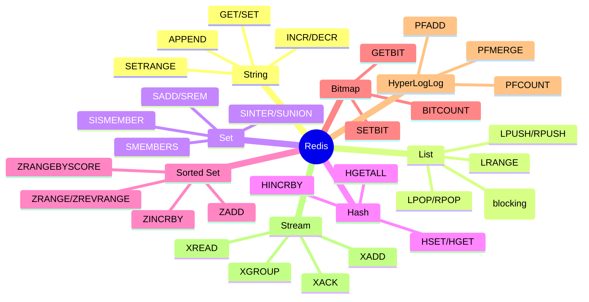
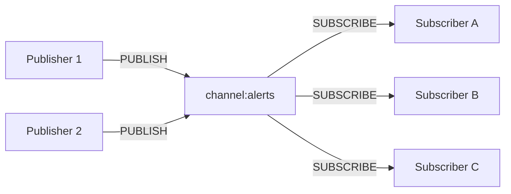
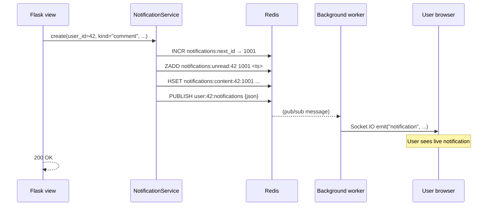

# Flask-Redis

#flask #redis #caching #pubsub #datastructures #nosql

> [!info] More than a cache — Redis as a real-time data platform
> Redis is in-memory, single-threaded, and absurdly fast (100k+ ops/sec on a laptop). Most Flask developers meet it through [[Flask-Caching]] as a cache backend. But Redis is also a **data-structure server**: lists, sets, hashes, sorted sets, streams, bitmaps, hyperloglogs. This note covers the full surface — not just caching — using [`flask-redis`](https://github.com/underyx/flask-redis) or just `redis-py` directly with the extensions pattern.

This is a deliberately long note because using Redis only as a cache leaves 80% of its power on the table.

---

## 1. Overview & Metaphor

### What is Redis?

Redis is an **in-memory key-value store** with rich data structures. "In-memory" means **everything is in RAM** — reads and writes are sub-millisecond. Persistence is optional (RDB snapshots, AOF log).

> [!tip] The metaphor
> If Postgres is a **filing cabinet** (durable, structured, slow to scan) and DynamoDB is a **well-organized warehouse** (managed, partitioned), Redis is a **whiteboard** — you write things down and read them back instantly, but if the power goes out you'd better have taken a photo (RDB/AOF). Use it for things that are fast, ephemeral, or shared between processes.

### When Redis, when [[Flask-Caching]]?

| Need | Use |
|---|---|
| Simple `get/set` cache with TTL | [[Flask-Caching]] (Redis backend) |
| Cache with custom key patterns, invalidation logic | Direct Redis |
| Rate limiting, distributed locks | Direct Redis (`INCR`, `SETNX`) |
| Counters, leaderboards, real-time stats | Direct Redis (sorted sets, hyperloglog) |
| Job queues, pub/sub, streams | Direct Redis (used by Celery, RQ, etc.) |
| Session storage (alternative to cookies) | Direct Redis or Flask-Session |

[[Flask-Caching]] abstracts away Redis for one use case (caching function results). This note covers **everything else**.

### What `flask-redis` adds

You don't strictly need a Flask extension — `redis.Redis()` is enough. But `flask-redis` provides:

- A `Redis()` instance that reads config from `app.config`
- An app-context-aware connection pool
- `redis.Redis` subclass methods directly on the extension

Many projects just use `redis.Redis(host=...)` directly inside `extensions.py`. We'll show both.

---

## 2. Installation

```bash
(venv) $ pip install flask-redis
# or just:
(venv) $ pip install redis
```

Versions referenced:

| Package | Version |
|---|---|
| Flask | 3.0.x |
| flask-redis | 0.4.0 |
| redis-py | 5.0.x |

You also need a running Redis server:

```bash
$ docker run -d -p 6379:6379 --name redis redis:7
```

---

## 3. Configuration

### Minimal setup

```python
# app/extensions.py
from flask_redis import FlaskRedis

redis_store = FlaskRedis()
# Or, if you're using redis-py directly:
# import redis
# redis_store = redis.Redis(host="localhost", port=6379, db=0, decode_responses=True)
```

```python
# app/__init__.py
from flask import Flask
from app.extensions import redis_store

def create_app():
    app = Flask(__name__)
    app.config["REDIS_URL"] = "redis://localhost:6379/0"
    redis_store.init_app(app)
    return app
```

### Configuration options

| Option | Default | Description |
|---|---|---|
| `REDIS_URL` | `redis://localhost:6379/0` | Connection URL. |
| `REDIS_HOST` | `localhost` | Override host. |
| `REDIS_PORT` | `6379` | Override port. |
| `REDIS_PASSWORD` | `None` | AUTH password. |
| `REDIS_DB` | `0` | Logical database number (0-15). |
| `REDIS_DECODE_RESPONSES` | `False` | If `True`, return `str` instead of `bytes`. |
| `REDIS_SOCKET_TIMEOUT` | `None` | Socket timeout seconds. |
| `REDIS_SSL` | `False` | Use TLS. |
| `REDIS_RETRY_ON_TIMEOUT` | `False` | Auto-retry on `TimeoutError`. |

### Production-grade config

```python
# app/config.py
import os

class Config:
    REDIS_URL = os.environ["REDIS_URL"]  # rediss://... for TLS in prod
    REDIS_DECODE_RESPONSES = True         # always in Flask — strings everywhere
    REDIS_SOCKET_TIMEOUT = 5              # fail fast, don't hang requests
    REDIS_RETRY_ON_TIMEOUT = True
    REDIS_HEALTH_CHECK_INTERVAL = 30      # ping every 30s on idle connections


class TestingConfig(Config):
    REDIS_URL = "redis://localhost:6379/15"  # use db 15 for tests
```

> [!tip] `decode_responses=True` is almost always what you want
> By default, redis-py returns `bytes`. That means `redis.get("foo")` returns `b'bar'`, and you have to `.decode()` everywhere. With `decode_responses=True`, you get `str` directly. Set this in every Flask app unless you specifically need binary data.

### Sentinel / Cluster

For high-availability Redis (Sentinel) or sharded Redis (Cluster):

```python
from redis.sentinel import Sentinel
sentinel = Sentinel([("sentinel1", 26379), ("sentinel2", 26379)])
master = sentinel.master_for("mymaster", socket_timeout=5)
slave = sentinel.slave_for("mymaster", socket_timeout=5)
```

```python
from redis.cluster import RedisCluster
rc = RedisCluster(host="cluster-entrypoint", port=6379, decode_responses=True)
```

> [!warning] Cluster ≠ Sentinel
> Redis Cluster shards data across nodes (each node owns a hash slot). Not all commands work the same way — multi-key operations require keys to hash to the same slot (use `{hashtag}` syntax). Sentinel is just HA — one master, replicas, failover handling.

---

## 4. Basic Usage

```python
from app.extensions import redis_store

# Strings
redis_store.set("foo", "bar")
redis_store.get("foo")                       # -> "bar"
redis_store.setex("session:abc", 3600, "x")  # with TTL (1 hour)
redis_store.incr("counter")                  # atomic increment
redis_store.incrby("counter", 5)
redis_store.decr("counter")
redis_store.delete("foo")
redis_store.exists("foo")
redis_store.expire("foo", 60)                # set TTL on existing key
redis_store.ttl("foo")                       # remaining seconds
redis_store.persist("foo")                   # remove TTL
```

> [!tip] Everything is atomic
> Redis is single-threaded — every command runs atomically. `INCR` is a true atomic counter, no locks needed. Use it for rate limiting, view counters, anything where you'd otherwise need a database transaction.

---

## 5. Data Structures

Redis isn't just strings. It exposes **structured collections**, each with its own command set.



### Lists (queues, timelines)

```python
# Push/pop
redis_store.lpush("queue:emails", "job1", "job2")   # left end (head)
redis_store.rpush("queue:emails", "job3")            # right end (tail)
redis_store.lpop("queue:emails")                      # -> "job2" (LIFO)
redis_store.rpop("queue:emails")                      # -> "job3" (FIFO)
redis_store.llen("queue:emails")
redis_store.lrange("queue:emails", 0, -1)             # all items

# Blocking pop — wait for items, useful for workers
item = redis_store.blpop("queue:emails", timeout=30)
```

Use lists for:
- **Job queues** (Celery, RQ use Redis lists under the hood).
- **Activity feeds** — `LPUSH` new items, `LTRIM` to keep only the latest 1000.
- **Recent-visit history** per user.

```python
# Per-user feed: keep last 100 items
redis_store.lpush(f"feed:{user_id}", post_id)
redis_store.ltrim(f"feed:{user_id}", 0, 99)
feed = redis_store.lrange(f"feed:{user_id}", 0, -1)
```

### Sets (tags, followers)

```python
redis_store.sadd("tags:flask", "post:1", "post:2", "post:3")
redis_store.sadd("tags:python", "post:2", "post:4")

redis_store.smembers("tags:flask")              # -> {"post:1", "post:2", "post:3"}
redis_store.sismember("tags:flask", "post:1")   # -> True
redis_store.scard("tags:flask")                  # -> 3

# Set operations — instant!
redis_store.sinter("tags:flask", "tags:python")  # -> {"post:2"} (intersection)
redis_store.sunion("tags:flask", "tags:python")  # -> union
redis_store.sdiff("tags:flask", "tags:python")   # -> {"post:1", "post:3"}

# Followers / following
redis_store.sadd(f"followers:{user_id}", follower_id)
redis_store.sismember(f"followers:{user_id}", follower_id)
# Mutual followers:
redis_store.sinter(f"followers:{a}", f"followers:{b}")
```

### Hashes (object storage)

```python
# Store a user object as a hash
redis_store.hset("user:42", mapping={
    "username": "alice",
    "email": "alice@example.com",
    "login_count": "0",     # Redis hashes store strings
})

redis_store.hget("user:42", "username")           # -> "alice"
redis_store.hgetall("user:42")                     # -> dict
redis_store.hincrby("user:42", "login_count", 1)  # atomic
redis_store.hdel("user:42", "email")
```

Use hashes when:
- You have many small fields per key (more memory-efficient than separate keys).
- You want partial updates (`HSET` one field, not rewrite the whole object).

### Sorted sets (leaderboards, ranking)

```python
# Add members with scores
redis_store.zadd("leaderboard", {"alice": 1500, "bob": 1200, "carol": 2100})

# Top 10 (highest scores)
redis_store.zrevrange("leaderboard", 0, 9, withscores=True)
# -> [("carol", 2100), ("alice", 1500), ("bob", 1200)]

# Rank of a member
redis_store.zrevrank("leaderboard", "alice")  # -> 1 (0-indexed)
redis_store.zscore("leaderboard", "alice")    # -> 1500.0

# Increment score (atomic)
redis_store.zincrby("leaderboard", 50, "alice")

# Range by score (not by rank)
redis_store.zrangebyscore("leaderboard", 1000, 2000)
```

Sorted sets are Redis's killer feature — used for leaderboards, priority queues, time-series indexes (score = timestamp), and sliding-window rate limiters.

```python
# Sliding window rate limiter — 100 requests per user per 60s
def rate_limit(user_id, limit=100, window=60):
    key = f"ratelimit:{user_id}"
    now = time.time()
    pipe = redis_store.pipeline()
    pipe.zadd(key, {str(now): now})                       # add current request
    pipe.zremrangebyscore(key, 0, now - window)           # drop old
    pipe.zcard(key)                                         # count remaining
    pipe.expire(key, window)                                # cleanup
    _, _, count, _ = pipe.execute()
    return count <= limit
```

### Bitmaps (feature flags, daily active users)

```python
# Track which users were active today (user_id → bit position)
redis_store.setbit("active:2024-01-15", user_id, 1)
redis_store.getbit("active:2024-01-15", user_id)   # -> 1

# Count active users today
redis_store.bitcount("active:2024-01-15")

# Users active in last 7 days (AND of 7 bitmaps)
redis_store.bitop("AND", "active:7d", "active:2024-01-09", "active:2024-01-10", ...)
redis_store.bitcount("active:7d")
```

### HyperLogLog (approximate uniques)

```python
# Count unique visitors per day (approximate, ~0.81% error, 12 KB max)
redis_store.pfadd("visitors:2024-01-15", user_id1, user_id2, ...)
redis_store.pfcount("visitors:2024-01-15")    # approximate count

# Merge 7 days of visitors
redis_store.pfmerge("visitors:7d", *[f"visitors:2024-01-{i:02d}" for i in range(8, 15)])
redis_store.pfcount("visitors:7d")
```

For 1M unique users, a set takes ~50 MB; a HyperLogLog takes 12 KB. The trade-off is approximate counting — perfect for analytics dashboards.

### Streams (event log, message queue)

```python
# Producer
redis_store.xadd("events:orders", {"order_id": "123", "amount": "99.99"})

# Consumer (blocking)
messages = redis_store.xread({"events:orders": "$"}, block=5000)  # wait up to 5s

# Consumer group (durable, with ack)
redis_store.xgroup_create("events:orders", "workers", id="$", mkstream=True)
messages = redis_store.xreadgroup("workers", "worker-1", {"events:orders": ">"}, count=10)
for msg_id, fields in messages[0][1]:
    process(fields)
    redis_store.xack("events:orders", "workers", msg_id)
```

Streams are Redis's answer to Kafka — append-only logs with consumer groups, acks, and replay. Used by Celery's Redis broker in some configurations, and a great fit for audit logs and event sourcing.

---

## 6. Pub/Sub



```python
# Subscriber (run in a background thread or Celery worker)
pubsub = redis_store.pubsub()
pubsub.subscribe("channel:alerts")

for message in pubsub.listen():
    if message["type"] == "message":
        print(message["data"])  # the published payload
```

```python
# Publisher (in a Flask view)
redis_store.publish("channel:alerts", "Server is restarting in 5 minutes")
```

> [!warning] Pub/Sub messages are not persisted
> If a subscriber is offline when a message is published, it's gone. For durable messaging, use **Streams** with consumer groups. Pub/Sub is for live notifications (e.g., triggering a [[Flask-SocketIO]] broadcast).

### Pattern subscriptions

```python
pubsub.psubscribe("user:*:events")  # matches "user:42:events", "user:99:events", ...
```

---

## 7. Lua Scripting

Lua scripts run atomically inside Redis — no other command can interleave. Use them when you need multi-step atomicity beyond a single command:

```python
# Atomic compare-and-swap
cas_script = """
local current = redis.call('GET', KEYS[1])
if current == ARGV[1] then
    redis.call('SET', KEYS[1], ARGV[2])
    return 1
else
    return 0
end
"""

cas = redis_store.register_script(cas_script)

# Set "foo" to "new" only if it's currently "old"
result = cas(keys=["foo"], args=["old", "new"])
```

```python
# Atomic rate limiter (sliding window) — single round trip
rate_limit_script = """
local key = KEYS[1]
local now = tonumber(ARGV[1])
local window = tonumber(ARGV[2])
local limit = tonumber(ARGV[3])

redis.call('ZREMRANGEBYSCORE', key, 0, now - window)
local count = redis.call('ZCARD', key)
if count < limit then
    redis.call('ZADD', key, now, now)
    redis.call('EXPIRE', key, window)
    return 1
else
    return 0
end
"""

rate_limit = redis_store.register_script(rate_limit_script)
allowed = rate_limit(keys=[f"ratelimit:{user_id}"], args=[time.time(), 60, 100])
```

> [!tip] `EVALSHA` caching
> `register_script()` calls `EVALSHA` (cheaper than `EVAL`), falling back to `EVAL` if the script isn't loaded. PynamoDB-style: just call it; redis-py handles the caching.

---

## 8. Pipelines & Transactions

### Pipelines (batch round trips)

```python
pipe = redis_store.pipeline()
pipe.set("a", "1")
pipe.set("b", "2")
pipe.incr("counter")
pipe.get("a")
results = pipe.execute()
# results = [True, True, 1, "1"]
```

A pipeline sends all commands in one network round trip — huge speedup for many small commands. **Not atomic** — other clients' commands can interleave.

### Transactions (`MULTI/EXEC`)

```python
pipe = redis_store.pipeline(transaction=True)
pipe.set("a", "1")
pipe.incr("counter")
results = pipe.execute()
# Either all succeed or all fail
```

With `transaction=True`, redis-py wraps the pipeline in `MULTI/EXEC` — atomic, but slightly slower than a non-transactional pipeline.

### `WATCH` for optimistic locking

```python
with redis_store.pipeline() as pipe:
    while True:
        try:
            pipe.watch("counter")
            current = int(pipe.get("counter"))
            pipe.multi()
            pipe.set("counter", current + 1)
            pipe.execute()
            break
        except redis.WatchError:
            continue  # someone else changed it; retry
```

---

## 9. Sessions with Redis

Use [`Flask-Session`](https://flask-session.readthedocs.io/) with the Redis backend to store sessions server-side (instead of in cookies):

```python
from flask_session import Session

app.config["SESSION_TYPE"] = "redis"
app.config["SESSION_PERMANENT"] = False
app.config["SESSION_USE_SIGNER"] = True
app.config["SESSION_REDIS"] = redis.from_url("redis://localhost:6379/1")
Session(app)
```

The session ID is a signed cookie; the data lives in Redis. Lets you log users out everywhere, see active sessions, and store more than 4 KB.

---

## 10. Testing

```python
# tests/conftest.py
import pytest
import fakeredis
from app import create_app

@pytest.fixture
def app():
    app = create_app(testing=True)
    # Patch redis_store with a fake in-memory redis
    import app.extensions
    fake = fakeredis.FakeStrictRedis(decode_responses=True)
    app.extensions.redis_store = fake
    yield app

@pytest.fixture
def redis_store(app):
    return app.extensions.redis_store
```

```python
# tests/test_redis.py
def test_incr(redis_store):
    assert redis_store.incr("counter") == 1
    assert redis_store.incr("counter") == 2

def test_list_feed(redis_store):
    redis_store.lpush("feed:1", "a", "b", "c")
    assert redis_store.lrange("feed:1", 0, -1) == ["c", "b", "a"]

def test_sorted_set(redis_store):
    redis_store.zadd("lb", {"a": 10, "b": 5, "c": 15})
    top = redis_store.zrevrange("lb", 0, -1, withscores=True)
    assert top == [("c", 15.0), ("a", 10.0), ("b", 5.0)]
```

> [!tip] `fakeredis` for fast tests
> [`fakeredis`](https://github.com/cunla/fakeredis-py) implements most of Redis in Python — no Docker needed. Caveat: pub/sub, streams, and some Lua scripts behave differently. Run integration tests against real Redis in CI.

---

## 11. Performance Tips

1. **Use pipelines** for any code path that does >1 Redis call. Round trips dominate.
2. **`MGET`/`MSET`** for batch string operations.
3. **`SCAN` instead of `KEYS`** — `KEYS *` blocks Redis and stalls every other client.
4. **Set TTLs on everything** — unattended keys accumulate; Redis has no garbage collection.
5. **Use `HASH` instead of many separate keys** for related fields — saves memory.
6. **Use `EXPIRE` for cache invalidation**, not `DEL` from your app — set the TTL when you write.
7. **Avoid `KEYS *`** — same reason. Use `SCAN` with a pattern.
8. **Prefer server-side computation** (Lua) over read-process-write — saves round trips.
9. **Use a connection pool** — `redis.ConnectionPool(max_connections=50)` — flask-redis does this by default.
10. **Separate cache DB from job-queue DB** — different persistence / eviction needs.

---

## 12. Integration with Other Extensions

### [[Flask-Caching]]

[[Flask-Caching]] uses Redis as a backend for `@cache.cached()`:

```python
from flask_caching import Cache

app.config["CACHE_TYPE"] = "RedisCache"
app.config["CACHE_REDIS_URL"] = "redis://localhost:6379/2"
cache = Cache(app)

@cache.cached(timeout=300, key_prefix="user_stats")
def user_stats(user_id):
    # ...
```

> [!note] Direct Redis vs. Flask-Caching
> Use [[Flask-Caching]] when you want to cache **function results** with TTL. Use direct Redis when you need data structures (lists, sets, sorted sets), pub/sub, locks, or custom invalidation logic. Many apps use both.

### [[Celery]]

Celery's Redis broker uses lists and pub/sub under the hood. Configure:

```python
app.config["CELERY_BROKER_URL"] = "redis://localhost:6379/3"
app.config["CELERY_RESULT_BACKEND"] = "redis://localhost:6379/4"
```

See [[Celery]].

### [[Flask-SocketIO]]

For real-time web apps, [[Flask-SocketIO]] can use Redis as a message queue to coordinate between workers:

```python
app.config["CELERY_BROKER_URL"] = "redis://..."
socketio = SocketIO(app, message_queue=app.config["CELERY_BROKER_URL"])
```

This lets a Celery worker emit a Socket.IO event that reaches a Flask process holding the user's WebSocket.

### [[Flask-Limiter]]

[[Flask-Limiter]] supports Redis as a storage backend for distributed rate limiting:

```python
app.config["RATELIMIT_STORAGE_URI"] = "redis://localhost:6379/5"
```

---

## 13. Real-World Example: Real-Time Notification Service

A complete notification system using **sorted sets** (unread queue), **hashes** (notification content), and **pub/sub** (live push).

```python
# app/services/notifications.py
import time
import json
from app.extensions import redis_store, socketio

class NotificationService:
    UNREAD_KEY = "notifications:unread:{user_id}"
    CONTENT_KEY = "notifications:content:{user_id}:{notif_id}"
    CHANNEL = "user:{user_id}:notifications"

    @classmethod
    def create(cls, user_id, kind, message, data=None):
        notif_id = redis_store.incr("notifications:next_id")
        score = time.time()
        # Add to user's unread sorted set (newest first)
        redis_store.zadd(cls.UNREAD_KEY.format(user_id=user_id), {notif_id: score})
        # Store content as a hash
        redis_store.hset(
            cls.CONTENT_KEY.format(user_id=user_id, notif_id=notif_id),
            mapping={"kind": kind, "message": message, "data": json.dumps(data or {}), "ts": str(score)},
        )
        redis_store.expire(cls.CONTENT_KEY.format(user_id=user_id, notif_id=notif_id), 86400 * 30)
        # Publish for live push
        payload = json.dumps({"id": notif_id, "kind": kind, "message": message})
        redis_store.publish(cls.CHANNEL.format(user_id=user_id), payload)
        return notif_id

    @classmethod
    def list_unread(cls, user_id, limit=20):
        key = cls.UNREAD_KEY.format(user_id=user_id)
        ids = redis_store.zrevrange(key, 0, limit - 1)
        pipe = redis_store.pipeline()
        for nid in ids:
            pipe.hgetall(cls.CONTENT_KEY.format(user_id=user_id, notif_id=nid))
        results = pipe.execute()
        return list(zip(ids, results))

    @classmethod
    def mark_read(cls, user_id, notif_id):
        redis_store.zrem(cls.UNREAD_KEY.format(user_id=user_id), notif_id)

    @classmethod
    def unread_count(cls, user_id):
        return redis_store.zcard(cls.UNREAD_KEY.format(user_id=user_id))
```

### Notification flow



---

## 14. Common Pitfalls & Troubleshooting

> [!danger] Top 10 Redis mistakes
> 1. **`KEYS *` in production** — blocks the server; use `SCAN`.
> 2. **No TTL on cached data** — Redis fills up; `maxmemory` policy evicts things you needed.
> 3. **Storing huge values** — a single 100 MB value stalls every other client while it's served.
> 4. **Treating Redis as a primary database** — it's in-memory; backups are mandatory.
> 5. **Reading in a loop without pipelines** — round trips kill throughput.
> 6. **Using `FLUSHDB` on prod** — instant cache wipe → thundering herd on your DB.
> 7. **Forgetting `decode_responses=True`** — bytes everywhere in your templates.
> 8. **Mixing cache and queue data in the same DB** — different eviction policies needed.
> 9. **No `maxmemory-policy`** — defaults to `noeviction`, which makes writes fail when full.
> 10. **Single-instance Redis in prod** — no HA. Use Sentinel or Cluster.

### `ConnectionError: Connection refused`

Redis isn't running, or the URL is wrong. Check `redis-cli ping`.

### `ResponseError: MISCONF Redis is configured to save RDB snapshots, but it's currently unable to persist on disk`

The disk is full or unwritable. Redis is now refusing writes by default — set `stop-writes-on-bgsave-error no` as a band-aid, but **fix the disk**.

### `redis.exceptions.TimeoutError`

Command took longer than `socket_timeout`. Either the command is slow (`KEYS *`, big `SMEMBERS`), the server is overloaded, or there's network latency. Increase the timeout, but investigate the cause.

### Memory bloat

Use `MEMORY USAGE key` to inspect a single key. Use `SCAN` + `DEBUG OBJECT` to find large keys. Common culprits: unbounded lists (use `LTRIM`), sets that grow without cleanup (use `SREM` or `EXPIRE`).

---

## 15. Best Practices

> [!tip] Redis best practices
> 1. **Always set `decode_responses=True`** in Flask apps.
> 2. **Set `maxmemory` and `maxmemory-policy=allkeys-lru`** for cache workloads.
> 3. **Use pipelines** for any code path with >1 command.
> 4. **TTL everything** — even "permanent" data should have a long TTL, in case of bugs.
> 5. **Use the right data structure** — sets for membership, hashes for objects, sorted sets for ranking.
> 6. **Don't `KEYS *`** — ever. `SCAN` is the only acceptable scan.
> 7. **Enable persistence** (`AOF` with `appendfsync everysec`) for non-cache data.
> 8. **Run separate Redis instances** for cache vs. queue vs. sessions — different eviction and persistence needs.
> 9. **Monitor with `INFO`** — `used_memory`, `connected_clients`, `rejected_connections`, `evicted_keys`.
> 10. **Don't store data you can't afford to lose** without backups. Snapshot to S3 nightly.

---

## 16. References & Further Reading

- [redis-py docs](https://redis-py.readthedocs.io/) — Python client.
- [Redis commands](https://redis.io/commands/) — the canonical reference.
- [Redis documentation](https://redis.io/docs/) — server, configuration, modules.
- [Redis in Action](https://www.manning.com/books/redis-in-action) — free online.
- [Redis modules — RedisJSON, RediSearch](https://redis.io/docs/stack/) — extended data types.
- [Itamar Haber — Redis Best Practices](https://redis.io/learn/howtos/solutions) — official patterns.

---

## 17. Cheat Sheet

```python
# Strings
r.set("k", "v", ex=60)      # set with 60s TTL
r.get("k")
r.incr("counter")
r.setnx("lock:foo", "owner")   # set if not exists (lock primitive)

# Lists
r.lpush("q", "a", "b")         # head
r.rpush("q", "c")              # tail
r.lpop("q")
r.lrange("q", 0, -1)

# Sets
r.sadd("tags", "flask", "python")
r.smembers("tags")
r.sismember("tags", "flask")
r.sinter("s1", "s2")

# Hashes
r.hset("u:1", mapping={"name": "alice", "age": 30})
r.hget("u:1", "name")
r.hgetall("u:1")
r.hincrby("u:1", "age", 1)

# Sorted sets
r.zadd("lb", {"a": 10, "b": 20})
r.zrevrange("lb", 0, 9, withscores=True)
r.zincrby("lb", 5, "a")
r.zrank("lb", "a")

# Pipelines
pipe = r.pipeline()
pipe.set("a", 1); pipe.incr("c")
pipe.execute()

# Pub/Sub
ps = r.pubsub(); ps.subscribe("ch")
for msg in ps.listen(): ...

# Lua
script = r.register_script("return 1")
script()

# TTL
r.expire("k", 60); r.ttl("k"); r.persist("k")

# SCAN (no KEYS!)
for key in r.scan_iter("user:*"):
    r.delete(key)
```

---

*See also: [[Flask-Caching]] · [[Celery]] · [[Flask-SocketIO]] · [[Flask-Limiter]] · [[Flask-MongoEngine]] · [[Project-Structure]] · [[00-Map-of-Content]]*
