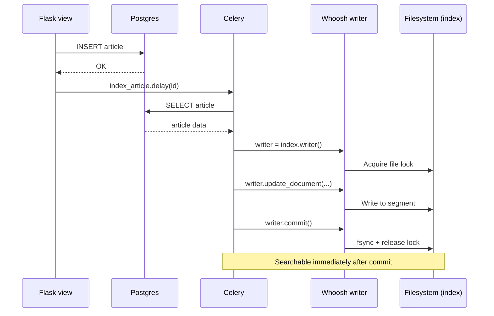
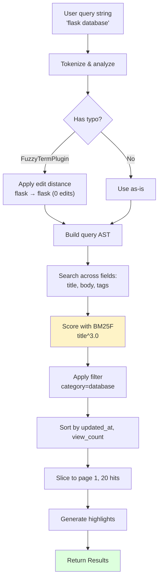

# Whoosh-Search

#flask #search #whoosh #fulltext #python #pure-python

> [!info] Pure-Python full-text search, no extra services required
> [Whoosh](https://whoosh.readthedocs.io/) is a fast, pure-Python search engine library — inspired by Lucene but with zero external dependencies. No JVM, no Docker, no separate server process: `pip install whoosh`, write a few lines of code, and you have a working inverted-index search engine. This note covers Whoosh integration with Flask, schema and field design, analyzers, indexing, searching, highlighting, and **when to choose Whoosh vs. [[Flask-Elasticsearch]]**.

For small-to-medium Flask apps (a few thousand to ~100k documents), Whoosh is often the right answer: it's a library, not infrastructure.

---

## 1. Overview & Metaphor

### What is Whoosh?

Whoosh is a **search engine library** (not a server). It reads and writes **index files** on disk (or in memory), exposes a Pythonic API for indexing and querying, and implements the same inverted-index data structure as Lucene — but in pure Python.

> [!tip] The metaphor
> If [[Flask-Elasticsearch]] is a **search department** with its own building, staff, and protocols, Whoosh is a **search engine in a box** — you pull it out, plug it in, and it works. No setup, no运维. Smaller capacity, but for most Flask apps that's perfectly fine.

### When Whoosh, when [[Flask-Elasticsearch]]?

| Need | Choose Whoosh | Choose Elasticsearch |
|---|---|---|
| < 100k documents | ✅ | ✅ (overkill) |
| 100k–1M documents | ⚠️ Possible, slow | ✅ |
| > 1M documents | ❌ | ✅ |
| No external services / infra | ✅ | ❌ |
| Distributed search across nodes | ❌ | ✅ |
| Real-time search-as-you-type (high QPS) | ⚠️ Single-process bottleneck | ✅ |
| Faceted search, complex aggregations | ⚠️ Limited | ✅ First-class |
| Pure Python deployment (Lambda, serverless) | ✅ | ❌ |
| Typo tolerance | ⚠️ Via `FuzzyTerm` | ✅ First-class |
| Multi-tenant indices | ⚠️ Manual | ✅ Aliases |

### What you need to know up front

- Whoosh is **single-writer, multi-reader**. Only one process can write to an index at a time; multiple processes can read.
- Index files live on disk — back them up like any data.
- Whoosh is **slower than Lucene** by ~5-10×, but for small indices this is invisible (sub-100ms queries).
- The library is **mature but lightly maintained** — last major release was 2017, but it still works fine on Python 3.12.

---

## 2. Installation

```bash
(venv) $ pip install whoosh
```

Versions referenced:

| Package | Version |
|---|---|
| Flask | 3.0.x |
| Whoosh | 2.7.x |

There's no `flask-whoosh` extension — Whoosh is used directly with the extensions pattern, like `redis-py`.

---

## 3. Configuration

### Minimal setup

```python
# app/extensions.py
import os
from whoosh.index import create_in, exists_in, open_dir
from whoosh.fields import Schema, TEXT, ID, KEYWORD, NUMERIC, DATETIME, STORED

INDEX_DIR = os.environ.get("WHOOSH_INDEX_DIR", "whoosh_index")
os.makedirs(INDEX_DIR, exist_ok=True)


def get_index():
    """Open or create the Whoosh index. Call inside an app context."""
    if exists_in(INDEX_DIR):
        return open_dir(INDEX_DIR)
    schema = build_schema()
    return create_in(INDEX_DIR, schema)


def build_schema():
    from whoosh.analysis import StemmingAnalyzer
    return Schema(
        doc_id=ID(stored=True, unique=True),
        title=TEXT(analyzer=StemmingAnalyzer(), stored=True),
        body=TEXT(analyzer=StemmingAnalyzer(), stored=True),
        tags=KEYWORD(stored=True, commas=True, lowercase=True, scorable=True),
        author=TEXT(stored=True),
        author_id=ID(stored=True),
        view_count=NUMERIC(stored=True, sortable=True),
        created_at=DATETIME(stored=True, sortable=True),
        is_published=STORED(),  # stored but not indexed — for retrieval only
    )
```

```python
# app/__init__.py
import os
from flask import Flask

def create_app():
    app = Flask(__name__)
    app.config["WHOOSH_INDEX_DIR"] = os.environ.get("WHOOSH_INDEX_DIR", "whoosh_index")
    return app
```

### Configuration options

| Option | Default | Description |
|---|---|---|
| `WHOOSH_INDEX_DIR` | `"whoosh_index"` | Filesystem path to the index directory. |
| `WHOOSH_RAM_CACHE` | `True` | Whether to use in-memory caching for reading. |
| `WHOOSH_LIMIT` | `10` | Default number of search hits per page. |

> [!warning] Don't put the index on a network filesystem
> Whoosh uses file locks and memory-mapped files. NFS, SMB, and other networked filesystems cause subtle corruption and locking bugs. Use local disk (EBS, EFS in provisioned mode, or an EBS volume) for the index directory.

---

## 4. Basic Usage

### Opening an index writer

```python
from app.extensions import get_index

index = get_index()
writer = index.writer()
```

### Indexing documents

```python
# Single doc
writer.add_document(
    doc_id="post-42",
    title="Flask Extensions Vault",
    body="A complete guide to Flask extensions...",
    tags="flask,python,web",
    author="Alice",
    author_id="user-1",
    view_count=0,
    created_at=datetime.utcnow(),
    is_published=True,
)

# Commit to persist
writer.commit()
```

### Updating and deleting

```python
writer = index.writer()

# Update (replaces existing doc with same unique ID)
writer.update_document(
    doc_id="post-42",
    title="Flask Extensions Vault (Updated)",
    body="...",
    # ... other fields ...
)

# Delete by query
from whoosh.query import Term
writer.delete_by_query(Term("tags", "deprecated"))

# Delete by doc ID (requires unique=True on the field)
writer.delete_document("post-42")

writer.commit()
```

> [!warning] Don't forget to `commit()`
> Changes are in-memory until you call `writer.commit()`. If your process crashes first, the changes are lost. Use `writer.commit()` after every batch, or `writer.cancel()` to roll back.

### Searching

```python
from whoosh.qparser import QueryParser

with index.searcher() as searcher:
    parser = QueryParser("body", index.schema)
    query = parser.parse("flask extensions")
    results = searcher.search(query, limit=20)

    print(f"Found {len(results)} of {searcher.doc_count()} docs")
    for hit in results:
        print(hit["doc_id"], hit.score, hit["title"])
        print(hit.highlights("body"))  # snippet with <b>...</b> around matches
```

### CRUD-style operations

```python
# Index
writer.add_document(doc_id="1", title="...", body="...")

# Get (by indexed ID)
with index.searcher() as searcher:
    doc = searcher.document(doc_id="1")
    # → dict of stored fields, or None

# Update
writer.update_document(doc_id="1", title="new", body="new")

# Delete
writer.delete_document("1")

# Search
with index.searcher() as searcher:
    results = searcher.search(parser.parse("flask"))
```

---

## 5. Schema & Field Types

| Field type | Description |
|---|---|
| `TEXT` | Full-text searchable; tokenized by an analyzer. Use `stored=True` to return in hits. |
| `ID` | Exact match (whole field, single token). Use `unique=True` for primary keys. |
| `KEYWORD` | Comma- or space-separated list of exact tokens; `commas=True`, `lowercase=True`, `scorable=True`. |
| `NUMERIC` | Integer/float; sortable, range-queryable. |
| `DATETIME` | `datetime` objects; range-queryable, sortable. |
| `BOOLEAN` | True/false. |
| `NGRAM` | N-gram tokenization (for substring / partial match). |
| `NGRAMWORDS` | N-grams on word boundaries (better than `NGRAM` for natural text). |
| `STORED` | Stored but not indexed — for retrieval only (e.g., `is_published`). |

### Important field flags

- `stored=True` — value is returned in `hit["field_name"]`. Required if you want to display it.
- `unique=True` — values are unique; enables `update_document` to replace.
- `sortable=True` — pre-computes a sort key; faster sorts but bigger index.
- `field_boost=2.0` — boosts matches in this field in scoring.

### Example: a complete schema

```python
from whoosh.fields import Schema, TEXT, ID, KEYWORD, NUMERIC, DATETIME, STORED
from whoosh.analysis import StemmingAnalyzer, StandardAnalyzer, NgramAnalyzer

schema = Schema(
    # Primary key — ID, unique, stored
    doc_id=ID(stored=True, unique=True),

    # Full-text fields — TEXT with stemming
    title=TEXT(analyzer=StemmingAnalyzer(), stored=True, field_boost=2.0),
    body=TEXT(analyzer=StemmingAnalyzer(), stored=True),

    # Tags — KEYWORD (multi-value, exact match)
    tags=KEYWORD(stored=True, commas=True, lowercase=True, scorable=True),

    # Author — TEXT (for "search by author name")
    author=TEXT(stored=True),
    author_id=ID(stored=True),

    # Numeric / date — for filtering and sorting
    view_count=NUMERIC(stored=True, sortable=True),
    created_at=DATETIME(stored=True, sortable=True),

    # Autocomplete — NGRAM
    title_ngram=NGRAM(minsize=2, maxsize=10),

    # Stored-only metadata
    is_published=STORED(),
)
```

---

## 6. Analyzers

An analyzer is a pipeline: **tokenizer → filter(s)**. Whoosh ships with several:

| Analyzer | Behavior |
|---|---|
| `StandardAnalyzer` | Default — lowercase, split on punctuation, drop stop words. |
| `StemmingAnalyzer` | Standard + Porter stemmer (`running` → `run`). **Recommended for English text.** |
| `SimpleAnalyzer` | Lowercase, split on non-alphanumerics. No stop words. |
| `StopAnalyzer` | Lowercase + stop words, no stemming. |
| `RegexAnalyzer` | Split on a regex. |
| `NgramAnalyzer` | N-grams (substrings) — for partial matching. |
| `FancyAnalyzer` | Standard + inter-word tokenizer (camelCase, underscores). |
| `LanguageAnalyzer("de")` | Stemming + stop words for a specific language. |

### Custom analyzer

```python
from whoosh.analysis import RegexTokenizer, LowercaseFilter, StopFilter, StemFilter

my_analyzer = (
    RegexTokenizer(r"\w+")
    | LowercaseFilter()
    | StopFilter()                    # remove "the", "is", etc.
    | StemFilter()                    # Porter stemming
)

schema = Schema(body=TEXT(analyzer=my_analyzer, stored=True))
```

### Multi-language indexing

```python
from whoosh.analysis import LanguageAnalyzer

schema = Schema(
    title_en=TEXT(analyzer=StemmingAnalyzer(), stored=True),
    title_de=TEXT(analyzer=LanguageAnalyzer("de"), stored=True),
    title_zh=TEXT(analyzer=LanguageAnalyzer("zh"), stored=True),  # may not work well
)
```

> [!tip] For CJK languages, consider a different engine
> Whoosh's CJK support is limited — tokenizing Chinese, Japanese, or Korean requires language-specific tokenizers (jieba, etc.) that don't integrate cleanly. For serious CJK search, use [[Flask-Elasticsearch]] with the [analysis-ik](https://github.com/medcl/elasticsearch-analysis-ik) or [analysis-smartcn](https://www.elastic.co/guide/en/elasticsearch/plugins/current/analysis-smartcn.html) plugin.

---

## 7. Indexing & Searching

### Bulk indexing

```python
def reindex_all_posts():
    index = get_index()
    writer = index.writer()

    # Clear existing docs (careful!)
    writer.commit()  # close any pending
    index = get_index()
    writer = index.writer()
    writer.delete_by_query(query.Everything())

    # Stream from DB
    from app.models.post import Post
    for post in Post.query.yield_per(500):  # SQLAlchemy streaming
        writer.add_document(
            doc_id=str(post.id),
            title=post.title,
            body=post.body,
            tags=",".join(t.name for t in post.tags),
            author=post.author.username,
            author_id=str(post.author_id),
            view_count=post.view_count,
            created_at=post.created_at,
            is_published=post.is_published,
        )
        # Periodically flush to avoid huge memory use
        if writer.is_dirty and post.id % 1000 == 0:
            pass  # Whoosh handles this internally

    writer.commit()
```

> [!tip] Use `writer.start_group()` / `writer.end_group()` for very large batches
> For >100k documents, Whoosh can use excessive memory. Break the work into chunks, committing between each:

```python
BATCH_SIZE = 5000
for i, post in enumerate(posts):
    writer.add_document(...)
    if i % BATCH_SIZE == 0 and i > 0:
        writer.commit()
        writer = index.writer()
writer.commit()
```

### Query parsing

```python
from whoosh.qparser import QueryParser, MultifieldParser, FuzzyTermPlugin

# Single field
parser = QueryParser("body", index.schema)
query = parser.parse("flask extensions")

# Multiple fields (search across title and body)
parser = MultifieldParser(["title", "body"], index.schema)
query = parser.parse("flask")

# Enable fuzzy (typo tolerance)
parser = QueryParser("body", index.schema)
parser.add_plugin(FuzzyTermPlugin())
query = parser.parse("flask~2")    # ~2 = up to 2 edit distance

# Boolean operators (built-in)
query = parser.parse("flask AND python NOT django")
query = parser.parse("(flask OR django) AND python")
query = parser.parse('title:"flask extensions"')  # phrase
```

### Searching with filters and sorts

```python
from whoosh import sorting
from whoosh.query import Term, And, Or, Range

with index.searcher() as searcher:
    # Free text query
    query = parser.parse("flask extensions")

    # Filter: only published posts, created in 2024
    filter_query = And([
        Term("is_published", True),  # NOTE: only works if is_published is indexed
        # If using STORED-only, filter post-search instead
        Range("created_at", datetime(2024, 1, 1), datetime(2024, 12, 31)),
    ])

    # Sort by date, then by view_count
    sort_key = sorting.MultiFacet([
        sorting.FieldFacet("created_at", reverse=True),
        sorting.FieldFacet("view_count", reverse=True),
    ])

    results = searcher.search(query, filter=filter_query, sortedby=sort_key, limit=20)
```


### Pagination

```python
PAGE = 2
PER_PAGE = 20

with index.searcher() as searcher:
    results = searcher.search_page(query, pagenum=PAGE, pagelen=PER_PAGE)
    print(results.total)         # total matching docs
    print(results.pagenum)       # current page
    print(results.pagecount)     # total pages
    for hit in results:
        print(hit["title"])
```

### Highlighting

```python
with index.searcher() as searcher:
    results = searcher.search(parser.parse("flask"))
    for hit in results:
        # Snippet with <b>...</b> around matches
        snippet = hit.highlights("body", top=3, maxwords=40)
        print(hit["title"])
        print(snippet)

        # Custom tags
        snippet = hit.highlights("body", tag="<mark>", end="</mark>")
```

You can also extract **more-like-this** suggestions:

```python
from whoosh import classification
with index.searcher() as searcher:
    doc = searcher.document(doc_id="post-42")
    expander = classification.Expander(searcher, "body", doc["body"])
    related_terms = expander.expanded_terms(5)
```

---

## 8. Advanced Topics

### Faceted search

```python
from whoosh import sorting

with index.searcher() as searcher:
    # Group by tag
    facet = sorting.FieldFacet("tags", allow_overlap=True)
    results = searcher.search(query, groupedby={"tags": facet})
    for tag, count in results.groups("tags").items():
        print(f"{tag}: {count} docs")
```

### Spelling correction

Whoosh ships with a spelling dictionary built from your indexed text:

```python
from whoosh.spelling import ListCorrector, GraphCorrector

with index.searcher() as searcher:
    corrector = searcher.corrector("body")
    suggestions = corrector.suggest("falsk", limit=3)
    print(suggestions)  # ["flask"]

    # In a query, suggest corrections
    corrected = searcher.search(query, correct=True)
    if corrected.results:
        for hit in corrected:
            print(hit["title"])
        print(f"Did you mean: {corrected.query_string}?")
```

### Async-ish indexing from Flask

Whoosh's writer is **synchronous and blocking** — index in the request thread for small docs, or push to [[Celery]] for large batches:

```python
from app.tasks import index_post_task

@event.listens_for(Post, "after_update")
def reindex(mapper, connection, target):
    index_post_task.delay(target.id)   # runs in Celery worker


@celery.task
def index_post_task(post_id):
    post = db.session.get(Post, post_id)
    index = get_index()
    writer = index.writer()
    writer.update_document(
        doc_id=str(post.id),
        title=post.title,
        body=post.body,
        # ...
    )
    writer.commit()
```

> [!warning] Only one writer at a time
> Whoosh uses file locks — if two Celery workers try to open a writer simultaneously, one will block (or raise `whoosh.store.LockError`). Solutions:
> - Run indexing tasks on a **single dedicated worker**.
> - Use `index.writer(timeout=60)` to wait up to 60 seconds.
> - Use `whoosh.filedb.filestore.FileStorage` with a `RamStorage` for tests.

---

## 9. Testing

Use a fresh in-memory index per test:

```python
# tests/conftest.py
import pytest
from whoosh.filedb.filestore import RamStorage
from whoosh.index import create_in, open_dir
from whoosh.fields import Schema

@pytest.fixture
def index():
    storage = RamStorage()
    schema = build_test_schema()
    ix = create_in(storage.dirname, schema) if False else create_in(".", schema, indexname="test")
    # Simpler: use a temp dir
    import tempfile, shutil
    tmpdir = tempfile.mkdtemp()
    from whoosh.index import create_in
    ix = create_in(tmpdir, build_test_schema())
    yield ix
    shutil.rmtree(tmpdir)
```

```python
# tests/test_search.py
def test_index_and_search(index):
    writer = index.writer()
    writer.add_document(
        doc_id="1",
        title="Flask intro",
        body="Flask is a Python web framework.",
        tags="flask,python",
    )
    writer.commit()

    from whoosh.qparser import QueryParser
    with index.searcher() as searcher:
        parser = QueryParser("body", index.schema)
        results = searcher.search(parser.parse("flask"))
        assert len(results) == 1
        assert results[0]["title"] == "Flask intro"
```

> [!tip] Use `RamStorage` for fastest tests
> `whoosh.filedb.filestore.RamStorage` keeps the index entirely in memory — no disk I/O, no cleanup. Limitations: doesn't persist across `Index` instances. For tests, recreate the index per test.

---

## 10. Performance Tips

1. **Use `StemmingAnalyzer` for English text** — dramatically improves recall.
2. **Mark fields `stored=True` only if you need them in results** — stored fields bloat the index.
3. **Mark fields `sortable=True`** only if you sort on them — pre-computes a sort key.
4. **Use `MultiFacet` for multi-key sorts** — single pass, not multiple.
5. **Avoid `NGRAM` on long text** — explodes the index size. Use `NGRAMWORDS` instead.
6. **Commit in batches, not per-document** — `add_document()` is fast, but `commit()` flushes to disk.
7. **Use `searcher.search_page()` for pagination** — Whoosh optimizes the slicing.
8. **Close searchers when done** — use `with index.searcher() as s:` to ensure release.
9. **Run indexing on a single dedicated worker** if using Celery.
10. **Reindex periodically** to compact the index (Whoosh doesn't auto-compact).

```python
# Compact the index
from whoosh.index import open_dir, create_in
import shutil

source = open_dir("whoosh_index")
shutil.rmtree("whoosh_index_new", ignore_errors=True)
new_index = create_in("whoosh_index_new", source.schema)

writer = new_index.writer()
with source.searcher() as searcher:
    for hit in searcher.search(query.Everything(), limit=None):
        writer.add_document(**hit.fields())
writer.commit()

# Swap directories
shutil.move("whoosh_index", "whoosh_index_old")
shutil.move("whoosh_index_new", "whoosh_index")
shutil.rmtree("whoosh_index_old")
```

---

## 11. Integration with Other Extensions

### [[Flask-SQLAlchemy]]

The most common pattern: SQL as the source of truth, Whoosh as the search index. Sync via SQLAlchemy events:

```python
from sqlalchemy import event

@event.listens_for(Post, "after_insert")
@event.listens_for(Post, "after_update")
def sync_to_whoosh(mapper, connection, target):
    from app.tasks import index_post_task
    index_post_task.delay(target.id)

@event.listens_for(Post, "after_delete")
def remove_from_whoosh(mapper, connection, target):
    from app.tasks import delete_post_from_index
    delete_post_from_index.delay(target.id)
```

### [[Marshmallow]]

Serialize models for indexing:

```python
from marshmallow_sqlalchemy import SQLAlchemyAutoSchema

class PostSchema(SQLAlchemyAutoSchema):
    class Meta:
        model = Post

schema = PostSchema()
doc = schema.dump(post)  # dict, ready for writer.add_document(**doc)
```

### [[Celery]]

Background indexing — see §8.

### [[Flask-Caching]]

Cache search results for common queries:

```python
from app.extensions import cache

@cache.cached(timeout=60, key_prefix="search")
def search(query):
    with index.searcher() as searcher:
        results = searcher.search(parser.parse(query))
        return [hit.fields() for hit in results]
```

---

## 12. Real-World Example: A Knowledge Base Search

```python
# app/search/kb.py
from datetime import datetime
from whoosh.fields import Schema, TEXT, ID, KEYWORD, NUMERIC, DATETIME, STORED
from whoosh.analysis import StemmingAnalyzer
from whoosh.qparser import MultifieldParser, FuzzyTermPlugin
from whoosh import sorting
from whoosh.query import Term, And, Range
from whoosh.index import create_in, exists_in, open_dir
import os

INDEX_DIR = os.environ.get("KB_INDEX_DIR", "kb_index")
os.makedirs(INDEX_DIR, exist_ok=True)

SCHEMA = Schema(
    doc_id=ID(stored=True, unique=True),
    title=TEXT(analyzer=StemmingAnalyzer(), stored=True, field_boost=3.0),
    body=TEXT(analyzer=StemmingAnalyzer(), stored=True),
    category=KEYWORD(stored=True, lowercase=True, scorable=True),
    tags=KEYWORD(stored=True, commas=True, lowercase=True),
    author=TEXT(stored=True),
    view_count=NUMERIC(stored=True, sortable=True),
    updated_at=DATETIME(stored=True, sortable=True),
    url=STORED(),
)


def get_index():
    if exists_in(INDEX_DIR):
        return open_dir(INDEX_DIR)
    return create_in(INDEX_DIR, SCHEMA)


def index_article(article):
    index = get_index()
    writer = index.writer()
    writer.update_document(
        doc_id=str(article.id),
        title=article.title,
        body=article.body,
        category=article.category,
        tags=",".join(t.name for t in article.tags),
        author=article.author.username,
        view_count=article.view_count,
        updated_at=article.updated_at,
        url=article.url,
    )
    writer.commit()


def search_kb(query_str, category=None, min_views=None, page=1, per_page=20):
    index = get_index()
    parser = MultifieldParser(["title", "body", "tags"], index.schema)
    parser.add_plugin(FuzzyTermPlugin())
    query = parser.parse(query_str)

    filters = []
    if category:
        filters.append(Term("category", category.lower()))

    filter_query = And(filters) if filters else None

    sort_key = sorting.MultiFacet([
        sorting.FieldFacet("updated_at", reverse=True),
        sorting.FieldFacet("view_count", reverse=True),
    ])

    with index.searcher() as searcher:
        results = searcher.search_page(
            query,
            pagenum=page,
            pagelen=per_page,
            filter=filter_query,
            sortedby=sort_key,
        )

        return {
            "total": results.total,
            "page": results.pagenum,
            "pages": results.pagecount,
            "items": [
                {
                    "doc_id": hit["doc_id"],
                    "title": hit["title"],
                    "category": hit["category"],
                    "url": hit["url"],
                    "score": hit.score,
                    "highlight": hit.highlights("body"),
                }
                for hit in results
            ],
        }
```

### Indexing flow



### Search pipeline



---

## 13. Common Pitfalls & Troubleshooting

> [!danger] Top 10 Whoosh mistakes
> 1. **Forgetting `writer.commit()`** — changes never persist.
> 2. **Opening two writers simultaneously** — `LockError`. Single writer at a time.
> 3. **Index on a network filesystem** — locks fail, corruption.
> 4. **`NGRAM` on long text** — index explodes. Use `NGRAMWORDS` instead.
> 5. **No stemming** — `running` and `run` don't match.
> 6. **Searching a field that's `STORED`-only** — `STORED` fields aren't indexed; you can't search them.
> 7. **Forgetting to close searchers** — file handles leak; use `with`.
> 8. **Indexing in the request thread** — blocks the user; use Celery.
> 9. **Not handling reindexing** — schema changes require a full rebuild.
> 10. **Expecting Elasticsearch-scale performance** — Whoosh is great, but it's a Python library.

### `LockError: Could not lock`

Another process has the writer open. Either:
- Wait: `writer = index.writer(timeout=60)`.
- Run indexing on a single dedicated worker.
- Use `RamStorage` for tests.

### `IndexError: field is not indexed`

You tried to query a field that's only `STORED`. Mark it as `TEXT`, `KEYWORD`, etc. to make it searchable.

### Search returns no results for a word that's clearly in the body

- Check the analyzer: `StemmingAnalyzer` reduces "running" to "run"; you must search for the stem.
- Check stop words: "the", "is", "a" are filtered out and won't match.
- Commit the writer before searching.

---

## 14. Comparison: Whoosh vs. Elasticsearch vs. Postgres tsvector

| Aspect | Whoosh | [[Flask-Elasticsearch]] | Postgres `tsvector` |
|---|---|---|---|
| Setup | `pip install whoosh` | JVM + cluster | Already in Postgres |
| Scale | < 100k docs | Billions | < 1M docs |
| External service | None | Yes | None (uses DB) |
| Multi-process writes | Single writer | Yes | Yes |
| Typo tolerance | Via plugin | First-class | Limited (trigrams) |
| Stemming | Yes | Yes | Yes (per-language) |
| Aggregations | Limited | First-class | `GROUP BY` |
| Highlighting | First-class | First-class | `ts_headline()` |
| Best for | Small Flask apps | Big scale | Already on Postgres |

> [!tip] The decision tree
> - Already on Postgres, simple search? → `tsvector` + GIN index.
> - Need a separate search engine, no infra, small scale? → **Whoosh**.
> - Need scale, facets, typos, real-time, multi-tenant? → **[[Flask-Elasticsearch]]** (or Meilisearch/Typesense).
> - Need search-as-a-service without ops? → Meilisearch / Typesense Cloud.

---

## 15. Best Practices

> [!tip] Whoosh best practices
> 1. **Use `StemmingAnalyzer` for English text** — better recall.
> 2. **Mark `stored=True` only on fields you'll display** — saves space.
> 3. **Mark `sortable=True` only on fields you sort by** — saves time.
> 4. **Use `update_document` with a unique ID** — keeps the index in sync with your DB.
> 5. **Background indexing via Celery** — single writer, no contention.
> 6. **Use `searcher.search_page()`** for pagination — optimized slicing.
> 7. **Reindex periodically** to compact — Whoosh doesn't auto-compact.
> 8. **Back up the index directory** — it's a file; just copy it.
> 9. **Use `RamStorage` in tests** — fast and isolated.
> 10. **Don't use Whoosh for >1M docs** — switch to Elasticsearch.

---

## 16. References & Further Reading

- [Whoosh docs](https://whoosh.readthedocs.io/) — the canonical reference.
- [Whoosh source](https://github.com/whoosh-community/whoosh) — actively-maintained fork.
- [Whoosh quick start](https://whoosh.readthedocs.io/en/latest/quickstart.html) — official intro.
- [Whoosh recipes](https://whoosh.readthedocs.io/en/latest/recipes.html) — common patterns.
- [Haystack](https://django-haystack.readthedocs.io/) — Django abstraction over Whoosh/ES/Solr (good ideas, even if you're on Flask).
- [Postgres tsvector](https://www.postgresql.org/docs/current/textsearch.html) — the alternative if you're already on Postgres.

---

## 17. Cheat Sheet

```python
# Open index
from whoosh.index import create_in, exists_in, open_dir
index = open_dir("whoosh_index") if exists_in("whoosh_index") else create_in("whoosh_index", schema)

# Index
writer = index.writer()
writer.add_document(doc_id="1", title="...", body="...")
writer.update_document(doc_id="1", title="new", body="new")
writer.delete_document("1")
writer.delete_by_query(Term("tags", "deprecated"))
writer.commit()  # or writer.cancel()

# Search
from whoosh.qparser import QueryParser, MultifieldParser, FuzzyTermPlugin
parser = MultifieldParser(["title", "body"], index.schema)
parser.add_plugin(FuzzyTermPlugin())
query = parser.parse("flask~2 AND python")

with index.searcher() as searcher:
    results = searcher.search(query, limit=20)
    # Or paginated
    page = searcher.search_page(query, pagenum=1, pagelen=20)
    for hit in page:
        print(hit["title"], hit.score)
        print(hit.highlights("body"))

# Filter & sort
from whoosh import sorting
from whoosh.query import Term, And, Range
results = searcher.search(
    query,
    filter=And([Term("category", "tech"), Range("view_count", 100, None)]),
    sortedby=sorting.FieldFacet("created_at", reverse=True),
)

# Spelling
corrector = searcher.corrector("body")
suggestions = corrector.suggest("falsk", limit=3)

# Highlights
snippet = hit.highlights("body", top=3, maxwords=40, tag="<mark>", end="</mark>")

# Compact the index
with source.searcher() as s:
    writer = new_index.writer()
    for hit in s.search(query.Everything(), limit=None):
        writer.add_document(**hit.fields())
    writer.commit()
```

---

*See also: [[Flask-Elasticsearch]] · [[Flask-SQLAlchemy]] · [[Flask-MongoEngine]] · [[Marshmallow]] · [[Celery]] · [[Project-Structure]] · [[00-Map-of-Content]]*
