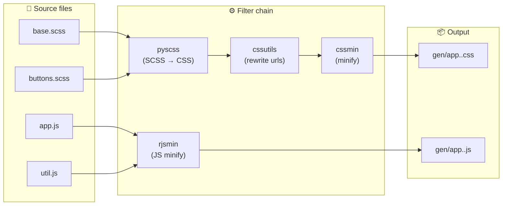
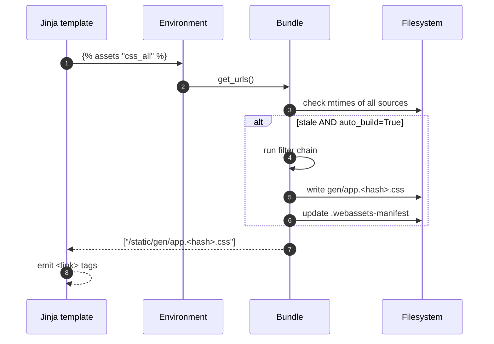
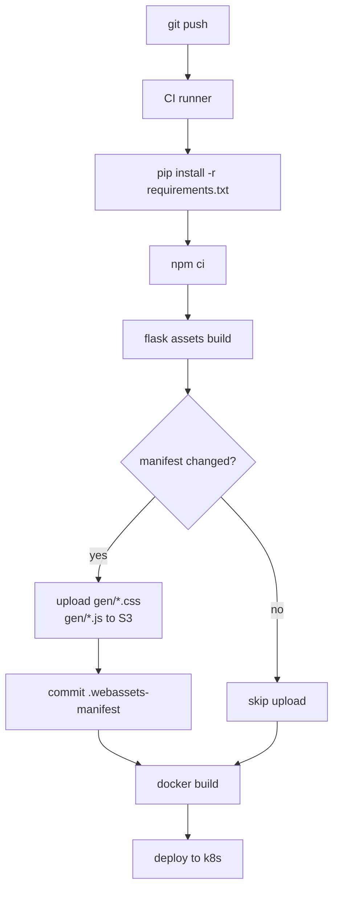

# Flask-Assets

#flask #frontend #assets #bundling #webassets #css #javascript #build-pipeline

> [!info] Asset bundling & minification for Flask via `webassets`
> **Flask-Assets** glues the `webassets` library to Flask so you can declare **bundles** of CSS and JS files, pipe them through **filters** (SCSS, Less, JSMin, Babel, CoffeeScript, etc.), and emit a single versioned URL per bundle. It is the spiritual ancestor of Webpack/Rollup/Vite for the Flask world — older, server-driven, but trivial to wire into a Jinja template.

Think of Flask-Assets as a **factory's paint-and-pack line**. Raw materials (your `.scss` files, your `.js` modules, your `.coffee` sources) come in on one conveyor belt. Each station along the line does one thing — compile, minify, concatenate, hash. At the end you get one shrink-wrapped box (`gen/packed.<hash>.css`) with a barcode (the URL fingerprint) that the template can hand to the browser. The factory runs once at deploy time in production, and continuously in debug mode so you can edit-and-refresh.

---

## 1. Overview & Metaphor

### The problem Flask-Assets solves

Browsers should download **few, small, cache-friendly files**, but humans like to write **many, large, readable files**. Without a build step you have to choose:

| Strategy | DX | Production perf |
|---|---|---|
| One big `<script>` and `<style>` block per page | ✅ simple | ❌ duplicate bytes, no minification |
| One file per component (50 `<link>` tags) | ✅ readable | ❌ 50 round trips, no minification |
| Hand-build a bundle with a Makefile | ⚠️ brittle | ✅ good |
| Flask-Assets | ✅ Jinja tag + filters | ✅ good |

Flask-Assets gives you both: write 50 files, ship 1, with a one-line Jinja tag.

### The three core concepts

| Concept | What it is | Example |
|---|---|---|
| **Bundle** | An ordered group of source files + a list of filters + an output path | `Bundle('scss/app.scss', filters='pyscss', output='gen/app.css')` |
| **Filter** | A transformation applied to the bundle's contents | `pyscss`, `less`, `jsmin`, `rjsmin`, `babel`, `coffeescript`, `cssutils` |
| **Environment** | The registry that holds bundles, the URL prefix, the output directory, and the debug/auto-build flags | `assets = Environment(app)` |

### The build pipeline at a glance



### What Flask-Assets does NOT do

| Concern | Who handles it |
|---|---|
| ES module graph & tree-shaking | Webpack / Vite / Rollup (see [[Flask-Vite]]) |
| React/Vue/Svelte transforms | Babel directly, or again — Vite |
| HTTP/2 push / `<link rel=preload>` | Your template or a CDN |
| Image optimisation | `pillow`, `optipng`, or a CDN |
| Source maps | Partial (some filters emit them); Vite is better |

> [!tip] The metaphor
> Flask-Assets is a **vending machine**. You stock it once with bundles (the shelves), and then in your templates you press button `` and out pops a fully built, versioned URL. The machine decides — based on `ASSETS_DEBUG` and `ASSETS_AUTO_BUILD` — whether to give you the prepackaged bar (production) or a sample tray of every ingredient (debug).

---

## 2. Installation

```bash
(venv) $ pip install Flask-Assets
```

| Package | Version (this note) | Notes |
|---|---|---|
| Flask | 3.0.x | Works with Flask 2.x and 3.x |
| Flask-Assets | 2.1.x | Thin wrapper around `webassets` |
| webassets | 2.0.x (vendored) | Pulled in transitively |

Most filters require extra binaries or Python libs:

```bash
# CSS pre-processors
(venv) $ pip install pyscss          # pure-Python SCSS
# OR
(venv) $ pip install lesscpy         # pure-Python Less
# OR (better fidelity)
$ npm install -g sass less           # node-based compilers

# JS minifiers (pure-Python)
(venv) $ pip install jsmin rjsmin

# Modern JS via Babel
$ npm install -D @babel/core @babel/preset-env @babel/cli

# CoffeeScript
$ npm install -g coffeescript
```

> [!warning] `webassets` is essentially in maintenance mode
> The upstream library still works but receives only bug fixes. For new projects with heavy JS, prefer [[Flask-Vite]] or a separate webpack/vite build that emits static files into `static/dist/`. Flask-Assets remains excellent for **CSS-only** or **legacy** codebases.

---

## 3. Configuration

### 3.1 The `Environment` object

```python
# extensions.py
from flask_assets import Environment, Bundle

assets = Environment()

def init_assets(app):
    assets.init_app(app)

    css = Bundle(
        "scss/base.scss",
        "scss/buttons.scss",
        "scss/forms.scss",
        filters="pyscss,cssmin",
        output="gen/css/all.%(version)s.css",
        depends="scss/**/*.scss",
    )
    js = Bundle(
        "js/app.js",
        "js/util.js",
        filters="rjsmin",
        output="gen/js/all.%(version)s.js",
        depends="js/**/*.js",
    )
    assets.register("css_all", css)
    assets.register("js_all", js)
```

### 3.2 App config keys

| Key | Default | Description |
|---|---|---|
| `ASSETS_DEBUG` | `False` | If True, **disable** bundling — emit each source file as its own `<link>`/`<script>` for easier debugging. |
| `ASSETS_AUTO_BUILD` | `True` | Rebuild bundles on every request when sources are newer than output. Disable in production for performance. |
| `ASSETS_MANIFEST` | `True` (file: `.webassets-manifest`) | Controls cache-busting manifest. `False` disables; `"cache"` stores in memory; a path string points to a JSON file. |
| `ASSETS_CACHE` | `True` | Use a cache directory for intermediate filter output. |
| `ASSETS_URL_EXPIRE` | `True` | Append `?<hash>` (or use `%(version)s` in the output path) for cache busting. |
| `ASSETS_LOAD_PATH` | `app.static_folder` | Search path(s) for source files. Can be a list to pull from node_modules, etc. |
| `ASSETS_DIRECTORY` | `app.static_folder` | Where the output bundle files are written. |
| `ASSETS_URL` | `app.static_url_path` (`/static`) | URL prefix used when generating `<link>`/`<script>` `src`. |

### 3.3 Debug vs production

```python
# config.py
class Config:
    ASSETS_DEBUG = False             # ship bundled files
    ASSETS_AUTO_BUILD = False        # do NOT check mtimes on every request
    ASSETS_MANIFEST = "webassets-manifest.json"  # persist hashes across deploys

class DevelopmentConfig(Config):
    ASSETS_DEBUG = True              # emit each source separately
    ASSETS_AUTO_BUILD = True         # rebuild on save
```

> [!danger] Manifest across deploys
> If you set `ASSETS_MANIFEST = True` (the default), webassets writes `.webassets-manifest` in your static folder. **Commit it** or generate it during CI build — otherwise the second deploy will produce a different hash and your CDN's old-cached HTML will reference deleted files.

---

## 4. Basic Usage

### 4.1 Minimal end-to-end example

```python
# app.py
from flask import Flask, render_template
from extensions import assets, init_assets

app = Flask(__name__)
app.config["ASSETS_DEBUG"] = False
init_assets(app)

@app.route("/")
def home():
    return render_template("index.html")
```

```html
<!-- templates/index.html -->
<!doctype html>
<html>
<head>
  
    <link rel="stylesheet" href="{{ ASSET_URL }}">
  
</head>
<body>
  <h1>Hi</h1>
  
    <script src="{{ ASSET_URL }}" defer></script>
  
</body>
</html>
```

What Flask-Assets emits in production:

```html
<link rel="stylesheet" href="/static/gen/css/all.7f3a9c2b.css">
<script src="/static/gen/js/all.1e4d8a3f.js" defer></script>
```

What it emits with `ASSETS_DEBUG=True`:

```html
<link rel="stylesheet" href="/static/scss/base.scss?=f2a1">
<link rel="stylesheet" href="/static/scss/buttons.scss?b3c4">
<link rel="stylesheet" href="/static/scss/forms.scss?9d7e">
<script src="/static/js/app.js?a1b2" defer></script>
<script src="/static/js/util.js?c3d4" defer></script>
```

### 4.2 Using filters

A filter is just a name — or a comma-separated chain:

```python
css = Bundle(
    "scss/app.scss",
    filters="pyscss,cssmin",     # SCSS → CSS → minified
    output="gen/app.css",
)

modern_js = Bundle(
    "jsx/app.jsx",
    filters="babel,jsmin",       # JSX → JS → minified
    output="gen/app.js",
    extra={"babel_presets": ["@babel/preset-env", "@babel/preset-react"]},
)
```

| Filter name | What it does | Requires |
|---|---|---|
| `pyscss` | Compile `.scss` → CSS | `pip install pyscss` |
| `scss` | Use the `sass` CLI binary | `npm i -g sass` |
| `less` / `lesscpy` | Compile `.less` → CSS | `npm i -g less` or `pip install lesscpy` |
| `cssmin` / `cssutils` / `cleancss` | Minify CSS | `pip install cssmin` |
| `jsmin` / `rjsmin` / `slimit` | Minify JS | `pip install jsmin` or `pip install rjsmin` |
| `babel` | Transpile modern JS/JSX | `npm i -D @babel/core @babel/preset-env` |
| `coffeescript` | Compile `.coffee` → JS | `npm i -g coffeescript` |
| `uglifyjs` | Minify JS via UglifyJS | `npm i -g uglify-js` |
| `datauri` | Inline small images as base64 | nothing (pure Python) |
| `cssrewrite` | Rewrite `url(...)` after moving files | nothing |

### 4.3 Custom filter

```python
from webassets.filter import Filter

class StripConsole(Filter):
    name = "strip_console"
    def output(self, _in, out, **kw):
        import re
        src = _in.read()
        # Strip console.log() calls in production builds
        cleaned = re.sub(r"console\.\w+\([^)]*\);?", "", src)
        out.write(cleaned)

# register once
from webassets.filter import register_filter
register_filter(StripConsole)

# use it
js = Bundle("js/app.js", filters="strip_console,rjsmin", output="gen/app.js")
```

---

## 5. Intermediate Patterns

### 5.1 Per-page bundles

Define one global bundle and one per-route:

```python
# bundles.py
from flask_assets import Bundle

def register_bundles(assets):
    # Global
    assets.register("css_base",
        Bundle("scss/base.scss", filters="pyscss,cssmin",
               output="gen/base.css", depends="scss/base/**/*.scss"))

    # Per-section
    assets.register("css_dashboard",
        Bundle("scss/dashboard/**/*.scss", filters="pyscss,cssmin",
               output="gen/dashboard.css"))
    assets.register("js_dashboard",
        Bundle("js/dashboard/**/*.js", filters="rjsmin",
               output="gen/dashboard.js"))
```

```html
<!-- templates/dashboard/index.html -->

{{ super() }}<link rel=stylesheet href="{{ASSET_URL}}">
{{ super() }}<script src="{{ASSET_URL}}" defer></script>
```

### 5.2 Build-time CLI: `flask assets`

```bash
# Build all bundles once (for CI / Docker)
(venv) $ flask assets build

# Clean generated files
(venv) $ flask assets clean

# Watch & rebuild
(venv) $ flask assets watch
```

Wire it into a Dockerfile:

```dockerfile
# Dockerfile
FROM python:3.12-slim AS build
WORKDIR /app
COPY requirements.txt .
RUN pip install -r requirements.txt
COPY . .
# Pre-build bundles; do NOT rely on first-request auto-build in prod
RUN flask assets build
FROM python:3.12-slim
COPY --from=build /app /app
WORKDIR /app
CMD ["gunicorn", "app:app"]
```

### 5.3 CDN upload after build

```python
# extensions.py
import boto3
from flask_assets import Environment

class S3Resolver:
    def __init__(self, bucket, prefix=""):
        self.s3 = boto3.client("s3")
        self.bucket = bucket
        self.prefix = prefix

    def save(self, target_path, content):
        key = f"{self.prefix}/{target_path}"
        self.s3.put_object(Bucket=self.bucket, Key=key, Body=content,
                           ContentType="application/javascript")
        return f"https://{self.bucket}.s3.amazonaws.com/{key}"

# After build, walk the manifest and upload
def push_to_cdn(app):
    with open(app.config["ASSETS_MANIFEST"]) as f:
        manifest = json.load(f)
    for logical_name, url in manifest.items():
        local = os.path.join(app.static_folder, url.lstrip("/static/"))
        with open(local, "rb") as fh:
            S3Resolver("my-cdn").save(url, fh.read())
```

---

## 6. Advanced Usage

### 6.1 Multiple load paths (node_modules)

```python
app.config["ASSETS_LOAD_PATH"] = [
    app.static_folder,                       # /app/static
    os.path.abspath("node_modules"),         # /app/node_modules
]

vendor_js = Bundle(
    "jquery/dist/jquery.js",                 # found in node_modules
    "bootstrap/dist/js/bootstrap.bundle.js",
    filters="rjsmin",
    output="gen/vendor.js",
)
```

### 6.2 Conditional bundles by environment

```python
def init_assets(app):
    common = ["js/app.js", "js/util.js"]
    if app.config["DEBUG"]:
        js_files = common + ["js/debug-toolbar.js"]
        filters = ""                         # no minify in dev
    else:
        js_files = common
        filters = "strip_console,rjsmin"
    assets.register("js_all",
        Bundle(*js_files, filters=filters, output="gen/app.js"))
```

### 6.3 The build lifecycle



### 6.4 Programmatic URL generation (for JSON APIs)

If you serve an HTML shell from one service and assets from another:

```python
from flask import jsonify
from flask_assets import Environment

@app.get("/api/manifest")
def manifest():
    env = Environment(app)
    return jsonify({
        "css": [str(u) for u in env["css_all"].urls()],
        "js":  [str(u) for u in env["js_all"].urls()],
    })
```

---

## 7. Common Pitfalls & Troubleshooting

| Symptom | Likely cause | Fix |
|---|---|---|
| `BundleError: pyscss: 'pyScss' has no attribute 'compile'` | Version mismatch with `pyscss` 2.x | Use `filters="libsass"` and `pip install libsass` instead — more reliable. |
| Changes to `.scss` don't appear | `ASSETS_AUTO_BUILD=False` and you didn't run `flask assets build` | Either set `ASSETS_AUTO_BUILD=True` in dev or run `flask assets build`. |
| 404s after deploy | Manifest not committed or stale CDN cache | Commit `.webassets-manifest` and invalidate CDN path for `/static/gen/*`. |
| `depends=` glob not triggering rebuild | Glob doesn't match new file's path | Use `**/*.scss` (recursive) — `*.scss` is non-recursive. |
| Slow page loads in dev | `ASSETS_DEBUG=True` ships 50 files | Acceptable in dev; alternatively keep debug but combine the top-10 largest files. |
| `TemplateSyntaxError: tag 'assets' not found` | `flask_assets` not initialised before `render_template` | Call `assets.init_app(app)` in your factory *before* the first request. |
| Output dir not writable in Docker | `gen/` missing or owned by root | `RUN mkdir -p /app/static/gen && chown app:app /app/static/gen` |

> [!bug] `ASSETS_AUTO_BUILD` + Gunicorn workers = race condition
> Multiple workers may rebuild the same bundle simultaneously, producing corrupt output. Either:
> - Set `ASSETS_AUTO_BUILD=False` and run `flask assets build` in CI, or
> - Use `--preload` so workers share the parent's already-built files.

---

## 8. Best Practices

1. **Build once at deploy time.** Set `ASSETS_AUTO_BUILD=False` in production; run `flask assets build` during release.
2. **Commit the manifest.** Or store it as a CI artifact so each deploy emits identical URLs.
3. **Split vendor vs app code.** Vendor code (jQuery, Bootstrap) rarely changes — give it its own long-cache bundle so users don't re-download it when you ship app code.
4. **Use `depends=` for transitive rebuilds.** SCSS partials included via `@import` won't trigger a rebuild unless `depends="scss/**/*.scss"` is set.
5. **Don't minify in dev.** Stack traces in minified code are useless; turn on `cssmin`/`rjsmin` only in `ProductionConfig`.
6. **Cache-bust with the path, not the query string.** `output="gen/app.%(version)s.css"` is friendlier to CDNs than `app.css?v=abc` (some CDNs ignore query strings).
7. **Consider moving to [[Flask-Vite]]** for new code that uses React/Vue/Svelte or modern ESM.

### Bundle design heuristics

| Bundle type | Suggested filters | Cache TTL |
|---|---|---|
| Vendor (jQuery, Bootstrap) | `rjsmin` only | 1 year (immutable) |
| App CSS | `pyscss,cssmin` | 1 year (immutable, versioned) |
| App JS | `babel,rjsmin` | 1 year (immutable, versioned) |
| Per-page CSS (rarely changes) | `pyscss,cssmin` | 1 year |
| Inline critical CSS | none | inline in `<style>` |

---

## 9. Integration with Other Extensions

### 9.1 [[Flask-Compress]]

Flask-Assets produces the bytes; Flask-Compress gzips them on the wire. They compose trivially:

```python
from flask_assets import Environment
from flask_compress import Compress

assets = Environment(app)
Compress(app)
```

Just make sure `COMPRESS_MIMETYPE` includes `text/css` and `application/javascript`.

### 9.2 [[Flask-Caching]] for the manifest

```python
from flask_caching import Cache
cache = Cache(app)

@cache.cached(timeout=300, key_prefix="asset_urls")
def asset_urls(bundle_name):
    return [str(u) for u in assets[bundle_name].urls()]
```

Avoids walking the manifest on every render.

### 9.3 [[Flask-Babel]] translations in JS

Compile a JS bundle that includes `babel` + `gettext` calls, and extract strings via `pybabel extract -F babel-js.cfg`:

```ini
# babel-js.cfg
[javascript: **.js]
encoding = utf-8
```

### 9.4 [[Flask-Admin]] & [[Flask-RESTful]]

These emit their own static assets; you can wrap their CSS/JS into bundles:

```python
admin_js = Bundle(
    "admin/vendor.js",
    "admin/admin.js",
    filters="rjsmin",
    output="gen/admin.js",
)
```

### 9.5 With [[Flask-Vite]] (hybrid)

If you're migrating, let Vite handle the JS module graph and Flask-Assets handle legacy CSS:

```python
assets.register("css_legacy",
    Bundle("scss/legacy/*.scss", filters="pyscss,cssmin", output="gen/legacy.css"))
```

---

## 10. Real-World Example: Multi-tenant marketing site

```python
# app.py
from flask import Flask, render_template, current_app
from flask_assets import Environment, Bundle

def create_app():
    app = Flask(__name__)
    app.config.from_object("config.ProductionConfig")

    assets = Environment(app)
    assets.init_app(app)

    # Vendor bundle (long cache, never changes between releases)
    vendor_css = Bundle(
        "vendor/bootstrap.css",
        "vendor/font-awesome.css",
        filters="cssmin",
        output="gen/vendor.%(version)s.css",
        depends="vendor/**/*.css",
    )

    # App bundle (rebuilds every deploy)
    app_css = Bundle(
        "scss/main.scss",
        "scss/landing/*.scss",
        "scss/blog/*.scss",
        filters="pyscss,cssmin",
        output="gen/app.%(version)s.css",
        depends="scss/**/*.scss",
    )

    # Modern JS via Babel
    app_js = Bundle(
        "js/main.js",
        "js/landing.js",
        filters="babel,rjsmin",
        output="gen/app.%(version)s.js",
        extra={"babel_presets": ["@babel/preset-env"]},
    )

    assets.register("vendor_css", vendor_css)
    assets.register("app_css", app_css)
    assets.register("app_js", app_js)

    @app.route("/")
    def home():
        return render_template("home.html")

    @app.cli.command("build-assets")
    def build_assets():
        """Pre-build all bundles (called in CI)."""
        for name in ("vendor_css", "app_css", "app_js"):
            bundle = assets[name]
            bundle.build()
            urls = bundle.urls()
            print(f"  {name}: {urls}")
    return app
```

```html
<!-- templates/home.html -->
<!doctype html>
<html lang="en">
<head>
  <meta charset="utf-8">
  <title>Acme Inc.</title>
  <link rel="stylesheet" href="{{ ASSET_URL }}">
  <link rel="stylesheet" href="{{ ASSET_URL }}">
</head>
<body>
  <main>...</main>
  <script type="module" src="{{ ASSET_URL }}" defer></script>
</body>
</html>
```

### Build pipeline in CI



---

## 11. References

- **PyPI**: <https://pypi.org/project/Flask-Assets/>
- **Docs (webassets)**: <https://webassets.readthedocs.io/>
- **Source**: <https://github.com/miracle2k/flask-assets>
- **Filters reference**: <https://webassets.readthedocs.io/en/latest/builtin_filters.html>
- **Migration to Vite**: see [[Flask-Vite]]
- **Companion notes**: [[Flask-Compress]] (gzip the output), [[Flask-Babel]] (i18n the strings inside), [[Performance-Optimization]] (where asset bundling fits in the perf budget).
- **External**: Webpack <https://webpack.js.org/>, Vite <https://vitejs.dev/>

> [!quote] Lin Clark
> "Bundling is the act of taking a graph of modules and producing a single file the browser can load." Flask-Assets does exactly this — for CSS and a flat list of JS files — using the server's filesystem as the build orchestrator.
