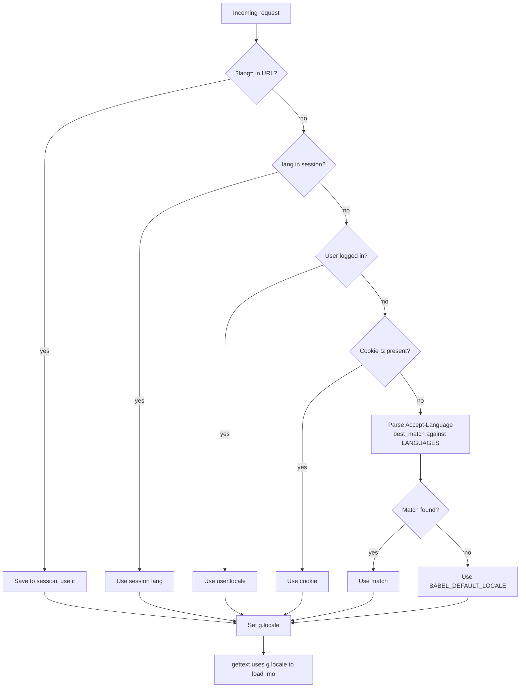
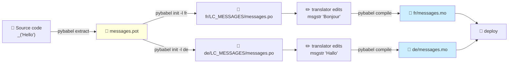
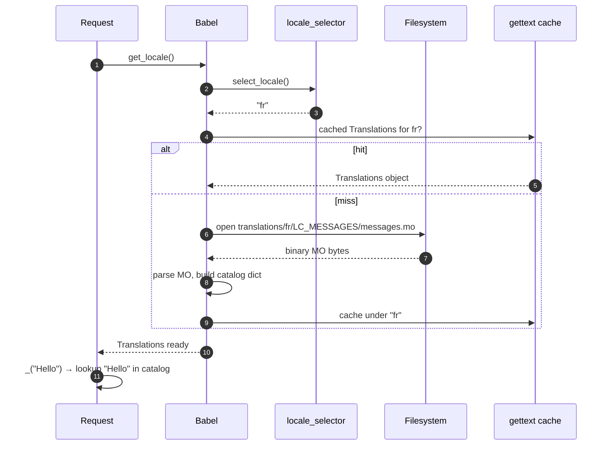
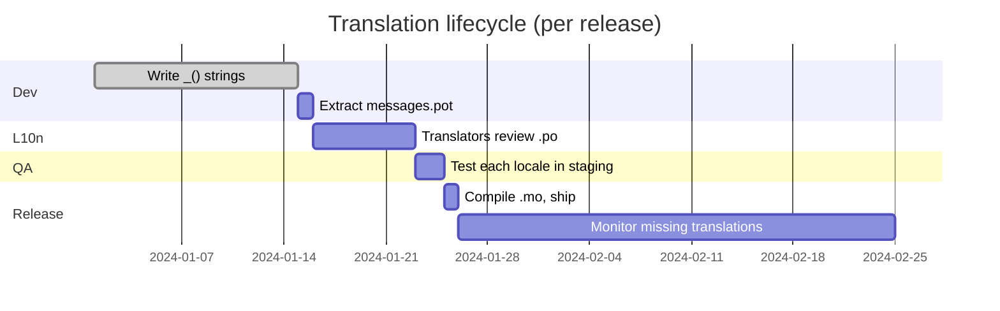

# Flask-Babel

#flask #i18n #l10n #internationalization #gettext #babel #translations #locale

> [!info] Internationalization (i18n) & localization (l10n) for Flask
> **Flask-Babel** wires Python's `gettext` ecosystem and the `Babel` CLDR library into Flask. It marks strings for translation, picks the best locale per request, compiles `.po` files to `.mo`, formats dates / numbers / currencies in the user's locale, and exposes `gettext` (and friends) inside Jinja templates. If your app will ever have a non-English user, install it on day one.

Think of Flask-Babel as a **simultaneous-translation booth at the UN**. Your view function speaks one language (English source strings) into a microphone. The translator's booth (the compiled `.mo` catalog) listens, looks up the sentence in its phrasebook, and broadcasts the matching translation into the headphones of every delegate (the user's locale). Delegates who didn't bring headphones (no translation available) hear the original English — that's the graceful fallback. The whole pipeline — selecting delegates, scheduling translations, publishing phrasebooks — is what Flask-Babel automates.

---

## 1. Overview & Metaphor

### i18n vs l10n vs L10n — the three letters that confuse everyone

| Term | Stands for | What it means |
|---|---|---|
| **i18n** | internationalization (18 letters between i and n) | Preparing code so it *can* be translated. Wrapping strings in `gettext()`, not hard-coding plurals, formatting dates with locale-aware formatters. |
| **l10n** | localization (10 letters between l and n) | Actually translating the strings, picking locale-specific number/date formats, swapping in local imagery. |
| **L10n (corporate)** | "shipped in 10 locales" | A milestone, not a technique. |

Flask-Babel does **i18n** (the framework) and helps you ship **l10n** (the per-locale data).

### The four pieces of the gettext ecosystem

| Piece | Format | Created by | Used at |
|---|---|---|---|
| Marked source strings | `_("Hello")` in `.py` and `.html` | you, the developer | runtime |
| Extracted strings | `messages.pot` (PO Template) | `pybabel extract` | build time |
| Per-locale translations | `messages.po` (PO file, human-editable) | translators (or you) | build time |
| Compiled catalog | `messages.mo` (MO file, binary) | `pybabel compile` | runtime |

### What Flask-Babel does

1. **`Babel(app)`** — registers a request-context locale selector and exposes the `gettext` family.
2. **`localeselector`** — you write a function that returns the best locale for the current request.
3. **`timezoneselector`** — same, but for the timezone used by `format_datetime`.
4. **Jinja integration** — `{{ _("Hello") }}` and `{{ ngettext(...) }}` work in templates automatically.
5. **Formatting helpers** — `format_datetime`, `format_number`, `format_currency`, `format_decimal`.

### What Flask-Babel does NOT do

| Concern | Who handles it |
|---|---|
| Translating strings | Human translators, or `babel -m machine_translate` (none built-in) |
| Right-to-left layout | Your CSS / Jinja template (`dir="rtl"`) |
| Plural rules per language | `Babel`'s CLDR data (built in) |
| Per-locale static assets | Your build step |
| Timezone-aware DB columns | [[Flask-SQLAlchemy]] `DateTime(timezone=True)` |
| Client-side date formatting | [[Flask-Moment]] |

> [!tip] The metaphor
> Flask-Babel is a **pharmacist's filing cabinet**. The cabinet has one drawer per locale (`en`, `fr`, `de`, `zh_Hans_CN`). Each drawer holds a notebook (`.po` file) that maps every English phrase you stock to its local-language equivalent. When a request walks in (a customer) with a `Accept-Language: fr` bracelet, the pharmacist (your view function) reaches into the `fr` drawer, looks up each `_("...")` call in the notebook, and hands over the French version. New phrases get added to a `messages.pot` master list, which you then photocopy into each drawer for translators to fill in.

---

## 2. Installation

```bash
(venv) $ pip install Flask-Babel
```

| Package | Version | Notes |
|---|---|---|
| Flask | 3.0.x | Compatible with 2.x and 3.x |
| Flask-Babel | 4.0.x | Uses `Babel` 2.x underneath |
| Babel | 2.14+ | Ships CLDR data; ~30 MB installed |

You also need the `pybabel` CLI, which ships with `Babel`:

```bash
(venv) $ pybabel --version
Babel 2.14.0
```

> [!warning] Flask-Babel 4.x vs 3.x
> 4.x requires Flask 2.0+ and Python 3.8+. The `get_translations` function moved to `flask_babel.get_translations()`. The public API (`gettext`, `ngettext`, `lazy_gettext`, `format_datetime`) is unchanged.

---

## 3. Configuration

### 3.1 Minimal init

```python
# extensions.py
from flask_babel import Babel

babel = Babel()

def init_babel(app):
    app.config["BABEL_DEFAULT_LOCALE"] = "en"
    app.config["BABEL_DEFAULT_TIMEZONE"] = "UTC"
    app.config["LANGUAGES"] = {
        "en": "English",
        "fr": "Français",
        "de": "Deutsch",
        "es": "Español",
        "zh_Hans_CN": "简体中文",
        "ja": "日本語",
    }
    babel.init_app(app, locale_selector=select_locale, timezone_selector=select_tz)
```

### 3.2 All configuration keys

| Key | Default | Description |
|---|---|---|
| `BABEL_DEFAULT_LOCALE` | `"en"` | Fallback locale if the selector returns `None` or an unsupported code. |
| `BABEL_DEFAULT_TIMEZONE` | `"UTC"` | Fallback timezone. |
| `BABEL_TRANSLATION_DIRECTORIES` | `"translations"` | One or more semicolon-separated paths to look for `translations/<locale>/LC_MESSAGES/*.mo`. |
| `BABEL_DOMAIN` | `"messages"` | The gettext domain. Useful for splitting translations into multiple files (`messages.mo`, `errors.mo`). |
| `LANGUAGES` | (none) | Your own dict of supported locales, used for the language picker UI. Flask-Babel doesn't read this; you do. |
| `BABEL_LOCALE_SELECTOR` | `None` | Function reference (or pass to `init_app`). |
| `BABEL_TIMEZONE_SELECTOR` | `None` | Function reference. |

### 3.3 The locale selector

```python
from flask import request, session, g
from flask_babel import Babel

def select_locale():
    # 1. URL parameter ?lang=fr (e.g. language switcher)
    lang = request.args.get("lang")
    if lang in current_app.config["LANGUAGES"]:
        session["lang"] = lang
        return lang
    # 2. Saved preference
    if "lang" in session:
        return session["lang"]
    # 3. User profile (if logged in)
    if g.get("user"):
        return g.user.locale
    # 4. Accept-Language header
    best = request.accept_languages.best_match(
        list(current_app.config["LANGUAGES"].keys())
    )
    return best  # falls back to BABEL_DEFAULT_LOCALE if None
```

### 3.4 The timezone selector

```python
import pytz

def select_tz():
    # 1. User profile
    if g.get("user") and g.user.timezone:
        return g.user.timezone
    # 2. Cookie from JS (browser sends IANA tz via Intl API)
    tz = request.cookies.get("tz")
    if tz:
        try:
            return pytz.timezone(tz)
        except pytz.UnknownTimeZoneError:
            pass
    # 3. Default
    return current_app.config["BABEL_DEFAULT_TIMEZONE"]
```

### 3.5 The locale-selection flow



---

## 4. Basic Usage

### 4.1 Marking strings in Python

```python
# app.py
from flask_babel import gettext as _, ngettext, lazy_gettext as _l

class LoginForm(FlaskForm):
    username = StringField(_l("Username"), validators=[DataRequired()])
    password = PasswordField(_l("Password"), validators=[DataRequired()])

@app.route("/login", methods=["GET", "POST"])
def login():
    form = LoginForm()
    if form.validate_on_submit():
        user = User.query.filter_by(username=form.username.data).first()
        if user is None or not user.check_password(form.password.data):
            flash(_("Invalid username or password"))   # runtime translation
            return redirect(url_for("login"))
        login_user(user)
        return redirect(url_for("home"))
    return render_template("login.html", form=form)
```

| Function | When to use | When is the lookup done? |
|---|---|---|
| `gettext("Hello")` / `_("Hello")` | In view functions, flashed messages, anywhere executed at request time | At call time — uses current request's locale |
| `lazy_gettext("Hello")` / `_l("Hello")` | At module load time (form labels, class attributes, config defaults) | Deferred until the string is actually rendered/str()'d |
| `ngettext("1 apple", "%(count)d apples", n)` | Plurals | At call time; Babel picks the right plural form per language |
| `pgettext("ctx", "Open")` | Disambiguate ("Open" verb vs "Open" adjective) | At call time |
| `npgettext(...)` | Plural + context | At call time |

> [!danger] Use `lazy_gettext` for module-level strings
> If you write `username = StringField(_("Username"))` at module import time, `_()` runs once, with no request context, and the string is locked to the default locale forever. Use `_l()` instead.

### 4.2 Marking strings in Jinja

```html
<!-- templates/login.html -->

{{ _("Log in") }}

  <h1>{{ _("Welcome back") }}</h1>
  <form method="post">
    {{ form.username.label }} {{ form.username(size=32) }}
    {{ form.password.label }} {{ form.password(size=32) }}
    <button type="submit">{{ _("Log in") }}</button>
  </form>
  <p>{{ ngettext("You have one new message.", "You have %(count)d new messages.", count) }}</p>

```

`_()` is auto-imported into Jinja by Flask-Babel.

### 4.3 The translation workflow



### 4.4 The CLI commands

```bash
# 1. Configure extraction in babel.cfg
$ cat babel.cfg
[python: app/**.py]
[jinja2: app/templates/**.html]
extensions=jinja2.ext.autoescape,jinja2.ext.with_

# 2. Extract strings from source → messages.pot
(venv) $ pybabel extract -F babel.cfg -o messages.pot .

# 3. Initialise a new locale's .po file (one-time per locale)
(venv) $ pybabel init -i messages.pot -d translations -l fr
(venv) $ pybabel init -i messages.pot -d translations -l de

# 4. After you add new _() strings, update the .po files (preserves translations)
(venv) $ pybabel update -i messages.pot -d translations

# 5. Compile .po → .mo (run before deploy / restart server)
(venv) $ pybabel compile -d translations
```

### 4.5 The `.po` file format

```po
# translations/fr/LC_MESSAGES/messages.po
msgid ""
msgstr ""
"Project-Id-Version: MyProject 1.0\n"
"Report-Msgid-Bugs-To: \n"
"MIME-Version: 1.0\n"
"Content-Type: text/plain; charset=utf-8\n"
"Content-Transfer-Encoding: 8bit\n"
"Plural-Forms: nplurals=2; plural=(n > 1);\n"
"Language: fr\n"

#: app/auth.py:42
msgid "Invalid username or password"
msgstr "Nom d'utilisateur ou mot de passe invalide"

#: app/templates/login.html:5
msgid "Log in"
msgstr "Se connecter"

#: app/templates/login.html:11
#, python-format
msgid "You have %(count)d new messages."
msgstr "Vous avez %(count)d nouveaux messages."
```

> [!info] Plural forms differ wildly between languages
> English has 2 plural forms (1, many). Arabic has 6 (zero, one, two, few, many, other). Russian has 3. The `Plural-Forms:` header tells `gettext` how to pick. `ngettext` does this automatically — just supply the English source.

---

## 5. Intermediate Patterns

### 5.1 Date & time formatting

```python
from datetime import datetime, timezone, timedelta
from flask_babel import format_datetime, format_date, format_time

@app.route("/post/<int:pid>")
def post(pid):
    p = Post.query.get_or_404(pid)
    return render_template("post.html",
        published=format_datetime(p.created_at, format="long"),
        edited=format_datetime(p.updated_at, "MMM d, y 'at' h:mm a"),
    )
```

| Input | Locale | Output |
|---|---|---|
| `datetime(2024, 1, 15, 14, 30)` | `en` | `January 15, 2024, 2:30:00 PM` |
| same | `fr` | `15 janvier 2024 à 14:30:00` |
| same | `de` | `15. Januar 2024 um 14:30:00` |
| same | `zh_Hans_CN` | `2024年1月15日 下午2:30:00` |
| same | `ja` | `2024年1月15日 14:30:00` |

In templates:

```html
<time datetime="{{ post.created_at.isoformat() }}">
  {{ post.created_at|datetimeformat('long') }}
</time>
```

### 5.2 Number, currency & percent formatting

```python
from flask_babel import format_number, format_currency, format_percent, format_decimal

@app.route("/product/<int:pid>")
def product(pid):
    p = Product.query.get_or_404(pid)
    return render_template("product.html",
        price=format_currency(p.price_cents / 100, "USD"),
        discount=format_percent(p.discount / 100),
        units=format_number(p.units_in_stock),
        rating=format_decimal(p.rating, format="0.0"),
    )
```

| Format | Locale | Output |
|---|---|---|
| `format_currency(1234.5, "USD")` | `en_US` | `$1,234.50` |
| same | `fr_FR` | `1 234,50 $US` |
| same | `de_DE` | `1.234,50 $` |
| same | `ja_JP` | `$1,234.50` |
| `format_number(1234567)` | `en` | `1,234,567` |
| `format_number(1234567)` | `de` | `1.234.567` |
| `format_percent(0.075)` | `en` | `7.5%` |
| `format_percent(0.075)` | `fr` | `7,5 %` |

### 5.3 Pluralization

```python
from flask_babel import ngettext

@app.route("/inbox")
def inbox():
    n = current_user.unread_count()
    msg = ngettext("One unread message", "%(count)d unread messages", n)
    return render_template("inbox.html", message=msg)
```

For **Arabic** (`ar`), the same code automatically picks the right form from the 6 plural forms:

```po
# translations/ar/LC_MESSAGES/messages.po
"Plural-Forms: nplurals=6; plural=(n==0 ? 0 : n==1 ? 1 : n==2 ? 2 : n%100>=3 && n%100<=10 ? 3 : n%100>=11 ? 4 : 5);\n"

msgid "One unread message"
msgid_plural "%(count)d unread messages"
msgstr[0] "لا توجد رسائل غير مقروءة"     # 0
msgstr[1] "رسالة واحدة غير مقروءة"        # 1
msgstr[2] "رسالتان غير مقروءتان"          # 2
msgstr[3] "%(count)d رسائل غير مقروءة"    # 3-10
msgstr[4] "%(count)d رسالة غير مقروءة"    # 11+
msgstr[5] "%(count)d رسالة غير مقروءة"    # other
```

### 5.4 Context disambiguation

```python
from flask_babel import pgettext

# Two different meanings of "Open"
verb = pgettext("action", "Open")    # → "Ouvrir" in French
adj = pgettext("status", "Open")     # → "Ouvert" in French
```

The `.po` file uses `msgctxt`:

```po
msgctxt "action"
msgid "Open"
msgstr "Ouvrir"

msgctxt "status"
msgid "Open"
msgstr "Ouvert"
```

---

## 6. Advanced Usage

### 6.1 Multiple domains

If you have a huge app, split translations:

```python
# extensions.py
from flask_babel import Domain
from flask_babel import Babel

babel = Babel()
errors_domain = Domain(domain="errors", translation_directories="translations")

@app.errorhandler(404)
def not_found(e):
    # Use the errors_domain for this message
    msg = errors_domain.gettext("Page not found")
    return render_template("404.html", message=msg), 404
```

Extract each domain separately:

```bash
(venv) $ pybabel extract -F babel.cfg -o messages.pot --keyword="_ --keyword=gettext" .
(venv) $ pybabel extract -F babel.cfg -o errors.pot --keyword="errors_domain.gettext" .
```

### 6.2 Loading translations from a database

```python
from babel.support import Translations
from flask import current_app
from flask_babel import get_locale

def db_translations():
    """Load .mo bytes from DB instead of filesystem."""
    locale = str(get_locale())
    cached = cache.get(f"mo:{locale}")
    if cached:
        return Translations(None, domain="messages")._from_bytes(cached)
    mo_bytes = TranslationBlob.query.filter_by(locale=locale).first().data
    cache.set(f"mo:{locale}", mo_bytes, timeout=300)
    return Translations(None, domain="messages")._from_bytes(mo_bytes)

# Plug into Babel
babel.init_app(app, locale_selector=select_locale, translations_factory=db_translations)
```

### 6.3 The .mo loading flow



### 6.4 Marking strings in JavaScript

Use `Flask-Babel` together with a JS extractor (`babel` filter from [[Flask-Assets]] or webpack's `i18n-extract`):

```javascript
// app/assets/js/dashboard.js
import { gettext as _, ngettext } from "./i18n";

const message = _("Welcome back");
const count = ngettext("1 notification", "%(count)d notifications", n);
```

```ini
# babel-js.cfg
[javascript: app/assets/**.js]
encoding = utf-8
extract_messages = gettext, ngettext, _
```

```bash
(venv) $ pybabel extract -F babel-js.cfg -o messages-js.pot app/assets
```

---

## 7. Common Pitfalls & Troubleshooting

| Symptom | Likely cause | Fix |
|---|---|---|
| Strings show in English despite `.po` file | `.mo` not compiled, or server not restarted | Run `pybabel compile -d translations` and restart gunicorn. |
| `OSError: [Errno 2] Unable to find translation directory` | Wrong `BABEL_TRANSLATION_DIRECTORIES` | Use absolute path, or relative to `app.root_path`. |
| `lazy_gettext` strings show as `"Hello"` not translated | The string was `str()`'d before request context existed | Use `force_text()` or render at request time. |
| Plural form wrong | `Plural-Forms:` header missing from `.po` | Re-run `pybabel init -l <locale>`; it writes the header from CLDR. |
| Accept-Language ignored | `locale_selector` not set in `init_app` | Pass `locale_selector=select_locale` to `babel.init_app(app, ...)`. |
| New strings not in `.po` after extract | `babel.cfg` missing the file pattern | Add `[python: app/**.py]` and `[jinja2: app/templates/**.html]`. |
| Fuzzy translations appear | `pybabel update` marks slightly changed strings as fuzzy | Review and remove the `#, fuzzy` line, then recompile. |
| Cache holds stale `.mo` after deploy | `.mo` loaded once per worker | Restart workers or use `BABEL_TRANSLATION_DIRECTORIES` cache buster; in dev set `BABEL_DEFAULT_LOCALE` reload. |
| `ValueError: unknown locale` | Wrong locale code (`zh-CN` vs `zh_Hans_CN`) | Use BCP-47 with underscores: `zh_Hans_CN`, `pt_BR`, `en_GB`. |

> [!bug] Don't translate user-generated content
> `gettext()` is for **UI strings**, not user content. If you have a blog post in multiple languages, store one row per language in the DB and select by locale — don't try to gettext() the post body.

> [!warning] The `.mo` file is binary — don't edit it
> Always edit `.po` files (they're text) and run `pybabel compile` to regenerate `.mo`. Hand-editing `.mo` corrupts the hash table and produces silent mis-translations.

---

## 8. Best Practices

1. **Install on day one.** Adding i18n to an existing app means wrapping thousands of strings — much cheaper to do it from the start.
2. **Use `lazy_gettext` for anything module-level.** Form labels, validators, config defaults.
3. **Extract in CI.** Add `pybabel extract` to your CI pipeline and fail if `messages.pot` is out of sync with source.
4. **Compile in CI.** Run `pybabel compile` before building the Docker image; ship the `.mo` files in the image.
5. **Don't translate dynamic strings.** Wrap user-visible UI text, not data.
6. **Use context (`pgettext`) for ambiguous words.** "Open", "Save", "Cancel" all benefit.
7. **Test with a fake locale.** Set `BABEL_DEFAULT_LOCALE='xx'` and add a fake `xx` catalog with `_("Hello")` → `"[Hello]"` so untranslated strings are visible in tests.
8. **Provide a language switcher.** Persist in session/cookie; don't rely solely on Accept-Language.
9. **Use CLDR data, not hand-rolled formats.** `format_currency(1234.5, "USD")` knows that `de` puts the symbol after the number with a space.
10. **Cache the `Translations` object.** Flask-Babel caches per-request by default; for high QPS, memoize across requests.

### Locale code conventions

| Code | Use |
|---|---|
| `en` | Generic English |
| `en_GB`, `en_US` | Regional English (date format, currency) |
| `zh_Hans_CN` | Simplified Chinese, mainland |
| `zh_Hant_TW` | Traditional Chinese, Taiwan |
| `pt_BR` | Brazilian Portuguese (very different from `pt_PT`) |
| `sr_Latn` | Serbian in Latin script |

---

## 9. Integration with Other Extensions

### 9.1 [[Flask-WTF]]

Form labels and validation messages should use `lazy_gettext`:

```python
from flask_wtf import FlaskForm
from wtforms import StringField, validators
from flask_babel import lazy_gettext as _l

class RegistrationForm(FlaskForm):
    username = StringField(_l("Username"), [
        validators.Length(min=3, message=_l("Must be at least %(min)d characters.")),
        validators.Regexp(r"^\w+$", message=_l("Only letters, numbers, underscore.")),
    ])
    email = StringField(_l("Email"), [validators.Email(message=_l("Invalid email."))])
```

Then extract with `[python: app/forms/**.py]` in `babel.cfg`.

### 9.2 [[Marshmallow]]

Marshmallow error messages can be localized:

```python
from marshmallow import Schema, fields, ValidationError
from flask_babel import gettext as _

class UserSchema(Schema):
    email = fields.Email(required=True, error_messages={
        "required": _("Email is required."),
        "invalid": _("Invalid email address."),
    })
```

Or use a custom error handler:

```python
from flask_babel import gettext as _

@app.errorhandler(ValidationError)
def handle_validation(err):
    return jsonify({"errors": {
        field: [_(msg) for msg in messages]
        for field, messages in err.messages.items()
    }}), 422
```

### 9.3 [[Flask-Admin]]

Flask-Admin uses `lazy_gettext` internally for column labels, action names, and breadcrumbs. To localise your own columns:

```python
from flask_babel import lazy_gettext as _l

class UserAdmin(ModelView):
    column_labels = {
        "username": _l("Username"),
        "email": _l("Email"),
        "is_active": _l("Active?"),
    }
```

### 9.4 [[Flask-RESTful]] / [[Flask-RESTX]]

Wrap response messages with `gettext`:

```python
from flask_restful import Resource
from flask_babel import gettext as _

class Health(Resource):
    def get(self):
        return {"status": _("healthy")}, 200
```

### 9.5 [[Flask-Moment]]

Server-side Babel formats datetimes for HTML; [[Flask-Moment]] does the same client-side for timezones that change after page load (e.g. user travels). Use Babel for initial render, Moment for live updates.

```python
# In template:
<time data-timestamp="{{ post.created_at.isoformat() }}"
      data-format="LLL">
  {{ post.created_at|datetimeformat('medium') }}   <!-- server-side Babel -->
</time>
<!-- Moment.js upgrades this on the client -->
```

### 9.6 [[Flask-Assets]] for JS translations

Extract JS strings via `babel-js.cfg`, merge into the same `messages.pot`, then bundle with a JS gettext shim:

```javascript
// i18n.js
const catalog = JSON.parse(document.getElementById("i18n-catalog").textContent);
export function gettext(s) { return catalog[s] || s; }
export function ngettext(s, p, n) { return catalog[n === 1 ? s : p] || (n === 1 ? s : p); }
```

```html
<script id="i18n-catalog" type="application/json">{{ catalog|tojson }}</script>
```

---

## 10. Real-World Example: Multi-locale blog

```python
# app.py
from flask import Flask, render_template, request, session, g, redirect, url_for
from flask_babel import Babel, gettext as _, lazy_gettext as _l, format_datetime, format_currency
from flask_wtf import FlaskForm
from wtforms import StringField, TextAreaField
from wtforms.validators import DataRequired, Length

app = Flask(__name__)
app.config["BABEL_DEFAULT_LOCALE"] = "en"
app.config["BABEL_DEFAULT_TIMEZONE"] = "UTC"
app.config["LANGUAGES"] = {"en": "English", "fr": "Français", "de": "Deutsch", "zh_Hans_CN": "简体中文"}
babel = Babel(app)

@babel.localeselector
def select_locale():
    if "lang" in request.args and request.args["lang"] in app.config["LANGUAGES"]:
        session["lang"] = request.args["lang"]
        return request.args["lang"]
    return session.get("lang") or request.accept_languages.best_match(
        list(app.config["LANGUAGES"].keys()), default="en")

@babel.timezoneselector
def select_tz():
    return session.get("tz", "UTC")

class PostForm(FlaskForm):
    title = StringField(_l("Title"), validators=[DataRequired(), Length(max=200)])
    body = TextAreaField(_l("Body"), validators=[DataRequired()])

POSTS = [
    {"id": 1, "title": "Hello world", "body": "First post", "created_at": datetime(2024, 1, 15, 10, 30)},
    {"id": 2, "title": "Babel guide", "body": "How to localise Flask", "created_at": datetime(2024, 2, 1, 14, 0)},
]

@app.route("/")
def index():
    return render_template("index.html", posts=POSTS, languages=app.config["LANGUAGES"])

@app.route("/post/<int:pid>")
def post(pid):
    p = next((x for x in POSTS if x["id"] == pid), None)
    if not p:
        return render_template("404.html", message=_("Post not found")), 404
    return render_template("post.html",
                           post=p,
                           published=format_datetime(p["created_at"], format="long"))
```

```html
<!-- templates/index.html -->


<nav class="lang-switcher">
  
    <a href="{{ url_for('index', lang=code) }}"
       class="{{ 'active' if session.get('lang') == code }}">{{ name }}</a>
  
</nav>
<h1>{{ _("Recent posts") }}</h1>
<ul>
  
    <li>
      <a href="{{ url_for('post', pid=p.id) }}">{{ p.title }}</a>
      <small>{{ format_datetime(p.created_at, 'short') }}</small>
    </li>
  
</ul>

```

```bash
# Build & deploy
(venv) $ pybabel extract -F babel.cfg -o messages.pot .
(venv) $ pybabel init -i messages.pot -d translations -l fr
(venv) $ pybabel init -i messages.pot -d translations -l de
# ... translators edit .po files ...
(venv) $ pybabel compile -d translations
(venv) $ flask run
```

### Translation maintenance lifecycle



---

## 11. References

- **PyPI**: <https://pypi.org/project/Flask-Babel/>
- **Docs**: <https://flask-babel.tkte.ch/>
- **Babel (underlying)**: <https://babel.pocoo.org/>
- **gettext manual**: <https://www.gnu.org/software/gettext/manual/gettext.html>
- **CLDR data**: <https://cldr.unicode.org/>
- **BCP-47 language tags**: <https://www.rfc-editor.org/rfc/rfc5646>
- **Online PO editor**: <https://poedit.net/>
- Companion notes: [[Flask-WTF]] (form labels), [[Marshmallow]] (API errors), [[Flask-Moment]] (client-side dates), [[Flask-Admin]] (admin labels), [[Common-Patterns]] (where i18n fits in app architecture).

> [!quote] Edward Tufte
> "The minimum interface is the maximum communication." Localisation is not just translating words — it's choosing the right number, date, and currency format so the user understands instantly, without translation.
