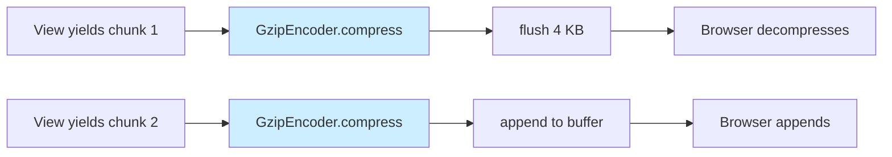
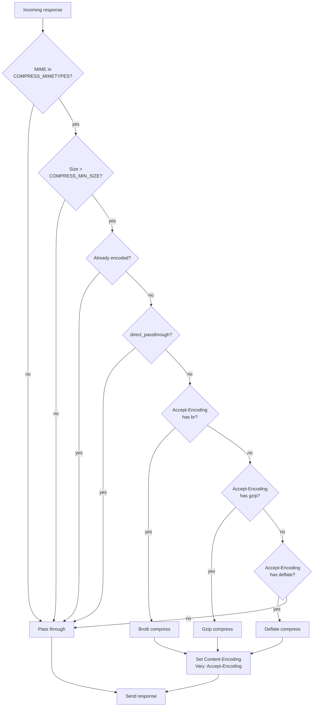
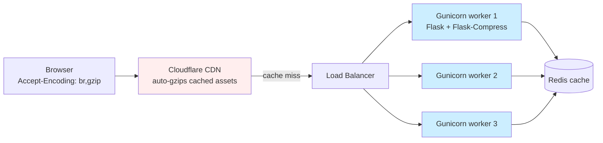

# Flask-Compress

#flask #frontend #compression #gzip #brotli #performance #middleware

> [!info] Gzip & Brotli response compression for Flask
> **Flask-Compress** transparently compresses your Flask HTTP responses using **gzip**, **deflate**, or **Brotli**, depending on what the client's `Accept-Encoding` header advertises. It is the easiest way to cut bandwidth and improve TTFB for text-heavy responses (HTML, JSON, CSS, JS, SVG, …) without touching nginx or Cloudflare.

Think of Flask-Compress as a **postage-stamp clerk**. After your view function has packed the box (the response body), the clerk weighs it, checks the destination's preferences (the client's `Accept-Encoding`), and decides whether to vacuum-seal the box with gzip (small, fast, universal) or Brotli (smaller, slightly slower, modern browsers only). The sealed box still has the same contents inside — the browser unpacks it before the user ever sees it. You never write decompression code; the browser handles it natively.

---

## 1. Overview & Metaphor

### The problem

Uncompressed text is wasteful. A typical Flask JSON API response is 80% redundant: the word `"created_at"` may appear 200 times. Compression ratios of **5× to 20×** are normal for HTML/JSON/CSS/JS.

| Response type | Uncompressed size | Gzip size | Brotli size |
|---|---|---|---|
| 100-row JSON payload | 42 KB | 6.1 KB | 4.8 KB |
| Rendered HTML page | 88 KB | 14 KB | 11 KB |
| `app.css` (minified) | 31 KB | 7.2 KB | 5.9 KB |
| `app.js` (minified) | 120 KB | 38 KB | 31 KB |

Brotli typically beats gzip by **10–20%** on text. For a 1 MB/day-per-user API, that's 100 KB saved per user per day.

### What Flask-Compress does

1. Hooks into Flask's `after_request` signal.
2. Reads `Accept-Encoding` from the request.
3. Skips responses that are already compressed (e.g. JPEG, PNG, video) or below `COMPRESS_MIN_SIZE`.
4. Picks the best algorithm (`br` > `gzip` > `deflate`) the client supports.
5. Compresses the body in-memory using streaming-safe code.
6. Sets `Content-Encoding`, `Vary: Accept-Encoding`, and updates `Content-Length`.

### What Flask-Compress does NOT do

| Concern | Who handles it |
|---|---|
| HTTP/2 server push | Reverse proxy (nginx, Caddy) |
| Static-file pre-compression | Build step (see §5.2) |
| Image / video optimisation | `pillow`, `ffmpeg`, CDN |
| TLS / cert management | nginx, Caddy, or Flask's `ssl` context |
| Caching | [[Flask-Caching]] |
| Asset bundling | [[Flask-Assets]] or [[Flask-Vite]] |

> [!tip] The metaphor
> Flask-Compress is a **multilingual interpreter at customs**. The traveler (your response) speaks one language natively (raw bytes). The customs officer asks the visitor (browser) "do you understand Brotli? gzip? deflate?" and hands the response to the right interpreter. The visitor gets a translated (compressed) version; nobody else on the trip (your view function, your templates) had to learn any new languages.

---

## 2. Installation

```bash
(venv) $ pip install Flask-Compress
```

| Package | Version | Notes |
|---|---|---|
| Flask | 3.0.x | Compatible with 2.x and 3.x |
| Flask-Compress | 1.14.x | Pure-Python; uses `brotli` or `brotlicffi` if installed |

For Brotli support you also need one of:

```bash
(venv) $ pip install Brotli        # Google's reference impl, C extension
# OR
(venv) $ pip install brotlicffi    # CFFI version, easier on Alpine/musl
```

Without Brotli installed, Flask-Compress silently falls back to gzip only — no error.

> [!warning] Alpine Linux & musl
> The `Brotli` wheel sometimes fails to build on Alpine due to `gcc` ABI differences. Use `brotlicffi` instead, or run your container on `python:3.12-slim-bookworm` (Debian) where wheels work out of the box.

---

## 3. Configuration

### 3.1 Minimal init

```python
# extensions.py
from flask_compress import Compress
compress = Compress()

# app factory
def create_app():
    app = Flask(__name__)
    app.config["COMPRESS_MIMETYPES"] = [
        "text/html", "text/css", "text/xml",
        "application/json", "application/javascript",
        "application/xml", "image/svg+xml",
    ]
    compress.init_app(app)
    return app
```

### 3.2 All configuration keys

| Key | Default | Description |
|---|---|---|
| `COMPRESS_MIMETYPES` | `['text/html','text/css','text/xml','application/json','application/javascript','application/xml','image/svg+xml']` | List of MIME types eligible for compression. Add `application/atom+xml`, `application/manifest+json`, etc. as needed. |
| `COMPRESS_LEVEL` | `6` | gzip compression level (1=fastest, 9=smallest). Brotli uses `11` by default and ignores this unless overridden. |
| `COMPRESS_BR_LEVEL` | (uses `COMPRESS_LEVEL`) | Brotli level (0–11). `11` is slowest but smallest; `4` is the sweet spot for dynamic responses. |
| `COMPRESS_BR_MODE` | `0` (generic) | Brotli mode: `0` = generic, `1` = text, `2` = font (WOFF2). Use `1` for HTML/CSS/JS. |
| `COMPRESS_BR_WINDOW` | `22` | Brotli LZ77 window size (10–24). Lower = less memory; default 22 = 4 MB window. |
| `COMPRESS_BR_BLOCK` | `0` | Brotli block size (0 = auto). |
| `COMPRESS_GZIP_LEVEL` | (uses `COMPRESS_LEVEL`) | Override gzip level without affecting Brotli. |
| `COMPRESS_DEFLATE_LEVEL` | (uses `COMPRESS_LEVEL`) | Override deflate level. |
| `COMPRESS_MIN_SIZE` | `500` | Don't bother compressing responses smaller than this — overhead beats savings. |
| `COMPRESS_ALGORITHM` | `['br', 'gzip', 'deflate']` | Order of algorithms to try (matches client `Accept-Encoding` quality). |
| `COMPRESS_STREAM` | `False` | If True, compress streamed responses incrementally. May break `Content-Length`; see §7. |

### 3.3 Sensible production defaults

```python
class ProductionConfig:
    COMPRESS_MIMETYPES = [
        "text/html", "text/css", "text/plain", "text/xml",
        "application/json", "application/javascript",
        "application/xml", "image/svg+xml",
        "application/manifest+json", "application/atom+xml",
    ]
    COMPRESS_LEVEL = 6            # gzip sweet spot
    COMPRESS_BR_LEVEL = 4         # Brotli dynamic-content sweet spot
    COMPRESS_BR_MODE = 1          # text mode
    COMPRESS_MIN_SIZE = 500       # skip tiny responses
    COMPRESS_ALGORITHM = ["br", "gzip", "deflate"]
```

> [!danger] Don't set Brotli level to 11 for dynamic responses
> Brotli-11 takes 50–100× longer than Brotli-4 for ~5% smaller output. Reserve level 11 for **pre-compressed static files** built offline. For per-request compression, level 4 is the standard.

---

## 4. Basic Usage

### 4.1 One-line enable

```python
from flask import Flask
from flask_compress import Compress

app = Flask(__name__)
Compress(app)

@app.route("/api/users")
def users():
    return jsonify([{"id": i, "name": f"user_{i}", "created_at": "2024-01-15"} for i in range(100)])

if __name__ == "__main__":
    app.run()
```

```bash
$ curl -sH "Accept-Encoding: br,gzip" -o /dev/null -w \
  "size=%{size_download} bytes, encoding=%{header_json}\n" \
  http://localhost:5000/api/users
size=1284 bytes, encoding=Content-Encoding: br, Vary: Accept-Encoding
```

Without the `Accept-Encoding` header the same response is **6.2 KB** instead of 1.3 KB.

### 4.2 The request/response flow

```mermaid
sequenceDiagram
    autonumber
    participant C as Browser
    participant F as Flask
    participant FC as Flask-Compress
    participant V as View function
    C->>F: GET /api/users  (Accept-Encoding: br, gzip;q=0.8)
    F->>V: dispatch
    V-->>F: Response(200, JSON, 6.2 KB)
    F->>FC: after_request hook
    FC->>FC: MIME in COMPRESS_MIMETYPES?
    FC->>FC: size > COMPRESS_MIN_SIZE?
    FC->>FC: pick best algo (br > gzip > deflate)
    FC->>FC: compress body  → 1.3 KB
    FC->>F: set Content-Encoding: br, Vary: Accept-Encoding
    F-->>C: 200 OK, Content-Encoding: br, body 1.3 KB
    C->>C: decompress, render
```

### 4.3 Verifying compression

```bash
# Plain (no Accept-Encoding)
$ curl -sI http://localhost:5000/api/users | grep -iE "content-(encoding|length)"
content-length: 6234

# Ask for gzip
$ curl -sH "Accept-Encoding: gzip" -I http://localhost:5000/api/users
content-encoding: gzip
content-length: 912
vary: Accept-Encoding

# Ask for Brotli
$ curl -sH "Accept-Encoding: br" -I http://localhost:5000/api/users
content-encoding: br
content-length: 738
vary: Accept-Encoding
```

---

## 5. Intermediate Patterns

### 5.1 Compression vs nginx: which layer?

| Layer | Pros | Cons |
|---|---|---|
| **Reverse proxy (nginx/Caddy)** | Doesn't touch Python; offloads CPU from app workers; pre-compresses static files. | Config duplication across services; need access to the proxy config. |
| **Flask-Compress** | Works on any host (dev, serverless, container); per-app config; compresses dynamic content the proxy can't (e.g. signed JSON you build per-request). | Burns Python CPU on every request; can't pre-compress static files. |
| **CDN edge (Cloudflare/Fastly)** | Free; closest to the user; serves cached compressed bytes. | Doesn't compress dynamic `Cache-Control: private` responses; requires CDN setup. |
| **Browser-side** (Service Worker) | Edge cases only | Complex, not worth it. |

**Rule of thumb:**
- If you control nginx → prefer `gzip on;` + `brotli on;` in nginx.
- If you're on serverless (Lambda, Cloud Run) → Flask-Compress.
- If you have a CDN → turn on CDN compression AND keep Flask-Compress for cache-miss cases.

### 5.2 Pre-compressing static files

Static files don't change between deploys — don't re-compress them on every request. Pre-compress at build time:

```python
# build_static.py — runs in CI
import gzip, brotli, os
from pathlib import Path

STATIC = Path("app/static")
COMPRESSIBLE = {".css", ".js", ".html", ".svg", ".json", ".xml", ".txt"}

for f in STATIC.rglob("*"):
    if f.suffix not in COMPRESSIBLE:
        continue
    data = f.read_bytes()
    # gzip
    with open(f"{f}.gz", "wb") as fh:
        with gzip.GzipFile(fileobj=fh, mode="wb", compresslevel=9, mtime=0) as gz:
            gz.write(data)
    # brotli
    with open(f"{f}.br", "wb") as fh:
        fh.write(brotli.compress(data, mode=brotli.MODE_TEXT, quality=11))
    print(f"  {f}: {len(data)}B → {len(data)//1024}KB source, "
          f"{os.path.getsize(f'{f}.gz')//1024}KB gz, "
          f"{os.path.getsize(f'{f}.br')//1024}KB br")
```

Then in nginx:

```nginx
gzip_static on;
brotli_static on;
```

### 5.3 Excluding specific routes

Use `after_request` ordering to skip compression for a route:

```python
@app.after_request
def maybe_skip_compress(response):
    if request.path.startswith("/api/stream/"):
        response.direct_passthrough = True   # Flask-Compress ignores passthrough
    return response
```

### 5.4 Conditional compression by content type

```python
# Only compress JSON for browsers, full compression for everything else
@app.after_request
def tweak_compression(response):
    ua = request.headers.get("User-Agent", "").lower()
    if "old-browser" in ua and response.mimetype == "application/json":
        response.headers.pop("Content-Encoding", None)
        response.headers["X-Compression"] = "skipped-old-browser"
    return response
```

---

## 6. Advanced Usage

### 6.1 Streaming responses

Flask's `stream_with_context` yields chunks; Flask-Compress can stream-compress them:

```python
from flask import Response, stream_with_context
import json, time

app.config["COMPRESS_STREAM"] = True

@app.route("/api/log-stream")
def log_stream():
    def generate():
        for i in range(1000):
            yield json.dumps({"line": i, "msg": "..."}) + "\n"
            time.sleep(0.01)
    return Response(stream_with_context(generate()),
                    mimetype="application/x-ndjson")
```



> [!bug] Streaming + compression breaks `Content-Length`
> Compressed size isn't known until the last byte. Flask-Compress will omit `Content-Length` and rely on `Transfer-Encoding: chunked`. Some clients (older curl, embedded HTTP clients) don't handle chunked well — test before relying on it.

### 6.2 Custom algorithm selection

```python
from flask_compress import Compress

class SmartCompress(Compress):
    def _choose_algorithm(self, accept_encoding, response_size):
        # Use Brotli only for >10 KB responses (it's CPU-heavy)
        if "br" in accept_encoding and response_size > 10240:
            return "br"
        if "gzip" in accept_encoding:
            return "gzip"
        return None

compress = SmartCompress()
compress.init_app(app)
```

### 6.3 Measuring compression ratio per route

```python
import time
from flask import g

@app.after_request
def log_compression(response):
    original = response.headers.get("X-Original-Content-Length")
    encoded = response.headers.get("Content-Length")
    if original and encoded and response.headers.get("Content-Encoding"):
        ratio = int(original) / int(encoded)
        app.logger.info(
            "compress path=%s algo=%s orig=%s enc=%s ratio=%.1fx",
            request.path, response.headers["Content-Encoding"],
            original, encoded, ratio,
        )
    return response
```

### 6.4 Decision matrix



---

## 7. Common Pitfalls & Troubleshooting

| Symptom | Likely cause | Fix |
|---|---|---|
| Response is still uncompressed | MIME type not in `COMPRESS_MIMETYPES` | Add it, or use `application/json; charset=utf-8` exact match. |
| `Content-Length` mismatch errors | Streaming + compression disabled `Content-Length` | Disable `COMPRESS_STREAM` or use chunked-aware clients. |
| CPU at 100% under load | Brotli level 11 + high QPS | Drop to `COMPRESS_BR_LEVEL=4` and let nginx handle static files. |
| JSON responses look "broken" in some clients | Client doesn't send `Accept-Encoding` | Server is fine; client must support `Content-Encoding` to receive compressed bytes. |
| Cloudflare warns "double compression" | CDN + Flask-Compress both compressing | Disable Flask-Compress for CDN-fronted paths or set `Cache-Control: public, max-age=...` so the CDN caches. |
| `brotli` import error on install | C extension build failed | Install `brotlicffi` instead, or use a Debian-based image. |
| SSE / WebSocket not working | Compression on streaming endpoints corrupts framing | Exempt `/stream/*` routes with `direct_passthrough=True`. |
| `Vary: Accept-Encoding` missing on cached responses | Custom `after_request` overwrote `Vary` | Append to existing `Vary` rather than replace: `response.headers.add("Vary", "Accept-Encoding")`. |

> [!bug] Don't compress already-compressed bytes
> PNG, JPEG, WebP, MP4, GZIP'd files, and Brotli'd files will actually **grow** by ~0.1% if you try to gzip them again. Make sure these MIME types are NOT in `COMPRESS_MIMETYPES`. The default list excludes them, but custom additions sometimes sneak them in.

> [!warning] nginx `proxy_set_header Accept-Encoding ""`
> A common nginx pattern is to strip `Accept-Encoding` from upstream requests to disable upstream compression. If you do this, Flask-Compress will see no `Accept-Encoding` and won't compress — nginx then expects to do it. Either let nginx handle compression entirely, or let Flask-Compress do it. Don't do both half-way.

---

## 8. Best Practices

1. **Tier your compression.** Brotli-4 for dynamic, Brotli-11 pre-compressed for static, gzip-6 fallback for everything else.
2. **Always set `Vary: Accept-Encoding`.** Flask-Compress does this for you; never strip it.
3. **Skip small responses.** Anything under 500 bytes is wasted CPU.
4. **Skip already-compressed types.** Images, video, archives.
5. **Don't compress SSE or WebSocket frames.** They have their own framing.
6. **Combine with HTTP/2.** Compression and HTTP/2 multiplexing compose multiplicatively: fewer round trips + smaller bytes = huge perf wins.
7. **Monitor CPU.** Compression is CPU-bound; under high concurrency, you may need more gunicorn workers or to move compression to a sidecar.
8. **Cache the compressed result.** If the same JSON response is requested 1000×/sec, cache it via [[Flask-Caching]] after compression to avoid recompressing.

### The perf-budget table

| Layer | Saves | Costs |
|---|---|---|
| [[Flask-Assets]] bundle (1 file vs 50) | ~300 ms RTT | one-time build |
| Flask-Compress gzip-6 | ~80% bytes | ~2 ms CPU/req |
| Flask-Compress brotli-4 | ~85% bytes | ~5 ms CPU/req |
| CDN edge cache | 100 ms latency | CDN setup |
| HTTP/2 multiplex | ~200 ms RTT | TLS setup |

---

## 9. Integration with Other Extensions

### 9.1 [[Flask-Assets]]

Flask-Assets produces the minified CSS/JS; Flask-Compress gzips it on the wire. Together they take a 120 KB `app.js` down to ~30 KB over the wire.

```python
assets = Environment(app)         # bundles/minifies
Compress(app)                     # gzips the response
```

Make sure `application/javascript` and `text/css` are in `COMPRESS_MIMETYPES` (they are by default).

### 9.2 [[Flask-Caching]]

Cache the *compressed* response:

```python
from flask_caching import Cache
cache = Cache(app)

@app.route("/api/slow")
@cache.cached(timeout=60, unless=lambda: request.args.get("no_cache"))
def slow():
    # The cached value is already gzipped — Flask-Compress will skip
    # because Content-Encoding is already set.
    return jsonify(expensive_computation())
```

### 9.3 [[Flask-Limiter]]

Compression doesn't interact with rate limiting, but consider rate-limiting *before* compression to avoid wasting CPU on rejected requests:

```python
@limiter.limit("10/min")
@app.route("/api/expensive")
def expensive():
    return jsonify(...)   # compressed AFTER limiter checks
```

### 9.4 [[Flask-RESTful]] / [[Marshmallow]]

Large JSON API responses benefit most from compression. A 1000-row paginated response can drop from 600 KB to 60 KB.

### 9.5 With a reverse proxy

If you run behind nginx with `gzip on`:

```nginx
# nginx.conf
gzip on;
gzip_types text/css application/javascript application/json image/svg+xml;
gzip_min_length 500;
gzip_vary on;
```

Then disable Flask-Compress in your prod config:

```python
class ProductionConfig:
    COMPRESS_MIMETYPES = []  # let nginx do it
```

But on **serverless / Lambda / Cloud Run** where you have no nginx, Flask-Compress is the only game in town.

---

## 10. Real-World Example: A high-traffic JSON API

```python
# app.py
import os, logging
from flask import Flask, jsonify, request
from flask_compress import Compress
from flask_caching import Cache
from flask_limiter import Limiter
from flask_limiter.util import get_remote_address

def create_app():
    app = Flask(__name__)
    app.config.update(
        COMPRESS_MIMETYPES=[
            "application/json",
            "application/javascript",
            "text/css",
            "text/html",
            "image/svg+xml",
            "application/manifest+json",
        ],
        COMPRESS_LEVEL=6,
        COMPRESS_BR_LEVEL=4,
        COMPRESS_BR_MODE=1,
        COMPRESS_MIN_SIZE=500,
        COMPRESS_ALGORITHM=["br", "gzip", "deflate"],
        CACHE_TYPE="RedisCache",
        CACHE_REDIS_URL=os.environ["REDIS_URL"],
        RATELIMIT_HEADERS_ENABLED=True,
    )
    Compress(app)
    cache = Cache(app)
    limiter = Limiter(get_remote_address, app=app, default_limits=["1000/hour"])

    @app.after_request
    def instrumentation(response):
        enc = response.headers.get("Content-Encoding", "none")
        size = response.headers.get("Content-Length", "?")
        app.logger.info("path=%s enc=%s size=%s", request.path, enc, size)
        return response

    @app.get("/api/products")
    @limiter.limit("60/minute")
    @cache.cached(timeout=60, query_string=True)
    def products():
        # Simulate expensive DB+serialise
        rows = [{"id": i, "name": f"Product {i}", "price": i * 9.99} for i in range(500)]
        return jsonify(rows)

    return app

if __name__ == "__main__":
    app = create_app()
    app.run()
```

### Production topology



In this setup:
- Static assets (CSS/JS from [[Flask-Assets]]) are pre-compressed at build time, served by Cloudflare.
- Dynamic API responses are compressed by Flask-Compress on cache miss; the cached entry in Redis is the already-compressed bytes.
- Cloudflare passes `Accept-Encoding` through, so cached responses are served with the right `Content-Encoding`.

---

## 11. References

- **PyPI**: <https://pypi.org/project/Flask-Compress/>
- **Source**: <https://github.com/colour-science/flask-compress>
- **Brotli reference**: <https://github.com/google/brotli>
- **RFC 7230** (gzip/deflate): <https://datatracker.ietf.org/doc/html/rfc7230>
- **RFC 7932** (Brotli): <https://datatracker.ietf.org/doc/html/rfc7932>
- nginx `gzip_static`: <https://nginx.org/en/docs/http/ngx_http_gzip_static_module.html>
- Companion notes: [[Flask-Assets]] (build the bytes), [[Performance-Optimization]] (where compression sits in the perf budget), [[Production-Deployment]] (where to enable it), [[Flask-Caching]] (cache the result).

> [!quote] Ilya Grigorik (High Performance Browser Networking)
> "Compression is one of the highest-leverage performance optimizations available: a few milliseconds of CPU on the server can save hundreds of milliseconds of network transfer time."
