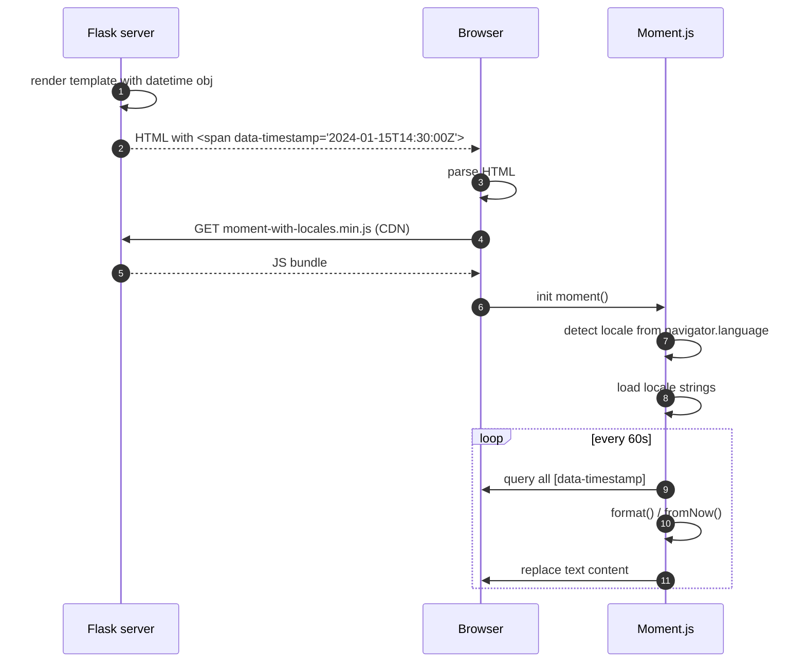
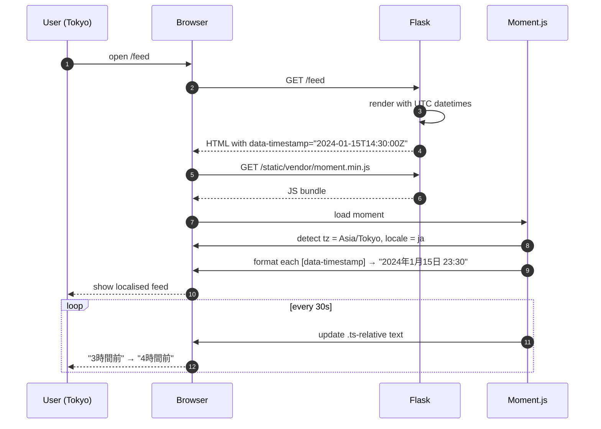

# Flask-Moment

#flask #frontend #timezone #momentjs #datetime #i18n #client-side

> [!info] Moment.js integration for Flask templates
> **Flask-Moment** is a tiny Flask wrapper that injects **Moment.js** into your Jinja templates and gives you a `moment()` helper to format datetimes client-side. The server emits an ISO-8601 timestamp; the browser's Moment.js converts it to the visitor's local timezone and locale — no extra API calls, no per-user timezone tables.

Think of Flask-Moment as a **postcard with a pre-paid stamp**. The postcard (your datetime) is written in one universal language — ISO 8601 UTC. The stamp (Moment.js) tells the post office (the browser) to deliver it in the recipient's local format and timezone. The sender (your Flask server) doesn't need to know whether the recipient is in Tokyo or Tucson — the browser figures it out from the user's system clock and locale settings.

> [!warning] Moment.js is in maintenance mode
> The Moment.js maintainers officially recommend [Luxon](https://moment.github.io/luxon/), [Day.js](https://day.js.org/), or [date-fns](https://date-fns.org/) for new projects. Flask-Moment still works (Moment.js is not disappearing), but for greenfield apps consider Flask-Vite + Day.js or server-side [[Flask-Babel]] formatting.

---

## 1. Overview & Metaphor

### The datetime problem

Datetimes are hard because they're contextual. The same instant in time has many representations:

| Format | Value | Where |
|---|---|---|
| UTC ISO 8601 | `2024-01-15T14:30:00Z` | Server-side universal |
| Unix epoch | `1705326600` | Server-side, machine-readable |
| Tokyo local | `2024-01-15 23:30 JST` | Visitor in Tokyo |
| New York local | `2024-01-15 09:30 EST` | Visitor in NYC |
| Relative | "3 hours ago" | Either |
| Calendar | "Today at 2:30 PM" | Either |

The challenge: the server doesn't know the visitor's timezone. Options:

| Approach | Pros | Cons |
|---|---|---|
| Store UTC, format server-side using `Accept-Timezone` header | Single source of truth | Browsers don't send `Accept-Timezone` by default; need extra round-trip |
| Detect timezone client-side with `Intl.DateTimeFormat().resolvedOptions().timeZone`, POST to server, store in session | Server formats correctly | Adds complexity, breaks cache (per-tz cache keys) |
| **Send UTC ISO, format client-side with Moment.js** (Flask-Moment) | Stateless, cacheable, simple | Requires JS; doesn't work in non-JS contexts |

Flask-Moment picks the third option.

### What Flask-Moment does

1. Loads Moment.js into your base template (one `<script>` tag).
2. Exposes `moment(timestamp)` in Jinja, returning an object with chainable methods.
3. Renders `<span>` tags with `data-timestamp` attributes that Moment.js picks up on page load.
4. Periodically refreshes "time-ago" values (e.g. "3 minutes ago" → "4 minutes ago").

### What Flask-Moment does NOT do

| Concern | Who handles it |
|---|---|
| Server-side date formatting for non-JS clients | [[Flask-Babel]] `format_datetime` |
| Storing timezones in DB | [[Flask-SQLAlchemy]] `DateTime(timezone=True)` |
| Calendar pickers | `flatpickr`, `pikaday` |
| Date arithmetic | `python-dateutil`, `Arrow`, `pendulum` |
| Locale translations | [[Flask-Babel]] |
| Modern ESM-based date libs | [[Flask-Vite]] + Day.js / Luxon |

> [!tip] The metaphor
> Flask-Moment is a **bilingual note card**. On one side, the card has the timestamp in plain UTC ("2024-01-15T14:30:00Z") — readable by any system. On the other side, it has a magic sticker that says "translate this into the reader's local language." The reader's browser reads the sticker, does the translation via Moment.js, and shows the visitor their local time. The sender never learned any other language.

---

## 2. Installation

```bash
(venv) $ pip install Flask-Moment
```

| Package | Version | Notes |
|---|---|---|
| Flask | 3.0.x | Works with 2.x and 3.x |
| Flask-Moment | 1.0.x | Pure Python wrapper |
| Moment.js | 2.29.x | Loaded from CDN by default |

Moment.js itself is loaded from a CDN (`cdnjs.cloudflare.com` by default). To bundle it locally (offline / intranet), see §5.3.

> [!warning] Moment.js 3.x doesn't exist
> Moment.js is permanently on the 2.x line; the team has explicitly stated there will be no 3.0. The maintenance-mode announcement means bug fixes only — no new features.

---

## 3. Configuration

### 3.1 Minimal init

```python
# extensions.py
from flask_moment import Moment
moment = Moment()

def init_app(app):
    moment.init_app(app)
```

### 3.2 Config keys

Flask-Moment has very few knobs — Moment.js does the heavy lifting.

| Key | Default | Description |
|---|---|---|
| `MOMENT_JS_URL` | `https://cdnjs.cloudflare.com/ajax/libs/moment.js/2.29.4/moment-with-locales.min.js` | URL to load Moment.js from. Override for self-hosting. |
| `MOMENT_LOCAL_JS_URL` | (none) | If set, used when `MOMENT_INCLUDE_MOMENT` is True and you want a local file. |
| `MOMENT_INCLUDE_MOMENT` | `True` | Whether to auto-include the `<script>` tag in `moment.include_moment()`. Set to False if you bundle Moment.js via [[Flask-Assets]] or [[Flask-Vite]]. |
| `MOMENT_LOCALE_URL` | (auto) | URL pattern for locale files: `{0}/locale/{1}.js` where `{0}` is the Moment.js base URL and `{1}` is the locale code. |
| `MOMENT_DEFAULT_LOCALE` | `"en"` | Fallback locale. The request locale is detected from `Accept-Language`. |

### 3.3 Per-app config

```python
class ProductionConfig:
    MOMENT_JS_URL = "https://cdn.mycompany.com/libs/moment/2.29.4/moment-with-locales.min.js"
    MOMENT_DEFAULT_LOCALE = "en"

class OfflineConfig:
    MOMENT_JS_URL = "/static/vendor/moment-with-locales.min.js"
    MOMENT_INCLUDE_MOMENT = True
```

---

## 4. Basic Usage

### 4.1 The base template

```html
<!-- templates/base.html -->
<!doctype html>
<html>
<head>
  <title>My App</title>
</head>
<body>
  

  <!-- Flask-Moment includes Moment.js + auto-refresh script -->
  {{ moment.include_moment() }}
</body>
</html>
```

### 4.2 Using `moment()` in a template

```python
# app.py
from datetime import datetime, timezone
from flask import Flask, render_template
from flask_moment import Moment

app = Flask(__name__)
Moment(app)

@app.route("/post/<int:pid>")
def post(pid):
    p = Post.query.get_or_404(pid)
    return render_template("post.html",
        post=p,
        now=datetime.now(timezone.utc))

@app.route("/now")
def now():
    return render_template("now.html", current_time=datetime.now(timezone.utc))
```

```html
<!-- templates/post.html -->


  <article>
    <h1>{{ post.title }}</h1>
    <p>
      Published:
      <!-- Renders: <span data-timestamp="...">January 15, 2024 2:30 PM</span> -->
      {{ moment(post.created_at).format('LLL') }}
    </p>
    <p>
      <small>
        <!-- "3 hours ago" -->
        {{ moment(post.created_at).fromNow() }}
      </small>
    </p>
    <p>Page rendered: {{ moment(current_time).format('LLLL') }}</p>
  </article>

```

### 4.3 What the server emits

```html
<span data-timestamp="2024-01-15T14:30:00+00:00" data-format="LLL">January 15, 2024 2:30 PM</span>
```

When the browser loads:

1. Moment.js parses `data-timestamp` as UTC.
2. Converts to the visitor's local timezone.
3. Formats with the given `data-format` token.
4. Replaces the `<span>` text (or content) with the formatted string.

For `fromNow()`, Flask-Moment also registers a periodic refresh (every minute by default) so "3 minutes ago" becomes "4 minutes ago" without a page reload.

### 4.4 The client-side rendering flow



---

## 5. Intermediate Patterns

### 5.1 Format tokens

| Token | Output (en_US) | Meaning |
|---|---|---|
| `LT` | `2:30 PM` | Time (no seconds) |
| `LTS` | `2:30:25 PM` | Time (with seconds) |
| `L` | `01/15/2024` | Date (locale short) |
| `LL` | `January 15, 2024` | Date (locale long) |
| `LLL` | `January 15, 2024 2:30 PM` | Date + time (locale long) |
| `LLLL` | `Monday, January 15, 2024 2:30 PM` | Date + time + weekday |
| `YYYY-MM-DD` | `2024-01-15` | Custom ISO |
| `HH:mm:ss Z` | `14:30:00 +00:00` | Custom time with offset |
| `dddd, MMMM Do YYYY` | `Monday, January 15th 2024` | Custom verbose |

### 5.2 Relative time methods

```python
{{ moment(post.created_at).fromNow() }}            # "3 hours ago"
{{ moment(post.created_at).fromTime(refresh=True) }}  # auto-refresh
{{ moment(post.created_at).toNow() }}               # "in 3 hours" (future)
{{ moment(post.created_at).calendar() }}            # "Today at 2:30 PM"
```

The `calendar()` method shows context-aware output:

| Same day | "Today at 2:30 PM" |
| Tomorrow | "Tomorrow at 2:30 PM" |
| Yesterday | "Yesterday at 2:30 PM" |
| Last week | "Last Monday at 2:30 PM" |
| Otherwise | "01/10/2024" |

### 5.3 Self-hosting Moment.js

For intranet / GDPR-sensitive deployments:

```python
app.config["MOMENT_JS_URL"] = url_for("static", filename="vendor/moment.min.js")
app.config["MOMENT_INCLUDE_MOMENT"] = True
```

Or bundle with [[Flask-Assets]]:

```python
from flask_assets import Bundle, Environment
assets = Environment(app)
assets.register("vendor_js",
    Bundle("vendor/moment.min.js",
           "vendor/moment/locale/*.js",
           filters="rjsmin",
           output="gen/vendor.js"))
```

Then in your template:

```html
<script src="{{ ASSET_URL }}"></script>
{{ moment.include_moment(local_js=False) }}   <!-- skip auto-include -->
```

### 5.4 Locale auto-detection

Flask-Moment auto-detects the browser locale from `Accept-Language` and emits:

```html
<script>
moment.locale("fr");
</script>
```

To force a specific locale (e.g. user preference):

```python
{{ moment.include_moment(local_js=True, locale="fr") }}
```

Or pass a function:

```python
{{ moment.include_moment(locale=get_user_locale()) }}
```

---

## 6. Advanced Usage

### 6.1 Refresh strategy

Flask-Moment auto-refreshes `fromNow()` and `calendar()` every 60 seconds. To customise:

```html
{{ moment.include_moment(refresh=30000) }}   <!-- every 30 seconds -->
```

To disable refresh on a specific element:

```html
<span data-timestamp="..." data-format="fromNow" data-refresh="false">3 hours ago</span>
```

### 6.2 Server-side fallback (no-JS)

Pair with [[Flask-Babel]] so the visible text is sensible even before JS runs:

```html
<time datetime="{{ post.created_at.isoformat() }}"
      data-timestamp="{{ post.created_at.isoformat() }}"
      data-format="LLL">
  <!-- Server-side fallback: formatted with Babel -->
  {{ post.created_at|babel_datetime('medium') }}
</time>
```

If JS is enabled, Moment.js overwrites the text inside `<time>`. If not, the user sees the server-rendered Babel date.

### 6.3 Mixing formats on one page

```html
<table class="audit-log">
  
    <tr>
      <td>{{ moment(entry.timestamp).format('YYYY-MM-DD HH:mm:ss') }}</td>
      <td>{{ entry.action }}</td>
      <td>{{ moment(entry.timestamp).fromNow(refresh=True) }}</td>
    </tr>
  
</table>
```

For 1000+ rows, consider paginating — Moment.js refresh on thousands of DOM nodes can stutter.

### 6.4 Timezone-aware rendering

Moment.js core is timezone-naive; it uses the browser's local zone. To render in a *specific* zone (e.g. event time in NYC regardless of viewer), include `moment-timezone`:

```html
<script src="moment-timezone-with-data.js"></script>
{{ moment.include_moment(local_js=False) }}
<script>
  // Convert all timestamps labelled .tz-ny to NYC
  document.querySelectorAll('.tz-ny[data-timestamp]').forEach(el => {
    const t = moment(el.dataset.timestamp).tz('America/New_York');
    el.textContent = t.format(el.dataset.format);
  });
</script>
```

### 6.5 The render pipeline

```mermaid
flowchart LR
    A[datetime obj<br/>in view] --> B[moment() in Jinja]
    B --> C[emit &lt;span data-timestamp=&quot;...&quot;&gt;]
    C --> D[page sent to browser]
    D --> E[Moment.js parses<br/>data-timestamp]
    E --> F{Has locale data?}
    F -- yes --> G[format with locale]
    F -- no --> H[load locale .js]
    H --> G
    G --> I[replace text in DOM]
    I --> J[register interval refresh]
    J --> K[fromNow updates<br/>every 60s]
    style E fill:#cef
    style G fill:#cef
```

### 6.6 Custom formatting with `data-format`

Flask-Moment respects `data-format` for ad-hoc formats:

```html
<span class="custom-ts"
      data-timestamp="{{ event.starts_at.isoformat() }}"
      data-format="[Starts] dddd [at] h:mm A z">
  {{ event.starts_at|babel_datetime }}
</span>
```

```javascript
document.querySelectorAll('.custom-ts').forEach(el => {
  el.textContent = moment(el.dataset.timestamp).format(el.dataset.format);
});
```

---

## 7. Common Pitfalls & Troubleshooting

| Symptom | Likely cause | Fix |
|---|---|---|
| All timestamps show "Invalid date" | Moment.js failed to load (CDN blocked) | Self-host Moment.js, or check Content-Security-Policy allows the CDN. |
| Timestamps show UTC instead of local | `datetime` was naive (no tzinfo) | Always use `datetime.now(timezone.utc)` or `datetime.fromtimestamp(ts, tz=timezone.utc)`. |
| Locale doesn't switch despite `Accept-Language` | Locale `.js` file 404 from CDN | Use `moment-with-locales.min.js` (bundled), or check `MOMENT_LOCALE_URL` pattern. |
| `fromNow()` doesn't update | JS errors elsewhere on page broke script execution | Check browser console; ensure `moment.include_moment()` is the last `<script>`. |
| Times are wrong by hours after DST change | Moment.js using cached offset | Force refresh by reloading page; should be rare. |
| CSP violation errors | `unsafe-inline` blocked | Flask-Moment emits an inline `<script>` for `moment.locale(...)`. Add `'unsafe-inline'` to `script-src`, or refactor to external. |
| Page jumps when JS replaces text | Layout shift from "5 minutes ago" → "6 minutes ago" | Reserve min-width via CSS on `<span>` containers. |
| High CPU on long pages | Thousands of `<span>` refreshing | Only mark visible timestamps with `data-refresh="true"`. |

> [!bug] Naive datetimes are the #1 cause of Moment.js bugs
> Python's `datetime.now()` returns a *naive* datetime (no tzinfo). Flask-Moment will emit it without a `Z` or `+00:00`, and Moment.js will treat it as local browser time — giving wrong results for any user not in the server's timezone. Always use `datetime.now(timezone.utc)` or store UTC ISO strings.

> [!warning] CSP and the inline `moment.locale(...)` script
> Flask-Moment's `include_moment()` emits:
> ```html
> <script>
>   moment.locale("fr");
>   flask_moment_refresh = setInterval(...);
> </script>
> ```
> This requires `'unsafe-inline'` in your CSP. If your CSP is strict, set `MOMENT_INCLUDE_MOMENT=False` and call `moment.locale()` from your own bundled JS instead.

---

## 8. Best Practices

1. **Always store UTC.** Database columns should be `DateTime(timezone=True)` (Postgres) or `BIGINT` (Unix epoch). Never store local time.
2. **Always pass timezone-aware datetimes to `moment()`.** `datetime.now(timezone.utc)` not `datetime.now()`.
3. **Pair with [[Flask-Babel]] for server-side fallback.** No-JS users see something sensible.
4. **Self-host Moment.js for production.** CDN dependencies are a SPOF and CSP headache.
5. **Limit refresh scope.** Only refresh visible timestamps; paginated tables should not refresh off-screen rows.
6. **Consider Day.js / Luxon for new projects.** Moment.js is maintenance-only; Day.js has a compatible API at 2 KB.
7. **Don't rely on `fromNow()` for legal/financial timestamps.** "3 hours ago" is ambiguous; use absolute times for contracts.
8. **Test with multiple timezones.** Use `TZ=Asia/Tokyo python -m flask run` to simulate.
9. **Use ISO 8601 in `data-timestamp`.** Avoid locale-formatted strings; they break Moment.js parsing.
10. **Cache pages aggressively.** Because the timestamp is rendered client-side, the same HTML works for any timezone — perfect for CDN caching.

### When to use Flask-Moment vs alternatives

| Situation | Use |
|---|---|
| Public site, mostly read-only, JS optional | [[Flask-Babel]] server-side |
| Public site, JS-required, want "5 minutes ago" | **Flask-Moment** |
| SPA, React/Vue/Svelte | Day.js / Luxon via [[Flask-Vite]] |
| Internal app, intranet | Flask-Moment with self-hosted JS |
| High-traffic, CDN-cached, multilingual | Flask-Moment (CDN-friendly) |
| Email templates (no JS) | [[Flask-Babel]] only |

---

## 9. Integration with Other Extensions

### 9.1 [[Flask-Babel]]

Server-side fallback for no-JS users:

```python
from flask_babel import Babel, format_datetime
babel = Babel(app)

@app.template_filter("babel_dt")
def babel_dt(value, format="medium"):
    return format_datetime(value, format=format)
```

```html
<time datetime="{{ post.created_at.isoformat() }}"
      data-timestamp="{{ post.created_at.isoformat() }}"
      data-format="LLL">
  {{ post.created_at|babel_dt("medium") }}    <!-- shown if JS disabled -->
</time>
```

### 9.2 [[Flask-SQLAlchemy]]

Hybrid property to expose ISO timestamps:

```python
from datetime import timezone
from sqlalchemy import Column, DateTime

class Post(db.Model):
    created_at = Column(DateTime(timezone=True), default=lambda: datetime.now(timezone.utc))

    @property
    def iso(self):
        return self.created_at.isoformat()
```

```html
{{ moment(post.iso).format('LLL') }}
```

### 9.3 [[Flask-Assets]]

Bundle Moment.js with your other vendor JS:

```python
vendor_js = Bundle(
    "vendor/jquery.min.js",
    "vendor/moment-with-locales.min.js",
    "vendor/bootstrap.bundle.min.js",
    filters="rjsmin",
    output="gen/vendor.%(version)s.js",
)
```

Then:

```python
app.config["MOMENT_INCLUDE_MOMENT"] = False  # we bundle it ourselves
```

### 9.4 [[Flask-Admin]]

In list views, format timestamps using Flask-Moment:

```python
from flask_admin.model import typefmt

def moment_formatter(view, value, name):
    from flask import render_template_string
    return render_template_string("{{ moment(value).fromNow() }}", value=value)

column_type_formatters = {**typefmt.BASE_FORMATTERS, datetime: moment_formatter}
```

### 9.5 [[Flask-Vite]] (modern replacement)

For new projects, drop Flask-Moment and use Day.js or Luxon bundled via Vite:

```javascript
// app/frontend/main.js
import dayjs from "dayjs";
import relativeTime from "dayjs/plugin/relativeTime";
import localizedFormat from "dayjs/plugin/localizedFormat";
import "dayjs/locale/fr";

dayjs.extend(relativeTime);
dayjs.extend(localizedFormat);

document.querySelectorAll("[data-timestamp]").forEach(el => {
  const t = dayjs(el.dataset.timestamp);
  el.textContent = el.dataset.format === "fromNow"
    ? t.fromNow()
    : t.format(el.dataset.format);
});
```

---

## 10. Real-World Example: Social feed

```python
# app.py
from datetime import datetime, timezone
from flask import Flask, render_template
from flask_moment import Moment
from flask_babel import Babel, format_datetime

app = Flask(__name__)
Moment(app)
Babel(app)

POSTS = [
    {"id": 1, "author": "Alice",
     "body": "Just shipped a new feature!",
     "created_at": datetime(2024, 1, 15, 14, 30, tzinfo=timezone.utc)},
    {"id": 2, "author": "Bob",
     "body": "Working on i18n with Flask-Babel",
     "created_at": datetime(2024, 1, 15, 10, 0, tzinfo=timezone.utc)},
    {"id": 3, "author": "Carol",
     "body": "Late night deploy",
     "created_at": datetime(2024, 1, 14, 22, 45, tzinfo=timezone.utc)},
]

@app.template_filter("babel_dt")
def babel_dt(value, fmt="medium"):
    return format_datetime(value, format=fmt)

@app.route("/")
def feed():
    return render_template("feed.html", posts=POSTS, now=datetime.now(timezone.utc))
```

```html
<!-- templates/feed.html -->
<!doctype html>
<html>
<head>
  <meta charset="utf-8">
  <title>Feed</title>
</head>
<body>
  <h1>Your Feed</h1>
  <p><small>Last rendered: {{ moment(now).format('LLLL') }}</small></p>
  <ul class="feed">
    
      <li class="post">
        <strong>{{ p.author }}</strong>
        <time datetime="{{ p.created_at.isoformat() }}"
              data-timestamp="{{ p.created_at.isoformat() }}"
              data-format="LLL"
              class="ts-format">
          <!-- Fallback for no-JS users -->
          {{ p.created_at|babel_dt("medium") }}
        </time>
        <p>{{ p.body }}</p>
        <small class="ts-relative"
               data-timestamp="{{ p.created_at.isoformat() }}"
               data-format="fromNow"
               data-refresh="true">
          {{ p.created_at|babel_dt("short") }}
        </small>
      </li>
    
  </ul>
  {{ moment.include_moment() }}
  <script>
    // Optional: custom refresh strategy
    document.querySelectorAll(".ts-relative").forEach(el => {
      setInterval(() => {
        el.textContent = moment(el.dataset.timestamp).fromNow();
      }, 30000);
    });
  </script>
</body>
</html>
```

### Request/response lifecycle



---

## 11. References

- **PyPI**: <https://pypi.org/project/Flask-Moment/>
- **Source**: <https://github.com/miguelgrinberg/Flask-Moment>
- **Moment.js docs**: <https://momentjs.com/docs/>
- **Moment.js deprecation notice**: <https://momentjs.com/docs/#/-project-status/>
- **Day.js** (modern alternative): <https://day.js.org/>
- **Luxon** (modern alternative): <https://moment.github.io/luxon/>
- **RFC 3339** (ISO 8601 profile): <https://www.rfc-editor.org/rfc/rfc3339>
- Companion notes: [[Flask-Babel]] (server-side), [[Flask-Assets]] (bundle Moment.js), [[Flask-Vite]] (modern alternative), [[Common-Patterns]] (i18n architecture).

> [!quote] Miguel Grinberg (Flask-Moment author)
> "Time is what we want most, but what we use worst. Send UTC, format on the client, and you'll never have to apologise to a Tokyo user again."
