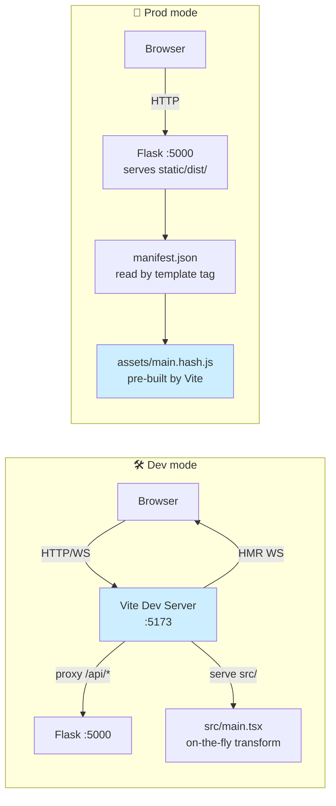
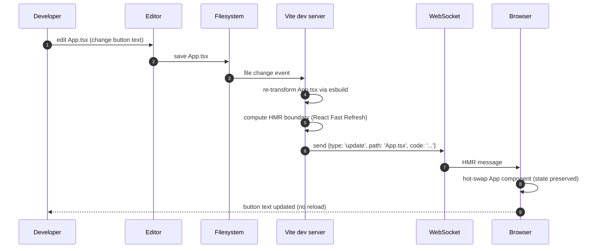
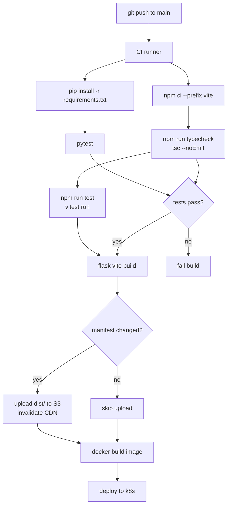

# Flask-Vite

#flask #frontend #vite #esm #hmr #react #vue #svelte #build-pipeline

> [!info] Modern Vite integration for Flask — replaces Flask-Assets/webpack
> **Flask-Vite** is a thin Flask wrapper around [Vite](https://vitejs.dev/), the next-generation frontend build tool. It serves your JS/CSS through Vite's **dev server with Hot Module Replacement (HMR)** during development, and through bundled, hashed, tree-shaken static files in production. Supports React, Vue, Svelte, Solid, Preact, Lit, and any other framework Vite supports.

Think of Flask-Vite as a **modern espresso machine** next to Flask-Assets' drip coffee maker. The drip maker (Flask-Assets) brews one pot at a time, slowly, in the back office — fine for simple CSS/JS but weak for espresso (modern ESM, JSX, TypeScript). The espresso machine (Vite) grinds fresh, brews single cups on demand, and during development it can re-brew your cup mid-sip without you setting it down (HMR). Flask-Vite is the barista who knows how to operate the espresso machine *and* how to take orders from Flask templates.

---

## 1. Overview & Metaphor

### The problem with Flask-Assets in 2024

Flask-Assets (built on `webassets`) was designed when "frontend" meant jQuery + Bootstrap + a handful of `.js` files. Modern frontend looks nothing like that:

| Modern frontend need | Flask-Assets | Vite |
|---|---|---|
| ES module `import` graph | ❌ no — flat file list | ✅ native |
| Tree-shaking unused code | ❌ no | ✅ Rollup under the hood |
| TypeScript / JSX / TSX | ⚠️ via external Babel | ✅ native via esbuild |
| Hot Module Replacement | ❌ no (full page reload) | ✅ instant, per-module |
| Per-module CSS (`Button.module.css`) | ❌ no | ✅ native |
| Code-splitting / dynamic imports | ❌ no | ✅ native |
| Framework SFCs (`.vue`, `.svelte`, `.jsx`) | ⚠️ painful | ✅ one-liner plugin |
| Source maps | ⚠️ partial | ✅ first-class |
| Dev server with TLS | ⚠️ manual | ✅ native |

Vite was built by the Vue team to fix exactly these gaps, and it's now the most popular build tool across React, Vue, Svelte, and Solid communities.

### What Flask-Vite does

1. **`Vite(app)`** — registers a `vite` Jinja helper.
2. **Dev mode**: `` emits `<script type="module" src="http://localhost:5173/@vite/client">` (the HMR client) + `<script type="module" src="http://localhost:5173/src/main.tsx">` (your entry).
3. **Prod mode**: reads `manifest.json` (built by `vite build`) and emits hashed, tree-shaken `<script>` and `<link>` tags pointing at `/static/dist/assets/main.<hash>.js`.
4. Provides a CLI: `flask vite build`, `flask vite serve`, `flask vite init`.

### What Flask-Vite does NOT do

| Concern | Who handles it |
|---|---|
| React/Vue/Svelte themselves | You install via npm |
| Backend API routes | Flask itself |
| TypeScript type checking | `tsc --noEmit` in CI |
| Linting / formatting | ESLint, Prettier |
| Testing | Vitest, Jest, Playwright |
| CSS pre-processors | Vite (built-in SCSS, Less, Stylus) |
| Image optimisation | Vite + `vite-plugin-imagemin` |
| Old IE 11 support | ❌ not by Vite (use legacy build) |

> [!tip] The metaphor
> Flask-Vite is a **plug-and-play power strip**. You don't replace your Flask app or your React app — you plug both into the strip, and the strip handles routing electricity (assets) between them. In dev, electricity flows from Vite's dev server (with HMR live wires). In prod, electricity flows from pre-built static files in `/static/dist/`. Your templates just say "give me the entry script" and Flask-Vite handles the wiring.

---

## 2. Installation

### 2.1 Python side

```bash
(venv) $ pip install Flask-Vite
```

| Package | Version | Notes |
|---|---|---|
| Flask | 3.0.x | Compatible with 2.x and 3.x |
| Flask-Vite | 0.4.x | Thin wrapper |

### 2.2 Node side

You need Node.js 18+ and npm (or pnpm/yarn):

```bash
$ node --version
v20.11.0

# Create the Vite project structure inside your Flask app
$ cd my-flask-app
$ npm create vite@latest vite -- --template react-ts
# (or: --template vue, --template svelte, --template vanilla-ts)
```

Or, if you have an existing Vite project, just initialise npm:

```bash
$ npm init -y
$ npm install -D vite @vitejs/plugin-react typescript
```

### 2.3 Project layout

```
my-flask-app/
├── app/                          # Flask backend
│   ├── __init__.py
│   ├── routes.py
│   └── templates/
│       └── index.html            # Flask Jinja template
├── vite/                         # Vite frontend
│   ├── package.json
│   ├── vite.config.ts
│   ├── tsconfig.json
│   ├── index.html                # Vite entry (optional, for SPA)
│   └── src/
│       ├── main.tsx              # entry point
│       ├── App.tsx
│       └── components/
├── app/static/dist/              # built assets (gitignored, built in CI)
└── run.py
```

> [!warning] Flask-Vite package naming
> There are two PyPI packages with similar names: `Flask-Vite` (lowercase, by Miguel Grinberg's community) and `flask_vite` (different authors). Check which one you actually pip-installed — they have slightly different APIs. This note assumes the more common `Flask-Vite` style; both work the same way conceptually.

---

## 3. Configuration

### 3.1 The `vite.config.ts`

```typescript
// vite/vite.config.ts
import { defineConfig } from "vite";
import react from "@vitejs/plugin-react";
import path from "path";

export default defineConfig({
  root: path.resolve(__dirname),                // vite/ folder
  plugins: [react()],
  build: {
    outDir: path.resolve(__dirname, "../app/static/dist"),
    emptyOutDir: true,
    manifest: "manifest.json",                  // Flask-Vite reads this
    rollupOptions: {
      input: path.resolve(__dirname, "src/main.tsx"),
    },
  },
  server: {
    port: 5173,
    // Proxy API calls to Flask during dev
    proxy: {
      "/api": {
        target: "http://127.0.0.1:5000",
        changeOrigin: true,
        secure: false,
      },
    },
  },
});
```

### 3.2 Flask config

```python
# config.py
class Config:
    VITE_DEV_MODE = False               # production
    VITE_MANIFEST_PATH = "dist/manifest.json"
    VITE_BASE_URL = "/static"           # prefix for built assets

class DevelopmentConfig(Config):
    VITE_DEV_MODE = True
    VITE_DEV_SERVER = "http://localhost:5173"
```

| Key | Default | Description |
|---|---|---|
| `VITE_DEV_MODE` | `False` | If True, emit dev-server URLs (`http://localhost:5173/...`). If False, read `manifest.json` and emit hashed prod URLs. |
| `VITE_DEV_SERVER` | `http://localhost:5173` | Vite dev server origin. |
| `VITE_MANIFEST_PATH` | `dist/manifest.json` | Path (relative to `app.static_folder`) to Vite's built manifest. |
| `VITE_BASE_URL` | `/static` | URL prefix for prod assets. |
| `VITE_VITE_BASE` | `/` | Vite's `base` config — useful when serving under a sub-path. |

### 3.3 Initialising the extension

```python
# extensions.py
from flask_vite import Vite

vite = Vite()

def init_app(app):
    app.config.from_object("config.DevelopmentConfig")
    vite.init_app(app)
```

---

## 4. Basic Usage

### 4.1 A minimal React + Flask example

```python
# app/__init__.py
from flask import Flask, render_template
from flask_vite import Vite

app = Flask(__name__)
app.config["VITE_DEV_MODE"] = True    # use False in production
Vite(app)

@app.route("/")
def index():
    return render_template("index.html", user={"name": "Alice"})
```

```html
<!-- app/templates/index.html -->
<!doctype html>
<html>
<head>
  <meta charset="utf-8">
  <title>Flask + Vite + React</title>
  
</head>
<body>
  <div id="root" data-user="{{ user|tojson }}"></div>
  
</body>
</html>
```

```typescript
// vite/src/main.tsx
import React from "react";
import { createRoot } from "react-dom/client";
import App from "./App";

const root = document.getElementById("root")!;
const user = JSON.parse(root.dataset.user || "{}");

createRoot(root).render(<React.StrictMode><App user={user} /></React.StrictMode>);
```

```typescript
// vite/src/App.tsx
import { useState } from "react";
import "./App.css";

export default function App({ user }: { user: { name: string } }) {
  const [count, setCount] = useState(0);
  return (
    <div className="App">
      <h1>Hello, {user.name}!</h1>
      <button onClick={() => setCount(c => c + 1)}>Clicked {count} times</button>
    </div>
  );
}
```

### 4.2 What the template emits (dev mode)

```html
<link rel="stylesheet" href="http://localhost:5173/src/main.tsx">
<script type="module" src="http://localhost:5173/@vite/client"></script>
<script type="module" src="http://localhost:5173/src/main.tsx"></script>
```

The `@vite/client` script opens a WebSocket to Vite's dev server. When you save `App.tsx`, Vite sends an HMR update over the WebSocket and React Fast Refresh swaps the component **without losing state** — no full page reload.

### 4.3 What the template emits (prod mode)

After `vite build`, `app/static/dist/manifest.json` looks like:

```json
{
  "src/main.tsx": {
    "file": "assets/main.a1b2c3d4.js",
    "src": "src/main.tsx",
    "isEntry": true,
    "css": ["assets/main.e5f6g7h8.css"],
    "imports": ["assets/vendor.i9j0k1l2.js"]
  }
}
```

The `` tag reads the manifest and emits:

```html
<link rel="modulepreload" href="/static/dist/assets/vendor.i9j0k1l2.js">
<link rel="stylesheet" href="/static/dist/assets/main.e5f6g7h8.css">
<script type="module" src="/static/dist/assets/main.a1b2c3d4.js"></script>
```

### 4.4 Dev vs prod pipeline



---

## 5. Intermediate Patterns

### 5.1 Vue integration

```bash
$ npm create vite@latest vite -- --template vue-ts
```

```typescript
// vite/vite.config.ts
import { defineConfig } from "vite";
import vue from "@vitejs/plugin-vue";

export default defineConfig({
  plugins: [vue()],
  build: {
    outDir: "../app/static/dist",
    manifest: "manifest.json",
  },
});
```

```typescript
// vite/src/main.ts
import { createApp } from "vue";
import App from "./App.vue";

const app = createApp(App);
app.mount("#root");
```

### 5.2 Svelte integration

```bash
$ npm create vite@latest vite -- --template svelte-ts
```

Same Flask config; just `` reads `manifest.json` regardless of framework.

### 5.3 The CLI

```bash
# Initialise a new Vite project inside your Flask app
(venv) $ flask vite init --template react-ts

# Start Vite dev server in background
(venv) $ flask vite serve
# (or just: cd vite && npm run dev)

# Build for production
(venv) $ flask vite build
# Equivalent to: cd vite && npm run build
```

### 5.4 Code-splitting with dynamic imports

```typescript
// vite/src/App.tsx
import { lazy, Suspense } from "react";

const Dashboard = lazy(() => import("./pages/Dashboard"));
const Settings  = lazy(() => import("./pages/Settings"));

export default function App() {
  return (
    <Suspense fallback={<p>Loading…</p>}>
      <Dashboard />
      <Settings />
    </Suspense>
  );
}
```

Vite emits separate chunks (`Dashboard.<hash>.js`, `Settings.<hash>.js`); the browser loads them on demand. Flask-Vite's manifest reader handles `<link rel="modulepreload">` automatically.

### 5.5 Mixing with Flask-Assets (legacy migration)

```python
# extensions.py
from flask_vite import Vite
from flask_assets import Environment, Bundle

Vite(app)  # modern JS/CSS via Vite

assets = Environment(app)
assets.register("legacy_css",
    Bundle("scss/legacy/*.scss", filters="pyscss,cssmin",
           output="gen/legacy.%(version)s.css"))
```

```html
<link rel=stylesheet href="{{ ASSET_URL }}">

```

Migrate one bundle at a time; when all are Vite, remove Flask-Assets.

---

## 6. Advanced Usage

### 6.1 Per-route entry points

```typescript
// vite.config.ts
rollupOptions: {
  input: {
    main:    path.resolve(__dirname, "src/main.tsx"),
    admin:   path.resolve(__dirname, "src/admin.tsx"),
    landing: path.resolve(__dirname, "src/landing.tsx"),
  },
}
```

```python
# Custom Jinja helper
from flask_vite import Vite

class MultiEntryVite(Vite):
    def script_for(self, entry: str):
        return self._manifest_url(entry)

app.jinja_env.globals["vite_entry"] = vite.script_for
```

```html

  <script type="module" src="{{ vite_entry('admin') }}"></script>

```

### 6.2 Vite dev server with HTTPS

```typescript
// vite.config.ts
server: {
  https: {
    key: fs.readFileSync("dev-key.pem"),
    cert: fs.readFileSync("dev-cert.pem"),
  },
  port: 5173,
}
```

```python
app.config["VITE_DEV_SERVER"] = "https://localhost:5173"
```

Required for testing Secure cookies, Service Workers, or WebRTC locally.

### 6.3 Manifest-driven asset URLs in JSON

```python
from flask import jsonify
from flask_vite import Vite

@app.get("/api/manifest")
def manifest():
    return jsonify({
        "main": vite.asset_url("src/main.tsx"),
        "admin": vite.asset_url("src/admin.tsx"),
    })
```

Useful for micro-frontends where a shell app fetches sub-app entry URLs.

### 6.4 The build-time HMR flow



### 6.5 Conditional configuration

```typescript
// vite.config.ts — load env vars from .env
import { defineConfig, loadEnv } from "vite";

export default defineConfig(({ mode }) => {
  const env = loadEnv(mode, process.cwd(), "");
  return {
    define: {
      "import.meta.env.VITE_API_URL": JSON.stringify(
        env.VITE_API_URL || (mode === "development" ? "http://localhost:5000" : "")
      ),
    },
    build: { manifest: "manifest.json", outDir: "../app/static/dist" },
  };
});
```

---

## 7. Common Pitfalls & Troubleshooting

| Symptom | Likely cause | Fix |
|---|---|---|
| Dev: 404 on `/src/main.tsx` | Vite dev server not running, or wrong port | `cd vite && npm run dev`, check port matches `VITE_DEV_SERVER`. |
| Prod: 404 on `/static/dist/assets/main.hash.js` | `vite build` not run, or `outDir` mismatch | Run `flask vite build`; verify `outDir` points at Flask's `static_folder/dist`. |
| HMR not working (full page reload) | React Fast Refresh plugin not installed | `npm i -D @vitejs/plugin-react`; ensure plugin is in `vite.config.ts`. |
| CSS not loaded | Forgot `` in template | Add it in `<head>`; Flask-Vite won't auto-inject. |
| `manifest.json not found` | `VITE_MANIFEST_PATH` wrong or build skipped | Path is relative to `app.static_folder`; run build before deploy. |
| CORS errors in dev | API calls bypassing the proxy | Use relative URLs (`/api/users`) so Vite proxies them. |
| Cookie not sent in dev | `withCredentials` not set, or different origin | Add `credentials: 'include'` to fetch; set CORS `allow_credentials=True`. |
| Old hash in cached HTML | CDN cached old HTML pointing at old hash | Invalidate CDN HTML; or use short TTL on HTML, long TTL on assets. |
| Multiple React versions | `npm link` or duplicate installs | `npm ls react`; dedupe with `npm dedupe`. |
| TypeScript errors block build | esbuild strips types without checking | Run `tsc --noEmit` in CI separately. |

> [!bug] Vite dev server + Flask's `app.run()` ordering
> Vite must be running **before** Flask serves the page in dev. Otherwise `` emits `http://localhost:5173/...` URLs that 404. Use a Procfile (`web: flask run`, `vite: cd vite && npm run dev`) or `honcho start`.

> [!warning] `manifest.json` is regenerated on every build
> The hash in `assets/main.<hash>.js` changes whenever `main.tsx` (or its imports) change. Cache the HTML for short TTLs (5 min) and the assets forever (1 year immutable). Don't hard-code the hash anywhere.

---

## 8. Best Practices

1. **Build in CI, not on the server.** Run `flask vite build` in your CI pipeline; copy `app/static/dist/` into the Docker image. Never run `vite build` on a production server.
2. **Pin `package-lock.json`.** Reproducible builds across dev/CI/prod.
3. **Use a separate `vite/` folder.** Don't mix `package.json` with Flask's `requirements.txt`.
4. **Proxy `/api` in dev.** Avoid CORS entirely during local development.
5. **Set `emptyOutDir: true`** but make sure `outDir` is *only* the dist folder — Vite will wipe it.
6. **Use TypeScript.** Vite's DX with TS is excellent; you get type-safe imports.
7. **Run `tsc --noEmit` in CI.** Vite uses esbuild (fast, no type checking) — type errors slip through otherwise.
8. **Cache assets forever.** Hashed filenames make `Cache-Control: public, max-age=31536000, immutable` safe.
9. **Preload critical chunks.** Vite emits `<link rel="modulepreload">` automatically; don't strip it.
10. **Audit bundle size.** `vite build --report` or `rollup-plugin-visualizer` to spot bloat.

### Bundle hygiene targets

| Asset | Budget | Tools |
|---|---|---|
| Initial JS | < 200 KB gz | code-split, dynamic import |
| Initial CSS | < 30 KB gz | CSS modules, purge unused |
| Per-route lazy chunk | < 50 KB gz | `React.lazy` |
| Vendor chunk | separate | `manualChunks` in rollup |

---

## 9. Integration with Other Extensions

### 9.1 [[Flask-Assets]] (migration)

Migrate bundle-by-bundle:

```python
# Phase 1: Vite handles JS, Flask-Assets handles legacy CSS
Vite(app)
assets = Environment(app)
assets.register("legacy_css", Bundle("scss/legacy/*.scss", filters="pyscss,cssmin", output="gen/legacy.css"))

# Phase 2: Move legacy CSS to Vite
# Remove Flask-Assets entirely
```

### 9.2 [[Flask-Compress]]

Vite emits uncompressed files; let Flask-Compress gzip them on the wire (or pre-compress with Brotli in CI):

```python
from flask_vite import Vite
from flask_compress import Compress

Vite(app)
Compress(app)
```

Make sure `application/javascript` and `text/css` are in `COMPRESS_MIMETYPES`.

### 9.3 [[Flask-Babel]] (i18n in JS)

Compile Flask-Babel translations to JSON, import in Vite:

```python
# app/api/i18n.py
from flask import jsonify, Blueprint
from flask_babel import get_translations

bp = Blueprint("i18n", __name__)

@bp.get("/api/i18n/<locale>.json")
def catalog(locale):
    """Serve Babel translations as JSON for the frontend."""
    t = get_translations()
    return jsonify({
        msg: t.gettext(msg) for msg in t._catalog
        if isinstance(msg, str) and msg != ""
    })
```

```typescript
// vite/src/i18n.ts
const locale = navigator.language.split("-")[0];
const catalog = await fetch(`/api/i18n/${locale}.json`).then(r => r.json());
export function _(s: string) { return catalog[s] || s; }
```

### 9.4 [[Flask-Login]] + JWT cookies

For SPA auth, configure Vite to send cookies:

```typescript
// vite/src/api.ts
export async function api(path: string, opts: RequestInit = {}) {
  return fetch(path, {
    ...opts,
    credentials: "include",   // send Flask-Login cookie
    headers: { "Content-Type": "application/json", ...opts.headers },
  });
}
```

### 9.5 [[Flask-SocketIO]]

Mount Socket.IO client via Vite:

```bash
$ npm install socket.io-client
```

```typescript
// vite/src/realtime.ts
import { io } from "socket.io-client";
const socket = io({ transports: ["websocket"] });
socket.on("connect", () => console.log("WS connected"));
```

### 9.6 [[Flask-Caching]] for the manifest

Cache the parsed manifest across requests to avoid reading JSON on every render:

```python
from flask_caching import Cache
cache = Cache(app)

@cache.cached(timeout=3600, key_prefix="vite_manifest")
def load_manifest():
    with open(manifest_path) as f:
        return json.load(f)
```

---

## 10. Real-World Example: Flask + React + TypeScript SPA

### Project layout

```
my-app/
├── app/
│   ├── __init__.py
│   ├── api.py
│   ├── auth.py
│   ├── models.py
│   └── templates/
│       └── index.html
├── vite/
│   ├── package.json
│   ├── vite.config.ts
│   ├── tsconfig.json
│   └── src/
│       ├── main.tsx
│       ├── App.tsx
│       ├── api.ts
│       ├── pages/
│       │   ├── Dashboard.tsx
│       │   ├── Login.tsx
│       │   └── Settings.tsx
│       └── styles/
│           └── App.css
├── app/static/dist/   (built by Vite)
└── run.py
```

### Backend

```python
# app/__init__.py
from flask import Flask, render_template, jsonify, request
from flask_vite import Vite
from flask_cors import CORS
from flask_login import LoginManager, login_required, current_user

def create_app():
    app = Flask(__name__, static_folder="static")
    app.config.from_object("config.Config")
    Vite(app)
    CORS(app, supports_credentials=True)
    login = LoginManager(app)

    @app.route("/")
    @app.route("/dashboard")
    @app.route("/settings")
    def spa():
        # All routes return the same shell; React Router handles the rest
        return render_template("index.html", user=current_user if current_user.is_authenticated else None)

    @app.route("/api/me")
    @login_required
    def me():
        return jsonify({"id": current_user.id, "name": current_user.name})

    return app
```

### Template

```html
<!-- app/templates/index.html -->
<!doctype html>
<html lang="en">
<head>
  <meta charset="utf-8">
  <meta name="viewport" content="width=device-width, initial-scale=1">
  <title>Flask + Vite + React</title>
  
</head>
<body>
  <div id="root"
       data-user="{{ user|tojson if user else 'null' }}"
       data-csrf="{{ csrf_token() }}"></div>
  
</body>
</html>
```

### Vite config

```typescript
// vite/vite.config.ts
import { defineConfig } from "vite";
import react from "@vitejs/plugin-react";
import path from "path";

export default defineConfig({
  root: __dirname,
  plugins: [react()],
  resolve: {
    alias: { "@": path.resolve(__dirname, "src") },
  },
  build: {
    outDir: path.resolve(__dirname, "../app/static/dist"),
    emptyOutDir: true,
    manifest: "manifest.json",
    sourcemap: true,
    rollupOptions: {
      output: {
        manualChunks: {
          vendor: ["react", "react-dom", "react-router-dom"],
        },
      },
    },
  },
  server: {
    port: 5173,
    proxy: {
      "/api": "http://127.0.0.1:5000",
      "/static": "http://127.0.0.1:5000",
    },
  },
});
```

### CI/CD pipeline



### Production deployment

```dockerfile
# Dockerfile (multi-stage)
FROM node:20-slim AS frontend
WORKDIR /vite
COPY vite/package*.json ./
RUN npm ci
COPY vite/ ./
RUN npm run build

FROM python:3.12-slim AS backend
WORKDIR /app
COPY requirements.txt .
RUN pip install -r requirements.txt
COPY app/ ./app/
COPY --from=frontend /vite/../app/static/dist ./app/static/dist
CMD ["gunicorn", "app:create_app()", "--bind", "0.0.0.0:8000"]
```

---

## 11. References

- **Vite official docs**: <https://vitejs.dev/>
- **Vite GitHub**: <https://github.com/vitejs/vite>
- **Flask-Vite (PyPI)**: <https://pypi.org/project/Flask-Vite/>
- **@vitejs/plugin-react**: <https://github.com/vitejs/vite-plugin-react>
- **@vitejs/plugin-vue**: <https://github.com/vitejs/vite-plugin-vue>
- **Rollup manual chunks**: <https://rollupjs.org/configuration-options/#output-manualchunks>
- **Migration from webpack**: <https://vitejs.dev/guide/migration.html>
- Companion notes: [[Flask-Assets]] (legacy predecessor), [[Flask-Compress]] (gzip the output), [[Flask-Babel]] (i18n strings inside JS), [[Performance-Optimization]] (where Vite fits in the perf budget), [[Production-Deployment]] (Docker multi-stage build).

> [!quote] Evan You (Vite creator)
> "Vite aims to provide a development experience that's fast out of the box, with no configuration needed for the common case, but a flexible plugin system for the unusual ones."
