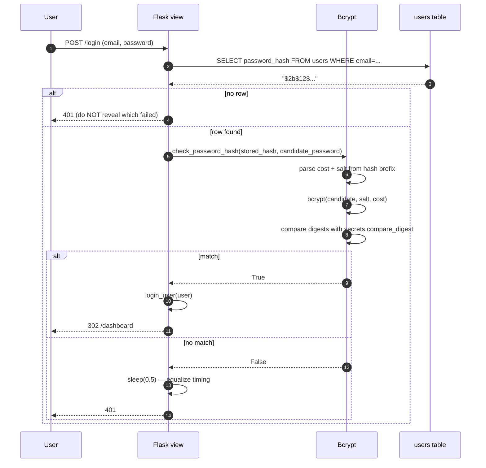
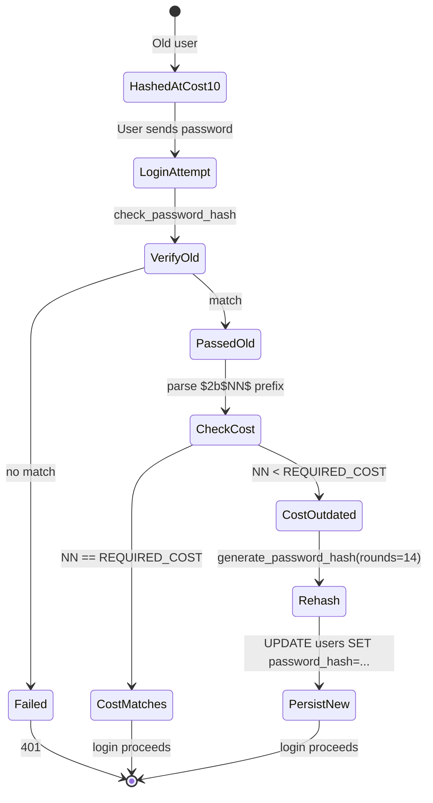
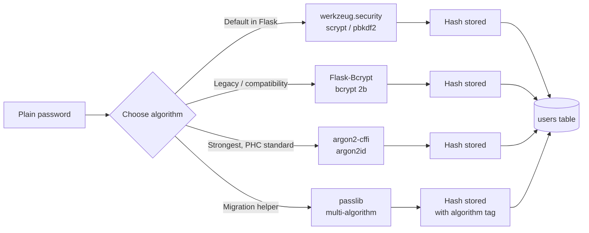
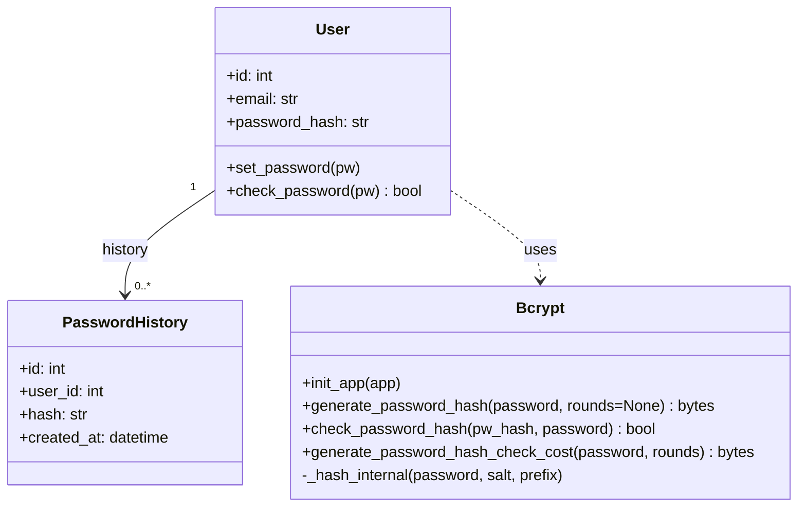
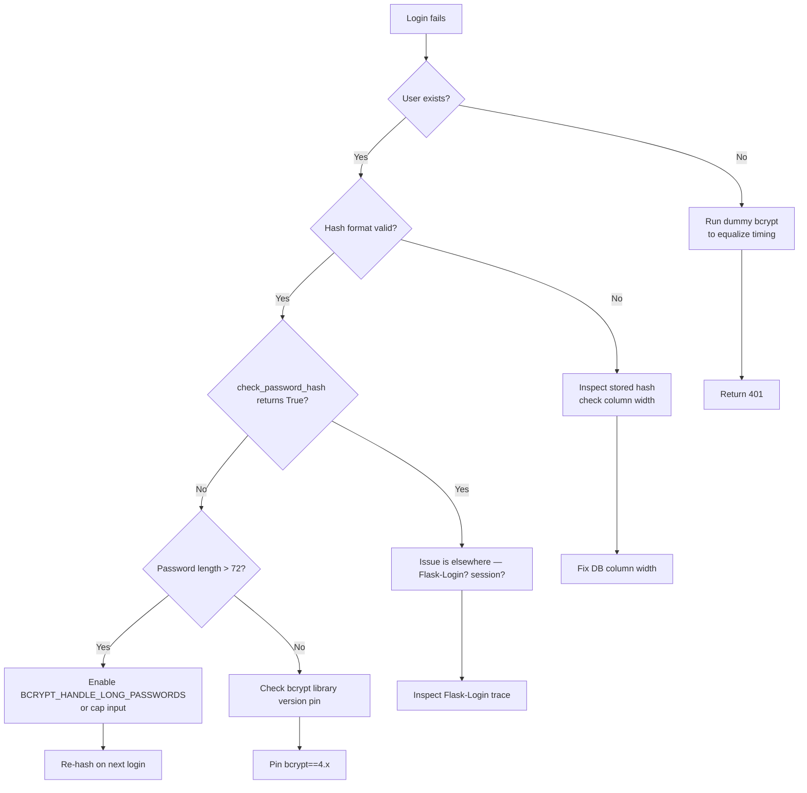
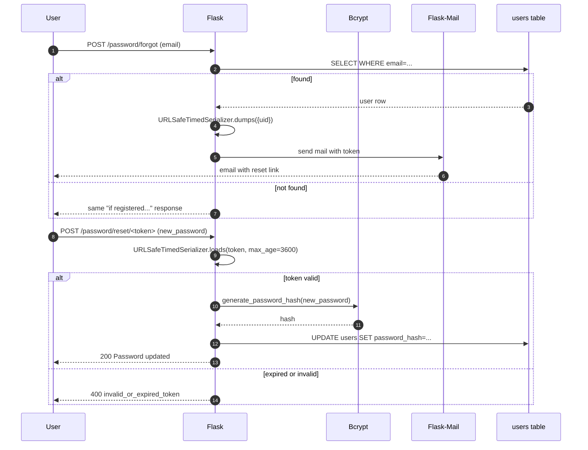

# Flask-Bcrypt

#flask #security #password #bcrypt #hashing #authentication #owasp

> [!info] Password hashing extension that wraps the `bcrypt` library for Flask
> **Flask-Bcrypt** provides a thin Flask-friendly wrapper around the [`bcrypt`](https://pypi.org/project/bcrypt/) library. It exposes two essential helpers — `generate_password_hash(password)` and `check_password_hash(pw_hash, password)` — that let you store user passwords as **salted, slow-hashed digests** instead of plaintext or fast hashes (MD5, SHA-1, SHA-256).

Think of Flask-Bcrypt as a **paper shredder for passwords**. Once the user's password goes through `generate_password_hash`, the original is destroyed and what's left is a long string of confetti. You can't reconstruct the password from the confetti — you can only feed a *candidate* password through the same shredder and check whether the resulting confetti matches. Because the shredder is intentionally slow (by a factor of ~10,000× compared to SHA-256), an attacker who steals your database has to spend serious money and time guessing passwords.

---

## 1. Overview & Metaphor

### Why hash passwords at all?

If you store passwords in plaintext, a database leak = instant credential exposure for every user. People reuse passwords — a breach on your site becomes a breach on their email, bank, and GitHub. Hashing ensures that even with the database, the attacker has to **brute-force each password individually**.

| Storage | Cost of breach |
|---|---|
| Plaintext | Instant compromise of all accounts |
| MD5 / SHA-1 | Seconds per password on a GPU |
| SHA-256 | Minutes per password on a GPU |
| bcrypt (cost 12) | ~250 ms per guess on a CPU; years for a weak password |
| argon2id (m=64MB, t=3, p=1) | Even slower; resistant to GPU/ASIC attacks |

### Why bcrypt specifically?

bcrypt was designed in 1999 by Niels Provos and David Mazières specifically for password hashing. Its key innovations:

1. **Salt is built in.** Every hash includes a random salt — no two hashes of the same password look alike.
2. **Work factor is tunable.** The `cost` parameter (4–31) doubles the computation time per increment. As hardware gets faster, you can re-hash on next login.
3. **Algorithm is slow by design.** bcrypt uses Blowfish keyed by the password — it's intentionally ~4 KB of memory and many iterations.
4. **Output is self-describing.** The hash string contains the cost, salt, and digest: `$2b$12$<salt><digest>` — so you can verify against any hash without storing the parameters separately.

### Why not just `werkzeug.security`?

Flask ships with `werkzeug.security.generate_password_hash` / `check_password_hash`. Since Werkzeug 2.3, the default algorithm is **scrypt** (a modern, memory-hard KDF). Before 2.3, it was **pbkdf2-sha256**. Both are good, but:

| Feature | `werkzeug.security` | Flask-Bcrypt | `argon2-cffi` |
|---|---|---|---|
| Algorithm | scrypt / pbkdf2 (Werkzeug version dependent) | bcrypt | argon2id |
| Memory-hard | scrypt: yes; pbkdf2: no | No (4 KB only) | Yes (tunable to GB) |
| Tunable cost | Yes (iterations) | Yes (cost 4–31) | Yes (m, t, p) |
| Bundled with Flask | ✅ | ❌ (separate install) | ❌ |
| PHC string format | Partial | bcrypt format | ✅ standard |
| Best for | Quick prototypes | Compatibility with existing bcrypt hashes | New apps wanting the strongest defense |

> [!tip] The metaphor
> Flask-Bcrypt is a **slow paper shredder with a tunable blade count**. The `cost` parameter is the blade count: each increment doubles how long the shredder takes. You want it slow enough that an attacker with a stolen database loses interest, but fast enough that legitimate logins don't keep users waiting.

### What Flask-Bcrypt does NOT do

| Concern | Who handles it |
|---|---|
| User model / DB storage | [[Flask-SQLAlchemy]] |
| Session management | [[Flask-Login]] |
| Password reset emails | [[Flask-Mail]] + [[Flask-Security-Too]] |
| Brute-force rate limiting | [[Flask-Limiter]] |
| Email verification | [[Flask-Security-Too]] or [[Flask-User]] |
| 2FA / TOTP | [[Flask-Security-Too]] |

---

## 2. Installation

```bash
(venv) $ pip install flask-bcrypt
```

| Package | Version |
|---|---|
| Flask | 3.0.x |
| flask-bcrypt | 1.0.1 |
| bcrypt (transitive) | 4.x |

The `bcrypt` C extension ships as a wheel — no compilation needed on Linux, macOS, or Windows for CPython 3.8+.

> [!warning] Flask-Bcrypt is largely unmaintained
> The last release on PyPI was 1.0.1 in 2020. It still works because the underlying `bcrypt` library maintains backward compatibility. For new projects, you have two options:
> 1. Use `werkzeug.security` (built into Flask, modern scrypt default).
> 2. Use `bcrypt` directly (no Flask wrapper needed): `bcrypt.hashpw(pw.encode(), bcrypt.gensalt(rounds=12))`.
> Flask-Bcrypt remains useful for understanding the pattern and for legacy codebases.

---

## 3. Configuration

Flask-Bcrypt reads its work factor from `app.config`:

| Config key | Default | Description |
|---|---|---|
| `BCRYPT_LOG_ROUNDS` | `12` | The bcrypt cost factor. Range 4–31. Each increment doubles the time. |
| `BCRYPT_HASH_PREFIX` | `"2b"` | Hash prefix. `"2b"` is the modern standard; `"2a"` and `"2y"` are legacy PHP-compatible variants. |
| `BCRYPT_HANDLE_LONG_PASSWORDS` | `False` | bcrypt truncates passwords >72 bytes. Setting `True` pre-hashes with SHA-256 to support long passwords. ⚠️ See note below. |

### Choosing `BCRYPT_LOG_ROUNDS`

The bcrypt cost parameter is logarithmic — cost N means 2^N iterations. On modern hardware:

| Cost | Time per hash (typical) | Use case |
|---|---|---|
| 4 | ~1 ms | Unit tests only |
| 10 | ~50 ms | Legacy / compatibility |
| 12 | ~250 ms | **Recommended baseline (2024)** |
| 14 | ~1 s | High-security apps (banking, identity providers) |
| 16 | ~4 s | Too slow for login UX without async workers |

> [!danger] `BCRYPT_HANDLE_LONG_PASSWORDS=True` is debatable
> bcrypt silently truncates passwords at 72 bytes. The "fix" pre-hashes the password with SHA-256 base64, which gives 44-byte strings — but reduces entropy to 256 bits (still fine) and changes the hash format (so you can't migrate easily). Modern advice: cap user password length at 64 characters in your validator and leave `BCRYPT_HANDLE_LONG_PASSWORDS=False`. Users with 1Password 100-character passphrases will need to trim.

### Constructor

```python
from flask import Flask
from flask_bcrypt import Bcrypt

app = Flask(__name__)
app.config["BCRYPT_LOG_ROUNDS"] = 12
bcrypt = Bcrypt(app)
```

Or with the application factory pattern:

```python
bcrypt = Bcrypt()

def create_app():
    app = Flask(__name__)
    app.config["BCRYPT_LOG_ROUNDS"] = 12
    bcrypt.init_app(app)
    return app
```

---

## 4. Basic Usage

### 4.1 Hashing and checking

```python
# app.py
from flask import Flask
from flask_bcrypt import Bcrypt

app = Flask(__name__)
app.config["BCRYPT_LOG_ROUNDS"] = 12
bcrypt = Bcrypt(app)

pw_hash = bcrypt.generate_password_hash("correct horse battery staple")
print(pw_hash)
# b'$2b$12$8r3VK2vUy1cQ4bW6pZq2r.5p5xq2vUy1cQ4bW6pZq2r.5p5xq2vUy1cQ'

ok = bcrypt.check_password_hash(pw_hash, "correct horse battery staple")
print(ok)   # True

bad = bcrypt.check_password_hash(pw_hash, "Tr0ub4dor&3")
print(bad)  # False
```

The hash is `bytes`; you'll usually decode it to a `str` for DB storage:

```python
pw_hash_str = bcrypt.generate_password_hash(password).decode("utf-8")
user.password_hash = pw_hash_str
db.session.commit()
```

### 4.2 Verification flow



### 4.3 User model integration

```python
# app/models/user.py
from app.extensions import db, bcrypt

class User(db.Model):
    __tablename__ = "users"
    id            = db.Column(db.Integer, primary_key=True)
    email         = db.Column(db.String(255), unique=True, nullable=False)
    password_hash = db.Column(db.String(60), nullable=False)   # bcrypt hashes are 60 chars
    created_at    = db.Column(db.DateTime, server_default=db.func.now())

    def set_password(self, password: str) -> None:
        if len(password) < 12:
            raise ValueError("Password must be at least 12 characters")
        self.password_hash = bcrypt.generate_password_hash(password).decode("utf-8")

    def check_password(self, password: str) -> bool:
        return bcrypt.check_password_hash(self.password_hash, password)
```

### 4.4 Login view

```python
# app/views/auth.py
import time
from flask import Blueprint, request, jsonify, session
from flask_login import login_user
from app.models import User
from app.extensions import db

auth_bp = Blueprint("auth", __name__)

@auth_bp.route("/login", methods=["POST"])
def login():
    data = request.get_json() or {}
    user = User.query.filter_by(email=data.get("email", "")).first()

    # ALWAYS run bcrypt, even for nonexistent users — equalizes timing
    dummy_hash = "$2b$12$" + "x" * 53
    ok = (
        user.check_password(data.get("password", ""))
        if user
        else bcrypt.check_password_hash(dummy_hash, data.get("password", ""))
    )

    if not user or not ok:
        time.sleep(0.2)   # extra brake on failed logins
        return jsonify({"error": "invalid_credentials"}), 401

    login_user(user)
    session.regenerate()   # defeat session fixation
    return jsonify({"id": user.id, "email": user.email})
```

> [!warning] Don't reveal which field was wrong
> Returning `"user not found"` vs `"wrong password"` lets attackers enumerate valid emails. Always return the same error and run bcrypt regardless so timing doesn't leak either.

### 4.5 Hash anatomy

```
$2b$12$8r3VK2vUy1cQ4bW6pZq2r.5p5xq2vUy1cQ4bW6pZq2r.5p5xq2vUy1cQ
^^ ^^ ^^^^^^^^^^^^^^^^^^^^^^ ^^^^^^^^^^^^^^^^^^^^^^^^^^^^^^^^^^^^
|| || 22-char base64 salt    31-char base64 digest
|| cost factor (2^12 = 4096 iterations)
algorithm version (2b = modern)
```

The salt is embedded in the hash, so you don't need a separate column.

---

## 5. Intermediate Patterns

### 5.1 Hash upgrades (cost rotation)

When you raise `BCRYPT_LOG_ROUNDS` from 10 to 14, existing hashes still verify (bcrypt reads the cost from the hash). But you want to **upgrade** the stored hash on next successful login:

```python
# app/models/user.py
REQUIRED_COST = 14

def check_password_and_upgrade(self, password: str) -> bool:
    if not bcrypt.check_password_hash(self.password_hash, password):
        return False

    # Inspect the cost from the stored hash
    stored_cost = int(self.password_hash.split("$")[2])
    if stored_cost < REQUIRED_COST:
        self.password_hash = bcrypt.generate_password_hash(
            password, rounds=REQUIRED_COST
        ).decode("utf-8")
        db.session.commit()
    return True
```

This is a "lazy upgrade" — you don't have to reset everyone's password; the upgrade happens silently as users log in.

### 5.2 Hash upgrade state machine



### 5.3 Asynchronous hashing with Celery

A bcrypt cost-14 hash takes ~1 second — too slow for a synchronous request handler. Move it to a background worker (see [[Celery]]):

```python
# app/tasks/auth.py
from celery import shared_task
from app.extensions import bcrypt, db
from app.models import User

@shared_task
def set_password_async(user_id: int, password: str):
    user = db.session.get(User, user_id)
    if not user:
        return
    user.password_hash = bcrypt.generate_password_hash(password, rounds=14).decode()
    db.session.commit()

# View
@app.route("/register", methods=["POST"])
def register():
    user = User(email=request.json["email"], password_hash="")  # placeholder
    db.session.add(user)
    db.session.commit()
    set_password_async.delay(user.id, request.json["password"])
    return jsonify({"id": user.id}), 202   # Accepted
```

The user can't log in until the hash is written — show a "setting up your account" page or email them when ready.

### 5.4 Preventing password reuse

```python
# app/models/user.py
from datetime import datetime, timedelta

class User(db.Model):
    ...
    password_history = db.relationship("PasswordHistory", backref="user",
                                       cascade="all, delete-orphan")

    def set_password(self, password: str) -> None:
        # Reject if matches any of last 5 passwords
        for entry in self.password_history[-5:]:
            if bcrypt.check_password_hash(entry.hash, password):
                raise ValueError("Password was used recently — pick a new one")
        new_hash = bcrypt.generate_password_hash(password).decode()
        self.password_history.append(PasswordHistory(hash=new_hash))
        self.password_hash = new_hash
```

This caps password history at N entries; users can't cycle back to a previously compromised password.

### 5.5 Email-based password reset

The reset flow is: user requests reset → server generates a time-limited signed token → emails it → user clicks → server verifies token → user enters new password → server hashes & stores.

```python
from itsdangerous import URLSafeTimedSerializer
from flask import current_app, url_for
from flask_mail import Mail, Message

mail = Mail(app)

def make_reset_token(user_id: int) -> str:
    s = URLSafeTimedSerializer(current_app.config["SECRET_KEY"], salt="pw-reset")
    return s.dumps({"uid": user_id})

def verify_reset_token(token: str, max_age: int = 3600) -> int | None:
    s = URLSafeTimedSerializer(current_app.config["SECRET_KEY"], salt="pw-reset")
    try:
        data = s.loads(token, max_age=max_age)
    except Exception:
        return None
    return data["uid"]

@app.route("/password/forgot", methods=["POST"])
def forgot():
    user = User.query.filter_by(email=request.form["email"]).first()
    if user:
        token = make_reset_token(user.id)
        msg = Message("Reset your password",
                      recipients=[user.email],
                      body=url_for("auth.reset", token=token, _external=True))
        mail.send(msg)
    # Always return the same response whether or not the email exists
    return "If that email is registered, you'll receive a reset link."
```

For a full-featured version of this flow with templates, rate limiting, and revocation, see [[Flask-Security-Too]] or [[Flask-User]].

---

## 6. Advanced Usage

### 6.1 Comparison with other hashing libraries



### 6.2 Direct bcrypt usage (without Flask-Bcrypt)

If you skip Flask-Bcrypt and use the `bcrypt` library directly:

```python
import bcrypt

def hash_password(password: str, rounds: int = 12) -> str:
    salt = bcrypt.gensalt(rounds=rounds)
    return bcrypt.hashpw(password.encode("utf-8"), salt).decode("utf-8")

def verify_password(password: str, hashed: str) -> bool:
    return bcrypt.checkpw(password.encode("utf-8"), hashed.encode("utf-8"))
```

Two differences from Flask-Bcrypt:
1. You pass `bytes`, not `str`.
2. You must `try/except ValueError` for invalid hashes; Flask-Bcrypt catches and returns `False`.

### 6.3 Migrating from MD5/SHA to bcrypt

```python
import hashlib

def check_password(self, password: str) -> bool:
    stored = self.password_hash

    # Legacy SHA-256 hash (no salt)
    if len(stored) == 64 and "$" not in stored:
        candidate = hashlib.sha256(password.encode()).hexdigest()
        if secrets.compare_digest(stored, candidate):
            # Upgrade on the fly
            self.password_hash = bcrypt.generate_password_hash(password).decode()
            db.session.commit()
            return True
        return False

    # Modern bcrypt
    return bcrypt.check_password_hash(stored, password)
```

This "shadow upgrade" pattern works because you only need the plaintext at the moment of successful login — which you have, because the user just typed it.

### 6.4 Class diagram



### 6.5 Work factor benchmarking

```python
# scripts/bench_bcrypt.py
import time
from flask_bcrypt import Bcrypt
from flask import Flask

app = Flask(__name__)
bcrypt = Bcrypt(app)

for cost in range(10, 17):
    start = time.perf_counter()
    bcrypt.generate_password_hash("benchmark-password", rounds=cost)
    elapsed = time.perf_counter() - start
    print(f"cost={cost:2d}  {elapsed*1000:7.1f} ms/hash")
```

Sample output on an M1 laptop:

```
cost=10     52.3 ms/hash
cost=11    103.8 ms/hash
cost=12    207.1 ms/hash
cost=13    415.6 ms/hash
cost=14    830.2 ms/hash
cost=15   1662.5 ms/hash
cost=16   3325.0 ms/hash
```

Aim for **200–500 ms per hash** at the upper limit of acceptable login latency. For most apps that's cost 12 or 13.

### 6.6 Bcrypt + Pepper

A "pepper" is a server-side secret added to the password before hashing. It defends against an attacker who has the database but not the application code.

```python
import hmac
import os
from flask import current_app

def hash_with_pepper(password: str) -> str:
    pepper = current_app.config["PEPPER"].encode()
    peppered = hmac.new(pepper, password.encode(), hashlib.sha256).hexdigest()
    return bcrypt.generate_password_hash(peppered).decode()
```

> [!warning] Pepper complicates rotation
> If your pepper leaks, you must re-hash every password. Store the pepper in a secrets manager (AWS Secrets Manager, HashiCorp Vault), not in source control. Most apps skip pepper and rely on the database being inaccessible to attackers without the application code path.

---

## 7. Common Pitfalls & Troubleshooting

| Symptom | Likely cause | Fix |
|---|---|---|
| `ValueError: Invalid salt` on `check_password_hash` | Stored hash is corrupted, truncated, or from a different bcrypt version. | Inspect the hash: it should match `^\$2[aby]\$\d{2}\$[./A-Za-z0-9]{53}$`. |
| `password must be 72 bytes` exception | Password >72 bytes and `BCRYPT_HANDLE_LONG_PASSWORDS=False`. | Cap input length at 64 chars in the form validator, OR enable the pre-hash flag. |
| Login takes >1 second | `BCRYPT_LOG_ROUNDS` too high for your hardware. | Benchmark and lower to 12 (or 13 for high-security apps). |
| Hashes work locally but fail on prod | Different `bcrypt` major version (e.g., 3.x vs 4.x). | Pin `bcrypt==4.x` in `requirements.txt`. |
| Same password → different hashes | That's correct! Bcrypt salts each hash randomly. | Use `check_password_hash`, never string equality. |
| `check_password_hash` returns `False` even with correct password | Hash was stored as `bytes` (b'...') but `check_password_hash` expects `str`. | `.decode("utf-8")` before storing in DB. |
| Database column truncated | bcrypt hashes are 60 chars; if you used `String(40)` it's cut. | Use `String(60)` or `String(255)` to be safe. |
| Timing attack possible on `check_password_hash` | Bcrypt's check uses constant-time comparison internally. ✅ | No fix needed; just ensure you don't `return stored == candidate` elsewhere. |
| 1000 requests/sec grinding `/login` | No rate limiting. | Add `[[Flask-Limiter]]` at `5/minute` per IP on `/login`. |
| Existing MD5 hashes after migration | You didn't add shadow upgrade logic. | Implement §6.3. |

### Troubleshooting flowchart



---

## 8. Best Practices

1. **Use cost 12 minimum** as of 2024. Benchmark annually and bump up.
2. **Cap password length** at 64–72 bytes to avoid bcrypt's truncation edge case.
3. **Don't enforce ridiculous complexity rules.** NIST 800-63B recommends checking against a breach list (haveibeenpwned API) instead.
4. **Run bcrypt even on nonexistent users** to prevent timing-based user enumeration.
5. **Add `[[Flask-Limiter]]`** on `/login` — bcrypt slows brute force but doesn't stop it.
6. **Lazy-upgrade old hashes.** On successful login, re-hash at the current cost if the stored hash is at a lower cost.
7. **Never log passwords.** Even in debug. Even temporarily.
8. **Never expose password hash to users.** Don't return it in API responses, even for "my profile" pages.
9. **Use `secrets.compare_digest`** for any string comparison of secrets — though bcrypt's `checkpw` already does this internally.
10. **For new apps in 2024, prefer argon2id** via `argon2-cffi`. bcrypt remains a solid, well-understood choice.
11. **Migrate from MD5/SHA using shadow upgrade.** Don't force users to reset passwords — quietly upgrade on next login.
12. **Store hashes in a `String(60)` or `String(255)` column.** Don't use `Text` (no length check) or `String(40)` (truncated).
13. **Set the pepper in env, not in code.** If you use a pepper, rotate via secrets manager.
14. **Test the migration.** Write a unit test that creates a user with an old hash and verifies they can still log in and get upgraded.

---

## 9. Integration with Other Extensions

### [[Flask-Login]]

The most common pairing — Flask-Login manages the session, Flask-Bcrypt verifies the credential:

```python
from flask_login import UserMixin, LoginManager, login_user
from flask_bcrypt import Bcrypt

bcrypt = Bcrypt(app)
login_manager = LoginManager(app)

class User(UserMixin, db.Model):
    ...

@login_manager.user_loader
def load_user(uid):
    return db.session.get(User, int(uid))

@app.route("/login", methods=["POST"])
def login():
    user = User.query.filter_by(email=request.form["email"]).first()
    if user and user.check_password(request.form["password"]):
        login_user(user)
        return redirect("/dashboard")
    return "Invalid credentials", 401
```

### [[Flask-Security-Too]]

Flask-Security-Too **replaces** Flask-Bcrypt with its own `hash_password` / `verify_password` based on `passlib`. You don't need both — Flask-Security-Too handles hashing internally and supports bcrypt, argon2, and others via `SECURITY_PASSWORD_HASH`.

### [[Flask-User]]

Flask-User also bundles its own password hashing. Don't mix with Flask-Bcrypt.

### [[Flask-HTTPAuth]]

When using HTTP Basic auth (see [[Flask-HTTPAuth]]), your `verify_password` callback should call `bcrypt.check_password_hash`:

```python
@basic_auth.verify_password
def verify(username, password):
    user = User.query.filter_by(email=username).first()
    if user and user.check_password(password):
        return username
    return None
```

### [[Flask-Limiter]]

Always rate-limit the login endpoint:

```python
from flask_limiter import Limiter
limiter = Limiter(key_func=lambda: request.remote_addr)

@app.route("/login", methods=["POST"])
@limiter.limit("5/minute")
def login(): ...
```

This caps the attacker to 5 guesses per minute per IP — bcrypt's 250 ms per check then makes 5 guesses take 1.25 seconds, which is unbearable at scale.

### [[Celery]]

For cost-14+ hashes, push the work to Celery as shown in §5.3.

---

## 10. Real-World Example: Registration, Login, and Password Reset

A complete auth subsystem built on Flask-Bcrypt + [[Flask-Login]] + [[Flask-Mail]].

```python
# app/extensions.py
from flask_sqlalchemy import SQLAlchemy
from flask_login import LoginManager
from flask_bcrypt import Bcrypt
from flask_mail import Mail
from flask_limiter import Limiter
from flask_limiter.util import get_remote_address

db = SQLAlchemy()
login_manager = LoginManager()
bcrypt = Bcrypt()
mail = Mail()
limiter = Limiter(key_func=get_remote_address, default_limits=["1000/hour"])
```

```python
# app/models/user.py
from datetime import datetime
from itsdangerous import URLSafeTimedSerializer
from flask import current_app
from app.extensions import db, bcrypt

class User(db.Model):
    __tablename__ = "users"
    id            = db.Column(db.Integer, primary_key=True)
    email         = db.Column(db.String(255), unique=True, nullable=False)
    password_hash = db.Column(db.String(60), nullable=False)
    created_at    = db.Column(db.DateTime, default=datetime.utcnow)
    is_active     = db.Column(db.Boolean, default=True)

    REQUIRED_COST = 12

    def set_password(self, password: str) -> None:
        if not (12 <= len(password) <= 64):
            raise ValueError("Password must be 12–64 characters")
        self.password_hash = bcrypt.generate_password_hash(
            password, rounds=self.REQUIRED_COST
        ).decode("utf-8")

    def check_password(self, password: str) -> bool:
        if not bcrypt.check_password_hash(self.password_hash, password):
            return False
        # Lazy upgrade if cost drifts
        stored_cost = int(self.password_hash.split("$")[2])
        if stored_cost < self.REQUIRED_COST:
            self.set_password(password)
            db.session.commit()
        return True

    def make_reset_token(self) -> str:
        s = URLSafeTimedSerializer(current_app.config["SECRET_KEY"], salt="pw-reset")
        return s.dumps({"uid": self.id})

    @staticmethod
    def verify_reset_token(token: str, max_age: int = 3600) -> "User | None":
        s = URLSafeTimedSerializer(current_app.config["SECRET_KEY"], salt="pw-reset")
        try:
            data = s.loads(token, max_age=max_age)
        except Exception:
            return None
        return db.session.get(User, data["uid"])
```

```python
# app/views/auth.py
import time
from flask import Blueprint, request, jsonify, current_app, url_for
from flask_login import login_user, logout_user, login_required, current_user
from itsdangerous import BadSignature, SignatureExpired
from app.extensions import db, bcrypt, mail, limiter
from app.models.user import User
from flask_mail import Message

auth_bp = Blueprint("auth", __name__)
DUMMY_HASH = "$2b$12$" + "x" * 53

@auth_bp.route("/register", methods=["POST"])
@limiter.limit("3/hour")
def register():
    data = request.get_json() or {}
    if User.query.filter_by(email=data.get("email", "")).first():
        return jsonify({"error": "email_taken"}), 409
    try:
        user = User(email=data["email"])
        user.set_password(data["password"])
    except (KeyError, ValueError) as e:
        return jsonify({"error": str(e)}), 400
    db.session.add(user)
    db.session.commit()
    return jsonify({"id": user.id}), 201

@auth_bp.route("/login", methods=["POST"])
@limiter.limit("5/minute")
def login():
    data = request.get_json() or {}
    email = data.get("email", "")
    password = data.get("password", "")
    user = User.query.filter_by(email=email).first()
    if user:
        ok = user.check_password(password)
    else:
        bcrypt.check_password_hash(DUMMY_HASH, password)  # dummy work
        ok = False
    if not ok:
        time.sleep(0.2)
        return jsonify({"error": "invalid_credentials"}), 401
    login_user(user)
    return jsonify({"id": user.id, "email": user.email})

@auth_bp.route("/logout", methods=["POST"])
@login_required
def logout():
    logout_user()
    return "", 204

@auth_bp.route("/password/forgot", methods=["POST"])
@limiter.limit("3/hour")
def forgot():
    email = (request.get_json() or {}).get("email", "")
    user = User.query.filter_by(email=email).first()
    if user:
        token = user.make_reset_token()
        msg = Message(
            "Reset your password",
            recipients=[user.email],
            body=f"Visit {url_for('auth.reset', token=token, _external=True)} to reset your password. This link expires in 1 hour.",
        )
        mail.send(msg)
    # Always return the same response
    return jsonify({"message": "If that email is registered, you'll receive a reset link."})

@auth_bp.route("/password/reset/<token>", methods=["POST"])
@limiter.limit("3/hour")
def reset(token):
    user = User.verify_reset_token(token)
    if not user:
        return jsonify({"error": "invalid_or_expired_token"}), 400
    data = request.get_json() or {}
    try:
        user.set_password(data["password"])
    except (KeyError, ValueError) as e:
        return jsonify({"error": str(e)}), 400
    db.session.commit()
    return jsonify({"message": "Password updated"})
```

### Full password reset sequence



---

## 11. References

- **PyPI**: <https://pypi.org/project/Flask-Bcrypt/>
- **GitHub**: <https://github.com/maxcountryman/flask-bcrypt>
- **bcrypt library**: <https://pypi.org/project/bcrypt/>
- **Original bcrypt paper**: Provos & Mazières, "A Future-Adaptable Password Scheme" (USENIX 1999) — <https://www.usenix.org/legacy/events/usenix99/provos/provos_html/>
- **OWASP Password Storage Cheat Sheet**: <https://cheatsheetseries.owasp.org/cheatsheets/Password_Storage_Cheat_Sheet.html>
- **NIST SP 800-63B**: Digital Identity Guidelines — <https://pages.nist.gov/800-63-3/sp800-63b.html>
- **Alternatives**:
  - `argon2-cffi`: <https://pypi.org/project/argon2-cffi/>
  - `passlib`: <https://passlib.readthedocs.io/>
  - `werkzeug.security` (built into Flask): <https://werkzeug.palletsprojects.com/en/stable/utils/#werkzeug.security>
- **Related notes**: [[Security-Best-Practices]] · [[Flask-Login]] · [[Flask-Security-Too]] · [[Flask-User]] · [[Flask-HTTPAuth]] · [[Flask-Limiter]] · [[Flask-Mail]] · [[Celery]]
