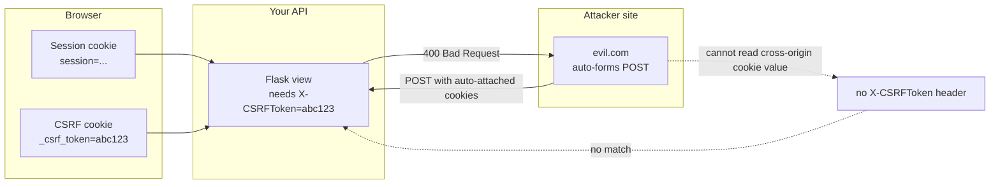
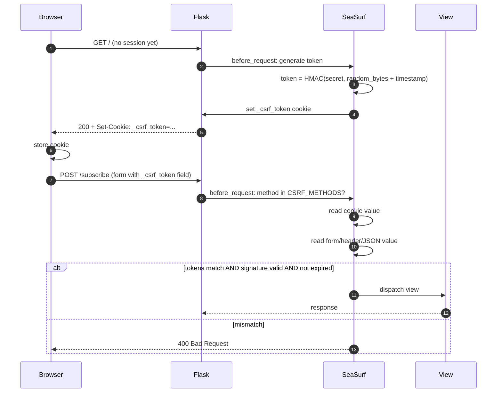
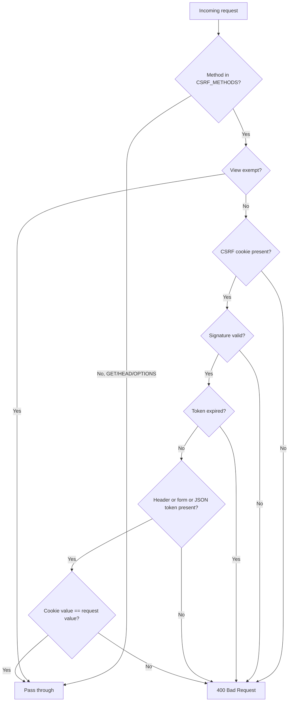
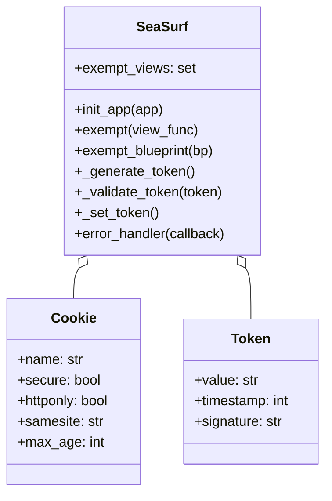
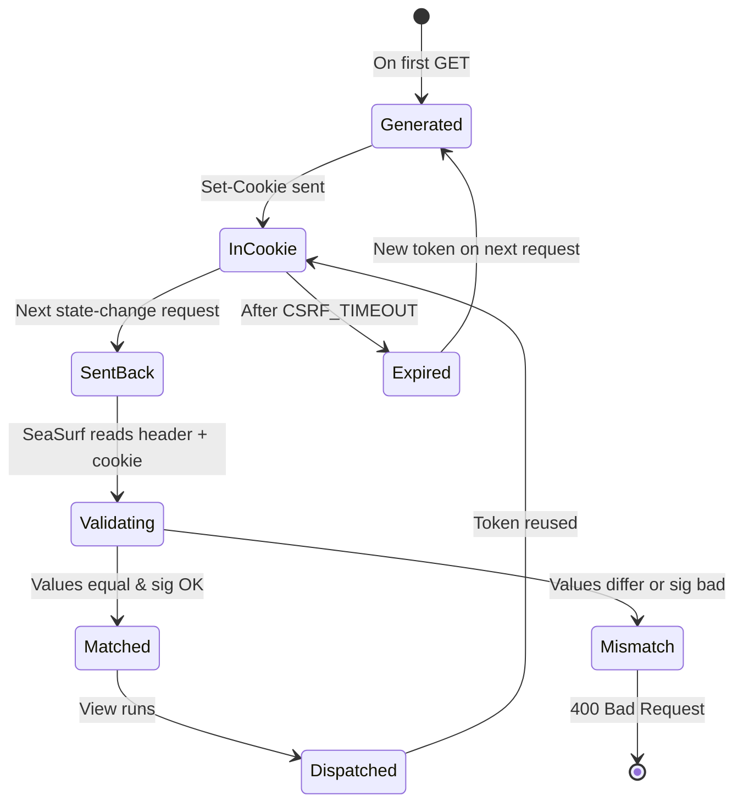
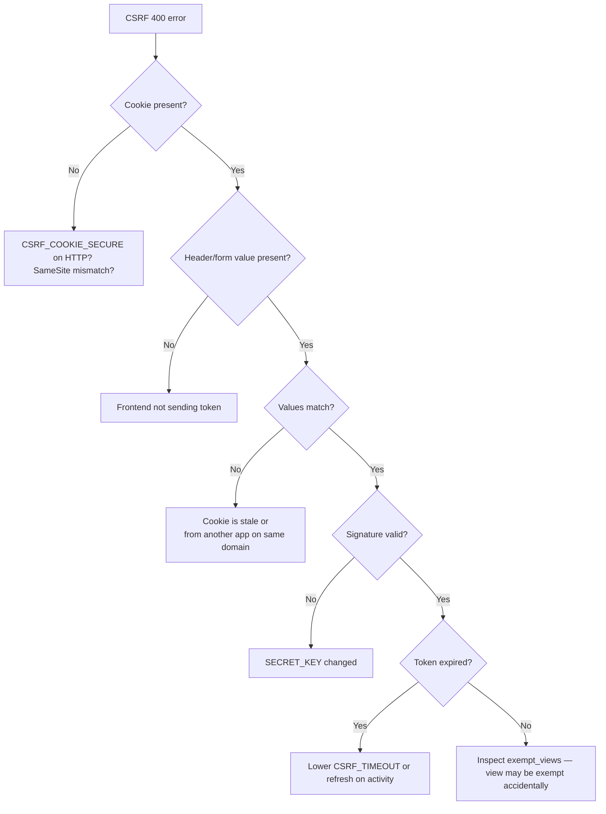
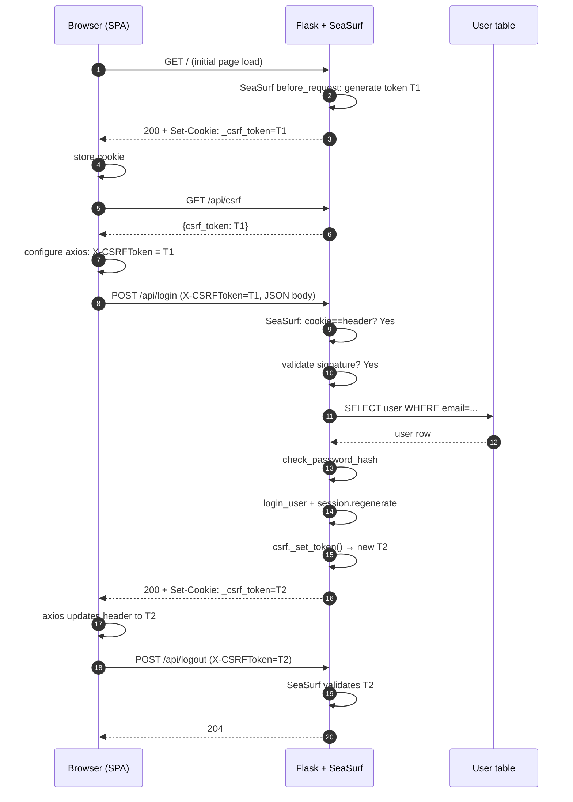

# Flask-SeaSurf

#flask #security #csrf #cookies #owasp #forms

> [!info] CSRF protection for Flask via the double-submit cookie pattern
> **Flask-SeaSurf** is a CSRF defense extension that wraps every state-changing HTTP request (POST, PUT, PATCH, DELETE) in a token check. Unlike [[Flask-WTF]]'s `CSRFProtect` — which is form-bound and requires you to render `{{ form.csrf_token }}` — SeaSurf uses the **double-submit cookie pattern**: a CSRF token is stored in a cookie and echoed in either a form field, an `X-CSRFToken` header, or a JSON body field. If the two don't match, the request is rejected with `400 Bad Request`.

Think of SeaSurf as a **ticket stub validator at a turnstile**. To pass through (i.e., to perform a state-changing action), you have to present both halves of a torn ticket: one half was handed to you earlier in a cookie, the other half you must produce yourself from the request body or a header. An attacker on another site can present *their* ticket stub (the cookie is sent automatically by the browser), but they cannot produce *your* matching half because they don't know the value until you tell them.

---

## 1. Overview & Metaphor

### Why CSRF protection at all?

Cross-Site Request Forgery (CSRF) exploits the browser's automatic credential attachment. If you are logged into `bank.com` and visit `evil.com` which contains:

```html
<form action="https://bank.com/transfer" method="POST">
    <input name="to" value="attacker">
    <input name="amount" value="10000">
</form>
<script>document.forms[0].submit()</script>
```

…the browser happily sends your `bank.com` session cookie along with the forged POST. The server, seeing a valid session, executes the transfer. CSRF defenses break this attack by requiring a value the attacker site cannot know.

### Three defenses, ranked

| Defense | How | Limits |
|---|---|---|
| `SameSite=Lax` cookie | Browser refuses to send cookie on cross-site POST | Default in modern browsers; not all flows respect it (top-level GETs still send) |
| CSRF token in session | Server stores secret in session, compares to form value | Strong; requires session (won't work for stateless API) |
| Double-submit cookie | Token stored in cookie AND required in request; values must match | State-independent; vulnerable to subdomain cookie injection unless token is HMACed |

SeaSurf implements the double-submit pattern with an **HMAC-signed token**, neutralizing the classic "attacker sets the cookie" weakness.

### How SeaSurf differs from Flask-WTF CSRFProtect

| Feature | Flask-SeaSurf | [[Flask-WTF]] `CSRFProtect` |
|---|---|---|
| Token storage | Cookie + form/header | Session (signed cookie) |
| Stateless server | ✅ works without session | ❌ requires Flask session |
| Form integration | Optional — header works for API | Tight — `{{ form.csrf_token }}` |
| Cookie name | `_csrf_token` (configurable) | `csrf_token` (uses session) |
| Exempt specific views | `@csrf.exempt` | `@csrf.exempt` |
| Best for | JSON APIs + forms mix, SPA backends | Traditional server-rendered forms |

> [!tip] The metaphor
> SeaSurf is the **two-key lock on the safe**. One key (the cookie) the browser carries automatically; the other (the header/form value) only your JavaScript knows how to send. An attacker site can present one key but never both — and the safe only opens when both keys turn together.

### The double-submit pattern



---

## 2. Installation

```bash
(venv) $ pip install flask-seasurf
```

| Package | Version |
|---|---|
| Flask | 3.0.x |
| flask-seasurf | 1.1.x |

Pure Python, no native dependencies. The HMAC signing uses Flask's `SECRET_KEY` so make sure that is set.

---

## 3. Configuration

SeaSurf reads its config from `app.config` plus the `SeaSurf(app, **kwargs)` constructor. The important keys:

| Config key | Default | Description |
|---|---|---|
| `SECRET_KEY` | (required) | Used to HMAC-sign the CSRF token. |
| `CSRF_COOKIE_NAME` | `"_csrf_token"` | Name of the CSRF cookie. |
| `CSRF_COOKIE_PATH` | `"/"` | Cookie `Path`. |
| `CSRF_COOKIE_DOMAIN` | `None` | Cookie `Domain` — set to `.example.com` for cross-subdomain. |
| `CSRF_COOKIE_SECURE` | `False` | Send cookie only over HTTPS. **Set `True` in production.** |
| `CSRF_COOKIE_HTTPONLY` | `True` | Prevent JS from reading the cookie. ⚠️ See note below. |
| `CSRF_COOKIE_SAMESITE` | `"Lax"` | Cookie `SameSite` value. |
| `CSRF_COOKIE_TIMEOUT` | `60 * 60 * 24 * 365` | Cookie max-age in seconds (1 year). |
| `CSRF_DISABLE` | `False` | Disable CSRF entirely (for tests). |
| `CSRF_TIMEOUT` | `3600` | Token validity window (1 hour). |
| `CSRF_HEADERS` | `["X-CSRFToken", "X-CSRF-Token"]` | Headers SeaSurf will read for the token. |
| `CSRF_METHODS` | `["POST", "PUT", "PATCH", "DELETE"]` | HTTP methods that require a token. |
| `CSRF_JSON` | `False` | If True, look for `_csrf_token` in JSON request bodies. |
| `CSRF_TYPE` | `"default"` | `"default"` (HMAC-signed) or `"uuid"` (random UUID). |
| `CSRF_EXEMPT_VIEWS` | `set()` | View function names exempt from CSRF. |

> [!warning] `CSRF_COOKIE_HTTPONLY=True` and the SPA pattern
> If you set `HttpOnly=True` (the default), JavaScript cannot read the cookie value to send it back as an `X-CSRFToken` header. For SPAs you have two choices:
> 1. Set `CSRF_COOKIE_HTTPONLY=False` so your JS can read the cookie and echo it in a header (more exposed but standard for double-submit).
> 2. Render the token into your HTML at page load (e.g., `<meta name="csrf-token" content="{{ csrf_token() }}">`) and have JS read it from the meta tag — this keeps `HttpOnly=True`.

### Constructor example

```python
from flask import Flask
from flask_seasurf import SeaSurf

app = Flask(__name__)
app.config["SECRET_KEY"] = "change-me"
app.config["CSRF_COOKIE_SECURE"] = True      # HTTPS only
app.config["CSRF_COOKIE_SAMESITE"] = "Lax"
app.config["CSRF_HEADERS"] = ["X-CSRFToken", "X-CSRF-Token"]
app.config["CSRF_JSON"] = True               # read JSON body _csrf_token

csrf = SeaSurf(app)
```

---

## 4. Basic Usage

### 4.1 Minimal form-based app

```python
# app.py
from flask import Flask, render_template_string, request, session
from flask_seasurf import SeaSurf

app = Flask(__name__)
app.config["SECRET_KEY"] = "dev-secret"
csrf = SeaSurf(app)

FORM = """
<!doctype html>
<html><body>
  <form method="POST">
    <input type="hidden" name="_csrf_token" value="{{ csrf_token() }}">
    <input name="email" placeholder="email">
    <button type="submit">Subscribe</button>
  </form>
</body></html>
"""

@app.route("/", methods=["GET", "POST"])
@csrf.exempt   # GET is auto-exempt anyway; POST exempted here only for demo
def index():
    if request.method == "POST":
        return f"Subscribed {request.form.get('email')}!"
    return render_template_string(FORM)

@app.route("/subscribe", methods=["POST"])
def subscribe():
    return f"Subscribed {request.form.get('email')}!"
```

The `{{ csrf_token() }}` template function is registered by SeaSurf and available in Jinja2 by default.

### 4.2 The validation sequence



### 4.3 SPA / JSON API pattern

For a single-page app talking JSON to Flask, the cleanest setup is:

```python
app.config.update(
    CSRF_COOKIE_HTTPONLY=False,    # JS must read the cookie
    CSRF_COOKIE_SECURE=True,
    CSRF_COOKIE_SAMESITE="Lax",
    CSRF_JSON=True,                # also accept JSON body
    CSRF_HEADERS=["X-CSRFToken"],
)
csrf = SeaSurf(app)
```

On the frontend (any framework):

```javascript
// On app boot, read the cookie and configure the HTTP client
function getCookie(name) {
  const m = document.cookie.match(
    new RegExp('(^|; )' + name + '=([^;]*)')
  );
  return m ? decodeURIComponent(m[2]) : null;
}

axios.defaults.headers.common['X-CSRFToken'] = getCookie('_csrf_token');
axios.defaults.withCredentials = true;   // send session cookie
```

Now every `axios.post` will automatically include the matching header.

### 4.4 Token generation: HMAC vs UUID

The default `CSRF_TYPE="default"` produces an HMAC-signed token of the form `<random>|<timestamp>|<signature>`. This is verifiable: SeaSurf can detect tampering and expiry without storing state.

`CSRF_TYPE="uuid"` produces a plain UUID4. It is shorter but is **stateless** — anyone who obtains the cookie value can forge requests. Use UUID mode only when you have other controls (e.g., `SameSite=Strict` cookies, IP binding).

### 4.5 Token validation flow



---

## 5. Intermediate Patterns

### 5.1 Exempting views

```python
# Exempt a single view
@app.route("/webhook/stripe", methods=["POST"])
@csrf.exempt
def stripe_webhook():
    # Stripe signs its own requests; we verify the Stripe-Signature header
    ...

# Exempt an entire blueprint
csrf.exempt_blueprint(webhook_bp)
```

Webhooks from external services (Stripe, GitHub, Slack) cannot send your CSRF token. They sign their own requests instead — exempt them and verify the signature yourself.

### 5.2 Exempting JSON-only APIs

For a pure JSON API where you don't want CSRF at all (because clients use Bearer tokens, not cookies), exempt the whole blueprint:

```python
api_bp = Blueprint("api", __name__, url_prefix="/api")
csrf.exempt_blueprint(api_bp)
```

But if you ever serve cookie-authenticated endpoints from the same blueprint, keep CSRF enabled and use the `Authorization: Bearer` pattern instead.

### 5.3 Conditional exemption

```python
@csrf.exempt
def view():
    ...

# Or programmatically:
csrf.exempt_views.add("app.views.public_webhook")
```

You can also subclass `SeaSurf` and override `_is_request_allowed_to_be_exempted` for fine-grained logic.

### 5.4 Custom error response

By default, SeaSurf returns a plain `400 Bad Request`. For JSON APIs:

```python
from flask import jsonify

@csrf.error_handler
def csrf_error(reason):
    return jsonify({"error": "csrf_failed", "message": reason}), 400
```

### 5.5 Token rotation

Tokens should be rotated periodically (especially after login). SeaSurf regenerates the token automatically when it expires, but you can force it:

```python
from flask import session

@app.route("/login", methods=["POST"])
def login():
    # ... verify credentials ...
    session.regenerate()   # Flask 3.x: rotate the session ID
    csrf._set_token()      # rotate the CSRF token too
    return redirect("/dashboard")
```

Rotating on login defeats **session fixation** — an attacker who planted a session cookie before login loses it.

---

## 6. Advanced Usage

### 6.1 Class diagram



### 6.2 Custom token source

If your client sends the token in a non-standard way (e.g., a custom query parameter for WebSocket upgrades), subclass SeaSurf:

```python
from flask_seasurf import SeaSurf

class CustomSeaSurf(SeaSurf):
    def _get_request_token(self):
        # Try header first, then query string for SSE/WS
        token = super()._get_request_token()
        if token:
            return token
        return request.args.get("_csrf")
```

### 6.3 Subdomain sharing

If `app.example.com` and `api.example.com` need to share the same CSRF cookie:

```python
app.config["CSRF_COOKIE_DOMAIN"] = ".example.com"
app.config["CSRF_COOKIE_SAMESITE"] = "Lax"
```

> [!danger] Subdomain trust is risky
> Any subdomain of `.example.com` can set a cookie on the parent. If you have `untrusted.example.com` (e.g., user-generated content on a sandbox subdomain), it can overwrite the CSRF cookie on `app.example.com`. Mitigate by using a separate cookie name per subdomain or by enforcing the HMAC signature.

### 6.4 State machine: token lifecycle



### 6.5 Multiple CSRF scopes

For admin and user areas with separate tokens, instantiate two SeaSurf objects:

```python
user_csrf = SeaSurf(app, cookie_name="_user_csrf")
admin_csrf = SeaSurf(app, cookie_name="_admin_csrf")

# Apply admin_csrf only to admin views via decorator
@app.route("/admin/settings", methods=["POST"])
@admin_csrf.protect
def admin_settings():
    ...
```

This is rare in practice — most apps use one token and rely on authorization checks for admin actions.

---

## 7. Common Pitfalls & Troubleshooting

| Symptom | Likely cause | Fix |
|---|---|---|
| `400 Bad Request` on every POST | Frontend isn't sending the `_csrf_token` field/header. | Inspect the request in browser devtools; ensure the cookie is set and the form/header is populated. |
| Works in Chrome, fails in Safari | Safari's stricter ITP blocks third-party cookies. If your API is on a different subdomain, Safari sees the cookie as third-party. | Use `SameSite=Lax` (or `None`+`Secure`) and serve API + frontend from the same site. |
| Tests fail with `400` | Test client doesn't have the cookie. | In tests, do a `GET` first to set the cookie, then send the token. See §10. |
| Webhook from Stripe returns 400 | Webhooks can't send your token. | `@csrf.exempt` the webhook route and verify Stripe's signature. |
| Token seems to never change | Tokens are valid for `CSRF_TIMEOUT` (1 hour default) and reused. | Lower `CSRF_TIMEOUT` or call `csrf._set_token()` after login. |
| SameSite=Lax blocks OAuth redirects | `SameSite=Strict` blocks all cross-site navigations; `Lax` allows top-level GETs. | Use `Lax` (default), not `Strict`. |
| Two CSRF cookies appear | Both SeaSurf and Flask-WTF's CSRFProtect are enabled. | Pick one. SeaSurf is double-submit; Flask-WTF uses session storage. |
| Cookie value differs from what JS reads | The cookie is set with `HttpOnly=True`. | Set `CSRF_COOKIE_HTTPONLY=False`, or render the token into a `<meta>` tag server-side. |
| Token validation passes locally but fails in prod | `SECRET_KEY` differs between instances, or token signed before deploy still in browser. | Use a stable `SECRET_KEY` from environment; let old tokens expire naturally. |

### Troubleshooting tree



---

## 8. Best Practices

1. **Always use HTTPS** with `CSRF_COOKIE_SECURE=True`. Cookies sent over HTTP can be sniffed.
2. **Set `CSRF_COOKIE_SAMESITE=Lax`** (or `Strict` if you don't need cross-site navigation).
3. **Rotate the token after login.** Defeats session fixation.
4. **Exempt only signed webhooks.** Never exempt your own form endpoints.
5. **For SPAs, prefer `HttpOnly=False` cookie + header reading.** It's the standard double-submit ergonomics.
6. **Don't put tokens in URLs.** They leak to logs and `Referer` headers.
7. **Pair with `SameSite=Lax` cookies.** Defense in depth — `SameSite` blocks most CSRF even without a token; the token is your second layer.
8. **Pair with [[Flask-Talisman]]** for `Content-Security-Policy`, which prevents the script injection that could read your CSRF cookie value.
9. **Don't share the CSRF cookie across untrusted subdomains.** Use a unique cookie per app.
10. **Test CSRF explicitly.** Add a test that POSTs without a token and asserts `400`.
11. **Use `force_https` on [[Flask-Talisman]]** to ensure tokens never travel over plain HTTP.
12. **Log CSRF failures** with the IP and user agent — repeated failures from one IP indicate an attack or a misconfigured client.

---

## 9. Integration with Other Extensions

### [[Flask-WTF]]

You should never run both SeaSurf and Flask-WTF's `CSRFProtect` — they will both try to set a cookie and both will reject. Pick one:

- **SeaSurf** if your stack includes SPAs / JSON APIs and you want the double-submit pattern.
- **Flask-WTF** if you exclusively use server-rendered WTForms (the `{{ form.csrf_token }}` integration is seamless).

### [[Flask-Login]]

After successful login, call `session.regenerate()` and `csrf._set_token()`:

```python
from flask_login import login_user
from flask import session

@app.route("/login", methods=["GET", "POST"])
def login():
    form = LoginForm()
    if form.validate_on_submit():
        user = User.query.filter_by(email=form.email.data).first()
        if user and user.check_password(form.password.data):
            login_user(user)
            session.regenerate()
            csrf._set_token()
            return redirect("/dashboard")
    return render_template("login.html", form=form)
```

### [[Flask-Talisman]]

Talisman forces `Secure` and `HttpOnly` on the session cookie, but **not** on the SeaSurf cookie — set those via SeaSurf's own config keys. Talisman's `Content-Security-Policy` prevents script injection that could read your CSRF token, so they reinforce each other.

### [[Flask-Security-Too]] and [[Flask-User]]

Both of these bundles include their own CSRF integration (Flask-Security-Too uses Flask-WTF under the hood). Do **not** add SeaSurf to a Flask-Security-Too app — you'll get double-rejection. Use SeaSurf when you're building your own auth stack from [[Flask-Login]] + [[Flask-Bcrypt]].

---

## 10. Real-World Example: SPA Backend with CSRF

A complete Flask backend that serves a Vue/React SPA. The SPA reads the CSRF cookie on boot and sends it as a header on every state-changing request.

```python
# app/__init__.py
import os
from flask import Flask, jsonify, render_template, request, session
from flask_login import LoginManager, login_user, logout_user, login_required, current_user
from flask_seasurf import SeaSurf
from flask_talisman import Talisman
from werkzeug.middleware.proxy_fix import ProxyFix

from app.models import db, User

def create_app():
    app = Flask(__name__, static_folder="../frontend/dist", static_url_path="")
    app.config.update(
        SECRET_KEY=os.environ["SECRET_KEY"],
        SQLALCHEMY_DATABASE_URI=os.environ["DATABASE_URL"],
        SESSION_COOKIE_SECURE=True,
        SESSION_COOKIE_HTTPONLY=True,
        SESSION_COOKIE_SAMESITE="Lax",
        # SeaSurf
        CSRF_COOKIE_NAME="_csrf_token",
        CSRF_COOKIE_SECURE=True,
        CSRF_COOKIE_HTTPONLY=False,        # JS must read
        CSRF_COOKIE_SAMESITE="Lax",
        CSRF_COOKIE_TIMEOUT=60 * 60 * 24,  # 1 day
        CSRF_HEADERS=["X-CSRFToken"],
        CSRF_JSON=True,
    )
    app.wsgi_app = ProxyFix(app.wsgi_app, x_for=1, x_proto=1)

    Talisman(app, force_https=True, content_security_policy={
        "default-src": "'self'",
        "script-src":  "'self'",
        "connect-src": "'self'",
        "frame-ancestors": "'none'",
    })
    csrf = SeaSurf(app)

    login_manager = LoginManager()
    login_manager.init_app(app)
    db.init_app(app)

    @login_manager.user_loader
    def load_user(uid):
        return db.session.get(User, int(uid))

    # SPA shell — serves index.html for any non-API route
    @app.route("/")
    @app.route("/<path:path>")
    def spa(path=""):
        return app.send_static_file("index.html")

    @app.route("/api/csrf", methods=["GET"])
    def get_csrf():
        # SeaSurf sets the cookie on before_request; just return the value
        return jsonify({"csrf_token": request.cookies.get("_csrf_token")})

    @app.route("/api/login", methods=["POST"])
    def api_login():
        data = request.get_json()
        user = db.session.scalar(db.select(User).where(User.email == data["email"]))
        if not user or not user.check_password(data["password"]):
            return jsonify({"error": "invalid"}), 401
        login_user(user)
        session.regenerate()
        csrf._set_token()
        return jsonify({"user": {"id": user.id, "email": user.email}})

    @app.route("/api/logout", methods=["POST"])
    @login_required
    def api_logout():
        logout_user()
        return "", 204

    @app.route("/api/me", methods=["GET"])
    @login_required
    def api_me():
        return jsonify({"id": current_user.id, "email": current_user.email})

    # Stripe webhook — exempt from CSRF, verify Stripe signature
    @app.route("/api/webhooks/stripe", methods=["POST"])
    @csrf.exempt
    def stripe_webhook():
        sig = request.headers.get("Stripe-Signature", "")
        # verify sig against STRIPE_WEBHOOK_SECRET
        return "", 204

    return app
```

### Frontend integration (Vue 3 + axios)

```javascript
// src/api.js
import axios from 'axios';

const api = axios.create({
  baseURL: '/api',
  withCredentials: true,   // send session cookie
});

function readCookie(name) {
  const m = document.cookie.match(new RegExp('(^|; )' + name + '=([^;]*)'));
  return m ? decodeURIComponent(m[2]) : null;
}

api.interceptors.request.use((config) => {
  const token = readCookie('_csrf_token');
  if (token) config.headers['X-CSRFToken'] = token;
  return config;
});

export default api;
```

### Testing CSRF explicitly

```python
# tests/test_csrf.py
import pytest

def test_post_without_token_rejected(client):
    resp = client.post("/api/login", json={"email": "a@b.c", "password": "x"})
    assert resp.status_code == 400

def test_post_with_token_accepted(client):
    # GET first to obtain the CSRF cookie
    client.get("/api/csrf")
    token = client.get_cookie("_csrf_token").value
    resp = client.post("/api/login",
                       json={"email": "a@b.c", "password": "x"},
                       headers={"X-CSRFToken": token})
    assert resp.status_code in (200, 401)  # not 400
```

### Full sequence



---

## 11. References

- **PyPI**: <https://pypi.org/project/Flask-SeaSurf/>
- **GitHub**: <https://github.com/maxcountryman/flask-seasurf>
- **OWASP CSRF Prevention Cheat Sheet**: <https://cheatsheetseries.owasp.org/cheatsheets/Cross-Site_Request_Forgery_Prevention_Cheat_Sheet.html>
- **Double-submit cookie pattern**: <https://cheatsheetseries.owasp.org/cheatsheets/Cross-Site_Request_Forgery_Prevention_Cheat_Sheet.html#double-submit-cookie>
- **Specifications**:
  - RFC 6749 — OAuth 2.0 (Bearer tokens, an alternative for APIs)
  - RFC 6265bis — Cookies and `SameSite` attribute
- **Related notes**: [[Security-Best-Practices]] · [[Flask-WTF]] · [[Flask-Talisman]] · [[Flask-Login]] · [[Flask-Bcrypt]] · [[Flask-Security-Too]] · [[Flask-User]]
