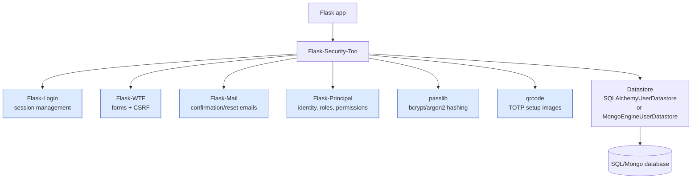
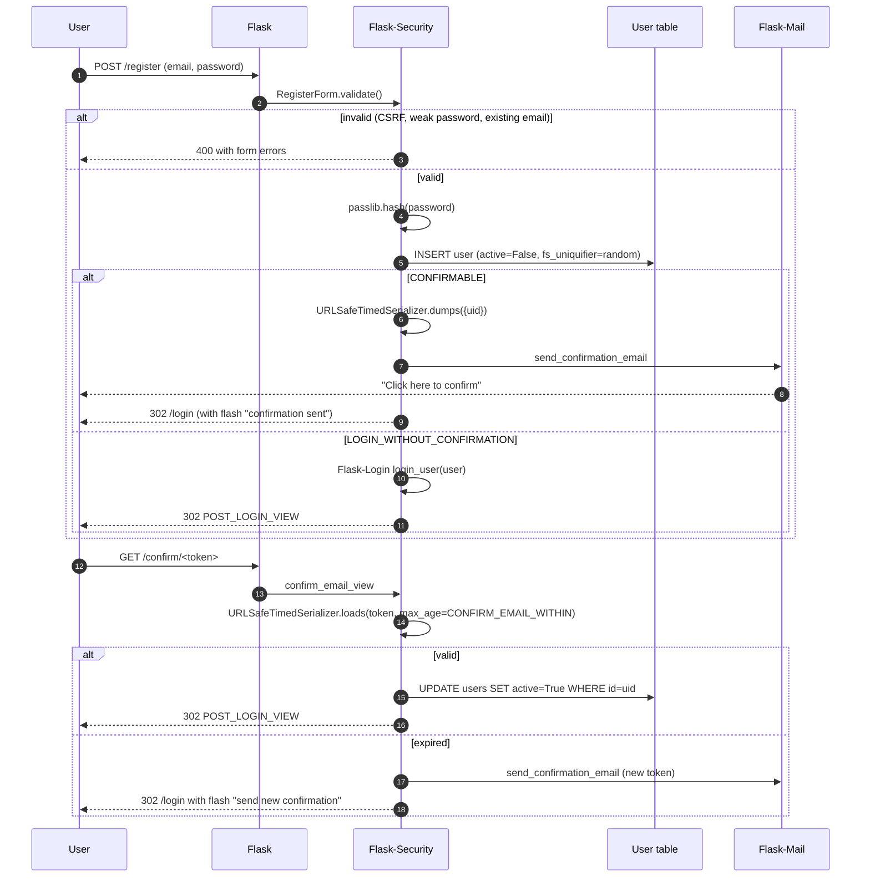
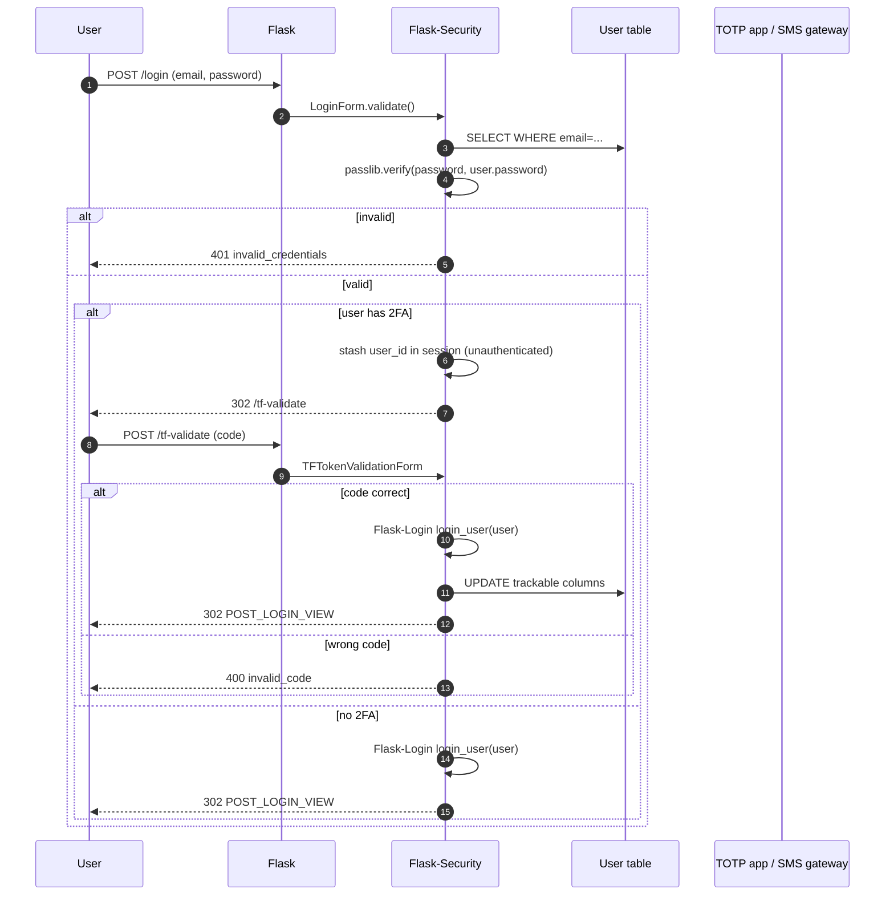
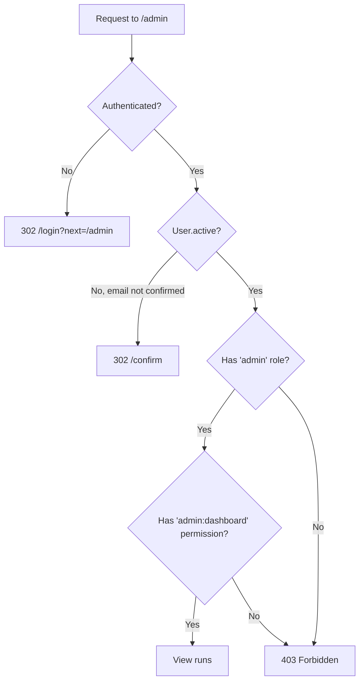
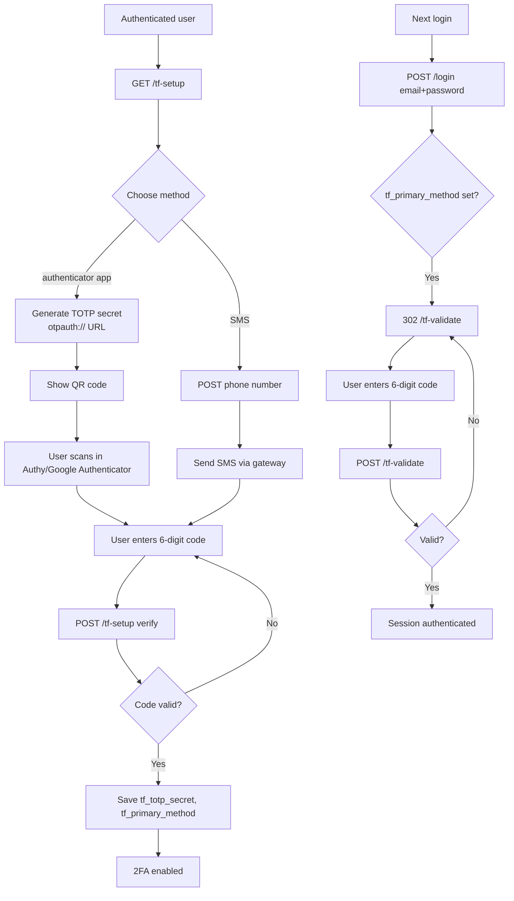
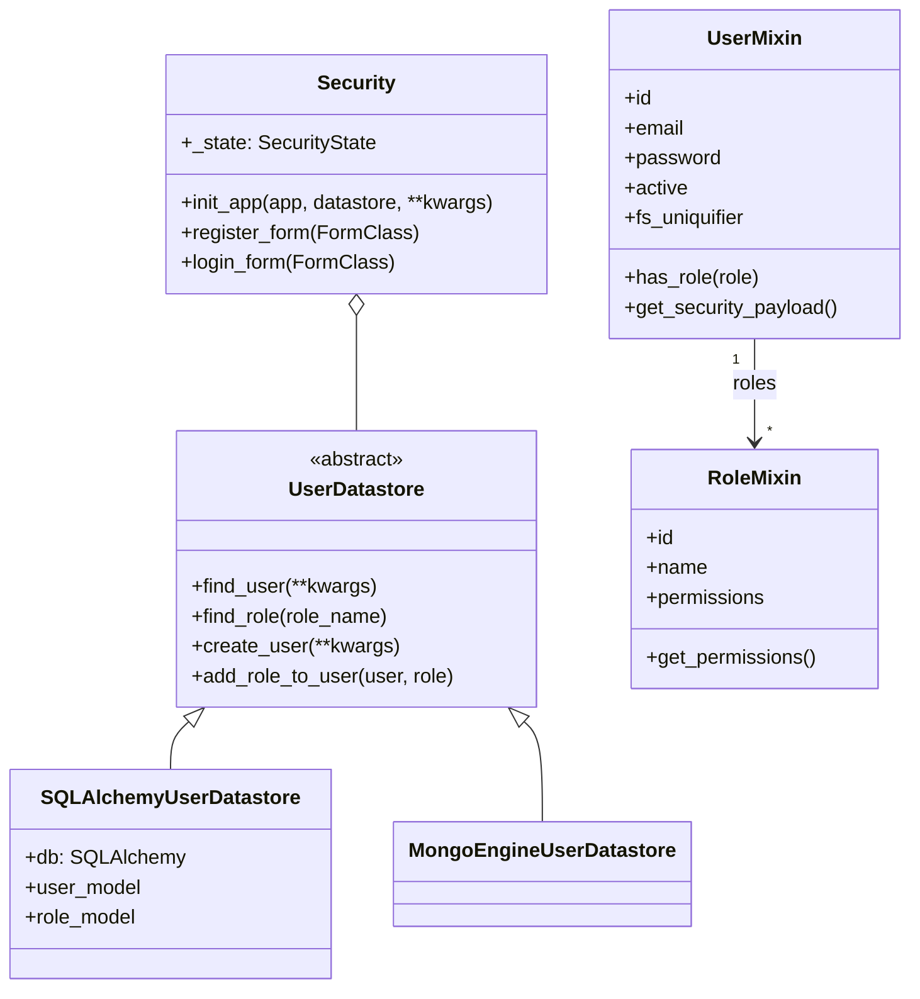
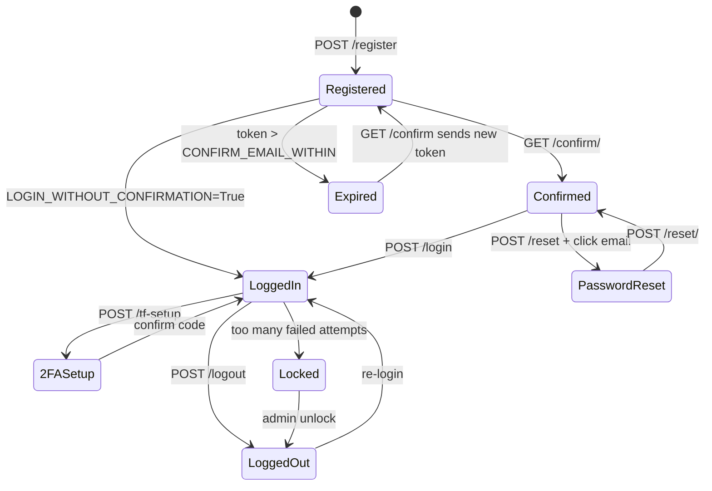
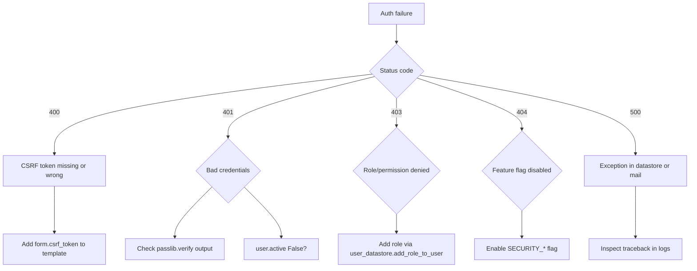
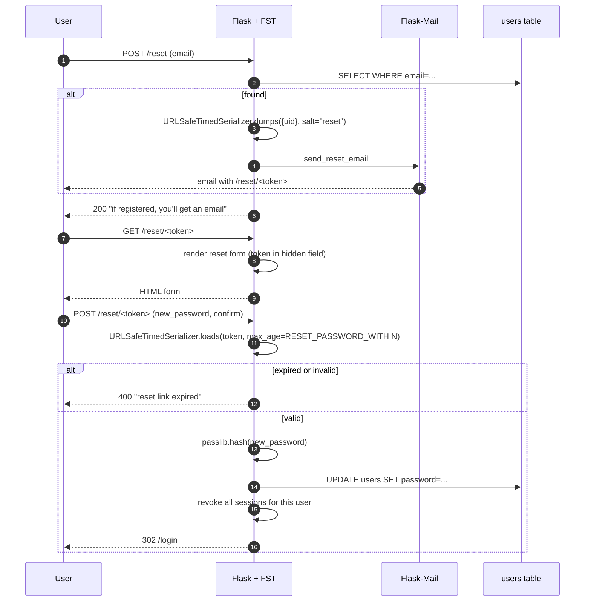
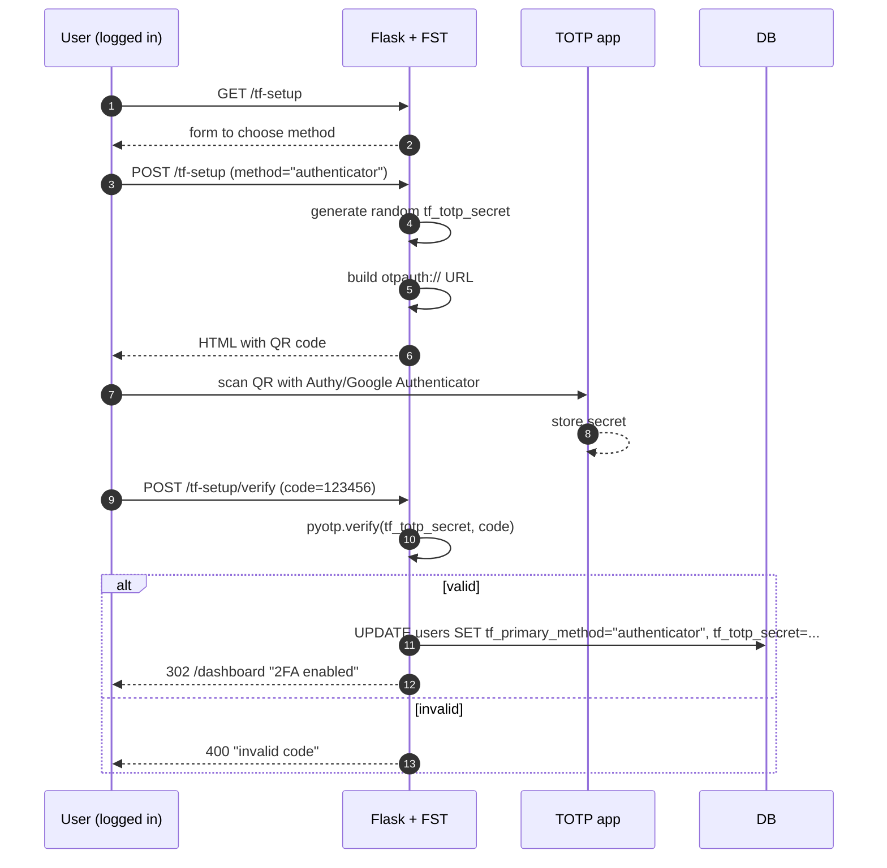

# Flask-Security-Too

#flask #authentication #authorization #security #roles #permissions #2fa #totp #oauth

> [!info] The all-in-one authentication & authorization toolkit for Flask
> **Flask-Security-Too** (FST) is the maintained successor to the original Flask-Security, which went dormant in 2017. It bundles registration, login, logout, email confirmation, password reset, password change, role-based access control, permissions, two-factor authentication (TOTP & SMS), unified sign in (username or email), WebAuthn (FIDO2), and OAuth2 login — all wired up to a SQLAlchemy or MongoEngine datastore. Under the hood it composes [[Flask-Login]], [[Flask-WTF]] (for CSRF and forms), [[Flask-Mail]] (for verification emails), [[Flask-Principal]] (for RBAC), and `passlib` (for password hashing).

Think of Flask-Security-Too as a **pre-built gatehouse with all the wiring** — turnstiles, badge readers, two-factor keypads, the lost-and-found office for forgotten passwords, and a guest sign-in desk for OAuth. You supply a User model (a SQLAlchemy table) and a `SECRET_KEY`; FST supplies the endpoints (`/login`, `/register`, `/logout`, `/confirm`, `/reset`, `/change`, `/tf-setup`, `/tf-validate`, `/us-signin`, etc.), the templates (overridable), the emails (overridable), the CSRF tokens, and the role/permission decorators.

---

## 1. Overview & Metaphor

### What FST gives you out of the box

| Endpoint | Default URL | Purpose |
|---|---|---|
| `security.register` | `/register` | Create account; sends confirmation email |
| `security.login` | `/login` | Authenticate; sets session cookie |
| `security.logout` | `/logout` | Clear session |
| `security.confirm_email` | `/confirm/<token>` | Verify email ownership |
| `security.reset_password` | `/reset` | Request reset email |
| `security.reset_password` | `/reset/<token>` | Set new password |
| `security.change_password` | `/change` | Change password while logged in |
| `security.send_login` | `/us-signin/send` | Send a "magic link" email (Unified Sign In) |
| `security.us_signin` | `/us-signin` | Username-or-email login with code/password |
| `security.tf_setup` | `/tf-setup` | Configure TOTP or SMS 2FA |
| `security.tf_token_validation` | `/tf-validate` | Verify 2FA code |
| `security.tf_disable` | `/tf-disable` | Turn off 2FA |
| `security.webauthn_register` | `/webauthn-register` | Register a security key |
| `security.webauthn_verify` | `/webauthn-verify` | Authenticate via security key |

### Composition diagram



### What FST does NOT do

| Concern | Who handles it |
|---|---|
| API tokens (Bearer) | [[Flask-JWT-Extended]] or [[Flask-HTTPAuth]] |
| OAuth 2.0 *provider* | [[Flask-Authlib]] |
| OAuth 2.0 *client* (login with Google) | [[Flask-Dance]] (FST has its own OAuth client too) |
| Rate limiting | [[Flask-Limiter]] (configure `SECURITY_RATE_LIMIT_*`) |
| Security headers | [[Flask-Talisman]] |
| Admin UI | [[Flask-Admin]] |

### FST vs the DIY stack

| Approach | Files you write | Time to first login | Customisability |
|---|---|---|---|
| DIY: [[Flask-Login]] + [[Flask-Bcrypt]] + [[Flask-Mail]] + [[Flask-WTF]] | ~6 (models, views, forms, templates, mail, tests) | ~1 day | Total |
| **Flask-Security-Too** | ~1 (models + config) | ~30 minutes | High (override what you need) |
| [[Flask-User]] | ~1 (similar) | ~30 minutes | Medium |

> [!tip] The metaphor
> Flask-Security-Too is a **fully-staffed hotel front desk**. You don't build the front desk yourself — you hang your logo on the wall, hand them your guest-list database, and they handle check-in, key cards, lost-key recovery, two-factor verification at the safe, and OAuth check-ins for guests with Hilton accounts. You only intervene when you want to customize a procedure.

---

## 2. Installation

```bash
(venv) $ pip install flask-security-too
```

For full features also install:

```bash
(venv) $ pip install flask-mail     # for confirmation/reset emails
(venv) $ pip install bcrypt         # for password hashing (or argon2-cffi)
(venv) $ pip install qrcode         # for TOTP setup QR images
(venv) $ pip install phonenumbers   # for SMS phone validation
```

| Package | Version |
|---|---|
| Flask | 3.0.x |
| Flask-Security-Too | 5.4.x |
| Flask-Login | 0.6.x |
| Flask-WTF | 1.2.x |
| Flask-Mail | 0.10.x |
| passlib | 1.7.x |

> [!warning] Flask-Security (original) vs Flask-Security-Too
> The original `Flask-Security` package on PyPI is unmaintained. `Flask-Security-Too` is the same project, renamed, with active development. Install `flask-security-too` (note the `-too` suffix) — it exports the same `flask_security` import name.

---

## 3. Configuration

FST reads dozens of `SECURITY_*` config keys. The most important:

| Key | Default | Description |
|---|---|---|
| `SECRET_KEY` | (required) | Flask secret for session signing. |
| `SECURITY_PASSWORD_HASH` | `"bcrypt"` | Hash algorithm: `"bcrypt"`, `"argon2"`, `"pbkdf2_sha512"`, etc. |
| `SECURITY_PASSWORD_SALT` | `None` | Salt for password hashing. Set to a random 16-byte string. |
| `SECURITY_PASSWORD_HASH_SCHEMES` | list | Allowed schemes for legacy verification. |
| `SECURITY_REGISTERABLE` | `False` | Enable `/register`. |
| `SECURITY_RECOVERABLE` | `False` | Enable password reset. |
| `SECURITY_CONFIRMABLE` | `False` | Require email confirmation before login. |
| `SECURITY_CHANGEABLE` | `False` | Enable `/change` (logged-in password change). |
| `SECURITY_TRACKABLE` | `False` | Track last_login_at, last_login_ip, current_login_at, etc. |
| `SECURITY_LOGIN_WITHOUT_CONFIRMATION` | `False` | Allow login before email confirmation. |
| `SECURITY_CONFIRM_EMAIL_WITHIN` | `"5 days"` | Confirmation token TTL. |
| `SECURITY_RESET_PASSWORD_WITHIN` | `"5 days"` | Reset token TTL. |
| `SECURITY_LOGIN_URL` | `"/login"` | Login endpoint URL. |
| `SECURITY_LOGOUT_URL` | `"/logout"` | Logout endpoint URL. |
| `SECURITY_POST_LOGIN_VIEW` | `"/"` | Redirect after login. |
| `SECURITY_POST_LOGOUT_VIEW` | `"/"` | Redirect after logout. |
| `SECURITY_TWO_FACTOR` | `False` | Enable TOTP/SMS 2FA. |
| `SECURITY_TWO_FACTOR_REQUIRED` | `False` | Force 2FA for all users. |
| `SECURITY_TWO_FACTOR_METHODS` | `["authenticator", "sms"]` | Allowed 2FA methods. |
| `SECURITY_UNIFIED_SIGNIN_ENABLED` | `False` | Enable Unified Sign In (email + code/password). |
| `SECURITY_US_ENABLED_METHODS` | `["password", "email"]` | USI allowed methods. |
| `SECURITY_RATE_LIMIT_ENABLED` | `False` | Enable built-in rate limiting. |
| `SECURITY_RATE_LIMIT` | `{"default": "5/minute"}` | Rate limit per endpoint. |
| `SECURITY_SEND_REGISTER_EMAIL` | `True` | Send welcome email on registration. |
| `SECURITY_API_ENABLED_METHODS` | `[]` | Methods allowed for API-style JSON requests. |
| `SECURITY_TOKEN_MAX_AGE` | `900` | Token-based auth TTL (15 min). |
| `SECURITY_WTF_CSRF_ENABLED` | `True` | Enable CSRF on FST forms. |

### Minimal config

```python
# config.py
import os
class Config:
    SECRET_KEY = os.environ["SECRET_KEY"]
    SQLALCHEMY_DATABASE_URI = os.environ["DATABASE_URL"]

    SECURITY_PASSWORD_HASH = "argon2"
    SECURITY_PASSWORD_SALT = os.environ["SECURITY_PASSWORD_SALT"]

    SECURITY_REGISTERABLE = True
    SECURITY_RECOVERABLE = True
    SECURITY_CONFIRMABLE = True
    SECURITY_CHANGEABLE = True
    SECURITY_TRACKABLE = True

    SECURITY_TWO_FACTOR = True
    SECURITY_TWO_FACTOR_REQUIRED = False
    SECURITY_TWO_FACTOR_METHODS = ["authenticator", "sms"]

    SECURITY_UNIFIED_SIGNIN_ENABLED = True
    SECURITY_US_ENABLED_METHODS = ["password", "email"]

    SECURITY_RATE_LIMIT_ENABLED = True
    SECURITY_RATE_LIMIT = {
        "login": "5/minute",
        "register": "3/hour",
        "reset": "3/hour",
    }

    MAIL_SERVER = "smtp.example.com"
    MAIL_USERNAME = os.environ["MAIL_USERNAME"]
    MAIL_PASSWORD = os.environ["MAIL_PASSWORD"]
    MAIL_DEFAULT_SENDER = "no-reply@example.com"
```

---

## 4. Basic Usage

### 4.1 Models with mixins

FST provides `UserMixin` and `RoleMixin` to drop into your SQLAlchemy models:

```python
# app/models.py
from flask_security import UserMixin, RoleMixin
from app.extensions import db

roles_users = db.Table(
    "roles_users",
    db.Column("user_id", db.Integer, db.ForeignKey("users.id")),
    db.Column("role_id",  db.Integer, db.ForeignKey("roles.id")),
)

class Role(db.Model, RoleMixin):
    __tablename__ = "roles"
    id   = db.Column(db.Integer, primary_key=True)
    name = db.Column(db.String(80), unique=True, nullable=False)
    description = db.Column(db.String(255))

class User(db.Model, UserMixin):
    __tablename__ = "users"
    id            = db.Column(db.Integer, primary_key=True)
    email         = db.Column(db.String(255), unique=True, nullable=False)
    password      = db.Column(db.String(255), nullable=False)
    active        = db.Column(db.Boolean, default=False)   # confirmed email?
    fs_uniquifier = db.Column(db.String(64), unique=True, nullable=False)
    roles         = db.relationship("Role", secondary=roles_users,
                                     backref=db.backref("users", lazy="dynamic"))

    # Trackable
    last_login_at    = db.Column(db.DateTime)
    current_login_at = db.Column(db.DateTime)
    last_login_ip    = db.Column(db.String(64))
    current_login_ip = db.Column(db.String(64))
    login_count      = db.Column(db.Integer, default=0)

    # 2FA
    tf_primary_method = db.Column(db.String(64), nullable=True)
    tf_totp_secret    = db.Column(db.String(255), nullable=True)
    tf_phone_number   = db.Column(db.String(64), nullable=True)
```

> [!info] `fs_uniquifier` is required in FST 5.x
> Earlier versions used the user's `id` in session tokens. FST 5.x requires a separate `fs_uniquifier` column (a random per-user string) so that you can invalidate sessions without deleting the user. Generate it in your model: `fs_uniquifier = db.Column(db.String(64), unique=True, nullable=False, default=lambda: secrets.token_hex(16))`.

### 4.2 Datastore and Security init

```python
# app/extensions.py
from flask_security import Security, SQLAlchemyUserDatastore
from flask_sqlalchemy import SQLAlchemy
from flask_mail import Mail
from flask_wtf import CSRFProtect

db = SQLAlchemy()
mail = Mail()
csrf = CSRFProtect()
security = Security()

user_datastore = SQLAlchemyUserDatastore(db, User, Role)

def init_app(app):
    db.init_app(app)
    mail.init_app(app)
    csrf.init_app(app)
    security.init_app(app, datastore=user_datastore, register_blueprint=True)
```

```python
# app/__init__.py
from flask import Flask
from config import Config
from app.extensions import init_app, db, user_datastore

def create_app():
    app = Flask(__name__)
    app.config.from_object(Config)
    init_app(app)

    with app.app_context():
        db.create_all()
        # Seed an admin role
        if not user_datastore.find_role("admin"):
            user_datastore.create_role(name="admin", description="Administrator")
            db.session.commit()
    return app
```

### 4.3 Registration flow



### 4.4 Login flow with 2FA



### 4.5 Role and permission checks

```python
from flask_security import login_required, roles_required, roles_accepted
from flask_security import permissions_required

@app.route("/admin/dashboard")
@login_required
@roles_required("admin")
def admin_dashboard():
    return "Hello, admin"

@app.route("/posts/edit/<int:pid>")
@login_required
@roles_accepted("editor", "admin")
def edit_post(pid):
    return "Edit post"

# Permissions require Flask-Principal; declare them on roles:
@permissions_required("post:write")
def write_post():
    return "Write"
```

`roles_required` means *all listed roles must be present*. `roles_accepted` means *at least one*. `permissions_required` is similar but uses the Flask-Principal `Need` system for fine-grained checks.

### 4.6 Access control decision tree



---

## 5. Intermediate Patterns

### 5.1 Customizing forms

FST exposes its forms as classes you can subclass:

```python
from flask_security.forms import RegisterForm, LoginForm
from wtforms import StringField, validators

class ExtendedRegisterForm(RegisterForm):
    first_name = StringField("First name", [validators.DataRequired()])
    last_name  = StringField("Last name",  [validators.DataRequired()])

# Inject into Security
security = Security(app, user_datastore,
                    register_form=ExtendedRegisterForm)
```

Add `first_name` and `last_name` columns to your `User` model; FST will populate them automatically.

### 5.2 Sending custom emails

Override the email templates by placing files in `templates/security/email/`:

```html
<!-- templates/security/email/confirmation.html -->
<p>Welcome, {{ user.email }}!</p>
<p>Click <a href="{{ confirmation_link }}">here</a> to confirm your account.</p>
<p>This link expires in {{ confirmation_within }}.</p>
```

For the subject line, register a handler:

```python
@security.send_mail_task
def send_mail(subject, recipients, template, context, **kwargs):
    # Custom: render and send via Flask-Mail, SES, Postmark, etc.
    from app.tasks import send_email_async
    send_email_async.delay(subject, recipients, template, context)
```

### 5.3 JSON API mode

FST can serve JSON instead of HTML for SPA clients. Set:

```python
SECURITY_API_ENABLED_METHODS = ["register", "login", "logout", "reset", "confirm"]
SECURITY_RETURN_GENERIC_RESPONSES = True   # don't leak which field failed
```

Now `POST /login` accepts JSON and returns JSON:

```bash
$ curl -X POST -H "Content-Type: application/json" \
    -d '{"email":"a@b.c","password":"..."}' http://localhost:5000/login
{"meta": {"code": 200}, "response": {"authentication_token": "...", "user": {"id": 1}}}
```

CSRF still applies — read the token from `/login` GET response and send it back in `X-CSRFToken`.

### 5.4 Unified Sign In (USI)

USI lets users log in with **any identifier** (email or username) plus **any credential** (password or one-time code). Enable:

```python
SECURITY_UNIFIED_SIGNIN_ENABLED = True
SECURITY_US_ENABLED_METHODS = ["password", "email", "authenticator"]  # available credentials
SECURITY_US_SIGNIN_URL = "/us-signin"
SECURITY_US_SEND_CODE_URL = "/us-signin/send"
```

User flow: enter email → choose "send me a code" → receive code via email → enter code → authenticated. No password needed for that login.

### 5.5 Trackable fields

When `SECURITY_TRACKABLE=True`, FST updates these columns on every login:

| Column | Meaning |
|---|---|
| `last_login_at` | Previous login timestamp |
| `current_login_at` | This login's timestamp |
| `last_login_ip` | Previous login IP |
| `current_login_ip` | This login's IP |
| `login_count` | Total successful logins |

Useful for anomaly detection ("you logged in from a new country").

---

## 6. Advanced Usage

### 6.1 Two-factor authentication (TOTP & SMS)



Configure SMS via Twilio:

```python
SECURITY_SMS_SERVICE = "Twilio"
SECURITY_SMS_SERVICE_CONFIG = {
    "account_sid": os.environ["TWILIO_SID"],
    "auth_token":  os.environ["TWILIO_TOKEN"],
    "phone_number": "+15551234567",
}
```

### 6.2 WebAuthn (FIDO2 security keys)

FST 5.3+ supports WebAuthn for both registration and authentication:

```python
SECURITY_WEBAUTHN = True
SECURITY_WEBAUTHN_REGISTER_URL = "/webauthn-register"
SECURITY_WEBAUTHN_VERIFY_URL = "/webauthn-verify"
# Add WebAuthn mixin to a separate model:
class WebAuthnCredential(db.Model, WebAuthnMixin):
    __tablename__ = "webauthn_credentials"
    id = db.Column(db.Integer, primary_key=True)
    user_id = db.Column(db.Integer, db.ForeignKey("users.id"))
    # ... credential_id, public_key, sign_count, etc.
```

Users can register YubiKeys, Touch ID, or Windows Hello as a second factor or as a passwordless primary credential.

### 6.3 Permission system with Flask-Principal

```python
from flask_principal import Permission, RoleNeed

admin_need   = RoleNeed("admin")
editor_need  = RoleNeed("editor")

admin_permission  = Permission(admin_need)
editor_permission = Permission(editor_need)

# Then either:
@app.route("/admin")
@admin_permission.require(http_exception=403)
def admin(): ...

# Or via FST's decorator:
@app.route("/posts/edit/<int:pid>")
@permissions_required(editor_permission)
def edit_post(pid): ...
```

### 6.4 Custom datastore

If you use a non-SQLAlchemy backend (e.g., DynamoDB), subclass `UserDatastore` and implement the abstract methods:

```python
from flask_security.datastore import UserDatastore

class DynamoUserDatastore(UserDatastore):
    def find_user(self, **kwargs): ...
    def find_role(self, **kwargs): ...
    def add_role_to_user(self, user, role): ...
    def remove_role_from_user(self, user, role): ...
    # ... ~10 methods
```

For MongoDB, use `MongoEngineUserDatastore` with [[Flask-MongoEngine]].

### 6.5 Class diagram of FST internals



### 6.6 OAuth2 client (login with Google)

FST 5.x bundles its own OAuth2 client. Configure:

```python
SECURITY_OAUTH_ENABLE = True
SECURITY_OAUTH_CONFIGS = {
    "google": {
        "client_id":     os.environ["GOOGLE_CLIENT_ID"],
        "client_secret": os.environ["GOOGLE_CLIENT_SECRET"],
        "authorize_url": "https://accounts.google.com/o/oauth2/auth",
        "access_token_url": "https://oauth2.googleapis.com/token",
        "userinfo_url":  "https://www.googleapis.com/oauth2/v3/userinfo",
        "scopes":        "openid email profile",
    }
}
```

The user clicks "Login with Google" → redirected to Google → returns to `/oauth/google/callback` → FST looks up the user by email and logs them in. If the email doesn't exist, it registers a new account.

For more elaborate multi-provider OAuth, prefer [[Flask-Dance]] which is more flexible and battle-tested.

### 6.7 State machine: account lifecycle



---

## 7. Common Pitfalls & Troubleshooting

| Symptom | Likely cause | Fix |
|---|---|---|
| `fs_uniquifier` column missing | Migrating from FST 4.x to 5.x. | Add the column via Alembic and backfill `secrets.token_hex(16)` for existing users. |
| Login works locally but 500 in prod | `SECURITY_PASSWORD_SALT` differs between instances. | Use env var shared across instances. |
| Confirmation email never arrives | `MAIL_SERVER` unset, or `SECURITY_SEND_REGISTER_EMAIL=False`. | Configure [[Flask-Mail]]; verify SMTP credentials. |
| 2FA code always rejected | Server clock drift >30s vs user's TOTP app. | Sync server clock (NTP). |
| `Error: 400 Bad Request` on every form | CSRF token missing from template. | Render `{{ form.csrf_token }}` or `{{ csrf_token() }}` in every form. |
| User can't log in even with right password | `user.active=False` because they never confirmed. | Set `SECURITY_LOGIN_WITHOUT_CONFIRMATION=True` or manually confirm. |
| `/register` returns 404 | `SECURITY_REGISTERABLE=False`. | Set to `True` in config. |
| JSON `/login` returns HTML | `SECURITY_API_ENABLED_METHODS` doesn't include `"login"`. | Add it. |
| Trackable columns never update | `SECURITY_TRACKABLE=False` or columns missing. | Enable flag and add the columns. |
| Roles don't apply after editing user | FST caches roles in the session. | User must log out and log back in, or call `update_session_user(user)`. |
| 2FA stuck on /tf-validate forever | Session lost the stashed `user_id`. | Don't clear session between `/login` and `/tf-validate`. |
| Twilio SMS not sending | Wrong `SECURITY_SMS_SERVICE` value or missing env vars. | Use `"Twilio"` (capital T) and verify creds. |
| Password hash fails to verify after upgrade | `SECURITY_PASSWORD_HASH` changed but legacy hashes not in `SECURITY_PASSWORD_HASH_SCHEMES`. | Add the old algorithm to `*_SCHEMES`; passlib will recognize and verify, then re-hash on next login. |

### Troubleshooting flowchart



---

## 8. Best Practices

1. **Use argon2id** (`SECURITY_PASSWORD_HASH="argon2"`) for new apps. bcrypt remains fine for compatibility.
2. **Set a strong `SECURITY_PASSWORD_SALT`** — a separate random 16-byte string, not `SECRET_KEY`.
3. **Enable rate limiting** with `SECURITY_RATE_LIMIT_ENABLED=True`. FST uses an in-memory store by default; configure Redis for multi-process.
4. **Always confirm email** before allowing sensitive actions. Set `SECURITY_CONFIRMABLE=True`.
5. **Don't expose user enumeration.** FST's `RETURN_GENERIC_RESPONSES=True` makes "wrong email" and "wrong password" indistinguishable.
6. **Use `roles_required` sparingly.** Most apps need only 2–3 roles (`admin`, `editor`, `user`). For finer control use permissions.
7. **Enable 2FA for admins.** `SECURITY_TWO_FACTOR=True`, then enforce via `@roles_required("admin")` + a check for `tf_primary_method`.
8. **Don't ship default templates.** Override at least the login and register templates with your brand.
9. **Test the email confirmation flow end-to-end** including token expiry.
10. **Rotate `SECURITY_PASSWORD_SALT` carefully** — rotating invalidates all hashes. Use `passlib`'s `*_SCHEMES` to migrate gradually.
11. **Pair with [[Flask-Talisman]]** for security headers (CSP, HSTS).
12. **Pair with [[Flask-Limiter]]** if you need per-IP limits beyond FST's per-endpoint limits.
13. **Don't disable CSRF** (`WTF_CSRF_ENABLED=False`) in production — even for APIs, exempt only specific endpoints.
14. **Backup your `fs_uniquifier` and `tf_totp_secret` columns.** Losing them invalidates all sessions and breaks 2FA for affected users.

---

## 9. Integration with Other Extensions

### [[Flask-Login]]

FST wraps Flask-Login; you don't init both. But you can use `@login_required`, `current_user`, `login_user` from `flask_security` (which re-exports them) just as you would from `flask_login`.

### [[Flask-WTF]]

FST uses Flask-WTF for forms and CSRF. `CSRFProtect(app)` is auto-installed. You can still add your own non-FST forms — they'll be CSRF-protected too.

### [[Flask-Mail]]

Required for confirmation/reset emails. Configure `MAIL_*` keys; FST will use the `Mail` instance automatically if it's registered before `security.init_app`.

### [[Flask-Principal]]

FST uses Flask-Principal under the hood for identity tracking. For custom `Permission` objects, see §6.3.

### [[Flask-Talisman]]

Pairs cleanly. Set `Content-Security-Policy` to allow inline styles from your CSS framework and script-src for any JS.

### [[Flask-Admin]]

```python
from flask_admin import Admin
from flask_admin.contrib.sqla import ModelView

class AdminModelView(ModelView):
    def is_accessible(self):
        return current_user.has_role("admin")

admin = Admin(app)
admin.add_view(AdminModelView(User, db.session))
admin.add_view(AdminModelView(Role, db.session))
```

### [[Flask-SQLAlchemy]] / [[Flask-MongoEngine]]

`SQLAlchemyUserDatastore` and `MongoEngineUserDatastore` are interchangeable if your models match the mixin contracts.

### [[Flask-Limiter]]

FST's built-in rate limit is per-endpoint. For per-IP global limits, add Flask-Limiter:

```python
limiter = Limiter(app, key_func=get_remote_address, default_limits=["1000/hour"])
```

### [[Celery]]

Send emails asynchronously:

```python
@shared_task
def send_async_email(subject, recipients, body):
    from app.extensions import mail
    from flask import current_app
    with current_app.app_context():
        mail.send(Message(subject, recipients=recipients, body=body))

@security.send_mail_task
def send_mail(subject, recipients, template, context, **kwargs):
    send_async_email.delay(subject, recipients, render_template(template, **context))
```

---

## 10. Real-World Example: Hardened Multi-Tenant App

A complete Flask app with role-based access, 2FA for admins, async email, and rate-limited endpoints.

```python
# app/__init__.py
import os
from flask import Flask
from flask_security import Security, SQLAlchemyUserDatastore
from flask_sqlalchemy import SQLAlchemy
from flask_mail import Mail
from flask_talisman import Talisman
from flask_limiter import Limiter
from flask_limiter.util import get_remote_address

db = SQLAlchemy()
mail = Mail()
security = Security()
limiter = Limiter(key_func=get_remote_address)

from app.models import User, Role
user_datastore = SQLAlchemyUserDatastore(db, User, Role)

def create_app():
    app = Flask(__name__)
    app.config.from_object("config.ProdConfig")

    db.init_app(app)
    mail.init_app(app)
    limiter.init_app(app)
    security.init_app(app, datastore=user_datastore)

    Talisman(app, content_security_policy={
        "default-src": "'self'",
        "script-src":  "'self'",
        "frame-ancestors": "'none'",
    }, force_https=True)

    # Register blueprints
    from app.views.main import main_bp
    from app.views.admin import admin_bp
    app.register_blueprint(main_bp)
    app.register_blueprint(admin_bp, url_prefix="/admin")

    with app.app_context():
        db.create_all()
        if not user_datastore.find_role("admin"):
            user_datastore.create_role(name="admin")
        if not user_datastore.find_user(email=os.environ["ADMIN_EMAIL"]):
            user_datastore.create_user(
                email=os.environ["ADMIN_EMAIL"],
                password=os.environ["ADMIN_PASSWORD"],
                roles=["admin"],
                active=True,
            )
        db.session.commit()

    return app
```

```python
# app/views/admin.py
from flask import Blueprint, jsonify
from flask_security import roles_required, current_user, auth_required

admin_bp = Blueprint("admin", __name__)

@admin_bp.route("/dashboard")
@auth_required("session")
@roles_required("admin")
def dashboard():
    return jsonify({
        "users": User.query.count(),
        "admins": User.query.filter(User.roles.any(name="admin")).count(),
    })

@admin_bp.route("/users")
@auth_required("session")
@roles_required("admin")
def list_users():
    return jsonify([
        {"id": u.id, "email": u.email, "active": u.active}
        for u in User.query.all()
    ])
```

```python
# app/views/main.py
from flask import Blueprint, render_template
from flask_security import login_required

main_bp = Blueprint("main", __name__)

@main_bp.route("/")
def index():
    return render_template("index.html")

@main_bp.route("/dashboard")
@login_required
def dashboard():
    return render_template("dashboard.html")
```

### Password reset full sequence



### 2FA setup sequence



---

## 11. References

- **PyPI**: <https://pypi.org/project/Flask-Security-Too/>
- **GitHub**: <https://github.com/Flask-Middleware/flask-security>
- **Docs**: <https://flask-security-too.readthedocs.io/>
- **Quickstart**: <https://flask-security-too.readthedocs.io/en/stable/quickstart.html>
- **Configuration reference**: <https://flask-security-too.readthedocs.io/en/stable/configuration.html>
- **Specifications**:
  - RFC 6238 — TOTP: Time-Based One-Time Password Algorithm
  - RFC 6265 — HTTP State Management (cookies)
  - W3C — WebAuthn Level 3
- **Comparison**: <https://flask-security-too.readthedocs.io/en/stable/comparing.html> (vs Flask-User, vs Flask-Login)
- **Related notes**: [[Security-Best-Practices]] · [[Flask-Login]] · [[Flask-WTF]] · [[Flask-Mail]] · [[Flask-Bcrypt]] · [[Flask-Principal]] · [[Flask-Talisman]] · [[Flask-Admin]] · [[Flask-User]] · [[Flask-SQLAlchemy]] · [[Flask-MongoEngine]] · [[Flask-Limiter]] · [[Celery]] · [[Flask-Dance]]
