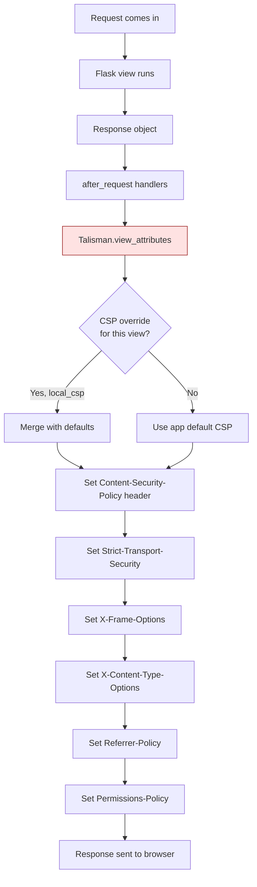
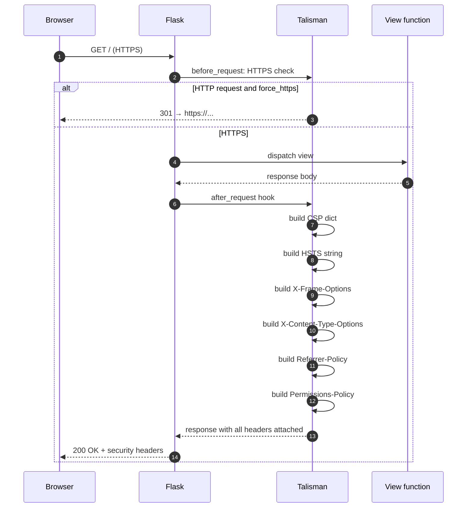
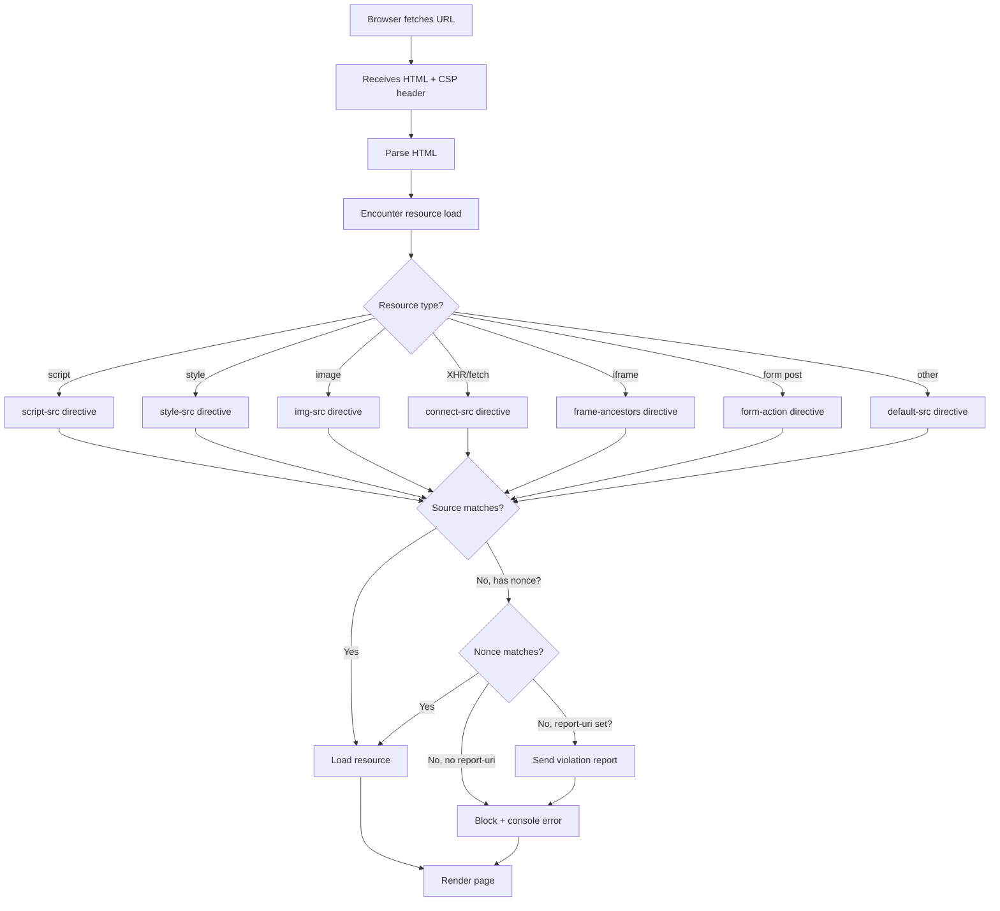
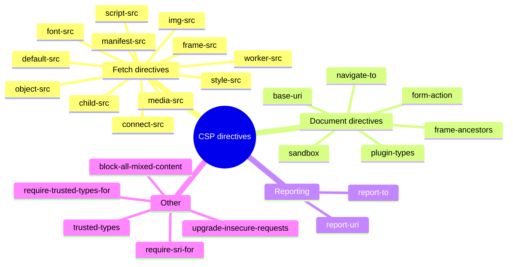
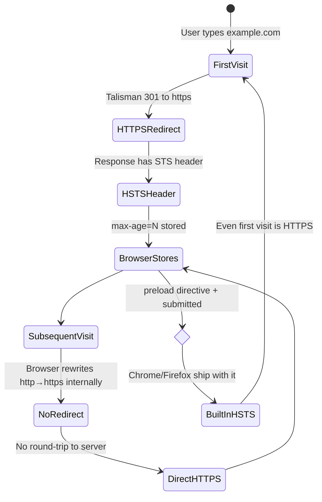
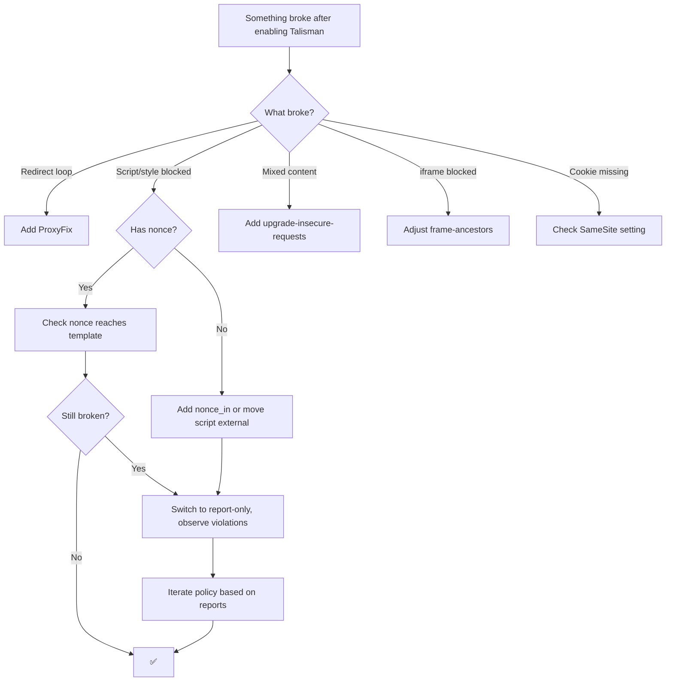
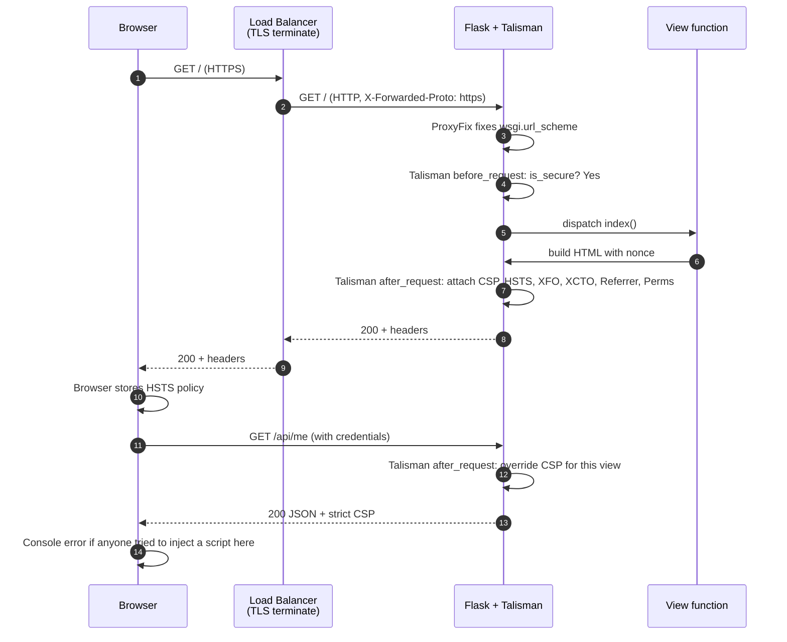

# Flask-Talisman

#flask #security #headers #csp #hsts #owasp #xss #clickjacking

> [!info] HTTP security headers, applied at the response layer
> **Flask-Talisman** is a small extension that sets the suite of browser-enforced security headers — `Content-Security-Policy`, `Strict-Transport-Security`, `X-Frame-Options`, `X-Content-Type-Options`, `Referrer-Policy`, `Permissions-Policy` — on every Flask response. It is the canonical "I want my Flask app to score A+ on Mozilla Observatory and securityheaders.com" tool.

Think of Flask-Talisman as a **security guard at the exit door**. Your view code does its work, builds a response, and on the way out the door Talisman attaches a stack of stickers that tell the browser how to behave: "only execute scripts from these origins", "never load this site without HTTPS", "don't allow this page to be framed", "don't sniff the MIME type". The browser then enforces those stickers — Flask itself never has to know.

---

## 1. Overview & Metaphor

### Why HTTP security headers?

The browser is the last line of defense in the user's stack. Once HTML leaves your server, the browser decides what to execute, what to load, and what to block. Modern browsers expose a set of opt-in security controls via response headers:

| Header | Threat it mitigates |
|---|---|
| `Content-Security-Policy` (CSP) | XSS, data exfiltration, mixed content, clickjacking |
| `Strict-Transport-Security` (HSTS) | SSL stripping, protocol downgrade |
| `X-Frame-Options` (legacy, now in CSP) | Clickjacking |
| `X-Content-Type-Options: nosniff` | MIME sniffing attacks |
| `Referrer-Policy` | Referrer leakage to third parties |
| `Permissions-Policy` | Over-privileged APIs (camera, mic, geolocation) |
| `Cross-Origin-Opener-Policy` (COOP) | Spectre-style cross-origin isolation |
| `Cross-Origin-Embedder-Policy` (COEP) | Spectre / `SharedArrayBuffer` gating |
| `Cross-Origin-Resource-Policy` (CORP) | Cross-origin resource loading |

Without Flask-Talisman you would write a Flask `after_request` handler with ~50 lines of header setting, repeating yourself on every error handler, blueprint, and streaming response. With it, one line covers the whole app.

### The defense-in-depth layers

```mermaid
flowchart TB
    USER[User Browser] --> TLS[TLS 1.3]
    TLS --> HSTS[HSTS preload<br/>Strict-Transport-Security]
    HSTS --> CSP[Content-Security-Policy<br/>script-src, style-src, ...]
    CSP --> XFO[X-Frame-Options<br/>DENY or SAMEORIGIN]
    XFO --> XCTO[X-Content-Type-Options<br/>nosniff]
    XCTO --> REF[Referrer-Policy<br/>strict-origin-when-cross-origin]
    REF --> PP[Permissions-Policy<br/>camera=(), microphone=()]
    PP --> APP[Flask view function]
    APP --> AUTH[Flask-Login session]
    AUTH --> CSRF[Flask-SeaSurf / Flask-WTF CSRF]
    CSRF --> RESPONSE[Response built]
    RESPONSE --> TALISMAN[Flask-Talisman<br/>attaches all headers on after_request]
    TALISMAN --> BROWSER[Browser enforces]

    classDef tal fill:#fef3c7,stroke:#d97706;
    class TALISMAN tal;
```

### What Talisman does NOT do

| Concern | Who handles it |
|---|---|
| CSRF protection | [[Flask-SeaSurf]] or [[Flask-WTF]] (`CSRFProtect`) |
| Authentication / sessions | [[Flask-Login]], [[Flask-Security-Too]] |
| Rate limiting | [[Flask-Limiter]] |
| Password hashing | [[Flask-Bcrypt]], `werkzeug.security`, `argon2-cffi` |
| HTTPS termination | Reverse proxy (nginx, Caddy, AWS ALB) |
| TLS certificate issuance | Let's Encrypt / certbot |
| Cookie `Secure`/`HttpOnly` flags | Flask `SESSION_COOKIE_*` config |

> [!tip] The metaphor
> Talisman is a **stamper on the response conveyor belt**. Every response that leaves Flask goes past Talisman on its way out, and Talisman stamps it with the standard set of security headers. It does not inspect the body, it does not touch the request, it does not log in users. It just stamps.

---

## 2. Installation

```bash
(venv) $ pip install flask-talisman
```

| Package | Version used in this note |
|---|---|
| Flask | 3.0.x |
| flask-talisman | 1.1.x |

Talisman has zero runtime dependencies beyond Flask itself, so it is safe to add to a locked-down production environment.

> [!warning] `flask-talisman` 1.x is the maintained line
> Earlier 0.x versions had a different CSP API (you set a string instead of a dict). All examples below use the modern dict-based CSP API.

---

## 3. Configuration

Talisman is configured entirely through the `Talisman(app, **options)` constructor and the `app.config` dict is **not** used. The most important options:

| Option | Default | Description |
|---|---|---|
| `force_https` | `True` | Redirect any `http://` request to `https://` with a 301. Disable only behind a TLS-terminating proxy that you trust. |
| `force_https_permanent` | `False` | Use 308 (permanent) instead of 301 (temporary). |
| `force_file_save` | `False` | Add `Content-Disposition: attachment` to unknown MIME types — prevents inline execution of uploaded files. |
| `content_security_policy` | A strict default | Either a dict of directives or a CSP string. |
| `content_security_policy_report_only` | `False` | Send `Content-Security-Policy-Report-Only` instead of enforcing — for staged rollouts. |
| `content_security_policy_nonce_in` | `[]` | List of directives that should automatically receive a `'nonce-<random>'` source. |
| `strict_transport_security` | `True` | Send `Strict-Transport-Security` header. |
| `strict_transport_security_preload` | `False` | Add `preload` directive (you must also submit to the HSTS preload list). |
| `strict_transport_security_max_age` | `31536000` (1 year) | HSTS TTL in seconds. |
| `strict_transport_security_include_subdomains` | `True` | Apply HSTS to all subdomains. |
| `frame_options` | `"SAMEORIGIN"` | `X-Frame-Options` value (`"DENY"` or `"SAMEORIGIN"`). |
| `frame_options_same_origin` | `False` | Convenience alias. |
| `no_sniff` | `True` | Send `X-Content-Type-Options: nosniff`. |
| `referrer_policy` | `"strict-origin-when-cross-origin"` | `Referrer-Policy` value. |
| `permissions_policy` | `{}` | Dict of Permissions-Policy features. |
| `session_cookie_secure` | `True` | Force `Secure` on session cookie. |
| `session_cookie_http_only` | `True` | Force `HttpOnly` on session cookie. |
| `sri` | `False` | Auto-add Subresource Integrity hashes (rarely used). |

### Constructor example

```python
from flask import Flask
from flask_talisman import Talisman

app = Flask(__name__)
talisman = Talisman(
    app,
    force_https=True,
    strict_transport_security=True,
    strict_transport_security_max_age=63072000,        # 2 years
    strict_transport_security_preload=True,
    content_security_policy={
        "default-src": "'self'",
        "script-src":  "'self' https://cdn.jsdelivr.net",
        "style-src":   "'self' 'unsafe-inline' https://cdn.jsdelivr.net",
        "img-src":     "'self' data: https:",
        "font-src":    "'self' https://cdn.jsdelivr.net",
        "connect-src": "'self' https://api.example.com",
        "frame-ancestors": "'none'",
        "base-uri":    "'self'",
        "form-action": "'self'",
        "object-src":  "'none'",
        "upgrade-insecure-requests": "",
    },
    frame_options="DENY",
    no_sniff=True,
    referrer_policy="strict-origin-when-cross-origin",
    permissions_policy={
        "geolocation":     "()",
        "camera":          "()",
        "microphone":      "()",
        "payment":         "()",
        "usb":             "()",
        "accelerometer":   "()",
    },
)
```

### The `default-src` inheritance rule

CSP directives fall back to `default-src` when not explicitly set. The only directives that **do not** fall back are `frame-ancestors`, `form-action`, `base-uri`, `report-uri`, and `sandbox`.



---

## 4. Basic Usage

### 4.1 Minimal app

```python
# app.py
from flask import Flask, render_template_string
from flask_talisman import Talisman

app = Flask(__name__)
Talisman(app, content_security_policy={"default-src": "'self'"})

@app.route("/")
def index():
    return render_template_string("<h1>Hello, secure world!</h1>")

if __name__ == "__main__":
    app.run(ssl_context="adhoc")   # enable HTTPS for local testing
```

Inspect the response headers:

```bash
$ curl -I https://localhost:5000/
HTTP/1.1 200 OK
Content-Security-Policy: default-src 'self'
Strict-Transport-Security: max-age=31536000; includeSubDomains
X-Frame-Options: SAMEORIGIN
X-Content-Type-Options: nosniff
Referrer-Policy: strict-origin-when-cross-origin
```

### 4.2 Header injection sequence



### 4.3 Per-view overrides

Sometimes one view needs a looser or stricter policy. Talisman exposes the `@talisman(...)` decorator for this:

```python
from flask_talisman import Talisman
talisman = Talisman(app)

# This view is allowed to load maps from OpenStreetMap
@app.route("/map")
@talisman(
    content_security_policy={
        "default-src": "'self'",
        "img-src":     "'self' https://*.tile.openstreetmap.org",
        "script-src":  "'self'",
    }
)
def map_view():
    return render_template("map.html")

# This view may be embedded in an iframe from our help docs
@app.route("/widget")
@talisman(frame_options="ALLOWALL")
def widget():
    return render_template("widget.html")

# Disable CSP entirely on the API JSON endpoints
@app.route("/api/health")
@talisman(content_security_policy=None)
def health():
    return {"status": "ok"}
```

### 4.4 The nonce pattern for inline scripts

A strict CSP forbids inline `<script>` tags. The cleanest fix is to move scripts to external files, but when that isn't possible, Talisman can inject a per-request nonce:

```python
talisman = Talisman(
    app,
    content_security_policy={
        "default-src": "'self'",
        "script-src":  "'self'",
    },
    content_security_policy_nonce_in=["script-src"],
)

@app.route("/")
def index():
    nonce = request.headers.get("Content-Security-Policy-Nonce")  # injected by Talisman
    # Or read from g:
    from flask import g
    nonce = g.csp_nonce
    return render_template("index.html", csp_nonce=nonce)
```

In the template:

```html
<script nonce="{{ csp_nonce }}">
    console.log("This will run because the nonce matches the CSP header");
</script>
```

The nonce changes on every request, so an attacker who can inject a `<script>` tag but cannot read the response headers (a typical XSS in an attribute context) cannot forge it.

### 4.5 CSP evaluation flow in the browser



---

## 5. Intermediate Patterns

### 5.1 Report-only mode for staged CSP rollout

Flipping a new CSP from off to enforced will break your site if you missed an origin. Use `Content-Security-Policy-Report-Only` to collect violations for a week first:

```python
talisman = Talisman(
    app,
    content_security_policy_report_only=True,
    content_security_policy={
        "default-src": "'self'",
        "report-uri":  "/csp/report",
    },
)

@app.route("/csp/report", methods=["POST"])
def csp_report():
    report = request.get_json(force=True)
    current_app.logger.warning("CSP violation: %s", report)
    return "", 204
```

Browsers will POST violation reports to `/csp/report` but will still render the page as if there were no CSP. Watch the logs for a week, fix the violations, then set `content_security_policy_report_only=False`.

### 5.2 Trusted Types

For very high-security apps (banking, identity providers), enable Trusted Types to require all DOM sinks to receive explicitly typed values:

```python
talisman = Talisman(
    app,
    content_security_policy={
        "default-src": "'self'",
        "script-src":  "'self'",
        "require-trusted-types-for": "'script'",
        "trusted-types": "myPolicy",
    },
)
```

This forces you to register a `TrustedTypePolicy` named `myPolicy` in JS before any `innerHTML`, `eval`, or `<script>` injection works. It is the strongest defense against DOM XSS currently available.

### 5.3 Behind a TLS-terminating proxy

When nginx/AWS ALB terminates TLS and proxies to Flask over plain HTTP, Talisman cannot tell from `request.is_secure` that the original connection was HTTPS. The standard fix is to honor the `X-Forwarded-Proto` header:

```python
from werkzeug.middleware.proxy_fix import ProxyFix
app.wsgi_app = ProxyFix(app.wsgi_app, x_for=1, x_proto=1, x_host=1, x_prefix=1)

talisman = Talisman(app, force_https=True)
```

Without `ProxyFix`, Talisman would redirect the proxy's internal `http://` request to `https://`, creating an infinite redirect loop. See [[Production-Deployment]].

### 5.4 Cookie hardening

Talisman can force `Secure` and `HttpOnly` on the Flask session cookie. For other cookies you set yourself, do it explicitly:

```python
from flask import make_response

@app.route("/set-prefs")
def set_prefs():
    resp = make_response({"ok": True})
    resp.set_cookie(
        "theme", "dark",
        secure=True, httponly=True, samesite="Lax",
        max_age=60 * 60 * 24 * 365,
    )
    return resp
```

`SameSite=Lax` is the modern default and defends against most CSRF without needing tokens; `SameSite=Strict` is even stronger but breaks OAuth redirects and email-link logins.

### 5.5 Subresource Integrity (SRI)

When loading third-party scripts from a CDN, attach an `integrity` attribute so a compromised CDN can't swap in malicious code:

```html
<script src="https://cdn.jsdelivr.net/npm/vue@3.4.0/dist/vue.global.js"
        integrity="sha384-abc123..."
        crossorigin="anonymous"></script>
```

Talisman's `sri=True` will compute hashes for *locally-served* files via Flask-Assets, but for CDN scripts you compute the hash yourself with:

```bash
$ curl -s https://cdn.jsdelivr.net/npm/vue@3.4.0/dist/vue.global.js | openssl dgst -sha384 -binary | openssl base64 -A
```

---

## 6. Advanced Usage

### 6.1 CSP directive deep-dive



### 6.2 Per-blueprint policy

```python
from flask import Blueprint
api_bp = Blueprint("api", __name__, url_prefix="/api")
docs_bp = Blueprint("docs", __name__, url_prefix="/docs")

@api_bp.after_request
def api_csp(resp):
    resp.headers["Content-Security-Policy"] = "default-src 'none'; frame-ancestors 'none'"
    return resp

# Use Talisman defaults for docs_bp
```

This pattern is useful when the API should have an extremely strict policy (`default-src 'none'` because it serves JSON, no scripts at all) while the docs site needs to allow syntax highlighters.

### 6.3 State machine: HSTS lifecycle



> [!danger] HSTS is a one-way door
> Once a browser stores your HSTS policy for `max-age` seconds, every visit to that domain (and its subdomains, if `includeSubDomains`) will be forced to HTTPS for that entire duration — even if you remove the header from your server. Be very careful enabling `includeSubdomains` on a domain that has non-HTTPS subdomains (e.g., a legacy `http://staging.example.com`).

### 6.4 Report collection endpoint with batching

For high-traffic sites, a single `/csp/report` endpoint will get hammered. Buffer reports in Redis and flush every minute:

```python
import json, time
from flask import request, current_app
from app.extensions import redis_client

@app.route("/csp/report", methods=["POST"])
def csp_report():
    report = request.get_json(force=True)
    key = f"csp:reports:{int(time.time() // 60)}"
    redis_client.rpush(key, json.dumps(report))
    redis_client.expire(key, 600)
    return "", 204
```

A Celery beat task (see [[Celery]]) pulls the keys and ships them to a logging pipeline.

### 6.5 Strict CSP with nonces and hashes

The Google Strict CSP recipe is the modern best practice:

```python
talisman = Talisman(
    app,
    content_security_policy={
        "default-src":  "'self'",
        "base-uri":     "'self'",
        "object-src":   "'none'",
        "script-src":   "'self' 'nonce-{nonce}' 'strict-dynamic' https: http:",
        "style-src":    "'self' 'nonce-{nonce}'",
        "report-uri":   "/csp/report",
        "report-to":    "csp-endpoint",
    },
    content_security_policy_nonce_in=["script-src", "style-src"],
)
```

`'strict-dynamic'` lets trusted scripts (those with the nonce) load further scripts without listing them. This works well with bundlers like Vite (see [[Flask-Vite]]) that lazy-load chunks at runtime.

---

## 7. Common Pitfalls & Troubleshooting

| Symptom | Likely cause | Fix |
|---|---|---|
| Infinite redirect loop `http → https → http` | Running behind a TLS-terminating proxy without `ProxyFix`. | Wrap `app.wsgi_app` in `ProxyFix(x_proto=1)`. |
| Inline `<script>` doesn't run, console shows CSP violation | CSP `script-src` doesn't include `'unsafe-inline'` or a matching nonce. | Use `content_security_policy_nonce_in=["script-src"]` and inject `nonce="{{ csp_nonce }}"`. |
| 100% of styles broken after enabling CSP | Bootstrap / Tailwind use inline styles or `style` attributes. | Add `'unsafe-inline'` to `style-src` *only* (it's much safer than `'unsafe-inline'` on `script-src`). |
| Mixed content warnings after enabling HSTS | Page links to `http://` resources. | Add `upgrade-insecure-requests` directive. |
| OAuth redirect from Google fails | `SameSite=Strict` on the session cookie blocks the cross-site navigation. | Use `SameSite=Lax` (Flask default since 1.0) or set `SESSION_COOKIE_SAMESITE="Lax"`. |
| Browser console: `Refused to frame because frame-ancestors` | Trying to embed your page in an iframe from a different origin. | Add the embedder's origin to `frame-ancestors`, or set `frame_options="ALLOWALL"` for that view only. |
| `Strict-Transport-Security` not appearing on local dev | You're running `http://localhost:5000`. Talisman only sends HSTS over HTTPS. | Run with `ssl_context="adhoc"` or via `flask run --cert=adhoc`. |
| CSP breaks DataTables / jQuery plugins | Many older libraries use `eval` or `new Function()`. | Add `'unsafe-eval'` to `script-src` as a last resort; better, upgrade the library. |
| API JSON responses get CSP header they don't need | Talisman applies to all responses by default. | Decorate API views with `@talisman(content_security_policy=None)`. |
| Fonts from CDN fail to load | `font-src` not set, falling back to `default-src 'self'`. | Add the CDN origin to `font-src`. |

### Troubleshooting decision tree



---

## 8. Best Practices

1. **Start with report-only mode.** Collect violations for a week before enforcing.
2. **Use nonces, not `'unsafe-inline'`.** Inline scripts are an XSS vector; nonces mitigate while keeping ergonomics.
3. **Avoid `'unsafe-eval'` entirely.** If a library needs it, replace the library.
4. **Set `default-src 'self'`** and widen per-directive as needed. Don't start permissive.
5. **Add `frame-ancestors 'none'`** unless you genuinely need to be embedded.
6. **Add `object-src 'none'`** — Flash/Java/PDF plugins are dead and were always risky.
7. **Add `base-uri 'self'`** — prevents `<base href>` tag hijacking.
8. **Add `form-action 'self'`** — prevents forms from submitting to attacker origins.
9. **Enable HSTS only after you've verified HTTPS works end-to-end.** Once a browser caches HSTS, you can't undo it for `max-age` seconds.
10. **Submit to the HSTS preload list** at <https://hstspreload.org> after running with `preload` for a few weeks.
11. **Don't disable `force_https` in production.** If you must, ensure your load balancer does the redirect.
12. **Pair with `SameSite=Lax` cookies.** Defense in depth: HSTS for transport, CSP for content, SameSite for CSRF.
13. **Test with Mozilla Observatory and securityheaders.com** in CI. Both grade your headers in seconds.
14. **Version your CSP.** When you change it, deploy to a small fraction first and watch the report endpoint.

> [!warning] HSTS `preload` is permanent for the lifetime of the domain
> Once your domain is on the HSTS preload list baked into Chrome/Firefox, removing it requires (a) serving HTTPS with a valid cert and (b) waiting for the next browser release. Don't preload `staging.example.com` if you might repurpose the subdomain.

---

## 9. Integration with Other Extensions

### [[Flask-CORS]]

CORS allows cross-origin reads; CSP governs cross-origin writes/loads. They don't conflict, but both must be configured for cross-origin scripts to work:

```python
from flask_cors import CORS
from flask_talisman import Talisman

CORS(app, origins=["https://app.example.com"],
     allow_headers=["Authorization", "Content-Type"],
     supports_credentials=True)

Talisman(app, content_security_policy={
    "default-src":   "'self'",
    "connect-src":   "'self' https://api.example.com",
    "script-src":    "'self'",
})
```

CORS says "the API may respond to that origin"; CSP says "the page may make a fetch to that origin". Both are required.

### [[Flask-Login]]

Talisman secures the cookie by forcing `Secure` and `HttpOnly`; Flask-Login reads and writes the cookie:

```python
from flask_login import LoginManager
login_manager = LoginManager()
login_manager.session_protection = "strong"   # re-issue session on IP/UA change
login_manager.init_app(app)

Talisman(app, session_cookie_secure=True, session_cookie_http_only=True)
```

For `session_protection="strong"` to work, the cookie must travel with each request — which means `SameSite=Lax` (the Flask default). With `Strict`, login sessions break on first-party navigation from external links.

### [[Flask-SeaSurf]] / [[Flask-WTF]] CSRF

CSRF tokens are complementary to CSP — CSP prevents script injection that could read DOM tokens; CSRF tokens prevent cross-site form posts. Talisman's `frame-ancestors` directive additionally prevents clickjacking-based CSRF.

### [[Flask-Compress]]

Compress sets `Content-Encoding: gzip` in `after_request`. Talisman also runs in `after_request`. Order matters: Talisman should run **after** compression so headers aren't accidentally compressed. Flask runs `after_request` handlers in reverse registration order, so register Compress first, Talisman second.

### [[Production-Deployment]]

For full reverse-proxy + Talisman config, see [[Production-Deployment]]. The key items: terminate TLS at the edge, pass `X-Forwarded-Proto`, and let Talisman's `force_https` handle the redirect for direct-HTTP requests.

---

## 10. Real-World Example: Hardened Production App

A complete production Flask app with strict CSP, HSTS preload, nonced scripts, and a CSP report collector.

```python
# app/__init__.py
import os
from flask import Flask, request, jsonify, g, current_app
from flask_talisman import Talisman
from flask_login import LoginManager
from flask_seasurf import SeaSurf
from werkzeug.middleware.proxy_fix import ProxyFix

def create_app() -> Flask:
    app = Flask(__name__)
    app.config.update(
        SECRET_KEY=os.environ["SECRET_KEY"],
        SESSION_COOKIE_SECURE=True,
        SESSION_COOKIE_HTTPONLY=True,
        SESSION_COOKIE_SAMESITE="Lax",
        PERMANENT_SESSION_LIFETIME=60 * 60 * 24 * 7,
        PREFERRED_URL_SCHEME="https",
    )

    app.wsgi_app = ProxyFix(app.wsgi_app, x_for=1, x_proto=1, x_host=1)

    # Talisman — set BEFORE other after_request handlers
    talisman = Talisman(
        app,
        force_https=True,
        force_https_permanent=False,
        strict_transport_security=True,
        strict_transport_security_max_age=63072000,
        strict_transport_security_preload=True,
        strict_transport_security_include_subdomains=True,
        content_security_policy={
            "default-src":  "'self'",
            "base-uri":     "'self'",
            "object-src":   "'none'",
            "frame-ancestors": "'none'",
            "form-action":  "'self'",
            "script-src":   "'self' 'nonce-{nonce}' 'strict-dynamic' https:",
            "style-src":    "'self' 'nonce-{nonce}'",
            "img-src":      "'self' data: https:",
            "font-src":     "'self' https://cdn.jsdelivr.net",
            "connect-src":  "'self' https://api.example.com",
            "upgrade-insecure-requests": "",
            "report-uri":   "/csp/report",
        },
        content_security_policy_nonce_in=["script-src", "style-src"],
        frame_options="DENY",
        no_sniff=True,
        referrer_policy="strict-origin-when-cross-origin",
        permissions_policy={
            "geolocation":   "()",
            "camera":        "()",
            "microphone":    "()",
            "payment":       "()",
            "usb":           "()",
        },
    )

    # CSRF
    SeaSurf(app)

    # Login
    login_manager = LoginManager()
    login_manager.session_protection = "strong"
    login_manager.init_app(app)

    # CSP report collector
    @app.route("/csp/report", methods=["POST"])
    def csp_report():
        report = request.get_json(force=True, silent=True)
        if report:
            current_app.logger.warning("CSP violation: %s", report)
        return "", 204

    @app.route("/")
    def index():
        nonce = g.csp_nonce
        return f"""
        <!doctype html>
        <html><head>
            <title>Secure App</title>
            <style nonce="{nonce}">body {{ font-family: sans-serif; }}</style>
        </head><body>
            <h1>Hello</h1>
            <script nonce="{nonce}">
              fetch("/api/me").then(r => r.json()).then(console.log);
            </script>
        </body></html>
        """

    @app.route("/api/me")
    def api_me():
        # API endpoint: no CSP needed (JSON-only, never executed by browser)
        resp = jsonify({"user": "alice"})
        resp.headers["Content-Security-Policy"] = "default-src 'none'; frame-ancestors 'none'"
        return resp

    return app
```

### Full sequence



---

## 11. References

- **PyPI**: <https://pypi.org/project/flask-talisman/>
- **GitHub**: <https://github.com/GoogleCloudPlatform/flask-talisman>
- **Mozilla Observatory**: <https://observatory.mozilla.org/>
- **securityheaders.com**: <https://securityheaders.com/>
- **HSTS preload list**: <https://hstspreload.org/>
- **Specifications**:
  - RFC 6797 — HTTP Strict Transport Security
  - W3C — Content Security Policy Level 3
  - W3C — Referrer Policy
  - W3C — Permissions Policy
- **Google Strict CSP guide**: <https://csp.withgoogle.com/docs/strict-csp.html>
- **CSP Evaluator**: <https://csp-evaluator.withgoogle.com/>
- **Related notes**: [[Security-Best-Practices]] · [[Flask-CORS]] · [[Flask-Login]] · [[Flask-SeaSurf]] · [[Flask-WTF]] · [[Flask-Compress]] · [[Production-Deployment]] · [[Flask-Security-Too]]
