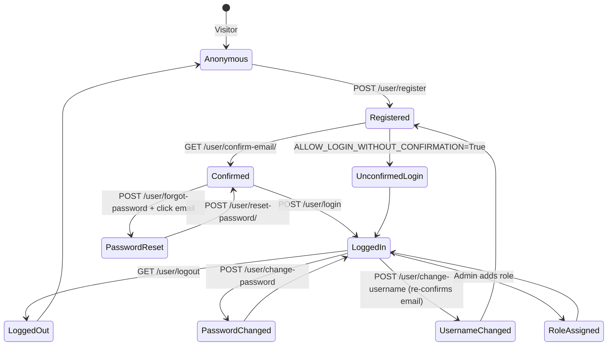
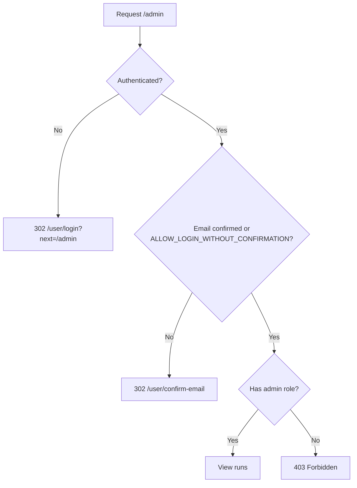
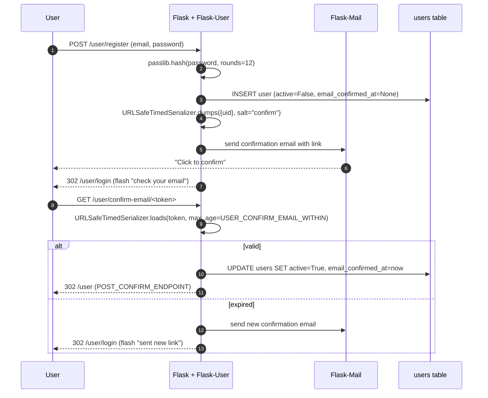
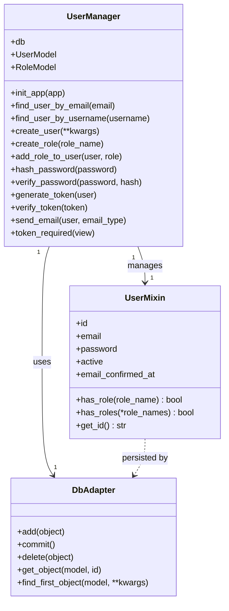
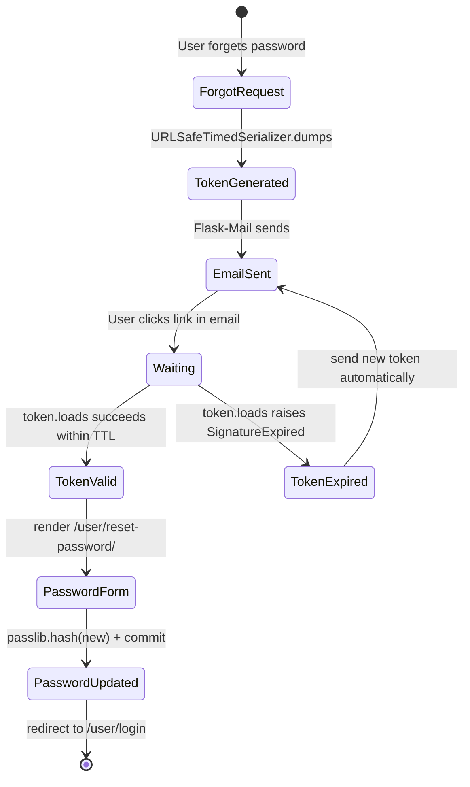
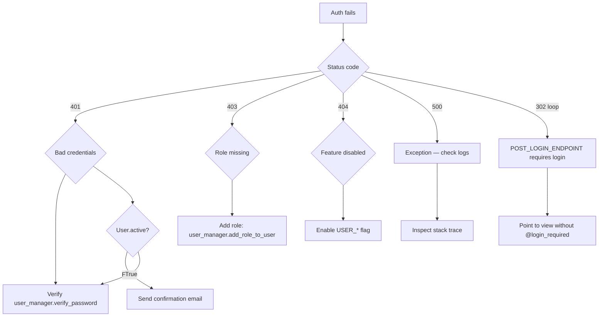
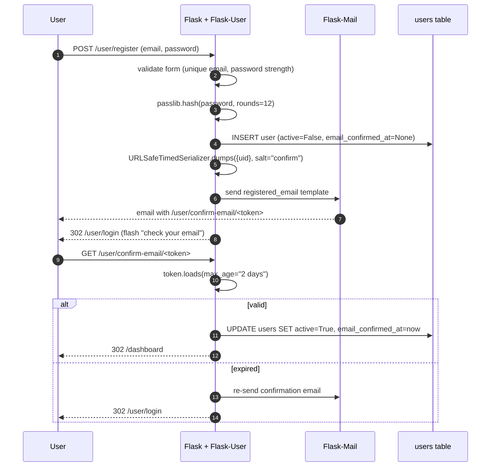
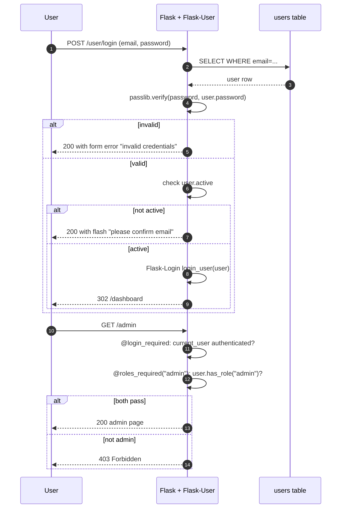

# Flask-User

#flask #authentication #authorization #security #roles #user-management #email-confirmation

> [!info] User-management extension with batteries included
> **Flask-User** is a high-level user-management layer for Flask that bundles registration, login, logout, email confirmation, password reset, password change, role-based access control, and a `UserManager` adapter that sits between your `User` model and the underlying libraries ([[Flask-Login]], [[Flask-Mail]], [[Flask-WTF]], [[Flask-Bcrypt]] or `passlib`). It is the spiritual sibling of [[Flask-Security-Too]] — same problem space, slightly different API and philosophy.

Think of Flask-User as a **concierge at a small hotel**. Unlike Flask-Security-Too (which is the all-singing, all-dancing gatehouse of a megaresort), Flask-User handles the basic four flows — check-in, key replacement, room changes, and guest directory — and explicitly **does not** include 2FA, WebAuthn, or unified sign in. For apps that need those, you graduate to Flask-Security-Too.

---

## 1. Overview & Metaphor

### What Flask-User gives you

| Endpoint | Default URL | Purpose |
|---|---|---|
| `user.register` | `/user/register` | Create account + send confirmation email |
| `user.login` | `/user/login` | Authenticate + set session |
| `user.logout` | `/user/logout` | Clear session |
| `user.confirm_email` | `/user/confirm-email/<token>` | Verify email ownership |
| `user.forgot_password` | `/user/forgot-password` | Request reset email |
| `user.reset_password` | `/user/reset-password/<token>` | Set new password |
| `user.change_password` | `/user/change-password` | Change while logged in |
| `user.change_username` | `/user/change-username` | Change email (requires re-confirmation) |
| `user.manage_emails` | `/user/manage-emails` | Add/remove secondary emails |
| `user.home` | `/user` | Profile page after login |

### Design philosophy: small surface area

Flask-User exposes exactly **one** entry point: the `UserManager` class. You subclass it (or use it as-is), pass it your `db`, your `User` model, and any forms you want to override, and that's it. There are ~30 config keys (vs. FST's ~80). This makes Flask-User:

- **Easier to learn** — the documentation is one long page.
- **Less flexible** — fewer knobs for things like 2FA, unified sign in, OAuth.
- **Better for MVPs** — get a working auth system in 30 minutes.

### Flask-User vs Flask-Security-Too

| Feature | Flask-User | [[Flask-Security-Too]] |
|---|---|---|
| 2FA / TOTP | ❌ | ✅ |
| SMS authentication | ❌ | ✅ |
| WebAuthn / FIDO2 | ❌ | ✅ |
| Unified Sign In (passwordless) | ❌ | ✅ |
| OAuth2 client (login with Google) | ⚠️ (via [[Flask-Dance]]) | ✅ (built-in) |
| Multiple emails per user | ✅ | ❌ (one email) |
| Change username (email) | ✅ (with re-confirmation) | ❌ |
| Permissions (fine-grained) | ⚠️ (roles only) | ✅ (Flask-Principal) |
| MongoEngine datastore | ❌ | ✅ |
| Token-based API auth | ✅ (`USER_ENABLE_TOKEN`) | ✅ |
| Activity | Low (last release 2023) | High (monthly releases) |
| Best for | MVPs, classic SaaS apps | High-security apps, APIs, identity providers |

> [!tip] The metaphor
> Flask-User is a **concierge at a boutique hotel**. The concierge knows your guests by name, sends them welcome letters, helps them recover lost keys, lets them change rooms, and keeps a small notebook of who's allowed in the executive lounge. What the concierge doesn't do: biometric scans, badge readers, or guest registration through Hilton's loyalty program. For those, you call the gatehouse (Flask-Security-Too).

### What Flask-User does NOT do

| Concern | Who handles it |
|---|---|
| CSRF protection | [[Flask-WTF]] (auto-installed by Flask-User) |
| Security headers | [[Flask-Talisman]] |
| Rate limiting | [[Flask-Limiter]] |
| API tokens (Bearer) | [[Flask-JWT-Extended]] or [[Flask-HTTPAuth]] |
| Admin UI | [[Flask-Admin]] |
| OAuth client | [[Flask-Dance]] |
| 2FA | [[Flask-Security-Too]] |

---

## 2. Installation

```bash
(venv) $ pip install flask-user
```

Optional extras:

```bash
(venv) $ pip install flask-mail       # for confirmation/reset emails
(venv) $ pip install flask-sqlalchemy # for the default SQLAlchemy adapter
```

| Package | Version |
|---|---|
| Flask | 3.0.x |
| Flask-User | 1.0.x (or 0.6.x legacy line) |
| Flask-Login | 0.6.x |
| Flask-WTF | 1.2.x |
| Flask-Mail | 0.10.x |
| passlib | 1.7.x |

> [!warning] Flask-User 1.x requires Flask-Login ≥ 0.6
> If you're stuck on Flask-Login 0.5, use Flask-User 0.6.x. The 1.x line has a slightly different `UserMixin` API (no longer requires `is_authenticated` etc. — Flask-Login 0.6 provides defaults).

---

## 3. Configuration

Flask-User reads `USER_*` config keys. The most important:

| Key | Default | Description |
|---|---|---|
| `SECRET_KEY` | (required) | Flask secret for session signing. |
| `USER_APP_NAME` | `"Flask-User"` | App name shown in emails and templates. |
| `USER_ENABLE_USERNAME` | `True` | Allow username (in addition to email) for login. |
| `USER_ENABLE_EMAIL` | `True` | Allow email for login/confirmation. |
| `USER_ENABLE_CONFIRM_EMAIL` | `True` | Send confirmation email on register. |
| `USER_ENABLE_RETYPE_PASSWORD` | `True` | Require password + confirm in register form. |
| `USER_ENABLE_FORGOT_PASSWORD` | `True` | Enable `/forgot-password`. |
| `USER_ENABLE_CHANGE_PASSWORD` | `True` | Enable `/change-password`. |
| `USER_ENABLE_CHANGE_USERNAME` | `False` | Enable `/change-username`. |
| `USER_ENABLE_MULTI_EMAIL` | `False` | Allow users to register multiple emails. |
| `USER_ENABLE_TOKEN_AUTH` | `False` | Issue a token (in `/api`) for API auth. |
| `USER_ALLOW_LOGIN_WITHOUT_CONFIRMATION` | `False` | Allow login before email is confirmed. |
| `USER_REQUIRE_RETYPE_PASSWORD` | `True` | (alias) |
| `USER_PASSWORD_HASH` | `"bcrypt"` | Hash algorithm via passlib: `bcrypt`, `argon2`, `pbkdf2_sha512`. |
| `USER_PASSWORD_HASH_PASSLIB_ROUNDS` | `12` | bcrypt cost. |
| `USER_PASSWORD_HASH_SALT` | `None` | Optional salt for hash. |
| `USER_CONFIRM_EMAIL_WITHIN` | `"2 days"` | Confirmation token TTL. |
| `USER_RESET_PASSWORD_WITHIN` | `"2 days"` | Reset token TTL. |
| `USER_LOGIN_VIEW` | `"user.login"` | Login endpoint name. |
| `USER_LOGOUT_VIEW` | `"user.logout"` | Logout endpoint name. |
| `USER_AFTER_LOGIN_ENDPOINT` | `"user.home"` | Redirect after login. |
| `USER_AFTER_LOGOUT_ENDPOINT` | `"user.login"` | Redirect after logout. |
| `USER_AFTER_REGISTER_ENDPOINT` | `"user.home"` | Redirect after register. |
| `USER_AFTER_CONFIRM_ENDPOINT` | `"user.home"` | Redirect after confirm. |
| `USER_EMAIL_SENDER_EMAIL` | `"no-reply@example.com"` | From address. |
| `USER_EMAIL_SENDER_NAME` | `USER_APP_NAME` | From name. |
| `USER_INVITE_EXPIRATION` | `"2 days"` | Invitation token TTL (if invites enabled). |

### Minimal config

```python
# config.py
import os
class Config:
    SECRET_KEY = os.environ["SECRET_KEY"]
    SQLALCHEMY_DATABASE_URI = os.environ["DATABASE_URL"]

    USER_APP_NAME = "MyApp"
    USER_ENABLE_USERNAME = True
    USER_ENABLE_EMAIL = True
    USER_ENABLE_CONFIRM_EMAIL = True
    USER_ENABLE_FORGOT_PASSWORD = True
    USER_ENABLE_CHANGE_PASSWORD = True
    USER_ALLOW_LOGIN_WITHOUT_CONFIRMATION = False

    USER_PASSWORD_HASH = "bcrypt"
    USER_PASSWORD_HASH_PASSLIB_ROUNDS = 12

    MAIL_SERVER = "smtp.example.com"
    MAIL_USERNAME = os.environ["MAIL_USERNAME"]
    MAIL_PASSWORD = os.environ["MAIL_PASSWORD"]
```

---

## 4. Basic Usage

### 4.1 Models with UserMixin

```python
# app/models.py
from flask_user import UserMixin
from app.extensions import db

class User(db.Model, UserMixin):
    __tablename__ = "users"
    id            = db.Column(db.Integer, primary_key=True)
    active        = db.Column(db.Boolean, default=False)   # email confirmed?
    username      = db.Column(db.String(50), nullable=True, unique=True)
    email         = db.Column(db.String(255), nullable=False, unique=True)
    email_confirmed_at = db.Column(db.DateTime())
    password      = db.Column(db.String(255), nullable=False, default="")

    first_name    = db.Column(db.String(100))
    last_name     = db.Column(db.String(100))

    roles         = db.relationship("Role", secondary="user_roles",
                                     backref=db.backref("users", lazy="dynamic"))

class Role(db.Model):
    __tablename__ = "roles"
    id   = db.Column(db.Integer, primary_key=True)
    name = db.Column(db.String(50), unique=True)

class UserRoles(db.Model):
    __tablename__ = "user_roles"
    id      = db.Column(db.Integer, primary_key=True)
    user_id = db.Column(db.Integer, db.ForeignKey("users.id"))
    role_id = db.Column(db.Integer, db.ForeignKey("roles.id"))
```

### 4.2 UserManager wiring

```python
# app/extensions.py
from flask_sqlalchemy import SQLAlchemy
from flask_user import UserManager
from flask_mail import Mail

db = SQLAlchemy()
mail = Mail()

# Avoid circular imports — define a stub or pass the User class later
from app.models import User, Role

user_manager = UserManager(db, User, Role=Role)

def init_app(app):
    db.init_app(app)
    mail.init_app(app)
    user_manager.init_app(app)
```

```python
# app/__init__.py
from flask import Flask
from config import Config
from app.extensions import init_app, db, user_manager

def create_app():
    app = Flask(__name__)
    app.config.from_object(Config)
    init_app(app)

    with app.app_context():
        db.create_all()
        if not user_manager.find_role("admin"):
            user_manager.create_role(role_name="admin")
            user_manager.create_user(
                email=app.config["ADMIN_EMAIL"],
                password=app.config["ADMIN_PASSWORD"],
                roles=["admin"],
                email_confirmed_at=db.func.now(),
            )
            db.session.commit()

    from app.views.main import main_bp
    app.register_blueprint(main_bp)
    return app
```

### 4.3 Templates

Flask-User ships HTML templates under `flask_user/templates/flask_user/`. Override any of them by creating files at the same path in your `templates/` directory:

```html
<!-- templates/flask_user/login.html -->


  <h2>Sign in to {{ config.USER_APP_NAME }}</h2>
  <form method="POST">
    {{ form.csrf_token }}
    <p>{{ form.email.label }} {{ form.email() }}</p>
    <p>{{ form.password.label }} {{ form.password() }}</p>
    <p>{{ form.submit() }}</p>
  </form>

```

### 4.4 User lifecycle



### 4.5 Role-based access

```python
from flask import render_template
from flask_user import login_required, roles_required

@app.route("/dashboard")
@login_required
def dashboard():
    return render_template("dashboard.html", user=current_user)

@app.route("/admin/users")
@login_required
@roles_required("admin")
def admin_users():
    return render_template("admin/users.html", users=User.query.all())
```

`roles_required("admin", "editor")` means *all* listed roles must be present. For "any of", use `roles_accepted`.

### 4.6 Access control flow



---

## 5. Intermediate Patterns

### 5.1 Email confirmation flow



### 5.2 Customizing forms

```python
from flask_user.forms import RegisterForm
from wtforms import StringField, validators

class MyRegisterForm(RegisterForm):
    first_name = StringField("First name", validators=[validators.DataRequired()])
    last_name  = StringField("Last name",  validators=[validators.DataRequired()])

# Inject into UserManager
user_manager = UserManager(db, User, Role=Role, register_form=MyRegisterForm)
```

Add the columns to your `User` model; Flask-User will populate them automatically when the form validates.

### 5.3 Custom UserManager methods

Subclass `UserManager` to add behavior:

```python
from flask_user import UserManager

class CustomUserManager(UserManager):
    def send_email(self, user, email_type, **kwargs):
        # Send via Amazon SES instead of Flask-Mail
        from app.tasks import send_email_async
        send_email_async.delay(user.email, email_type, **kwargs)

    def hash_password(self, password):
        # Use a stronger hash than the configured default
        import argon2
        return argon2.PasswordHasher().hash(password)

    def verify_password(self, password, password_hash):
        # Fall back to legacy bcrypt for old hashes
        try:
            return super().verify_password(password, password_hash)
        except Exception:
            import bcrypt
            return bcrypt.checkpw(password.encode(), password_hash.encode())
```

### 5.4 Token-based API auth

If your app also serves JSON APIs, you can have Flask-User issue tokens:

```python
USER_ENABLE_TOKEN_AUTH = True
USER_TOKEN_EXPIRATION = 60 * 60 * 24   # 1 day
```

```python
from flask import request, jsonify
from flask_user import current_user

@app.route("/api/login", methods=["POST"])
def api_login():
    # Standard form-encoded or JSON login
    email = request.json.get("email")
    password = request.json.get("password")
    user = user_manager.find_user_by_email(email)
    if user and user_manager.verify_password(password, user.password):
        token = user_manager.generate_token(user)
        return jsonify({"token": token, "user_id": user.id})
    return jsonify({"error": "invalid"}), 401

@app.route("/api/me")
@user_manager.token_required
def api_me():
    return jsonify({"id": current_user.id, "email": current_user.email})
```

The token is a signed serialized payload (itsdangerous); no DB lookup needed unless you want revocation.

### 5.5 Invitations

Enable admins to send pre-authorized registration links:

```python
USER_ENABLE_INVITE_USER = True
```

```python
@app.route("/admin/invite", methods=["POST"])
@login_required
@roles_required("admin")
def invite_user():
    email = request.form["email"]
    user = user_manager.create_user(email=email, active=False, roles=["editor"])
    token = user_manager.generate_token(user)
    # send email with /user/register?token=<token>
    return "Invited"
```

---

## 6. Advanced Usage

### 6.1 Multiple emails per user

```python
USER_ENABLE_MULTI_EMAIL = True

class User(db.Model, UserMixin):
    id = db.Column(db.Integer, primary_key=True)
    emails = db.relationship("UserEmail", backref="user", cascade="all, delete-orphan")

class UserEmail(db.Model):
    __tablename__ = "user_emails"
    id = db.Column(db.Integer, primary_key=True)
    user_id = db.Column(db.Integer, db.ForeignKey("users.id"))
    email = db.Column(db.String(255), unique=True, nullable=False)
    email_confirmed_at = db.Column(db.DateTime)
    is_primary = db.Column(db.Boolean, default=False)
```

Users can register multiple emails and pick a primary; login accepts any of their emails.

### 6.2 Change username (with re-confirmation)

When `USER_ENABLE_CHANGE_USERNAME=True`, users can change their email. The new email gets a confirmation flow; until confirmed, the old email remains active.

### 6.3 Class diagram



### 6.4 Custom DB adapter

For non-SQLAlchemy backends, subclass `DbAdapter`:

```python
from flask_user.db_adapters import DbAdapter

class DynamoDbAdapter(DbAdapter):
    def add(self, obj): ...
    def commit(self): ...
    def delete(self, obj): ...
    def get_object(self, model, id): ...
    def find_first_object(self, model, **kwargs): ...
    def find_all_objects(self, model, **kwargs): ...
    def if_first_object(self, model, **kwargs): ...

user_manager = UserManager(db_adapter=DynamoDbAdapter(), User=User)
```

### 6.5 Email role requirements

You can require certain email domains for certain roles:

```python
@user_manager.role_required_handler
def role_required_handler(user, role_names):
    if "admin" in role_names and not user.email.endswith("@example.com"):
        return False   # only employees can be admins
    return True
```

### 6.6 State machine: forgot password



---

## 7. Common Pitfalls & Troubleshooting

| Symptom | Likely cause | Fix |
|---|---|---|
| `AttributeError: 'AnonymousUserMixin' object has no attribute 'has_roles'` | `current_user` is anonymous and you called `has_roles` without `@login_required`. | Add `@login_required` *before* `@roles_required`. |
| Confirmation email never arrives | `MAIL_SERVER` not configured or `USER_ENABLE_CONFIRM_EMAIL=False`. | Configure Flask-Mail and ensure flag is `True`. |
| Login successful but always redirected to `/user/login` | `USER_AFTER_LOGIN_ENDPOINT` points to a view that itself requires login. | Point it to a view without `@login_required`. |
| `ImportError: cannot import name 'UserMixin'` | You installed the old `Flask-User` (the unmaintained one). | Install `Flask-User` ≥ 1.0; ensure `flask_user` is in your venv, not the legacy `flask_user` package. |
| Password hash fails to verify after upgrade | Changed `USER_PASSWORD_HASH` (e.g., bcrypt → argon2) without listing the old scheme. | Set `USER_PASSWORD_HASH_PASSLIB_ROUNDS` and add legacy schemes to passlib's `CryptContext`. |
| `/user/register` 404 | `UserManager` not initialized, or its blueprint not registered. | Call `user_manager.init_app(app)` after `db.init_app(app)`. |
| `Role 'admin' not found` | You called `add_role_to_user` before creating the role. | Seed roles in `create_app()` before assigning. |
| User can log in without confirming email | `USER_ALLOW_LOGIN_WITHOUT_CONFIRMATION=True`. | Set to `False` if you require confirmation. |
| Token auth returns 401 for valid token | `USER_ENABLE_TOKEN_AUTH=False` or token expired. | Enable flag and verify `USER_TOKEN_EXPIRATION`. |
| Templates missing styling | Flask-User's built-in templates are bare HTML. | Override `templates/flask_user/*.html` with your `base.html`. |
| Form errors don't display | You forgot `` block. | Add error display in your templates. |

### Troubleshooting flowchart



---

## 8. Best Practices

1. **Always confirm email** for sensitive apps (`USER_ENABLE_CONFIRM_EMAIL=True`, `USER_ALLOW_LOGIN_WITHOUT_CONFIRMATION=False`).
2. **Seed admin roles at deploy time** in `create_app()` — don't rely on the first user being admin.
3. **Override the default templates** — they're intentionally bare. Add your CSS framework (Tailwind, Bootstrap).
4. **Use `roles_required` (all) vs `roles_accepted` (any)** intentionally. Document which.
5. **Don't expose `current_user.password`** in any template or API response.
6. **Pair with [[Flask-Talisman]]** for CSP, HSTS, and the rest of the security header suite.
7. **Pair with [[Flask-Limiter]]** on `/user/login` and `/user/forgot-password` — Flask-User doesn't rate-limit internally.
8. **Use `passlib` argon2** (`USER_PASSWORD_HASH="argon2"`) for new apps; bcrypt remains fine.
9. **Rotate `SECRET_KEY` carefully** — it invalidates all confirmation/reset tokens. Plan a migration window.
10. **Send email asynchronously via [[Celery]]** — don't block the register view on SMTP.
11. **Test the confirmation flow end-to-end** including token expiry and re-issuance.
12. **When you outgrow Flask-User**, migrate to [[Flask-Security-Too]]. The User/Role models are compatible; the routes and templates differ.
13. **Don't disable CSRF** (`WTF_CSRF_ENABLED=False`) — even for APIs, exempt only specific endpoints.
14. **Log auth events** (login success/failure, password change, role assignment) for audit.

---

## 9. Integration with Other Extensions

### [[Flask-Login]]

Flask-User wraps Flask-Login internally. You can still use `current_user`, `login_required`, `logout_user` directly from `flask_login` if you prefer, but Flask-User re-exports them for convenience.

### [[Flask-WTF]]

CSRF protection is automatic — `UserManager` calls `CSRFProtect(app)` for you. Add `{{ form.csrf_token }}` to every form in your templates.

### [[Flask-Mail]]

Required for confirmation/reset emails. Flask-User uses the `Mail` instance if it's registered before `UserManager.init_app`.

### [[Flask-Bcrypt]]

Flask-User uses `passlib` internally, which supports bcrypt. Set `USER_PASSWORD_HASH="bcrypt"`. Don't also install Flask-Bcrypt — passlib does the work.

### [[Flask-SQLAlchemy]]

The default `SQLAlchemyDbAdapter` works with Flask-SQLAlchemy. For raw SQLAlchemy or other ORMs, pass a custom `DbAdapter`.

### [[Flask-Talisman]]

Pairs cleanly — Flask-User doesn't set security headers, so Talisman fills that gap:

```python
Talisman(app, content_security_policy={
    "default-src": "'self'",
    "frame-ancestors": "'none'",
})
```

### [[Flask-Limiter]]

```python
from flask_limiter import Limiter
limiter = Limiter(app, key_func=get_remote_address)

@app.route("/user/login", methods=["POST"])
@limiter.limit("5/minute")
def login():  # Flask-User's view — but you can also wrap it
    ...
```

Better approach: register the limit on the blueprint after Flask-User registers it, or use Flask-Limiter's `@limiter.limit` on a custom login view that delegates to Flask-User.

### [[Flask-Admin]]

```python
from flask_admin import Admin
from flask_admin.contrib.sqla import ModelView

class AdminView(ModelView):
    def is_accessible(self):
        return current_user.has_role("admin")

admin = Admin(app)
admin.add_view(AdminView(User, db.session))
admin.add_view(AdminView(Role, db.session))
```

### [[Flask-Dance]] (OAuth)

For "login with Google", pair Flask-User with Flask-Dance and pre-create the user via `user_manager.create_user` in the OAuth callback.

---

## 10. Real-World Example: SaaS MVP Auth

A complete Flask app with role-based access, email confirmation, async email, and rate limiting.

```python
# app/__init__.py
import os
from flask import Flask, render_template_string
from flask_user import UserManager, login_required, roles_required
from flask_sqlalchemy import SQLAlchemy
from flask_mail import Mail
from flask_talisman import Talisman
from flask_limiter import Limiter
from flask_limiter.util import get_remote_address

db = SQLAlchemy()
mail = Mail()
limiter = Limiter(key_func=get_remote_address)

from app.models import User, Role
user_manager = UserManager(db, User, Role=Role)

def create_app():
    app = Flask(__name__)
    app.config.from_object("config.ProdConfig")

    db.init_app(app)
    mail.init_app(app)
    limiter.init_app(app)
    user_manager.init_app(app)

    Talisman(app, content_security_policy={
        "default-src": "'self'",
        "frame-ancestors": "'none'",
    }, force_https=True)

    with app.app_context():
        db.create_all()
        if not user_manager.find_role("admin"):
            user_manager.create_role(role_name="admin")
            user_manager.create_role(role_name="member")
            user_manager.create_user(
                email=os.environ["ADMIN_EMAIL"],
                password=os.environ["ADMIN_PASSWORD"],
                roles=["admin"],
                email_confirmed_at=db.func.now(),
                active=True,
            )
            db.session.commit()

    @app.route("/")
    def index():
        return render_template_string("<h1>Welcome</h1>")

    @app.route("/dashboard")
    @login_required
    def dashboard():
        return render_template_string(
            f"<h1>Hi {current_user.email}</h1>"
            f"<p>Roles: {[r.name for r in current_user.roles]}</p>"
        )

    @app.route("/admin")
    @login_required
    @roles_required("admin")
    def admin():
        return render_template_string("<h1>Admin only</h1>")

    return app
```

```python
# config.py
import os
class ProdConfig:
    SECRET_KEY = os.environ["SECRET_KEY"]
    SQLALCHEMY_DATABASE_URI = os.environ["DATABASE_URL"]

    USER_APP_NAME = "SaaS MVP"
    USER_ENABLE_USERNAME = False
    USER_ENABLE_EMAIL = True
    USER_ENABLE_CONFIRM_EMAIL = True
    USER_ENABLE_FORGOT_PASSWORD = True
    USER_ENABLE_CHANGE_PASSWORD = True
    USER_ALLOW_LOGIN_WITHOUT_CONFIRMATION = False

    USER_PASSWORD_HASH = "argon2"
    USER_PASSWORD_HASH_PASSLIB_ROUNDS = 12

    USER_CONFIRM_EMAIL_WITHIN = "2 days"
    USER_RESET_PASSWORD_WITHIN = "2 days"

    USER_AFTER_LOGIN_ENDPOINT = "dashboard"
    USER_AFTER_LOGOUT_ENDPOINT = "user.login"

    MAIL_SERVER = "smtp.example.com"
    MAIL_USERNAME = os.environ["MAIL_USERNAME"]
    MAIL_PASSWORD = os.environ["MAIL_PASSWORD"]
    MAIL_DEFAULT_SENDER = ("SaaS MVP", "no-reply@example.com")
```

### Registration + confirmation sequence



### Login + role-check sequence



---

## 11. References

- **PyPI**: <https://pypi.org/project/Flask-User/>
- **GitHub**: <https://github.com/lingthio/Flask-User>
- **Docs**: <https://flask-user.readthedocs.io/>
- **Quickstart**: <https://flask-user.readthedocs.io/en/latest/quickstart_app.html>
- **Configuration reference**: <https://flask-user.readthedocs.io/en/latest/configuring.html>
- **Comparison with Flask-Security-Too**: <https://flask-user.readthedocs.io/en/latest/customizing.html>
- **passlib docs** (used internally): <https://passlib.readthedocs.io/>
- **Related notes**: [[Security-Best-Practices]] · [[Flask-Login]] · [[Flask-Security-Too]] · [[Flask-WTF]] · [[Flask-Mail]] · [[Flask-Bcrypt]] · [[Flask-Talisman]] · [[Flask-Limiter]] · [[Flask-Admin]] · [[Flask-SQLAlchemy]] · [[Flask-Dance]] · [[Celery]]
