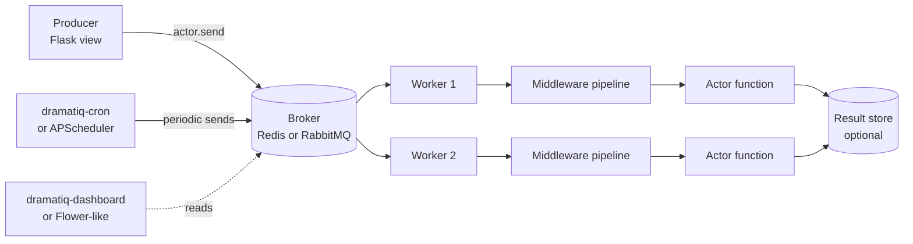
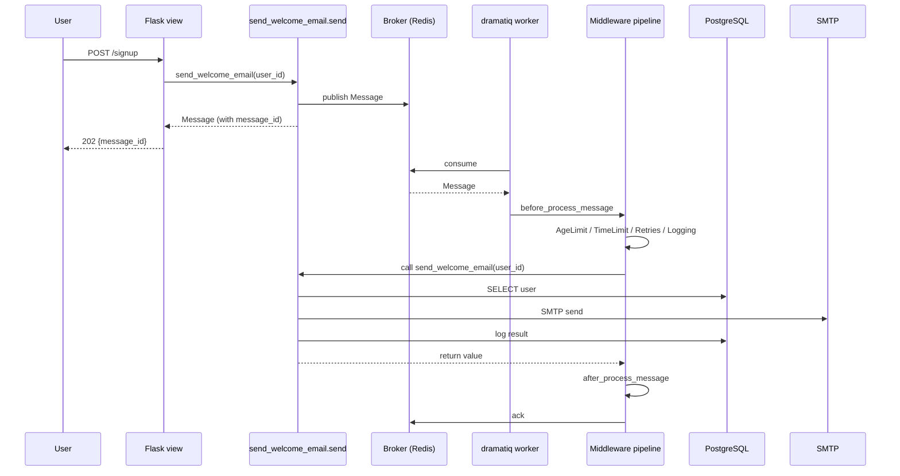
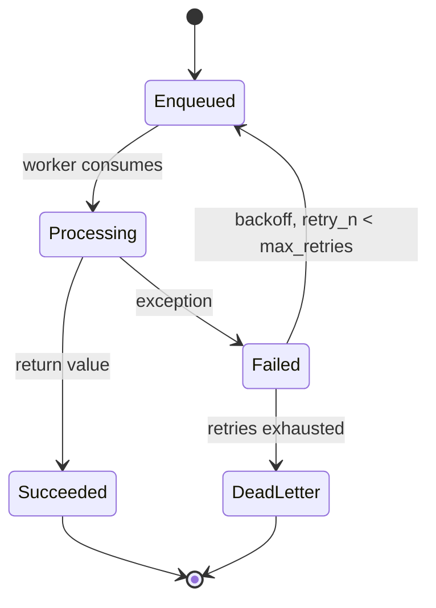
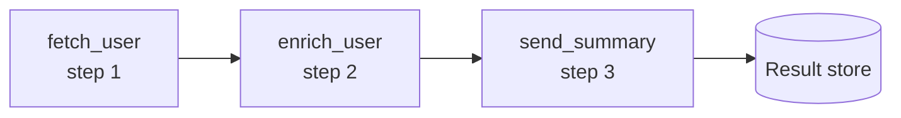
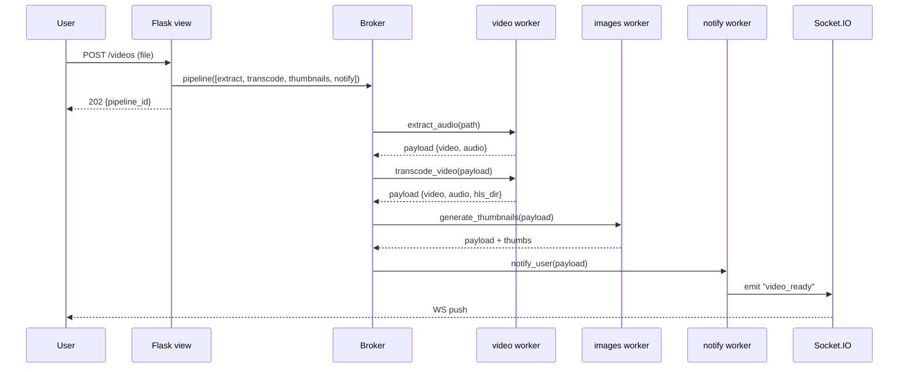

# Flask-Dramatiq

#flask #dramatiq #task-queue #background-tasks #redis #rabbitmq #middleware #actors

> [!info] Fast, reliable distributed task processing for Python
> **Dramatiq** is a task queue library designed to be fast, reliable, and easy to use. It bills itself as "a fast and reliable alternative to [[Celery]]" — the same broker model (Redis or RabbitMQ), the same actor pattern, but with a smaller, better-typed API surface, fewer global singletons, and an opinionated middleware pipeline that makes concerns like retries, logging, and rate-limiting pluggable without subclassing the worker.
>
> In Flask, Dramatiq is the right pick when you've outgrown [[Flask-RQ]]'s simplicity (single broker, tiny API) but find [[Celery]]'s ~300 config keys exhausting. It pairs cleanly with [[Flask-SQLAlchemy]], [[Flask-Mail]], and a Redis or RabbitMQ broker you may already operate.

Think of Dramatiq as a **messenger service with a chain of handlers**. Each actor is a courier who knows how to perform one specific job. When Flask hands the dispatcher a message ("send this email"), the message doesn't go straight to the courier — it walks through a security checkpoint, a logger, a retry-policy officer, a rate-limiter, and only then is handed to the courier (the actor). Each of those handlers is a **middleware**, and Dramatiq's defining feature is how cleanly they compose.

---

## 1. Overview & Metaphor

### Why Dramatiq exists

[[Celery]] and [[Flask-RQ]] both work, but each has a sharp edge:

- [[Celery]] is powerful but sprawling — global config, multiple import styles, `Task` vs `task`, result-backends that don't always behave the same.
- [[Flask-RQ]] is tiny but tied to Redis, uses pickle by default, and has no middleware pipeline (you must subclass the worker).

Dramatiq's design choices:

- **Actor-based, not class-based.** An actor is a regular function decorated with `@dramatiq.actor`. No `Task` base class, no `self`, no `bind=True` toggle.
- **Brokers are pluggable but only two are first-class.** `RedisBroker` and `RabbitmqBroker`. No SQS, no Kafka — by design.
- **Messages are explicit.** A `Message` is a typed envelope: `queue_name`, `actor_name`, `args`, `kwargs`, `options`, `timestamp`. You can log it, inspect it, retry it without touching the function.
- **Middleware is a first-class pipeline.** Every actor invocation passes through `before_process_message`, `after_process_message`, `on_skip_message`, etc. Dramatiq ships with middleware for **logging, callbacks, retries, age limiting, throttling, Prometheus metrics, and batching**.
- **No global broker by default.** You instantiate `broker = RedisBroker(...)`, register actors on it, and pass it to the worker. Multiple brokers in one process are supported.

### Dramatiq architecture



| Component | Role | Example |
|---|---|---|
| **Broker** | Message bus between producer and workers | `RedisBroker`, `RabbitmqBroker` |
| **Actor** | A registered function callable as `actor.send(*args)` | `@dramatiq.actor def send_email(...)` |
| **Message** | Serialized envelope: actor name, args, kwargs, options | `Message(queue, actor, args, kwargs, options, ...)` |
| **Worker** | Process that consumes messages and runs actors through middleware | `dramatiq myapp` |
| **Middleware** | Hooks that wrap every message lifecycle | `RetryMiddleware`, `Callbacks`, `AgeLimit`, `Throttling`, `Prometheus` |
| **Result backend** | Optional store for return values | `RedisBackend` (via `dramatiq.results`) |

> [!note] Why the broker is *not* the result backend
> Like [[Celery]], Dramatiq separates *messages to process* (broker) from *results to store* (backend). The default `RedisBroker` uses a Redis list for the queue; the optional `Results` middleware stores return values in a separate Redis hash. This keeps result reads from evicting pending tasks.

### How Dramatiq compares to [[Celery]] and [[Flask-RQ]]

| Dimension | Dramatiq | [[Celery]] | [[Flask-RQ]] |
|---|---|---|---|
| **Brokers** | Redis, RabbitMQ | Redis, RabbitMQ, SQS, Kafka | Redis only |
| **API surface** | ~30 functions/classes | Hundreds of options | ~10 functions |
| **Result backends** | Redis, Memcached (via middleware) | Redis, RPC, SQLAlchemy, Django, Memcached, Elasticsearch | Redis (same instance) |
| **Worker CLI** | `dramatiq myapp` | `celery -A myapp worker` | `rq worker queue` |
| **Concurrency model** | Threads (default), processes (via `--processes`) | Prefork, eventlet, gevent, threads | One process per worker |
| **Retries** | `RetryMiddleware` with exponential backoff | `self.retry(backoff=…)` | `Retry(max=…, interval=…)` |
| **Middleware** | First-class pipeline, ~6 built-in | Signals (`before_task_publish`, etc.) | Subclass `Worker` |
| **Scheduling** | `dramatiq-cron` or `periodic` middleware | Built-in `celery beat` | `rq-scheduler` (separate process) |
| **Result API** | `Result.get_result(message)` | `AsyncResult.get()` | `Job.result` |
| **Chains/groups** | `pipeline()`, `group()`, `as_completed()` | `chain`, `group`, `chord` | `depends_on=[...]` |
| **Code complexity** | Small, ~3k LOC, typed | Large, many modules | Tiny, ~1k LOC |
| **Best for** | Mid-size apps that want middleware clarity | Mission-critical, multi-region | Tiny Redis-only apps |

> [!tip] Choose Dramatiq when…
> …you want a Celery-shaped API (Redis or RabbitMQ broker, multi-process workers, retry-with-backoff) but find Celery's middleware story (signals) too implicit. Dramatiq's middleware pipeline is the cleanest of any Python task queue.

---

## 2. Installation

```bash
# Core Dramatiq + Redis broker
pip install "dramatiq[redis]>=1.16"

# RabbitMQ broker (alternative)
pip install "dramatiq[rabbitmq]>=1.16"

# Optional: result backend
pip install "dramatiq[redis]>=1.16"   # already included; uses Results middleware

# Optional: standard middleware set
pip install "dramatiq[watch]>=1.16"   # dev-time auto-reload on file changes

# Optional: Prometheus metrics middleware
pip install "dramatiq[prometheus]>=1.16"

# Optional: cron-style periodic tasks
pip install "periodic-dramatiq>=0.4"  # or "dramatiq-cron"

# Optional: web dashboard
pip install "dramatiq-dashboard>=0.2"

# Optional: Sentry SDK
pip install "sentry-sdk>=1.40"
```

> [!warning] Don't pin to Dramatiq 1.x without checking the changelog
> Dramatiq's `1.x` series is stable, but each minor release tends to add a new middleware or change broker defaults. Pin a known-good version (`dramatiq[redis]>=1.16,<1.17`) for production, and run the test suite on every upgrade.

### A minimal Redis + Dramatiq dev stack

```yaml
# docker-compose.yml
version: "3.9"
services:
  redis:
    image: redis:7-alpine
    ports: ["6379:6379"]
    command: ["redis-server", "--save", "60", "1", "--loglevel", "warning"]

  dramatiq-dashboard:
    image: birkoff/dramatiq-dashboard:latest
    ports: ["8080:8080"]
    environment:
      DRAMATIQ_BROKER_URL: "redis://redis:6379/0"
    depends_on: [redis]
```

```bash
docker compose up -d redis dramatiq-dashboard
dramatiq myapp                    # run worker(s) locally
# open http://localhost:8080
```

---

## 3. Configuration

### The `dramatiq_setup.py` module

Dramatiq is designed around an explicit `Broker` instance — there's no global `dramatiq.current_app` like Celery's. The recommended Flask pattern is a small factory:

```python
# myapp/dramatiq_setup.py
import os
import dramatiq
from dramatiq.brokers.redis import RedisBroker
from dramatiq.brokers.rabbitmq import RabbitmqBroker
from dramatiq.results import Results
from dramatiq.results.backends import RedisBackend
from dramatiq.middleware import (
    AgeLimit, TimeLimit, Callbacks, Pipelines, Retries,
    Prometheus, Logging, Middleware,
)

def make_broker(app):
    """Build a Dramatiq broker bound to app config."""
    url = app.config["DRAMATIQ_BROKER_URL"]
    if url.startswith("redis://"):
        broker = RedisBroker(url=url, middleware=[
            Logging(), AgeLimit(), TimeLimit(),
            Callbacks(), Pipelines(),
        ])
    elif url.startswith("amqp://"):
        broker = RabbitmqBroker(url=url, middleware=[
            Logging(), AgeLimit(), TimeLimit(),
            Callbacks(), Pipelines(),
        ])
    else:
        raise ValueError(f"unsupported broker URL: {url}")

    # Add retry middleware with sensible defaults
    broker.add_middleware(Retries(
        max_retries=app.config.get("DRAMATIQ_MAX_RETRIES", 3),
    ))

    # Optional: result backend
    if app.config.get("DRAMATIQ_RESULT_BACKEND"):
        backend = RedisBackend(url=app.config["DRAMATIQ_RESULT_BACKEND"])
        broker.add_middleware(Results(backend=backend))

    # Optional: Prometheus metrics
    if app.config.get("DRAMATIQ_PROMETHEUS_PORT"):
        broker.add_middleware(Prometheus())

    dramatiq.set_broker(broker)
    return broker
```

```python
# myapp/__init__.py
from flask import Flask
from myapp.dramatiq_setup import make_broker

def create_app(config="myapp.settings.Production"):
    app = Flask(__name__)
    app.config.from_object(config)

    # Build Dramatiq broker and bind to global registry
    broker = make_broker(app)
    app.extensions["dramatiq"] = broker

    # Import actors so they get registered on the broker
    from myapp import actors  # noqa: F401

    # Routes/blueprints/etc.
    from myapp.routes import bp
    app.register_blueprint(bp)

    return app
```

### Full configuration reference

| Key | Default | What it does |
|---|---|---|
| `DRAMATIQ_BROKER_URL` | `"redis://localhost:6379/0"` | Broker URL — `redis://` or `amqp://` |
| `DRAMATIQ_RESULT_BACKEND` | `None` | Redis URL for the `Results` middleware (optional) |
| `DRAMATIQ_MAX_RETRIES` | `3` | Default max retries for `Retries` middleware |
| `DRAMATIQ_PROMETHEUS_PORT` | `None` | If set, `Prometheus` middleware exposes metrics |
| `DRAMATIQ_AGE_LIMIT_MS` | `None` | Drop messages older than N ms (`AgeLimit` middleware) |
| `DRAMATIQ_TIME_LIMIT_MS` | `None` | Hard timeout per actor (`TimeLimit` middleware) |
| `DRAMATIQ_LOG_LEVEL` | `"INFO"` | Logging middleware verbosity |
| `DRAMATIQ_QUEUE_DEFAULT` | `"default"` | Default queue name for actors without explicit `queue_name=` |

```python
# myapp/settings.py
class Production:
    DRAMATIQ_BROKER_URL = "redis://redis.internal:6379/0"
    DRAMATIQ_RESULT_BACKEND = "redis://redis.internal:6379/1"
    DRAMATIQ_MAX_RETRIES = 5
    DRAMATIQ_AGE_LIMIT_MS = 60 * 60 * 1000   # 1 hour
    DRAMATIQ_TIME_LIMIT_MS = 60 * 5 * 1000   # 5 min hard ceiling
    DRAMATIQ_PROMETHEUS_PORT = 9191

class Testing:
    DRAMATIQ_BROKER_URL = "redis://localhost:6379/15"
    # No result backend in tests; we use stubs
```

> [!tip] One Redis broker, separate result db
> If you use `RedisBroker(url=redis://host/0)` and `RedisBackend(url=redis://host/0)`, both write to the same db. Prefer different databases (`db=0` for the queue, `db=1` for results) so a long-running actor with a giant return value doesn't displace queued messages under memory pressure.

---

## 4. Basic Usage

### Defining actors

```python
# myapp/actors.py
import dramatiq
import time
from myapp.extensions import mail, db
from myapp.models import User, EmailLog
from flask_mail import Message
from flask import current_app, render_template

@dramatiq.actor(queue_name="email", max_retries=3, min_backoff_ms=5000)
def send_welcome_email(user_id: int):
    """Send a personalized welcome email to a new user."""
    with current_app.app_context():
        user = User.query.get(user_id)
        if not user:
            raise ValueError(f"no such user {user_id}")

        msg = Message(
            subject=f"Welcome to {current_app.config['SITE_NAME']}",
            recipients=[user.email],
            html=render_template("emails/welcome.html", user=user),
        )
        mail.send(msg)
        EmailLog.log(user.id, "welcome", "sent")
        db.session.commit()
        return {"user_id": user_id, "email": user.email}

@dramatiq.actor(queue_name="images", max_retries=2)
def generate_thumbnail(image_path: str, size: tuple = (128, 128)):
    """Generate a thumbnail for an uploaded image."""
    from PIL import Image
    img = Image.open(image_path)
    img.thumbnail(size)
    out_path = image_path.replace(".jpg", "_thumb.jpg")
    img.save(out_path, "JPEG", quality=85)
    return out_path
```

### Sending messages from a Flask view

```python
# myapp/routes.py
from flask import Blueprint, request, jsonify, current_app
from myapp.actors import send_welcome_email, generate_thumbnail
from dramatiq.message import get_message

bp = Blueprint("api", __name__, url_prefix="/api")

@bp.post("/signup")
def signup():
    # ... create user, save to DB ...
    user_id = 42

    # Send asynchronously — returns immediately with a Message object
    message = send_welcome_email.send(user_id)
    return jsonify({
        "user_id": user_id,
        "message_id": message.message_id,
        "queue": message.queue_name,
    }), 202

@bp.post("/upload")
def upload():
    file = request.files["file"]
    path = f"/tmp/{file.filename}"
    file.save(path)
    # Pass kwargs and even a delay (in ms)
    message = generate_thumbnail.send_with_options(
        args=(path,),
        kwargs={"size": (256, 256)},
        delay=1000,                # 1 second delay before processing
    )
    return jsonify({"message_id": message.message_id}), 202
```

### Retrieving results

```python
# myapp/routes.py (continued)
from dramatiq.results import Result
from dramatiq.results.errors import ResultMissing, ResultTimeout

@bp.get("/jobs/<message_id>")
def job_result(message_id: str):
    broker = current_app.extensions["dramatiq"]
    # Reconstruct a Message stub to fetch the result
    from dramatiq import Message
    msg = Message(
        queue_name="email",
        actor_name="send_welcome_email",
        args=(), kwargs={},
        options={},
        message_id=message_id,
    )
    try:
        result = Result.get_result(broker, msg, block=False)
        return jsonify({"status": "finished", "result": result})
    except ResultMissing:
        return jsonify({"status": "pending"}), 202
    except ResultTimeout:
        return jsonify({"status": "timeout"}), 504
```

### Running the worker

```bash
# Basic worker — discovers actors by importing myapp
dramatiq myapp

# Multiple workers & threads
dramatiq myapp --processes 4 --threads 4

# Watch for file changes (dev only)
dramatiq myapp --watch myapp --processes 2

# Limit to specific queues (priority order)
dramatiq myapp --queues email images default
```

> [!example] Worker process model
> Each `--processes N` forks N worker processes. Each process runs `--threads M` greenlet-style threads via `gevent` or threads (Dramatiq uses plain threads by default). Tasks share state inside a process; an actor that releases the GIL (numpy, IO) benefits from `--threads > 1`.



---

## 5. Intermediate Patterns

### Retries with exponential backoff

The `Retries` middleware (installed by default in `make_broker`) intercepts exceptions and re-publishes the message with a backoff delay. Configure per-actor:

```python
@dramatiq.actor(
    queue_name="email",
    max_retries=5,
    min_backoff_ms=5000,        # 5s first retry
    max_backoff_ms=600_000,     # cap at 10 min
)
def call_flaky_api(url: str):
    import requests
    r = requests.get(url, timeout=10)
    r.raise_for_status()
    return r.json()
```



> [!warning] Retries are not free
> If your actor is non-idempotent (e.g., "charge the customer $50"), a retry will charge them *again*. Use idempotency keys at the API call site or wrap the side effect in a check ("has this user been charged?").

### Message callbacks

The `Callbacks` middleware lets you enqueue a follow-up actor when a primary actor finishes (success or failure):

```python
@dramatiq.actor(queue_name="default")
def notify_admin(user_id, success: bool):
    ...

@dramatiq.actor(queue_name="email")
def send_welcome_email(user_id, *, callback=None):
    ...
    if callback:
        callback.send_with_options(args=(user_id, True))
```

### Pipelines (chains)

Use `dramatiq.pipeline()` to chain actors where each step receives the previous step's result:

```python
import dramatiq

@dramatiq.actor(queue_name="data")
def fetch_user(user_id):
    return {"id": user_id, "name": "Ada"}

@dramatiq.actor(queue_name="data")
def enrich_user(user_dict):
    user_dict["orders"] = fetch_orders_for(user_dict["id"])
    return user_dict

@dramatiq.actor(queue_name="data")
def send_summary(user_dict):
    send_email(user_dict["email"], f"Hi {user_dict['name']}, you have {len(user_dict['orders'])} orders")

# Chain: fetch → enrich → summarize
pipe = dramatiq.pipeline([
    fetch_user.message(42),
    enrich_user.message(),
    send_summary.message(),
]).run()
```



### Groups (fan-out / fan-in)

```python
import dramatiq
from dramatiq import group

@dramatiq.actor(queue_name="data")
def process_chunk(chunk_id):
    ...

@dramatiq.actor(queue_name="data")
def aggregate(results):
    ...

# Fan out 100 chunks, then aggregate
messages = [process_chunk.message(i) for i in range(100)]
g = group(messages).run()
# Wait for all (or use callbacks to aggregate when complete)
```

### Rate-limiting with the `Throttling` middleware

```python
from dramatiq.middleware import Middleware
import time

class Throttling(Middleware):
    """Limit actor to N messages per second."""
    def __init__(self, rate_per_second):
        self.rate = rate_per_second
        self.tokens = rate_per_second
        self.last_refill = time.monotonic()

    def before_process_message(self, broker, message):
        now = time.monotonic()
        elapsed = now - self.last_refill
        self.tokens = min(self.rate, self.tokens + elapsed * self.rate)
        self.last_refill = now
        if self.tokens < 1:
            # Re-queue with delay
            message.options["delay"] = int((1 - self.tokens) / self.rate * 1000)
            broker.enqueue(message, delay=message.options["delay"])
            return False  # skip processing
        self.tokens -= 1
        return True

# Register it
broker.add_middleware(Throttling(rate_per_second=10))
```

> [!note] Dramatiq ships a `throttling` middleware in `dramatiq.middleware` since 1.13 — use it instead of writing your own unless you need a custom rate-limit key (per-user, per-tenant).

---

## 6. Advanced Usage

### Custom middleware

A custom middleware lets you intercept every message lifecycle event. Common use cases: tracing, metrics, DB-session cleanup, tenant isolation.

```python
# myapp/middleware.py
import logging
import sentry_sdk
from dramatiq.middleware import Middleware

logger = logging.getLogger(__name__)

class FlaskAppContext(Middleware):
    """Push a Flask app context around every actor call."""

    def __init__(self, app):
        self.app = app

    def before_process_message(self, broker, message):
        self._ctx = self.app.app_context()
        self._ctx.push()
        sentry_sdk.set_tag("dramatiq.message_id", message.message_id)
        sentry_sdk.set_tag("dramatiq.actor", message.actor_name)

    def after_process_message(self, broker, message, *, result=None, exception=None):
        from myapp.extensions import db
        try:
            if exception is None:
                db.session.commit()
            else:
                db.session.rollback()
                sentry_sdk.capture_exception(exception)
        finally:
            db.session.remove()
            self._ctx.pop()

    def on_skip_message(self, broker, message):
        logger.warning(f"skipped message {message.message_id}")
```

```python
# In create_app()
broker.add_middleware(FlaskAppContext(app))
```

### Middleware pipeline order

```mermaid
flowchart LR
    M0[Broker consumes<br/>Message] --> M1[Logging<br/>before]
    M1 --> M2[AgeLimit<br/>before]
    M2 --> M3[TimeLimit<br/>before]
    M3 --> M4[Retries<br/>before]
    M4 --> M5[Callbacks<br/>before]
    M5 --> M6[Pipelines<br/>before]
    M6 --> A[Actor runs]
    A --> M6b[Pipelines<br/>after]
    M6b --> M5b[Callbacks<br/>after]
    M5b --> M4b[Retries<br/>after: maybe retry]
    M4b --> M3b[TimeLimit<br/>after]
    M3b --> M2b[AgeLimit<br/>after]
    M2b --> M1b[Logging<br/>after]
    M1b --> Ack[Broker acks]
```



> [!tip] Order matters
> Dramatiq runs middleware in registration order. Put **Logging** first (so you see all subsequent decisions), **AgeLimit** second (cheap filter), **TimeLimit** third (start the clock), **Retries** last (so retries see the result of every other middleware's `after_process_message`).

### Group callbacks / `as_completed`

```python
from dramatiq import group

# Fan out and stream results back as they finish
g = group(process_chunk.message(i) for i in range(100)).run()
for message in g.completed_messages:
    print(Result.get_result(broker, message))
```

### Daemon-less periodic tasks

For cron-style schedules without running a separate beat process, use the `periodic-dramatiq` package or wrap with [[Flask-APScheduler]]:

```python
# myapp/periodic.py
import dramatiq
from periodic import periodic

@periodic(cron="0 * * * *")  # every hour
@dramatiq.actor(queue_name="default")
def cleanup_expired_sessions():
    from myapp.models import Session
    Session.delete_expired()
```

### Stub broker for tests

```python
# tests/conftest.py
import pytest
from dramatiq.brokers.stub import StubBroker
from dramatiq import set_broker

@pytest.fixture
def broker():
    b = StubBroker()
    set_broker(b)
    yield b
    b.flush_all()

@pytest.fixture
def worker(broker):
    from dramatiq import Worker
    w = Worker(broker, worker_threads=1)
    w.start()
    yield w
    w.stop()
```

```python
# tests/test_actors.py
def test_send_welcome_email(broker, worker):
    send_welcome_email.send(42)
    worker.join()  # wait for the queue to drain
    broker.join()
    # assertions about side effects…
```

---

## 7. Common Pitfalls & Troubleshooting

### "Actor not found"

When the worker imports your app, it must register every actor on the broker. If you forget to import `myapp.actors` in `create_app()`, the worker boots with zero registered actors and silently drops messages.

**Fix**: `from myapp import actors  # noqa: F401` inside `create_app()`, or `dramatiq myapp.actors` on the CLI.

### "Messages stuck in queue"

- Is a worker running? `dramatiq-dashboard` shows queue depth and consumer count.
- Is the worker subscribed to the right queue? `dramatiq myapp --queues email default` — only those queues are consumed.
- Are messages expired via `AgeLimit`? Check `message.options["max_age_ms"]` vs. wall-clock age.

### "Retries don't seem to fire"

- `Retries` middleware must be installed: `broker.add_middleware(Retries(...))`.
- The actor's `max_retries` must be > 0 — by default Dramatiq disables retries unless you opt in.
- The exception must escape the actor — don't catch and return `None` inside the body.

### "TimeLimit killed my job but no traceback"

`TimeLimit` raises `dramatiq.middleware.TimeLimitExceeded` in a *separate* thread, so the actor's traceback is lost. Wrap your actor body in a `try/except` and log on the way out, or use the `Logging` middleware to capture the worker's stderr.

### "Out of memory under heavy load"

Dramatiq's default worker runs `--threads 8` per process. For memory-heavy actors, drop `--threads 1` and use `--processes N` for parallelism — this gives each task its own memory space.

### "RabbitMQ messages disappear after restart"

The default `RabbitmqBroker` doesn't enable confirms or persistent messages. Set `confirm_delivery=True` and use `durable=True` queues:

```python
broker = RabbitmqBroker(
    url=url,
    confirm_delivery=True,
    queues={"email": {"durable": True}},
)
```

> [!example] Diagnostic flowchart
> ```mermaid
> flowchart TD
>     A[Message stuck] --> B{Worker running?}
>     B -- no --> C[dramatiq myapp]
>     B -- yes --> D{Right queue?}
>     D -- no --> E[--queues email default]
>     D -- yes --> F{Actor imported?}
>     F -- no --> G[from myapp import actors]
>     F -- yes --> H{AgeLimit dropped it?}
>     H -- yes --> I[raise max_age_ms]
>     H -- no --> J[check worker logs / Sentry]
> ```

---

## 8. Best Practices

1. **One broker instance per app.** Build it in `create_app()`, attach to `app.extensions["dramatiq"]`, and call `dramatiq.set_broker()` once. Don't instantiate brokers inside request handlers.
2. **Push the Flask app context in middleware.** Actors that touch `current_app` (DB, mail, config) need `app.app_context()` pushed around the call — use a `FlaskAppContext` middleware (see §6) instead of wrapping every actor.
3. **Pass IDs, not objects.** Messages are JSON-serialized (Dramatiq uses `msgpack` over Redis, `pickle` over RabbitMQ by default — be explicit). A SQLAlchemy object won't survive the trip; pass `user_id` and re-fetch inside.
4. **Always set `max_retries` and `min_backoff_ms`.** Defaults of `max_retries=0` mean any exception kills the job permanently. Sensible starting point: `max_retries=3, min_backoff_ms=5000, max_backoff_ms=600_000`.
5. **Make actors idempotent.** Retries mean a single message may run multiple times. Use unique constraints and idempotency keys.
6. **Use separate queues per workload.** `email` (fast IO) and `images` (slow CPU) shouldn't share. Workers subscribe in priority order.
7. **Install `Prometheus` middleware in production.** It exposes a `/metrics` endpoint you can scrape with Prometheus + Grafana.
8. **Pin Dramatiq to a minor version.** Each minor release may change broker defaults. Read the changelog before bumping.
9. **Use the `StubBroker` in tests.** It runs synchronously, no Redis required, and lets you assert on the message log.
10. **Don't put long-running loops in a single actor.** Split into chunks and use `group()` for parallelism; one slow actor will tie up a worker slot for minutes.

---

## 9. Integration with Other Extensions

### [[Flask-Mail]] — async email

```python
@dramatiq.actor(queue_name="email", max_retries=3, min_backoff_ms=5000)
def send_email(to: str, subject: str, template: str, **ctx):
    from flask import render_template
    from myapp.extensions import mail
    from flask_mail import Message
    msg = Message(
        subject=subject,
        recipients=[to],
        html=render_template(template, **ctx),
    )
    mail.send(msg)
```

### [[Flask-SQLAlchemy]] — DB-bound jobs

```python
class DBSession(Middleware):
    """Commit on success, rollback on exception, always clean up."""
    def after_process_message(self, broker, message, *, result=None, exception=None):
        from myapp.extensions import db
        try:
            if exception is None:
                db.session.commit()
            else:
                db.session.rollback()
        finally:
            db.session.remove()
```

### [[Flask-Caching]] — sharing Redis

If both Dramatiq and [[Flask-Caching]] use the same Redis, separate them by `db=` (queue on db=0, cache on db=2). Dramatiq uses `RPUSH`/`LPOP` on lists keyed `dramatiq.default.*` — these won't collide with Flask-Caching's `flask_cache_*` keys, but `maxmemory` evictions can still kill either.

### [[Flask-SocketIO]] — real-time progress

Pair Dramatiq's `Prometheus` middleware (or a custom progress middleware) with [[Flask-SocketIO]] for live progress bars. The worker emits an event when a stage completes; the web process relays it to the browser.

### [[Celery]] — when to migrate

If you need SQS, Kafka, multi-region workers, or Celery's chord primitive, migrate. The patterns map cleanly:

- `@dramatiq.actor` ≈ `@celery_app.task`
- `actor.send(...)` ≈ `task.delay(...)`
- `pipeline([a.message(), b.message()])` ≈ `chain(a.s() | b.s())`
- `group([...]).run()` ≈ `group([...]).apply_async()`
- `Retries` middleware ≈ `self.retry(backoff=...)`

---

## 10. Real-World Example

A video-transcoding pipeline:
1. User uploads a video (Flask view saves it to disk + DB).
2. View enqueues a Dramatiq pipeline: `extract_audio → transcode_video → generate_thumbnails → notify_user`.
3. Each step is its own actor with its own queue, retry policy, and timeout.
4. The final step pushes a Socket.IO event so the user's browser refreshes.

```python
# myapp/actors/transcode.py
import dramatiq
import subprocess
import os

@dramatiq.actor(
    queue_name="video",
    max_retries=2,
    min_backoff_ms=10_000,
    time_limit_ms=60 * 10 * 1000,    # 10 min
)
def extract_audio(video_path: str) -> dict:
    audio_path = video_path.replace(".mp4", ".aac")
    subprocess.run(
        ["ffmpeg", "-i", video_path, "-vn", "-acodec", "copy", audio_path],
        check=True,
    )
    return {"video": video_path, "audio": audio_path}

@dramatiq.actor(queue_name="video", max_retries=1)
def transcode_video(payload: dict) -> dict:
    video_path = payload["video"]
    hls_dir = video_path.replace(".mp4", "_hls")
    os.makedirs(hls_dir, exist_ok=True)
    subprocess.run(
        ["ffmpeg", "-i", video_path, "-codec:", "copy",
         "-start_number", "0", "-hls_time", "10",
         "-hls_list_size", "0", "-f", "hls",
         os.path.join(hls_dir, "stream.m3u8")],
        check=True,
    )
    payload["hls_dir"] = hls_dir
    return payload

@dramatiq.actor(queue_name="images", max_retries=1)
def generate_thumbnails(payload: dict) -> dict:
    subprocess.run(
        ["ffmpeg", "-i", payload["video"], "-vf", "fps=1/30",
         os.path.join(payload["hls_dir"], "thumb_%03d.jpg")],
        check=True,
    )
    return payload

@dramatiq.actor(queue_name="notify", max_retries=5)
def notify_user(payload: dict):
    from flask import current_app
    from myapp.extensions import socketio
    user_id = payload["user_id"]
    with current_app.app_context():
        socketio.emit(
            "video_ready",
            {"video_id": payload["video_id"], "hls_dir": payload["hls_dir"]},
            room=f"user_{user_id}",
        )

# In the Flask view
from dramatiq import pipeline

@bp.post("/videos")
def upload_video():
    file = request.files["file"]
    path = f"/uploads/{file.filename}"
    file.save(path)
    pipe = pipeline([
        extract_audio.message(path),
        transcode_video.message(),
        generate_thumbnails.message(),
        notify_user.message(),
    ]).run()
    return jsonify({"pipeline_id": pipe.message_id}), 202
```



---

## 11. References

- **Official docs**: <https://dramatiq.io>
- **Source repo**: <https://github.com/Bogdanp/dramatiq>
- **Reference guide**: <https://dramatiq.io/reference.html>
- **Middleware recipes**: <https://dramatiq.io/recipes.html>
- **dramatiq-cron**: <https://github.com/Bogdanp/dramatiq-cron>
- **dramatiq-dashboard**: <https://github.com/Bogdanp/dramatiq-dashboard>
- **Companion notes**: [[Celery]], [[Flask-RQ]], [[Flask-Huey]], [[Flask-APScheduler]]
- **Internal patterns**: [[Project-Structure]], [[Performance-Optimization]], [[Security-Best-Practices]]

> [!quote] Bogdan Popa, Dramatiq author
> "Dramatiq is a distributed task processing library for Python with a focus on reliability, correctness and ease of use. It aims to be a fast and reliable alternative to Celery."

Related pages you should read next:
- [[Celery]] — for the comparison baseline
- [[Flask-RQ]] — for when Dramatiq is overkill
- [[Flask-Huey]] — for an even lighter alternative
- [[Flask-APScheduler]] — for in-process scheduling without a separate worker
