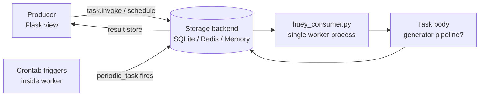
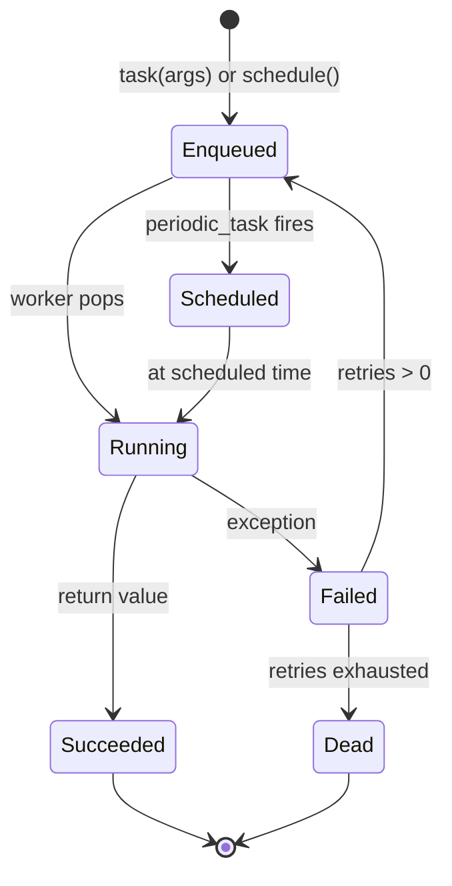
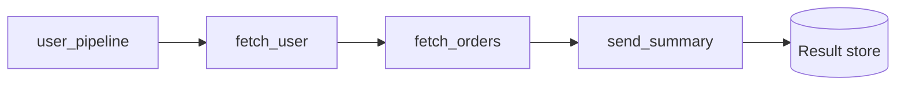
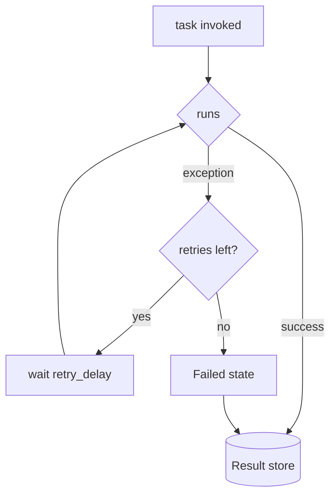
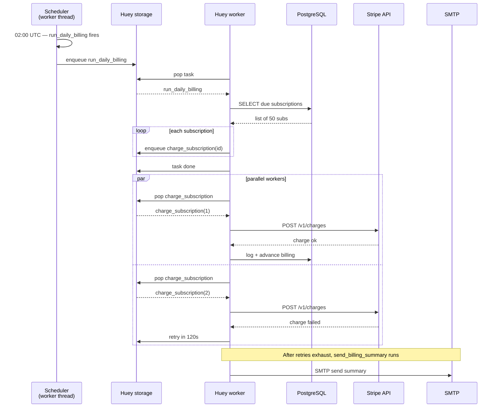

# Flask-Huey

#flask #huey #task-queue #background-tasks #sqlite #redis #crontab #lightweight

> [!info] A lightweight alternative to [[Celery]]
> **Huey** is a small task queue for Python. Its tagline is "a little task queue for python" and it lives up to it: the entire library is ~2k LOC, the public API is six decorators, and the default storage backend is **SQLite** — no Redis required. Despite its size, Huey supports periodic (cron-style) tasks, retries, task pipelines, locking, and result storage.
>
> In Flask, Huey is the right pick when you want background processing for a small-to-medium app — welcome emails, daily rollups, periodic scrapes — without standing up a Redis/RabbitMQ cluster. For a hobby project on a single VPS, Huey with a SQLite backend is essentially zero new infrastructure.

Think of Huey as a **take-a-number deli**. The Flask view walks up to the counter, pulls a ticket ("job 7"), and writes the order on a sticky note that goes into the queue. The single cook (worker process) calls numbers in order, makes the food, and writes the result back on the ticket. The customer can come back later and ask "what happened to ticket 7?" — that's `task_result.store.get()`.

---

## 1. Overview & Metaphor

### Why Huey exists

[[Celery]] is a freight truck. [[Flask-RQ]] is a courier with one bicycle. **Huey is a corner-shop deli** — it can do most of what you need with far less infrastructure:

- **No external broker required.** Storage backends: SQLite (default), Redis, in-memory. SQLite is just a file on disk.
- **Single worker process by default.** `huey_consumer.py myapp.huey` is one process; no prefork pool, no concurrency tuning.
- **Periodic tasks built-in.** `@huey.periodic_task(crontab(...))` is part of the core API — no separate beat process.
- **Generators as pipelines.** Yield another task from inside a task and Huey enqueues it after the current one finishes.
- **Task locking.** `@huey.lock_task('lock-name')` prevents concurrent execution — handy for batch jobs that shouldn't overlap.

### Huey architecture



| Component | Role | Example |
|---|---|---|
| **Huey instance** | The task registry + storage backend binding | `huey = SqliteHuey("myapp")` |
| **Producer** | Anything that calls `task(...)` | Flask view, CLI, another task |
| **Storage backend** | Persists queue, results, schedule | `SqliteStorage`, `RedisStorage`, `MemoryStorage` |
| **Worker** | Process that pops tasks off the queue and runs them | `huey_consumer.py myapp.huey` |
| **Periodic task** | A task scheduled by cron expression, fired by the worker's internal scheduler loop | `@huey.periodic_task(crontab(minute='0', hour='7'))` |

> [!note] Huey is *not* distributed by default
> The canonical Huey setup runs one worker process against one storage backend. You can scale horizontally by running multiple workers against the same Redis backend (Huey uses `BRPOP` so each task is delivered to exactly one worker), but the SQLite backend is effectively single-writer. If you need multi-host fan-out, prefer [[Celery]] or [[Flask-Dramatiq]].

### How Huey compares to [[Celery]] and [[Flask-APScheduler]]

| Dimension | Huey | [[Celery]] | [[Flask-APScheduler]] |
|---|---|---|---|
| **Brokers/backends** | SQLite, Redis, Memory | Redis, RabbitMQ, SQS, Kafka | Memory, SQLAlchemy, MongoDB, Redis |
| **External infra required?** | No (SQLite) | Yes (Redis/RabbitMQ) | No (memory) |
| **Worker process required?** | Yes | Yes | No (in-process) |
| **Periodic tasks** | First-class `@periodic_task(crontab(...))` | `celery beat` separate process | Triggers: cron, interval, date |
| **Concurrency model** | Single process, threads optional | Prefork, eventlet, gevent | Thread/process pool inside the scheduler |
| **Retries** | `retries=N, retry_delay=…` on decorator | `self.retry(backoff=…)` | Manual via `add_job` |
| **Pipelines/chains** | Generators (`yield other_task(...)`) | `chain`, `group`, `chord` | None first-class |
| **Result API** | `huey.result(task)` → return value | `AsyncResult.get()` | `job.next_run_time` |
| **Locking** | `@huey.lock_task('name')` | `cache.lock(...)` (manual) | `coalesce=True` on triggers |
| **Code size** | ~2k LOC | ~50k LOC | ~5k LOC |
| **Best for** | Small single-host Flask apps with cron needs | Mission-critical, distributed, multi-broker | In-process scheduling, no worker at all |

> [!tip] Choose Huey when…
> …you're deploying a single-host Flask app and want both "fire this later" and "run this every hour" without standing up Redis. Choose [[Flask-APScheduler]] if you can run jobs inside the Flask web process itself (no separate worker). Choose [[Celery]] or [[Flask-Dramatiq]] the moment you need more than one worker host.

---

## 2. Installation

```bash
# Core Huey
pip install "huey>=2.5"

# Redis backend (optional — SQLite is the default and needs nothing extra)
pip install "redis>=5.0"

# Optional: process-pool concurrency (Huey's default is threads)
pip install "huey[gevent]"      # gevent-based worker
# or
pip install "huey[multiprocess]"  # process-pool worker

# Optional: better SQLite via APSW
pip install "apsw>=3.40"

# Optional: Sentry SDK for the worker
pip install "sentry-sdk>=1.40"
```

> [!warning] Huey 2.x is the current major version
> Huey 1.x used different decorator names (`queue_command`, `periodic_task`) and a different result API. If you're migrating from 1.x, expect to rename decorators and rewrite task invocation (`task.invoke(args)` → `task(args)`).

### A minimal Huey dev stack

Huey with SQLite needs **no Docker, no Redis, no separate process** for testing. For production you typically still want a worker process and optionally Redis:

```yaml
# docker-compose.yml (optional — only if you want Redis)
version: "3.9"
services:
  redis:
    image: redis:7-alpine
    ports: ["6379:6379"]
    command: ["redis-server", "--save", "60", "1", "--loglevel", "warning"]
```

```bash
# SQLite-backed — no Docker needed
huey_consumer.py myapp.huey -w 4 -k thread    # 4 worker threads

# Redis-backed
huey_consumer.py myapp.huey --huey-class myapp.huey_redis -w 4
```

---

## 3. Configuration

### The `huey.py` module

Like [[Celery]]'s `celery.py`, the recommended pattern is a dedicated module that constructs the `Huey` instance and binds it to the Flask app context:

```python
# myapp/huey.py
import os
from huey import Huey
from huey.backends.sqlite_backend import SqliteStorage
from huey.backends.redis_backend import RedisStorage
from flask import Flask

def make_huey(app: Flask) -> Huey:
    """Build a Huey instance bound to the Flask app config."""
    backend = app.config["HUEY_BACKEND"]
    name = app.config.get("HUEY_NAME", "myapp")

    if backend == "sqlite":
        storage = SqliteStorage(name=name, path=app.config["HUEY_SQLITE_PATH"])
    elif backend == "redis":
        # redis_storage expects a Redis connection
        import redis
        conn = redis.from_url(app.config["HUEY_REDIS_URL"])
        storage = RedisStorage(name=name, conn=conn)
    elif backend == "memory":
        from huey.backends.memory_backend import MemoryStorage
        storage = MemoryStorage(name=name)
    else:
        raise ValueError(f"unsupported Huey backend: {backend}")

    huey = Huey(
        name=name,
        storage=storage,
        results=app.config.get("HUEY_STORE_RESULTS", True),
        store_errors=app.config.get("HUEY_STORE_ERRORS", True),
        utc=app.config.get("HUEY_UTC", True),
        immediate=app.config.get("HUEY_IMMEDIATE", False),    # run inline (tests)
        flush_locks_at_shutdown=True,
    )

    # Import tasks so they register on the huey instance
    from myapp import tasks  # noqa: F401
    return huey
```

```python
# myapp/__init__.py
from flask import Flask
from myapp.huey import make_huey

def create_app(config="myapp.settings.Production"):
    app = Flask(__name__)
    app.config.from_object(config)
    app.extensions["huey"] = make_huey(app)

    from myapp.routes import bp
    app.register_blueprint(bp)
    return app
```

### Full configuration reference

| Key | Default | What it does |
|---|---|---|
| `HUEY_BACKEND` | `"sqlite"` | Storage: `sqlite`, `redis`, `memory` |
| `HUEY_NAME` | `"myapp"` | Namespace for queue keys / SQLite table |
| `HUEY_SQLITE_PATH` | `"/var/lib/myapp/huey.sqlite"` | Path to the SQLite file |
| `HUEY_REDIS_URL` | `"redis://localhost:6379/0"` | Redis URL when backend=redis |
| `HUEY_STORE_RESULTS` | `True` | Whether return values are persisted |
| `HUEY_STORE_ERRORS` | `True` | Whether to persist error tracebacks |
| `HUEY_UTC` | `True` | Use UTC for all scheduling |
| `HUEY_IMMEDIATE` | `False` | If True, tasks run synchronously (tests/debug) |
| `HUEY_WORKER_TYPE` | `"thread"` | `thread`, `process`, `greenlet` |
| `HUEY_WORKERS` | `1` | Number of concurrent workers |
| `HUEY_MAX_DELAY` | `None` | Max retry delay (s) |
| `HUEY_DEFAULT_RETRY_DELAY` | `0` | Default delay between retries (s) |

```python
# myapp/settings.py
class Production:
    HUEY_BACKEND = "redis"
    HUEY_REDIS_URL = "redis://redis.internal:6379/2"
    HUEY_STORE_RESULTS = True
    HUEY_UTC = True
    HUEY_IMMEDIATE = False
    HUEY_WORKER_TYPE = "thread"
    HUEY_WORKERS = 4

class Testing:
    HUEY_BACKEND = "memory"
    HUEY_IMMEDIATE = True     # run synchronously; no worker needed
    HUEY_STORE_RESULTS = True
```

> [!tip] Use `HUEY_IMMEDIATE = True` in tests
> Setting `immediate=True` makes Huey run tasks synchronously in-process: `task(args)` runs the function and returns its result immediately. Combined with the `MemoryStorage` backend, this gives you a fully hermetic test suite — no SQLite file, no Redis, no worker process.

---

## 4. Basic Usage

### Defining tasks

```python
# myapp/tasks.py
from myapp import huey  # the Huey instance from create_app()
from myapp.extensions import mail, db
from myapp.models import User, EmailLog
from flask_mail import Message
from flask import current_app, render_template

@huey.task()
def send_welcome_email(user_id: int):
    """Send a personalized welcome email."""
    user = User.query.get(user_id)
    if not user:
        raise ValueError(f"no such user {user_id}")
    msg = Message(
        subject=f"Welcome to {current_app.config['SITE_NAME']}",
        recipients=[user.email],
        html=render_template("emails/welcome.html", user=user),
    )
    mail.send(msg)
    EmailLog.log(user.id, "welcome", "sent")
    db.session.commit()
    return {"user_id": user_id, "email": user.email}

@huey.task(retries=3, retry_delay=60)
def fetch_from_slow_api(url: str):
    """Fetch JSON from a slow third-party API."""
    import requests
    r = requests.get(url, timeout=10)
    r.raise_for_status()
    return r.json()

@huey.periodic_task(crontab(minute="0", hour="7"))
def send_daily_digest():
    """Every day at 07:00 UTC, send a digest email to all subscribers."""
    for user in User.query.filter_by(active=True).all():
        send_welcome_email(user.id)   # enqueue sub-task
```

### Invoking tasks from a Flask view

```python
# myapp/routes.py
from flask import Blueprint, request, jsonify, current_app
from myapp.tasks import send_welcome_email, fetch_from_slow_api

bp = Blueprint("api", __name__, url_prefix="/api")

@bp.post("/signup")
def signup():
    user_id = 42
    # Huey task invocation is just calling the decorated function
    result = send_welcome_email(user_id)

    # `result` is a TaskWrapper — call .get() to block for the result
    # (rarely useful in a Flask view; usually you just poll by id)
    return jsonify({
        "user_id": user_id,
        "task_id": result.task.id,
    }), 202

@bp.post("/fetch")
def fetch():
    url = request.json["url"]
    # Schedule to run in 10 seconds
    result = fetch_from_slow_api.schedule(args=(url,), delay=10)
    return jsonify({"task_id": result.task.id}), 202

@bp.get("/tasks/<task_id>")
def task_status(task_id: str):
    huey = current_app.extensions["huey"]
    result = huey.result(task_id, blocking=False)
    if result is None:
        return jsonify({"status": "pending"}), 202
    return jsonify({"status": "finished", "result": result})
```

### Running the worker

```bash
# Basic worker — single thread
huey_consumer.py myapp.huey

# Multiple worker threads
huey_consumer.py myapp.huey -w 4 -k thread

# Process pool (for CPU-bound tasks)
huey_consumer.py myapp.huey -w 4 -k process

# Logging
huey_consumer.py myapp.huey -l INFO

# Periodic scheduler enabled by default; disable with -n
huey_consumer.py myapp.huey -n    # don't run periodic tasks
```

> [!example] Worker lifecycle
> 1. Worker imports `myapp.huey` to obtain the `Huey` instance.
> 2. Worker boots the consumer loop: a thread for periodic-task scheduling, a thread pool for task execution, a thread for reading the queue.
> 3. Queue reader pops a task from storage and hands it to the worker pool.
> 4. Worker thread runs the task body; on exception, retries (if `retries > 0`).
> 5. Result is stored in the storage backend.
> 6. Loop forever (or until SIGTERM).



---

## 5. Intermediate Patterns

### Task pipelines via generators

Huey's signature feature: a task that `yield`s another task creates a sequential pipeline. Huey runs the first task, then enqueues the yielded task with the first task's return value as its argument.

```python
@huey.task()
def fetch_user(user_id: int) -> dict:
    return {"id": user_id, "name": "Ada"}

@huey.task()
def fetch_orders(user_dict: dict) -> dict:
    user_dict["orders"] = [{"id": 1, "total": 99.0}]
    return user_dict

@huey.task()
def send_summary(user_dict: dict):
    msg = Message(
        subject="Your orders",
        recipients=[user_dict["email"]],
        body=f"Hi {user_dict['name']}, you have {len(user_dict['orders'])} orders.",
    )
    mail.send(msg)

@huey.task()
def user_pipeline(user_id: int):
    # The yielded tasks are enqueued after each step completes
    user = fetch_user(user_id)
    yield fetch_orders(user)
    yield send_summary(user)
```



### Periodic tasks with crontab

Huey's `crontab()` mirrors the Unix cron syntax:

```python
from huey import crontab

# Every hour at minute 0
@huey.periodic_task(crontab(minute="0"))
def hourly_cleanup():
    ...

# Every Monday at 09:00 UTC
@huey.periodic_task(crontab(minute="0", hour="9", day_of_week="mon"))
def weekly_report():
    ...

# Every 15 minutes during business hours
@huey.periodic_task(crontab(minute="*/15", hour="9-17"))
def refresh_cache():
    ...

# First day of every month at midnight
@huey.periodic_task(crontab(minute="0", hour="0", day_of_month="1"))
def monthly_billing():
    ...
```

### Task locking

Prevent concurrent execution of the same task — useful for batch jobs that shouldn't overlap with themselves:

```python
from huey import lock_task

@huey.periodic_task(crontab(minute="*/30"))
@huey.lock_task("refresh-cache-lock")
def refresh_cache():
    """Only one instance can run at a time; others skip."""
    # ... expensive cache refresh ...
```

If a second invocation tries to run while the lock is held, it logs a warning and returns immediately (the lock is released when the task body exits, even on exception).

### Retries with delay

```python
@huey.task(retries=5, retry_delay=60)  # 5 retries, 60s apart
def fetch_with_retries(url: str):
    r = requests.get(url, timeout=10)
    r.raise_for_status()
    return r.json()

# Exponential backoff is not built-in — implement via retry_delay callback
@huey.task(retries=5)
def fetch_with_backoff(url: str):
    try:
        r = requests.get(url, timeout=10)
        r.raise_for_status()
        return r.json()
    except Exception as exc:
        # Schedule next attempt with exponential delay
        attempt = ... # track in task metadata
        delay = min(2 ** attempt * 30, 600)
        raise huey.RetryTaskError(delay=delay) from exc
```



### Task scheduling (one-off)

```python
# Run once, 1 hour from now
send_welcome_email.schedule(args=(42,), delay=3600)

# Run at a specific datetime
from datetime import datetime, timezone, timedelta
eta = datetime.now(timezone.utc) + timedelta(hours=1)
send_welcome_email.schedule(args=(42,), eta=eta)
```

---

## 6. Advanced Usage

### Custom storage backend

If you need to use PostgreSQL, MongoDB, or anything else as the queue store, subclass `huey.api.Storage`:

```python
from huey.api import Huey, Storage
import psycopg2

class PostgresStorage(Storage):
    """Minimal Postgres storage (production needs pooling + transactions)."""
    def __init__(self, name, dsn):
        super().__init__(name)
        self.conn = psycopg2.connect(dsn)
        self.conn.autocommit = True
        self._init_schema()

    def _init_schema(self):
        with self.conn.cursor() as cur:
            cur.execute("""
                CREATE TABLE IF NOT EXISTS huey_queue (
                    id BIGSERIAL PRIMARY KEY,
                    queue_name TEXT NOT NULL,
                    payload BYTEA NOT NULL
                )
            """)
            cur.execute("""
                CREATE TABLE IF NOT EXISTS huey_results (
                    task_id TEXT PRIMARY KEY,
                    payload BYTEA,
                    created_at TIMESTAMPTZ DEFAULT NOW()
                )
            """)

    def enqueue(self, data):
        with self.conn.cursor() as cur:
            cur.execute(
                "INSERT INTO huey_queue (queue_name, payload) VALUES (%s, %s)",
                (self.name, psycopg2.Binary(data)),
            )

    def dequeue(self):
        with self.conn.cursor() as cur:
            cur.execute("""
                DELETE FROM huey_queue
                WHERE id = (
                    SELECT id FROM huey_queue
                    WHERE queue_name = %s
                    ORDER BY id LIMIT 1 FOR UPDATE SKIP LOCKED
                ) RETURNING payload
            """, (self.name,))
            row = cur.fetchone()
            return bytes(row[0]) if row else None
```

### Custom signal handlers

Huey emits signals you can subscribe to for logging, metrics, Sentry capture:

```python
from huey.signals import SIGNAL_ERROR, SIGNAL_COMPLETE, SIGNAL_SCHEDULING

@huey.signal(SIGNAL_ERROR)
def on_error(signal, task, exc=None):
    import sentry_sdk
    sentry_sdk.capture_exception(exc)
    current_app.logger.exception(f"task {task.id} failed: {exc}")

@huey.signal(SIGNAL_COMPLETE)
def on_complete(signal, task, result=None):
    current_app.logger.info(f"task {task.id} succeeded: {result!r}")

@huey.signal(SIGNAL_SCHEDULING)
def on_scheduling(signal, task, eta=None):
    current_app.logger.info(f"scheduled {task.id} for {eta}")
```

### Reading results by ID

```python
# In a Flask view
@bp.get("/tasks/<task_id>")
def get_result(task_id: str):
    huey = current_app.extensions["huey"]
    result = huey.result(task_id, blocking=False, preserve=True)
    if result is None:
        return jsonify({"status": "pending"}), 202
    if isinstance(result, Exception):
        return jsonify({"status": "failed", "error": str(result)}), 500
    return jsonify({"status": "finished", "result": result})
```

### Revoke / cancel a scheduled task

```python
task = send_welcome_email.schedule(args=(42,), delay=3600)

# Revoke before it runs
huey = current_app.extensions["huey"]
huey.revoke(task.task.id)
```

### Flask app context inside tasks

Tasks run in the worker process, not the web process — `current_app` is not pushed automatically. Either wrap each task body in `with app.app_context():`, or use a custom decorator:

```python
import functools
from flask import current_app

def with_app_context(task_fn):
    @functools.wraps(task_fn)
    def wrapper(*args, **kwargs):
        from myapp import create_app
        app = create_app()
        with app.app_context():
            return task_fn(*args, **kwargs)
    return wrapper

@huey.task()
@with_app_context
def long_running_db_job(user_id: int):
    # current_app, db.session, etc. all work here
    ...
```

---

## 7. Common Pitfalls & Troubleshooting

### "Tasks don't run — they sit in the queue forever"

- Is the worker running? `ps aux | grep huey_consumer`. Tasks don't self-process.
- Did you forget `huey_consumer.py myapp.huey` (correct module path)?
- Did `create_app()` import your `tasks` module? If tasks aren't imported, they aren't registered.

### "Periodic tasks don't fire"

- Is the worker running? Periodic scheduling is built into the worker process — there's no separate beat.
- Is `HUEY_UTC = True`? Timezone bugs are the #1 cause of "cron runs at the wrong time".
- Did you decorate with `@huey.periodic_task(crontab(...))` (not just `@huey.task()`)?

### "SQLite: `database is locked`"

SQLite is single-writer. With `HUEY_WORKERS > 1` or multiple worker processes, you'll hit `database is locked` under load. Solutions:

1. Stick to `HUEY_WORKERS = 1` with `-k thread` (Huey's consumer serializes writes).
2. Migrate to Redis backend (`HUEY_BACKEND = "redis"`).
3. Enable WAL mode: `PRAGMA journal_mode=WAL` on the SQLite file.

### "Result is `None` for a task that succeeded"

- Check `HUEY_STORE_RESULTS = True`.
- Results expire after `HUEY_RESULT_TTL` seconds (default 1 hour). Older reads return `None`.
- If `task.execute()` raises before returning, the result is the exception — call `huey.result(task_id, preserve=True)` to keep it.

### "Worker process leaks memory"

Huey doesn't recycle workers by default. For long-running workers with leaky tasks (PIL, numpy), restart the worker periodically via systemd or use `--max-tasks N` (Huey 2.5+):

```bash
huey_consumer.py myapp.huey --max-tasks 1000
```

### "Periodic task fires multiple times"

If you run multiple Huey workers against the same backend (e.g., Redis), periodic tasks fire on **every** worker because there's no leader election. Either:

1. Run only one worker process with periodic-task scheduling enabled (`-n` flag disables it on others).
2. Use `@huey.lock_task("name")` so concurrent executions are no-ops.

> [!example] Diagnostic flowchart
> ```mermaid
> flowchart TD
>     A[Task not running] --> B{Worker running?}
>     B -- no --> C[huey_consumer.py myapp.huey]
>     B -- yes --> D{Task imported?}
>     D -- no --> E[from myapp import tasks]
>     D -- yes --> F{Periodic task?}
>     F -- yes --> G[Check crontab + UTC]
>     F -- no --> H[Check queue in DB/Redis]
>     H --> I[Check worker logs]
> ```

---

## 8. Best Practices

1. **One Huey instance per app.** Build it in `create_app()` and attach to `app.extensions["huey"]`. Don't instantiate Huey inside request handlers.
2. **Wrap task bodies in app context.** Either via a `with_app_context` decorator or a worker-side hook that pushes context once per task.
3. **Pass IDs, not objects.** SQLAlchemy models don't pickle cleanly through SQLite's storage layer. Pass `user_id`, re-fetch inside the task.
4. **Use SQLite for dev, Redis for prod.** SQLite is great until you need more than one worker process — then it locks under contention.
5. **Make tasks idempotent.** Retries mean a task may run multiple times. Use DB unique constraints.
6. **Run one worker for periodic tasks.** Multiple workers against the same backend will all fire the same crontab. Use `@huey.lock_task` if you must scale horizontally.
7. **Set `retries` on network-bound tasks.** SMTP, third-party APIs, scrapers all benefit from `retries=3, retry_delay=60`.
8. **Use generators for pipelines.** `yield other_task(...)` is the cleanest way to chain sequential tasks in Huey.
9. **Test with `HUEY_IMMEDIATE = True`.** No worker, no SQLite file, no Redis — synchronous in-process execution.
10. **Recycle workers under leaky libraries.** `--max-tasks 1000` prevents PIL/numpy memory bloat.

---

## 9. Integration with Other Extensions

### [[Flask-Mail]] — async email

```python
@huey.task(retries=3, retry_delay=30)
def send_email(to: str, subject: str, template: str, **ctx):
    from flask import render_template
    from myapp.extensions import mail
    from flask_mail import Message
    msg = Message(
        subject=subject,
        recipients=[to],
        html=render_template(template, **ctx),
    )
    mail.send(msg)
```

### [[Flask-SQLAlchemy]] — DB-bound jobs

The big gotcha: tasks run in the worker process and need their own DB session lifecycle. Use a context manager:

```python
from contextlib import contextmanager

@contextmanager
def db_session():
    from myapp import create_app
    app = create_app()
    with app.app_context():
        from myapp.extensions import db
        try:
            yield db.session
            db.session.commit()
        except Exception:
            db.session.rollback()
            raise
        finally:
            db.session.remove()

@huey.task()
def rebuild_user_summary(user_id: int):
    with db_session() as session:
        from myapp.models import User, UserSummary
        u = session.get(User, user_id)
        UserSummary.rebuild(u)
```

### [[Flask-Caching]] — sharing Redis

If both Huey and [[Flask-Caching]] use Redis, separate by database number (`db=0` for cache, `db=2` for Huey). Huey's keys are prefixed with the `HUEY_NAME`, so they won't collide directly, but `maxmemory` evictions are global to the Redis instance.

### [[Flask-APScheduler]] — combining in-process + worker-based

A common pattern: use [[Flask-APScheduler]] for in-process ticks (every minute, fire-and-forget) that enqueue Huey tasks for the heavy lifting:

```python
# In the Flask web process
from apscheduler.schedulers.background import BackgroundScheduler
from myapp.tasks import send_daily_digest

scheduler = BackgroundScheduler()

@scheduler.scheduled_job("cron", hour=7, minute=0)
def trigger_digest():
    send_daily_digest()   # enqueues onto Huey

scheduler.start()
```

This keeps the scheduler in the web process (no separate beat process) while offloading the actual work to the Huey worker.

### [[Celery]] — when to migrate

Migrate when:
- You need multiple worker hosts (Huey + SQLite can't; Huey + Redis can but with caveats).
- You need chords, groups, or complex routing.
- You need SQS or Kafka.
- You need priority queues.

The patterns map cleanly:

- `@huey.task()` ≈ `@celery_app.task`
- `task(args)` ≈ `task.delay(args)`
- `@huey.periodic_task(crontab(...))` ≈ `beat_schedule` entry
- `yield other_task(...)` ≈ `chain(a.s() | b.s())`
- `@huey.lock_task("name")` ≈ `cache.lock(...)` (manual)

---

## 10. Real-World Example

A daily-billing pipeline:
1. **02:00 UTC**: `run_daily_billing` periodic task fires.
2. It acquires a lock so two workers can't double-bill.
3. It fetches all active subscriptions due today.
4. For each subscription, it enqueues `charge_subscription` as a sub-task (parallelism via the worker pool).
5. `charge_subscription` calls the payment gateway; on failure it retries 3 times.
6. After all charges, `send_billing_summary` emails finance.

```python
# myapp/tasks/billing.py
from myapp import huey
from huey import crontab, lock_task
from myapp.extensions import db, mail
from myapp.models import Subscription, BillingLog
from flask import current_app
from flask_mail import Message
import stripe

@huey.periodic_task(crontab(minute="0", hour="2"))
@huey.lock_task("daily-billing")
def run_daily_billing():
    """Daily billing: enqueue a charge for every due subscription."""
    from datetime import datetime, timezone
    today = datetime.now(timezone.utc).date()
    subs = Subscription.query.filter_by(active=True, next_billing_date=today).all()
    current_app.logger.info(f"enqueueing {len(subs)} charges")
    for sub in subs:
        charge_subscription(sub.id)   # generator-free sub-task invocation

@huey.task(retries=3, retry_delay=120)
def charge_subscription(subscription_id: int):
    sub = Subscription.query.get(subscription_id)
    if not sub:
        raise ValueError(f"no such subscription {subscription_id}")

    try:
        charge = stripe.Charge.create(
            amount=int(sub.amount * 100),
            currency="usd",
            customer=sub.user.stripe_customer_id,
            description=f"Subscription #{sub.id}",
        )
        BillingLog.log(sub.id, "succeeded", charge.id)
        db.session.commit()
        sub.advance_billing_date()
        db.session.commit()
        return {"subscription_id": sub.id, "charge_id": charge.id}
    except stripe.error.StripeError as exc:
        BillingLog.log(sub.id, "failed", str(exc))
        db.session.rollback()
        raise

@huey.task()
def send_billing_summary():
    from datetime import datetime, timezone
    today = datetime.now(timezone.utc).date()
    succeeded = BillingLog.query.filter_by(date=today, status="succeeded").count()
    failed = BillingLog.query.filter_by(date=today, status="failed").count()
    total = succeeded + failed
    msg = Message(
        subject=f"Daily billing summary — {today}",
        recipients=["finance@example.com"],
        body=f"Total: {total}\nSucceeded: {succeeded}\nFailed: {failed}",
    )
    mail.send(msg)

# Pipeline: run_daily_billing (periodic) → enqueues charge_subscription(s)
# After all done, you'd add a final task — see Huey's `pipeline` for ordering.
```



---

## 11. References

- **Official docs**: <https://huey.readthedocs.io>
- **Source repo**: <https://github.com/coleifer/huey>
- **Cron tab reference**: <https://huey.readthedocs.io/en/latest/api.html#huey.crontab>
- **Signals reference**: <https://huey.readthedocs.io/en/latest/signals.html>
- **Companion notes**: [[Celery]], [[Flask-RQ]], [[Flask-Dramatiq]], [[Flask-APScheduler]]
- **Internal patterns**: [[Project-Structure]], [[Performance-Optimization]], [[Security-Best-Practices]]

> [!quote] Coleifer, Huey author
> "Huey is a little task queue for python. It supports in-memory, sqlite, and redis storage backends, supports scheduling tasks to run at a certain time, supports retries, and is small enough to read in one sitting."

Related pages you should read next:
- [[Celery]] — for the comparison baseline
- [[Flask-RQ]] — Redis-only, slightly larger
- [[Flask-Dramatiq]] — middleware-pipeline alternative
- [[Flask-APScheduler]] — when you don't want a separate worker
