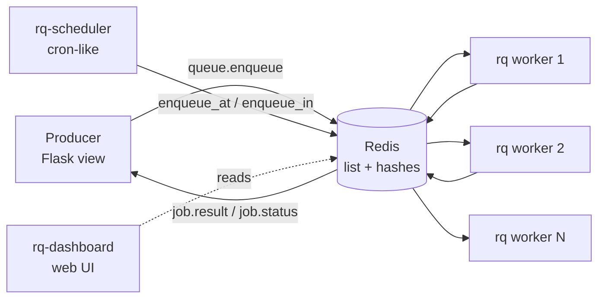
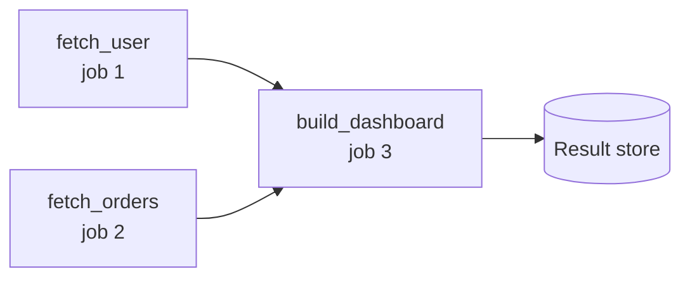
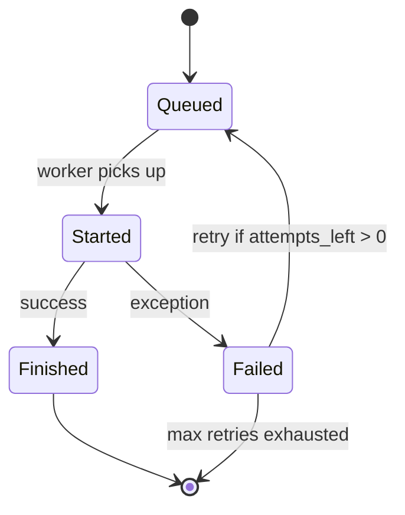
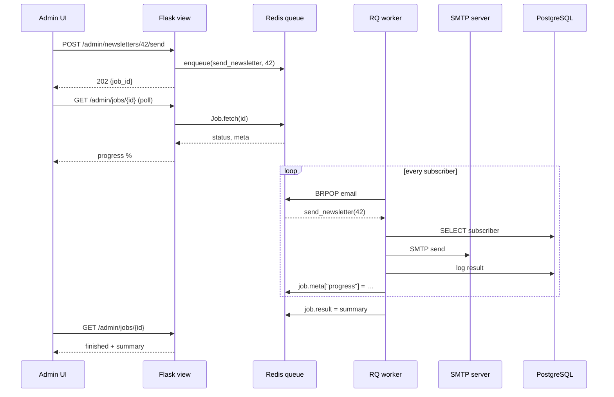

# Flask-RQ

#flask #rq #redis #task-queue #background-tasks #python-rq #rq-scheduler #workers

> [!info] Redis Queue — the lightweight Python task queue
> **RQ (Redis Queue)** is a simple Python library for queueing jobs and processing them in the background with workers. It is built on top of Redis' `LPUSH`/`BRPOP` primitives, which means it relies on plain Redis lists as queues. RQ is intentionally smaller than [[Celery]]: no AMQP, no complex routing topology, no protocol negotiation — just Python callables pushed onto a Redis list and popped by a worker process.
>
> In Flask, RQ shines for small-to-medium apps that already use Redis (for caching, sessions, rate limiting) and want a background-worker story without the cognitive load of Celery. It pairs naturally with [[Flask-Caching]], [[Flask-Mail]], and [[Flask-Limiter]] — all of which already have a Redis handle in the project.

Think of RQ as a **coffee shop order board**. The Flask view is the cashier — it writes the customer's order on a sticky note and slaps it on the board (a Redis list). One or more baristas (workers) pull sticky notes off the top, make the drink, and pin a "done" note next to the order number. The customer can later walk up and ask "is my latte ready?" by order number — that's `job.result`. There is no complex order-routing topology, no fair-trade-fair-trade-certified broker protocol; just sticky notes on a board.

> [!note] `flask-rq` vs `flask-rq2` vs `rq` directly
> The original `flask-rq` extension is essentially unmaintained. `flask-rq2` is a maintained fork that wires RQ into the Flask app factory pattern. In modern Flask projects, many developers skip both and just import `rq` directly, using a tiny `make_rq()` helper analogous to the `make_celery()` pattern from [[Celery]]. This guide shows the direct-integration approach because it is the most future-proof and the easiest to debug.

---

## 1. Overview & Metaphor

### Why RQ exists

[[Celery]] is the de-facto Python task queue, but it carries a lot of machinery: a broker-agnostic protocol, an actor-style result backend, prefetch accounting, a beat scheduler, configuration namespaces, and a CLI that has grown to dozens of flags. For an app with a handful of background jobs — send the welcome email, generate a thumbnail, fan out a webhook — Celery can feel like driving a freight truck to the corner store.

RQ was born from the opposite premise:

- **One broker, ever**: Redis. No RabbitMQ, no SQS, no ZooKeeper.
- **Picklable callables, not messages**: you enqueue `func, args, kwargs`; RQ pickles them and pushes the blob onto a Redis list.
- **Workers are Python processes**: `rq worker queue_name` is a one-liner CLI; no concurrency tuning, no prefork pool semantics.
- **Results live next to the queue**: the same Redis instance stores job state and return values, keyed by `job_id`.
- **Failure is visible**: failed jobs land in a *failed-queue* you can requeue with `rq requeue`.

### RQ architecture: the four pieces



| Component | Role | Example |
|---|---|---|
| **Producer** | Anything that calls `queue.enqueue()` or `func.delay()` | Flask view, CLI, another job |
| **Redis** | Holds the queue (a list), job metadata (hashes), and results (a key per `job_id`) | `redis://localhost:6379/0` |
| **Worker** | Process that pops a job, runs it, stores the result, moves to the next | `rq worker default` |
| **rq-scheduler** | Optional scheduler process that pushes deferred jobs onto their queue at the right time | `rqscheduler` |

> [!note] One Redis instance, many logical queues
> RQ uses a Redis *list* per queue (`rq:queue:default`, `rq:queue:email`, …). A worker subscribes to one or more queue names and `BRPOP`s them in priority order (the order you list them on the CLI). All queues live in the same Redis database; you can also use different Redis *databases* (db=0, db=1) to isolate workloads on a shared server.

### How RQ compares to [[Celery]]

| Dimension | RQ | [[Celery]] |
|---|---|---|
| **Broker support** | Redis only | Redis, RabbitMQ, SQS, Kafka (plugins) |
| **Result backend** | Same Redis instance | Redis, RPC, SQLAlchemy, Django ORM, Memcached, Elasticsearch |
| **Worker CLI** | `rq worker <queues>` | `celery -A app worker -Q <queues> -l info` |
| **Concurrency model** | One process per worker; `--with-scheduler` for in-process cron | Prefork pool (default), eventlet, gevent, threads |
| **Retries** | `@job(retries=N)` or manual `job.retry()` | `task.bind` + `self.retry(backoff=…, max_retries=…)` |
| **Scheduling** | Separate `rq-scheduler` process | Built-in `celery beat` |
| **Monitoring** | `rq-dashboard`, `rq info` | Flower, `celery inspect` |
| **Job dependencies** | First-class: `queue.enqueue_collapse()` / `depends_on=` | Chords, chains, groups (`group`, `chain`, `chord`) |
| **Result API** | `Job` object: `.result`, `.status`, `.return_value()` | `AsyncResult`: `.state`, `.result`, `.get()` |
| **Code complexity** | Tiny — ~1k LOC, single import | Large — many modules, transitive deps |
| **Best for** | Small apps, single-Redis infra, simple fan-out | Mission-critical, multi-broker, complex workflows |

> [!tip] Choose RQ when…
> …you already depend on Redis, you have fewer than ~50 distinct tasks, you don't need priority queues or complex routing, and you want a CLI you can teach a junior engineer in 5 minutes. Reach for [[Celery]] when you need RabbitMQ reliability, multi-region workers, chords, or heavy cron scheduling.

---

## 2. Installation

```bash
# Core RQ + Redis client
pip install "rq>=1.16"
pip install "redis>=5.0,<6.0"

# Optional: rq-scheduler for deferred/cron jobs
pip install "rq-scheduler>=0.13"

# Optional: web dashboard
pip install "rq-dashboard>=0.6"

# Optional: Sentry SDK for worker crash reporting
pip install "sentry-sdk>=1.40"

# Optional: click for CLI commands (Flask already pulls this in)
pip install "click>=8.1"
```

> [!warning] Redis version & client compatibility
> RQ ≥ 1.16 requires `redis-py >= 4.5`. If you also use [[Flask-Caching]] with an older `redis` pinned (e.g. `redis==3.5.x`), upgrade everything together — the Redis client changed its connection-pool API in 4.x and **cannot be mixed** in the same process.

### A minimal Redis + RQ dev stack with Docker

```yaml
# docker-compose.yml
version: "3.9"
services:
  redis:
    image: redis:7-alpine
    ports: ["6379:6379"]
    command: ["redis-server", "--save", "60", "1", "--loglevel", "warning"]

  rq-dashboard:
    image: eoranged/rq-dashboard:0.6.2
    ports: ["9181:9181"]
    environment:
      RQ_DASHBOARD_REDIS_URL: "redis://redis:6379/0"
    depends_on: [redis]
```

```bash
docker compose up -d redis rq-dashboard
rq worker default            # run worker locally
# open http://localhost:9181 for the dashboard
```

---

## 3. Configuration

The recommended pattern mirrors [[Celery]]'s `make_celery(app)` helper: create a small factory that binds RQ's `Queue` to the Flask app context.

```python
# myapp/rq_setup.py
import os
from rq import Queue
from redis import Redis
from flask import Flask

def make_redis(app: Flask) -> Redis:
    """Build a Redis connection from app config."""
    return Redis.from_url(
        app.config["RQ_REDIS_URL"],
        decode_responses=False,        # RQ expects bytes for pickle payloads
        socket_timeout=15,
        socket_connect_timeout=15,
        health_check_interval=30,
    )

def make_rq(app: Flask):
    """Bind RQ queues to the Flask app context."""
    connection = make_redis(app)

    class FlaskQueue(Queue):
        """Queue that runs jobs inside the Flask app context."""
        def _execute_job(self, job, connection):
            # The producer-side enqueue also needs app context for current_app.config
            with app.app_context():
                return super()._execute_job(job, connection)

    # Return a factory so different parts of the app can grab named queues
    def queue(name="default"):
        return FlaskQueue(name, connection=connection)

    return queue, connection
```

```python
# myapp/__init__.py
from flask import Flask
from myapp.rq_setup import make_rq

def create_app(config="myapp.settings.Production"):
    app = Flask(__name__)
    app.config.from_object(config)

    # RQ setup
    queue_factory, redis_conn = make_rq(app)
    app.extensions["rq"] = queue_factory
    app.extensions["redis"] = redis_conn

    # Register routes/blueprints, db, mail, etc.
    from myapp.routes import bp
    app.register_blueprint(bp)

    return app
```

### Full configuration reference

| Key | Default | What it does |
|---|---|---|
| `RQ_REDIS_URL` | `"redis://localhost:6379/0"` | Connection URL for the Redis used by RQ |
| `RQ_DEFAULT_QUEUE` | `"default"` | Name of the queue used when none is supplied |
| `RQ_ASYNC` | `True` | If `False`, jobs run synchronously (great for tests/debug) |
| `RQ_RESULT_TTL` | `500` (s) | How long to keep successful results in Redis |
| `RQ_FAILURE_TTL` | `1 year` (s) | How long to keep failed jobs |
| `RQ_JOB_TIMEOUT` | `180` (s) | Hard timeout per job; raises `rq.exceptions.TimeoutError` |
| `RQ_DEFAULT_RESULT_TTL` | `500` | Default for `enqueue(..., result_ttl=…)` |

```python
# myapp/settings.py
class Production:
    RQ_REDIS_URL = "redis://redis.internal:6379/0"
    RQ_DEFAULT_QUEUE = "default"
    RQ_RESULT_TTL = 60 * 60          # 1 hour
    RQ_FAILURE_TTL = 60 * 60 * 24 * 7  # 1 week
    RQ_JOB_TIMEOUT = 60 * 5          # 5 min hard ceiling
    RQ_ASYNC = True

class Testing:
    RQ_REDIS_URL = "redis://localhost:6379/15"
    RQ_ASYNC = False                # run synchronously — no worker needed
    RQ_JOB_TIMEOUT = 10
```

> [!tip] Use `RQ_ASYNC = False` in tests
> In test runs you usually don't want to spin up a worker. Flip `RQ_ASYNC` to `False` and `queue.enqueue(...)` becomes a blocking call that runs the job inline and returns a finished `Job` object. Combined with a `fakeredis` server, this gives you a fully hermetic test suite.

---

## 4. Basic Usage

### Defining a job

RQ jobs are **plain Python functions**. You don't even need a decorator — but the `@job` decorator from `rq.decorators` lets you bind a function to a specific queue and default options.

```python
# myapp/jobs.py
from rq.decorators import job
from myapp.extensions import redis_conn

# Option A: decorator binds to a queue
@job("default", connection=redis_conn, timeout=300, result_ttl=600)
def send_welcome_email(user_id: int):
    from myapp.models import User
    from myapp.extensions import mail
    from flask_mail import Message
    from flask import current_app, render_template

    user = User.query.get(user_id)
    if not user:
        raise ValueError(f"no such user {user_id}")

    msg = Message(
        subject=f"Welcome to {current_app.config['SITE_NAME']}",
        recipients=[user.email],
        html=render_template("emails/welcome.html", user=user),
    )
    mail.send(msg)
    return {"user_id": user_id, "email": user.email}

# Option B: plain function, enqueued via queue.enqueue()
def generate_thumbnail(image_path: str, size=(128, 128)):
    from PIL import Image
    img = Image.open(image_path)
    img.thumbnail(size)
    out_path = image_path.replace(".jpg", "_thumb.jpg")
    img.save(out_path, "JPEG", quality=85)
    return out_path
```

### Enqueuing from a Flask view

```python
# myapp/routes.py
from flask import Blueprint, request, jsonify, current_app
from myapp.jobs import send_welcome_email, generate_thumbnail

bp = Blueprint("api", __name__, url_prefix="/api")

@bp.post("/signup")
def signup():
    # ... create user, save to DB ...
    user_id = 42  # pretend

    # Option A: function.delay() — only works if decorated with @job
    job = send_welcome_email.delay(user_id)

    # Option B: queue.enqueue(func, *args, **kwargs) — works for any callable
    q = current_app.extensions["rq"]("email")
    email_job = q.enqueue(
        send_welcome_email,
        user_id,
        job_timeout=60,
        result_ttl=300,
        failure_ttl=60 * 60 * 24,
    )

    return jsonify({
        "user_id": user_id,
        "email_job_id": email_job.id,
        "status": email_job.get_status(),
    }), 202

@bp.post("/upload")
def upload():
    file = request.files["file"]
    path = f"/tmp/{file.filename}"
    file.save(path)
    q = current_app.extensions["rq"]("images")
    job = q.enqueue(generate_thumbnail, path, size=(256, 256))
    return jsonify({"job_id": job.id}), 202
```

### Checking job status

```python
# myapp/routes.py (continued)
from rq.job import Job

@bp.get("/jobs/<job_id>")
def job_status(job_id: str):
    redis_conn = current_app.extensions["redis"]
    try:
        job = Job.fetch(job_id, connection=redis_conn)
    except Exception:
        return jsonify({"error": "unknown job"}), 404

    return jsonify({
        "id": job.id,
        "status": job.get_status(),       # queued | started | finished | failed
        "result": job.result,             # None until finished
        "exc_info": job.latest_result().exc_string if job.is_failed else None,
        "enqueued_at": job.enqueued_at.isoformat() if job.enqueued_at else None,
        "started_at": job.started_at.isoformat() if job.started_at else None,
        "ended_at": job.ended_at.isoformat() if job.ended_at else None,
    })
```

### Running the worker

```bash
# Basic worker on the default queue
rq worker default

# Worker on multiple queues (priority order: tries 'email' first, then 'default')
rq worker email default

# Worker with a custom timeout, logging, and burst mode
rq worker default \
  --url redis://localhost:6379/0 \
  --logging-level DEBUG \
  --job-timeout 600 \
  --burst                       # exits when queues are empty

# Path to your jobs module so RQ can import them
rq worker default --path /app/myapp
```

> [!example] Worker lifecycle
> 1. Worker connects to Redis.
> 2. Worker calls `BRPOP` on the queue keys (blocks up to the connection timeout).
> 3. When a job arrives, worker forks (default) or runs it directly (`--async-false`).
> 4. Worker sets job status to `started`, runs the function, captures return value or exception.
> 5. Worker sets job status to `finished` (or `failed`), stores result with TTL, and loops.

---

## 5. Intermediate Patterns

### Job dependencies

RQ supports DAG-style dependencies: a job waits to start until its parent job finishes successfully.

```python
def fetch_user(user_id):           # returns {"name": "Ada"}
    ...

def fetch_orders(user_id):         # returns [{"id": 1, ...}]
    ...

def build_dashboard(user_dict, orders_list):
    return {"user": user_dict, "orders": orders_list, "count": len(orders_list)}

q = current_app.extensions["rq"]("default")

# Enqueue the first two jobs in parallel
j1 = q.enqueue(fetch_user, 42)
j2 = q.enqueue(fetch_orders, 42)

# Third job depends on both — RQ supports multiple deps via depends_on=list
j3 = q.enqueue(
    build_dashboard,
    depends_on=[j1, j2],
    # Pass results of the parents by reference
    kwargs={"user_dict": j1, "orders_list": j2},
)
```



> [!warning] `depends_on=` waits for SUCCESS, not just completion
> If `j1` or `j2` fails, `j3` will be **cancelled** and moved to the failed queue with a `DependencyError`. If you want to proceed anyway (e.g., partial data), don't use `depends_on` — instead poll the parents and enqueue the child manually.

### Retries

RQ has two retry mechanisms:

```python
from rq import Retry

# Option A: declarative at enqueue time
q.enqueue(
    send_welcome_email,
    user_id,
    retry=Retry(max=3, interval=[10, 30, 60]),  # 3 retries, escalating delay
)

# Option B: on the @job decorator
@job("email", connection=redis_conn, retry=Retry(max=5, interval=30))
def fetch_from_slow_api(url: str):
    ...
```



### Scheduling with rq-scheduler

`rq-scheduler` is a separate process that pushes deferred jobs onto their queue at the right time. It is *not* a cron daemon — for true cron, you still want [[Flask-APScheduler]] or [[Celery]] beat.

```python
from rq_scheduler import Scheduler

scheduler = Scheduler(queue_name="default", connection=redis_conn)

# Enqueue at a specific time
from datetime import datetime, timezone, timedelta
run_at = datetime.now(timezone.utc) + timedelta(hours=1)
scheduler.enqueue_at(run_at, send_welcome_email, user_id=42)

# Enqueue after a delay
scheduler.enqueue_in(timedelta(minutes=15), generate_thumbnail, "/tmp/x.jpg")

# Cron-style: requires you to compute the next run time yourself,
# or schedule a recurring job
scheduler.schedule(
    scheduled_time=datetime.now(timezone.utc),
    func=cleanup_expired_sessions,
    interval=60 * 60,             # repeat every hour
    repeat=None,                  # forever
)
```

```bash
# Run the scheduler in its own process
rqscheduler --url redis://localhost:6379/0 --interval 60
```

### Progress reporting

Workers can update the job's metadata to report progress. Use this with [[Flask-SocketIO]] or a polling endpoint to render a progress bar.

```python
from rq import get_current_job

def render_video(video_path: str):
    import subprocess
    job = get_current_job()
    total_frames = count_frames(video_path)
    for chunk in iter_render_chunks(video_path):
        run_chunk(chunk)
        # ... after each chunk ...
        job.meta["progress"] = chunk.end / total_frames
        job.save_meta()
    return video_path
```

---

## 6. Advanced Usage

### Custom Worker class

Subclass `Worker` to override lifecycle hooks for logging, metrics, or app-context bootstrapping:

```python
# myapp/worker.py
import logging
from rq import Worker
from flask import current_app

class FlaskWorker(Worker):
    """Worker that boots the Flask app context once per fork."""

    def work(self, *args, **kwargs):
        from myapp import create_app
        self.app = create_app()
        with self.app.app_context():
            return super().work(*args, **kwargs)

    def perform_job(self, job, queue):
        with self.app.app_context():
            self.log.debug(f"running job {job.id} on queue {queue.name}")
            try:
                result = super().perform_job(job, queue)
                self.log.info(f"job {job.id} succeeded")
                return result
            except Exception:
                self.log.exception(f"job {job.id} failed")
                raise
```

```bash
# Run it
rq worker default \
  --worker-class myapp.worker.FlaskWorker \
  --path /app
```

### Middleware / Hooks

RQ doesn't have a formal middleware pipeline like [[Flask-Dramatiq]], but you can hook into worker lifecycle:

```python
from rq import Worker

class HookedWorker(Worker):
    def before_job(self, job):
        # Open DB session, start Sentry span, push tags
        sentry_sdk.set_tag("rq_job_id", job.id)
        sentry_sdk.set_tag("rq_func", job.func_name)

    def after_job(self, job):
        # Close sessions, flush metrics
        from myapp.extensions import db
        db.session.remove()

    def handle_exception(self, job, *exc_info):
        sentry_sdk.capture_exception(exc_info[1])
        return super().handle_exception(job, *exc_info)
```

### Job cancelation and clean-up

```python
from rq.command import send_stop_job_command
from rq.job import Job

# Cancel a queued job (no effect if already started)
job = Job.fetch(job_id, connection=redis_conn)
job.cancel()

# Stop a *running* job (sends SIGRTMIN to the worker child)
send_stop_job_command(redis_conn, job_id)

# Clean up orphaned jobs from the failed queue
from rq.registry import FailedJobRegistry
failed = FailedJobRegistry(queue="default", connection=redis_conn)
for job_id in failed.get_job_ids():
    job = Job.fetch(job_id, connection=redis_conn)
    if job.created_at < one_week_ago:
        failed.remove(job, delete_job=True)
```

### Result handlers and serialization

By default RQ pickles args/kwargs and results. For security, you can swap to JSON:

```python
from rq.serializers import DefaultSerializer, JSONSerializer

q = Queue(
    "default",
    connection=redis_conn,
    serializer=JSONSerializer,  # safer; only JSON-serializable args allowed
)
```

> [!warning] Pickle is a security boundary
> Anyone with write access to your Redis can enqueue a malicious pickled callable that executes arbitrary code in your worker. If Redis is shared across services or exposed beyond your VPC, use `JSONSerializer` and put a network policy in front of Redis.

---

## 7. Common Pitfalls & Troubleshooting

### "Job returns `None` for result"

- Check `job.result_ttl` — expired results read back as `None`.
- Check whether `RQ_ASYNC = False` (then the result is captured synchronously).
- The function may have returned `None` (e.g., `mail.send(msg)` returns `None`).

### "Job stuck in `queued` forever"

- Is a worker actually running? `rq info` shows worker count per queue.
- Is the queue name in the worker's subscription list? `rq worker email default` listens on `email` first, then `default` — a job on `images` will sit forever.
- Is the worker process alive? `ps aux | grep 'rq worker'`. Workers do crash silently on OOM kills.

### "Worker can't import my function"

RQ imports the function by name (`myapp.jobs.send_welcome_email`) inside the worker process. If your jobs module isn't on `sys.path`, you'll see `ModuleNotFoundError`. Fix:

```bash
rq worker default --path /app                    # add /app to sys.path
# Or set PYTHONPATH before launching
PYTHONPATH=/app rq worker default
```

### "Jobs fail with `TimeoutError`"

- The default `job_timeout` is 180s. Long-running tasks (video transcoding, large report generation) need a higher timeout *and* a worker whose `--job-timeout` permits it.
- A timeout raises `rq.exceptions.TimeoutError` inside the job — wrap in try/except to clean up partial state.

### "Memory grows over time"

Workers don't recycle child processes by default. For long-lived workers with leaky jobs (e.g., PIL, numpy):

```bash
rq worker default --max-jobs 100      # recycle child after 100 jobs
```

### "Redis `MISCONF` errors"

Redis in `maxmemory-policy=noeviction` mode will refuse writes when full. Either grow Redis, switch to `allkeys-lru`, or set tighter `result_ttl` / `failure_ttl`.

> [!example] Diagnostic checklist
> ```mermaid
> flowchart TD
>     A[Job stuck?] --> B{Worker running?}
>     B -- no --> C[Start: rq worker queue_name]
>     B -- yes --> D{Queue name matches?}
>     D -- no --> E[Re-launch worker with correct queue]
>     D -- yes --> F{Job imports OK?}
>     F -- no --> G[Add --path /app]
>     F -- yes --> H{Job timeout too short?}
>     H -- yes --> I[Raise timeout]
>     H -- no --> J[Check worker logs / Sentry]
> ```

---

## 8. Best Practices

1. **One queue per workload type.** Don't put email (fast, IO-bound) and video transcoding (slow, CPU-bound) on the same queue, or a slow job will starve fast ones. Workers can listen to multiple queues in priority order: `rq worker fast slow`.
2. **Set a global timeout.** The default 180s is too short for many real jobs; too long for others. Set per-job `@job(timeout=…)` and a generous worker-side `--job-timeout` ceiling.
3. **Use `JSONSerializer` in production.** Pickle is convenient but a security liability. Restrict your args to JSON-serializable types (strings, numbers, lists, dicts, datetimes-as-iso).
4. **Don't pass model objects; pass IDs.** A SQLAlchemy object pickled into Redis is a snapshot — by the time the worker runs, the row may have changed. Pass `user_id` and re-fetch inside the job (inside the app context).
5. **Idempotency is mandatory.** RQ delivers jobs *at-least-once* under crashes. Write every job as if it might run twice. Use a `unique_id`/deduplication key in your DB.
6. **Recycle workers.** `--max-jobs 200` prevents memory bloat from C-extension leaks.
7. **Monitor with `rq-dashboard` and Sentry.** The dashboard shows queue depth, worker count, and failed jobs. Sentry captures the traceback.
8. **Pin `rq` and `redis` together.** A `redis-py` major bump can break RQ internals; read the changelog before upgrading.
9. **Use `RQ_ASYNC = False` in tests.** It turns `enqueue()` into a blocking call, removing the need for a worker in unit tests.
10. **Don't run `rq-scheduler` for true cron.** It's fine for one-off deferred jobs; for recurring schedules prefer [[Flask-APScheduler]] or [[Celery]] beat, which have proper cron semantics.

---

## 9. Integration with Other Extensions

### [[Flask-Mail]] — async email

The canonical RQ use-case. Wrap `mail.send()` in a `@job` and enqueue from your signup, password-reset, and notification flows:

```python
@job("email", connection=redis_conn, retry=Retry(max=3, interval=30))
def send_email(to: str, subject: str, template: str, **context):
    from flask import current_app, render_template
    from myapp.extensions import mail
    from flask_mail import Message
    msg = Message(
        subject=subject,
        recipients=[to],
        html=render_template(template, **context),
        sender=current_app.config["MAIL_DEFAULT_SENDER"],
    )
    mail.send(msg)
```

### [[Flask-SQLAlchemy]] — DB-bound jobs

Workers must run inside the Flask app context to use `db.session`. Either subclass `Worker` (see §6) or wrap each job:

```python
from contextlib import contextmanager
from flask import current_app

@contextmanager
def app_context():
    from myapp import create_app
    app = create_app()
    with app.app_context():
        yield

@job("default", connection=redis_conn)
def rebuild_user_summary(user_id: int):
    with app_context():
        from myapp.models import User, UserSummary
        u = User.query.get(user_id)
        UserSummary.rebuild(u)
        from myapp.extensions import db
        db.session.commit()
```

### [[Flask-Caching]] — sharing Redis

If [[Flask-Caching]] uses `redis://localhost:6379/0` *and* RQ uses the same db, the caches and queues coexist (different key prefixes: `rq:queue:*` vs. Flask-Caching's default `flask_cache_*`). Still, prefer to separate by Redis *database* (`db=0` for cache, `db=1` for RQ) so cache evictions don't accidentally nudge RQ keys under memory pressure.

### [[Flask-SocketIO]] — real-time progress

Pair RQ's `job.meta["progress"]` with a Socket.IO emit to push progress to the browser:

```python
# In the worker
def long_task(job_id):
    job = get_current_job()
    for i in range(100):
        do_chunk(i)
        job.meta["progress"] = i / 100
        job.save_meta()
        # Emit a Socket.IO event from the worker (needs socketio server URL)
        import socketio
        sio = socketio.SimpleClient()
        sio.connect("http://web.internal:5000")
        sio.emit("progress", {"job_id": job_id, "progress": i / 100})
```

### [[Celery]] — when to migrate

Migrating RQ → [[Celery]] is straightforward because both are "enqueue callable → worker picks up". Patterns to be aware of:

- `queue.enqueue(f, args)` ≈ `f.delay(args)`
- `@job("email")` ≈ `@celery_app.task(queue="email")`
- `Retry(max=3, interval=10)` ≈ `self.retry(countdown=10, max_retries=3)` (requires `bind=True`)
- `depends_on=[j1, j2]` ≈ `chain(j1.s() | j2.s())` or `group(...).chord(...)`

---

## 10. Real-World Example

A newsletter-sending service that:
1. Pulls subscribers from PostgreSQL.
2. Renders a personalized HTML email per subscriber.
3. Sends via [[Flask-Mail]] (SMTP).
4. Retries on transient errors (SMTP 4xx).
5. Logs results to the DB.
6. Reports progress to the admin UI via polling.

```python
# myapp/jobs/newsletter.py
import time
from rq import get_current_job, Retry
from rq.decorators import job
from myapp.extensions import redis_conn, db, mail
from myapp.models import Subscriber, NewsletterLog
from flask import current_app, render_template
from flask_mail import Message

@job(
    "email",
    connection=redis_conn,
    timeout=60 * 30,        # 30 min hard ceiling
    result_ttl=60 * 60 * 24,
    retry=Retry(max=3, interval=[30, 120, 600]),
)
def send_newsletter(newsletter_id: int):
    job = get_current_job()
    subscribers = Subscriber.query.filter_by(active=True).all()
    total = len(subscribers)
    sent = 0
    failed = []

    for i, sub in enumerate(subscribers):
        try:
            msg = Message(
                subject=current_app.config["NEWSLETTER_SUBJECT"],
                recipients=[sub.email],
                html=render_template(
                    "emails/newsletter.html",
                    subscriber=sub,
                    newsletter_id=newsletter_id,
                ),
            )
            mail.send(msg)
            NewsletterLog.log(newsletter_id, sub.id, "sent")
            sent += 1
        except Exception as exc:
            NewsletterLog.log(newsletter_id, sub.id, "failed", str(exc))
            failed.append(sub.id)

        # Throttle to avoid tripping the SMTP server's rate limit
        time.sleep(0.05)

        # Report progress every 25 subscribers
        if i % 25 == 0:
            job.meta["progress"] = i / total
            job.meta["sent"] = sent
            job.meta["failed"] = len(failed)
            job.save_meta()

    db.session.commit()
    return {"sent": sent, "failed": len(failed), "total": total}
```

```python
# myapp/routes/admin.py
from flask import Blueprint, current_app, jsonify
from myapp.jobs.newsletter import send_newsletter

bp = Blueprint("admin", __name__, url_prefix="/admin")

@bp.post("/newsletters/<int:nid>/send")
def trigger_send(nid: int):
    q = current_app.extensions["rq"]("email")
    job = q.enqueue(send_newsletter, nid, job_timeout=60 * 30)
    return jsonify({"job_id": job.id}), 202

@bp.get("/jobs/<job_id>")
def poll_job(job_id: str):
    from rq.job import Job
    redis_conn = current_app.extensions["redis"]
    job = Job.fetch(job_id, connection=redis_conn)
    return jsonify({
        "status": job.get_status(),
        "progress": job.meta.get("progress", 0),
        "sent": job.meta.get("sent", 0),
        "failed": job.meta.get("failed", 0),
        "result": job.result,
    })
```



---

## 11. References

- **Official docs**: <https://python-rq.org>
- **Source repo**: <https://github.com/rq/rq>
- **rq-scheduler**: <https://github.com/rq/rq-scheduler>
- **rq-dashboard**: <https://github.com/Parallels/rq-dashboard>
- **Redis docs**: <https://redis.io/docs/>
- **Companion notes**: [[Celery]], [[Flask-Dramatiq]], [[Flask-Huey]], [[Flask-APScheduler]]
- **Internal patterns**: [[Project-Structure]], [[Performance-Optimization]], [[Security-Best-Practices]]
- **RFC-style design notes**: RQ's `docs/` folder is short and worth reading end-to-end (it's a ~1k LOC library, after all).

> [!quote] Selwin Ong, RQ author
> "RQ is a simple Python library for queueing jobs and processing them in the background with workers. It is backed by Redis and it is designed to have a low barrier to entry."

Related pages you should read next:
- [[Celery]] — for when RQ isn't enough
- [[Flask-Dramatiq]] — middle-ground alternative
- [[Flask-Huey]] — even smaller, file-backed option
- [[Flask-APScheduler]] — when you don't need a separate worker at all
