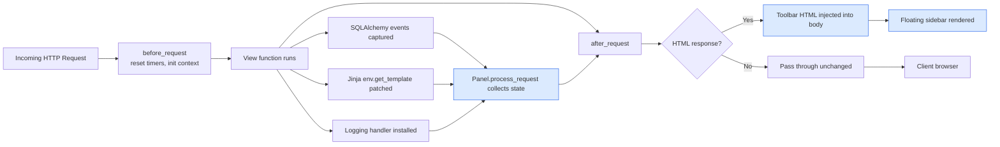
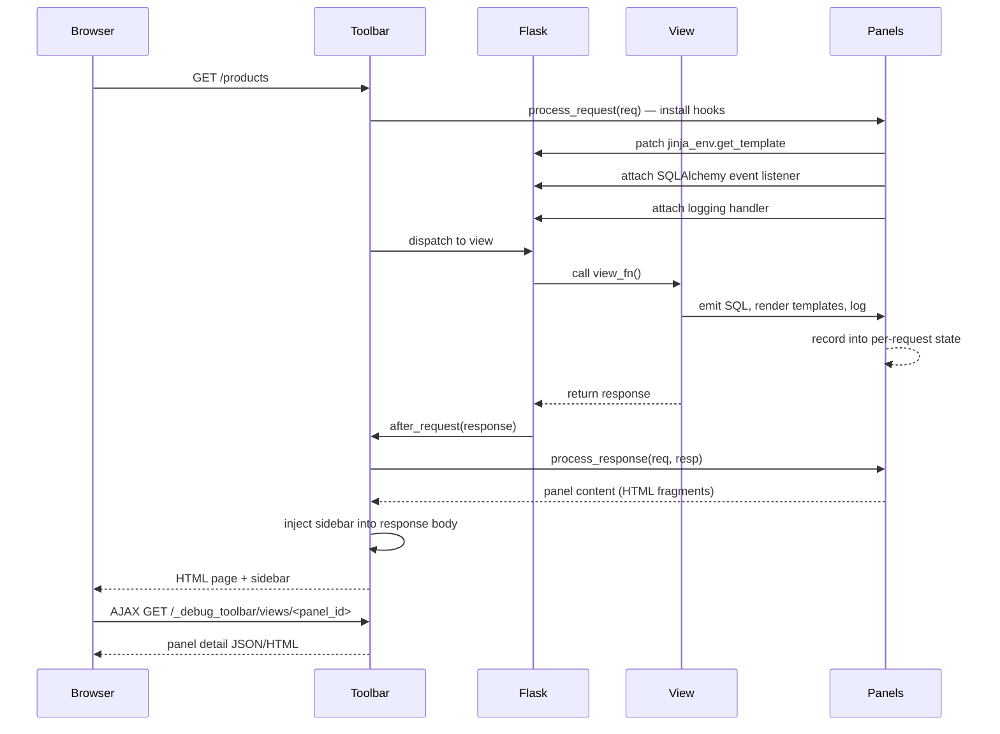
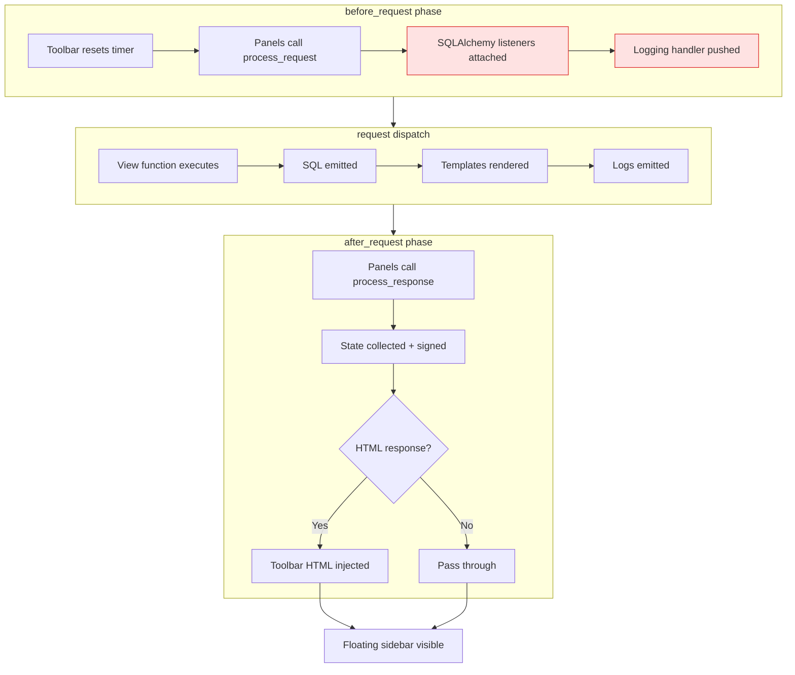

# Flask-DebugToolbar

#flask #debugging #profiling #development #panels #sql #templates #cProfile

> [!info] A panel-by-panel inspector overlaid on every Flask response
> **Flask-DebugToolbar** is a port of Django's celebrated Debug Toolbar to the Flask ecosystem. It injects a floating, collapsible sidebar into every HTML response while you are developing, exposing the versions of every installed package, request timing, HTTP headers, the request object, every SQL query, every template render, every log line, the WSGI profiler output, the registered routes, and the resolved config — all in one place, all reloadable on each request.

Think of the toolbar as a **flight recorder bolted onto the side of your aircraft**. While the plane is flying (the request is being processed), the flight recorder silently captures every instrument reading: how long the engine ran, how much fuel it burned, which waypoints it visited, what the tower said. After landing (response returned), the engineer (you, the developer) pops the side panel and reads the tape — without ever having to instrument the code by hand.

> [!danger] NEVER enable in production
> Flask-DebugToolbar exposes the resolved `app.config`, every SQL query (with parameters — including secrets you logged into a query), every template path, the full request environ, the WSGI profiler dump, and the list of installed packages. Enabling it in production is **an instant data-breach**. Always gate it behind `app.debug` and a final pre-deploy check.

---

## 1. Overview & Metaphor

### Why a debug toolbar at all?

Print-debugging is the lowest-friction way to inspect a running program, but it has three failure modes that compound in a web app:

1. **You forget to print the thing you needed.** By the time you notice, the request is over and the data is gone.
2. **Prints pollute the response body** and break JSON / HTML parsing.
3. **Prints are not aggregated.** You see the SQL, but not *which template rendered it*; you see the timing, but not *which route handler owned it*.

The debug toolbar solves all three by hooking into Flask's `before_request`, `after_request`, and `teardown_request` hooks, then **wrapping the response body** in an HTML scaffolding that renders a JavaScript-driven sidebar. The sidebar pulls data — panels — that were collected during the request, without modifying what the user actually sees.

### The panel architecture



### What it is — and is not

| Aspect | Flask-DebugToolbar | [[Flask-Silk]] | [[Flask-Profiler]] |
|---|---|---|---|
| Lifecycle | Per-request, in-page | Per-request, separate UI | Cross-request, stored |
| Storage | None — stateless | SQLite / file (per request) | MongoDB / SQLAlchemy / raw dict |
| Best for | "What happened in *this* request?" | "Profile the last 100 requests" | "Which endpoints are slowest over time?" |
| Production-safe | ❌ Never | ⚠️ Gated by %, careful | ✅ Designed for staging/light prod |
| SQL inspection | Per-query, per-panel | Aggregated, with cProfile dump | Aggregated, by endpoint |

> [!tip] The mental model
> Flask-DebugToolbar is a **developer's microscope** — high magnification, single request, no storage. Once you outgrow a single request, reach for [[Flask-Silk]] (per-request history) or [[Flask-Profiler]] (aggregate metrics).

---

## 2. Installation

```bash
(venv) $ pip install Flask-DebugToolbar
```

| Package | Version used in this note |
|---|---|
| Flask | 3.0.x |
| Flask-DebugToolbar | 0.16.x |
| Flask-SQLAlchemy | 3.1.x (for SQL panel) |

The toolbar itself depends only on Flask and its own bundled JS/CSS, but most panels benefit from having `Flask-SQLAlchemy` (for the SQL panel) and `werkzeug`'s built-in profiler (for the Profiler panel).

> [!warning] Pin to `>=0.13` if you use Flask 2.3+
> Earlier versions of the toolbar patched internal Flask symbols that moved in Flask 2.3. Use `Flask-DebugToolbar>=0.13.1` (or the unreleased 0.16 series) to avoid `AttributeError: 'Flask' object has no attribute 'jinja_env.extensions'`.

---

## 3. Configuration

All configuration lives under the `DEBUG_TB_*` namespace in `app.config`. The extension reads these at request time, so they can be toggled live.

| Key | Default | Description |
|---|---|---|
| `DEBUG_TB_ENABLED` | `app.debug` | Master switch. Set to `False` to disable even in debug mode. |
| `DEBUG_TB_HOSTS` | `()` (empty = any host) | Tuple of hostnames allowed to see the toolbar. Use to whitelist `localhost`, `127.0.0.1`, dev subdomain. |
| `DEBUG_TB_INTERCEPT_REDIRECTS` | `True` | Replace 301/302 responses with an HTML page showing the redirect target — so you can inspect the request that *caused* the redirect. |
| `DEBUG_TB_PANELS` | The full default list (see below) | Tuple of dotted paths to panel classes. Reorder to change sidebar ordering; remove entries to drop panels. |
| `DEBUG_TB_CONFIG_TEMPLATE` | Built-in | Jinja template used to render the toolbar container. |
| `DEBUG_TB_TEMPLATE_EDITOR` | `False` | Enable the click-to-edit template panel (only useful with a local file system). |

### The default panel set

```python
DEBUG_TB_PANELS = (
    "flask_debugtoolbar.panels.versions.VersionDebugPanel",
    "flask_debugtoolbar.panels.timer.TimerDebugPanel",
    "flask_debugtoolbar.panels.headers.HeaderDebugPanel",
    "flask_debugtoolbar.panels.request_vars.RequestVarsDebugPanel",
    "flask_debugtoolbar.panels.config_vars.ConfigVarsDebugPanel",
    "flask_debugtoolbar.panels.template.TemplateDebugPanel",
    "flask_debugtoolbar.panels.sqlalchemy.SQLAlchemyDebugPanel",
    "flask_debugtoolbar.panels.logger.LoggingDebugPanel",
    "flask_debugtoolbar.panels.route_list.RouteListDebugPanel",
    "flask_debugtoolbar.panels.profiler.ProfilerDebugPanel",
)
```

### Minimal configuration

```python
from flask import Flask
from flask_debugtoolbar import DebugToolbarExtension

app = Flask(__name__)
app.config["SECRET_KEY"] = "dev-only-secret"          # required by toolbar
app.config["DEBUG_TB_ENABLED"] = app.debug            # only in debug
app.config["DEBUG_TB_INTERCEPT_REDIRECTS"] = True
app.config["DEBUG_TB_HOSTS"] = ("localhost", "127.0.0.1", "dev.local")

toolbar = DebugToolbarExtension(app)
```

> [!warning] `SECRET_KEY` is mandatory
> The toolbar signs its collected state with Flask's session serializer to prevent tampering between the request that captured it and the AJAX call that renders the panel detail. If `SECRET_KEY` is unset, the toolbar will silently skip itself.

---

## 4. Basic Usage

### The minimal Flask + SQLAlchemy + Toolbar app

```python
# app.py
from flask import Flask, render_template_string
from flask_sqlalchemy import SQLAlchemy
from flask_debugtoolbar import DebugToolbarExtension

app = Flask(__name__)
app.config.update(
    SECRET_KEY = "dev-only-do-not-use-in-prod",
    DEBUG = True,
    SQLALCHEMY_DATABASE_URI = "sqlite:///shop.db",
    SQLALCHEMY_TRACK_MODIFICATIONS = False,
    DEBUG_TB_INTERCEPT_REDIRECTS = True,
    DEBUG_TB_HOSTS = ("localhost", "127.0.0.1"),
)

db = SQLAlchemy(app)
toolbar = DebugToolbarExtension(app)

class Product(db.Model):
    id   = db.Column(db.Integer, primary_key=True)
    name = db.Column(db.String(80), nullable=False)
    price = db.Column(db.Numeric(10, 2), nullable=False)

with app.app_context():
    db.create_all()
    if not Product.query.first():
        db.session.add_all([
            Product(name="Mocha",  price=3.50),
            Product(name="Latte",  price=4.25),
            Product(name="Filter", price=2.75),
        ])
        db.session.commit()

TEMPLATE = """
<!doctype html>
<html><head><title>Shop</title></head>
<body>
  <h1>Products</h1>
  <ul>
  
    <li>{{ p.name }} — ${{ "%.2f"|format(p.price) }}</li>
  
  </ul>
</body></html>
"""

@app.route("/")
def index():
    products = Product.query.order_by(Product.price).all()
    app.logger.info("Served %d products", len(products))
    return render_template_string(TEMPLATE, products=products)

if __name__ == "__main__":
    app.run(debug=True)
```

Run it:

```bash
(venv) $ python app.py
```

Open `http://127.0.0.1:5000/` — you'll see the page, plus a floating sidebar on the right. Clicking each panel expands a detail view:

| Panel | What it shows |
|---|---|
| **Versions** | Flask, Werkzeug, Jinja, click, itsdangerous, plus all installed distributions. |
| **Time** | Total request time, broken into `before_request`, view, `after_request`, `teardown_request`. |
| **HTTP Headers** | Request headers (cookie, host, user-agent) and response headers (content-type, set-cookie). |
| **Request** | The full `flask.request` object — args, form, view args, session, url rule. |
| **Config** | The resolved `app.config` dict. |
| **Templates** | Every template rendered, with its path, context variables, and parent/child inheritance tree. |
| **SQLAlchemy** | Every query, with raw SQL, parameters, duration, and call site (file:line). |
| **Logging** | Every log record emitted during the request, formatted with level + name. |
| **Routes** | Every URL rule registered, with endpoint, methods, and the view function's docstring. |
| **Profiler** | A `cProfile` dump of the view function, with `pstats`-style call tree. |

### The request interception lifecycle



---

## 5. Intermediate Patterns

### Whitelisting only specific panels

If your app is large, the SQL panel can produce megabytes of captured state on a single page. Drop panels you don't need:

```python
app.config["DEBUG_TB_PANELS"] = (
    "flask_debugtoolbar.panels.timer.TimerDebugPanel",
    "flask_debugtoolbar.panels.sqlalchemy.SQLAlchemyDebugPanel",
    "flask_debugtoolbar.panels.profiler.ProfilerDebugPanel",
)
```

### Switching panels per-environment

```python
import os

PANELS = [
    "flask_debugtoolbar.panels.versions.VersionDebugPanel",
    "flask_debugtoolbar.panels.timer.TimerDebugPanel",
    "flask_debugtoolbar.panels.headers.HeaderDebugPanel",
    "flask_debugtoolbar.panels.request_vars.RequestVarsDebugPanel",
    "flask_debugtoolbar.panels.template.TemplateDebugPanel",
    "flask_debugtoolbar.panels.sqlalchemy.SQLAlchemyDebugPanel",
    "flask_debugtoolbar.panels.logger.LoggingDebugPanel",
]
if os.environ.get("ENABLE_PROFILER_PANEL") == "1":
    PANELS.append("flask_debugtoolbar.panels.profiler.ProfilerDebugPanel")
if os.environ.get("ENABLE_ROUTE_PANEL") == "1":
    PANELS.append("flask_debugtoolbar.panels.route_list.RouteListDebugPanel")

app.config["DEBUG_TB_PANELS"] = tuple(PANELS)
```

### Inspecting redirect chains

By default, Flask-DebugToolbar *intercepts* redirects: a 302 response is replaced with an HTML page showing the target URL, the cookies that would be set, and the original request that triggered the redirect. This is invaluable for debugging the "I keep getting redirected to /login" loop.

```python
@app.route("/old")
def old():
    return redirect(url_for("new"))

@app.route("/new")
def new():
    return "Welcome"
```

Visiting `/old` will show:

```
Redirect intercepted
Location: /new
Status: 302 FOUND
View function: old
```

…with a button to "Follow redirect" that re-issues the request as a normal 302.

> [!tip] Disable intercept for client-side redirects
> If you do `return jsonify({"redirect": url_for("new")})` and the browser follows via JavaScript, set `DEBUG_TB_INTERCEPT_REDIRECTS = False` so the toolbar doesn't replace your JSON response with HTML.

### Examining SQL with parameters

The SQLAlchemy panel shows raw SQL with bound parameters inlined, plus the call site:

```
SELECT product.id, product.name, product.price
FROM product
ORDER BY product.price
-- Parameters: ()
-- Duration: 0.42 ms
-- Caller: app.py:42 (index)
```

Click "Expl" to run the query through `EXPLAIN` and see the query plan — invaluable for catching missing indexes.

### Template inheritance tree

The Templates panel renders the full inheritance chain. For a typical base + child layout:

```
index.html
  ↳ extends base.html
     ↳ includes _nav.html
     ↳ includes _footer.html
```

Each node is clickable to show the context variables passed in, the blocks rendered, and the template's source.

---

## 6. Advanced Usage

### Writing a custom panel

Custom panels are the killer feature of Flask-DebugToolbar — you can attach your own inspector to the sidebar in under 30 lines. The API is two methods: `process_request` (run before the view) and `process_response` (run after the view), plus `title` / `nav_title` / `content` properties.

```python
# ext_panels.py
import time
import psutil
from flask_debugtoolbar.panels import DebugPanel

class MemoryPanel(DebugPanel):
    name = "Memory"
    has_content = True

    def process_request(self, request):
        self._start = psutil.Process().memory_info().rss
        self._t0 = time.perf_counter()

    def process_response(self, request, response):
        self._end = psutil.Process().memory_info().rss
        self._t1 = time.perf_counter()
        return response

    @property
    def nav_title(self):
        return "Memory"

    @property
    def nav_subtitle(self):
        delta = (self._end - self._start) / 1024  # KB
        sign = "+" if delta >= 0 else ""
        return f"{sign}{delta:.0f} KB"

    @property
    def title(self):
        return "Memory Usage"

    @property
    def content(self):
        peak = psutil.Process().memory_info().rss / (1024 * 1024)
        return f"""
        <h3>Memory</h3>
        <table>
          <tr><th>RSS at start</th><td>{self._start / 1024:.0f} KB</td></tr>
          <tr><th>RSS at end</th><td>{self._end / 1024:.0f} KB</td></tr>
          <tr><th>Delta</th><td>{(self._end - self._start) / 1024:+.0f} KB</td></tr>
          <tr><th>Wall time</th><td>{(self._t1 - self._t0) * 1000:.1f} ms</td></tr>
          <tr><th>Peak RSS</th><td>{peak:.1f} MB</td></tr>
        </table>
        """
```

Register it:

```python
app.config["DEBUG_TB_PANELS"] = (
    "flask_debugtoolbar.panels.timer.TimerDebugPanel",
    "flask_debugtoolbar.panels.sqlalchemy.SQLAlchemyDebugPanel",
    "ext_panels.MemoryPanel",          # your custom panel
)
```

### A Redis panel

```python
import redis
from flask_debugtoolbar.panels import DebugPanel

_pool = redis.ConnectionPool.from_url("redis://localhost:6379/0")

class RedisPanel(DebugPanel):
    name = "Redis"
    has_content = True
    _commands = []

    def process_request(self, request):
        self.__class__._commands = []
        # Monkey-patch the connection to record commands
        orig_execute = redis.Redis.execute_command
        def wrapped(self, *args, **kwargs):
            RedisPanel._commands.append((args[0] if args else "?", args[1:]))
            return orig_execute(self, *args, **kwargs)
        redis.Redis.execute_command = wrapped
        self._orig = orig_execute

    def process_response(self, request, response):
        redis.Redis.execute_command = self._orig
        return response

    @property
    def nav_title(self): return "Redis"
    @property
    def nav_subtitle(self): return f"{len(self._commands)} cmds"
    @property
    def title(self): return "Redis Commands"
    @property
    def content(self):
        rows = "".join(
            f"<tr><td>{cmd}</td><td>{args!r}</td></tr>"
            for cmd, args in self._commands
        )
        return f"<h3>Redis Commands</h3><table><tr><th>Command</th><th>Args</th></tr>{rows}</table>"
```

> [!warning] Monkey-patching in panels
> Panels that monkey-patch third-party libraries (Redis, requests, boto3) must restore the original in `process_response` — otherwise the patch leaks into the next request. Always pair your patch with a teardown. A safer pattern is to use the library's own event hooks (`EVENTS` in redis-py, `before_request` in `requests`).

### Filtering the logger panel

The Logging panel captures every record. To filter out chatty loggers (e.g. `botocore`):

```python
import logging

class FilteredHandler(logging.Handler):
    def __init__(self):
        super().__init__()
        self.records = []

    def emit(self, record):
        if record.name.startswith("botocore"):
            return
        self.records.append(self.format(record))

# Replace the toolbar's handler via a small extension:
from flask_debugtoolbar.logger import handler as tb_handler

class FilteredToolbarHandler(logging.Handler):
    def emit(self, record):
        if not record.name.startswith("botocore"):
            tb_handler.emit(record)

logging.getLogger().addHandler(FilteredToolbarHandler())
```

### Running the toolbar behind a reverse proxy

If you sit behind nginx and access the app via `https://dev.example.com/`, set:

```python
app.config["DEBUG_TB_HOSTS"] = ("dev.example.com",)
app.config["PREFERRED_URL_SCHEME"] = "https"
```

…and ensure your proxy forwards `X-Forwarded-Host` and `X-Forwarded-Proto` (handled by `werkzeug.middleware.proxy_fix.ProxyFix`):

```python
from werkzeug.middleware.proxy_fix import ProxyFix
app.wsgi_app = ProxyFix(app.wsgi_app, x_for=1, x_proto=1, x_host=1)
```

---

## 7. Common Pitfalls & Troubleshooting

| Symptom | Cause | Fix |
|---|---|---|
| Toolbar does not appear | `DEBUG_TB_ENABLED` is False, or host not in `DEBUG_TB_HOSTS` | Set `DEBUG = True`, add host to `DEBUG_TB_HOSTS` |
| Toolbar appears but panels are empty | `SECRET_KEY` missing or session cookie blocked | Set `SECRET_KEY`, ensure cookies are not blocked by browser |
| Response body is broken / JSON corrupted | Toolbar only injects into HTML responses | Return `mimetype="text/html"` for pages; the toolbar skips non-HTML |
| `KeyError: 'werkzeug.server.shutdown'` | Running under a non-Werkzeug server (gunicorn) | Use `app.run()` in dev; gunicorn is for prod where toolbar is disabled |
| SQL panel shows "SQLAlchemy not installed" | Flask-SQLAlchemy initialized after toolbar | Initialize `db = SQLAlchemy(app)` *before* `DebugToolbarExtension(app)` |
| Toolbar breaks streaming responses | The toolbar buffers the body to inject the sidebar | Disable for streaming endpoints via a `before_request` flag that sets `app.config["DEBUG_TB_ENABLED"] = False` |
| Huge panel payload slows every request | Profiler panel runs `cProfile` on every view | Drop `ProfilerDebugPanel` from `DEBUG_TB_PANELS`, add it back only when needed |

> [!bug] Toolbar disappears after Flask 3.0 upgrade
> Flask 3.0 removed `flask.Markup` and changed `jinja_env` initialization. Use `Flask-DebugToolbar>=0.16.0` and pin `werkzeug<3.1` if you see `ImportError: cannot import name 'Markup'`.

### Disabling the toolbar for a single endpoint

```python
@app.route("/healthz")
def healthz():
    app.config["DEBUG_TB_ENABLED"] = False
    return "ok"
```

Or, cleaner, use a decorator:

```python
from functools import wraps

def no_toolbar(fn):
    @wraps(fn)
    def wrapper(*a, **kw):
        app.config["DEBUG_TB_ENABLED"] = False
        return fn(*a, **kw)
    return wrapper

@app.route("/healthz")
@no_toolbar
def healthz(): return "ok"
```

---

## 8. Best Practices

1. **Gate on `app.debug` AND an environment flag.** Belt-and-suspenders. A `DEBUG=true` in `.env` should not be the only line of defense.
2. **Whitelist `DEBUG_TB_HOSTS`.** Even if you forget to disable debug mode, a non-whitelisted host gets no toolbar.
3. **Drop the profiler panel by default.** It runs `cProfile` on every request and adds 10–30% overhead. Enable per-environment only when actively investigating.
4. **Never use real secrets in `app.config`.** The Config panel renders them in plaintext. Use environment-resolved placeholders or `SECRET_KEY = os.environ["SECRET_KEY"]` so the *value* is hidden but the *key* is shown.
5. **Pair with [[Flask-Silk]] for production-adjacent profiling.** Silk can run in staging where the toolbar cannot.

> [!success] The safe-by-default snippet
> ```python
> import os
> from flask import Flask
> from flask_debugtoolbar import DebugToolbarExtension
>
> app = Flask(__name__)
> app.config["SECRET_KEY"] = os.environ["SECRET_KEY"]
> app.config["DEBUG"] = os.environ.get("FLASK_ENV") == "development"
> app.config["DEBUG_TB_ENABLED"] = app.debug
> app.config["DEBUG_TB_HOSTS"] = ("localhost", "127.0.0.1", "dev.local")
> app.config["DEBUG_TB_INTERCEPT_REDIRECTS"] = app.debug
>
> if app.debug:
>     DebugToolbarExtension(app)
> ```

---

## 9. Integration with Other Extensions

### Flask-SQLAlchemy

The SQL panel auto-detects `flask_sqlalchemy` and attaches `before_cursor_execute` / `after_cursor_execute` listeners. No additional wiring needed. To capture query origins across blueprints, ensure `SQLALCHEMY_ENGINE_OPTIONS` includes `"echo": True` for the panel's explain feature.

### Flask-Login

The Request panel surfaces the current user via `current_user` if you store it on `g`:

```python
from flask_login import current_user

@app.before_request
def _attach_user():
    if current_user.is_authenticated:
        g.user_id = current_user.id
```

`g.user_id` then appears in the Request panel under "View args / g".

### [[Flask-Caching]]

Wrap your cache backend with a small instrumentation layer and add it to a custom panel — every cache hit/miss is then visible per-request alongside the SQL queries, so you can see whether a slow view is actually hitting the DB or paying serialization cost on cache reads.

### [[Pytest-Flask]]

The toolbar's `before_request` hook adds ~5 ms per request and breaks `response.json` if you accidentally return HTML. Disable in `conftest.py`:

```python
@pytest.fixture
def app():
    app = create_app()
    app.config["TESTING"] = True
    app.config["DEBUG_TB_ENABLED"] = False
    yield app
```

### [[Structlog-Integration]]

The toolbar's Logging panel hooks into the root logger. To make structlog records visible, route them through a stdlib handler:

```python
import structlog, logging
structlog.configure(
    processors=[..., structlog.stdlib.render_to_log_kwargs],
    logger_factory=structlog.stdlib.LoggerFactory(),
)
logging.getLogger().addHandler(logging.StreamHandler())  # toolbar picks this up
```

---

## 10. Real-World Example: Hardened Dev Toolbar Stack

The following snippet combines everything into a single, production-safe scaffold:

```python
# extensions.py
import os, logging
from flask import Flask
from flask_sqlalchemy import SQLAlchemy
from flask_debugtoolbar import DebugToolbarExtension

db = SQLAlchemy()
toolbar = DebugToolbarExtension()

def init_extensions(app: Flask):
    db.init_app(app)

    is_dev = app.config.get("ENV") == "development"
    app.config.update(
        DEBUG_TB_ENABLED     = is_dev,
        DEBUG_TB_INTERCEPT_REDIRECTS = is_dev,
        DEBUG_TB_HOSTS       = ("localhost", "127.0.0.1", "dev.local"),
        DEBUG_TB_PANELS      = (
            "flask_debugtoolbar.panels.versions.VersionDebugPanel",
            "flask_debugtoolbar.panels.timer.TimerDebugPanel",
            "flask_debugtoolbar.panels.headers.HeaderDebugPanel",
            "flask_debugtoolbar.panels.request_vars.RequestVarsDebugPanel",
            "flask_debugtoolbar.panels.template.TemplateDebugPanel",
            "flask_debugtoolbar.panels.sqlalchemy.SQLAlchemyDebugPanel",
            "flask_debugtoolbar.panels.logger.LoggingDebugPanel",
            "flask_debugtoolbar.panels.route_list.RouteListDebugPanel",
        ) + (
            ("flask_debugtoolbar.panels.profiler.ProfilerDebugPanel",)
            if os.environ.get("ENABLE_PROFILER_PANEL") == "1" else ()
        ),
    )

    if is_dev:
        toolbar.init_app(app)
        logging.getLogger("sqlalchemy.engine").setLevel(logging.INFO)
        app.logger.info("DebugToolbar enabled for hosts=%s",
                        app.config["DEBUG_TB_HOSTS"])
```

```python
# app.py
from flask import Flask
from extensions import init_extensions, db

def create_app() -> Flask:
    app = Flask(__name__)
    app.config.from_object("config.DefaultConfig")
    app.config.from_envvar("APP_SETTINGS", silent=True)
    init_extensions(app)
    return app

if __name__ == "__main__":
    create_app().run(debug=True)
```

### Where the toolbar sits in the request lifecycle



---

## 11. References

- **PyPI**: <https://pypi.org/project/Flask-DebugToolbar/>
- **Source**: <https://github.com/pallets-eco/flask-debugtoolbar>
- **Django Debug Toolbar** (the original): <https://django-debug-toolbar.readthedocs.io/>
- **Flask docs** on `app.after_request`: <https://flask.palletsprojects.com/en/latest/api/#flask.Flask.after_request>
- **`werkzeug.middleware.profiler`** (alternative profiler middleware): <https://werkzeug.palletsprojects.com/en/latest/middleware/profiler/>
- Related vault notes: [[Flask-Silk]], [[Flask-Profiler]], [[Structlog-Integration]], [[Flask-SQLAlchemy]], [[Pytest-Flask]], [[Production-Deployment]], [[Security-Best-Practices]]

> [!quote] Final word
> Flask-DebugToolbar is the single highest-leverage tool for Flask development. Twenty minutes of configuration saves hundreds of hours of `print()` and `time.time()` calls over the lifetime of a project. But — like any debugger — it must be put away before you ship.
