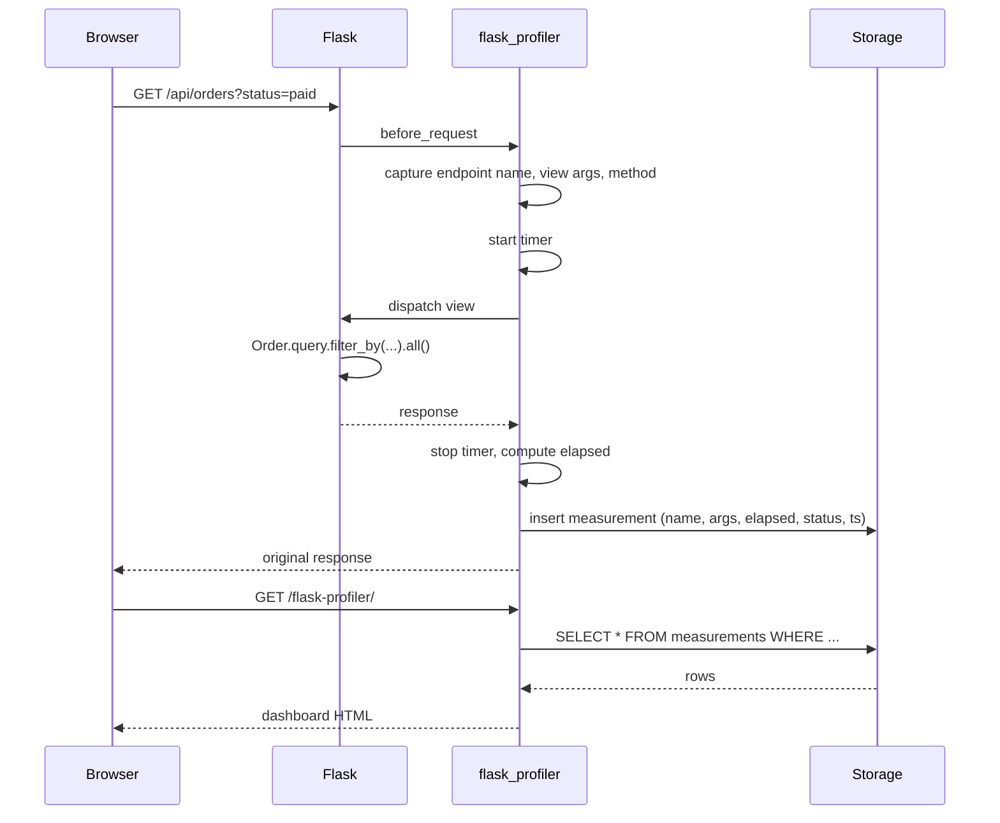
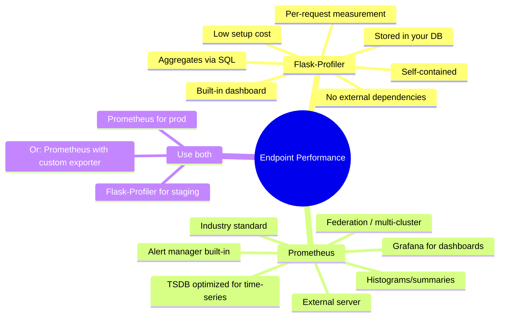
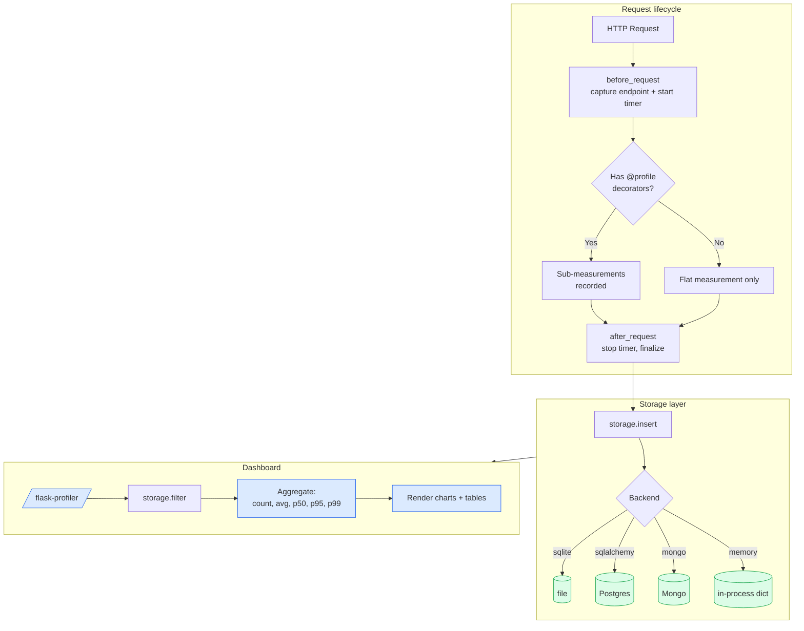

# Flask-Profiler

#flask #profiling #metrics #analytics #performance #monitoring #endpoint

> [!info] Aggregate endpoint profiling with pluggable metric storage
> **Flask-Profiler** is a long-lived profiling layer that records metrics for **every endpoint invocation** and stores them in a database (SQLite, MongoDB, SQLAlchemy, or an in-memory dict) for later analysis. Unlike [[Flask-Silk]] — which captures individual requests — Flask-Profiler focuses on **aggregates**: "what's the 95th-percentile latency of `/api/orders` over the last 24 hours?" and "which endpoints consume the most cumulative time?".

Think of Flask-Profiler as a **mini-APM inside your Flask process**. Where Prometheus measures "the gauge went up", and Silk shows you "this one request was slow", Flask-Profiler answers the operational question in between: "across the last 10,000 requests to `/api/orders`, half of the time was spent in the `Order.search` sub-call — go fix that." It is the missing middle ground between ad-hoc prints and a full APM subscription.

> [!tip] When to choose Flask-Profiler
> If you've outgrown `print()` debugging, you don't yet have Prometheus/Datadog set up, and you want **endpoint-level analytics with retention** — Flask-Profiler is the right next step. If you already have Prometheus, you may not need it (see §9).

---

## 1. Overview & Metaphor

### The three time-scales of profiling

| Time-scale | Question | Tool |
|---|---|---|
| Single request | "Why was *this* call slow?" | [[Flask-DebugToolbar]], `pdb` |
| Recent history (hours) | "What did the slow request *do*?" | [[Flask-Silk]] |
| **Long history (days/weeks)** | "**Which endpoints are slowest over time?**" | **Flask-Profiler**, Prometheus |
| Cross-service | "Which downstream service caused it?" | OpenTelemetry, Jaeger |

Flask-Profiler's value proposition is the long-history scale — it persists measurements in your own database, with a built-in dashboard, so you can answer aggregate questions **without standing up a separate metrics stack**.

### The collection pipeline

```mermaid
flowchart LR
    REQ[HTTP Request] --> BEFORE[flask_profiler.before_request<br/>start timer, capture endpoint]
    BEFORE --> VIEW[Flask view function]
    VIEW --> MEASURE[flask_profiler.measure decorator<br/>optional sub-measurements]
    MEASURE --> COLLECT[collect name, args, elapsed, status]
    VIEW --> AFTER[flask_profiler.after_request<br/>finalize measurement]
    COLLECT --> STORE[Storage backend]
    STORE --> DB[(SQLite / Mongo / SQLAlchemy / Memory)]
    DB --> DASH[/flask-profiler/ dashboard]

    classDef persist fill:#dcfce7,stroke:#16a34a;
    class STORE,DB,DASH persist;
```

Every request becomes a `Measurement` row, tagged with `name` (endpoint), `args` (view args), `elapsed` (wall time), `method`, `status`, and a timestamp. Sub-measurements via the `@measure` decorator let you attribute time *within* a view to specific functions.

### Comparison with alternatives

| Feature | Flask-Profiler | [[Flask-Silk]] | Prometheus + Grafana |
|---|---|---|---|
| Per-request inspection | ❌ Aggregates only | ✅ Yes | ❌ |
| Endpoint-level analytics | ✅ Yes | ⚠️ Possible via SQL | ✅ Yes |
| Built-in UI | ✅ `/flask-profiler/` | ✅ `/silk/` | ❌ Use Grafana |
| SQL capture | ❌ No | ✅ Yes | ❌ |
| cProfile dumps | ❌ No | ✅ Yes | ❌ |
| Storage backend | Pluggable (4 options) | SQLite / Postgres | TSDB (Prometheus) |
| Overhead | Low (~1–3%) | Medium (5–15%) | Very low |
| Self-contained | ✅ Yes | ✅ Yes | ❌ External server |
| Production-ready | ✅ Light prod / staging | ⚠️ Staging | ✅ Production |

> [!tip] Picking a layer
> - **Just debugging locally?** → [[Flask-DebugToolbar]]
> - **Investigating slow requests in staging?** → [[Flask-Silk]]
> - **Trending endpoint performance over days?** → **Flask-Profiler**
> - **Production observability across services?** → Prometheus / OpenTelemetry

---

## 2. Installation

```bash
(venv) $ pip install flask-profiler
```

| Package | Version used in this note |
|---|---|
| Flask | 3.0.x |
| flask-profiler | 1.8.x |
| PyYAML | 6.x (config file support) |

Flask-Profiler supports four storage backends out of the box:

```bash
# Pick the storage you need:
(venv) $ pip install sqlalchemy      # for SQLAlchemy backend
(venv) $ pip install pymongo         # for MongoDB backend
# SQLite backend requires no extra deps (uses stdlib `sqlite3`)
```

> [!warning] Flask 3.0 compatibility
> Flask-Profiler 1.8.x is the first version with explicit Flask 3.x support. Earlier versions call `app.before_first_request`, which was removed in Flask 2.3+. Pin `flask-profiler>=1.8.1`.

---

## 3. Configuration

Flask-Profiler reads its config either from `app.config["flask_profiler"]` (a dict) or from a YAML file referenced by `app.config["FLASK_PROFILER_CONFIG"]`.

### The config dict

```python
app.config["flask_profiler"] = {
    "enabled":        app.debug,
    "storage":        {"engine": "sqlite", "FILE": "/tmp/profiler.sqlite"},
    "basicAuth":      {"username": "admin", "password": "s3cr3t"},
    "ignore":         ["^/static/.*", "^/healthz$"],
    "endpointRoot":   "flask-profiler",
    "sampling":       None,           # None = all requests; otherwise float in (0, 1]
}
```

### Full option reference

| Key | Type | Default | Description |
|---|---|---|---|
| `enabled` | bool | `False` | Master switch. |
| `storage.engine` | str | `"sqlite"` | One of `"sqlite"`, `"mongo"`, `"sqlalchemy"`, `"memory"`. |
| `storage.FILE` | str | `"flask_profiler.sql"` | SQLite file path (sqlite only). |
| `storage.URL` | str | — | SQLAlchemy URL (sqlalchemy only). |
| `storage.MONGO_URL` | str | `"mongodb://localhost"` | Mongo connection string (mongo only). |
| `storage.MONGO_DB` | str | `"flask_profiler"` | Mongo database name. |
| `storage.GROUP_BY` | list | `["name", "method", "args", "status"]` | Columns to group measurements by for analytics. |
| `basicAuth.username` | str | — | HTTP Basic Auth username for the dashboard. |
| `basicAuth.password` | str | — | HTTP Basic Auth password. |
| `ignore` | list | `[]` | Regex patterns to skip profiling. |
| `endpointRoot` | str | `"flask-profiler"` | URL prefix for the dashboard. |
| `sampling` | float | `None` | Sample fraction in `(0, 1]`. `0.1` = 10% of requests. |
| `verbose` | bool | `False` | Print every measurement to stderr. |
| `custom_measurements" | dict | `{}` | Override the measurement class for advanced use. |

### Storage backends compared

| Backend | Pros | Cons | Use case |
|---|---|---|---|
| **`memory`** | Zero setup, fast | Lost on restart | Quick local dev / unit tests |
| **`sqlite`** | Single file, portable | Lock contention under high concurrency | Single-instance staging |
| **`sqlalchemy`** | Any DB (Postgres, MySQL) | Slightly slower than raw sqlite | Multi-instance staging with shared DB |
| **`mongo`** | Schemaless, high write throughput | Requires Mongo deployment | High-volume staging, big-data analytics |

> [!warning] SQLite under concurrent load
> SQLite serializes writes. If you profile every request in a 4-worker gunicorn, you'll see lock errors in the log. Either switch to `sqlalchemy`+Postgres, or use `sampling: 0.1` to reduce write rate.

---

## 4. Basic Usage

### Minimal app

```python
# app.py
import time
from flask import Flask, jsonify, request
from flask_sqlalchemy import SQLAlchemy
import flask_profiler

app = Flask(__name__)
app.config.update(
    SECRET_KEY = "dev",
    SQLALCHEMY_DATABASE_URI = "sqlite:///shop.db",
    SQLALCHEMY_TRACK_MODIFICATIONS = False,
    flask_profiler = {
        "enabled": True,
        "storage":  {"engine": "sqlite", "FILE": "/tmp/profiler.sqlite"},
        "basicAuth": {"username": "admin", "password": "dev"},
        "ignore":   [r"^/static/.*", r"^/healthz$"],
        "endpointRoot": "flask-profiler",
    },
)

db = SQLAlchemy(app)
flask_profiler.init_app(app)

class Order(db.Model):
    id      = db.Column(db.Integer, primary_key=True)
    total   = db.Column(db.Numeric(10, 2), nullable=False)
    status  = db.Column(db.String(20), nullable=False, default="pending")

with app.app_context():
    db.create_all()
    if not Order.query.first():
        for i in range(100):
            db.session.add(Order(total=10 + i, status="pending" if i % 2 else "paid"))
        db.session.commit()

@app.route("/api/orders")
def list_orders():
    status = request.args.get("status", "pending")
    limit  = int(request.args.get("limit", 20))
    orders = Order.query.filter_by(status=status).limit(limit).all()
    return jsonify([{"id": o.id, "total": float(o.total), "status": o.status}
                    for o in orders])

@app.route("/api/orders/<int:oid>/ship", methods=["POST"])
def ship_order(oid):
    order = Order.query.get_or_404(oid)
    order.status = "shipped"
    db.session.commit()
    return jsonify({"ok": True, "id": order.id})

@app.route("/healthz")
def healthz():
    return "ok"

if __name__ == "__main__":
    app.run(debug=True)
```

Run it, hit a few endpoints:

```bash
(venv) $ python app.py
# in another shell:
$ curl http://localhost:5000/api/orders
$ curl http://localhost:5000/api/orders?status=paid
$ curl -X POST http://localhost:5000/api/orders/5/ship
$ for i in $(seq 1 100); do curl -s http://localhost:5000/api/orders?limit=10 > /dev/null; done
```

Then visit the dashboard:

```
http://localhost:5000/flask-profiler/
```

You'll see a dashboard with three main views:

1. **Measurements** — every profiled request, sortable by name/method/elapsed/status.
2. **Timeseries** — line charts of average, p50, p95, p99 latency over time, per endpoint.
3. **Grouped analysis** — aggregate stats (count, avg, min, max, p95) grouped by endpoint.

### The metric collection flow



---

## 5. Intermediate Patterns

### Sub-measurements with `@profile`

The killer feature of Flask-Profiler is the `@profile` decorator, which lets you attribute time *inside* a view to specific functions:

```python
from flask_profiler import profile

@profile
def expensive_computation(order):
    # simulate CPU work
    total = sum(i * i for i in range(order.id * 1000))
    return total

@app.route("/api/orders/<int:oid>/analyze")
def analyze_order(oid):
    order = Order.query.get_or_404(oid)
    result = expensive_computation(order)
    return jsonify({"id": order.id, "metric": result})
```

In the dashboard, the `/api/orders/<int>/analyze` measurement will show a nested breakdown:

```
/api/orders/<int>/analyze   42.3 ms total
  └─ expensive_computation    38.1 ms
```

This is the closest thing to OpenTelemetry spans without standing up Jaeger.

### Filtering with the `ignore` regex

Skip profiling for endpoints that don't matter:

```python
app.config["flask_profiler"]["ignore"] = [
    r"^/static/.*",           # static files
    r"^/healthz$",            # health checks
    r"^/metrics$",            # Prometheus scrape
    r"^/_debug_toolbar/.*",   # Flask-DebugToolbar internals
]
```

### Sampling under load

For high-volume staging, sample:

```python
app.config["flask_profiler"]["sampling"] = 0.1   # 10% of requests
```

Internally, Flask-Profiler generates a random float per request and profiles only if `random() <= sampling`. Over thousands of requests, you get statistically representative latency distributions.

### Querying measurements programmatically

Flask-Profiler exposes a Python API for ad-hoc analysis:

```python
import flask_profiler

with app.app_context():
    # All measurements for a specific endpoint
    rows = flask_profiler.storage.get_measurements(
        name="list_orders", method="GET"
    )
    p95 = sorted(r["elapsed"] for r in rows)[int(len(rows) * 0.95)]
    print(f"/api/orders p95 = {p95:.1f} ms over {len(rows)} samples")

    # Grouped aggregation
    summary = flask_profiler.storage.get_grouped_samples(
        group_by=["name", "method"]
    )
    for s in summary:
        print(f"{s['name']:40} count={s['count']:5} "
              f"avg={s['avg']:6.1f}ms p95={s['p95']:6.1f}ms")
```

This lets you build a custom alerting script:

```python
# scripts/alert_slow_endpoints.py
import sys, flask_profiler
from app import create_app

app = create_app()
with app.app_context():
    summary = flask_profiler.storage.get_grouped_samples(group_by=["name"])
    alert_lines = []
    for s in summary:
        if s["count"] >= 10 and s["p95"] > 500:  # >500ms p95
            alert_lines.append(
                f"  {s['name']}: p95={s['p95']:.0f}ms (n={s['count']})"
            )
    if alert_lines:
        print("ALERT: slow endpoints detected:")
        print("\n".join(alert_lines))
        sys.exit(2)  # exit non-zero to trigger alerting
```

Wire this into a cron job:

```bash
*/15 * * * * /app/venv/bin/python /app/scripts/alert_slow_endpoints.py \
    | mail -s "Slow endpoints alert" ops@example.com
```

---

## 6. Advanced Usage

### Custom storage backend

If the four built-in backends don't fit (e.g. you want Redis or DynamoDB), implement the storage protocol:

```python
# ext_redis_storage.py
import time, json
import redis

class RedisStorage:
    def __init__(self, redis_url="redis://localhost:6379/0", ttl=86400 * 7):
        self.r   = redis.Redis.from_url(redis_url)
        self.ttl = ttl

    def insert(self, measurement):
        key = f"profiler:{measurement['name']}:{int(time.time()*1000)}"
        self.r.setex(key, self.ttl, json.dumps(measurement))
        self.r.zadd("profiler:index", {key: measurement["endedAt"]})

    def filter(self, query):
        # query: dict with name, method, startedAt_min, startedAt_max, etc.
        keys = self.r.zrangebyscore(
            "profiler:index",
            query.get("startedAt_min", "-inf"),
            query.get("startedAt_max", "+inf"),
        )
        results = []
        for k in keys:
            data = json.loads(self.r.get(k))
            if query.get("name") and data["name"] != query["name"]:
                continue
            results.append(data)
        return results

    def truncate(self, days=7):
        cutoff = time.time() - days * 86400
        keys = self.r.zrangebyscore("profiler:index", "-inf", cutoff)
        for k in keys:
            self.r.delete(k)
        self.r.zremrangebyscore("profiler:index", "-inf", cutoff)

    def get_grouped_samples(self, group_by):
        # Implement aggregation logic for the dashboard
        ...
```

Register it:

```python
import flask_profiler
from ext_redis_storage import RedisStorage

flask_profiler.init_app(app, storage=RedisStorage(redis_url="redis://..."))
```

### Tagging measurements with metadata

Flask-Profiler's `Measurement` schema is fixed, but you can stash metadata in the `args` field by overriding `before_request`:

```python
from flask import g
import flask_profiler

orig_before = flask_profiler.before_request
def tagged_before():
    orig_before()
    if hasattr(g, "flask_profiler_measurement"):
        g.flask_profiler_measurement["args"]["_user"] = getattr(g, "user_id", None)
        g.flask_profiler_measurement["args"]["_tenant"] = getattr(g, "tenant_id", None)

flask_profiler.before_request = tagged_before
```

Then in the dashboard, the `args` JSON column shows `_user` and `_tenant` for each measurement — letting you filter "show me only requests from tenant 42".

### Auto-archiving old data

For long-running deployments, schedule weekly archival:

```python
@app.cli.command("profiler-archive")
@click.option("--days", default=30, help="Archive measurements older than N days")
def profiler_archive(days):
    import flask_profiler
    cutoff = time.time() - days * 86400
    # Snapshot to a file
    rows = flask_profiler.storage.filter({"endedAt_max": cutoff})
    with open(f"/var/archives/profiler-{int(cutoff)}.jsonl", "w") as f:
        for r in rows:
            f.write(json.dumps(r) + "\n")
    # Then truncate
    flask_profiler.storage.truncate(days=days)
    click.echo(f"Archived {len(rows)} measurements older than {days} days")
```

### Comparing Flask-Profiler with Prometheus



The pragmatic answer is: **start with Flask-Profiler, graduate to Prometheus when you outgrow it**. The migration path is straightforward — write a small exporter that reads from Flask-Profiler's storage and exposes a `/metrics` endpoint:

```python
from flask import Response
from prometheus_client import Gauge, generate_latest
import flask_profiler

LATENCY_P95 = Gauge("flask_endpoint_p95_ms", "p95 latency per endpoint", ["endpoint"])

@app.route("/metrics")
def metrics():
    summary = flask_profiler.storage.get_grouped_samples(group_by=["name"])
    for s in summary:
        LATENCY_P95.labels(endpoint=s["name"]).set(s["p95"])
    return Response(generate_latest(), mimetype="text/plain")
```

---

## 7. Common Pitfalls & Troubleshooting

| Symptom | Cause | Fix |
|---|---|---|
| Dashboard returns 404 | `endpointRoot` configured but route not registered | Ensure `flask_profiler.init_app(app)` is called *after* `app.config["flask_profiler"]` is set |
| `OperationalError: database is locked` (sqlite) | Concurrent writes from multiple workers | Use `sqlalchemy`+Postgres, or set `sampling: 0.1` |
| No measurements in dashboard | Profiler disabled or `ignore` regex too broad | Check `app.config["flask_profiler"]["enabled"]` is True |
| Profiler slows every request | `verbose: True` | Set `verbose: False` |
| Memory grows without bound (`memory` engine) | No auto-truncation | Switch to sqlite/sqlalchemy, or restart workers periodically |
| `@profile` decorator doesn't show nested | Function called outside request context | Ensure the decorated function is called from within a view |
| Dashboard auth fails silently | `basicAuth` configured but reverse proxy strips `Authorization` header | Configure nginx to forward `Authorization` |

> [!bug] `AttributeError: 'NoneType' object has no attribute 'before_first_request'`
> Flask 2.3+ removed `before_first_request`. Use `flask-profiler>=1.8.1`. The symptom appears on the first request after server start.

> [!warning] MongoDB backend TTL
> If you use the MongoDB backend, set a TTL index on the `createdAt` field:
> ```javascript
> db.measurements.createIndex({ "createdAt": 1 }, { expireAfterSeconds: 86400 * 30 })
> ```
> Without this, the `measurements` collection grows unboundedly.

---

## 8. Best Practices

1. **Always set `basicAuth`** on the dashboard. It exposes endpoint names, view args, and timing data — all useful to an attacker reconnoitering your API.
2. **Use `sqlalchemy`+Postgres for multi-worker deployments.** SQLite is fine for single-process dev, but production workers will trip on lock contention.
3. **Profile a sample, not all.** `sampling: 0.1` gives statistically valid p95/p99 with 10% of the storage cost.
4. **Add `ignore` patterns for `/healthz`, `/metrics`, `/static/`.** These endpoints skew your analytics — `/healthz` is hit every 5 seconds by k8s and will dominate the measurement count.
5. **Schedule truncation.** A 1000-RPS app profiled at 10% generates ~86M rows/day. Without truncation, you'll OOM in a week.
6. **Pair with `@profile` for hot paths.** The decorator adds nesting to your measurements — invaluable for understanding *where* a slow view spends its time.
7. **Don't profile in production-grade prod.** Use staging or a sampled production canary. For true prod observability, use Prometheus.

> [!success] The right configuration for staging
> ```python
> app.config["flask_profiler"] = {
>     "enabled":      True,
>     "storage":      {"engine": "sqlalchemy", "URL": "postgresql://..."},
>     "basicAuth":    {"username": "ops", "password": os.environ["PROFILER_PWD"]},
>     "ignore":       [r"^/static/.*", r"^/healthz$", r"^/metrics$"],
>     "sampling":     0.1,
>     "endpointRoot": "flask-profiler",
>     "verbose":      False,
> }
> ```

---

## 9. Integration with Other Extensions

### [[Flask-DebugToolbar]]

You can run both simultaneously. The toolbar gives single-request inspection; Flask-Profiler gives aggregate history. They don't conflict — they patch different layers.

```python
if app.debug:
    DebugToolbarExtension(app)
flask_profiler.init_app(app)
```

### [[Flask-Silk]]

If you want both request-level inspection (Silk) and aggregate analytics (Flask-Profiler), they can coexist:

```python
if app.config.get("ENV") in ("development", "staging"):
    Silk(app)
flask_profiler.init_app(app)
```

Be aware of doubled overhead — Silk adds 5–15%, Flask-Profiler adds 1–3%. In staging that's acceptable; in prod, disable Silk and sample Flask-Profiler.

### [[Flask-Caching]]

Profile your cache layer with `@profile` to see how much time cache hits save vs misses:

```python
from flask_caching import Cache
from flask_profiler import profile

cache = Cache(app)

@profile
def cached_lookup(key):
    return cache.get(key) or expensive_db_query(key)
```

### [[Structlog-Integration]]

Emit a structured log line for every profiled measurement:

```python
import structlog, flask_profiler
logger = structlog.get_logger()

@app.after_request
def log_profiled(response):
    if hasattr(g, "flask_profiler_measurement"):
        m = g.flask_profiler_measurement
        logger.info("request.profiled",
                    endpoint=m["name"], elapsed_ms=m["elapsed"],
                    status=m["status"])
    return response
```

These log lines flow into Loki / ELK (see [[Structlog-Integration]]) for cross-correlation.

### Prometheus

See §6 for the custom exporter pattern. Once you have Prometheus, you can decommission Flask-Profiler — or keep it for ad-hoc investigations where Prometheus's aggregated histograms are too coarse.

### [[Pytest-Flask]]

Disable in tests:

```python
@pytest.fixture
def app():
    app = create_app()
    app.config["flask_profiler"]["enabled"] = False
    yield app
```

The profiler adds overhead and writes to disk, both undesirable during unit tests.

---

## 10. Real-World Example: Staging Analytics Stack

```python
# extensions/profiler_ext.py
import os
from flask import Flask
import flask_profiler

def init_profiler(app: Flask) -> None:
    env = app.config.get("ENV", "development")
    if env == "production":
        # In prod, only enable for explicit opt-in via env var
        enabled = os.environ.get("ENABLE_FLASK_PROFILER") == "1"
        sampling = 0.01
    elif env == "staging":
        enabled = True
        sampling = 0.1
    else:  # development
        enabled = True
        sampling = 1.0

    app.config["flask_profiler"] = {
        "enabled":      enabled,
        "storage":      {"engine": "sqlalchemy",
                         "URL": app.config["SQLALCHEMY_DATABASE_URI"]},
        "basicAuth":    {"username": "ops",
                         "password": os.environ["PROFILER_PWD"]},
        "ignore":       [r"^/static/.*", r"^/healthz$", r"^/metrics$",
                         r"^/silk/.*", r"^/_debug_toolbar/.*"],
        "sampling":     sampling,
        "endpointRoot": "flask-profiler",
        "verbose":      False,
    }

    if enabled:
        flask_profiler.init_app(app)
```

```python
# app.py
from flask import Flask
from flask_sqlalchemy import SQLAlchemy
from extensions.profiler_ext import init_profiler

db = SQLAlchemy()

def create_app() -> Flask:
    app = Flask(__name__)
    app.config.from_object("config.DefaultConfig")
    db.init_app(app)
    init_profiler(app)
    return app
```

### The full data flow



---

## 11. References

- **PyPI**: <https://pypi.org/project/Flask-Profiler/>
- **Source**: <https://github.com/muatik/flask-profiler>
- **Docs**: <https://flask-profiler.readthedocs.io/>
- **Prometheus Python client**: <https://github.com/prometheus/client_python>
- **OpenTelemetry Python**: <https://opentelemetry.io/docs/instrumentation/python/>
- **Percentile basics** (great primer): <https://www.elastic.co/blog/averages-can-mislead-percentiles-to-the-rescue>
- Related vault notes: [[Flask-DebugToolbar]], [[Flask-Silk]], [[Structlog-Integration]], [[Flask-Caching]], [[Performance-Optimization]], [[Production-Deployment]], [[Security-Best-Practices]]

> [!quote] Final word
> Flask-Profiler is the **staging analytics layer**. It answers "which endpoints are slowest over time?" without requiring you to stand up Prometheus. Once you graduate to a real APM, the migration is a small exporter script away — but until then, Flask-Profiler is the right tool for the question.
