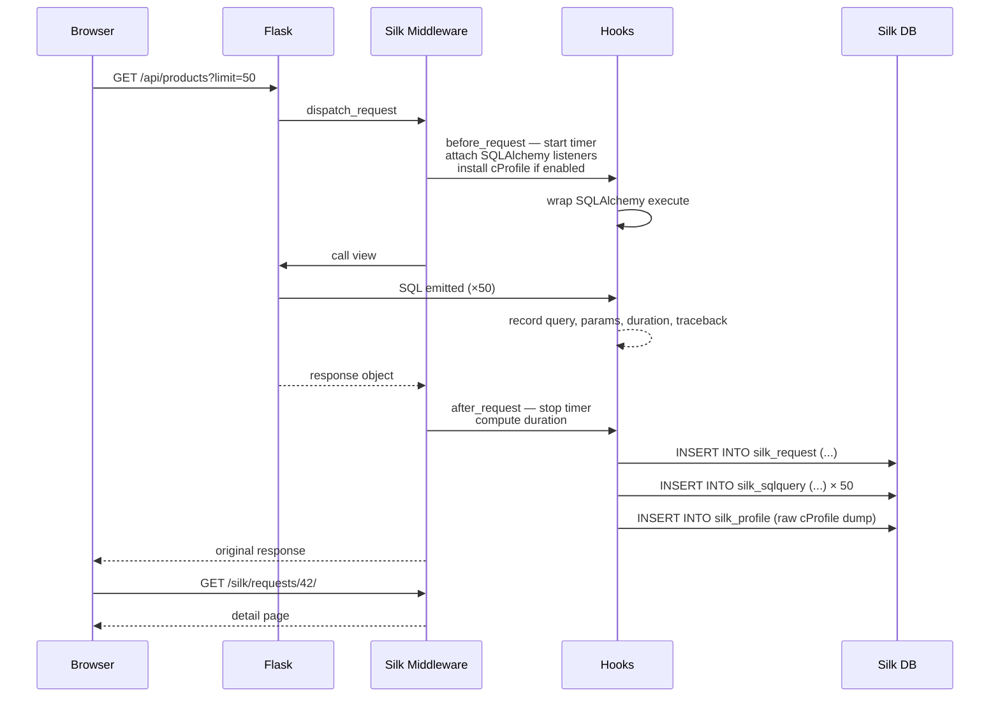

# Flask-Silk

#flask #profiling #cprofile #sql #performance #inspection #debugging

> [!info] Request-level profiling with a built-in UI for browsing history
> **Flask-Silk** is a live profiling and inspection layer for Flask. Unlike [[Flask-DebugToolbar]] — which only inspects the current request — Silk stores every profiled request (or a sample of them) into a database and serves a beautiful admin UI at `/silk/` where you can page through past requests, drill into per-endpoint statistics, expand SQL queries with their exact parameters, and download `cProfile` dumps for offline analysis with `snakeviz` or `gprof2dot`.

Think of Flask-Silk as a **security camera for your request handler**. The toolbar shows you a single freeze-frame; Silk records the whole day's footage and lets you scrub back to "the request at 14:37 that took 4.2 seconds and made 187 SQL queries". You can replay it, expand every SQL statement, see the cProfile call tree, and find the bottleneck without ever leaving the browser.

> [!warning] Silk is not free overhead
> Every profiled request pays 2–15% additional wall-clock time, depending on `SILK_PYTHON_PROFILER` and how chatty your SQL layer is. In staging this is fine; in production use `SILK_INTERCEPT_PERCENT = 1` (1% sampling) or leave it disabled.

---

## 1. Overview & Metaphor

### Why profile per-request, historically?

There are three layers of "why is my Flask app slow?" investigation:

1. **Aggregate metrics** — Prometheus, Datadog, NewRelic answer *"is the endpoint slow in general?"*
2. **Distributed tracing** — OpenTelemetry, Jaeger answer *"which downstream service is the slow one?"*
3. **Per-request inspection** — Flask-Silk answers *"what did THIS specific request do, line by line?"*

Each layer has different fidelity and different cost. Aggregate metrics are cheap and lossy. Distributed tracing is medium cost, medium fidelity. Per-request inspection is expensive but pixel-perfect. Silk occupies layer 3, with a **history browser** so you don't have to be watching when the slow request happened.

### The Silk data model

```mermaid
flowchart TB
    REQ[HTTP Request] --> MW[Silk middleware wraps app]
    MW --> BEFORE[before_request:<br/>start timer, install SQL hooks]
    BEFORE --> VIEW[Flask view runs]
    VIEW --> SQL[SQL queries captured<br/>with raw text + params + duration]
    VIEW --> TPL[Templates rendered]
    VIEW --> LOG[Python profiler running<br/>if SILK_PYTHON_PROFILER=True]
    SQL --> COLLECT
    TPL --> COLLECT
    LOG --> COLLECT[cProfile.stats object]
    VIEW --> AFTER[after_request:<br/>stop timer, compute duration]
    COLLECT --> STORE[Silk Request record saved]
    STORE --> DB[(Silk SQLite / Postgres)]
    DB --> UI[/silk/ admin UI<br/>paginated request history]

    classDef store fill:#dcfce7,stroke:#16a34a;
    class DB,UI store;
```

Every profiled request becomes a `Request` row with one-to-many `SQLQuery` rows and an optional `Profile` row holding the cProfile binary dump. The UI at `/silk/` queries this database, paginates the requests, and lets you drill into each one.

### When to use Silk vs alternatives

| Need | Tool of choice |
|---|---|
| "Show me the SQL of *this* request I'm debugging right now" | [[Flask-DebugToolbar]] |
| "Show me the SQL of the slow request that happened 10 minutes ago" | **Flask-Silk** |
| "Aggregate the 95th-percentile latency of `/api/orders` over the last hour" | Prometheus + Grafana |
| "Which endpoints are slowest across all of yesterday's traffic?" | [[Flask-Profiler]] or APM |
| "Why is this Celery task slow?" | py-spy, scalene, or `celery -A app.events` |

> [!tip] The right-sized tool
> Silk is for **staging and pre-prod** investigations. For one-off local debugging, the toolbar is faster. For production observability, you need an APM. Silk is the goldilocks layer in between.

---

## 2. Installation

```bash
(venv) $ pip install flask-silk
```

| Package | Version used in this note |
|---|---|
| Flask | 3.0.x |
| flask-silk | 5.x |
| Flask-SQLAlchemy | 3.1.x (Silk requires SQLAlchemy internally) |

> [!warning] Silk 5.x vs 4.x
> Silk 5.x supports Flask 2.3+ and SQLAlchemy 2.x. If you are on Flask 1.x or SQLAlchemy 1.4, pin `flask-silk<5`.

Silk bundles its own Jinja templates and static assets (Bootstrap, jQuery, Chart.js) — there are no extra front-end dependencies to install. Silk uses SQLAlchemy internally to persist profile data, so even if your app doesn't use SQLAlchemy, Silk creates its own engine.

---

## 3. Configuration

All Silk configuration lives under the `SILK_*` namespace in `app.config`.

| Key | Default | Description |
|---|---|---|
| `SILK_PYTHON_PROFILER` | `False` | If `True`, run `cProfile.Profile()` on every profiled request and store the dump. ~10% overhead. |
| `SILKY_PYTHON_PROFILER` | `False` | Legacy alias (older docs use this name). Prefer the shorter form. |
| `SILK_INTERCEPT_PERCENT` | `100` | Integer 0–100. Percentage of requests to profile. Set to `1` for staging, `0` to disable. |
| `SILK_INTERCEPT_REDIRECTS` | `True` | Profile redirect responses too. |
| `SILK_DYNAMIC_PROFILING` | `False` | Profile specific blocks via `@silk_profile` decorator. |
| `SILK_MAX_REQUEST_BODY_SIZE` | `-1` (unlimited) | Max bytes of request body to capture. Set to a reasonable limit to avoid storing huge uploads. |
| `SILK_MAX_RESPONSE_BODY_SIZE` | `-1` | Max bytes of response body to capture. |
| `SILK_METADATA` | `None` | Extra metadata function (see §6). |
| `SILK_DATABASE_PATH` | `silk.sqlite` (sqlite) | Path to the SQLite file. Use `SILKY_DATABASE_PATH` on older versions. |
| `SILK_DATABASE_ENGINE` | sqlite | SQLAlchemy URL for the Silk metadata DB. Can be a separate Postgres. |
| `SILK_AUTH` | `None` | Authentication function for the `/silk/` UI. **Set this in any non-local environment.** |
| `SILK_ENABLE` | `True` | Master switch. |
| `SILK_HIDE_FILE_INPUT` | `False` | Hide the file input from the request body capture. |

### The minimum safe config

```python
from flask import Flask
from flask_silk import Silk

app = Flask(__name__)
app.config.update(
    SILK_ENABLE              = app.debug,           # only in debug
    SILK_PYTHON_PROFILER     = False,               # enable per-investigation
    SILK_INTERCEPT_PERCENT   = 100 if app.debug else 0,
    SILK_INTERCEPT_REDIRECTS = False,
    SILK_MAX_REQUEST_BODY_SIZE  = 1024 * 100,        # 100 KB
    SILK_MAX_RESPONSE_BODY_SIZE = 1024 * 1024,       # 1 MB
    SILK_AUTH = lambda user, password: (user == "admin" and password == os.environ["SILK_PWD"]),
)

silk = Silk(app)
```

> [!danger] `SILK_AUTH` is mandatory in any non-local deployment
> The `/silk/` UI shows the full SQL of every request — including parameters that may be PII (email, password hash, API key). Without `SILK_AUTH`, anyone hitting `/silk/` on your staging server gets read access to all of it. Always require HTTP Basic Auth at minimum.

---

## 4. Basic Usage

### Minimal app

```python
# app.py
import os, time
from flask import Flask, jsonify
from flask_sqlalchemy import SQLAlchemy
from flask_silk import Silk

app = Flask(__name__)
app.config.update(
    SECRET_KEY = "dev",
    SQLALCHEMY_DATABASE_URI = "sqlite:///shop.db",
    SQLALCHEMY_TRACK_MODIFICATIONS = False,
    SILK_ENABLE = True,
    SILK_PYTHON_PROFILER = True,             # capture cProfile dumps
    SILK_INTERCEPT_PERCENT = 100,
    SILK_AUTH = lambda u, p: (u == "admin" and p == os.environ["SILK_PWD"]),
)

db = SQLAlchemy(app)
silk = Silk(app)

class Product(db.Model):
    id    = db.Column(db.Integer, primary_key=True)
    name  = db.Column(db.String(80), nullable=False)
    price = db.Column(db.Numeric(10, 2), nullable=False)

with app.app_context():
    db.create_all()
    if not Product.query.first():
        for i in range(200):
            db.session.add(Product(name=f"Item {i}", price=1.0 + i * 0.1))
        db.session.commit()

@app.route("/api/products")
def list_products():
    limit = int(request.args.get("limit", 50))
    # Intentionally inefficient — N+1 pattern
    products = Product.query.limit(limit).all()
    result = []
    for p in products:
        result.append({"id": p.id, "name": p.name.upper(), "price": float(p.price)})
    return jsonify(result)

@app.route("/slow")
def slow():
    time.sleep(0.5)
    return jsonify({"ok": True})

if __name__ == "__main__":
    app.run(debug=True)
```

Run it, hit a few endpoints, then visit `/silk/`:

```
http://localhost:5000/silk/
```

The landing page shows a paginated table of recent requests:

| Time | Path | Method | Status | Time (ms) | SQL Queries |
|---|---|---|---|---|---|
| 14:37:01 | /api/products?limit=50 | GET | 200 | 124.3 | 51 |
| 14:36:58 | /slow | GET | 200 | 503.2 | 0 |
| 14:36:42 | /api/products | GET | 200 | 89.7 | 51 |

Click any row to drill into the request detail — headers, body, response, SQL queries, and (if `SILK_PYTHON_PROFILER=True`) a "Download Profile" link.

### The request profiling flow



---

## 5. Intermediate Patterns

### Sampling in staging

If you can't afford to profile every request, sample:

```python
import random
app.config["SILK_INTERCEPT_PERCENT"] = 10   # profile 1 in 10
```

Silk uses a uniform RNG per-request, so over time you get a statistically representative sample. Combine with `SILK_PYTHON_PROFILER=True` for a low-overhead way to catch outliers:

```python
# Profile everything, but only run cProfile on slow ones
app.config["SILK_INTERCEPT_PERCENT"] = 100
app.config["SILK_PYTHON_PROFILER"] = False

@app.after_request
def maybe_enable_profiler(response):
    if g.get("silk_request") and response.status_code == 200:
        # Inspect duration on next request via Silk's API
        pass
    return response
```

### Browsing SQL queries

Each request detail page in `/silk/requests/<id>/` shows a "SQL Queries" tab. For each query:

- **Raw SQL** with placeholders (e.g. `WHERE id = ?`)
- **Bound parameters** inlined on hover (`WHERE id = 42`)
- **Duration** in milliseconds
- **Traceback** — the Python call site that triggered the query
- **Count** — if the same query ran N times, you see "× N"

The N+1 in our example shows up immediately:

```
SELECT product.id, product.name, product.price
FROM product
LIMIT ? OFFSET ?
-- params: (50, 0)
-- duration: 1.2 ms
-- caller: app.py:30 (list_products)

SELECT ... FROM product WHERE id = ?  × 50   ← BAD!
-- params: (1,), (2,), ..., (50,)
-- total: 48.7 ms
```

### The cProfile download

When `SILK_PYTHON_PROFILER=True`, every request page has a "Download Profile" button. Save the `.prof` file and inspect it offline:

```bash
# Option 1: snakeviz (interactive flame graph in browser)
(venv) $ pip install snakeviz
(venv) $ snakeviz request_42.prof

# Option 2: gprof2dot (call graph as Graphviz)
(venv) $ pip install gprof2dot
(venv) $ gprof2dot -f pstats request_42.prof | dot -Tpng -o profile.png

# Option 3: stdlib pstats
(venv) $ python -m pstats request_42.prof
% sort cumulative
% stats 20
```

### Filtering requests in the UI

The `/silk/requests/` view supports query-string filters:

| Filter | Example | Effect |
|---|---|---|
| `path` | `/silk/requests/?path=/api/products` | Exact path match |
| `method` | `/silk/requests/?method=POST` | HTTP method |
| `status` | `/silk/requests/?status=500` | HTTP status code |
| `time__gte` | `/silk/requests/?time__gte=100` | Wall time ≥ 100ms |
| `num_sql_queries__gte` | `?num_sql_queries__gte=10` | ≥ 10 SQL queries |
| `order_by` | `?order_by=-time` | Sort by time desc |

These mirror Django ORM-style lookups — Silk uses a similar query DSL internally.

---

## 6. Advanced Usage

### Custom metadata per request

Silk can capture arbitrary request-scoped context — current user, tenant, feature flags — via `SILK_METADATA`:

```python
from flask import g
from flask_login import current_user

def silk_metadata():
    return {
        "user_id":  getattr(current_user, "id", None),
        "tenant":   getattr(g, "tenant", None),
        "ab_flags": getattr(g, "ab_flags", {}),
    }

app.config["SILK_METADATA"] = silk_metadata
```

The metadata appears as a JSON column on each request row, and you can filter the UI on it: `/silk/requests/?meta_user_id=42`.

### Dynamic profiling with `@silk_profile`

For long-running views where you want to profile *only a section*, not the whole request:

```python
from flask_silk import silk_profile

@app.route("/dashboard")
def dashboard():
    with silk_profile("fetch_orders"):
        orders = Order.query.filter(...).all()
    with silk_profile("render_template"):
        return render_template("dashboard.html", orders=orders)
```

Each `silk_profile` block becomes a sub-entry in the request's profile tree. Requires `SILK_DYNAMIC_PROFILING=True`.

### Sharing a Postgres database with the app

By default, Silk uses an in-app SQLite file. To share the app's Postgres:

```python
app.config["SILK_DATABASE_ENGINE"] = app.config["SQLALCHEMY_DATABASE_URI"]
# or specify a separate DSN:
app.config["SILK_DATABASE_ENGINE"] = "postgresql://silk:s3cr3t@db:5432/silk"
```

Run migrations once (Silk auto-creates tables on first request, but for prod-like setups):

```bash
(venv) $ FLASK_APP=app.py flask silk migrate
```

### The SQL inspection pipeline

```mermaid
flowchart LR
    VIEW[View function] --> ORM[SQLAlchemy ORM call]
    ORM --> ENGINE[Engine.execute]
    ENGINE --> HOOK1[before_cursor_execute<br/>record start_time + sql]
    HOOK1 --> DB[(Application DB)]
    DB --> HOOK2[after_cursor_execute<br/>record duration + params]
    HOOK2 --> TRACE[Walk traceback<br/>extract caller frame]
    TRACE --> STORE[Insert silk_sqlquery row]
    STORE --> UI[/silk/ SQL tab]

    classDef hook fill:#fef9c3,stroke:#ca8a04;
    class HOOK1,HOOK2,TRACE,STORE hook;
```

Silk patches SQLAlchemy's `before_cursor_execute` / `after_cursor_execute` events. The raw SQL text is captured *before* parameter binding, then parameters are captured separately so the UI can show both the templated form and the inlined form.

### Programmatic access to Silk data

Silk's models are importable:

```python
from flask_silk import models

with app.app_context():
    slow = (models.Request.query
            .filter(models.Request.time >= 0.5)
            .order_by(models.Request.time.desc())
            .limit(20).all())
    for r in slow:
        print(r.path, r.time, r.num_sql_queries)
```

You can build a custom dashboard on top of this — for example, an alert that fires when the median request time for an endpoint crosses a threshold.

### Auto-clearing old data

Silk accumulates data fast — every request is one row plus one row per SQL query. Schedule a cleanup:

```python
@app.cli.command("silk-prune")
@click.option("--days", default=7, help="Delete Silk records older than N days")
def silk_prune(days):
    from flask_silk import models
    from datetime import datetime, timedelta
    cutoff = datetime.utcnow() - timedelta(days=days)
    deleted = models.Request.query.filter(models.Request.start_time < cutoff).delete()
    models.db.session.commit()
    click.echo(f"Deleted {deleted} old Silk requests")
```

Run nightly via cron:

```bash
0 3 * * *  cd /app && flask silk-prune --days 7
```

### Profiling Celery tasks (via Silk's hooks)

Silk doesn't natively profile background tasks, but you can reuse its SQL instrumentation:

```python
from celery import shared_task
from flask_silk.sql import execute_sql

@shared_task
def rebuild_cache(product_id):
    with app.app_context():
        # Silk's before/after_cursor_execute hooks fire here too
        product = Product.query.get(product_id)
        ...
```

If you want per-task profiles in the Silk UI, write a Celery signal handler that creates a `Request` row manually — see [the Silk source's `RecordedView`](https://github.com/jazzband/silk) for the API.

---

## 7. Common Pitfalls & Troubleshooting

| Symptom | Cause | Fix |
|---|---|---|
| `/silk/` returns 404 | Silk routes registered after your catch-all | Ensure `Silk(app)` is called *after* your blueprints but *before* a catch-all `@app.route("/")` |
| SQL tab empty | `flask_sqlalchemy` not initialized before Silk | Initialize `db.init_app(app)` first; Silk patches the global SQLAlchemy event system |
| `OperationalError: no such table: silk_request` | First-run migration not applied | Hit any non-`/silk/` endpoint once; Silk auto-creates tables on first request |
| UI works but profiler dump missing | `SILK_PYTHON_PROFILER` not enabled | Set it to `True` and re-issue the request |
| Silk DB grows without bound | No cleanup scheduled | Add the `silk-prune` CLI command above |
| `/silk/` shows stale data | SQLite caching | Reload the page; or move Silk DB to Postgres |
| 10%+ overhead in CI tests | Silk enabled during tests | Set `SILK_ENABLE=False` in `TestingConfig` |

> [!bug] Silk + Flask 3.0 `app.context`
> Silk 4.x patches `app.full_dispatch_request`, which changed signature in Flask 3.0. Use Silk 5.x with Flask 3.x. The symptom is a `TypeError: unexpected keyword argument 'passthrough_errors'` on the first request.

> [!warning] Silk stores request bodies
> If your endpoints accept passwords or API keys in the body (not in headers), Silk will store them in `silk_request.body`. Set `SILK_MAX_REQUEST_BODY_SIZE = 0` to disable body capture, or use the `SILK_HIDE_FILE_INPUT` flag.

---

## 8. Best Practices

1. **Always set `SILK_AUTH`** in any non-local environment. Even staging servers are exposed to the corporate network.
2. **Sample in production.** `SILK_INTERCEPT_PERCENT = 1` (or even `0.1`) catches the rare slow outlier without measurable overhead.
3. **Don't enable `SILK_PYTHON_PROFILER` by default.** It's a 10% tax per profiled request. Turn it on when investigating, turn it off when done.
4. **Schedule cleanup.** Use the `silk-prune` snippet above. Without it, a busy staging site accumulates gigabytes in days.
5. **Separate database for Silk.** Use a dedicated `silk.sqlite` or a separate Postgres schema. Mixing Silk's writes into your app's main DB causes lock contention under load.
6. **Pair with `EXPLAIN ANALYZE`.** When Silk shows a slow query, copy it into `psql` and run `EXPLAIN (ANALYZE, BUFFERS)` to see the query plan.

> [!success] The investigation loop
> 1. Hit the slow endpoint once.
> 2. Open `/silk/requests/`, find the row.
> 3. Click "SQL" tab, sort by duration desc.
> 4. Copy the slowest query, run `EXPLAIN ANALYZE` in psql.
> 5. Add the missing index. Re-hit the endpoint. Compare in `/silk/`.

---

## 9. Integration with Other Extensions

### Flask-SQLAlchemy

Silk auto-detects SQLAlchemy and patches `before_cursor_execute`. For Flask-SQLAlchemy 3.x, ensure `db.init_app(app)` is called *before* `Silk(app)` so the engine is registered when Silk attaches its listeners.

### Flask-Login / Flask-Security

The `SILK_METADATA` callback (see §6) lets you tag each Silk request with the authenticated user — invaluable for tracing "user 42 reports the dashboard is slow" directly to the offending request row.

### [[Flask-DebugToolbar]]

You can run both simultaneously in development. The toolbar gives you a single-request microscope; Silk gives you the history browser. They don't conflict — they patch different layers.

```python
if app.debug:
    DebugToolbarExtension(app)  # in-page
    Silk(app)                   # /silk/ history
```

### [[Flask-Profiler]]

[[Flask-Profiler]] is a different extension (not Silk) focused on aggregate metrics. The two solve different problems: Silk is request-level inspection, Flask-Profiler is endpoint-level analytics. They are complementary, not competitive — but in practice you'll pick one.

### [[Structlog-Integration]]

Silk captures stdlib `logging` records per request. If you use structlog, route its output through a stdlib handler so Silk can pick it up:

```python
import structlog
structlog.configure(
    processors=[..., structlog.stdlib.render_to_log_kwargs],
    logger_factory=structlog.stdlib.LoggerFactory(),
)
```

### Sentry / OpenTelemetry

Silk's per-request SQL capture is more granular than Sentry's spans, but Silk doesn't ship data off-box. For long-term storage, consider routing Sentry breadcrumb data into a custom Silk metadata field.

---

## 10. Real-World Example: Staging Profiling Stack

```python
# extensions/silk_ext.py
import os
from flask import Flask, request, g
from flask_silk import Silk

def configure_silk(app: Flask) -> Silk:
    is_staging = app.config.get("ENV") == "staging"
    is_dev     = app.config.get("ENV") == "development"

    app.config.update(
        SILK_ENABLE              = is_dev or is_staging,
        SILK_INTERCEPT_PERCENT   = 100 if is_dev else 10,
        SILK_PYTHON_PROFILER     = is_dev and os.environ.get("SILK_PROFILER") == "1",
        SILK_INTERCEPT_REDIRECTS = False,
        SILK_MAX_REQUEST_BODY_SIZE  = 100 * 1024,           # 100 KB
        SILK_MAX_RESPONSE_BODY_SIZE = 1024 * 1024,           # 1 MB
        SILK_AUTH = _silk_auth,
        SILK_METADATA = _silk_metadata,
    )
    return Silk(app)

def _silk_auth(user, password):
    expected_user = os.environ.get("SILK_USER", "admin")
    expected_pwd  = os.environ["SILK_PWD"]
    return user == expected_user and password == expected_pwd

def _silk_metadata():
    from flask_login import current_user
    return {
        "user_id":  getattr(current_user, "id", None),
        "tenant":   getattr(g, "tenant_id", None),
        "ua":       request.headers.get("User-Agent", "")[:80],
    }
```

```python
# app.py
from flask import Flask
from flask_sqlalchemy import SQLAlchemy
from extensions.silk_ext import configure_silk

db = SQLAlchemy()

def create_app():
    app = Flask(__name__)
    app.config.from_object("config.DefaultConfig")
    db.init_app(app)
    configure_silk(app)         # attaches /silk/ routes
    return app
```

### Where Silk fits in the observability stack

```mermaid
flowchart TB
    subgraph Edge[Edge / Reverse Proxy]
        NGINX[nginx access log]
    end
    subgraph App[Flask Application]
        MW[Silk middleware<br/>10% sampled in staging]
        LOG[structlog JSON logs]
    end
    subgraph Observability
        PROM[Prometheus<br/>scrape /metrics]
        SENTRY[Sentry<br/>exceptions only]
        LOKI[Loki / ELK<br/>log aggregation]
    end

    NGINX --> MW
    MW -->|profiled request| SILKDB[(Silk SQLite)]
    MW -->|regular request| APP[App logic]
    APP --> LOG
    LOG --> LOKI
    APP --> PROM
    APP -->|exception| SENTRY

    SILKDB --> UI[/silk/ admin UI]

    classDef silk fill:#dcfce7,stroke:#16a34a;
    class MW,SILKDB,UI silk;
```

---

## 11. References

- **PyPI**: <https://pypi.org/project/flask-silk/>
- **Source**: <https://github.com/jazzband/silk>
- **Docs**: <https://flask-silk.readthedocs.io/>
- **`cProfile` module**: <https://docs.python.org/3/library/profile.html>
- **`snakeviz`**: <https://jiffyclub.github.io/snakeviz/>
- **`gprof2dot`**: <https://github.com/jrfonseca/gprof2dot>
- Related vault notes: [[Flask-DebugToolbar]], [[Flask-Profiler]], [[Structlog-Integration]], [[Flask-SQLAlchemy]], [[Performance-Optimization]], [[Production-Deployment]], [[Security-Best-Practices]]

> [!quote] Final word
> Flask-Silk is the **staging microscope**. It catches the slow request you didn't see coming, surfaces the SQL you didn't know was running, and gives you a cProfile dump you can hand to a junior engineer. The only sin is leaving it enabled without `SILK_AUTH`.
