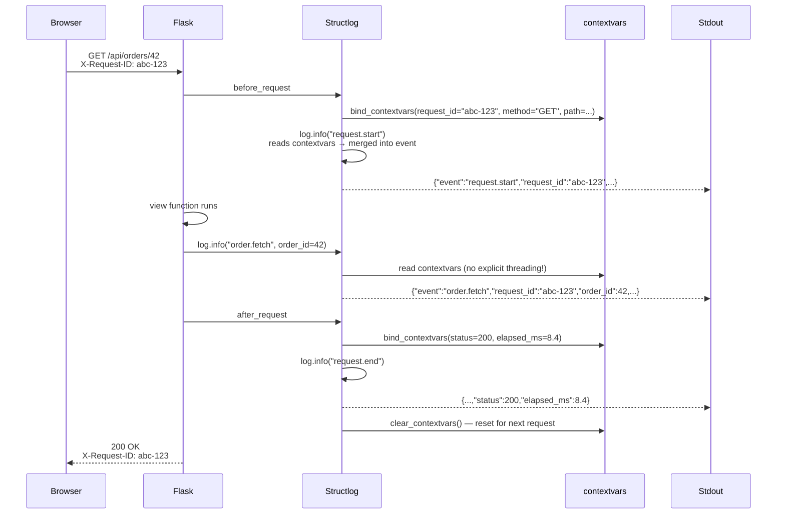
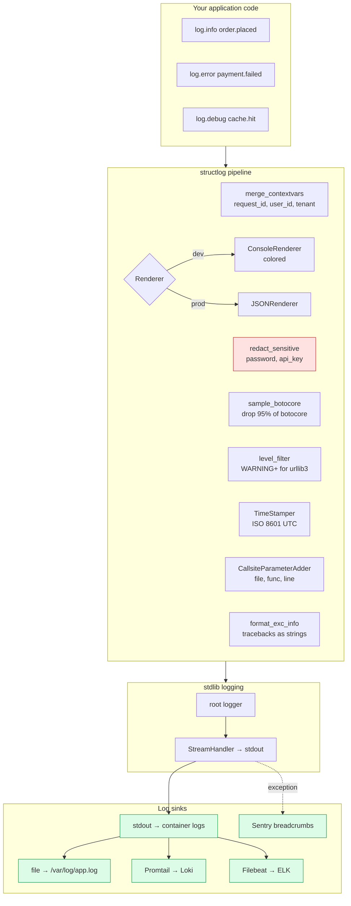
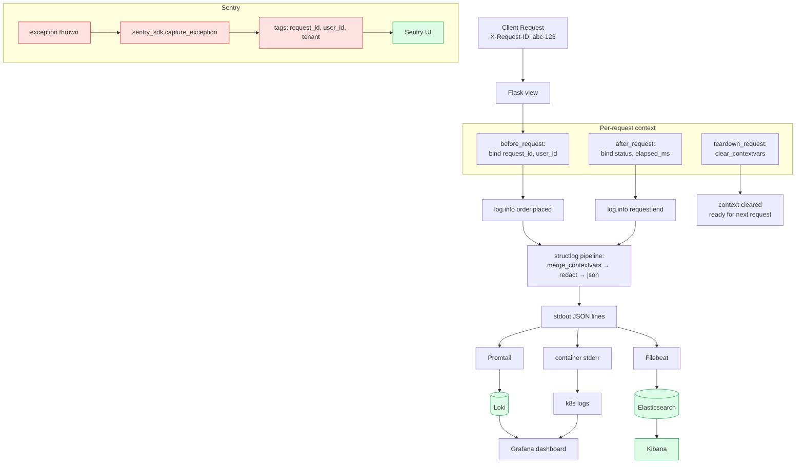

# Structlog Integration

#flask #logging #structlog #observability #json #contextvars #sentry #elk #loki

> [!info] Structured logging that doesn't fight Python's stdlib
> **structlog** is not a Flask extension — it's a pure-Python library — but it is *the* recommended way to add structured (JSON) logging to a Flask application. It produces machine-parseable log records with stable schemas, pluggable context propagation via `contextvars`, and a clean escape hatch into the stdlib `logging` module so you don't have to throw away your existing handlers.

Think of structlog as a **typewriter ribbon for your log lines**. Standard `logging` writes plain text — fine for human eyes, painful for grep. `print()` is worse: no levels, no handlers, no formatting. structlog replaces both with a *ribbon* that prints structured key-value pairs (JSON in prod, pretty console output in dev) and lets you stamp every log line with **request-scoped context** — `request_id`, `user_id`, `tenant_id`, `route` — without threading them through every function signature.

> [!tip] Why not just `logging.basicConfig`?
> Plain `logging` works fine for "hello world". The moment you have 10 microservices, 4 workers, and a request fan-out across 3 downstreams, you need every log line to carry the `request_id` that ties them together. Doing that with stdlib requires ~200 lines of `logging.Filter` and `logging.LoggerAdapter` plumbing. structlog does it in 20.

---

## 1. Overview & Metaphor

### What structured logging actually means

A "log line" in classic Python looks like:

```
2024-01-15 14:37:01 INFO  app.views  User 42 placed order 1001 for $19.99
```

A human reads that and understands. A log aggregator (ELK, Loki, Datadog) has to **parse** it with a regex like `User (?P<user_id>\d+) placed order (?P<order_id>\d+) for \$(?P<amount>[\d.]+)`. The regex breaks the moment someone changes the format string. Every new log line is a new regex.

Structured logging flips the model: the application emits **fields**, not text:

```json
{"event": "order.placed", "user_id": 42, "order_id": 1001, "amount": 19.99,
 "request_id": "abc-123", "level": "info", "timestamp": "2024-01-15T14:37:01Z",
 "logger": "app.views"}
```

The text is just a rendering of the fields. ELK indexes the fields directly; Loki labels them; grep becomes `jq '.user_id == 42'`. No regex.

### The structlog pipeline

```mermaid
flowchart LR
    CODE[your_code.py<br/>log.info('order.placed', user_id=42)] --> LOGGER[structlog Logger]
    LOGGER --> CTX[Bind context vars:<br/>request_id, user_id, tenant]
    CTX --> PROC1[Processor 1: add timestamp]
    PROC1 --> PROC2[Processor 2: add log level]
    PROC2 --> PROC3[Processor 3: add request_id]
    PROC3 --> PROC4[Processor 4: format exception]
    PROC4 --> RENDER[Renderer:<br/>JSON for prod<br/>ConsoleRenderer for dev]
    RENDER --> OUT[Output:<br/>stdout / file / syslog / Sentry / ELK / Loki]

    classDef proc fill:#fef9c3,stroke:#ca8a04;
    class PROC1,PROC2,PROC3,PROC4 proc;
    classDef out fill:#dcfce7,stroke:#16a34a;
    class OUT out;
```

The pipeline is a list of callables — each receives the event dict, mutates it, returns it. This is structlog's core abstraction: **a log record is a dict that flows through processors**. You write your own processors for custom logic (redact secrets, sample, drop chatty events) without subclassing anything.

### Comparison with alternatives

| Feature | stdlib `logging` | `loguru` | **structlog** |
|---|---|---|---|
| Pure-Python, no deps | ✅ | ❌ (one dep) | ✅ |
| Built on stdlib `logging` | ✅ (is it) | ❌ (own engine) | ✅ (interop via `LoggerFactory`) |
| Native structured output | ❌ (string formatting) | ⚠️ (`.bind(extra=...)`) | ✅ |
| Context propagation | ❌ (manual `Filter`) | ⚠️ (`.bind()`) | ✅ (`contextvars`) |
| Pretty dev + JSON prod | ❌ | ✅ | ✅ |
| Drop-in for `logging.getLogger()` | ✅ | ❌ | ✅ |
| Async-safe | ⚠️ (thread-local) | ❌ | ✅ (`contextvars`) |
| Mature ecosystem | ✅ | ✅ | ✅ |

> [!tip] When to use which
> - **stdlib only** — scripts, throwaway code
> - **loguru** — solo dev projects, simple needs, "I just want pretty logs"
> - **structlog** — production Flask apps, multi-worker, distributed systems, anything that needs to ship to ELK/Loki

---

## 2. Installation

```bash
(venv) $ pip install structlog
# Optional extras:
(venv) $ pip install structlog[rich]      # pretty dev output via rich
(venv) $ pip install python-json-logger   # alternative JSON formatter if needed
```

| Package | Version used in this note |
|---|---|
| Flask | 3.0.x |
| structlog | 24.x |
| python-json-logger (optional) | 2.x |

structlog has **zero required dependencies** beyond Python 3.8+. The `[rich]` extra adds the `rich` library for nicer console output during development.

> [!warning] structlog 24.x is the first version with full `contextvars` support by default
> If you're upgrading from structlog 20.x, your context propagation may break — the default `ContextVar`-based processor changed in 23.x. See the migration notes in §7.

---

## 3. Configuration

### The minimal Flask + structlog setup

```python
# logging_config.py
import logging
import structlog

def configure_logging(app):
    """Configure structlog for both dev and prod, integrated with Flask."""

    # 1. Configure stdlib logging (so existing Flask logs flow through structlog)
    logging.basicConfig(
        format="%(message)s",
        stream=sys.stdout,
        level=logging.INFO,
    )

    # 2. Configure structlog
    timestamper = structlog.processors.TimeStamper(fmt="iso", utc=True)

    shared_processors = [
        structlog.contextvars.merge_contextvars,         # add bound context
        structlog.stdlib.add_log_level,
        structlog.stdlib.add_logger_name,
        timestamper,
        structlog.processors.StackInfoRenderer(),
        structlog.processors.format_exc_info,
    ]

    if app.debug:
        # Pretty console output for development
        renderer = structlog.dev.ConsoleRenderer(colors=True)
    else:
        # JSON for production
        renderer = structlog.processors.JSONRenderer()

    structlog.configure(
        processors=shared_processors + [renderer],
        wrapper_class=structlog.make_filtering_bound_logger(
            logging.getLevelName(app.config.get("LOG_LEVEL", "INFO"))
        ),
        logger_factory=structlog.stdlib.LoggerFactory(),
        cache_logger_on_first_use=True,
    )

    # 3. Wire Flask's own logger through structlog
    flask_logger = logging.getLogger("flask")
    flask_logger.handlers = []
    flask_logger.propagate = True   # let it bubble to root

    app.logger = structlog.get_logger("flask.app")
```

### The configuration knobs

| Setting | Purpose | Example |
|---|---|---|
| `processors` | List of callables that mutate the event dict | `[merge_contextvars, add_log_level, JSONRenderer()]` |
| `wrapper_class` | The class returned by `get_logger()` — controls `log.info()` semantics | `make_filtering_bound_logger(INFO)` |
| `logger_factory` | What's underneath structlog — usually `stdlib.LoggerFactory()` | lets you reuse existing `logging` handlers |
| `cache_logger_on_first_use` | Performance: configure once per logger name | `True` |
| `context_class` | What `bind()` returns — usually `dict` | `dict` |

### The processor reference

| Processor | What it does |
|---|---|
| `structlog.contextvars.merge_contextvars` | Merges values bound via `bind_contextvars()` into every event |
| `structlog.contextvars.clear_contextvars` | Wipes the contextvar state (call per-request teardown) |
| `structlog.stdlib.add_log_level` | Adds `level: "info"` field |
| `structlog.stdlib.add_logger_name` | Adds `logger: "app.views"` field |
| `structlog.stdlib.filter_by_level` | Filters by level (alternative to wrapper_class) |
| `structlog.processors.TimeStamper` | Adds `timestamp` field; `fmt="iso"` for ISO 8601 |
| `structlog.processors.StackInfoRenderer` | Adds `stack: ...` on `log.info(..., stack_info=True)` |
| `structlog.processors.format_exc_info` | Renders `exc_info=True` into a string field |
| `structlog.processors.UnicodeDecoder` | Decodes all values to `str` (avoid `bytes` in JSON) |
| `structlog.processors.JSONRenderer()` | Final step in prod: renders dict → JSON string |
| `structlog.dev.ConsoleRenderer()` | Final step in dev: pretty colored console |
| `structlog.processors.CallsiteParameterAdder` | Adds `module`, `function`, `lineno` |

### YAML-driven alternative

For complex deployments, drive config from environment:

```python
import os, json

def make_processors(env):
    shared = [
        structlog.contextvars.merge_contextvars,
        structlog.stdlib.add_log_level,
        structlog.processors.TimeStamper(fmt="iso", utc=True),
        structlog.processors.format_exc_info,
    ]
    if env == "development":
        return shared + [structlog.dev.ConsoleRenderer(colors=True)]
    return shared + [structlog.processors.JSONRenderer()]
```

---

## 4. Basic Usage

### The minimal Flask app with structured logging

```python
# app.py
import sys, time, uuid
from flask import Flask, request, g
import structlog
from logging_config import configure_logging

app = Flask(__name__)
app.config["LOG_LEVEL"] = "INFO"
configure_logging(app)

log = structlog.get_logger("app")

@app.before_request
def start_request():
    g.request_id = request.headers.get("X-Request-ID") or str(uuid.uuid4())
    structlog.contextvars.bind_contextvars(
        request_id=g.request_id,
        method=request.method,
        path=request.path,
        remote_addr=request.remote_addr,
    )
    g.start_time = time.perf_counter()
    log.info("request.start")

@app.after_request
def end_request(response):
    elapsed_ms = (time.perf_counter() - g.start_time) * 1000
    structlog.contextvars.bind_contextvars(
        status=response.status_code,
        elapsed_ms=round(elapsed_ms, 2),
    )
    log.info("request.end")
    structlog.contextvars.clear_contextvars()
    response.headers["X-Request-ID"] = g.request_id
    return response

@app.route("/api/orders/<int:order_id>")
def get_order(order_id):
    log.info("order.fetch", order_id=order_id)
    if order_id == 404:
        log.warning("order.not_found", order_id=order_id)
        return {"error": "not found"}, 404
    return {"id": order_id, "total": 19.99}

if __name__ == "__main__":
    app.run(debug=True)
```

### What the output looks like

In **development** (pretty ConsoleRenderer):

```
2024-01-15T14:37:01.123Z [info     ] request.start   method=GET path=/api/orders/42 request_id=abc-123 remote_addr=127.0.0.1
2024-01-15T14:37:01.128Z [info     ] order.fetch     method=GET order_id=42 path=/api/orders/42 request_id=abc-123 remote_addr=127.0.0.1
2024-01-15T14:37:01.131Z [info     ] request.end     elapsed_ms=8.4 method=GET path=/api/orders/42 request_id=abc-123 remote_addr=127.0.0.1 status=200
```

In **production** (JSONRenderer):

```json
{"event":"request.start","method":"GET","path":"/api/orders/42","request_id":"abc-123","remote_addr":"127.0.0.1","level":"info","timestamp":"2024-01-15T14:37:01.123Z","logger":"app"}
{"event":"order.fetch","method":"GET","order_id":42,"path":"/api/orders/42","request_id":"abc-123","remote_addr":"127.0.0.1","level":"info","timestamp":"2024-01-15T14:37:01.128Z","logger":"app"}
{"event":"request.end","elapsed_ms":8.4,"method":"GET","path":"/api/orders/42","request_id":"abc-123","remote_addr":"127.0.0.1","status":200,"level":"info","timestamp":"2024-01-15T14:37:01.131Z","logger":"app"}
```

Every line carries `request_id` automatically — without ever passing it through `get_order()`.

### The context propagation flow



> [!tip] Why `contextvars` and not `threading.local()`
> `contextvars` works correctly across `async`/`await`, thread pools, and asyncio tasks. `threading.local()` does not — a coroutine running on thread A, suspended, and resumed on thread B would see thread B's context. With the rise of ASGI / async Flask, `contextvars` is the only correct primitive.

---

## 5. Intermediate Patterns

### Binding the current user

```python
from flask_login import current_user

@app.before_request
def bind_user():
    if current_user.is_authenticated:
        structlog.contextvars.bind_contextvars(
            user_id=current_user.id,
            user_email=current_user.email,
        )
```

Now every log line — including ones emitted by Flask-SQLAlchemy's engine logger or Flask-Caching's logger — carries `user_id`. No need to thread it through every function.

### Redacting sensitive fields

PII like emails, passwords, and API keys should never appear in logs. Add a redaction processor:

```python
SENSITIVE_KEYS = {"password", "api_key", "authorization", "credit_card", "ssn"}

def redact_sensitive(logger, method_name, event_dict):
    for key in list(event_dict.keys()):
        if key.lower() in SENSITIVE_KEYS:
            event_dict[key] = "[REDACTED]"
        elif isinstance(event_dict[key], dict):
            event_dict[key] = redact_dict(event_dict[key])
    return event_dict

def redact_dict(d):
    return {k: ("[REDACTED]" if k.lower() in SENSITIVE_KEYS else v)
            for k, v in d.items()}

# Add to processors list BEFORE the renderer:
structlog.configure(
    processors=[
        structlog.contextvars.merge_contextvars,
        structlog.stdlib.add_log_level,
        redact_sensitive,                                  # ← custom
        structlog.processors.TimeStamper(fmt="iso", utc=True),
        structlog.processors.JSONRenderer(),
    ],
    ...
)
```

### Sampling chatty loggers

Some loggers (e.g. `botocore`, `urllib3`) are noisy. Sample them down:

```python
import random

def sample_botocore(logger, method_name, event_dict):
    if event_dict.get("logger", "").startswith("botocore"):
        if random.random() > 0.05:   # log 5%
            raise structlog.DropEvent       # signal to skip
    return event_dict

structlog.configure(
    processors=[..., sample_botocore, structlog.processors.JSONRenderer()],
    ...
)
```

`structlog.DropEvent` is the canonical way to silently drop a record.

### Conditional level per logger

```python
def level_filter(logger_name, min_level):
    import logging
    levelno = logging.getLevelName(min_level)

    def processor(logger, method_name, event_dict):
        if event_dict.get("logger", "").startswith(logger_name):
            current_level = logging.getLevelName(event_dict.get("level", "INFO"))
            if current_level < levelno:
                raise structlog.DropEvent
        return event_dict
    return processor

structlog.configure(
    processors=[
        ...,
        level_filter("botocore", "WARNING"),
        level_filter("urllib3", "WARNING"),
        structlog.processors.JSONRenderer(),
    ],
    ...
)
```

### Callsite info (file:line)

To know *where* a log line was emitted, add `CallsiteParameterAdder`:

```python
import structlog

structlog.configure(
    processors=[
        structlog.contextvars.merge_contextvars,
        structlog.processors.CallsiteParameterAdder(
            parameters=[
                structlog.processors.CallsiteParameter.FILENAME,
                structlog.processors.CallsiteParameter.FUNC_NAME,
                structlog.processors.CallsiteParameter.LINENO,
            ]
        ),
        structlog.processors.JSONRenderer(),
    ],
    ...
)
```

Output gains `"filename":"app.py","func_name":"get_order","lineno":42`.

---

## 6. Advanced Usage

### Custom processor: extract request body

```python
import json
from flask import request

MAX_BODY_LOG = 1024  # don't log huge bodies

def add_request_body(logger, method_name, event_dict):
    """Attach a truncated request body to certain events."""
    if event_dict.get("event") in ("request.start", "request.error"):
        try:
            body = request.get_data(as_text=True) or ""
            if len(body) > MAX_BODY_LOG:
                body = body[:MAX_BODY_LOG] + "...[truncated]"
            event_dict["request_body"] = body
        except Exception:
            event_dict["request_body"] = "[unreadable]"
    return event_dict

structlog.configure(
    processors=[
        structlog.contextvars.merge_contextvars,
        add_request_body,                    # ← our custom processor
        structlog.processors.JSONRenderer(),
    ],
    ...
)
```

### A complete log pipeline



### Integration with Sentry

Sentry picks up `logging` records automatically via its `LoggingIntegration`. To make structlog records show up with full context:

```python
import sentry_sdk
from sentry_sdk.integrations.logging import LoggingIntegration

sentry_logging = LoggingIntegration(
    level=logging.INFO,           # Capture info and above as breadcrumbs
    sentry_level=logging.ERROR,   # Send errors as events
)
sentry_sdk.init(
    dsn="https://...@sentry.io/123",
    integrations=[sentry_logging],
    traces_sample_rate=0.1,
)

# structlog → stdlib → Sentry automatically
structlog.configure(
    processors=[..., structlog.stdlib.render_to_log_kwargs],
    logger_factory=structlog.stdlib.LoggerFactory(),
)
```

To attach structlog context to Sentry tags:

```python
def add_sentry_context(logger, method_name, event_dict):
    if event_dict.get("level") in ("error", "exception"):
        for key in ("request_id", "user_id", "tenant"):
            if key in event_dict:
                sentry_sdk.set_tag(key, event_dict[key])
    return event_dict

structlog.configure(processors=[..., add_sentry_context, ...])
```

### Integration with ELK / Loki

Both ELK and Loki consume JSON from stdout. No special integration needed — just configure structlog to emit JSON, ensure Docker / Kubernetes captures stdout, and forward it:

```yaml
# promtail-config.yaml (Loki)
scrape_configs:
  - job_name: flask-app
    static_configs:
      - targets: ["localhost"]
        labels:
          job: flask
          __path__: /var/log/containers/flask-*.log
    pipeline_stages:
      - json:
          expressions:
            level: level
            request_id: request_id
            user_id: user_id
            event: event
      - labels:
          level:
          event:
```

```yaml
# filebeat.yml (ELK)
filebeat.inputs:
  - type: container
    paths:
      - '/var/lib/docker/containers/*/*.log'
    processors:
      - decode_json_fields:
          fields: ["message"]
          target: ""
processors:
  - add_host_metadata: ~
output.elasticsearch:
  hosts: ["elasticsearch:9200"]
```

Once logs land in ELK, you can query:

```
event:"order.placed" AND user_id:42
```

…or in LogQL (Loki):

```
{job="flask"} | event="order.placed" | user_id="42"
```

### Async-safe context with async Flask

If you use Flask 2.0+'s async views, `contextvars` works correctly out of the box — each task gets its own context. Just be sure to `bind_contextvars` inside the view, not outside:

```python
@app.route("/async-work")
async def async_work():
    # Each task has its own contextvar scope
    structlog.contextvars.bind_contextvars(task_id=str(uuid.uuid4()))
    try:
        result = await some_async_operation()
        log.info("work.done", result=result)
        return {"ok": True}
    finally:
        structlog.contextvars.clear_contextvars()
```

### Custom logger factory (for testing)

In tests, capture structlog output to a list:

```python
class CapturingLogger:
    def __init__(self):
        self.events = []
    def __getattr__(self, name):
        # log.info, log.error, etc. all funnel here
        def method(event=None, **kw):
            self.events.append({"level": name, "event": event, **kw})
        return method

@pytest.fixture
def captured_logs(monkeypatch):
    cap = CapturingLogger()
    structlog.configure(logger_factory=lambda *a, **kw: cap)
    yield cap
    structlog.reset_defaults()

def test_order_logging(captured_logs, client):
    client.get("/api/orders/42")
    events = [e for e in captured_logs.events if e["event"] == "order.fetch"]
    assert len(events) == 1
    assert events[0]["order_id"] == 42
```

---

## 7. Common Pitfalls & Troubleshooting

| Symptom | Cause | Fix |
|---|---|---|
| `request_id` missing from some log lines | Processor order wrong, or `clear_contextvars` called too early | `merge_contextvars` must be FIRST in processors; clear in `teardown_request` not `after_request` |
| Duplicate context across requests | Forgot `clear_contextvars()` in teardown | Add `structlog.contextvars.clear_contextvars()` to `teardown_request` |
| Log lines look like raw dicts, not JSON | `JSONRenderer` missing from processors | Ensure last processor is `JSONRenderer()` (prod) or `ConsoleRenderer()` (dev) |
| Stdlib log lines (e.g. `werkzeug`) not in JSON | Flask's `app.logger` not wired through structlog | Use `structlog.stdlib.LoggerFactory()` and set `app.logger = structlog.get_logger("flask.app")` |
| Performance regression | `CallsiteParameterAdder` is slow | Disable in prod, or use only `FILENAME` + `LINENO` (skip `FUNC_NAME`) |
| Logs duplicated | Both `StreamHandler` on root and structlog's renderer writing to stdout | Remove `logging.basicConfig`'s default handler, let structlog route through stdlib only |
| Tests can't see log output | `cache_logger_on_first_use=True` caches the test logger | Call `structlog.reset_defaults()` in test fixture |

> [!bug] structlog 23.x: `LoggerAdapter` no longer wrapped by default
> In 22.x, structlog auto-wrapped `LoggerAdapter` instances. In 23.x, this was removed for clarity. If you have code like `log = structlog.wrap_logger(logging.getLoggerAdapter(...))`, switch to `structlog.get_logger().bind(**adapter.extra)`.

> [!warning] Don't `import logging` and `import structlog` interchangeably
> Stdlib `logging.getLogger(__name__)` returns a stdlib Logger. `structlog.get_logger(__name__)` returns a structlog BoundLogger. Mixing them in the same file leads to subtle bugs — pick one per module.

### The context-leak debugging trick

If you see `request_id` from request A appearing in request B's logs, the contextvar isn't being cleared. Add a debug processor:

```python
def debug_context(logger, method_name, event_dict):
    import structlog
    cv = structlog.contextvars._CONTEXTVARS
    print(f"[debug] contextvars at log time: {dict(cv)}", file=sys.stderr)
    return event_dict
```

Insert at the front of processors; you'll see exactly which keys are present when each log line is emitted.

---

## 8. Best Practices

1. **One logging config, run once.** Call `configure_logging(app)` from `create_app()`. Don't re-configure per request.
2. **`merge_contextvars` first, renderer last.** Everything between can read and mutate the event dict.
3. **Always clear contextvars in teardown.** Otherwise the next request inherits the previous request's `request_id`.
4. **Emit JSON in prod, console in dev.** Pretty output is for humans; JSON is for machines.
5. **Redact secrets at the processor layer, not at call sites.** A single redaction processor is more reliable than asking every developer to remember.
6. **Use `event` as the message key, not `msg` or `message`.** structlog convention; matches what ELK / Loki dashboards expect.
7. **Log structured values, not strings.** `log.info("order.placed", order_id=42, total=19.99)` — not `log.info(f"Order 42 placed for $19.99")`.
8. **Pair with Sentry for exceptions, ELK/Loki for everything else.** Don't try to do log-based alerting in Sentry; it's expensive.
9. **Sample chatty loggers.** `botocore`, `urllib3`, `sqlalchemy.engine` can flood a log stream.
10. **Pin structlog version.** Minor versions have changed default behavior twice in 3 years.

> [!success] The production-ready snippet
> ```python
> import logging, structlog
>
> def configure_logging(app):
>     logging.basicConfig(format="%(message)s", stream=sys.stdout,
>                         level=logging.INFO)
>     structlog.configure(
>         processors=[
>             structlog.contextvars.merge_contextvars,
>             structlog.stdlib.add_log_level,
>             structlog.stdlib.add_logger_name,
>             structlog.processors.TimeStamper(fmt="iso", utc=True),
>             structlog.processors.CallsiteParameterAdder(
>                 parameters=[structlog.processors.CallsiteParameter.FILENAME,
>                             structlog.processors.CallsiteParameter.LINENO]
>             ),
>             redact_sensitive,
>             structlog.processors.StackInfoRenderer(),
>             structlog.processors.format_exc_info,
>             structlog.processors.JSONRenderer(),
>         ],
>         wrapper_class=structlog.make_filtering_bound_logger(logging.INFO),
>         logger_factory=structlog.stdlib.LoggerFactory(),
>         cache_logger_on_first_use=True,
>     )
>     app.logger = structlog.get_logger("flask.app")
> ```

---

## 9. Integration with Other Extensions

### [[Flask-DebugToolbar]]

The toolbar's Logging panel hooks into the stdlib root logger. To make structlog records visible there:

```python
structlog.configure(
    processors=[..., structlog.stdlib.render_to_log_kwargs],
    logger_factory=structlog.stdlib.LoggerFactory(),
)
```

Now structlog events flow through `logging.getLogger().info(...)` and the toolbar picks them up.

### [[Flask-Silk]]

Silk captures per-request log records via its own handler. Same pattern: use `stdlib.LoggerFactory` and Silk will pick up the rendered structlog lines as text. (You lose the JSON structure inside Silk's UI, but you keep the visibility.)

### [[Flask-Profiler]]

Emit a log line per profiled measurement (see [[Flask-Profiler]] §9). The combination gives you:
- structlog → log line per request
- Flask-Profiler → metric row per request
- Same `request_id` in both → cross-reference

### [[Flask-Login]]

Bind the authenticated user in `before_request`:

```python
@app.before_request
def bind_user():
    if current_user.is_authenticated:
        structlog.contextvars.bind_contextvars(
            user_id=current_user.id,
            user_email=current_user.email,
        )
```

### [[Flask-SQLAlchemy]]

Wire SQLAlchemy's engine logger through structlog:

```python
logging.getLogger("sqlalchemy.engine").setLevel(logging.INFO)
# Already routed through stdlib, so structlog picks it up
# automatically via stdlib.LoggerFactory
```

Add a custom processor to capture the SQL text into a field:

```python
def sql_capture(logger, method_name, event_dict):
    msg = event_dict.get("event", "")
    if msg.startswith("SELECT") or msg.startswith("INSERT") or msg.startswith("UPDATE"):
        event_dict["sql"] = msg
        event_dict["event"] = "sql.query"
    return event_dict
```

### Sentry

See §6 for the `LoggingIntegration` setup. Set Sentry tags from structlog context:

```python
def add_sentry_context(logger, method_name, event_dict):
    if event_dict.get("level") in ("error", "exception"):
        for key in ("request_id", "user_id", "tenant", "path"):
            if key in event_dict:
                sentry_sdk.set_tag(key, str(event_dict[key]))
    return event_dict
```

### [[Pytest-Flask]]

Use the `CapturingLogger` pattern (§6) in conftest.py. Disable `cache_logger_on_first_use` for tests:

```python
@pytest.fixture(autouse=True)
def reset_structlog():
    structlog.reset_defaults()
    yield
    structlog.reset_defaults()
```

---

## 10. Real-World Example: Production Observability Stack

```python
# extensions/logging_ext.py
import logging, sys, os
import structlog
from flask import Flask, request, g
from flask_login import current_user
import sentry_sdk
from sentry_sdk.integrations.logging import LoggingIntegration
from sentry_sdk.integrations.flask import FlaskIntegration

SENSITIVE_KEYS = {"password", "api_key", "authorization", "credit_card",
                  "ssn", "token", "secret"}

def redact_sensitive(logger, method_name, event_dict):
    for key in list(event_dict.keys()):
        if key.lower() in SENSITIVE_KEYS:
            event_dict[key] = "[REDACTED]"
    return event_dict

def add_sentry_context(logger, method_name, event_dict):
    if event_dict.get("level") in ("error", "exception"):
        for key in ("request_id", "user_id", "tenant", "path", "method"):
            if key in event_dict:
                sentry_sdk.set_tag(key, str(event_dict[key]))
    return event_dict

def configure_logging(app: Flask) -> None:
    env = app.config.get("ENV", "development")
    is_prod = env == "production"

    # Sentry init (prod only)
    if is_prod and os.environ.get("SENTRY_DSN"):
        sentry_sdk.init(
            dsn=os.environ["SENTRY_DSN"],
            integrations=[
                LoggingIntegration(level=logging.INFO, sentry_level=logging.ERROR),
                FlaskIntegration(),
            ],
            traces_sample_rate=0.1,
            environment=env,
        )

    logging.basicConfig(
        format="%(message)s",
        stream=sys.stdout,
        level=logging.getLevelName(app.config.get("LOG_LEVEL", "INFO")),
    )

    shared_processors = [
        structlog.contextvars.merge_contextvars,
        structlog.stdlib.add_log_level,
        structlog.stdlib.add_logger_name,
        structlog.processors.TimeStamper(fmt="iso", utc=True),
        structlog.processors.CallsiteParameterAdder(
            parameters=[
                structlog.processors.CallsiteParameter.FILENAME,
                structlog.processors.CallsiteParameter.LINENO,
            ]
        ),
        redact_sensitive,
        structlog.processors.StackInfoRenderer(),
        structlog.processors.format_exc_info,
    ]
    if is_prod:
        shared_processors.append(add_sentry_context)
        renderer = structlog.processors.JSONRenderer()
    else:
        renderer = structlog.dev.ConsoleRenderer(colors=True)

    structlog.configure(
        processors=shared_processors + [renderer],
        wrapper_class=structlog.make_filtering_bound_logger(
            logging.getLevelName(app.config.get("LOG_LEVEL", "INFO"))
        ),
        logger_factory=structlog.stdlib.LoggerFactory(),
        cache_logger_on_first_use=True,
    )
    app.logger = structlog.get_logger("flask.app")

def install_request_context(app: Flask) -> None:
    """Bind request-scoped contextvars on every request."""
    import time, uuid

    @app.before_request
    def _bind():
        g.request_id = request.headers.get("X-Request-ID") or str(uuid.uuid4())
        g.start_time = time.perf_counter()
        structlog.contextvars.bind_contextvars(
            request_id=g.request_id,
            method=request.method,
            path=request.path,
            remote_addr=request.remote_addr,
            user_agent=request.headers.get("User-Agent", "")[:80],
        )
        if current_user.is_authenticated:
            structlog.contextvars.bind_contextvars(
                user_id=current_user.id,
                user_email=current_user.email,
            )
        app.logger.info("request.start")

    @app.after_request
    def _unbind(response):
        elapsed_ms = round((time.perf_counter() - g.start_time) * 1000, 2)
        structlog.contextvars.bind_contextvars(
            status=response.status_code,
            elapsed_ms=elapsed_ms,
        )
        app.logger.info("request.end")
        response.headers["X-Request-ID"] = g.request_id
        return response

    @app.teardown_request
    def _clear(exc):
        structlog.contextvars.clear_contextvars()
```

```python
# app.py
from flask import Flask
from extensions.logging_ext import configure_logging, install_request_context

def create_app() -> Flask:
    app = Flask(__name__)
    app.config.from_object("config.DefaultConfig")
    configure_logging(app)
    install_request_context(app)
    # ... register blueprints, init extensions ...
    return app
```

### The end-to-end observability picture



Every log line — whether from your code, Flask's request dispatch, SQLAlchemy's engine, or a third-party library — carries the same `request_id`. When a user reports "my order failed at 14:37", you grep Loki for `request_id="abc-123"` and see the entire request lifecycle, end to end, across every component.

---

## 11. References

- **PyPI**: <https://pypi.org/project/structlog/>
- **Source**: <https://github.com/hynek/structlog>
- **Docs**: <https://www.structlog.org/>
- **`contextvars` module**: <https://docs.python.org/3/library/contextvars.html>
- **stdlib `logging` cookbook**: <https://docs.python.org/3/howto/logging-cookbook.html>
- **Sentry Python SDK**: <https://docs.sentry.io/platforms/python/>
- **Loki LogQL**: <https://grafana.com/docs/loki/latest/logql/>
- **`python-json-logger`**: <https://github.com/madzak/python-json-logger>
- **`loguru`** (alternative): <https://github.com/Delgan/loguru>
- Related vault notes: [[Flask-DebugToolbar]], [[Flask-Silk]], [[Flask-Profiler]], [[Flask-Login]], [[Flask-SQLAlchemy]], [[Production-Deployment]], [[Performance-Optimization]], [[Security-Best-Practices]]

> [!quote] Final word
> structlog is the **single highest-leverage observability tool** for a Flask application. Twenty lines of config give you every log line a stable JSON schema, every line a `request_id`, every secret redacted, and a clean path to ELK, Loki, and Sentry. The investment pays itself back within the first production incident.
