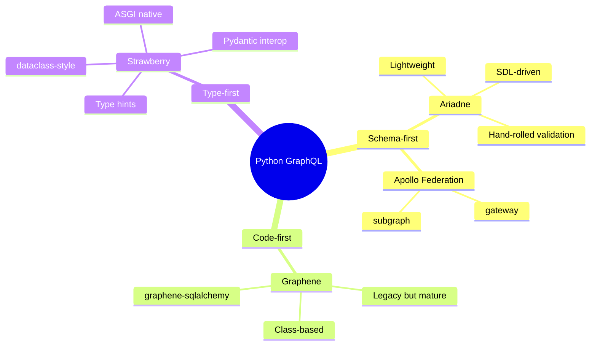
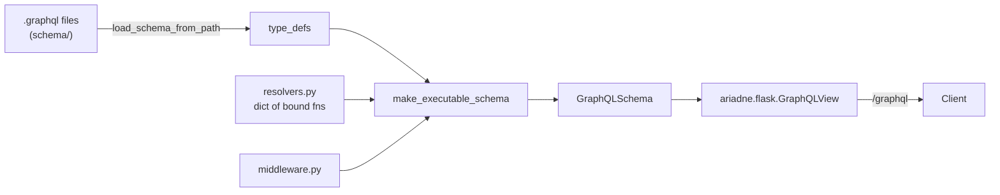
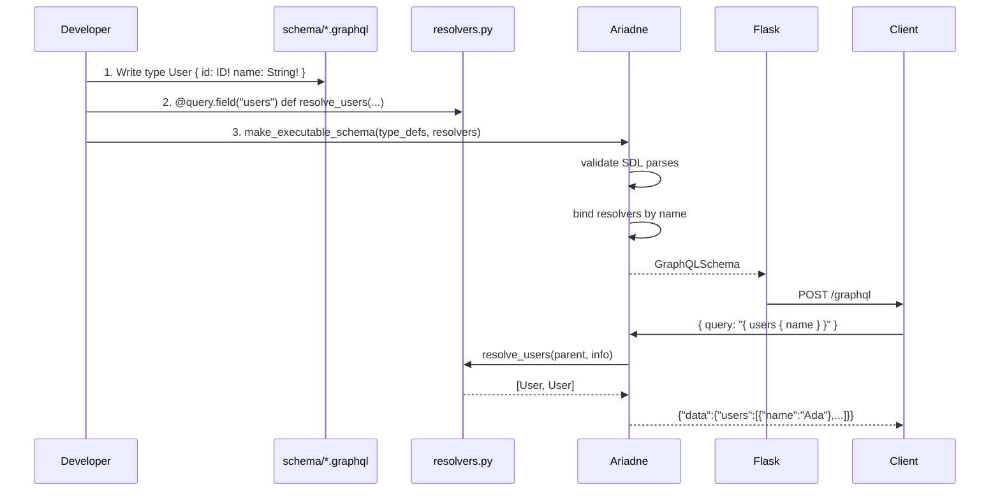
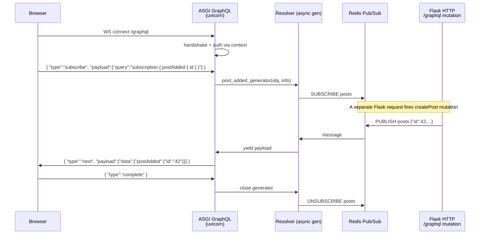
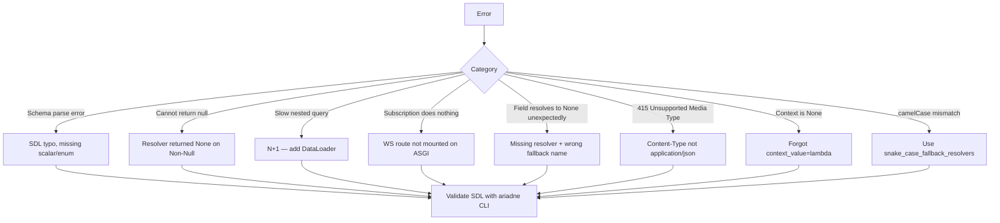

# Ariadne-Flask

#flask #graphql #ariadne #schema-first #api #subscription #playground #modern

> [!info] Schema-first GraphQL for Flask
> `Ariadne` is a schema-first GraphQL library for Python: you write your schema in the official GraphQL Schema Definition Language (SDL), then attach Python resolvers to it. The `ariadne.flask` adapter exposes a `GraphQLView` that mounts that schema in a Flask app. Compared to [[Flask-GraphQL]]/Graphene's class-based `ObjectType` approach, schema-first is closer to the rest of the GraphQL ecosystem (Apollo, urql, Hasura, codegen tooling), requires fewer Python imports to read, and is easier to lint with IDE plug-ins.
>
> For new projects starting in 2024+, the community recommendation is **Ariadne (or Strawberry)** over Graphene. Ariadne is the lighter-weight choice when you want to bring your own validation (Marshmallow, Pydantic) and keep the schema readable as plain text.

Think of Ariadne as the **architect vs. bricklayer** inversion. With Graphene you build the schema by laying Python bricks (`class User(graphene.ObjectType): name = graphene.String()`), and the SDL is *generated* from the bricks. With Ariadne you start from the **blueprint** — a `.graphql` file written in SDL — and the library hires Python workers (resolvers) to fill in each labelled slot on the blueprint. The blueprint is the source of truth. New team members can read it without knowing Python. Code generators on the client side consume it directly. Diff in code review shows readable SDL, not class definitions.

---

## 1. Overview & Metaphor

### What does "schema-first" actually mean?

Three properties define schema-first:

1. **The SDL is hand-written**, not generated. You write `type User { id: ID! name: String! }` in a `.graphql` file.
2. **Resolvers are bound by name**, not by class. You decorate a Python function with `@query.field("users")` or pass a dict `{"Query.users": fn}`.
3. **Validation is symmetric**. `ariadne.load_schema_from_path("schema/")` validates that your SDL parses and that all referenced types exist, before any resolver is attached.

| Approach | Schema source | Resolver binding | Best for |
|---|---|---|---|
| **Schema-first (Ariadne)** | Hand-written SDL | By name | Teams with frontend devs, codegen, federation |
| **Code-first (Graphene)** | Python classes | By class method | Python-heavy teams, dynamic schemas |
| **Type-first (Strawberry)** | Python type hints | Decorator | Type-checked Python, modern async |

### GraphQL ecosystem positioning



### Architecture



The SDL lives in files; resolvers live in Python modules. The schema is the only point where they meet. This is what makes Ariadne code-review friendly: schema changes are visible as text diffs.

---

## 2. Installation

```bash
# Core: ariadne + Flask adapter
pip install ariadne

# Optional extras
pip install "ariadne[asgi-file-uploads]"   # graphql-file-upload support
pip install "Flask-CORS"                    # browser clients
pip install "uvicorn"                       # ASGI for subscriptions
pip install "graphql-server-flask"          # maintained Flask GraphQL view (alt)
```

Ariadne ≥0.16 ships its own `ariadne.flask.GraphQLView`. For older versions or richer features, `graphql-server-flask` works with any `GraphQLSchema` object — including one produced by Ariadne.

### Full dev install

```bash
pip install flask ariadne flask-cors flask-sqlalchemy
```

### Application factory install

```python
# extensions/graphql.py
from ariadne import make_executable_schema
from ariadne.flask import GraphQLView

schema = None   # built in init_app

def init_graphql(app, type_defs, resolvers):
    global schema
    schema = make_executable_schema(type_defs, *resolvers)
    app.add_url_rule(
        "/graphql",
        view_func=GraphQLView.as_view(
            "graphql",
            schema=schema,
            context_value=lambda: {"request": None, "user": None},
        ),
    )
```

---

## 3. Configuration

### `GraphQLView` constructor arguments (Ariadne ≥0.18 / `graphql-server-flask`)

| Argument | Type | Default | Purpose |
|---|---|---|---|
| `schema` | `GraphQLSchema` | — (required) | The executable schema from `make_executable_schema` |
| `context_value` | dict / callable | `{request: flask.request}` | Per-request context passed to resolvers |
| `root_value` | any / callable | `None` | Root value, or callable `(context) -> value` |
| `validation_rules` | list / callable | `[]` | Extra validation rules (depth, cost) |
| `error_formatter` | callable | `format_error` | Custom error envelope |
| `debug` | bool | `False` | Include stacktraces in errors (dev only) |
| `introspection` | bool | `True` | Allow `__schema` queries |
| `http_handler` | HTTP handler | `FlaskGraphQLHTTPHandler` | Hook for custom HTTP behaviour |
| `middleware` | list | `[]` | Resolver middleware |
| `execute_query` | callable | `execute` | Custom executor (e.g. async) |

### App-level config (your own convention)

```python
app.config.update(
    GRAPHQL_PATH="/graphql",
    GRAPHQL_INTROSPECTION=not app.config["TESTING"],
    GRAPHQL_DEBUG=app.config["DEBUG"],
    GRAPHQL_MAX_DEPTH=10,
    GRAPHQL_MAX_COST=1000,
)
```

### Application factory wiring

```python
from flask import Flask, request
from ariadne import load_schema_from_path, make_executable_schema
from ariadne.flask import GraphQLView
from .resolvers import resolvers
from .middleware import auth_middleware, cost_middleware

def create_app():
    app = Flask(__name__)
    type_defs = load_schema_from_path("schema/")
    schema = make_executable_schema(type_defs, *resolvers)

    app.add_url_rule(
        app.config["GRAPHQL_PATH"],
        view_func=GraphQLView.as_view(
            "graphql",
            schema=schema,
            context_value=lambda: {
                "request": request,
                "user": getattr(request, "user", None),
                "db": app.extensions["sqlalchemy"].session,
                "loaders": build_loaders(),
            },
            middleware=[auth_middleware],
            introspection=app.config["GRAPHQL_INTROSPECTION"],
            debug=app.config["GRAPHQL_DEBUG"],
        ),
    )
    return app
```

---

## 4. Schema-First Flow



### Why SDL is the source of truth

A schema-first workflow buys you three concrete wins:

1. **No Python needed to read the API** — front-end devs, QA, and tech writers can all read `.graphql` files.
2. **Client codegen works without a server round-trip** — `graphql-codegen` reads the same `.graphql` files you commit and emits TypeScript types.
3. **Diff-friendly reviews** — adding a field touches one line in SDL, plus its resolver. With class-based Graphene it touches a class definition and a method, plus the import graph.

---

## 5. Basic Usage

### `make_executable_schema` — the one entry point

```python
# schema.py
from ariadne import make_executable_schema

type_defs = """
    type Query {
        hello(name: String = "world"): String!
    }
"""

schema = make_executable_schema(type_defs)
```

```python
# app.py
from flask import Flask
from ariadne.flask import GraphQLView
from schema import schema

app = Flask(__name__)
app.add_url_rule("/graphql", view_func=GraphQLView.as_view("graphql", schema=schema))

if __name__ == "__main__":
    app.run(debug=True)
```

```bash
curl -X POST http://localhost:5000/graphql \
  -H 'Content-Type: application/json' \
  -d '{"query":"{ hello(name:\"Ada\") }"}'
# => {"data":{"hello":"Hello, Ada!"}}
```

### QueryType — the `Query` resolvers

```python
# schema/user.graphql
type User {
    id: ID!
    username: String!
    email: String!
    joinedAt: String!
}

type Query {
    user(id: ID!): User
    users(limit: Int = 10): [User!]!
}
```

```python
# resolvers.py
from ariadne import QueryType, ObjectType
from models import User as UserModel

query = QueryType()
user_obj = ObjectType("User")

@query.field("user")
def resolve_user(_, info, id):
    return UserModel.query.get(id)

@query.field("users")
def resolve_users(_, info, limit):
    return UserModel.query.limit(limit).all()

@user_obj.field("joinedAt")
def resolve_joined_at(user, info):
    return user.created_at.isoformat()
```

```python
# wiring
from ariadne import load_schema_from_path, make_executable_schema
type_defs = load_schema_from_path("schema/")
schema = make_executable_schema(type_defs, query, user_obj)
```

### MutationType — `Mutation` resolvers

```python
# schema/mutation.graphql
input CreateUserInput {
    username: String!
    email: String!
    password: String!
}

type CreateUserPayload {
    user: User
    ok: Boolean!
    error: String
}

type Mutation {
    createUser(input: CreateUserInput!): CreateUserPayload!
}
```

```python
from ariadne import MutationType
from werkzeug.security import generate_password_hash

mutation = MutationType()

@mutation.field("createUser")
def resolve_create_user(_, info, input):
    db = info.context["db"]
    if db.session.query(UserModel).filter_by(username=input["username"]).first():
        return {"user": None, "ok": False, "error": "username taken"}
    user = UserModel(
        username=input["username"],
        email=input["email"],
        password_hash=generate_password_hash(input["password"]),
    )
    db.session.add(user); db.session.commit()
    return {"user": user, "ok": True, "error": None}

schema = make_executable_schema(type_defs, query, mutation, user_obj)
```

### SubscriptionType — `Subscription` resolvers

Subscriptions need an async transport. Flask's WSGI view can't drive WebSockets, so the typical recipe is:

1. Define `type Subscription { postAdded: Post! }` in SDL.
2. Write `@subscription.field("postAdded")` as an `async` generator.
3. Run an ASGI worker (Starlette / `ariadne.asgi.GraphQL`) for the WS transport.
4. Use the same `make_executable_schema` for both Flask and ASGI.

```python
# schema/sub.graphql
type Subscription {
    postAdded(authorId: ID): Post!
}
```

```python
# resolvers.py
from ariadne import SubscriptionType
import asyncio

subscription = SubscriptionType()

@subscription.field("postAdded")
async def post_added_generator(obj, info, authorId=None):
    redis = info.context["redis"]
    async for msg in redis.subscribe("posts"):
        payload = json.loads(msg)
        if authorId and payload["authorId"] != authorId:
            continue
        yield payload

schema = make_executable_schema(type_defs, query, mutation, subscription, user_obj)
```

```python
# asgi.py — separate ASGI entrypoint for subscriptions
from ariadne.asgi import GraphQL
from schema import schema

app = GraphQL(schema, context_value=get_context)
# run with: uvicorn asgi:app --port 8001
```

### Fallback resolvers

```python
from ariadne import fallback_resolvers, snake_case_fallback_resolvers

# If a field has no explicit resolver, Ariadne can fall back to:
#   - default_resolver (attribute or dict key lookup, camelCase)
#   - snake_case_fallback_resolvers (camelCase → snake_case lookup)
#   - fallback_resolvers (alias for the above)
schema = make_executable_schema(
    type_defs, query, mutation, snake_case_fallback_resolvers
)
```

With `snake_case_fallback_resolvers`, a field `joinedAt` on `User` resolves to `user.joined_at` automatically — no boilerplate resolver needed.

---

## 6. Intermediate Patterns

### Multi-file schema loading

```python
from ariadne import load_schema_from_path, make_executable_schema

type_defs = load_schema_from_path("schema/")
# schema/
#   base.graphql       # scalar Date @deprecated ...
#   user.graphql
#   post.graphql
#   comment.graphql
schema = make_executable_schema(type_defs, *all_resolvers)
```

### Custom scalars

```python
# schema/scalars.graphql
scalar DateTime
scalar JSON
```

```python
from ariadne import ScalarType
from datetime import datetime

datetime_scalar = ScalarType("DateTime")

@datetime_scalar.serializer
def serialize_datetime(value: datetime) -> str:
    return value.isoformat()

@datetime_scalar.value_parser
def parse_datetime_value(value: str) -> datetime:
    return datetime.fromisoformat(value)

@datetime_scalar.literal_parser
def parse_datetime_literal(ast):
    return datetime.fromisoformat(ast.value)
```

### Enums

```python
# schema/enums.graphql
enum Role { ADMIN EDITOR VIEWER }
```

```python
from ariadne import EnumType
from models import Role

role_enum = EnumType("Role", Role)   # binds GraphQL enum to Python enum
```

### Interfaces & unions

```python
# schema/search.graphql
interface Node { id: ID! }
type Article implements Node { id: ID! title: String! }
type Video    implements Node { id: ID! duration: Int! }
union SearchResult = Article | Video
```

```python
from ariadne import InterfaceType, UnionType

node = InterfaceType("Node")

@node.field("id")
def resolve_id(obj, info):
    return f"{obj.__class__.__name__}:{obj.id}"

search_result = UnionType("SearchResult")

@search_result.type_resolver
def resolve_search_type(obj, info):
    return obj.__class__.__name__   # "Article" or "Video"
```

### Input validation with [[Marshmallow]] or Pydantic

Ariadne doesn't ship validation; pair it with your favourite library:

```python
from marshmallow import Schema, fields, ValidationError
from ariadne import GraphQLError

class CreateUserSchema(Schema):
    username = fields.Str(required=True, validate=lambda s: len(s) >= 3)
    email    = fields.Email(required=True)

@mutation.field("createUser")
def resolve_create_user(_, info, input):
    try:
        data = CreateUserSchema().load(input)
    except ValidationError as e:
        raise GraphQLError(f"Validation failed: {e.messages}")
    ...
```

### DataLoader to kill N+1

```python
from ariadne.loaders import Loader  # community helper or roll your own
from promise.dataloader import DataLoader
from promise import Promise

def posts_loader(db):
    def fetch(author_ids):
        rows = db.query(Post).filter(Post.author_id.in_(list(author_ids))).all()
        m = {}
        for r in rows: m.setdefault(r.author_id, []).append(r)
        return Promise.resolve([m.get(aid, []) for aid in author_ids])
    return DataLoader(fetch)

@user_obj.field("posts")
def resolve_user_posts(user, info):
    return info.context["loaders"]["posts"].load(user.id)
```

---

## 7. Advanced Usage

### Subscription lifecycle (full picture)



The Flask HTTP view and the ASGI subscription view share the **same `make_executable_schema` output** — that is the whole point of schema-first. The schema is one object; transports are pluggable.

### Middleware

```python
def auth_middleware(next_, root, info, **args):
    if info.operation.operation == "mutation" and not info.context.get("user"):
        raise GraphQLError("Authentication required for mutations")
    return next_(root, info, **args)

def logging_middleware(next_, root, info, **args):
    start = time.time()
    try:
        result = next_(root, info, **args)
        return result
    finally:
        app.logger.info("resolver %s took %.2fms", info.path, (time.time()-start)*1000)

GraphQLView.as_view("graphql", schema=schema, middleware=[auth_middleware, logging_middleware])
```

### Custom error formatting

```python
from ariadne import format_error
from graphql import GraphQLError

def custom_error_formatter(error, debug=False):
    formatted = format_error(error, debug)
    if isinstance(error.original_error, ValidationError):
        formatted["extensions"] = {"code": "VALIDATION", "fields": error.original_error.messages}
    elif isinstance(error.original_error, PermissionError):
        formatted["extensions"] = {"code": "FORBIDDEN"}
    return formatted

GraphQLView.as_view("graphql", schema=schema, error_formatter=custom_error_formatter)
```

### Federation subgraph

```python
from ariadne.contrib.federation import make_federated_schema, FederatedObjectType

federation_type_defs = '''
    extend type Query { me: User }
    type User @key(fields: "id") {
        id: ID! @external
        username: String
    }
'''

user = FederatedObjectType("User")

@user.field("_resolveReference")
def resolve_user_ref(user, info):
    return load_user_by_id(user.id)

schema = make_federated_schema(federation_type_defs, user)
```

### Query cost analysis

```python
from graphql.cost_analysis import cost_analysis_validation_rule

view = GraphQLView.as_view(
    "graphql",
    schema=schema,
    validation_rules=[
        lambda: cost_analysis_validation_rule(maximum_cost=1000, default_cost=1, list_factor=10)
    ],
)
```

### Persisted queries

```python
PQ_CACHE = {}   # in prod use Redis

@app.before_request
def store_pq():
    if request.path == "/graphql":
        q = request.json.get("query")
        ext = request.json.get("extensions", {}).get("persistedQuery")
        if q and ext:
            PQ_CACHE[ext["sha256Hash"]] = q
        elif not q and ext:
            q = PQ_CACHE.get(ext["sha256Hash"])
            if q:
                body = request.get_json()
                body["query"] = q
                request._cached_json = body
```

### Multi-process with shared schema cache

Print the SDL once and serve it from Redis for client codegen:

```python
from graphql import print_schema
sdl = print_schema(schema)
redis.set("graphql:sdl", sdl)
```

### GraphQL Playground & Apollo Sandbox

Ariadne's `GraphQLView` ships with GraphiQL; for the richer Playground/Sandbox:

```python
PLAYGROUND_HTML = """<!DOCTYPE html><html>
  <head><meta charset=utf-8><title>Playground</title>
  <link rel=stylesheet href="https://cdn.jsdelivr.net/npm/graphql-playground-react/build/static/css/index.css"/>
  <script src="https://cdn.jsdelivr.net/npm/graphql-playground-react/build/static/js/middleware.js"></script>
  </head>
  <body><div id=root></div>
  <script>window.GraphQLPlayground.init({endpoint: "/graphql"})</script>
  </body></html>"""

@app.route("/playground")
def playground():
    return PLAYGROUND_HTML
```

---

## 8. Common Pitfalls & Troubleshooting



### Symptom / cause / fix

| Symptom | Likely cause | Fix |
|---|---|---|
| `TypeError: 'NoneType' object is not subscriptable` in resolver | `info.context` returned `None` | Pass `context_value=lambda: {...}` to `GraphQLView` |
| `GraphQLSchema validation error: Cannot find type X` | SDL file missing import or typo | `ariadne` CLI validates SDL; run `ariadne check schema/` |
| Subscription yields nothing | WS transport not mounted; WSGI can't drive async | Run `ariadne.asgi.GraphQL` under `uvicorn` |
| `Field 'joinedAt' resolved to None` | Resolver missing and snake_case fallback not registered | Add `snake_case_fallback_resolvers` to `make_executable_schema` |
| Mutation runs but `error: null` and no DB row | Resolver didn't commit; transaction rolled back | `db.session.commit()` in resolver; check exception swallowed |
| Schema huge, slow startup | `load_schema_from_path` globbing redundant files | Use one entry point file with `# import` directives |
| Introspection returns nothing in prod | `introspection=False` set | Toggle in dev only; or gate by auth |
| Random `KeyError: 'loaders'` in nested resolver | `context_value` lambda builds loaders per resolver instead of per request | Build loaders once per request in the lambda |

### The four classic killers

1. **Forgetting fallback resolvers** — every Python attribute that uses snake_case needs `snake_case_fallback_resolvers` or explicit resolvers.
2. **WSGI subscriptions** — they will silently never fire. Move WS to ASGI.
3. **Schema in a string instead of a file** — works in a 50-line demo, but kills code-review readability at 5,000 lines. Always use `load_schema_from_path`.
4. **Sharing one DataLoader across requests** — `DataLoader` instances cache by request. Reusing them leaks data between users. Always build fresh per request inside `context_value`.

---

## 9. Best Practices

- **Keep SDL in `.graphql` files** under `schema/`. Commit them; lint them with `prettier` or `graphql-eslint`.
- **Use `snake_case_fallback_resolvers`** for the 90% of fields that map 1:1 to a Python attribute.
- **Build DataLoader per request** inside `context_value`, never at module scope.
- **Set `introspection=False` and `debug=False` in production** — error stacktraces leak source code paths.
- **Custom error formatter** that returns an `extensions.code` field — clients branch on stable codes (`VALIDATION`, `FORBIDDEN`, `NOT_FOUND`) instead of parsing strings.
- **Persisted queries** in production — disable ad-hoc queries to harden against injection and reduce bandwidth.
- **Validate with `ariadne` CLI in CI** — `ariadne check schema/` catches orphan types and missing resolvers before deploy.
- **Federation over stitching** — if you need multiple services, prefer Apollo Federation subgraphs (`ariadne.contrib.federation`).
- **Use [[Marshmallow]] or Pydantic** for input validation — `Arguments` typing is structural, not semantic.
- **Run subscriptions on a separate ASGI process** — keep Flask on WSGI for HTTP mutations and queries; offload WS to `uvicorn` + `ariadne.asgi.GraphQL`.

---

## 10. Integration with Other Extensions

### [[Flask-SQLAlchemy]]

```python
@query.field("users")
def resolve_users(_, info):
    db = info.context["db"]
    return db.session.query(UserModel).limit(50).all()
```

For auto-generation, use the third-party `ariadne-sqlalchemy` or hand-write the SDL for control.

### [[Flask-JWT-Extended]]

```python
from flask_jwt_extended import verify_jwt_in_request, get_jwt_identity

def context_value():
    verify_jwt_in_request(optional=True)
    return {"user": load_user(get_jwt_identity())}

GraphQLView.as_view("graphql", schema=schema, context_value=context_value)
```

### [[Flask-CORS]]

```python
from flask_cors import CORS
CORS(app, resources={r"/graphql": {"origins": app.config["CORS_ORIGINS"]}})
```

### [[Flask-Limiter]]

```python
from flask_limiter import Limiter
from flask_limiter.util import get_remote_address

limiter = Limiter(get_remote_address, app=app)
graphql_view_limited = limiter.limit("120/minute")(GraphQLView.as_view("graphql", schema=schema))
app.add_url_rule("/graphql", view_func=graphql_view_limited)
```

### [[Marshmallow]]

See "Input validation" above — Marshmallow is the canonical partner for Ariadne input validation.

### [[Flask-GraphQL]] / Graphene

You can run both side-by-side during migration. The shared `graphql-core` runtime means a single introspection result is consumable by either.

### [[Flask-SocketIO]] / [[Flask-SSE]]

For real-time push to clients that don't need GraphQL subscriptions, use [[Flask-SocketIO]] (bidirectional) or [[Flask-SSE]] (server → client only). A common hybrid: GraphQL mutations write to a Redis topic; SSE consumers stream it to dashboards.

### [[Celery]]

Push subscription events from background jobs:

```python
# tasks.py
@celery.task
def generate_report(user_id):
    ...
    redis.publish("reports", json.dumps({"userId": user_id, "url": url}))

# subscription resolver subscribes to the same channel
```

---

## 11. Real-World Example

A schema-first blog backend with authors, posts, comments, auth, DataLoader, and a `createPost` mutation. SDL lives in `schema/`.

```graphql
# schema/base.graphql
scalar DateTime

# schema/user.graphql
type User {
    id: ID!
    username: String!
    email: String!
    posts: [Post!]!
}

# schema/post.graphql
type Post {
    id: ID!
    title: String!
    body: String!
    author: User!
    comments: [Comment!]!
    createdAt: DateTime!
}

type Comment {
    id: ID!
    body: String!
}

input CreatePostInput {
    title: String!
    body: String!
}

type CreatePostPayload {
    post: Post
    error: String
}

type Query {
    user(id: ID!): User
    posts(limit: Int = 10): [Post!]!
}

type Mutation {
    createPost(input: CreatePostInput!): CreatePostPayload!
}

type Subscription {
    postAdded(authorId: ID): Post!
}
```

```python
# resolvers.py
from ariadne import QueryType, MutationType, SubscriptionType, ObjectType, snake_case_fallback_resolvers
from promise.dataloader import DataLoader
from promise import Promise
import json

query = QueryType()
mutation = MutationType()
subscription = SubscriptionType()
post_obj = ObjectType("Post")

@query.field("user")
def resolve_user(_, info, id):
    return info.context["db"].query(UserModel).get(id)

@query.field("posts")
def resolve_posts(_, info, limit):
    return info.context["db"].query(PostModel).limit(limit).all()

@post_obj.field("author")
def resolve_post_author(post, info):
    return info.context["loaders"]["author_by_id"].load(post.author_id)

@post_obj.field("comments")
def resolve_post_comments(post, info):
    return info.context["loaders"]["comments_by_post"].load(post.id)

@mutation.field("createPost")
def resolve_create_post(_, info, input):
    user = info.context.get("user")
    if not user:
        return {"post": None, "error": "Authentication required"}
    db = info.context["db"]
    post = PostModel(title=input["title"], body=input["body"], author_id=user.id)
    db.session.add(post); db.session.commit()
    info.context["redis"].publish("posts", json.dumps({"id": post.id, "authorId": user.id}))
    return {"post": post, "error": None}

@subscription.field("postAdded")
async def post_added_generator(obj, info, authorId=None):
    redis = info.context["redis"]
    async for msg in redis.subscribe("posts"):
        payload = json.loads(msg)
        if authorId and payload["authorId"] != authorId:
            continue
        yield payload

def build_loaders(db):
    def author_loader(ids):
        rows = db.query(UserModel).filter(UserModel.id.in_(list(ids))).all()
        m = {r.id: r for r in rows}
        return Promise.resolve([m.get(i) for i in ids])

    def comments_loader(post_ids):
        rows = db.query(CommentModel).filter(CommentModel.post_id.in_(list(post_ids))).all()
        m = {}
        for r in rows: m.setdefault(r.post_id, []).append(r)
        return Promise.resolve([m.get(pid, []) for pid in post_ids])

    return {"author_by_id": DataLoader(author_loader),
            "comments_by_post": DataLoader(comments_loader)}
```

```python
# app.py
from flask import Flask, request
from ariadne import load_schema_from_path, make_executable_schema
from ariadne.flask import GraphQLView
from resolvers import query, mutation, subscription, post_obj, build_loaders, snake_case_fallback_resolvers
from models import db, UserModel, PostModel, CommentModel
import redis

def create_app():
    app = Flask(__name__)
    app.config["SQLALCHEMY_DATABASE_URI"] = "sqlite:///blog.db"
    db.init_app(app)

    type_defs = load_schema_from_path("schema/")
    schema = make_executable_schema(
        type_defs, [query, mutation, subscription, post_obj, snake_case_fallback_resolvers]
    )
    r = redis.from_url("redis://localhost")

    app.add_url_rule(
        "/graphql",
        view_func=GraphQLView.as_view(
            "graphql",
            schema=schema,
            context_value=lambda: {
                "request": request,
                "user": getattr(request, "user", None),
                "db": db.session,
                "redis": r,
                "loaders": build_loaders(db.session),
            },
            introspection=app.config["DEBUG"],
            debug=app.config["DEBUG"],
        ),
    )
    return app
```

### Try it

```graphql
mutation {
  createPost(input: {title: "Hello", body: "World"}) {
    post { id title author { username } }
    error
  }
}

query {
  posts(limit: 5) {
    title
    comments { body }
  }
}
```

### Production deployment

```bash
# HTTP mutations/queries on Flask/WSGI
gunicorn -w 4 -k gevent "app:create_app()"

# Subscriptions on ASGI (separate process)
uvicorn asgi_app:app --port 8001
```

Both processes share the same `make_executable_schema(schema, ...)` result and the same Redis Pub/Sub channel — they are two transports over one schema.

---

## 12. References

### Official

- **Ariadne docs** — https://ariadnegraphql.org/docs/
- **Ariadne Flask adapter** — https://ariadnegraphql.org/docs/flask
- **Ariadne ASGI adapter** — https://ariadnegraphql.org/docs/asgi
- **Ariadne GitHub** — https://github.com/mirumee/ariadne

### GraphQL fundamentals

- SDL spec — https://spec.graphql.org/draft/#sec-Type-System
- GraphQL subscriptions over WebSocket — https://github.com/enisdenjo/graphql-ws/blob/master/PROTOCOL.md
- Apollo Federation spec — https://www.apollographql.com/docs/federation/federation-spec/

### Schema-first elsewhere

- Apollo Server (Node) — https://www.apollographql.com/docs/apollo-server/
- gqlgen (Go) — https://gqlgen.com/
- Hot Chocolate (.NET) — https://chillicream.com/docs/hotchocolate

### Tutorials & deep dives

- "Ariadne vs. Graphene vs. Strawberry" — https://www.apollographql.com/blog/graphql/python/complete-guide-to-python-graphql-libraries/
- Mirumee blog (Ariadne maintainer) — https://mirumee.com/blog

### Cross-vault wikilinks

- [[Flask-GraphQL]] — the legacy Graphene-based alternative; same `graphql-core` underneath
- [[Flask-SocketIO]] — alternative real-time transport for bidirectional push
- [[Flask-SSE]] — alternative for one-way push (lighter than WS for dashboards)
- [[Flask-SQLAlchemy]] — ORM models bound to resolvers
- [[Marshmallow]] — input validation
- [[Flask-JWT-Extended]] — auth in `context_value`
- [[Flask-CORS]] — same-origin policy
- [[Flask-Limiter]] — rate-limit per IP or per user
- [[Flask-Caching]] — cache SDL and persisted queries
- [[Project-Structure]] — `schema/` directory layout
- [[Security-Best-Practices]] — disable introspection, depth-limit, persisted queries
- [[Performance-Optimization]] — DataLoader, cost analysis, async executor

---

> [!quote] Final metaphor
> Ariadne-Flask turns the GraphQL schema into the **single source of truth** your whole team can read — front-end, back-end, QA, docs. Where [[Flask-GraphQL]] + Graphene lets Python classes generate the schema as a side effect, Ariadne starts from the blueprint and lets Python be the worker that fills in the slots. For new Flask projects in 2024, this is the recommended path: schema-first, codegen-friendly, and on the same side of the architecture as Apollo Server, gqlgen, and Hasura. Pair it with DataLoader for fast reads, with [[Flask-SSE]] or [[Flask-SocketIO]] for push, and with [[Marshmallow]] for input validation — and your Flask app speaks modern GraphQL without abandoning the Pallets ecosystem.
