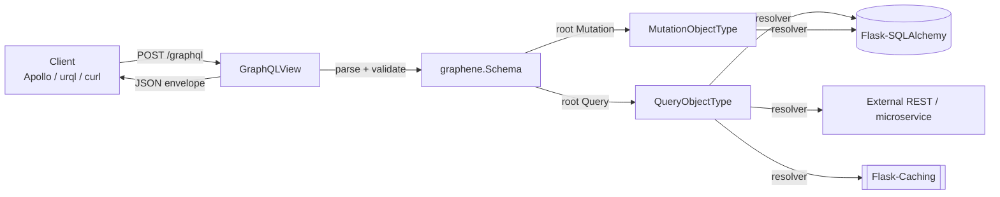
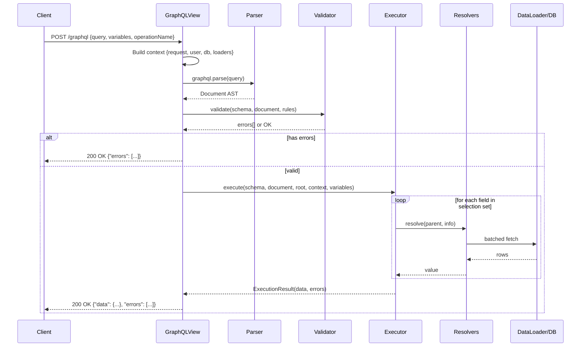
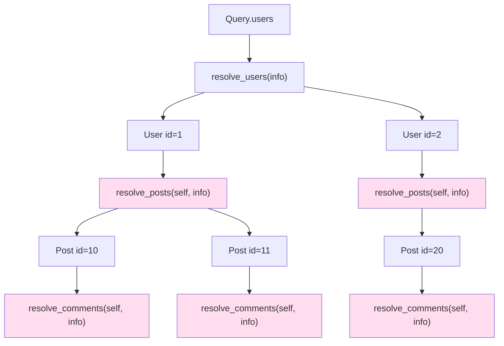
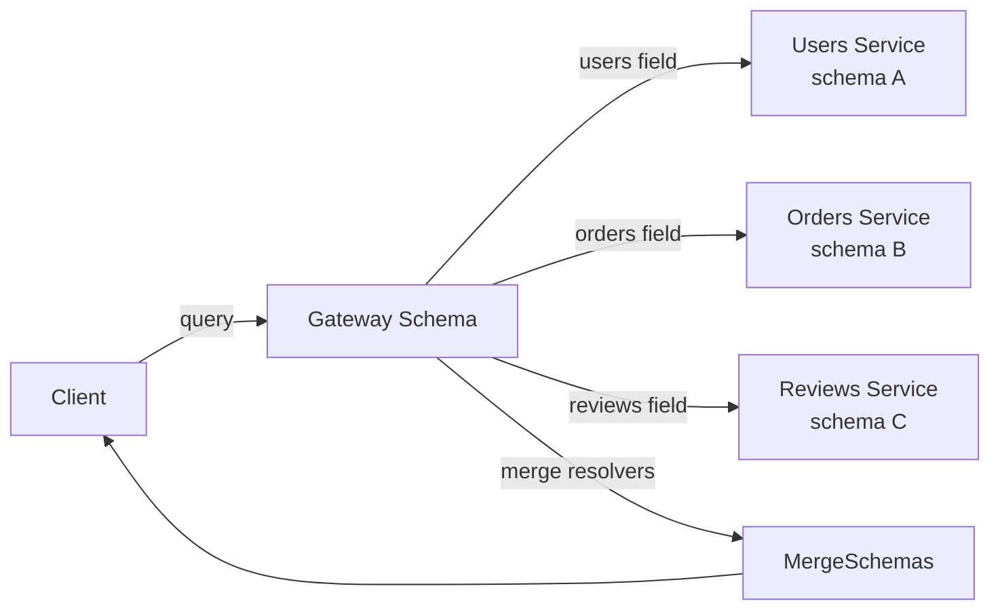
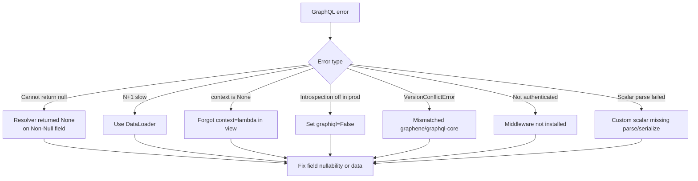

# Flask-GraphQL

#flask #graphql #graphene #api #schema #resolvers #graphqlview

> [!info] GraphQL integration for Flask via Graphene
> `Flask-GraphQL` is the original Flask binding for the GraphQL reference implementation in Python. It glues the **`graphene`** schema library to Flask by exposing a `GraphQLView` class — a pluggable view that parses incoming GraphQL queries, executes them against your `Schema`, and returns a JSON response. Combined with Graphene's declarative `ObjectType` / `Mutation` / `Query` classes, it lets you build a single endpoint that serves exactly the data each client asks for — no over-fetching, no under-fetching, no versioned REST URLs.
>
> > [!warning] Status: maintenance only
> > Graphene 3 is still widely deployed, but the broader Python community has moved to **schema-first** libraries (Ariadne, Strawberry) and to ASGI-native GraphQL servers. For new projects, prefer [[Ariadne-Flask]] or Strawberry. Use `Flask-GraphQL` + Graphene for existing codebases, brownfield migrations, or teams already fluent in Graphene's class-based API.

Think of `Flask-GraphQL` as the **customs desk** at a single border crossing called `/graphql`. Every client — a web app, a mobile app, a partner integration — lines up at the same desk. Each one hands the customs officer (the `GraphQLView`) a request that says "I want the user's name, their last 5 orders, and the shipping address for each." The officer checks the request against the rulebook (your `Schema`), dispatches sub-agents (the resolvers) to fetch each field, assembles the answer, and returns a single JSON envelope shaped exactly like the request. REST, by contrast, forces each client to file separate paperwork at separate desks (`/users/1`, `/users/1/orders`, `/orders/123/address`…), and each desk hands back whatever the backend decided to put on the form.

---

## 1. Overview & Metaphor

### What is GraphQL? Why a single endpoint?

GraphQL was released by Facebook in 2015 as an alternative to REST for APIs that suffer from two chronic diseases:

1. **Over-fetching** — `GET /users/1` returns 47 fields, but the mobile screen only shows the avatar and name. You pay for 47 fields' worth of bandwidth and DB time.
2. **Under-fetching** — to render a profile screen you need the user, their posts, and their followers. REST forces three round trips;GraphQL lets the client ask for all three in one request.

A GraphQL server exposes one endpoint (typically `/graphql`) that accepts a query document describing the exact shape of the desired response. The server resolves each field in the document and returns a JSON object that mirrors the query.

### GraphQL vs REST — a quick decision matrix

| Dimension | REST ([[Flask-RESTful]]) | GraphQL (`Flask-GraphQL`) |
|---|---|---|
| Endpoints | Many (`/users`, `/orders`, `/orders/1/items`) | One (`/graphql`) |
| Payload shape | Server-defined per endpoint | Client-defined per query |
| Versioning | URL versions (`/v2/users`) | Schema evolution (deprecate fields) |
| Over/under-fetch | Common | Eliminated by design |
| Caching | HTTP-level (GET, ETag, CDN) | App-level (PersistedQuery, CDN by `?query=`) |
| File uploads | `multipart/form-data` per endpoint | `graphql-upload` multipart spec |
| Learning curve | Low | Medium-High (schema language, N+1 awareness) |
| Tooling | Generic | GraphiQL/Playground, codegen, type-safe clients |
| Best fit | Public APIs, caching-first, simple domains | Mobile apps, rich dashboards, federated data |

> [!tip] GraphQL is not a REST replacement
> GraphQL and REST are *different tools*. REST shines for cacheable, resource-oriented public APIs; GraphQL shines for complex client views that need data from many sources stitched together. Many shops run both: REST for partners, GraphQL for the first-party SPA.

### Architecture



The `GraphQLView` is the only Flask object in this picture. Everything to the right of it is plain Python — schema definitions, resolvers, data loaders — that you could reuse in an asyncio server, a CLI tool, or a Celery task.

---

## 2. Installation

```bash
# Core: Flask extension + Graphene 3 + graphql-core
pip install Flask-GraphQL graphene==3

# Optional but recommended
pip install graphql-core           # the underlying execution engine
pip install "graphene-sqlalchemy"  # auto-generate types from SQLAlchemy models
pip install "Flask-CORS"           # CORS for browser clients
pip install "graphql-server-core"  # helpers shared with Ariadne/Strawberry
```

> [!warning] Version mismatch is the #1 install headache
> `Flask-GraphQL` was last released in 2019 and pins `graphql-core>=2.1.0,<3`. If you install modern `graphene==3.x` you get `graphql-core>=3`. To make them cooperate you either:
>
> - Install from the GitHub `master` of `flask-graphql` (which drops the version pin), **or**
> - Skip `Flask-GraphQL` entirely and mount `GraphQLView` from `graphql-server-flask` (the maintained successor). This is the path the maintainer now recommends.
>
> ```bash
> # Modern, maintained path:
> pip install graphene graphql-server-flask
> ```

### Application factory install

```python
# extensions.py
from graphene import Schema
from graphql_server.flask import GraphQLView   # maintained successor

graphql_view = GraphQLView.as_view(schema=None)   # schema wired in init_app
```

```python
# app.py
from flask import Flask
from extensions import graphql_view
from schema import schema

def create_app():
    app = Flask(__name__)
    app.add_url_rule(
        "/graphql",
        view_func=GraphQLView.as_view("graphql", schema=schema, graphiql=True),
    )
    return app
```

---

## 3. Configuration

`GraphQLView` accepts keyword arguments that map almost 1:1 to GraphQL server options.

### `GraphQLView` constructor arguments

| Argument | Type | Default | Purpose |
|---|---|---|---|
| `schema` | `graphene.Schema` | — (required) | The executable GraphQL schema |
| `context` | dict / callable | `{request: flask.request}` | Per-request context passed to every resolver |
| `root_value` | any | `None` | Root value passed to the top-level resolvers |
| `pretty` | bool | `False` | Pretty-print JSON responses (dev only) |
| `graphiql` | bool | `False` | Serve the GraphiQL IDE on GET requests |
| `graphiql_template` | str | built-in | Custom HTML template for the IDE |
| `executor` | `graphql.Executor` | `None` | Custom executor (e.g. `AsyncioExecutor`) |
| `middleware` | list | `[]` | Middleware applied to every resolver |
| `max_age` | int | `86400` | `Cache-Control` max-age for the schema introspection GET |
| `enable_async` | bool | `False` | Allow `async def` resolvers (requires async-friendly server) |
| `batch` | bool | `False` | Enable Apollo-style query batching |

### App config keys (your own convention)

```python
app.config.update(
    GRAPHQL_ENDPOINT="/graphql",
    GRAPHQL_ENABLE_INTROSPECTION=not app.config["TESTING"],
    GRAPHQL_MAX_QUERY_DEPTH=10,
    GRAPHQL_MAX_ALIASES=15,
    GRAPHQL_GRAPHIQL=True,
)
```

### Application factory wiring

```python
# extensions/graphql.py
from flask import Flask, request
from graphql_server.flask import GraphQLView

def register_graphql(app: Flask, schema, *, path="/graphql"):
    app.add_url_rule(
        path,
        view_func=GraphQLView.as_view(
            "graphql",
            schema=schema,
            graphiql=app.config["GRAPHQL_GRAPHIQL"],
            context=lambda: {
                "request": request,
                "user": getattr(request, "user", None),
                "db": app.extensions["sqlalchemy"].session,
            },
        ),
    )
```

---

## 4. GraphQL Request Lifecycle

Understanding the lifecycle matters: most beginner bugs (N+1 queries, missing context, swallowed errors) hide in a stage you didn't realize existed.



> [!note] HTTP 200 even on errors
> A GraphQL server returns `200 OK` for *transport-level* success and reports application/query errors inside the JSON `errors` array. Only transport failures (auth, parse, payload too large) return non-200 status codes. This trips up REST-trained developers and monitoring tools — make sure your dashboards parse `errors[]`, not the HTTP status.

---

## 5. Basic Usage

### Schema, ObjectType, Query

A minimal schema exposing one query, `hello`:

```python
# schema.py
import graphene

class Query(graphene.ObjectType):
    hello = graphene.String(name=graphene.String(default_value="world"))

    def resolve_hello(self, info, name):
        return f"Hello, {name}!"

schema = graphene.Schema(query=Query)
```

```bash
curl -X POST http://localhost:5000/graphql \
  -H 'Content-Type: application/json' \
  -d '{"query":"{ hello(name: \"Ada\") }"}'
# => {"data":{"hello":"Hello, Ada!"}}
```

### ObjectType with fields and resolvers

```python
import graphene
from datetime import datetime

class User(graphene.ObjectType):
    id = graphene.ID()
    username = graphene.String()
    email = graphene.String()
    is_admin = graphene.Boolean()
    joined_at = graphene.DateTime()
    display_name = graphene.String()

    def resolve_display_name(self, info):
        # `self` is whatever the parent resolver returned — a dict, a
        # SQLAlchemy model, a dataclass... it's duck-typed.
        return f"@{self['username']}"

class Query(graphene.ObjectType):
    me = graphene.Field(User)
    user = graphene.Field(User, id=graphene.ID(required=True))

    def resolve_me(self, info):
        user = info.context["user"]
        if not user:
            return None
        return user                       # must be shaped like a User

    def resolve_user(self, info, id):
        return info.context["db"].execute(
            "SELECT id, username, email FROM users WHERE id=%s", (id,)
        ).fetchone()

schema = graphene.Schema(query=Query)
```

### Mutations

```python
class CreateUser(graphene.Mutation):
    class Arguments:
        username = graphene.String(required=True)
        email = graphene.String(required=True)
        password = graphene.String(required=True)

    user = graphene.Field(User)
    ok = graphene.Boolean()

    def mutate(self, info, username, email, password):
        db = info.context["db"]
        if db.execute("SELECT 1 FROM users WHERE username=%s", (username,)).fetchone():
            raise Exception("username already taken")
        hashed = bcrypt.hashpw(password.encode(), bcrypt.gensalt())
        cur = db.execute(
            "INSERT INTO users (username, email, password) VALUES (%s,%s,%s) RETURNING id, username, email",
            (username, email, hashed),
        )
        row = cur.fetchone()
        db.commit()
        return CreateUser(user=row, ok=True)

class Mutation(graphene.ObjectType):
    create_user = CreateUser.Field()

schema = graphene.Schema(query=Query, mutation=Mutation)
```

### Mounting in Flask

```python
# app.py
from flask import Flask
from graphql_server.flask import GraphQLView
from schema import schema

app = Flask(__name__)

app.add_url_rule(
    "/graphql",
    view_func=GraphQLView.as_view(
        "graphql",
        schema=schema,
        graphiql=True,                          # IDE at GET /graphql
        context=lambda: {"db": app.db.connection},
    ),
)

if __name__ == "__main__":
    app.run(debug=True)
```

Open `http://localhost:5000/graphql` in a browser → GraphiQL IDE appears.

---

## 6. Intermediate Patterns

### Resolver tree & the `info` object

Every resolver receives `(parent, info, **args)`. `info` is the Swiss-army knife: it carries the context, the schema, the field's AST, and the path for tracing.



Each pink node is a separate DB query unless you batch — the classic **N+1 problem**.

### DataLoader to kill N+1

```python
# extensions/loaders.py
from collections import defaultdict
from promise import Promise
from promise.dataloader import DataLoader

def batch_load_posts(db):
    def loader(post_ids):
        rows = db.execute(
            "SELECT * FROM posts WHERE id = ANY(%s)", (list(post_ids),)
        ).fetchall()
        by_id = {r["id"]: r for r in rows}
        return Promise.resolve([by_id.get(pid) for pid in post_ids])
    return DataLoader(loader)

# in resolver
def resolve_posts(self, info):
    return info.context["loaders"]["posts"].load(self["id"])
```

### Input types & nested mutations

```python
class PostInput(graphene.InputObjectType):
    title = graphene.String(required=True)
    body = graphene.String(required=True)
    tags = graphene.List(graphene.String)

class CreatePost(graphene.Mutation):
    class Arguments:
        input = PostInput(required=True)

    post = graphene.Field(Post)
    def mutate(self, info, input):
        if not info.context["user"]:
            raise Exception("Authentication required")
        # ... insert ...
        return CreatePost(post=post)
```

### Interfaces & unions

```python
class Node(graphene.Interface):
    id = graphene.ID(required=True)

class Article(graphene.ObjectType):
    class Meta:
        interfaces = (Node,)
    title = graphene.String()

class Video(graphene.ObjectType):
    class Meta:
        interfaces = (Node,)
    duration = graphene.Int()

class SearchResult = graphene.Union("SearchResult", (Article, Video))
```

### Authentication middleware

```python
def auth_middleware(next, root, info, **args):
    if info.path[0] in ("login", "createUser") or info.context.get("user"):
        return next(root, info, **args)
    raise Exception("Not authenticated")

GraphQLView.as_view("graphql", schema=schema, middleware=[auth_middleware])
```

### Persisted queries

```python
@app.route("/graphql", methods=["GET"])
def persisted():
    qid = request.args.get("extension")  # client sends ?extension=hash
    if qid:
        query = app.config["PERSISTED_QUERIES"].get(qid)
        if not query:
            return jsonify({"errors":[{"message":"PersistedQueryNotFound"}]}), 200
        # execute...
```

---

## 7. Advanced Usage

### Schema stitching / federation



`graphene` itself does not ship federation primitives; use `graphql-merge-schemas` or Apollo Federation via `apollo-federation` Python package:

```python
from apollo_federation import make_federated_schema

@federation.entity(key="id")
class User(graphene.ObjectType):
    id = graphene.ID(required=True)
    # ...

@federation.resolve_reference(User)
def resolve_user_ref(user, _):
    return load_user_by_id(user.id)
```

### Subscriptions (with [[Flask-SSE]] or [[Flask-SocketIO]])

Graphene subscriptions require a transport the WSGI `GraphQLView` cannot natively provide. The standard recipe:

1. Define `class Subscription(graphene.ObjectType)` with `async` resolvers.
2. Run a separate ASGI worker (Starlette + `graphql-asyncio`) for the WebSocket transport.
3. Use Redis Pub/Sub as the cross-process event bus.

```python
import asyncio
import graphene

class Subscription(graphene.ObjectType):
    post_added = graphene.Field(Post)

    async def subscribe_post_added(root, info):
        async for msg in info.context["redis"].subscribe("posts"):
            yield msg
```

### Async resolvers

```python
class Query(graphene.ObjectType):
    async_users = graphene.List(User)

    async def resolve_async_users(self, info):
        # requires GraphQLView(enable_async=True) and an async executor
        return await info.context["db"].fetch_all("SELECT * FROM users")
```

> [!warning] WSGI + async = pain
> `Flask-GraphQL` running under WSGI (gunicorn sync worker) cannot drive true `async def` resolvers without an executor like `graphql-executor` or `asyncio.run()` per request. If your schema is heavily async, move to ASGI (Starlette + Strawberry) or run [[Ariadne-Flask]] under `uvicorn` with the ASGI view.

### Custom scalars

```python
DateTime = graphene.DateTime()

@DateTime.serializer
def serialize_datetime(value):
    return value.isoformat()

schema = graphene.Schema(query=Query, types=[DateTime])
```

### Schema printing & introspection caching

```python
from graphql import print_schema
sdl = print_schema(schema.graphql_schema)
# cache `sdl` in Redis; serve on GET /graphql for client codegen
```

### Query complexity & depth limiting

```python
from graphql.analysis import max_depth, max_list_depth
from graphql.core_validate import specified_rules

view = GraphQLView.as_view(
    "graphql",
    schema=schema,
    validation_rules=[*specified_rules, MaxDepthRule(10), CostAnalysisRule(max_cost=1000)],
)
```

### Persisted query cache

```python
import hashlib, json
def pq_id(query): return hashlib.sha256(query.encode()).hexdigest()

@app.before_request
def persist():
    if request.path == "/graphql":
        q = request.json.get("query")
        if q and not request.json.get("extensions", {}).get("persistedQuery"):
            app.config["PERSISTED_QUERIES"][pq_id(q)] = q
```

---

## 8. Common Pitfalls & Troubleshooting



### Symptom / cause / fix table

| Symptom | Likely cause | Fix |
|---|---|---|
| `graphql.error.GraphQLError: Cannot return null for non-nullable field` | Resolver returned `None` on a field declared `required=True` | Either allow null, or throw an exception so it appears in `errors[]` |
| Schema import works but query returns `null` | Resolver never defined (`resolve_<field>` missing) | Add explicit resolver or use `auto_camelcase=False` |
| Massive latency on nested list query | N+1 — one DB call per parent row | Add DataLoader per-entity type |
| `AssertionError: Schema must contain types` | `Mutation` class defined but not passed to `Schema(mutation=...)` | Pass `mutation=Mutation` |
| `TypeError: Object of type 'Model' is not JSON serializable` | Returning SQLAlchemy models to a JSON field | Convert to dict, or use `graphene-sqlalchemy` types |
| GraphiQL shows "Schema is missing" | `graphiql=True` but introspection disabled by middleware | Allow introspection when `info.operation == "query"` and AST is `__schema` |
| 415 Unsupported Media Type | POST body not `application/json` | Set `Content-Type: application/json` on the client |
| CORS pre-flight fails | Same-origin policy; Flask-CORS not configured | `CORS(app, resources={r"/graphql": {"origins": "*"}})` |
| `enable_async=True` hangs under gunicorn sync worker | WSGI sync worker can't drive asyncio loop | Switch to `uvicorn` ASGI or run `asyncio.run` per resolver |

### The four classic killers

1. **N+1** — every nested list query that worked in dev with 5 rows crawls in prod with 5,000.
2. **Unbounded depth** — `user { friends { friends { friends { ... } } } }` is a recursion DoS. Always set `max_depth`.
3. **Missing auth on introspection** — turning on `graphiql=True` in prod exposes your entire schema to anyone. Either gate by `Authorization` header or set `graphiql=False`.
4. **Silent exceptions** — `resolve_*` raising a non-GraphQLError is reported as `"Internal server error"` with no detail. Catch and re-raise as `GraphQLError` if you want the client to see the message.

---

## 9. Best Practices

- **Wrap the schema in tests** — `schema.execute(query, context=...)` is pure Python; unit test resolvers without HTTP.
- **Use DataLoader for any list field** whose members have nested list fields.
- **Keep resolvers thin** — push business logic into service modules. Resolvers should only translate between GraphQL and your domain layer.
- **Deprecate, don't delete** — mark fields with `deprecation_reason="..."` instead of removing them. Clients get a warning, you keep CI green.
- **Set `max_depth`, `max_aliases`, complexity limit** in production.
- **Disable `graphiql` in production** unless behind auth — introspection leaks your schema.
- **Persisted queries** — let clients send `?extensions={"persistedQuery":{"sha256Hash":...}}` and reject ad-hoc queries to halve your bandwidth and harden against injection.
- **Version pin** `graphene`, `graphql-core`, and `graphql-server-flask` together — they are tightly coupled.
- **Use `Marshmallow` or Pydantic** for input validation inside mutations — `Arguments` only enforce types, not business rules.
- **Log `info.path`** alongside errors so traces can pin down which field blew up.

---

## 10. Integration with Other Extensions

### [[Flask-SQLAlchemy]]

```python
from graphene_sqlalchemy import SQLAlchemyObjectType, SQLAlchemyConnectionField
from models import User as UserModel

class User(SQLAlchemyObjectType):
    class Meta:
        model = UserModel
        interfaces = (graphene.relay.Node,)

class Query(graphene.ObjectType):
    node = graphene.relay.Node.Field()
    all_users = SQLAlchemyConnectionField(User.connection)
```

### [[Flask-RESTful]]

For brownfield migration, mount GraphQL alongside REST:

```python
app.add_url_rule("/graphql", view_func=GraphQLView.as_view(...))
api.add_resource(UserList, "/api/users")    # REST kept for legacy clients
```

### [[Flask-JWT-Extended]]

```python
from flask_jwt_extended import jwt_required, get_jwt_identity

def resolve_me(self, info):
    from flask import g
    if not getattr(g, "jwt_user", None):
        # call the decorator manually or in middleware
        raise Exception("Authentication required")
    return load_user(g.jwt_user)
```

### [[Flask-CORS]]

```python
from flask_cors import CORS
CORS(app, resources={r"/graphql": {"origins": ["https://app.example.com"]}})
```

### [[Marshmallow]]

Use Marshmallow schemas inside mutation resolvers for input validation:

```python
from marshmallow import Schema, fields, ValidationError

class CreateUserSchema(Schema):
    username = fields.Str(required=True, validate=lambda s: len(s) >= 3)
    email = fields.Email(required=True)

def mutate(self, info, input):
    try:
        data = CreateUserSchema().load(input)
    except ValidationError as e:
        raise GraphQLError(f"Validation failed: {e.messages}")
```

### [[Flask-Limiter]]

```python
limiter.limit("60/minute")(GraphQLView.dispatch_request)
# or a per-user limiter middleware reading info.context["user"]
```

### [[Ariadne-Flask]]

If you are starting fresh, swap the schema definition to schema-first while keeping the same `GraphQLView` plumbing — `Ariadne.make_executable_schema()` returns a standard `GraphQLSchema` that `graphql-server-flask` accepts unchanged.

---

## 11. Real-World Example

A blog backend exposing authors, posts, and comments with auth, DataLoader batching, and a `createPost` mutation.

```python
# models.py (SQLAlchemy)
from flask_sqlalchemy import SQLAlchemy
db = SQLAlchemy()

class Author(db.Model):
    id = db.Column(db.Integer, primary_key=True)
    username = db.Column(db.String(80), unique=True)
    email = db.Column(db.String(120))

class Post(db.Model):
    id = db.Column(db.Integer, primary_key=True)
    title = db.Column(db.String(200))
    body = db.Column(db.Text)
    author_id = db.Column(db.Integer, db.ForeignKey("author.id"))
    author = db.relationship("Author")
    comments = db.relationship("Comment")

class Comment(db.Model):
    id = db.Column(db.Integer, primary_key=True)
    body = db.Column(db.Text)
    post_id = db.Column(db.Integer, db.ForeignKey("post.id"))
```

```python
# schema.py
import graphene
from promise.dataloader import DataLoader
from models import db, Author, Post, Comment

class CommentType(graphene.ObjectType):
    id = graphene.ID()
    body = graphene.String()

class PostType(graphene.ObjectType):
    id = graphene.ID()
    title = graphene.String()
    body = graphene.String()
    comments = graphene.List(CommentType)

    def resolve_comments(self, info):
        return info.context["loaders"]["comments_by_post"].load(self.id)

class AuthorType(graphene.ObjectType):
    id = graphene.ID()
    username = graphene.String()
    posts = graphene.List(PostType)

    def resolve_posts(self, info):
        return info.context["loaders"]["posts_by_author"].load(self.id)

def make_loaders():
    def load_posts(author_ids):
        rows = Post.query.filter(Post.author_id.in_(list(author_ids))).all()
        m = {}
        for r in rows:
            m.setdefault(r.author_id, []).append(r)
        return Promise.resolve([m.get(aid, []) for aid in author_ids])

    def load_comments(post_ids):
        rows = Comment.query.filter(Comment.post_id.in_(list(post_ids))).all()
        m = {}
        for r in rows:
            m.setdefault(r.post_id, []).append(r)
        return Promise.resolve([m.get(pid, []) for pid in post_ids])

    return {
        "posts_by_author": DataLoader(load_posts),
        "comments_by_post": DataLoader(load_comments),
    }

class PostInput(graphene.InputObjectType):
    title = graphene.String(required=True)
    body = graphene.String(required=True)

class CreatePost(graphene.Mutation):
    class Arguments:
        input = PostInput(required=True)
    post = graphene.Field(PostType)

    def mutate(self, info, input):
        if not info.context.get("user"):
            raise Exception("Auth required")
        p = Post(title=input.title, body=input.body, author_id=info.context["user"].id)
        db.session.add(p); db.session.commit()
        return CreatePost(post=p)

class Query(graphene.ObjectType):
    author = graphene.Field(AuthorType, id=graphene.ID(required=True))
    posts = graphene.List(PostType, limit=graphene.Int(default_value=10))

    def resolve_author(self, info, id):
        return Author.query.get(id)

    def resolve_posts(self, info, limit):
        return Post.query.limit(limit).all()

class Mutation(graphene.ObjectType):
    create_post = CreatePost.Field()

schema = graphene.Schema(query=Query, mutation=Mutation)
```

```python
# app.py
from flask import Flask
from graphql_server.flask import GraphQLView
from schema import schema, make_loaders
from models import db

def create_app():
    app = Flask(__name__)
    app.config["SQLALCHEMY_DATABASE_URI"] = "sqlite:///blog.db"
    db.init_app(app)

    app.add_url_rule(
        "/graphql",
        view_func=GraphQLView.as_view(
            "graphql",
            schema=schema,
            graphiql=True,
            context=lambda: {
                "request": None,
                "user": None,             # wire JWT-Extended here
                "db": db,
                "loaders": make_loaders(),
            },
        ),
    )
    return app

if __name__ == "__main__":
    create_app().run(debug=True)
```

### Try it

```graphql
query {
  author(id: "1") {
    username
    posts {
      title
      comments { body }
    }
  }
}
```

Both `posts` and `comments` will be fetched with exactly **2 SQL queries total** — one for posts grouped by author, one for comments grouped by post — no matter how many authors or posts you ask for. That is the magic of DataLoader batching.

### Production deployment

```bash
gunicorn -w 4 -k uvicorn.workers.UvicornWorker app:create_app
```

For pure WSGI (no async), use:

```bash
gunicorn -w 4 -k gevent app:create_app
```

---

## 12. References

### Official

- **Flask-GraphQL docs** — https://docs.graphene-python.org/projects/flask-graphql/en/latest/
- **Graphene 3 docs** — https://docs.graphene-python.org/en/latest/
- **graphql-core** — https://github.com/graphql-python/graphql-core
- **graphql-server-flask (maintained)** — https://github.com/graphql-python/graphql-server

### GraphQL fundamentals

- GraphQL spec — https://spec.graphql.org/
- GraphQL.org learn — https://graphql.org/learn/
- Apollo best practices — https://www.apollographql.com/docs/apollo-server/performance/

### Schema design

- Schema stitching — https://www.apollographql.com/docs/apollo-server/federation/introduction/
- DataLoader pattern — https://github.com/graphql/dataloader
- Persisted queries — https://www.apollographql.com/docs/react/api/link/persisted-queries/

### Tutorials & deep dives

- "Designing GraphQL Mutations" — https://www.apollographql.com/blog/graphql/basics/designing-graphql-mutations/
- "GraphQL Server Basics" series — https://www.prisma.io/blog/graphql-server-basics-the-schema-clause-2b0ad9f0145c

### Cross-vault wikilinks

- [[Ariadne-Flask]] — modern schema-first alternative; same `GraphQLView` plumbing
- [[Flask-RESTful]] — REST comparison; run both side-by-side for legacy migrations
- [[Flask-SQLAlchemy]] — `graphene-sqlalchemy` auto-types from ORM models
- [[Marshmallow]] — input validation inside mutations
- [[Flask-JWT-Extended]] — identity in `context["user"]`
- [[Flask-CORS]] — required for browser GraphQL clients
- [[Flask-Limiter]] — per-user query rate limits
- [[Flask-Caching]] — cache introspection SDL and persisted queries
- [[Project-Structure]] — `schema.py`, `resolvers/`, `loaders.py` layout
- [[Security-Best-Practices]] — disable introspection, depth-limit, persisted queries
- [[Performance-Optimization]] — DataLoader, query complexity, schema caching

---

> [!quote] Final metaphor
> `Flask-GraphQL` + Graphene is the **concierge desk** of your API. Instead of forcing clients to wander between dozens of REST endpoints, you give them a single desk where they describe exactly what they want in a structured language, and the desk assembles it from your data sources. The cost is that you must teach the concierge how to assemble each field efficiently (DataLoader), politely refuse unreasonable requests (depth and complexity limits), and stay quiet about the building's blueprints to strangers (disable GraphiQL in prod). For new projects, walk one block over to [[Ariadne-Flask]] — schema-first is faster to write, easier to lint, and aligns with the rest of the GraphQL world.
