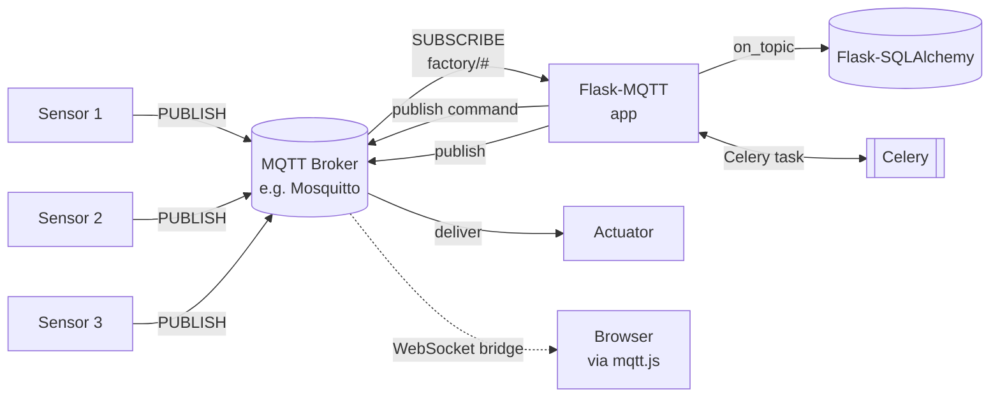
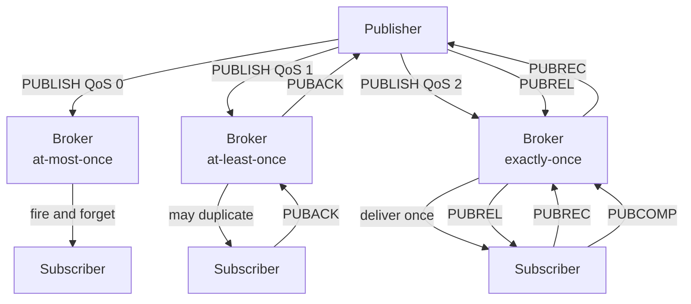
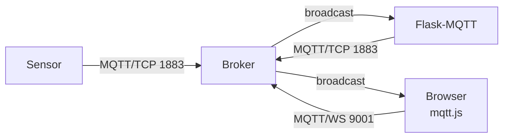
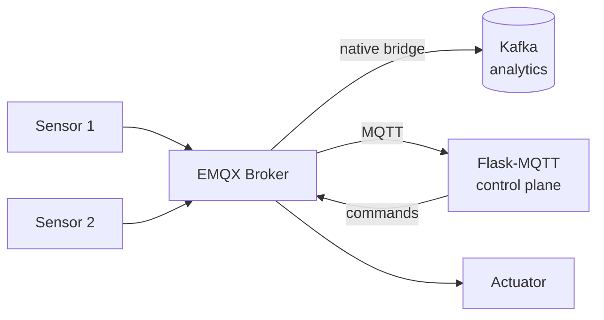
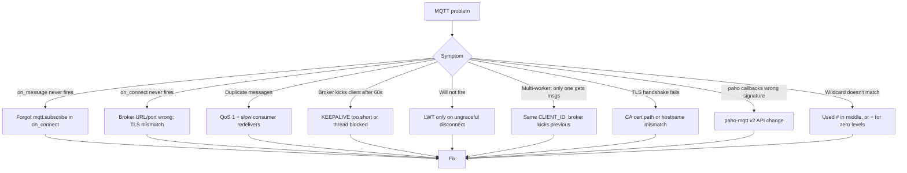

# Flask-MQTT

#flask #mqtt #iot #pubsub #realtime #paho #async

> [!info] MQTT integration for Flask
> `Flask-MQTT` is a thin Flask wrapper around the `paho-mqtt` client. It exposes a `Mqtt()` extension, an `@mqtt.on_topic()` decorator for inbound message handlers, and an `mqtt.publish()` method for outbound messages. With a few lines you turn a Flask app into an MQTT subscriber or publisher — bridging the worlds of HTTP/REST and lightweight IoT messaging.
>
> MQTT (Message Queuing Telemetry Transport, OASIS standard) is the dominant messaging protocol for IoT: it runs over TCP/TLS (or WebSocket), has a 2-byte fixed header, supports three Quality-of-Service levels, and uses a hierarchical topic space (`factory/line3/sensor/7/temperature`) that lets clients subscribe with wildcards. It is much lighter than AMQP/Kafka and much more semantic than plain TCP.

Think of `Flask-MQTT` as the **mailroom** between your Flask app and a swarm of small devices. Each device (sensor, thermostat, gateway, edge controller) drops a postcard into a mailbox (the MQTT **broker**) addressed with a topic like `building/2/floor/3/room/12/temperature`. The broker sorts the cards by topic and forwards copies to every subscriber who registered interest with a wildcard like `building/2/+/+/+/temperature`. Your Flask app can be a subscriber (consumes telemetry and stores it), a publisher (sends commands back to devices), or both.

---

## 1. Overview & Metaphor

### What is MQTT? Why IoT chose it

MQTT was invented in 1999 by IBM for monitoring oil pipelines over satellite links with intermittent connectivity and expensive bandwidth. Three design constraints shaped it:

1. **Wire footprint** — fixed header is 2 bytes; payload can be as small as a single sensor reading. Compare to HTTP where a single GET can be 500+ bytes of headers.
2. **Connection resilience** — sessions survive disconnects; the broker queues messages (QoS 1/2) until the client reconnects. Built-in **Last Will** lets the broker announce a client's unexpected death.
3. **Pub/Sub decoupling** — publishers and subscribers never know about each other; the broker is the only point of contact. Adding a new consumer doesn't touch the producer.

### MQTT vs HTTP vs WebSocket vs AMQP

| Property | **MQTT** | HTTP | WebSocket ([[Flask-SocketIO]]) | AMQP |
|---|---|---|---|---|
| Pattern | Pub/Sub | Request/Response | Bidirectional stream | Pub/Sub + Queues |
| Header overhead | 2 bytes | 200+ bytes | ~6 bytes/frame | ~100+ bytes |
| QoS guarantees | 0, 1, 2 | 1 (TCP) | 1 (TCP) | 0, 1, 2, transactions |
| Wildcard subscriptions | Yes (`+/`, `/#`) | No | No (rooms are explicit) | Yes (routing keys) |
| Last Will & Testament | Yes | No | No | No |
| Persistent sessions | Yes | No | No | Yes |
| Typical payload | <1 KB JSON/binary | Variable | Variable | Variable |
| Battery footprint | Tiny | Heavy | Heavy | Medium |
| Best fit | IoT, telemetry, M2M | CRUD APIs | Browser apps | Enterprise messaging |

### Topic hierarchy and wildcards

```
factory/line3/sensor/7/temperature         ← exact
factory/line3/+/temperature                ← + matches one level
factory/#                                  ← # matches zero or more levels (must be last)
```

Wildcard rules:
- `+` matches exactly **one** topic level (not zero, not many)
- `#` matches **zero or more** levels and must be the **last** character
- Topics are case-sensitive, slash-delimited, and must not contain leading/trailing slashes (technically allowed, but breaks wildcards in subtle ways)

### Architecture



The broker is the **center** of the system. Flask is just one client among many — a particularly smart one that talks HTTP, too.

---

## 2. Installation

```bash
# Flask extension + underlying client
pip install Flask-MQTT paho-mqtt

# TLS for encrypted broker connections
pip install pyOpenSSL    # optional; paho-mqtt uses ssl stdlib

# For WebSocket transport (browser-to-broker via mqtt.js)
pip install "paho-mqtt[websocket]"
```

### Running a local broker

For development, run Mosquitto in Docker:

```bash
docker run -d --name mosquitto -p 1883:1883 -p 9001:9001 \
  eclipse-mosquitto mosquitto -c /mosquitto-no-auth.conf
# 1883 = native MQTT
# 9001 = MQTT over WebSocket
```

Or install system-wide:

```bash
sudo apt install mosquitto mosquitto-clients
mosquitto_sub -t 'test/+' -v     # terminal subscriber for debugging
mosquitto_pub -t test/hello -m 'world'
```

### Application factory install

```python
# extensions/mqtt.py
from flask_mqtt import Mqtt
mqtt = Mqtt()

def init_mqtt(app):
    app.config["MQTT_BROKER_URL"] = "localhost"
    app.config["MQTT_BROKER_PORT"] = 1883
    app.config["MQTT_KEEPALIVE"] = 60
    app.config["MQTT_TLS_ENABLED"] = False
    mqtt.init_app(app)
```

> [!warning] Flask-MQTT vs paho-mqtt v2
> `Flask-MQTT` was written against `paho-mqtt` v1 API (`CallbackAPIVersion.VERSION1`). v2 (released 2024) changed the callback signatures. If you `pip install` without version constraints and get v2, callbacks may break. Pin `paho-mqtt<2` until `Flask-MQTT` releases a v2-compatible update, or use the underlying `paho-mqtt` directly.

---

## 3. Configuration

### Flask-MQTT config keys

| Key | Type | Default | Purpose |
|---|---|---|---|
| `MQTT_BROKER_URL` | str | `"localhost"` | Broker hostname or IP |
| `MQTT_BROKER_PORT` | int | `1883` | TCP port (8883 for TLS, 9001 for WS) |
| `MQTT_CLIENT_ID` | str | `""` (auto) | MQTT client ID; empty = broker assigns |
| `MQTT_CLEAN_SESSION` | bool | `True` | `True` = no persistent session; `False` = broker keeps subscriptions & queued msgs |
| `MQTT_KEEPALIVE` | int | `60` | Seconds between PINGREQ keepalive probes |
| `MQTT_TLS_ENABLED` | bool | `False` | Enable TLS |
| `MQTT_TLS_IN_SECURE` | bool | `False` | Skip cert verification (dev only) |
| `MQTT_TLS_CA_CERTS` | str | `None` | Path to CA bundle |
| `MQTT_TLS_CERTFILE` | str | `None` | Client cert (for mTLS) |
| `MQTT_TLS_KEYFILE` | str | `None` | Client key |
| `MQTT_USERNAME` | str | `None` | Username (broker ACL) |
| `MQTT_PASSWORD` | str | `None` | Password |
| `MQTT_LAST_WILL` | dict | `None` | LWT: `{"topic": ..., "payload": ..., "qos": ..., "retain": ...}` |
| `MQTT_TRANSPORT` | str | `"tcp"` | `"tcp"` or `"websockets"` |

### Application factory wiring

```python
from flask import Flask
from extensions.mqtt import init_mqtt, mqtt

def create_app():
    app = Flask(__name__)
    app.config.update(
        MQTT_BROKER_URL="mqtt.example.com",
        MQTT_BROKER_PORT=8883,
        MQTT_TLS_ENABLED=True,
        MQTT_TLS_CA_CERTS="/etc/ssl/certs/ca-bundle.crt",
        MQTT_USERNAME="flask-app",
        MQTT_PASSWORD="secret",
        MQTT_CLIENT_ID="flask-prod-1",
        MQTT_CLEAN_SESSION=False,   # resume subscriptions & queued msgs
        MQTT_KEEPALIVE=30,
        MQTT_LAST_WILL={
            "topic": "status/flask-prod-1",
            "payload": "offline",
            "qos": 1,
            "retain": True,
        },
    )
    init_mqtt(app)
    return app
```

---

## 4. Quality of Service (QoS) Levels

MQTT defines three delivery guarantees. Choosing the right one is the single most important design decision.



### QoS comparison

| QoS | Handshake | Guarantee | Overhead | Use case |
|---|---|---|---|---|
| **0** | None (fire-and-forget) | At-most-once | Lowest (1 packet) | High-rate telemetry where duplicates don't matter (10 Hz sensor) |
| **1** | PUBACK | At-least-once (may duplicate) | Medium (2 packets) | Most IoT events; commands idempotent on the device |
| **2** | PUBREC/PUBREL/PUBCOMP | Exactly-once | Highest (4 packets) | Billing, state transitions; non-idempotent commands |

> [!tip] Don't default to QoS 2
> QoS 2 doubles broker load and latency. Use QoS 1 + idempotent consumers (deduplicate by message ID or timestamp window). Reserve QoS 2 for billing, payments, and other "exactly once or we lose money" cases.

### Retained messages

If `retain=True` on a PUBLISH, the broker stores the **last** message per topic and delivers it instantly to every new subscriber. Use for state-like topics:

- `home/living_room/light` → `{"on": true}` (retained)
- `device/sensor-7/config` → `{"sample_rate": 5}` (retained)

New subscribers learn the current state immediately, without polling.

### Last Will & Testament (LWT)

On connect, a client can register a "will" message. If the broker detects the client dropped (no PINGREQ within `KEEPALIVE * 1.5`), it publishes the will. Use for presence:

```python
app.config["MQTT_LAST_WILL"] = {
    "topic": "status/flask-prod-1",
    "payload": "offline",
    "qos": 1,
    "retain": True,
}
# On connect, immediately publish "online" retained:
@mqtt.on_connect()
def on_connect(client, userdata, flags, rc):
    mqtt.publish("status/flask-prod-1", "online", qos=1, retain=True)
```

---

## 5. Basic Usage

### Subscribing to topics

```python
# app.py
from flask import Flask
from flask_mqtt import Mqtt

app = Flask(__name__)
app.config["MQTT_BROKER_URL"] = "localhost"
app.config["MQTT_BROKER_PORT"] = 1883
app.config["MQTT_KEEPALIVE"] = 60
app.config["MQTT_TLS_ENABLED"] = False

mqtt = Mqtt(app)

@mqtt.on_connect()
def handle_connect(client, userdata, flags, rc):
    mqtt.subscribe("factory/+/sensor/+/temperature")

@mqtt.on_message()
def handle_message(client, userdata, message):
    payload = message.payload.decode()
    topic = message.topic
    print(f"[{topic}] {payload}")

if __name__ == "__main__":
    app.run(debug=True)
```

### Topic-specific handlers (recommended)

`@mqtt.on_topic()` routes by exact or wildcard topic — much cleaner than a giant `on_message` switch:

```python
@mqtt.on_topic("factory/line1/sensor/+/temperature")
def handle_temp(client, userdata, message):
    sensor_id = message.topic.split("/")[3]
    temp = float(message.payload.decode())
    store_reading(sensor_id, temp)

@mqtt.on_topic("home/+/light/+")
def handle_light(client, userdata, message):
    ...
```

### Publishing

```python
@app.route("/api/light/<room>/<id>/on", methods=["POST"])
def light_on(room, id):
    mqtt.publish(
        topic=f"home/{room}/light/{id}/cmd",
        payload="ON",
        qos=1,
        retain=False,
    )
    return {"ok": True}
```

### Connecting and disconnecting events

```python
@mqtt.on_log()
def handle_log(client, userdata, level, buf):
    app.logger.debug("MQTT %s: %s", level, buf)

@mqtt.on_disconnect()
def handle_disconnect(client, userdata, rc):
    if rc != 0:
        app.logger.warning("Unexpected disconnect from broker (rc=%d)", rc)
```

---

## 6. Intermediate Patterns

### Bridge MQTT → WebSocket → browser

Browsers cannot speak raw MQTT, but they can speak **MQTT over WebSocket** using `mqtt.js`. Configure Mosquitto to expose port 9001 with `protocol websockets`, then in the browser:

```javascript
import mqtt from "mqtt";
const client = mqtt.connect("wss://broker.example.com:9001", {
  clientId: "browser-" + Math.random().toString(16).slice(2),
});
client.subscribe("factory/line1/sensor/+/temperature");
client.on("message", (topic, payload) => console.log(topic, payload.toString()));
```



This way Flask and the browser are both subscribers, no Flask intermediary needed for the live path.

### Bridge MQTT → SSE for browser dashboards

If you don't want to ship `mqtt.js` to the browser, let Flask proxy a single sensor stream as [[Flask-SSE]]:

```python
from flask import Response
import queue, json

SUBSCRIBERS = []   # list of queue.Queue

@mqtt.on_topic("factory/line1/sensor/+/temperature")
def push_to_sse(client, userdata, message):
    payload = json.dumps({"topic": message.topic, "value": message.payload.decode()})
    for q in list(SUBSCRIBERS):
        try: q.put_nowait(payload)
        except queue.Full: pass

@app.route("/stream/temperatures")
def stream_temps():
    q = queue.Queue(maxsize=100)
    SUBSCRIBERS.append(q)
    def gen():
        try:
            while True:
                yield f"data: {q.get()}\n\n"
        finally:
            SUBSCRIBERS.remove(q)
    return Response(gen(), mimetype="text/event-stream")
```

### Persisting telemetry into the DB

```python
@mqtt.on_topic("factory/+/sensor/+/temperature")
def store_temp(client, userdata, message):
    parts = message.topic.split("/")
    line, sensor = parts[1], parts[3]
    value = float(message.payload.decode())
    db.session.add(Reading(line=line, sensor=sensor, value=value, ts=datetime.utcnow()))
    db.session.commit()
```

> [!warning] Don't write to the DB on every message
> A fleet of 1k sensors at 1 Hz = 1k inserts/second. That'll saturate most RDBMSes. Buffer in-memory or in Redis and batch-insert every few seconds via [[Celery]] beat.

### Using Celery for heavy work

```python
@mqtt.on_topic("camera/+/frame")
def handle_frame(client, userdata, message):
    process_frame.delay(message.topic, message.payload)   # offload

@celery.task
def process_frame(topic, payload):
    # ... CV/ML work ...
    pass
```

### Multiple subscriptions with different QoS

```python
@mqtt.on_connect()
def on_connect(client, userdata, flags, rc):
    mqtt.subscribe("factory/+/sensor/+/temperature", 0)   # QoS 0: high rate
    mqtt.subscribe("commands/flask-prod-1/+", 1)          # QoS 1: commands
    mqtt.subscribe("billing/charge", 2)                   # QoS 2: money
```

### Wildcard subscriptions across device fleets

```python
mqtt.subscribe("fleet/+/telemetry/#")
# Matches:
#   fleet/truck-42/telemetry/gps
#   fleet/truck-42/telemetry/fuel
#   fleet/truck-99/telemetry/temperature/engine
```

---

## 7. Advanced Usage

### Shared subscriptions (load balancing)

MQTT 5 introduced `$share/group/topic` — the broker delivers each message to **one** subscriber in the group, not all. Useful when many Flask workers process telemetry:

```python
mqtt.subscribe("$share/flask-workers/factory/+/sensor/+/temperature")
```

Each temperature reading goes to exactly one worker — horizontal scaling without Redis in the middle.

### mTLS authentication

```python
app.config.update(
    MQTT_TLS_ENABLED=True,
    MQTT_TLS_CA_CERTS="/etc/mqtt/ca.crt",
    MQTT_TLS_CERTFILE="/etc/mqtt/flask.crt",
    MQTT_TLS_KEYFILE="/etc/mqtt/flask.key",
)
```

The broker rejects any client without a valid cert signed by the same CA.

### Bridge to Kafka for analytics

MQTT brokers (especially EMQX and VerneMQ) can natively **bridge** to Kafka. Keep Flask-MQTT for control plane; let the broker stream telemetry directly to Kafka for analytics:



### Topic ACL per client

Brokers like Mosquitto support per-user ACL files:

```
user flask-app
topic read factory/+/sensor/+/temperature
topic write commands/+/+
topic readwrite status/flask-app
```

Even if Flask leaks credentials, the attacker can't publish commands.

### Persistent sessions and message replay

```python
app.config.update(
    MQTT_CLIENT_ID="flask-prod-1",          # stable ID
    MQTT_CLEAN_SESSION=False,               # resume
)
# On reconnect, broker redelivers QoS≥1 msgs that arrived while you were away.
```

### Backpressure on inbound floods

`paho-mqtt` runs a network loop on its own thread and calls `on_message` synchronously. If your handler is slow, messages queue in the broker. Two mitigations:

1. Push to an in-process `queue.Queue`, drain from a worker thread.
2. Publish "throttle" messages to sensors when the queue grows.

```python
import queue, threading
work = queue.Queue(maxsize=10000)

@mqtt.on_topic("factory/+/sensor/+/temperature")
def enqueue(client, userdata, message):
    try:
        work.put_nowait(message)
    except queue.Full:
        mqtt.publish("commands/throttle", "1", qos=1)

def worker():
    while True:
        m = work.get()
        store_in_db(m)
threading.Thread(target=worker, daemon=True).start()
```

### Flask-MQTT lifecycle with multi-process gunicorn

`paho-mqtt` keeps a background thread; with `gunicorn -w 4` you get four clients, all with the same `MQTT_CLIENT_ID` (bad). Use a unique ID per worker:

```python
import os
app.config["MQTT_CLIENT_ID"] = f"flask-{os.getpid()}"
```

Or run Flask-MQTT in a single dedicated worker and use Redis to broadcast to the others.

### MQTT 5 features

`paho-mqtt` v2 supports MQTT 5 features: user properties, content type, message expiry, request/response pattern. Useful for richer IoT protocols like Sparkplug B.

---

## 8. Common Pitfalls & Troubleshooting



### Symptom / cause / fix

| Symptom | Cause | Fix |
|---|---|---|
| `on_message` never fires | `mqtt.subscribe` not called (or called outside `on_connect`) | Move subscribe into `@mqtt.on_connect()` |
| Connection refused | Wrong port; TLS not enabled where expected | 1883 plain, 8883 TLS, 9001 WebSocket |
| Client disconnected immediately | Two clients with same `CLIENT_ID` (broker kicks older) | Use unique ID per process (`os.getpid()`) |
| Duplicate deliveries | QoS 1 + slow consumer; PUBACK delayed | Make handler fast; deduplicate by msg ID |
| LWT fires immediately on shutdown | Graceful disconnect doesn't trigger will; you may be killing -9 | Use `mqtt.client.disconnect()` for clean shutdown |
| `#` in middle of topic doesn't match | Spec: `#` must be the last char | Use `+` for single-level wildcards |
| TLS `CERTIFICATE_VERIFY_FAILED` | CA bundle path wrong or self-signed cert | Set `MQTT_TLS_CA_CERTS` or temporarily `MQTT_TLS_IN_SECURE=True` |
| `TypeError: on_connect() takes X positional arguments` | `paho-mqtt` v2 callback signature change | Pin `paho-mqtt<2`, or migrate callbacks to v2 signatures |
| Memory grows | Slow consumer + unbounded queue | Use bounded queue; drop oldest on overflow |
| Works in dev, broken in prod | Dev broker allowed anonymous; prod requires auth | Set `MQTT_USERNAME`/`MQTT_PASSWORD` and ACL |

### The four classic killers

1. **Same `CLIENT_ID` across workers** — the broker kicks the older connection every time a new worker starts.
2. **Subscribing outside `on_connect`** — if the connection drops and resumes, your subscriptions don't come back.
3. **Slow handlers** — paho's loop thread blocks; broker sees no PUBACK and either redelivers or kicks you.
4. **Default QoS 0 for critical commands** — a single packet drop means the device never receives "open valve".

---

## 9. Best Practices

- **Always subscribe in `on_connect`** — this is the only safe place; it runs on every reconnect.
- **Use stable client IDs per logical client** — `flask-prod-1`, not random. Pair with `CLEAN_SESSION=False` for queued message replay.
- **Pick QoS deliberately** — 0 for telemetry, 1 for events, 2 for billing.
- **Make consumers idempotent** — QoS 1 can redeliver; design handlers to safely reprocess.
- **Use retained messages for state** — light state, sensor config, device metadata.
- **Register a Last Will** — for any presence-tracking topic.
- **Use mTLS for production brokers** — never expose port 1883 to the internet.
- **Bound your work queues** — protect the broker from a slow Flask app.
- **Offload heavy work to [[Celery]]** — keep the `on_message` handler under 50 ms.
- **Pick the right broker** — Mosquitto (small, stable), EMQX (large, clustered, rules engine), HiveMQ (enterprise), VerneMQ (cluster-friendly).
- **Don't run MQTT and HTTP on the same Flask process** if MQTT volume is high — split into a dedicated microservice.

---

## 10. Integration with Other Extensions

### [[Flask-SocketIO]]

Push MQTT messages to browsers in real time. Flask-SocketIO is bidirectional; pair with MQTT for IoT dashboards where users can also send commands.

### [[Flask-SSE]]

For one-way dashboards (sensor readings only), Flask-SSE is lighter than Socket.IO. See §6 for the bridge pattern.

### [[Flask-SQLAlchemy]]

Persist telemetry with batched inserts. Use `execution_options(stream_results=True)` for analytics queries.

### [[Celery]]

Offload heavy per-message work (CV, ML, DB writes) to a Celery task queue.

### [[Flask-Caching]]

Cache device metadata (`device/sensor-7/config` retained messages) in Redis or Flask-Caching to avoid hitting the broker for every page render.

### [[Flask-JWT-Extended]]

Don't expose `mqtt.publish()` directly to browsers without auth. Wrap it in an HTTP route guarded by JWT.

### [[Project-Structure]]

Typical layout:

```
app/
  extensions/
    mqtt.py            # Mqtt() + init_mqtt
  blueprints/
    devices.py         # HTTP routes that publish commands
  mqtt_handlers/
    telemetry.py       # @mqtt.on_topic handlers
    commands.py
```

### [[Security-Best-Practices]]

- TLS for broker connections (port 8883).
- mTLS for client auth.
- Per-user ACLs at the broker.
- Never trust inbound payloads — validate with [[Marshmallow]] or Pydantic.
- Rate-limit HTTP routes that publish to the broker.

### [[Performance-Optimization]]

- Use QoS 0 for high-rate telemetry.
- Batch DB writes.
- Use shared subscriptions (`$share/group/topic`) for horizontal scaling.
- Profile paho's network loop with `@mqtt.on_log()`.

---

## 11. Real-World Example

A green-house monitoring system: sensors publish temperature/humidity, Flask stores readings and exposes a REST API, and a browser dashboard streams updates over SSE.

```python
# extensions/mqtt.py
from flask_mqtt import Mqtt
mqtt = Mqtt()

def init_mqtt(app):
    app.config.update(
        MQTT_BROKER_URL="mqtt.example.com",
        MQTT_BROKER_PORT=1883,
        MQTT_CLIENT_ID=f"flask-{os.getpid()}",
        MQTT_CLEAN_SESSION=True,
        MQTT_KEEPALIVE=30,
        MQTT_USERNAME="flask-app",
        MQTT_PASSWORD=app.config["MQTT_PASSWORD"],
        MQTT_LAST_WILL={
            "topic": "status/flask",
            "payload": "offline",
            "qos": 1,
            "retain": True,
        },
    )
    mqtt.init_app(app)
```

```python
# mqtt_handlers.py
import json, queue
from extensions.mqtt import mqtt
from models import db, Reading
from tasks import persist_readings

BUFFER = []

@mqtt.on_connect()
def on_connect(client, userdata, flags, rc):
    mqtt.subscribe("greenhouse/+/sensor/+/+", 0)
    mqtt.publish("status/flask", "online", qos=1, retain=True)

@mqtt.on_topic("greenhouse/+/sensor/+/temperature")
def on_temperature(client, userdata, message):
    parts = message.topic.split("/")     # greenhouse/{zone}/sensor/{id}/temperature
    zone, sensor_id = parts[1], parts[3]
    value = float(message.payload.decode())
    BUFFER.append(Reading(zone=zone, sensor_id=sensor_id, kind="temp", value=value))
    if len(BUFFER) >= 100:
        persist_readings.delay([r.to_dict() for r in BUFFER])
        BUFFER.clear()

@mqtt.on_topic("greenhouse/+/sensor/+/humidity")
def on_humidity(client, userdata, message):
    parts = message.topic.split("/")
    zone, sensor_id = parts[1], parts[3]
    value = float(message.payload.decode())
    BUFFER.append(Reading(zone=zone, sensor_id=sensor_id, kind="humidity", value=value))
```

```python
# blueprints/devices.py
from flask import Blueprint, request, jsonify
from extensions.mqtt import mqtt

bp = Blueprint("devices", __name__, url_prefix="/api/devices")

@bp.post("/<sensor_id>/config")
def set_config(sensor_id):
    body = request.get_json()
    mqtt.publish(
        topic=f"commands/sensor/{sensor_id}/config",
        payload=json.dumps(body),
        qos=1,
        retain=True,
    )
    return jsonify({"ok": True})
```

```python
# app.py
from flask import Flask, Response, stream_with_context
from extensions.mqtt import init_mqtt, mqtt
from extensions.db import db
from blueprints.devices import bp as devices_bp
import mqtt_handlers   # register handlers
import json, queue, os

app = Flask(__name__)
app.config["SQLALCHEMY_DATABASE_URI"] = "sqlite:///greenhouse.db"
app.config["MQTT_PASSWORD"] = os.environ["MQTT_PASSWORD"]
db.init_app(app)
init_mqtt(app)
app.register_blueprint(devices_bp)

SSE_QUEUES = []

@mqtt.on_topic("greenhouse/+/sensor/+/+")
def push_to_sse(client, userdata, message):
    payload = json.dumps({"topic": message.topic, "value": message.payload.decode()})
    for q in list(SSE_QUEUES):
        try: q.put_nowait(payload)
        except queue.Full: pass

@app.route("/stream/readings")
def stream_readings():
    q = queue.Queue(maxsize=200)
    SSE_QUEUES.append(q)
    def gen():
        try:
            while True:
                yield f"data: {q.get()}\n\n"
        finally:
            SSE_QUEUES.remove(q)
    return Response(stream_with_context(gen()), mimetype="text/event-stream",
                    headers={"Cache-Control": "no-cache", "X-Accel-Buffering": "no"})

if __name__ == "__main__":
    app.run(debug=True)
```

```python
# tasks.py
from celery import Celery
from models import Reading
from extensions.db import db

celery = Celery("greenhouse", broker="redis://localhost")

@celery.task
def persist_readings(rows):
    with celery_app.app_context():
        db.session.bulk_insert_mappings(Reading, rows)
        db.session.commit()
```

### Try it

```bash
# 1. start broker
docker run -d --name mosquitto -p 1883:1883 eclipse-mosquitto
# 2. start celery + redis
docker run -d -p 6379:6379 redis
celery -A tasks worker --loglevel=info
# 3. start flask
gunicorn -k gevent -w 1 "app:app"
# 4. simulate a sensor
mosquitto_pub -h localhost -t greenhouse/zone1/sensor/7/temperature -m '23.4'
# 5. open browser at /stream/readings
```

### Production deployment

```bash
gunicorn -k gevent -w 2 --timeout 120 "app:app"
```

For multi-worker, use unique `CLIENT_ID`s and **shared subscriptions** so each message lands on exactly one worker:

```python
mqtt.subscribe("$share/flask/greenhouse/+/sensor/+/+", 0)
```

---

## 12. References

### Official

- **Flask-MQTT docs** — https://flask-mqtt.readthedocs.io
- **Flask-MQTT GitHub** — https://github.com/MrLeeh/Flask-MQTT
- **paho-mqtt docs** — https://eclipse.dev/paho/files/paho.mqtt.python/html/
- **MQTT 3.1.1 spec** — https://docs.oasis-open.org/mqtt/mqtt/v3.1.1/os/mqtt-v3.1.1-os.html
- **MQTT 5 spec** — https://docs.oasis-open.org/mqtt/mqtt/v5.0/mqtt-v5.0.html

### Brokers

- **Mosquitto** — https://mosquitto.org
- **EMQX** — https://www.emqx.io
- **HiveMQ** — https://www.hivemq.com
- **VerneMQ** — https://vernemq.com

### Tutorials & deep dives

- MQTT Essentials (HiveMQ blog series) — https://www.hivemq.com/blog/mqtt-essentials/
- "MQTT 5 for IoT" — https://www.emqx.io/docs/en/latest/mqtt/mqtt5.html
- Sparkplug B specification — https://sparkplug.eclipse.org/specification/

### Cross-vault wikilinks

- [[Flask-SocketIO]] — bidirectional browser transport; pair with MQTT for IoT dashboards
- [[Flask-SSE]] — one-way browser push; bridge MQTT topics to browser via SSE
- [[Celery]] — offload heavy per-message work
- [[Flask-SQLAlchemy]] — persist telemetry with batched inserts
- [[Flask-Caching]] — cache retained device metadata
- [[Flask-JWT-Extended]] — guard HTTP routes that publish commands
- [[Project-Structure]] — `extensions/mqtt.py`, `mqtt_handlers/`, `blueprints/devices.py`
- [[Security-Best-Practices]] — TLS, mTLS, per-user ACL, payload validation
- [[Performance-Optimization]] — shared subscriptions, bounded queues, broker-side bridging to Kafka

---

> [!quote] Final metaphor
> `Flask-MQTT` is the **mailroom** between your Flask app and a swarm of small devices. The MQTT broker is the post office: it sorts messages by topic and delivers them to anyone who subscribed with the right wildcard. Flask is one particularly smart client — it can read sensor readings, persist them, run them through Celery, push them to browsers via [[Flask-SSE]] or [[Flask-SocketIO]], and publish commands back to the field. For any project that touches IoT — agriculture, factories, smart buildings, wearables — MQTT is the right protocol, and `Flask-MQTT` is the lightest way to bring it into a Flask codebase.
