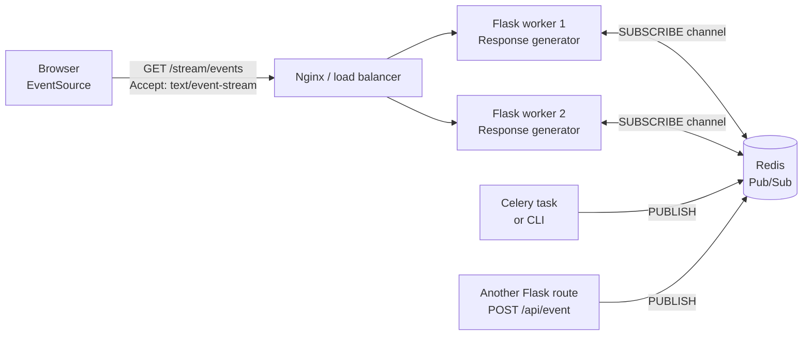
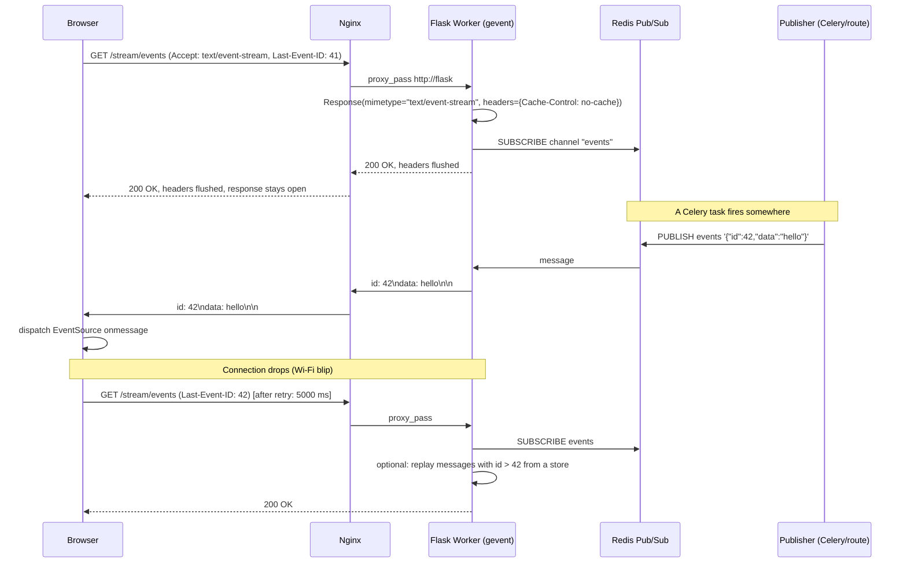
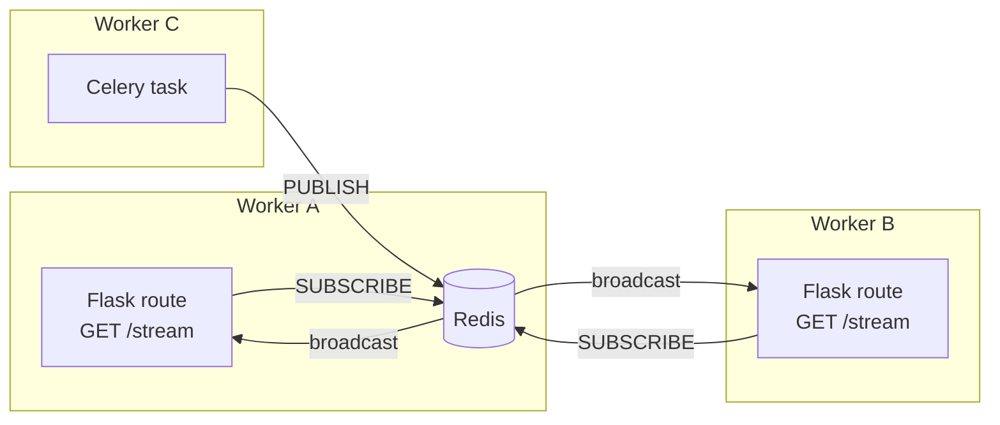
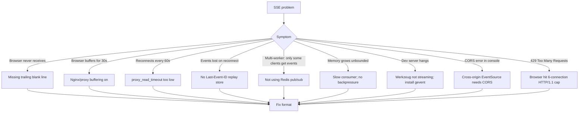

# Flask-SSE

#flask #sse #server-sent-events #realtime #streaming #eventsource #push

> [!info] Server-Sent Events for Flask
> Server-Sent Events (SSE) is the browser-native, unidirectional push protocol built on top of HTTP. A client opens a long-lived `GET` request with `Accept: text/event-stream`; the server keeps the response open and writes `data:` lines as events occur. The browser's `EventSource` API handles reconnection, last-event-id replay, and message routing — all without any third-party JavaScript.
>
> `Flask-SSE` (the PyPI package by Alan Boudreault) is a thin wrapper that exposes a Redis-backed `send()` method and a Jinja-like `pubsub` channel abstraction so any Flask route, Celery task, or CLI script can publish events to connected browsers. For raw needs you can also roll SSE by hand: a Flask generator + `Response(mimetype='text/event-stream')` is enough.

Think of SSE as a **radio broadcast**. The browser tunes in to a station (`/stream/events`) and the server transmits whatever it wants — news, scores, log lines — at its own pace, with no per-message handshake. WebSockets ([[Flask-SocketIO]]) are a **phone call**: both sides can speak, the channel is more complex to set up, and the operator (proxy, firewall) sometimes cuts the line. If your data only flows server→client — dashboards, notifications, live logs, build progress — SSE is simpler, more cache-friendly, and more proxy-tolerant than WebSockets.

---

## 1. Overview & Metaphor

### What is SSE? Why one-way push?

The HTTP protocol is half-duplex and request/response: the client asks, the server answers, the connection closes. Pushing data from server to client without polling requires one of three tricks:

1. **Long polling** — client sends a request; server holds it open until it has something to say, responds, client immediately re-asks. Wasteful and laggy.
2. **WebSocket** — bidirectional TCP upgrade. Powerful but heavier; some corporate proxies block the upgrade.
3. **Server-Sent Events** — plain HTTP `GET` whose response is *deliberately never finished*. Server writes `data: ...` lines; browser dispatches each as a `message` event on an `EventSource` object.

SSE is the middle ground: lighter than WebSockets, native to browsers (no JS library required), and friendly to proxies, load balancers, and CDN caches because it's just HTTP.

### SSE vs WebSocket vs Long polling

| Property | **SSE** | **WebSocket** ([[Flask-SocketIO]]) | Long polling |
|---|---|---|---|
| Direction | Server → client only | Bidirectional | Bidirectional (faked) |
| Transport | HTTP/1.1 or HTTP/2 | TCP upgrade from HTTP | HTTP |
| Browser API | `EventSource` (built-in) | `WebSocket` or `socket.io` | `fetch`/`XHR` |
| Auto-reconnect | Yes, built-in | Manual (or via Socket.IO) | Manual |
| Resume from last event | Yes, `Last-Event-ID` header | No (app must replay) | No |
| Binary | No (UTF-8 text only) | Yes | Yes |
| Max connections per origin | 6 (HTTP/1.1) / unlimited (HTTP/2) | Unlimited | Unlimited |
| Proxy/CDN friendliness | High | Medium (upgrade may be blocked) | High |
| Best fit | Live feeds, notifications, dashboards | Chat, collaboration, games | Legacy fallback |

> [!tip] Choose SSE when…
> - You only push data **server → client**
> - Your clients are browsers (mobile apps usually need a custom SSE client)
> - You want **automatic reconnection** for free
> - You need **per-event IDs** for resume
> - You are behind a restrictive corporate proxy that blocks WebSocket upgrades

### SSE event format

```
id: 42
event: build_status
retry: 5000
data: {"build_id": 99, "status": "passed"}

```

- `id` — optional; if the connection drops, the browser reconnects with `Last-Event-ID: 42` header
- `event` — optional; routes the message to `addEventListener("build_status", ...)` instead of the default `message` handler
- `retry` — optional; tells the browser how long (ms) to wait before reconnecting after a drop
- `data:` — one or more lines; multi-line data must be sent as multiple `data:` lines (the browser joins them with `\n`)
- Blank line — terminator; the browser fires the event when it sees two newlines in a row

### Architecture



The Redis Pub/Sub channel is what decouples the **publisher** (a mutation, a Celery task, a webhook receiver) from the **subscriber** (the Flask worker holding the SSE connection). Without it, events published from one worker would never reach clients connected to another worker.

---

## 2. Installation

### Option A — `flask-sse` (Redis-backed, batteries included)

```bash
pip install flask-sse redis
# gevent or eventlet recommended for streaming responses
pip install gevent
```

### Option B — Roll your own (no extra dep)

If you only need a single-process stream (a log tail, a build status page), you don't need `flask-sse` at all:

```bash
pip install flask           # generator + Response(mimetype=...) is enough
pip install gevent          # optional, lets Flask dev server stream
```

### Production extras

```bash
pip install gunicorn gevent       # async WSGI worker that streams
pip install redis                 # cross-process pub/sub
pip install "flask-cors"          # if the SSE endpoint is cross-origin
```

> [!warning] The Flask dev server cannot stream without an async backend
> `flask run` uses Werkzeug's single-threaded dev server, which buffers responses by default. Either:
> - Install `gevent` (auto-detected by Werkzeug and used to stream), **or**
> - Run with `gunicorn -k gevent`, **or**
> - Use `flask run --with-threads` (still imperfect for SSE)

### Application factory install

```python
# extensions/sse.py
from flask_sse import sse

def init_sse(app):
    app.config["REDIS_URL"] = "redis://localhost"
    app.register_blueprint(sse, url_prefix="/stream")
```

---

## 3. Configuration

### `flask-sse` config keys

| Key | Default | Purpose |
|---|---|---|
| `REDIS_URL` | `redis://localhost` | Redis connection string for Pub/Sub |
| `SSE_REDIS_TIMEOUT` | `60` | Socket timeout for `pubsub.get_message()` |
| `SSE_CHANNEL_DEFAULT` | `"sse"` | Default channel name if `channel=` not given |
| `SSE_HEADERS` | `{}` | Extra response headers (e.g. `{"X-Accel-Buffering": "no"}` to disable Nginx buffering) |
| `SSE_RETRY` | `5000` | Default `retry:` field value (ms) sent on connect |

### Raw `Response` arguments (rolling your own)

| Argument | Recommended | Why |
|---|---|---|
| `mimetype` | `text/event-stream` | Required; the browser checks this |
| `direct_passthrough` | `True` | Bypasses Werkzeug buffering |
| `headers["Cache-Control"]` | `no-cache` | Prevent proxy caching of the stream |
| `headers["Connection"]` | `keep-alive` | Standard keep-alive |
| `headers["X-Accel-Buffering"]` | `no` | Disables Nginx's response buffering |
| `headers["Access-Control-Allow-Origin"]` | `*` or specific origin | For cross-origin `EventSource` |

### Application factory wiring

```python
# app.py
from flask import Flask
from flask_sse import sse

def create_app():
    app = Flask(__name__)
    app.config["REDIS_URL"] = "redis://redis:6379/0"
    app.config["SSE_HEADERS"] = {"X-Accel-Buffering": "no"}
    app.register_blueprint(sse, url_prefix="/stream")
    return app
```

---

## 4. SSE Connection Lifecycle



### The "two newlines" rule

The browser dispatches an event **only** when it sees a blank line (i.e. `\n\n`). A common bug is forgetting the trailing blank line:

```python
yield "data: hello"        # WRONG — browser buffers, never fires
yield "data: hello\n\n"    # CORRECT — fires immediately
```

### Event format diagram

```mermaid
flowchart TB
    subgraph One Event
        I["id: 42\n"]
        E["event: build_status\n"]
        R["retry: 5000\n"]
        D1["data: {\"build_id\":99}\n"]
        D2["data: second line of payload\n"]
        B["\n  ← blank line terminator"]
        I --> E --> R --> D1 --> D2 --> B
    end
```

Each SSE event is a series of `field: value\n` lines terminated by an empty line. `data` can be repeated to send multi-line payloads.

---

## 5. Basic Usage

### Hand-rolled SSE generator (no library)

```python
# app.py
from flask import Flask, Response

app = Flask(__name__)

@app.route("/stream/time")
def stream_time():
    def event_stream():
        import time
        while True:
            yield f"data: {time.time()}\n\n"
            time.sleep(1)

    return Response(
        event_stream(),
        mimetype="text/event-stream",
        headers={
            "Cache-Control": "no-cache",
            "X-Accel-Buffering": "no",   # disable Nginx buffering
            "Connection": "keep-alive",
        },
    )
```

Browser:

```html
<script>
const es = new EventSource("/stream/time");
es.onmessage = (e) => console.log("tick", e.data);
es.onerror = () => console.warn("disconnected; browser will retry");
</script>
```

### Using `flask-sse` with Redis

```python
# app.py
from flask import Flask
from flask_sse import sse

app = Flask(__name__)
app.config["REDIS_URL"] = "redis://localhost"
app.register_blueprint(sse, url_prefix="/stream")

@app.route("/api/deploy")
def deploy():
    sse.publish({"event": "deploy", "data": "starting"}, type="deploy", channel="ops")
    return "ok"

# Client subscribes at:  GET /stream/ops
```

```html
<script>
const es = new EventSource("/stream/ops");
es.addEventListener("deploy", (e) => console.log("Deploy:", JSON.parse(e.data)));
</script>
```

### Multi-line payloads and custom event types

```python
def event_stream():
    yield "event: progress\n"
    yield "id: 1\n"
    yield "data: line one\n"
    yield "data: line two\n"   # browser joins with "\n"
    yield "\n"
    yield "event: done\n"
    yield "data: {}\n"
    yield "\n"
```

### Heartbeats (keep-alive comments)

Proxies (especially Nginx with default `proxy_read_timeout 60s`) close idle connections. Send a comment every 15s to keep them open:

```python
def event_stream():
    last_beat = time.time()
    while True:
        if time.time() - last_beat > 15:
            yield ": ping\n\n"          # colon prefix = comment, ignored by browser
            last_beat = time.time()
        # ... yield real events ...
```

---

## 6. Intermediate Patterns

### Multiple channels per user

```python
@app.route("/stream/<channel>")
@jwt_required()
def user_stream(channel):
    allowed = {f"user-{current_user.id}", "broadcast"}
    if channel not in allowed:
        abort(403)
    return Response(subscribe(channel), mimetype="text/event-stream")
```

### `Last-Event-ID` replay

When the browser reconnects it sends the last `id:` it saw as an HTTP header. Use it to replay missed events from a Redis sorted set:

```python
@app.route("/stream/events")
def events():
    last_id = request.headers.get("Last-Event-ID", "0")
    def stream():
        # Replay missed events
        for member in redis.zrangebyscore("events:store", f"({last_id}", "+inf"):
            yield member.decode()
        # Then live tail
        pubsub = redis.pubsub()
        pubsub.subscribe("events")
        for msg in pubsub.listen():
            if msg["type"] == "message":
                yield msg["data"].decode()
    return Response(stream(), mimetype="text/event-stream")
```

### Pub/Sub with multiple Flask workers



Without Redis (or another broker), events published on Worker A only reach clients connected to Worker A. Redis Pub/Sub is the simplest fix; Kafka or NATS work for higher throughput.

### Authenticated EventSource

`EventSource` cannot set custom headers (a long-standing browser limitation). Three workarounds:

1. **Cookie auth** — if your JWT is in an `HttpOnly` cookie, it's sent automatically.
2. **Token in URL** — `new EventSource("/stream/events?token=" + jwt)` (leaks in access logs; rotate often).
3. **Short-lived ticket** — exchange JWT for a one-time ticket via `POST /api/stream-ticket`, then `EventSource("/stream/events?ticket=" + ticket)`.

```python
import secrets
TICKETS = {}   # in prod: Redis

@app.route("/api/stream-ticket")
@jwt_required()
def issue_ticket():
    ticket = secrets.token_urlsafe(32)
    TICKETS[ticket] = current_user.id
    return {"ticket": ticket}

@app.route("/stream/events")
def stream_events():
    ticket = request.args.get("ticket")
    user_id = TICKETS.pop(ticket, None)
    if not user_id:
        abort(401)
    # ... open SSE ...
```

### Nginx reverse proxy config

```nginx
location /stream/ {
    proxy_pass http://flask_upstream;
    proxy_http_version 1.1;
    proxy_set_header Connection "";    # enable keep-alive
    proxy_buffering off;               # CRITICAL — flush events as they arrive
    proxy_cache off;
    proxy_read_timeout 3600s;          # keep idle connections open
    chunked_transfer_encoding on;
}
```

> [!warning] `proxy_buffering off` is mandatory
> Nginx buffers responses by default, which means your SSE events queue up in Nginx's buffer and the browser sees nothing until the buffer fills or the connection closes. Always set `proxy_buffering off;` and `X-Accel-Buffering: no` header for SSE routes.

### Cross-origin EventSource

```python
from flask_cors import CORS
CORS(app, resources={r"/stream/*": {"origins": ["https://app.example.com"]}})
```

---

## 7. Advanced Usage

### HTTP/2 multiplexing

HTTP/2 lifts the 6-connections-per-origin limit of HTTP/1.1, so a single HTTP/2 connection can carry dozens of SSE streams in parallel. To use it:

```bash
gunicorn -k uvicorn.workers.UvicornWorker --workers 4 app:create_app
# fronted by Nginx with http2 enabled
```

> [!note] HTTP/2 requires an ASGI or h2-enabled WSGI server
> The classic `gunicorn -k gevent` setup speaks HTTP/1.1 only. To get HTTP/2 multiplexing for SSE you need either Hypercorn or an Nginx/HAProxy termination layer.

### Backpressure and bounded queues

If a client is on a slow connection, your generator can pile up unflushed bytes in memory. Wrap with a bounded queue and disconnect slow consumers:

```python
import queue, threading

def bounded_stream(channel, maxsize=100):
    q = queue.Queue(maxsize=maxsize)
    pubsub = redis.pubsub(); pubsub.subscribe(channel)
    def reader():
        for msg in pubsub.listen():
            try:
                q.put_nowait(msg["data"].decode())
            except queue.Full:
                # slow consumer — drop and disconnect
                q.put(None)
                return
    threading.Thread(target=reader, daemon=True).start()
    while True:
        item = q.get()
        if item is None:
            yield "event: slow\ndata: disconnected\n\n"
            return
        yield item
```

### Streaming query results (DB → SSE)

```python
@app.route("/stream/users")
def stream_users():
    def gen():
        with db.session.connection().execution_options(stream_results=True) as conn:
            for row in conn.execute("SELECT id, username FROM users"):
                yield f"data: {json.dumps(dict(row))}\n\n"
        yield "event: done\ndata: {}\n\n"
    return Response(gen(), mimetype="text/event-stream")
```

### GraphQL subscriptions over SSE

Apollo's `graphql-sse` protocol runs subscriptions over SSE instead of WebSocket — useful behind proxies that block WS:

```python
from ariadne.flask import GraphQLView
# Pair with `graphql-sse` Python adapter; same schema as [[Ariadne-Flask]] subscriptions
```

### Fan-out to thousands of clients

For >1k concurrent streams per worker, switch to async (asyncio + `aioredis` or `redis.asyncio`):

```python
import asyncio, redis.asyncio as aioredis
from quart import Quart, Response   # Quart = async Flask

app = Quart(__name__)

@app.route("/stream/async")
async def stream_async():
    r = aioredis.from_url("redis://redis")
    pubsub = r.pubsub()
    await pubsub.subscribe("events")

    async def gen():
        async for msg in pubsub.listen():
            if msg["type"] == "message":
                yield b"data: " + msg["data"] + b"\n\n"
    return Response(gen(), mimetype="text/event-stream")
```

### Broadcast-only mode

For one-to-many notifications (e.g. "system maintenance in 5 min"), skip per-user channels:

```python
sse.publish({"msg": "Maintenance in 5 min"}, type="notice", channel="broadcast")
```

### Reconnecting gracefully

Server-side should send a `retry:` field so the browser waits a sensible interval before reconnecting:

```python
yield "retry: 3000\n"
yield "data: hello\n\n"
```

---

## 8. Common Pitfalls & Troubleshooting



### Symptom / cause / fix

| Symptom | Cause | Fix |
|---|---|---|
| Browser `onmessage` never fires | Missing trailing `\n\n` | Always end events with a blank line |
| Events arrive in 30s bursts | Nginx `proxy_buffering on` (default) | `proxy_buffering off;` + `X-Accel-Buffering: no` |
| Connection drops every 60s | `proxy_read_timeout 60s` (Nginx default) | Bump to `3600s` and send a `: ping` comment every 15s |
| EventSource connects but gets nothing | Yielding strings instead of bytes; charset mismatch | Use `mimetype="text/event-stream"` and yield strings |
| `EventSource` fails in IE/old Edge | No native support | Ship `event-source-polyfill` or use long-polling fallback |
| Reconnect loses last events | No server-side replay store | Persist events in Redis sorted set keyed by `id` |
| Works in dev, broken in prod | Dev used Werkzeug with `gevent`; prod uses `gunicorn -k sync` | Switch to `gunicorn -k gevent` |
| 6 tabs break the 7th tab | HTTP/1.1 6-connection-per-origin limit | Use HTTP/2 or a single multiplexed channel |
| Slow client OOMs worker | Unbounded queue per connection | Bounded queue + drop-and-disconnect on overflow |

### The four classic killers

1. **Missing `\n\n`** — the #1 cause of "my SSE doesn't work".
2. **Proxy buffering** — Nginx's default hides all events until the buffer fills.
3. **No Redis pub/sub** — multi-worker setups silently lose events.
4. **No heartbeat** — idle connections die at the 60s default `proxy_read_timeout`.

---

## 9. Best Practices

- **Use Redis Pub/Sub** even if you have one worker today. Adding a second worker later "just works".
- **Send heartbeats every 15s** (`: ping\n\n`) to keep idle connections alive behind any proxy.
- **Always include `id:` and persist events** in a sorted set if clients must not miss anything.
- **Send `retry:` on connect** so a network blip doesn't cause a reconnect storm.
- **Disable buffering at every layer**: Nginx `proxy_buffering off`, app-level `direct_passthrough=True`, header `X-Accel-Buffering: no`.
- **Bound your queues** to protect against slow consumers.
- **Authenticate via cookies or short-lived tickets** — `EventSource` cannot set Authorization headers.
- **Rate-limit subscription endpoints** — a flood of `EventSource` connections is a cheap DoS.
- **Use HTTP/2** when you expect more than 6 concurrent streams per browser per origin.
- **Prefer SSE over WebSocket** when the data flow is one-way; you save complexity and gain automatic reconnection.
- **Don't send binary** — SSE is UTF-8 text only. Base64-encode if you must.

---

## 10. Integration with Other Extensions

### [[Flask-SocketIO]]

Run both: SSE for one-way server→client push (dashboards, logs), Socket.IO for bidirectional chat or collaboration. Same Redis can serve both.

### [[Celery]]

The canonical pattern: a Celery task does long work and publishes progress to Redis; the Flask SSE route streams it to the browser:

```python
@celery.task
def generate_report(user_id):
    for pct in range(0, 101, 10):
        sse.publish({"user": user_id, "pct": pct}, type="progress", channel=f"user-{user_id}")
        time.sleep(1)
    sse.publish({"user": user_id, "url": "..."}, type="done", channel=f"user-{user_id}")
```

### [[Flask-JWT-Extended]]

Use the short-lived ticket pattern (see §6) to authenticate `EventSource` connections.

### [[Flask-Caching]]

Cache the *list of recent events* per channel so reconnects replay from cache instead of hitting the DB.

### [[Flask-Limiter]]

```python
limiter.limit("10/minute")(stream_route)   # cap new SSE connections per IP
```

### [[Ariadne-Flask]]

Use SSE as the transport for GraphQL subscriptions when WebSocket is blocked — see the `graphql-sse` protocol.

### [[Flask-CORS]]

Required for cross-origin `EventSource`. Set `supports_credentials=True` if you use cookie auth.

### [[Project-Structure]]

A typical layout:

```
app/
  blueprints/
    stream.py       # SSE routes
  publisher.py      # send_event(channel, type, payload) wrapper
```

---

## 11. Real-World Example

A build-status dashboard: a Celery task simulates a build, publishes progress over Redis, and a browser tab renders it live.

```python
# extensions/sse.py
from flask_sse import sse

def init_sse(app):
    app.config["REDIS_URL"] = "redis://localhost"
    app.register_blueprint(sse, url_prefix="/stream")
```

```python
# publisher.py
from flask_sse import sse

def publish_build_event(build_id, channel, payload, type="progress"):
    sse.publish({"build_id": build_id, **payload}, type=type, channel=channel)
```

```python
# tasks.py
from celery import Celery
from publisher import publish_build_event
import time

celery = Celery("builds", broker="redis://localhost")

@celery.task
def run_build(build_id, user_id):
    channel = f"user-{user_id}"
    for stage in ["checkout", "lint", "test", "build", "deploy"]:
        publish_build_event(build_id, channel, {"stage": stage, "status": "running"})
        time.sleep(3)   # simulate work
        publish_build_event(build_id, channel, {"stage": stage, "status": "done"})
    publish_build_event(build_id, channel, {"url": f"/builds/{build_id}"}, type="done")
```

```python
# app.py
from flask import Flask, request, Response, jsonify
from extensions.sse import init_sse
from tasks import run_build
import redis, json, time

app = Flask(__name__)
init_sse(app)
r = redis.from_url("redis://localhost")

@app.route("/api/builds", methods=["POST"])
def start_build():
    build_id = r.incr("builds:counter")
    user_id = 1   # from JWT in real app
    run_build.delay(build_id, user_id)
    return jsonify({"build_id": build_id})

@app.route("/stream/builds/<int:build_id>")
def stream_build(build_id):
    channel = "user-1"   # from JWT
    def gen():
        yield "retry: 3000\n\n"
        last_beat = time.time()
        pubsub = r.pubsub()
        pubsub.subscribe(channel)
        for msg in pubsub.listen():
            if msg["type"] != "message":
                continue
            payload = json.loads(msg["data"])
            event_id = f"{build_id}-{int(time.time()*1000)}"
            yield f"id: {event_id}\n"
            yield f"event: {payload.get('type', 'progress')}\n"
            yield f"data: {json.dumps(payload)}\n\n"
            if time.time() - last_beat > 15:
                yield ": ping\n\n"
                last_beat = time.time()
            if payload.get("type") == "done":
                return
    return Response(gen(), mimetype="text/event-stream",
                    headers={"Cache-Control": "no-cache",
                             "X-Accel-Buffering": "no"})

if __name__ == "__main__":
    app.run(debug=True)
```

```html
<!-- templates/build.html -->
<h1>Build #<span id="bid"></span></h1>
<ul id="log"></ul>
<script>
const params = new URLSearchParams(location.search);
const es = new EventSource(`/stream/builds/${params.get("build")}`);
es.addEventListener("progress", (e) => {
  const p = JSON.parse(e.data);
  document.getElementById("log").innerHTML += `<li>${p.stage}: ${p.status}</li>`;
});
es.addEventListener("done", (e) => {
  const p = JSON.parse(e.data);
  document.getElementById("log").innerHTML += `<li><a href="${p.url}">Build ready</a></li>`;
  es.close();
});
</script>
```

### Try it

```bash
# 1. start redis
docker run -p 6379:6379 -d redis
# 2. start celery worker
celery -A tasks worker --loglevel=info
# 3. start flask
gunicorn -k gevent -w 1 "app:app"
# 4. trigger a build
curl -X POST http://localhost:8000/api/builds
# 5. open the page in a browser tab with ?build=1
```

### Production deployment

```bash
gunicorn -k gevent -w 4 --timeout 3600 "app:app"
```

```nginx
location /stream/ {
    proxy_pass http://flask;
    proxy_http_version 1.1;
    proxy_set_header Connection "";
    proxy_buffering off;
    proxy_read_timeout 3600s;
    proxy_cache off;
    chunked_transfer_encoding on;
}
```

---

## 12. References

### Official

- **flask-sse on PyPI** — https://pypi.org/project/flask-sse/
- **flask-sse docs** — https://flask-sse.readthedocs.io
- **MDN: Using Server-Sent Events** — https://developer.mozilla.org/en-US/docs/Web/API/Server-sent_events/Using_server-sent_events
- **HTML Living Standard, SSE section** — https://html.spec.whatwg.org/multipage/server-sent-events.html

### Protocol & specs

- EventSource protocol — https://html.spec.whatwg.org/multipage/server-sent-events.html#the-eventsource-interface
- `Last-Event-ID` header — https://html.spec.whatwg.org/multipage/server-sent-events.html#last-event-id

### Scaling

- "Scaling SSE with Redis and Nginx" — https://nginx.org/en/docs/http/ngx_http_proxy_module.html#proxy_buffering
- "SSE under HTTP/2" — https://www.rfc-editor.org/rfc/rfc9113
- "graphql-sse protocol" — https://github.com/enisdenjo/graphql-sse

### Tutorials & deep dives

- "Server-Sent Events: a simpler alternative to WebSockets" — https://medium.com/@epicwhale
- "Backpressure in streaming HTTP responses" — https://www.python.org/dev/peps/pep-0525/

### Cross-vault wikilinks

- [[Flask-SocketIO]] — bidirectional alternative; choose based on direction-of-flow
- [[Celery]] — publish SSE events from background tasks
- [[Ariadne-Flask]] — run GraphQL subscriptions over SSE
- [[Flask-JWT-Extended]] — auth for EventSource via ticket pattern
- [[Flask-Caching]] — cache recent events for replay
- [[Flask-Limiter]] — cap concurrent streams per IP
- [[Flask-CORS]] — cross-origin EventSource
- [[Project-Structure]] — `blueprints/stream.py` + `publisher.py`
- [[Security-Best-Practices]] — auth, rate-limit, bound queues
- [[Performance-Optimization]] — HTTP/2 multiplexing, gevent, backpressure

---

> [!quote] Final metaphor
> Flask-SSE is the **radio station** of your real-time stack. The browser tunes in with a single `EventSource` call and the server broadcasts whatever it wants, when it wants, with built-in reconnection and per-event IDs. Where [[Flask-SocketIO]] is a phone call (bidirectional, heavier, more fragile behind proxies), SSE is a one-way broadcast that simply works through any HTTP infrastructure. For dashboards, notifications, build progress, log tails, and GraphQL subscriptions-over-HTTP, it is usually the right answer — and a Flask generator plus a Redis Pub/Sub channel is all you need to start transmitting.
