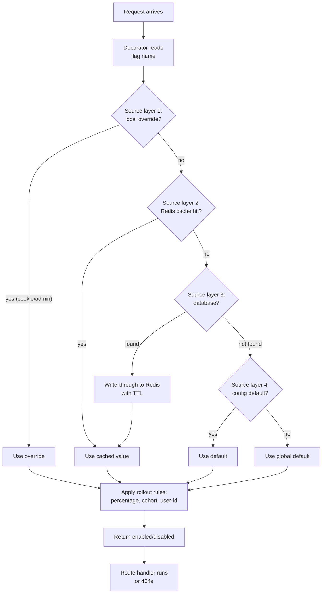
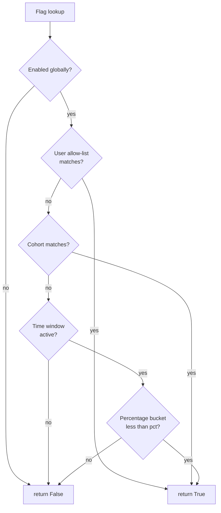
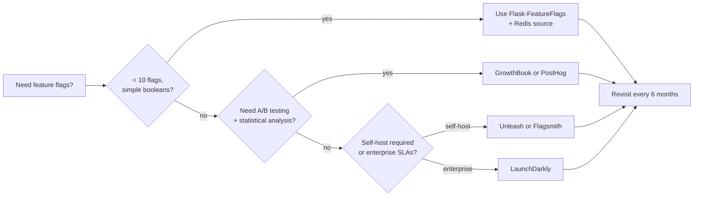
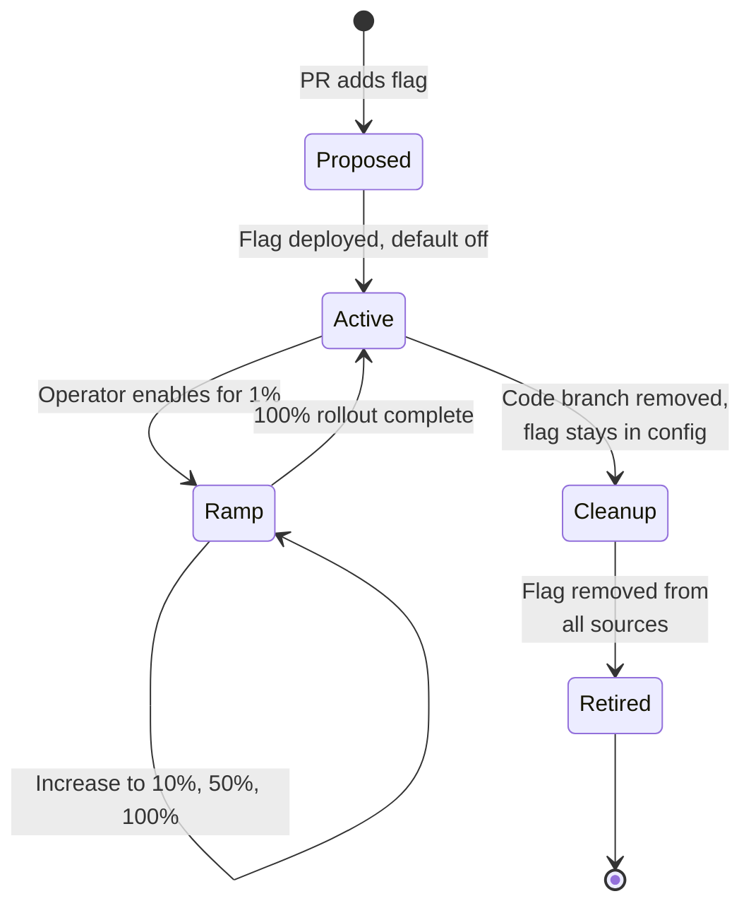

# Flask-FeatureFlags

#flask #feature-flags #feature-toggles #gradual-rollout #a-b-testing #release-engineering #dark-launch

> [!info] Decouple deploy from release — feature toggles for Flask
> **Feature flags** (also called *feature toggles*) let you merge incomplete code to `main`, deploy it to production, and keep it dormant until you're ready to switch it on — per user, per cohort, per percentage, per region. Flask-FeatureFlags is the small extension that wires this capability into the Flask request lifecycle: a decorator (`@feature_flag`), a `current_flags` helper, and pluggable sources (config, Redis, database, external services).
>
> In modern continuous-delivery shops, flags are the single most important release-engineering primitive after CI itself. They let you decouple *deploy* (code reaches prod) from *release* (users see the feature), which is the difference between "Friday-afternoon deploys are scary" and "Friday-afternoon deploys are boring."

Think of a feature flag as a **light switch in a theatre**. The electrician (the engineer) wires up the new spotlight on Thursday and covers it with a cloth. On Saturday's matinée, the stage manager flips the switch — but only for the left half of the audience, to see if the new colour temperature reads well. If the audience hates it, the manager flips it back off in two seconds. No re-wiring, no electrician called back in. That's a feature flag.

---

## 1. Overview & Metaphor

### Why flags exist

Without flags, the only way to ship code is to *also* ship the user-visible behaviour — they're the same atomic event. That couples four otherwise independent concerns:

1. **Code review** (multi-week PRs because the feature isn't "ready").
2. **Deploy** (only happens when the feature is "done").
3. **Release** (every deployed user sees the new behaviour immediately).
4. **Rollback** (revert the deploy, which yanks unrelated fixes that shipped in the same commit).

Flags break this coupling. Code can be merged and deployed while the behaviour stays hidden behind `if flags.is_enabled("new_checkout"): ...`. Rollback becomes `flags.disable("new_checkout")` — a one-line operation that takes effect across your fleet within seconds.

### The four flag categories (Martin Fowler's taxonomy)

| Category | Lifetime | Mutability | Example |
|---|---|---|---|
| **Release flags** | Days to weeks | Operator-controlled | "Show the new checkout flow" |
| **Experiment flags** | Weeks | Automated by A/B framework | "Variant B of the homepage hero" |
| **Ops flags** | Indefinite | Operator-controlled, runtime | "Disable image processing during incidents" |
| **Permission flags** | Permanent | Per-user, business-rule | "Premium subscribers see the audit log" |

Mixing these in one flag namespace is the #1 cause of flag rot. Treat them as four separate concerns with four separate source backends if your app grows large enough.

### Flag evaluation flow



The layered source design means: a developer can override flags locally with a cookie, a test can pin a flag with `override_flag`, and production reads from Redis with database fallback. All three layers coexist.

---

## 2. Installation & Setup

```bash
pip install Flask-FeatureFlags
# Optional but recommended companions:
pip install redis           # for the Redis source — see [[Flask-Redis]]
pip install Flask-SQLAlchemy # for the database source — see [[Flask-SQLAlchemy]]
```

> [!note] Library naming
> The PyPI package is `Flask-FeatureFlags`, the import is `featureflags`, and the most maintained fork today is [`flask-featureflags`](https://github.com/trustrachel/flask-featureflags). A newer community alternative is `flask-feature-flag` (different package). For production use you may also wire feature flags manually using Flask's `app.config` plus a Redis source — the patterns below work with any of these.

### Minimal integration

```python
# app/__init__.py
from flask import Flask
from flask_featureflags import FeatureFlag

def create_app() -> Flask:
    app = Flask(__name__)
    app.config["FEATURE_FLAGS"] = {
        "NEW_CHECKOUT": False,           # default off
        "DARK_MODE": True,               # default on
        "BETA_API_V2": False,
    }
    app.config["FEATURE_FLAGS_DEFAULT"] = False   # unknown flags default to off

    ff = FeatureFlag(app)
    app.extensions["feature_flags"] = ff

    from .routes import bp
    app.register_blueprint(bp)
    return app
```

---

## 3. Core Concepts

### The `@feature_flag` decorator

```python
# app/routes.py
from flask import Blueprint, jsonify, abort
from flask_featureflags import feature_flag

bp = Blueprint("api", __name__)

@bp.route("/checkout")
@feature_flag("NEW_CHECKOUT")
def checkout_new():
    """Only renders if the NEW_CHECKOUT flag is enabled."""
    return jsonify({"flow": "v2", "steps": ["cart", "address", "payment"]})

@bp.route("/checkout/legacy")
def checkout_legacy():
    return jsonify({"flow": "v1"})
```

When `NEW_CHECKOUT` is disabled, the decorated route returns a 404 (configurable to 403 or a redirect). This means the route effectively *does not exist* for users who don't have the flag — perfect for dark-launching endpoints before announcing them.

### Programmatic checks

```python
from flask import current_app

def get_checkout_handler():
    ff = current_app.extensions["feature_flags"]
    if ff.is_active("NEW_CHECKOUT"):
        return NewCheckoutHandler()
    return LegacyCheckoutHandler()
```

Use the decorator for routes; use `is_active` for branch points inside services. The two paths read from the same source, so behaviour is consistent.

### Reading flags in templates

```jinja
{# templates/base.html #}

  <link rel="stylesheet" href="/static/css/dark.css">

```

`feature_flag` is registered as a Jinja global by default. This makes UI-level toggles trivial — change one flag, and a CSS swap rolls out across every page.

---

## 4. Flag Sources

The power of a real feature-flag system is in *where the flag values live*. Flask-FeatureFlags ships with a small pluggable source system. You can register multiple sources; they are queried in order, and the first non-`None` answer wins.

### Source types

| Source | Latency | Mutability | Best for |
|---|---|---|---|
| **`ConfigFlagSource`** | ~0 | Requires redeploy | Default values; kill switches baked into config |
| **`RedisFlagSource`** | ~1 ms | Operator-controlled at runtime | Most production flags; integrates with [[Flask-Redis]] |
| **`DatabaseFlagSource`** | ~5-20 ms | Operator-controlled via admin UI | Flags that need audit trails and per-user overrides |
| **`LaunchDarklySource`** | ~50 ms (streaming) | External dashboard | Enterprise teams; see §8 |
| **`CookieFlagSource`** | ~0 | Per-developer override | Local testing without touching shared state |

### Redis source — the workhorse

```python
# app/sources.py
import json
from redis import Redis
from featureflags.sources import BaseSource

class RedisFlagSource(BaseSource):
    """Reads flags from Redis hash `feature_flags`.

    Each key is a flag name; each value is a JSON document describing
    the rollout rules (see §5).
    """
    KEY = "feature_flags"

    def __init__(self, redis_url: str):
        self.redis = Redis.from_url(redis_url)

    def is_active(self, name: str) -> bool | None:
        raw = self.redis.hget(self.KEY, name)
        if raw is None:
            return None  # fall through to the next source
        spec = json.loads(raw)
        return self._evaluate(spec, user_id=_current_user_id())

    @staticmethod
    def _evaluate(spec: dict, user_id: int | None) -> bool:
        if not spec.get("enabled", False):
            return False
        # Rollout rules — see §5
        if spec.get("percentage", 0) == 100:
            return True
        if user_id is None:
            return False
        bucket = hash(f"{spec['name']}:{user_id}") % 100
        return bucket < spec.get("percentage", 0)

    def set_flag(self, name: str, spec: dict) -> None:
        self.redis.hset(self.KEY, name, json.dumps(spec))
```

### Database source — for admin UIs

```python
# app/models.py — assumes SQLAlchemy, see [[Flask-SQLAlchemy]]
class FeatureFlag(db.Model):
    __tablename__ = "feature_flags"
    name        = db.Column(db.String(64), primary_key=True)
    enabled     = db.Column(db.Boolean, default=False, nullable=False)
    percentage  = db.Column(db.Integer, default=0, nullable=False)
    cohorts     = db.Column(db.JSON, default=list)        # ["beta", "internal"]
    updated_by  = db.Column(db.String(64))
    updated_at  = db.Column(db.DateTime, server_default=db.func.now())
```

The admin UI (often built with [[Flask-Admin]]) writes rows here; a write-through cache to Redis keeps reads fast.

---

## 5. Rollout Strategies

A boolean "on/off" is the simplest flag. Production flags usually need finer control.

### Strategy matrix

| Strategy | Decision rule | When to use |
|---|---|---|
| **Boolean** | `enabled: true` | Hard launch to everyone |
| **Percentage rollout** | `bucket(user_id) < percentage` | Gradual ramp 1% → 10% → 50% → 100% |
| **Cohort allow-list** | `user.cohort in cohorts` | Beta testers, internal users |
| **User allow-list** | `user_id in allow_list` | Sales demos, specific customer previews |
| **Time window** | `now() > start_at` | Scheduled launches ("go live at 9am PT") |
| **A/B variant** | `bucket(user_id) mod num_variants` | Experimentation — see §6 |

### Rollout strategy decision tree



### Stable bucketing

The cardinal rule of percentage rollouts: **the same user must always land in the same bucket**. Otherwise users see the new feature flicker on and off across requests, which feels broken.

```python
import hashlib

def stable_bucket(flag_name: str, user_id: int) -> int:
    """Deterministic 0-99 bucket for a given (flag, user) pair."""
    h = hashlib.sha256(f"{flag_name}:{user_id}".encode()).hexdigest()
    return int(h[:8], 16) % 100
```

Hash-based bucketing is preferable to `random()` because:
- It survives process restarts.
- Different flag names give independent buckets (a user can be in the 5% for flag A and the 50% for flag B without correlation).
- Different services written in different languages can compute the same bucket given the same algorithm — useful when a Go microservice needs to agree with the Flask app.

---

## 6. A/B Testing Patterns

A/B testing is feature flags with **multiple variants** and an analytics pipeline. The flag determines which variant a user sees; analytics tell you which variant performed better.

### Variant assignment

```python
from dataclasses import dataclass

@dataclass
class Variant:
    name: str
    weight: int           # relative weight, e.g. 1:1:1 for equal split

def assign_variant(flag_name: str, user_id: int, variants: list[Variant]) -> Variant:
    total = sum(v.weight for v in variants)
    bucket = stable_bucket(flag_name, user_id) * total // 100
    for v in variants:
        if bucket < v.weight:
            return v
        bucket -= v.weight
    return variants[-1]  # safety net
```

### Wiring into a route

```python
# app/routes.py
from flask import Blueprint, g, jsonify
from flask_featureflags import feature_flag

bp = Blueprint("ab", __name__)

VARIANTS = [Variant("control", 1), Variant("treatment", 1)]

@bp.route("/homepage")
@feature_flag("HOMEPAGE_REDESIGN")
def homepage():
    user_id = g.user.id if g.user else None
    if user_id is None:
        variant = "control"
    else:
        variant = assign_variant("HOMEPAGE_REDESIGN", user_id, VARIANTS).name

    # Emit an analytics event so we can later measure conversion by variant.
    g.analytics.track("homepage.view", {"variant": variant})

    if variant == "treatment":
        return render_template("homepage_v2.html")
    return render_template("homepage_v1.html")
```

> [!tip] Track variant on every downstream event
> If you only track the variant on the "homepage.view" event but not on "signup.completed", you cannot compute conversion. The rule: **the variant must be attached to every event in the funnel.** Most analytics SDKs support a user property like `set_user_property("ab_flags", {...})` that handles this automatically.

---

## 7. Caching & Performance

Flag lookups happen on every request. A naïve implementation that hits the database for each check will add 20-50 ms per request and crush your DB.

### Tiered cache

```python
# app/flags_cache.py
from flask import g
from functools import lru_cache

class TieredFlagSource:
    def __init__(self, redis_source, db_source, config_source):
        self.redis = redis_source
        self.db = db_source
        self.config = config_source

    def is_active(self, name: str) -> bool:
        # 1. Per-request cache (flask.g) — free after the first lookup
        if not hasattr(g, "_flags"):
            g._flags = {}
        if name in g._flags:
            return g._flags[name]

        # 2. Redis — ~1ms
        val = self.redis.is_active(name)
        if val is None:
            # 3. Database — ~10ms, but only on cache miss
            val = self.db.is_active(name)
            if val is None:
                # 4. Config default — free
                val = self.config.is_active(name)
            # Write-through to Redis for next time
            self.redis.set_cached(name, val, ttl=60)

        g._flags[name] = val
        return val
```

| Layer | Latency | TTL | Invalidation |
|---|---|---|---|
| `g._flags` | ~0 ns | request | Automatic at end of request |
| Redis | ~1 ms | 60 s | TTL or pub/sub invalidation on write |
| Database | ~10 ms | n/a | Source of truth |
| Config | ~0 ns | process lifetime | Requires deploy |

### Invalidation via pub/sub

When an operator flips a flag in the admin UI, you don't want to wait 60 seconds for the Redis TTL to expire. Use Redis pub/sub to push invalidations:

```python
# On write:
redis.publish("feature_flags:invalidate", flag_name)

# On every app instance:
pubsub.psubscribe("feature_flags:invalidate")
for msg in pubsub.listen():
    flag_name = msg["data"]
    redis.delete(f"flag_cache:{flag_name}")
```

See [[Flask-Redis]] for the pub/sub patterns and [[Flask-Caching]] for a higher-level cache abstraction that does the same thing.

---

## 8. Alternatives & When to Upgrade

As your flag count grows past ~50, home-grown solutions start to creak. You need audit logs, RBAC, scheduled rollouts, experiment tracking. That's when a dedicated platform becomes worth the cost.

| Platform | Hosting | Strengths | Pricing model |
|---|---|---|---|
| **LaunchDarkly** | SaaS | Best-in-class SDKs, streaming updates, audit log | Per-seat + per-request |
| **Unleash** | Self-host or SaaS | Open source, enterprise features, good Python SDK | Open source / paid SaaS |
| **Flagsmith** | Self-host or SaaS | Open source, edge flags, identity segments | Open source / paid SaaS |
| **GrowthBook** | Self-host or SaaS | Tight A/B + analytics integration | Open source / paid SaaS |
| **PostHog** | SaaS | Flags + product analytics in one | Usage-based |

### Decision framework



### Migrating to LaunchDarkly (example sketch)

```python
# app/sources_launchdarkly.py
import ldclient
from ldclient.config import Config
from flask import g

class LaunchDarklySource:
    def __init__(self, sdk_key: str):
        ldclient.set_config(Config(sdk_key))

    def is_active(self, name: str) -> bool | None:
        user = getattr(g, "ld_user", None)
        if user is None:
            return None  # fall through
        return ldclient.get().variation(name, user, default=False)
```

Wire this as the first source. Once all flags are mirrored in LaunchDarkly, delete the Redis source — the flag reads now go to LaunchDarkly's streaming cache, which is ~1 ms locally after the initial fetch.

---

## 9. Flag Lifecycle & Hygiene

Flags are technical debt. Every flag in your codebase is a branch that some future engineer will have to reason about. Without discipline, you'll have 200 flags after two years, half of them dead.

### Lifecycle states



### Hygiene rules

> [!warning] The flag-debt spiral
> "We'll clean up the flag next sprint" — said every team that has 200 stale flags. Treat flag cleanup as a Definition-of-Done item: a feature is not "done" until the flag that guarded it has been removed from the codebase.

1. **Every flag has an owner and a kill date.** Record both in the database row. Run a weekly cron that emails owners of flags whose kill date has passed.
2. **Flag names are versioned.** `NEW_CHECKOUT` becomes `NEW_CHECKOUT_2024Q1` so that future engineers can grep for the year and understand context.
3. **Default to off in config.** Even if your ops dashboard shows a flag as enabled, the *config default* should be off — that way a Redis outage doesn't accidentally expose half-finished features.
4. **Flags are not configurations.** If a flag has been on for 6 months and you can't imagine turning it off, it's a config value. Move it to `app.config`.
5. **Audit log every change.** Who flipped `PAYMENT_GATEWAY_V2` to 100% on Friday night? Without an audit log you'll never know.

---

## 10. Common Pitfalls & Troubleshooting

| Symptom | Cause | Fix |
|---|---|---|
| Flag is "on" for some requests, "off" for others | Non-deterministic bucketing (e.g. `random.random()`) | Switch to `stable_bucket(flag, user_id)` (§5) |
| Cached flags don't update after admin toggle | TTL-based cache with no invalidation | Add pub/sub invalidation (§7) |
| Flag works in dev, broken in prod | Source order differs between envs | Print source order at startup: `app.extensions["feature_flags"].sources` |
| 50% rollout causes 50% error rate | New code path has a bug only triggered in prod | Roll back to 0% immediately; add automated canary alerts |
| Tests are flaky | Test A leaves flag overridden in `g._flags` and Test B reuses the request context | Use `pytest` fixture with fresh `app.test_request_context()` per test |
| Template `feature_flag()` always returns False | Jinja global not registered in tests | Use `app.test_request_context()` and ensure `init_app` ran |

> [!danger] Never put a flag check inside a hot loop
> ```python
> for item in items:
>     if feature_flag("NEW_TAX_CALC"):
>         item.tax = new_calc(item)
>     else:
>         item.tax = old_calc(item)
> ```
> This calls the flag source N times per request. Hoist the check:
> ```python
> use_new = feature_flag("NEW_TAX_CALC")
> for item in items:
>     item.tax = new_calc(item) if use_new else old_calc(item)
> ```

---

## 11. Best Practices Checklist

> [!success] Flag hygiene
> - [ ] Every flag has a documented owner, kill date, and rationale in the database row.
> - [ ] Flag sources are layered: config → Redis → database → external.
> - [ ] Percentage rollouts use deterministic hash bucketing (§5).
> - [ ] Per-request cache (`g._flags`) prevents redundant source lookups.
> - [ ] Admin UI writes publish pub/sub invalidations to all app instances.
> - [ ] A/B variants are tracked on every analytics event in the funnel, not just the entry event.
> - [ ] Default-off in config; default-`None` in sources (so unknown flags fall through predictably).
> - [ ] Flag cleanup is part of the Definition of Done for every feature.
> - [ ] A weekly cron flags stale flags (age > 90 days) for retirement.
> - [ ] External platform integration (LaunchDarkly/Unleash) is behind a source interface so you can swap vendors.

---

## 12. Further Reading & Cross-References

- **Martin Fowler, *Feature Toggles*** — the canonical taxonomy of flag categories. <https://martinfowler.com/articles/feature-toggles.html>
- **Pete Hodgson, *Feature Flags: The Good, Bad, and Ugly*** (IEEE Software 2018) — case studies of flag-debt spirals.
- **LaunchDarkly, *Practices of High-Performing Teams*** — operational benchmarks.
- **Related notes in this vault:**
  - [[Flask-Caching]] — the cache abstraction that backs the Redis flag source.
  - [[Flask-Redis]] — pub/sub invalidation patterns.
  - [[Flask-SQLAlchemy]] — the database source schema.
  - [[Flask-Admin]] — building the operator-facing flag dashboard.
  - [[Pydantic-Settings]] — typed flag defaults in config.
  - [[Flask-Environments]] — per-environment flag defaults.

> [!quote] Pete Hodgson
> "Feature flags are a powerful technique for managing risk in continuous delivery. But like any powerful tool, they come with their own risks. Treat flags as a precious resource — track them, audit them, and clean them up when they're no longer needed."
