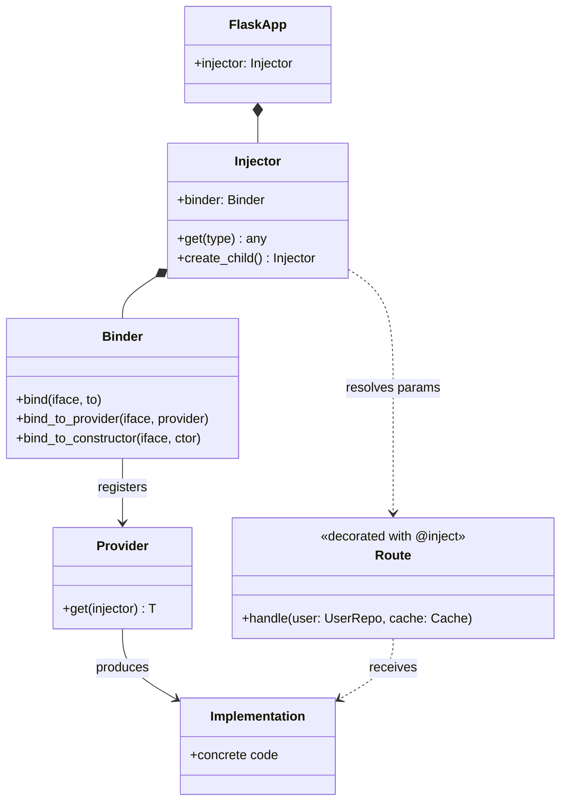
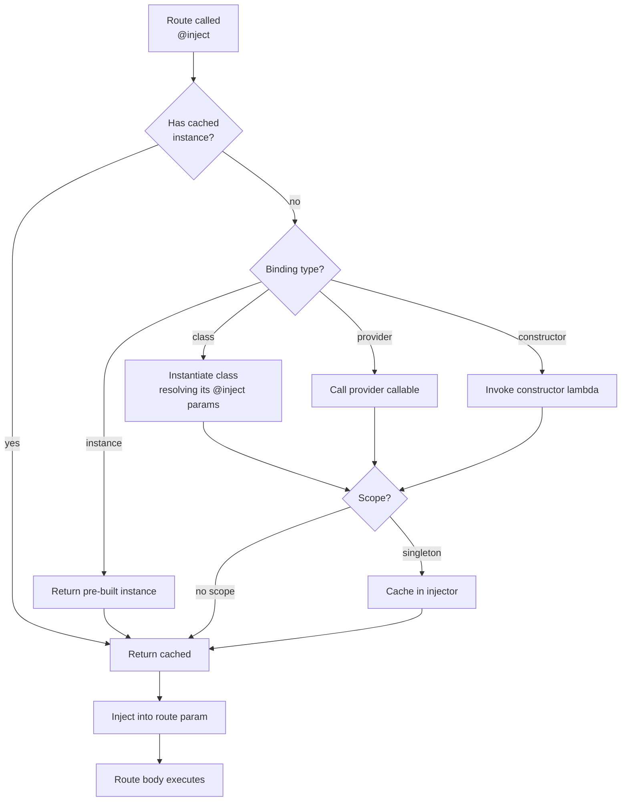
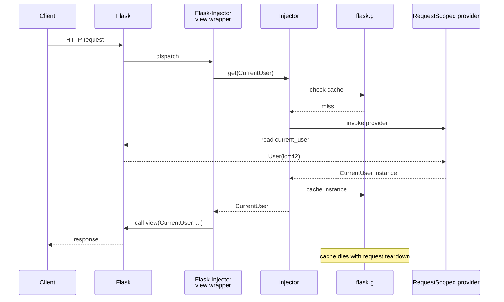
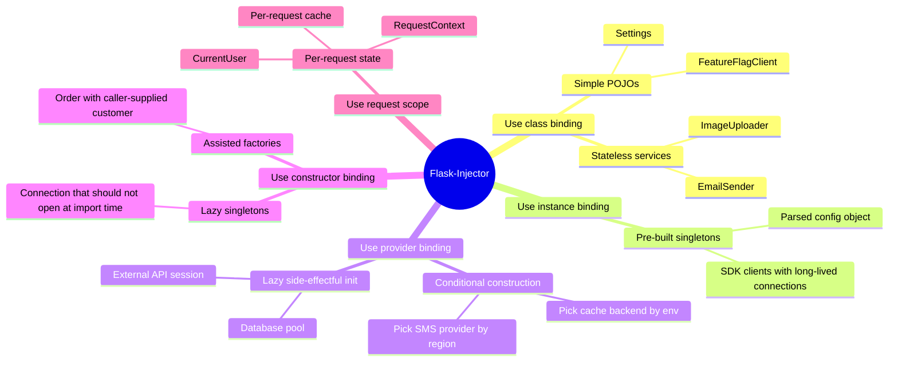

# Flask-Injector

#flask #dependency-injection #injector #ioc #architecture #testing #services

> [!info] Dependency Injection for Flask — the `injector` library, Flask-flavoured
> **Flask-Injector** wires the [injector](https://github.com/alecthomas/injector) dependency-injection (DI) library into Flask. It lets you declare the collaborators a route or service needs as **typed parameters**, and have the framework resolve them at call time. The result: views that are thin, services that are testable, and configuration that flows through the call graph instead of being read from a global `current_app`.
>
> Flask-Injector is the spiritual cousin of FastAPI's `Depends` and Spring's `@Autowired`. It is small (a few hundred lines of glue code), battle-tested, and integrates cleanly with the Flask app-factory pattern documented in [[Flask-Environments]].

Think of dependency injection as a **restaurant kitchen**. The chef (your route handler) does not personally hunt down tomatoes, knives, and the sous-chef — those things are delivered to the station by a runner (the DI container). The chef only declares what they need ("I need a sharp knife and 200g of diced tomato") and the runner assembles it. When a health inspector comes (your test suite), they swap the real tomatoes for plastic demo tomatoes without the chef noticing — that's a test double, injected transparently.

---

## 1. Overview & Metaphor

### Why dependency injection in Flask?

Plain Flask encourages a *service-locator* style: views call `current_app.extensions["redis"]`, `db.session`, `current_user`, `g.something`. This works beautifully for small apps, but at scale three pathologies emerge:

1. **Hidden coupling.** A view that reads `current_app.config["STRIPE_KEY"]` and `db.session` and `cache.get(...)` has implicit dependencies you can only discover by reading the body. There is no signature to scan.
2. **Testing is painful.** To unit-test the view in isolation, you must monkeypatch `current_app`, `db.session`, and `cache` — globals that are shared with every other test. Test isolation becomes a fragile dance of `with app.app_context():` blocks.
3. **Configuration leaks everywhere.** The same `STRIPE_KEY` is read from `current_app.config` in twenty different places. Changing where it comes from (env var, secrets manager, per-tenant override) means touching twenty call sites.

Flask-Injector addresses all three by making dependencies **explicit function parameters** that the framework resolves for you. The route signature becomes the contract.

### The three primitives

| Primitive | What it does | Typical use |
|---|---|---|
| **`Binder`** | A registry you configure once at startup. You call `binder.bind(Interface, to=Implementation)` to declare how each abstract type should be satisfied. | Wiring production vs test implementations. |
| **`@inject` decorator** | Marks a function as needing DI. The injector inspects its type-annotated parameters and resolves each one through the binder. | Routes, service constructors, CLI commands. |
| **`Injector` instance** | The runtime container. Flask-Injector creates one per app; you can also create child injectors for request-scoped bindings. | Per-request services (e.g. "the current user"). |

### How resolution works — class diagram



The diagram above is the entire mental model. The `Binder` is the recipe book, the `Provider` is the cook, and the `Route` is the customer order. The `Injector` is the kitchen expediter that walks the order to the right cook and back.

---

## 2. Installation & Setup

```bash
pip install Flask-Injector injector
# Optional but recommended companions:
pip install pydantic-settings      # typed config — see [[Pydantic-Settings]]
pip install Flask-SQLAlchemy        # already provides db.session
```

Flask-Injector pins `injector>=0.20`. On Python 3.11+ everything works out of the box; on 3.10 you may need `typing_extensions`.

### Minimal integration

```python
# app/__init__.py
from flask import Flask
from flask_injector import FlaskInjector
from injector import Binder, inject, singleton

from .services import GreetingService, EmailService, RealEmailService
from .config import Settings

def configure_bindings(binder: Binder) -> None:
    # Bind concrete class -> itself (no-op, but explicit)
    binder.bind(GreetingService, to=GreetingService, scope=singleton)
    # Bind interface -> implementation
    binder.bind(EmailService, to=RealEmailService)
    # Bind a configuration object once
    settings = Settings()
    binder.bind(Settings, to=settings, scope=singleton)

def create_app() -> Flask:
    app = Flask(__name__)
    app.config.from_object("app.config.DefaultConfig")

    from .routes import bp
    app.register_blueprint(bp)

    # Wire the injector AFTER all blueprints are registered.
    FlaskInjector(app=app, modules=[configure_bindings])
    return app
```

> [!warning] Call `FlaskInjector(...)` after `register_blueprint`
> Flask-Injector wraps every registered view function with its own decorator that performs parameter resolution. If you call `FlaskInjector(...)` *before* blueprints are registered, those blueprint views will not be wrapped, and `@inject` on them will silently do nothing. This is the single most common "why aren't my dependencies being injected?" bug.

---

## 3. Core Concepts: Providers, Bindings, Scopes

### Binding styles

The `Binder` supports four binding styles, each useful in different situations:

| Style | Syntax | When to use |
|---|---|---|
| **Class binding** | `binder.bind(EmailService, to=RealEmailService)` | When the implementation is a plain class with no constructor args (or whose args are themselves injectable). |
| **Instance binding** | `binder.bind(Settings, to=settings_instance)` | When you already have a fully-built object (e.g. parsed from env at startup). |
| **Provider binding** | `binder.bind_to_provider(Cache, lambda: build_cache())` | When construction has side effects or conditional logic. |
| **Constructor binding** | `binder.bind_to_constructor(Conn, Constructor(Conn, lambda i: Conn()))` | When you want lazy construction with explicit lifecycle. |

### Scopes

```python
from injector import singleton, threadlocal

binder.bind(Database, to=PostgresDB, scope=singleton)        # one instance per injector
binder.bind(RequestContext, to=RequestContext, scope=threadlocal)  # one per thread
```

- **`singleton`** — one instance per `Injector` (which usually means per app). Use for stateless services or expensive resources.
- **no scope** — a new instance is created on every resolution. Use for short-lived, cheap objects.
- **`threadlocal`** — one per thread; rarely needed in Flask since each request already has a thread.

There is **no built-in request scope**, but you can build one — see §5 below.

### Provider binding flow



---

## 4. Injecting into Routes & Services

### Route-level injection

```python
# app/routes.py
from flask import Blueprint, jsonify, request
from flask_injector import inject
from injector import inject as inj_inject

from .services import GreetingService, EmailService
from .repos import UserRepo

bp = Blueprint("api", __name__)

@bp.route("/hello/<int:user_id>")
@inject
def hello(user_id: int, greeter: GreetingService, users: UserRepo):
    user = users.get(user_id)
    if user is None:
        return jsonify({"error": "not found"}), 404
    return jsonify({"message": greeter.greet(user.name)})

@bp.route("/notify", methods=["POST"])
@inject
def notify(emailer: EmailService, users: UserRepo):
    data = request.get_json()
    user = users.get(data["user_id"])
    emailer.send(user.email, data["subject"], data["body"])
    return jsonify({"status": "queued"}), 202
```

The key insight: Flask's URL parameters (`user_id`) and the injected services (`greeter`, `users`) **coexist in the same signature**. Flask-Injector inspects type annotations, leaves the Flask-managed parameters alone, and resolves only the typed ones.

### Service-layer injection

```python
# app/services.py
from injector import inject
from .repos import UserRepo, OrderRepo
from .events import EventBus

class OrderService:
    @inject
    def __init__(self, users: UserRepo, orders: OrderRepo, bus: EventBus):
        self.users = users
        self.orders = orders
        self.bus = bus

    def place_order(self, user_id: int, items: list[dict]) -> "Order":
        user = self.users.get(user_id)
        if not user.is_active:
            raise ValueError("user is not active")
        order = self.orders.create(user_id=user_id, items=items)
        self.bus.publish("order.placed", order_id=order.id)
        return order
```

The `@inject` on `__init__` lets `OrderService` itself be a dependency — when a route asks for `OrderService`, the injector recursively resolves `UserRepo`, `OrderRepo`, and `EventBus`.

> [!tip] Constructors must be `@inject`-decorated
> A common mistake is to write `def __init__(self, users: UserRepo)` *without* `@inject`. Plain type hints are **not** enough — the `injector` library needs the decorator to know it should introspect the constructor. The error message is cryptic ("could not infer type of argument"), so add the decorator preemptively on every injectable class.

---

## 5. Request-Scoped Providers

Real apps often need a "current request" object — the authenticated user, a per-request cache, a tracing span. Flask-Injector does not have a built-in request scope, but you can build one with a custom provider and `flask.g`.

### Pattern: per-request user

```python
# app/request_scope.py
from flask import g, has_request_context
from injector import Injector, Module, provider, Scope, ScopeDecorator
from werkzeug.local import LocalProxy

class RequestScope(Scope):
    """One instance per Flask request, cached on flask.g."""
    def get(self, key, provider):
        try:
            return g._injector_cache[key]
        except (AttributeError, KeyError):
            instance = provider.get(self.injector)
            g.setdefault("_injector_cache", {})[key] = instance
            return instance

request_scope = ScopeDecorator(RequestScope)

class RequestModule(Module):
    @provider
    @request_scope
    def current_user(self) -> "CurrentUser":
        # Resolved once per request, then cached on g.
        from flask_login import current_user
        return CurrentUser(current_user.id, current_user.email)

# Wire it during app creation:
def create_app():
    app = Flask(__name__)
    # ...
    FlaskInjector(app=app, modules=[configure_bindings, RequestModule()])
    return app
```

### Request-scoped resolution flow



The cache on `g` is torn down automatically at end of request by Flask's teardown machinery — no manual cleanup required.

---

## 6. Configuration & Bindings Table

| Configuration concern | Mechanism | Example |
|---|---|---|
| **Wiring modules** | `FlaskInjector(app=app, modules=[...])` | `modules=[db_module, cache_module, request_module]` |
| **Custom scope** | `Scope` subclass + `ScopeDecorator` | `request_scope` (see §5) |
| **Lazy singleton** | `binder.bind_to_constructor(T, Constructor(T, lambda i: build_T()))` | Database connection pools |
| **Override in tests** | Pass an extra module to `FlaskInjector(modules=[prod, test_overrides])` | Swap `EmailService` for `FakeEmailService` |
| **Multiple bindings of same type** | Not supported — use `injector.AssistedBuilder` or qualifiers | See "named bindings" below |
| **Optional dependencies** | `Optional[T]` returns `None` if unbound | Feature-flagged services |

### Named bindings workaround

`injector` does not support Spring-style "qualifiers" out of the box. The idiomatic workaround is to define distinct types:

```python
class PrimaryDB(Database): ...
class ReplicaDB(Database): ...

binder.bind(PrimaryDB, to=PostgresPrimary)
binder.bind(ReplicaDB, to=PostgresReplica)

@inject
def stats_handler(primary: PrimaryDB, replica: ReplicaDB):
    ...
```

This keeps the type system as the source of truth and gives your IDE real auto-complete.

---

## 7. Testing with Flask-Injector

This is where DI pays back every minute you spent wiring it. Tests become trivially hermetic.

```python
# tests/test_orders.py
import pytest
from flask_injector import FlaskInjector
from injector import Binder
from myapp import create_app
from myapp.services import OrderService, EmailService
from myapp.repos import UserRepo, OrderRepo
from fakes import FakeEmailService, InMemoryUserRepo, InMemoryOrderRepo

@pytest.fixture
def app():
    app = create_app()

    def test_bindings(binder: Binder):
        binder.bind(UserRepo, to=InMemoryUserRepo(), scope=singleton)
        binder.bind(OrderRepo, to=InMemoryOrderRepo(), scope=singleton)
        binder.bind(EmailService, to=FakeEmailService())

    # Re-initialise the injector with the test overrides.
    FlaskInjector(app=app, modules=[test_bindings])
    return app

def test_place_order_emails_user(app):
    fake_emails = app.injector.get(EmailService)
    orders = app.injector.get(OrderService)

    with app.test_request_context():
        orders.place_order(user_id=1, items=[{"sku": "A", "qty": 2}])

    assert len(fake_emails.sent) == 1
    assert fake_emails.sent[0].subject == "Order confirmation"
```

> [!example] The five-second rule
> If a unit test takes longer than five seconds to write or run, you are probably fighting globals. With Flask-Injector the pattern is always: create app, override a few bindings in a fixture, exercise the service. No `mock.patch`, no `current_app.app_context()` gymnastics.

---

## 8. Comparison: Manual DI vs Flask-Injector vs FastAPI Depends

| Concern | Manual DI (hand-rolled factories) | **Flask-Injector** | FastAPI `Depends` |
|---|---|---|---|
| **Boilerplate** | High — every view wires its own deps | Low — one `FlaskInjector(app=...)` call | None — `Depends(...)` in signature |
| **Type safety** | None — implicit | Strong — signature is contract | Strong — same mechanism |
| **Runtime cost** | Zero | One decorator + introspection per call (~5-20µs) | Comparable to Flask-Injector |
| **Async support** | N/A | Limited (Flask-Injector wraps sync views) | Native |
| **Request scope** | Hand-rolled | Hand-rolled (see §5) | Built-in |
| **Auto-generated OpenAPI** | No | No (but see [[Flask-Smorest]]) | Yes |
| **Testing override** | Rewrite factory | Pass override module to `FlaskInjector` | `app.dependency_overrides[...] = ...` |
| **Best for** | Tiny apps, libraries | Flask apps that value explicit wiring | New greenfield async APIs |

> [!note] Should you migrate from FastAPI back to Flask+Injector?
> Almost never. FastAPI's `Depends` is strictly more ergonomic because it was designed for DI from day one. Flask-Injector is a *retrofit* — a very good one, but a retrofit. The case for Flask-Injector is "I have an existing Flask app and I want DI without rewriting in FastAPI." If you're starting fresh and DI is a hard requirement, FastAPI wins.

---

## 9. Integration with Other Flask Extensions

### With Flask-SQLAlchemy

Bind the session once; everything else uses it:

```python
def configure_db(binder: Binder):
    from flask_sqlalchemy import SQLAlchemy
    db = SQLAlchemy(model_class=Base)
    binder.bind(SQLAlchemy, to=db, scope=singleton)

    # Bind the session as a separate injectable.
    binder.bind_to_provider(Session, lambda: db.session)
```

### With Flask-Login

Combine `current_user` with the request-scope pattern from §5 to expose `CurrentUser` as a typed dependency instead of a `LocalProxy`.

### With Celery / background tasks

Celery workers do not run inside a Flask request context. To use the same services there, create a separate `Injector` from the same modules:

```python
# celery_app.py
from injector import Injector
from myapp import configure_bindings
from myapp.services import OrderService

injector = Injector([configure_bindings])

@shared_task
def ship_order(order_id: int):
    orders = injector.get(OrderService)
    orders.ship(order_id)
```

Bindings that depend on `flask.g` or `current_app` will not work in this injector — keep your core services context-free, and reserve request-bound services for the Flask layer.

### Mental map of when to use which binding



The mindmap is the decision tree in one picture: pick the binding style by what you are constructing and how long it should live. Most apps end up with a 70/20/10 split — 70% class bindings, 20% instance bindings (for config and SDK clients), 10% provider or constructor bindings (for the few lazy or conditional cases). Request scope is rare and should be — if you find yourself reaching for it constantly, your services are probably doing too much in their constructors.

### Worked example: a multi-tenant SaaS app

Putting all the pieces together — config injection, request-scoped tenant, service layer:

```python
# app/tenancy.py
from dataclasses import dataclass
from flask import g, request
from injector import inject, Module, provider, Scope, ScopeDecorator

@dataclass
class Tenant:
    id: str
    name: str
    db_dsn: str       # per-tenant database

class TenantScope(Scope):
    def get(self, key, provider):
        cache = g.setdefault("_tenant_cache", {})
        if key not in cache:
            cache[key] = provider.get(self.injector)
        return cache[key]

tenant_scope = ScopeDecorator(TenantScope)

class TenantModule(Module):
    @provider
    @tenant_scope
    def current_tenant(self) -> Tenant:
        tenant_id = request.headers.get("X-Tenant-Id", "")
        # In real life: look up the tenant's DB DSN from a registry.
        return Tenant(id=tenant_id, name=f"Tenant {tenant_id}", db_dsn=...)


# app/services.py
class TenantReportService:
    @inject
    def __init__(self, tenant: Tenant, cache: CacheClient):
        self.tenant = tenant
        self.cache = cache

    def monthly_summary(self, month: str) -> dict:
        key = f"report:{self.tenant.id}:{month}"
        cached = self.cache.get(key)
        if cached is not None:
            return cached
        # ... expensive query against self.tenant.db_dsn ...
        result = ...
        self.cache.set(key, result, ttl=3600)
        return result


# app/routes.py
@bp.route("/reports/<month>")
@inject
def monthly_report(month: str, reports: TenantReportService):
    return jsonify(reports.monthly_summary(month))
```

Every request, the `Tenant` is resolved once (lazily, on first use) and cached on `g` for the duration of the request. The `TenantReportService` is built fresh per request with that tenant injected — there is no global "current tenant" variable that other tests could accidentally pollute. In tests, you bind `Tenant` to a fixed value and every service that depends on it automatically uses the test tenant.

---

## 10. Common Pitfalls & Troubleshooting

| Symptom | Likely cause | Fix |
|---|---|---|
| `@inject` decorator runs but params are `None` | `FlaskInjector(...)` called before blueprint registration | Move `FlaskInjector(...)` to the **end** of `create_app` |
| `injector.UnknownProvider: could not infer type of argument 'x'` | Constructor of an injectable class missing `@inject` | Add `@inject` to `__init__` |
| Two routes share state they shouldn't | Service bound without scope (a new instance per call would be fine, but bound as singleton it leaks) | Drop `scope=singleton` or move per-request state into `g` |
| Tests still hit the real database | Override module passed *after* `FlaskInjector(...)` already ran | Call `FlaskInjector(...)` again in the fixture, or use `app.injector.binder.bind(...)` directly |
| Slow startup (~500ms+ of injector work) | Many `bind_to_constructor` with eager side effects | Use `bind_to_provider` with lazy construction |
| Circular injection (`A needs B, B needs A`) | Real cycle in your design | Extract the shared dependency into `C`, or use `injector.AssistedBuilder` for one side |

> [!danger] Don't bind the Flask `app` object
> It is tempting to do `binder.bind(Flask, to=app)` so services can read config. Don't. That re-introduces the service-locator anti-pattern DI was meant to remove. Instead, bind a small typed `Settings` object (see [[Pydantic-Settings]]) and inject *that*. Services should never know they live inside Flask.

---

## 11. Best Practices Checklist

> [!success] Wiring hygiene
> - [ ] One `configure_bindings(binder)` function per concern (db, cache, auth, etc.), composed as a list of modules.
> - [ ] `FlaskInjector(app=app, modules=[...])` is the **last** line of `create_app()`.
> - [ ] Every injectable class's `__init__` is decorated with `@inject`.
> - [ ] Bound interfaces are `Protocol` or `abc.ABC` subclasses; concrete classes are private.
> - [ ] Request-scoped state lives on `flask.g` via a custom `Scope`, never as a module-level global.
> - [ ] Configuration is a `BaseSettings`-derived object (see [[Pydantic-Settings]]), not a `dict` passed through `current_app`.
> - [ ] Tests override bindings through a second `FlaskInjector(modules=[prod, test])` call, never through `mock.patch`.
> - [ ] Background workers build their own `Injector` from the same modules — no `current_app` in shared services.

---

## 12. Further Reading & Cross-References

- **Upstream docs:** <https://github.com/alecthomas/injector> — the canonical reference for the `injector` library; Flask-Injector is a thin wrapper.
- **FastAPI Depends comparison:** <https://fastapi.tiangolo.com/tutorial/dependencies/> — see §8 above for the side-by-side.
- **Related notes in this vault:**
  - [[Pydantic-Settings]] — typed config that you bind into the injector.
  - [[Flask-Environments]] — pick the right binding module per environment.
  - [[Flask-Smorest]] — combine DI with OpenAPI generation.
  - [[Celery]] — using the same injector tree outside the Flask request cycle.
  - [[Flask-Login]] — feed `current_user` into a request-scoped provider.

> [!quote] Martin Fowler, *Inversion of Control Containers and the Dependency Injection Pattern* (2004)
> "A lightweight container… is going to be useful only if it makes it easy to use the underlying services. The chief goal of these containers is to allow you to assemble components from a variety of sources into a coherent application." Flask-Injector is a deliberately small container — it does exactly enough to let Flask components be assembled, and nothing more.
