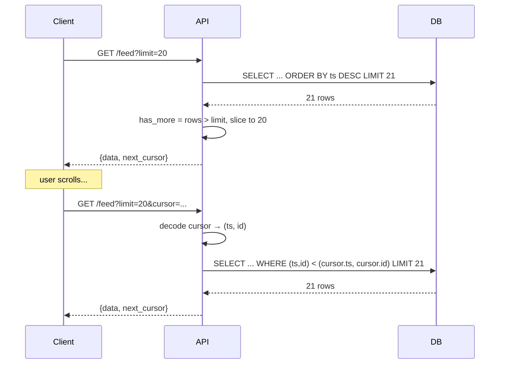
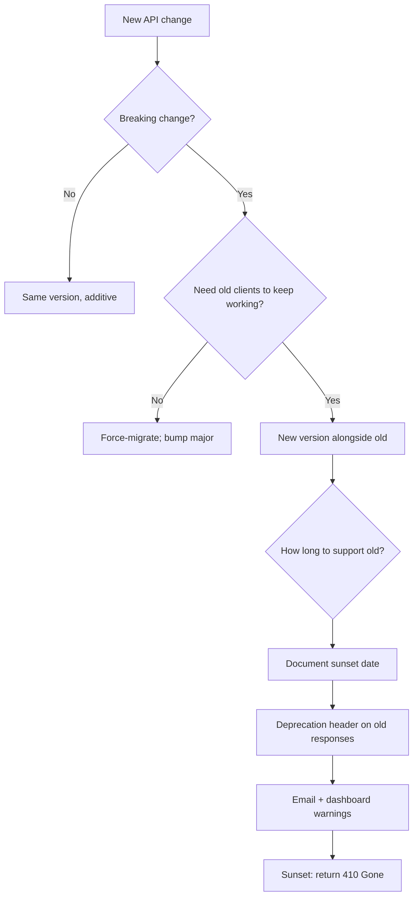
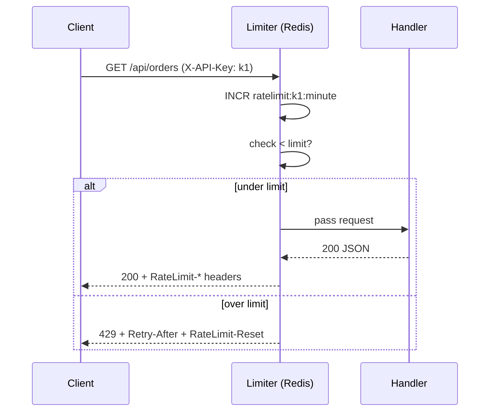
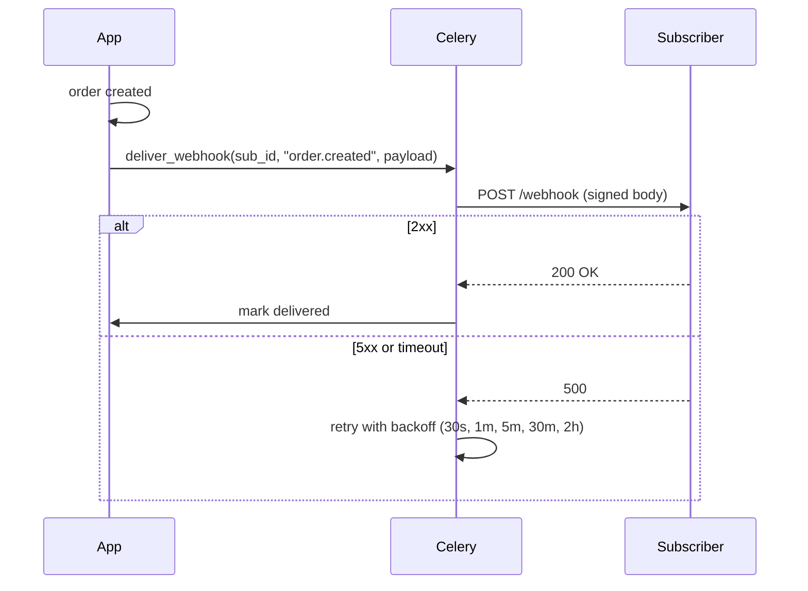
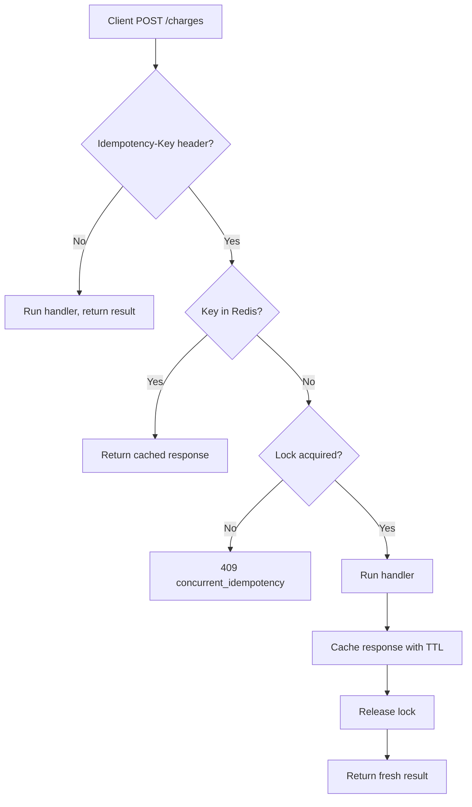
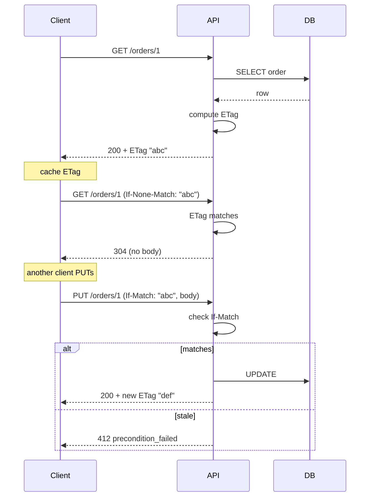
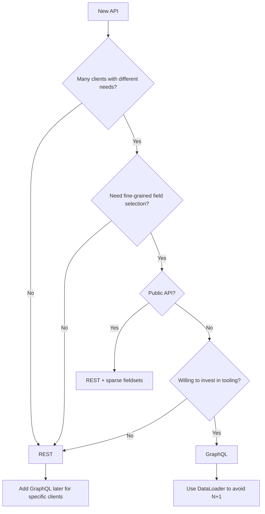

# API Design Cookbook

#flask #api #rest #graphql #cookbook #recipes #design

> [!info] Battle-tested recipes for HTTP APIs in Flask
> This cookbook answers the questions that come up in every API design review: "how should we paginate?", "where does the version go?", "what does a 429 look like?", "do we need GraphQL?" Each recipe is a complete pattern with code, a diagram, and the tradeoffs. Skip to the [Recipe Index](#recipe-index) if you know what you need.

---

## Recipe Index

| # | Recipe | Concern | Complexity |
|---|--------|---------|------------|
| 1 | [Resource naming conventions](#recipe-1-resource-naming-conventions) | URL design | Low |
| 2 | [Pagination](#recipe-2-pagination-offset-cursor-keyset) | Collections | Medium |
| 3 | [Filtering and sorting](#recipe-3-filtering-and-sorting) | Collections | Medium |
| 4 | [Sparse fieldsets](#recipe-4-sparse-fieldsets) | Payload size | Low |
| 5 | [Versioning strategies](#recipe-5-versioning-strategies) | Backward compat | Medium |
| 6 | [Rate limiting tiers](#recipe-6-rate-limiting-tiers) | Reliability | Medium |
| 7 | [API key management](#recipe-7-api-key-management) | Auth | Medium |
| 8 | [Webhooks (outbound)](#recipe-8-webhooks-outbound) | Integration | Medium |
| 9 | [Idempotency keys](#recipe-9-idempotency-keys) | Reliability | Medium |
| 10 | [Bulk operations](#recipe-10-bulk-operations) | Throughput | Medium |
| 11 | [RFC 9457 Problem Details](#recipe-11-rfc-9457-problem-details) | Errors | Low |
| 12 | [HATEOAS links](#recipe-12-hateoas-links) | Discoverability | Medium |
| 13 | [ETag / conditional requests](#recipe-13-etag--conditional-requests) | Caching | Medium |
| 14 | [GraphQL vs REST decision](#recipe-14-graphql-vs-rest-decision) | Architecture | High |

---

## API design principles

> [!abstract] The four properties of a good API
> 1. **Predictable** — clients can guess endpoints before reading docs.
> 2. **Forgiving** — errors tell them what to fix and how.
> 3. **Stable** — versions don't break; deprecations have a runway.
> 4. **Observable** — every request is traceable end-to-end.

If a recipe here doesn't serve one of these, it doesn't go in.

---

## Recipe 1: Resource naming conventions

> [!summary] Nouns over verbs, plural collections, predictable sub-resources
> A REST URL is a path through a graph of resources. Use plural nouns, lowercase, hyphen-separated, and let HTTP methods express the verb.

### The rules

| Rule | Good | Bad |
|------|------|-----|
| Plural nouns | `GET /users` | `GET /user` |
| No verbs in URL | `POST /orders` | `POST /createOrder` |
| Hyphen-case | `/order-items` | `/orderItems` or `/order_items` |
| IDs in path | `/users/42` | `/users?id=42` |
| Sub-resources | `/users/42/orders` | `/getUserOrders?user=42` |
| Query for filters | `/orders?status=paid` | `/paid-orders` |
| Stable IDs | `/orders/ord_7f3a` | `/orders/42` (collision risk) |

### HTTP method mapping

| Method | URL | Semantics | Idempotent? | Safe? |
|--------|-----|-----------|-------------|-------|
| GET | `/orders` | List | ✓ | ✓ |
| GET | `/orders/{id}` | Read one | ✓ | ✓ |
| POST | `/orders` | Create (id assigned by server) | ✗ | ✗ |
| PUT | `/orders/{id}` | Replace whole resource | ✓ | ✗ |
| PATCH | `/orders/{id}` | Partial update | ✗ | ✗ |
| DELETE | `/orders/{id}` | Remove | ✓ | ✗ |

> [!warning] Common mistakes
> 1. **Verbs in URLs** — `/getUser/42` says *how*; REST says *what*. Use `GET /users/42`.
> 2. **Singular for collections** — pick plural and stick with it; mix-and-match is the top source of 404s.
> 3. **Exposing DB IDs** — if `id=42` is a Postgres `SERIAL`, attackers can enumerate. Use opaque IDs (`ord_7f3a...`).

---

## Recipe 2: Pagination (offset, cursor, keyset)

> [!summary] The three strategies and when to use each
> Pagination prevents unbounded result sets from killing your DB and your clients. Each strategy has a sweet spot.

### Comparison

| Strategy | Pros | Cons | Use when |
|----------|------|------|----------|
| **Offset** | Simple, random access | O(n) skip, drift on inserts | Admin UIs, small tables |
| **Cursor** | Stable under inserts, O(1) | No random access, opaque | Infinite scroll, feeds |
| **Keyset** | Stable, index-friendly, debuggable | Requires a unique sort column | Timeseries, ordered lists |

### Offset pagination

```python
from flask import Flask, request, jsonify

app = Flask(__name__)

@app.get("/api/orders")
def list_orders():
    page = max(1, request.args.get("page", default=1, type=int))
    per_page = min(100, request.args.get("per_page", default=20, type=int))
    offset = (page - 1) * per_page

    q = Order.query
    total = q.count()
    items = q.order_by(Order.id).offset(offset).limit(per_page).all()

    return jsonify({
        "data": [o.to_dict() for o in items],
        "pagination": {
            "page": page,
            "per_page": per_page,
            "total": total,
            "total_pages": (total + per_page - 1) // per_page,
        },
    })
```

### Cursor pagination

```python
import base64, json
from flask import Flask, request, jsonify

app = Flask(__name__)

def encode_cursor(created_at, id_):
    raw = json.dumps({"ts": created_at.isoformat(), "id": id_}).encode()
    return base64.urlsafe_b64encode(raw).decode()

def decode_cursor(s):
    return json.loads(base64.urlsafe_b64decode(s.encode()))

@app.get("/api/feed")
def feed():
    limit = min(50, request.args.get("limit", default=20, type=int))
    q = Post.query
    cursor = request.args.get("cursor")
    if cursor:
        c = decode_cursor(cursor)
        q = q.filter((Post.created_at, Post.id) < (c["ts"], c["id"]))
    items = q.order_by(Post.created_at.desc(), Post.id.desc()).limit(limit + 1).all()
    has_more = len(items) > limit
    items = items[:limit]
    next_cursor = encode_cursor(items[-1].created_at, items[-1].id) if has_more else None
    return jsonify({
        "data": [p.to_dict() for p in items],
        "next_cursor": next_cursor,
    })
```

### Pagination flow



> [!warning] Common mistakes
> 1. **`OFFSET 100000`** — Postgres still scans 100k rows to skip them. Switch to cursor/keyset.
> 2. **Returning `total` for cursor pagination** — expensive `COUNT(*)` and meaningless if data shifts. Return `has_more` only.
> 3. **Inconsistent sort across pages** — sort by `(created_at, id)`, never by `created_at` alone (ties cause duplicates/omissions).

---

## Recipe 3: Filtering and sorting

> [!summary] Predictable query params that don't become a security hole
> Filter with `?field=value`, sort with `?sort=field` or `?sort=-field` for descending. Validate every field against a whitelist.

### Implementation

```python
from flask import Flask, request, jsonify
from sqlalchemy import or_

app = Flask(__name__)

ALLOWED_FILTERS = {
    "status": lambda q, v: q.filter(Order.status == v),
    "customer_id": lambda q, v: q.filter(Order.customer_id == int(v)),
    "min_total": lambda q, v: q.filter(Order.total >= float(v)),
    "max_total": lambda q, v: q.filter(Order.total <= float(v)),
    "q": lambda q, v: or_(Order.number.ilike(f"%{v}%"),
                          Order.notes.ilike(f"%{v}%")),
}
ALLOWED_SORTS = {"created_at", "total", "number", "updated_at"}

@app.get("/api/orders")
def list_orders():
    q = Order.query
    for key, value in request.args.items():
        if key in ("sort", "page", "per_page"):
            continue
        if key not in ALLOWED_FILTERS:
            return jsonify(error=f"unknown_filter:{key}"), 400
        try:
            q = ALLOWED_FILTERS[key](q, value)
        except (ValueError, TypeError) as e:
            return jsonify(error=f"invalid_value:{key}"), 400

    sort = request.args.get("sort", "created_at")
    for field in sort.split(","):
        desc = field.startswith("-")
        name = field.lstrip("-+")
        if name not in ALLOWED_SORTS:
            return jsonify(error=f"unknown_sort:{name}"), 400
        col = getattr(Order, name)
        q = q.order_by(col.desc() if desc else col.asc())

    page = max(1, request.args.get("page", default=1, type=int))
    per_page = min(100, request.args.get("per_page", default=20, type=int))
    pag = q.paginate(page=page, per_page=per_page)
    return jsonify({
        "data": [o.to_dict() for o in pag.items],
        "pagination": {"page": page, "per_page": per_page,
                       "total": pag.total, "total_pages": pag.pages},
    })
```

### Variations

- **JSON:API filter syntax** — `?filter[status]=paid&filter[total][gte]=100`. More verbose but expressive.
- **Full-text search** — `?q=laptop` → Postgres `tsvector` or `pg_trgm`. Don't `ILIKE %q%` on large tables.
- **Date ranges** — `?created_after=2024-01-01&created_before=2024-02-01` (inclusive vs. exclusive — document clearly).

> [!warning] Common mistakes
> 1. **Allowing arbitrary filter fields** — `?password__startswith=a` style attacks. Whitelist.
> 2. **No sort whitelist** — `?sort=password_hash` lets attackers probe by ordering. Whitelist.
> 3. **Case sensitivity surprises** — `status=paid` vs `Paid`. Normalize on the server.

---

## Recipe 4: Sparse fieldsets

> [!summary] Let clients ask for only the fields they need
> `?fields=id,name,email` reduces payload size dramatically for mobile clients. Vital when a resource has 30+ fields.

### Implementation

```python
from flask import Flask, request, jsonify
from functools import wraps

app = Flask(__name__)

def sparse_fields(serializer):
    """Decorator that filters serializer output by ?fields=id,name."""
    @wraps(serializer)
    def wrapper(*args, **kwargs):
        result = serializer(*args, **kwargs)
        fields = request.args.get("fields")
        if not fields:
            return result
        wanted = set(fields.split(","))
        if isinstance(result, dict):
            return {k: v for k, v in result.items() if k in wanted}
        if isinstance(result, list):
            return [{k: v for k, v in item.items() if k in wanted} for item in result]
        return result
    return wrapper

@app.get("/api/users/<int:id>")
@sparse_fields
def get_user(id):
    user = User.query.get_or_404(id)
    return user.to_dict()  # full representation; decorator filters
```

### Variations

- **Per-type sparse fieldsets** (JSON:API) — `?fields[user]=name,email&fields[order]=number,total` for compound docs.
- **Default vs. expanded fields** — `?expand=customer` returns the nested customer object; without it, only `customer_id` is returned.
- **GraphQL** — sparse fieldsets are free; see Recipe 14.

> [!warning] Common mistakes
> 1. **Sparse fields breaking caching** — if the cache key is just the URL, `/users/1?fields=name` collides with `/users/1?fields=email`. Include query string in cache key.
> 2. **Allowing arbitrary fields** — `?fields=password_hash` should return 400. Validate against a public-fields set.

---

## Recipe 5: Versioning strategies

> [!summary] Where does the version live?
> Three common answers: in the URL, in a header, or in the Accept header. Each has tradeoffs.

### Comparison

| Strategy | Example | Pros | Cons |
|----------|---------|------|------|
| **URL** | `/api/v2/orders` | Explicit, cacheable, browser-friendly | "URLs should be forever" purists object |
| **Header** | `X-API-Version: 2` | Clean URLs | Invisible to clients/tools; harder to test in browser |
| **Accept** | `Accept: application/vnd.acme.v2+json` | RESTful, content-negotiation-friendly | Verbose; unintuitive for newcomers |

### Implementation: URL versioning with blueprints

```python
from flask import Flask, Blueprint

app = Flask(__name__)

# v1 — frozen, will be sunset 2025-06-01
v1 = Blueprint("api_v1", __name__, url_prefix="/api/v1")

@v1.get("/orders/<int:id>")
def v1_get_order(id):
    order = Order.query.get_or_404(id)
    return {"id": order.id, "total_cents": order.total_cents}  # legacy field name

# v2 — current
v2 = Blueprint("api_v2", __name__, url_prefix="/api/v2")

@v2.get("/orders/<int:id>")
def v2_get_order(id):
    order = Order.query.get_or_404(id)
    return {"id": order.id, "total": {"amount": order.total_cents / 100,
                                       "currency": "USD"}}

app.register_blueprint(v1)
app.register_blueprint(v2)
```

### Implementation: Accept header versioning

```python
from flask import Flask, request, jsonify, abort

app = Flask(__name__)

@app.get("/api/orders/<int:id>")
def get_order(id):
    accept = request.headers.get("Accept", "")
    if "vnd.acme.v2" in accept:
        return jsonify(version="v2", payload={...})
    elif "vnd.acme.v1" in accept or "*/*" in accept:
        return jsonify(version="v1", payload={...})
    abort(415, description="Unsupported API version")
```

### Versioning decision tree



> [!warning] Common mistakes
> 1. **Versioning for additive changes** — adding a field or endpoint is backward-compatible; no version bump needed.
> 2. **No sunset policy** — supporting v1 forever becomes a maintenance nightmare. Set a date, communicate, sunset.
> 3. **Mixing strategies** — pick one (URL is most common) and stick with it across all routes.

---

## Recipe 6: Rate limiting tiers

> [!summary] Different limits for different clients
> Anonymous requests get a low shared limit; authenticated requests get a higher per-key limit; partners get a custom tier. Communicate the limits via response headers.

### Implementation

```python
from flask import Flask, request, jsonify, g
from flask_limiter import Limiter
from flask_limiter.util import get_remote_address
import redis

app = Flask(__name__)
r = redis.Redis(decode_responses=True)
limiter = Limiter(app, key_func=get_remote_address)

TIERS = {
    "anonymous": {"limit": "60/minute", "burst": "10/second"},
    "free":      {"limit": "300/minute", "burst": "30/second"},
    "paid":      {"limit": "3000/minute", "burst": "100/second"},
    "partner":   {"limit": "10000/minute", "burst": "500/second"},
}

def resolve_tier():
    api_key = request.headers.get("X-API-Key")
    if not api_key:
        return "anonymous"
    tier = r.hget(f"apikey:{hash(api_key)}", "tier") or "free"
    return tier

def dynamic_limit():
    return TIERS[resolve_tier()]["limit"]

@app.before_request
def identify():
    g.tier = resolve_tier()

@app.get("/api/orders")
@limiter.limit(dynamic_limit)
def list_orders():
    return jsonify(data=[], tier=g.tier)

@limiter.request_filter
def health_bypass():
    return request.path == "/healthz"
```

### Communicating limits

```python
@limiter.headers
def rate_limit_headers(response):
    try:
        window = limiter.current_limit
        if window:
            response.headers["RateLimit-Limit"] = str(window.limit)
            response.headers["RateLimit-Remaining"] = str(window.remaining)
            response.headers["RateLimit-Reset"] = str(int(window.reset_at.timestamp()))
    except Exception:
        pass
    return response
```

### Rate-limit response flow



> [!warning] Common mistakes
> 1. **Limiting by IP only** — all users behind a corporate NAT share a limit. Authenticate and limit by key.
> 2. **No `Retry-After` header** — clients will retry immediately and make things worse.
> 3. **Bursting silently ignored** — without a burst limit, a single slow client can blow the minute budget in 1 second.

---

## Recipe 7: API key management

> [!summary] Issue, rotate, revoke
> API keys are an auth mechanism (see [[Authentication-Cookbook]] Recipe 4). This recipe covers the *management* half: how clients create, list, rotate, and revoke them through your API.

### Implementation

```python
import secrets, hashlib, uuid
from datetime import datetime, timedelta
from flask import Blueprint, request, jsonify, g
from flask_login import login_required, current_user

bp = Blueprint("api_keys", __name__, url_prefix="/api/keys")

def hash_key(raw):
    return hashlib.sha256(raw.encode()).hexdigest()

def generate_key(prefix="sk_live_"):
    raw = prefix + secrets.token_urlsafe(32)
    return raw, hash_key(raw)

@bp.post("")
@login_required
def create_key():
    name = request.json.get("name")
    scopes = request.json.get("scopes", [])
    expires_in_days = request.json.get("expires_in_days")
    raw, h = generate_key()
    ApiKey.objects.create(
        id=uuid.uuid4(),
        user_id=current_user.id,
        name=name,
        key_hash=h,
        scopes=scopes,
        expires_at=datetime.utcnow() + timedelta(days=expires_in_days)
                    if expires_in_days else None,
    )
    # Return the raw value ONCE
    return jsonify(id=str(...), key=raw, name=name, scopes=scopes), 201

@bp.get("")
@login_required
def list_keys():
    keys = ApiKey.objects.filter(user_id=current_user.id)
    return jsonify(data=[{
        "id": str(k.id), "name": k.name, "scopes": k.scopes,
        "created_at": k.created_at, "last_used_at": k.last_used_at,
        "expires_at": k.expires_at,
        # NEVER include key_hash or the raw key
    } for k in keys])

@bp.post("/<key_id>/rotate")
@login_required
def rotate_key(key_id):
    k = ApiKey.objects.get(id=key_id, user_id=current_user.id)
    raw, h = generate_key()
    k.key_hash = h
    k.save()
    return jsonify(key=raw)  # new key, shown once

@bp.delete("/<key_id>")
@login_required
def revoke_key(key_id):
    ApiKey.objects.filter(id=key_id, user_id=current_user.id).delete()
    return "", 204
```

### Variations

- **Two-key rotation** — allow two active keys per user so they can rotate without downtime.
- **Scope-limited keys** — `scopes: ["read:orders"]` enforced by an auth decorator.
- **IP allowlist** — store `allowed_ips` per key; reject calls from other IPs.

> [!warning] Common mistakes
> 1. **Returning the raw key on list** — even once is a leak. Show it only on creation.
> 2. **No `last_used_at` tracking** — clients can't tell which keys are dead; you can't sweep them.
> 3. **No expiry** — keys live forever; require expiry ≤1 year, force rotation.

---

## Recipe 8: Webhooks (outbound)

> [!summary] Notify external systems of events
> When something happens in your app (order.paid, user.created), POST to subscriber URLs. Sign the payload so subscribers can verify authenticity.

### Implementation

```python
import hmac, hashlib, json, time
import requests
from celery import shared_task
from flask import Flask, request, jsonify

app = Flask(__name__)

def sign_payload(secret, body, timestamp):
    payload = f"{timestamp}.{body}".encode()
    return hmac.new(secret.encode(), payload, hashlib.sha256).hexdigest()

@shared_task(bind=True, max_retries=5, default_retry_delay=30)
def deliver_webhook(self, subscription_id, event_type, payload):
    sub = WebhookSubscription.objects.get(id=subscription_id)
    body = json.dumps({"event": event_type, "data": payload})
    timestamp = str(int(time.time()))
    sig = sign_payload(sub.secret, body, timestamp)
    headers = {
        "Content-Type": "application/json",
        "X-Webhook-Event": event_type,
        "X-Webhook-Signature": f"sha256={sig}",
        "X-Webhook-Timestamp": timestamp,
    }
    try:
        r = requests.post(sub.url, data=body, headers=headers, timeout=10)
        r.raise_for_status()
    except requests.RequestException as e:
        # Exponential backoff via Celery
        raise self.retry(exc=e)

def emit_event(event_type, payload):
    """Call from anywhere in your code to fan out webhooks."""
    subs = WebhookSubscription.objects.filter(events__contains=[event_type], active=True)
    for sub in subs:
        WebhookDelivery.objects.create(
            subscription=sub, event=event_type, payload=payload,
        )
        deliver_webhook.delay(sub.id, event_type, payload)

# Trigger example
@app.post("/api/orders")
def create_order():
    order = create(...)
    emit_event("order.created", {"id": order.id, "total": order.total})
    return jsonify(order.to_dict()), 201
```

### Webhook delivery flow



### Variations

- **At-least-once delivery** — subscribers must be idempotent (use event IDs); Celery may redeliver.
- **Replay API** — `POST /webhooks/{id}/replay` so subscribers can request missed events.
- **Dead-letter queue** — after max retries, move to DLQ and notify the subscriber via email.

> [!warning] Common mistakes
> 1. **No signature** — attackers can POST fake events to subscribers. Always sign.
> 2. **Synchronous delivery** — blocks the request that triggered the event. Always async via queue.
> 3. **No timestamp validation** — subscribers should reject timestamps >5 min old to prevent replay.

---

## Recipe 9: Idempotency keys

> [!summary] Safe retries for non-idempotent operations
> A client sends `Idempotency-Key: <uuid>` with a POST. If the server has seen that key, it returns the original response instead of executing again. Critical for payments and any "create" endpoint.

### Implementation

```python
import uuid, json
from flask import Flask, request, jsonify
import redis

app = Flask(__name__)
r = redis.Redis(decode_responses=True)

def idempotent(ttl_seconds=86400):
    from functools import wraps
    def decorator(f):
        @wraps(f)
        def wrapper(*args, **kwargs):
            key = request.headers.get("Idempotency-Key")
            if not key:
                return f(*args, **kwargs)
            redis_key = f"idem:{current_user.id}:{key}"
            cached = r.get(redis_key)
            if cached:
                state = json.loads(cached)
                return jsonify(state["body"]), state["status"]
            # Claim the key to prevent concurrent dupes
            if not r.set(f"{redis_key}:lock", "1", nx=True, ex=60):
                return jsonify(error="concurrent_idempotency"), 409
            try:
                resp = f(*args, **kwargs)
                body, status = resp
                r.setex(redis_key, ttl_seconds,
                        json.dumps({"body": body, "status": status}))
                return resp
            finally:
                r.delete(f"{redis_key}:lock")
        return wrapper
    return decorator

@app.post("/api/charges")
@idempotent()
def create_charge():
    amount = request.json["amount"]
    charge = stripe.charges.create(amount=amount, ...)
    return {"id": charge.id, "amount": amount}, 201
```

### Idempotency flow



> [!warning] Common mistakes
> 1. **Key scoped globally** — different users with the same key collide. Scope by user.
> 2. **No TTL** — Redis grows forever. 24h is the Stripe default.
> 3. **Caching errors** — don't cache 4xx validation errors; only cache 2xx. Caching 500s traps clients in failure.

---

## Recipe 10: Bulk operations

> [!summary] Process many resources in one request
> For ETL-style integrations, sending 1000 individual requests is wasteful. A bulk endpoint accepts an array and returns an array of results.

### Implementation

```python
from flask import Flask, request, jsonify
from marshmallow import Schema, fields, ValidationError

app = Flask(__name__)

class OrderCreateSchema(Schema):
    customer_id = fields.Int(required=True)
    total = fields.Decimal(required=True, as_string=True)

@app.post("/api/orders/bulk")
def bulk_create():
    payload = request.json
    if not isinstance(payload, list) or len(payload) > 100:
        return jsonify(error="invalid_bulk_payload"), 400
    schema = OrderCreateSchema()
    results = []
    for index, item in enumerate(payload):
        try:
            data = schema.load(item)
            order = Order.create(**data)
            results.append({"index": index, "status": 201, "id": order.id})
        except ValidationError as e:
            results.append({"index": index, "status": 422, "errors": e.messages})
    # 207 Multi-Status — partial success
    overall_status = 207 if any(r["status"] >= 400 for r in results) else 201
    return jsonify(data=results), overall_status
```

### Variations

- **Bulk via PATCH** — `PATCH /orders/bulk` with `[{id: 1, status: paid}, {id: 2, status: shipped}]`.
- **JSON Patch (RFC 6902)** — `PATCH /orders/1` with `[{op: replace, path: /status, value: paid}]`.
- **Bulk delete** — `DELETE /orders?filter[status]=cancelled` with a confirmation token.

> [!warning] Common mistakes
> 1. **No max batch size** — clients send 100k items and OOM the worker. Cap at 100.
> 2. **All-or-nothing semantics** — fine for atomic operations, but most bulk APIs want partial success with per-item status.
> 3. **Synchronous only** — for >100 items, accept the batch, return 202 with a job ID, process in Celery.

---

## Recipe 11: RFC 9457 Problem Details

> [!summary] Standardized error responses
> [RFC 9457](https://www.rfc-editor.org/rfc/rfc9457) defines a JSON shape for HTTP errors: `type`, `title`, `status`, `detail`, `instance`. Clients can write a single error parser instead of per-endpoint special cases.

### Implementation

```python
from flask import Flask, jsonify, abort, request
from werkzeug.exceptions import HTTPException

app = Flask(__name__)

def problem(type_, title, status, detail=None, instance=None, **extra):
    body = {
        "type": type_,
        "title": title,
        "status": status,
        "detail": detail,
        "instance": instance or request.path,
    }
    body.update(extra)
    return jsonify(body), status

@app.errorhandler(HTTPException)
def handle_http_error(e):
    return problem(
        type_=f"https://errors.example.com/{e.code}",
        title=e.name,
        status=e.code,
        detail=e.description,
    )

@app.errorhandler(ValidationError)
def handle_validation_error(e):
    return problem(
        type_="https://errors.example.com/validation",
        title="Validation failed",
        status=422,
        detail="One or more fields were invalid",
        errors=e.messages,
    )

# Usage in handlers
@app.post("/api/orders")
def create_order():
    if amount_invalid:
        return problem(
            type_="https://errors.example.com/invalid-amount",
            title="Invalid amount",
            status=422,
            detail="Amount must be a positive integer in cents",
            invalid_params=[{"name": "amount", "reason": "must_be_positive"}],
        )
```

### Example response

```json
{
  "type": "https://errors.example.com/validation",
  "title": "Validation failed",
  "status": 422,
  "detail": "One or more fields were invalid",
  "instance": "/api/orders",
  "errors": {
    "email": ["Not a valid email address."],
    "total": ["Field is required."]
  }
}
```

> [!warning] Common mistakes
> 1. **Vague `detail`** — "Bad request" tells the client nothing. Be specific: "Email format invalid; expected user@domain.tld".
> 2. **Stack traces in production** — `detail` should be user-facing; log traces server-side only.
> 3. **Different error shapes per endpoint** — clients give up and just check `status_code`. Pick one shape, use it everywhere.

---

## Recipe 12: HATEOAS links

> [!summary] Hypermedia as the engine of application state
> Each response includes links to related actions, so clients don't hardcode URLs. Strict REST, sometimes overkill, but useful for discoverability.

### Implementation

```python
from flask import Flask, jsonify, url_for

app = Flask(__name__)

def hal_links(order):
    return {
        "self": {"href": url_for("get_order", id=order.id, _external=True)},
        "customer": {"href": url_for("get_customer", id=order.customer_id, _external=True)},
        "cancel": {"href": url_for("cancel_order", id=order.id, _external=True),
                    "method": "POST"},
        "refund": {"href": url_for("refund_order", id=order.id, _external=True),
                    "method": "POST"},
    }

@app.get("/api/orders/<int:id>")
def get_order(id):
    order = Order.query.get_or_404(id)
    return jsonify({
        "id": order.id,
        "status": order.status,
        "total": order.total,
        "_links": hal_links(order),
    })
```

### Variations

- **JSON:API** — `_links` becomes `_relationships` with `links`, `data`, and `meta` blocks.
- **Siren** — includes `actions` with `fields`, more like a form.
- **Minimal links** — many APIs ship only `self` + `next` (pagination). Pragmatic middle ground.

> [!warning] Common mistakes
> 1. **Including links clients can't use** — `cancel` link on a delivered order is misleading. Conditionalize on state.
> 2. **Hardcoding link templates** — defeats the purpose; use `url_for` so changes propagate.
> 3. **Treating HATEOAS as security** — clients may still hardcode URLs. Validate permissions server-side regardless.

---

## Recipe 13: ETag / conditional requests

> [!summary] Cheap caching and concurrency control
> An ETag is a hash of the response body. Clients send `If-None-Match: <etag>`; if it matches, you return 304 with no body. For writes, `If-Match: <etag>` provides optimistic concurrency.

### Implementation

```python
import hashlib, json
from flask import Flask, request, jsonify, Response

app = Flask(__name__)

def etag_for(obj):
    payload = json.dumps(obj.to_dict(), sort_keys=True).encode()
    return '"' + hashlib.sha256(payload).hexdigest()[:16] + '"'

@app.get("/api/orders/<int:id>")
def get_order(id):
    order = Order.query.get_or_404(id)
    etag = etag_for(order)
    if request.headers.get("If-None-Match") == etag:
        return Response(status=304, headers={"ETag": etag})
    resp = jsonify(order.to_dict())
    resp.headers["ETag"] = etag
    return resp

@app.put("/api/orders/<int:id>")
def update_order(id):
    order = Order.query.get_or_404(id)
    expected = request.headers.get("If-Match")
    current = etag_for(order)
    if expected and expected != current:
        return jsonify(error="precondition_failed",
                       detail="Order was modified by another request"), 412
    # apply update...
    new_etag = etag_for(order)
    resp = jsonify(order.to_dict())
    resp.headers["ETag"] = new_etag
    return resp
```

### Conditional request flow



> [!warning] Common mistakes
> 1. **Weak ETags for mutable resources** — `W/"abc"` allows byte-equivalence but not semantic equivalence. Use strong ETags for PUT.
> 2. **No ETag on POST/PUT responses** — clients need the new ETag immediately to do subsequent GETs efficiently.
> 3. **Caching authenticated responses** — `Cache-Control: private` so CDNs don't leak user A's data to user B.

---

## Recipe 14: GraphQL vs REST decision

> [!summary] When to pick which
> GraphQL wins for client-driven shape selection; REST wins for caching, simplicity, and tooling maturity. Most teams should start with REST and add GraphQL only when there's a real need.

### Decision matrix

| Factor | REST | GraphQL |
|--------|------|---------|
| Caching | HTTP-native (ETag, CDN) | Complex (custom layer) |
| N+1 client queries | Common (round trips) | Solved (one query) |
| Versioning | URL/header versions | Schema evolution (deprecate fields) |
| Auth | Per-route middleware | Single endpoint, field-level resolvers |
| File uploads | Native multipart | Awkward (multipart spec extension) |
| Tooling maturity | Excellent | Good (Apollo, Graphene) |
| Learning curve | Low | Medium |
| Visibility | Logs per route | Single endpoint; need field-level logging |
| Public API | Industry standard | Niche adoption |

### GraphQL decision flow



### Implementation: GraphQL alongside REST

```python
# app.py
from flask import Flask
from flask_graphql import GraphQLView
from schema import schema

app = Flask(__name__)

# REST routes
@app.get("/api/orders/<int:id>")
def rest_get_order(id): ...

# GraphQL endpoint
app.add_url_rule(
    "/graphql",
    view_func=GraphQLView.as_view(
        "graphql",
        schema=schema,
        graphiql=True,  # enable IDE in dev
    ),
)
```

```python
# schema.py
import graphene
from graphene_sqlalchemy import SQLAlchemyObjectType
from models import Order as OrderModel

class Order(SQLAlchemyObjectType):
    class Meta:
        model = OrderModel

class Query(graphene.ObjectType):
    order = graphene.Field(Order, id=graphene.Int(required=True))
    orders = graphene.List(Order, status=graphene.String())

    def resolve_order(self, info, id):
        return OrderModel.query.get(id)

    def resolve_orders(self, info, status=None):
        q = OrderModel.query
        if status:
            q = q.filter(OrderModel.status == status)
        return q.all()

schema = graphene.Schema(query=Query)
```

### DataLoader for N+1 prevention

```python
from promise import Promise
from promise.dataloader import DataLoader

def batch_load_customers(customer_ids):
    rows = Customer.query.filter(Customer.id.in_(customer_ids)).all()
    by_id = {c.id: c for c in rows}
    return Promise.resolve([by_id.get(cid) for cid in customer_ids])

customer_loader = DataLoader(batch_load_customers)

def resolve_customer(order, info):
    return customer_loader.load(order.customer_id)
```

> [!warning] Common mistakes
> 1. **No query depth limit** — malicious clients send deeply nested queries; cap at 7 levels.
> 2. **No query cost analysis** — `cost(query) > 1000` returns 400. Otherwise a single query can do a table scan.
> 3. **Exposing internal schema** — `IntrospectionQuery` in production lets attackers map your data. Disable in prod or require auth.

---

## Cross-cutting concerns

### Request ID propagation

```python
import uuid
from flask import Flask, request, g

@app.before_request
def set_request_id():
    g.request_id = request.headers.get("X-Request-ID") or uuid.uuid4().hex

@app.after_request
def add_request_id_header(resp):
    resp.headers["X-Request-ID"] = g.request_id
    return resp
```

Logs, downstream calls, and error responses all carry the same ID. Essential for debugging distributed systems.

### CORS for APIs

```python
from flask_cors import CORS

app = Flask(__name__)
CORS(app, resources={
    r"/api/*": {
        "origins": ["https://app.example.com"],
        "supports_credentials": True,
        "allow_headers": ["Content-Type", "Authorization", "Idempotency-Key"],
        "expose_headers": ["RateLimit-Limit", "RateLimit-Remaining",
                           "RateLimit-Reset", "X-Request-ID"],
    },
})
```

See [[Flask-CORS]] for the full treatment.

### Documentation: OpenAPI

Use `apispec` to generate an OpenAPI spec from your Marshmallow schemas:

```python
from apispec import APISpec
from apispec.ext.marshmallow import MarshmallowPlugin

spec = APISpec(
    title="My API",
    version="2.0.0",
    openapi_version="3.0.3",
    plugins=[MarshmallowPlugin()],
    info={"description": "Internal API for the Mycorp platform."},
)
spec.components.schema("OrderCreate", schema=OrderCreateSchema)
```

Serve the spec at `/openapi.json` and Swagger UI at `/docs`. **The spec is the contract** — anything not in it doesn't exist.

---

## Related notes

- [[Flask-RESTful]] — resource class pattern for REST endpoints
- [[Flask-CORS]] — cross-origin config
- [[Flask-Limiter]] — rate-limiting implementation
- [[Marshmallow]] — serialization and validation
- [[Authentication-Cookbook]] — how auth plugs into API design
- [[File-Handling-Cookbook]] — multipart uploads and downloads
- [[Production-Readiness-Checklist]] — verifying your API in prod
- [[Security-Best-Practices]] — top-level API hardening

#flask #api #cookbook #patterns
