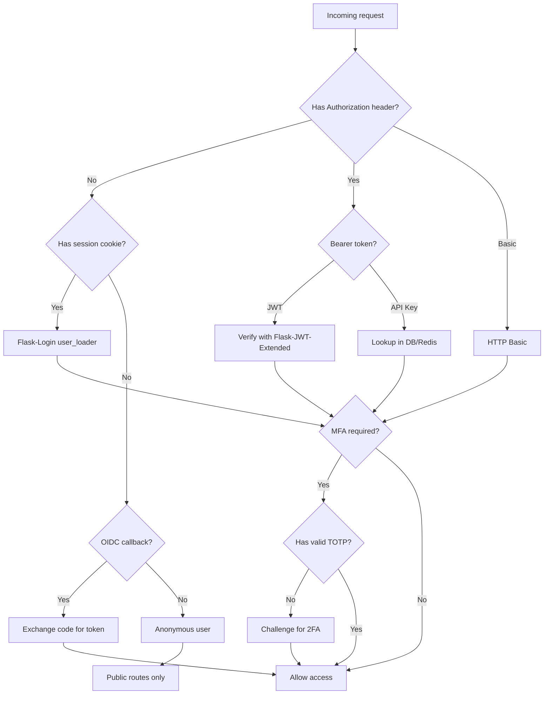
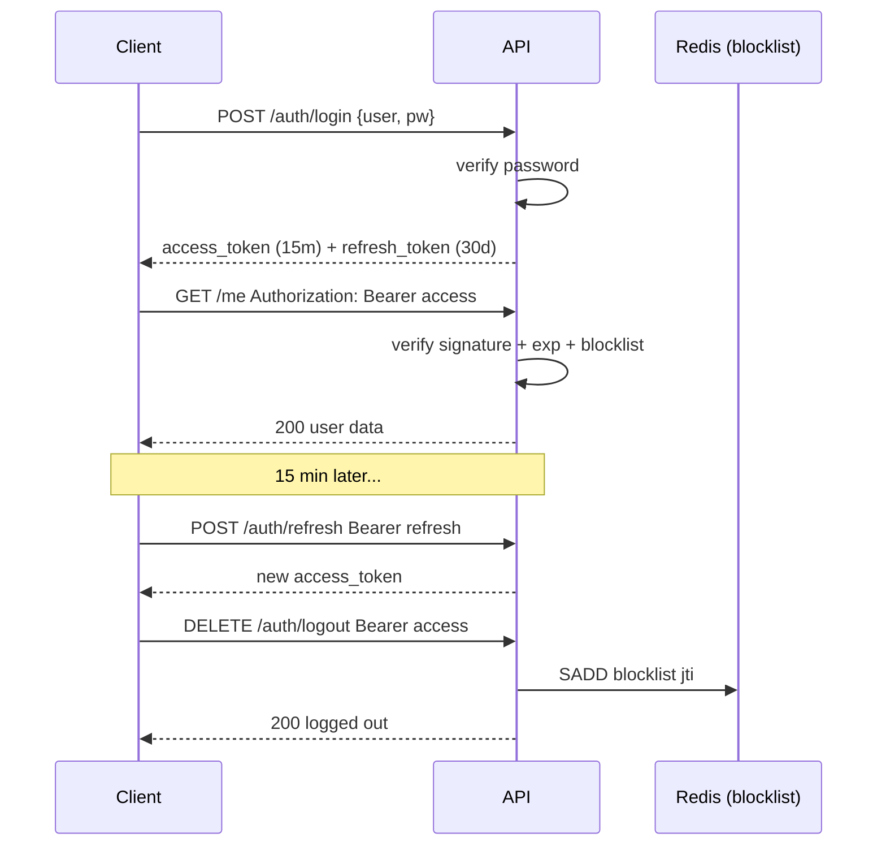
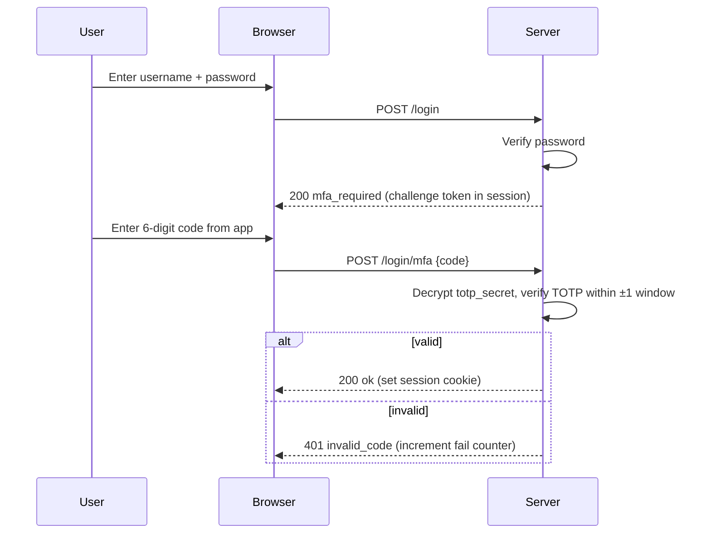
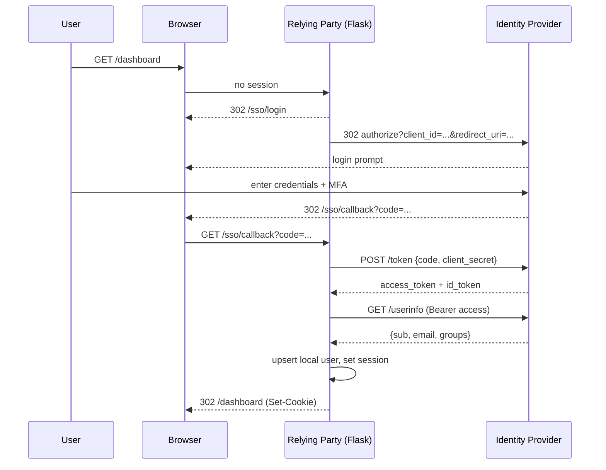
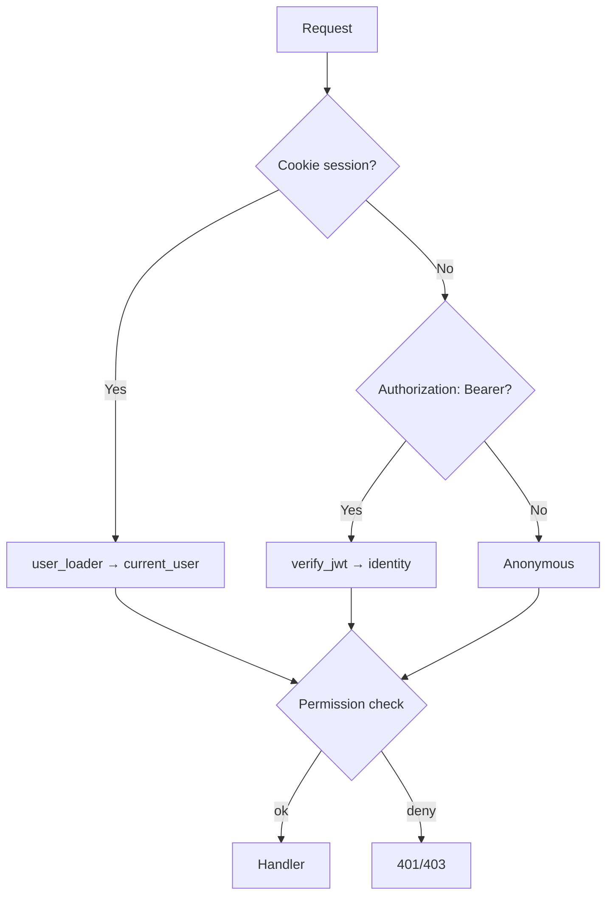

# Authentication Cookbook

#flask #authentication #cookbook #recipes #jwt #oauth #sessions #security

> [!info] A recipe box for every authentication scenario in Flask
> This cookbook collects copy-paste-ready authentication patterns for Flask applications. Each recipe is self-contained: when to use it, the minimal code, the variations, and the mistakes that bite you in production. Cross-reference the deep-dive notes in `03-Authentication/` and `12-Advanced-Auth/` for theory; this file is for the practitioner who needs to ship.

---

## Recipe Index

| # | Recipe | Best For | Statefulness | Complexity |
|---|--------|----------|--------------|------------|
| 1 | [Session auth with Flask-Login](#recipe-1-session-auth-with-flask-login) | Server-rendered HTML apps | Server-side session | Low |
| 2 | [JWT API auth with Flask-JWT-Extended](#recipe-2-jwt-api-auth-with-flask-jwt-extended) | Stateless APIs, mobile backends | Stateless token | Low |
| 3 | [OAuth2 login with Authlib](#recipe-3-oauth2-login-with-authlib) | "Login with Google/GitHub" | Hybrid | Medium |
| 4 | [API key authentication](#recipe-4-api-key-authentication) | Server-to-server, internal tools | Stateless key | Low |
| 5 | [Basic HTTP auth with Flask-HTTPAuth](#recipe-5-basic-http-auth) | Quick admin endpoints, dev tools | Stateless | Low |
| 6 | [TOTP multi-factor auth](#recipe-6-totp-multi-factor-auth) | High-value accounts | Session + OTP | Medium |
| 7 | [Magic link (passwordless)](#recipe-7-magic-link-passwordless-login) | Consumer SaaS, marketing sites | One-time token | Medium |
| 8 | [SSO with OIDC](#recipe-8-sso-with-oidc) | Enterprise, Okta/Keycloak | Hybrid | High |
| 9 | [Combined session + JWT](#recipe-9-combined-session--jwt-web--api) | Apps with both UI and API | Both | Medium |
| 10 | [Role-based access with Flask-Principal](#recipe-10-role-based-access-with-flask-principal) | Fine-grained permissions | Any | Medium |

---

## Choosing an Authentication Strategy



> [!tip] Don't pick one — pick a stack
> Most production apps end up with **three** of these simultaneously: session auth for the web UI, JWT for the mobile API, and OAuth for "Sign in with Google." Recipe 9 shows how to combine them without going insane.

---

## Recipe 1: Session auth with Flask-Login

> [!summary] The bread-and-butter pattern for HTML apps
> Use this when your app renders pages server-side and your users log in through a browser form. The session cookie carries a user ID; Flask-Login turns it into `current_user` on every request.

### When to use

- Server-rendered templates (Jinja2, HTMX).
- Single domain, browser-based users.
- You need "remember me" and CSRF-friendly logout.

### When NOT to use

- Pure JSON API consumed by mobile apps — use [[Flask-JWT-Extended]] (Recipe 2).
- Cross-domain SSO — use OIDC (Recipe 8).
- Embedded widgets on third-party sites — use scoped tokens.

### Implementation

```python
# app.py
from flask import Flask, redirect, request, url_for, render_template, flash
from flask_login import (
    LoginManager, UserMixin, login_user, logout_user,
    login_required, current_user,
)
from werkzeug.security import generate_password_hash, check_password_hash
from flask_wtf import FlaskForm
from wtforms import StringField, PasswordField, BooleanField
from wtforms.validators import DataRequired, Email

app = Flask(__name__)
app.secret_key = "change-me-in-production"
login_manager = LoginManager(app)
login_manager.login_view = "login"
login_manager.session_protection = "strong"

# --- Fake user store (swap for Flask-SQLAlchemy in real life) ---
class User(UserMixin):
    def __init__(self, id, email, password_hash, active=True):
        self.id = id
        self.email = email
        self.password_hash = password_hash
        self.active = active

USERS = {
    1: User(1, "alice@example.com", generate_password_hash("hunter2")),
}

@login_manager.user_loader
def load_user(user_id):
    return USERS.get(int(user_id))

# --- Login form ---
class LoginForm(FlaskForm):
    email = StringField("Email", validators=[DataRequired(), Email()])
    password = PasswordField("Password", validators=[DataRequired()])
    remember = BooleanField("Remember me")

@app.route("/login", methods=["GET", "POST"])
def login():
    form = LoginForm()
    if form.validate_on_submit():
        user = next((u for u in USERS.values() if u.email == form.email.data), None)
        if user and check_password_hash(user.password_hash, form.password.data):
            login_user(user, remember=form.remember.data)
            next_url = request.args.get("next")
            # Avoid open-redirect: only allow relative URLs
            if not next_url or not next_url.startswith("/"):
                next_url = url_for("dashboard")
            return redirect(next_url)
        flash("Invalid credentials")
    return render_template("login.html", form=form)

@app.route("/logout")
@login_required
def logout():
    logout_user()
    return redirect(url_for("login"))

@app.route("/dashboard")
@login_required
def dashboard():
    return f"Hello {current_user.email}"
```

### Variations

- **Remember-me cookie lifetime** — set `REMEMBER_COOKIE_DURATION = timedelta(days=30)`.
- **Session fixation** — call `session.regenerate()` or use `SESSION_PROTECTION = "strong"` to invalidate on IP/UA change.
- **Session in Redis** — combine with [[Flask-Session]] to share sessions across workers without sticky routing.

> [!warning] Common mistakes
> 1. **Open redirect via `next` parameter** — always validate it starts with `/` and doesn't start with `//`.
> 2. **Forgetting `app.secret_key`** — Flask will silently use a random key per restart, logging everyone out.
> 3. **Storing the password in the session** — Flask-Login stores the user ID, never credentials.
> 4. **No `@login_required` on sensitive routes** — easy to forget one route; consider a `before_request` hook instead.

---

## Recipe 2: JWT API auth with Flask-JWT-Extended

> [!summary] Stateless tokens for APIs
> The server signs a JWT on login; the client sends it as `Authorization: Bearer <token>` on every request. The server verifies the signature without a database lookup.

### When to use

- Mobile and SPA clients.
- Stateless, horizontally-scaled backends.
- Short-lived access + long-lived refresh tokens.

### Implementation

```python
from flask import Flask, jsonify, request
from flask_jwt_extended import (
    JWTManager, create_access_token, create_refresh_token,
    jwt_required, get_jwt_identity, get_jwt,
)
from datetime import timedelta
from werkzeug.security import check_password_hash

app = Flask(__name__)
app.config["JWT_SECRET_KEY"] = "super-secret-change-me"
app.config["JWT_ACCESS_TOKEN_EXPIRES"] = timedelta(minutes=15)
app.config["JWT_REFRESH_TOKEN_EXPIRES"] = timedelta(days=30)
app.config["JWT_TOKEN_LOCATION"] = ["headers"]
app.config["JWT_COOKIE_CSRF_PROTECT"] = False  # we use Authorization header
jwt = JWTManager(app)

USERS = {"alice": {"id": 1, "pw_hash": "argon2id$..."}}

@app.post("/auth/login")
def login():
    username = request.json.get("username")
    password = request.json.get("password")
    user = USERS.get(username)
    if not user or not check_password_hash(user["pw_hash"], password):
        return jsonify(msg="Bad credentials"), 401
    access = create_access_token(identity=username, additional_claims={"role": "admin"})
    refresh = create_refresh_token(identity=username)
    return jsonify(access_token=access, refresh_token=refresh)

@app.post("/auth/refresh")
@jwt_required(refresh=True)
def refresh():
    identity = get_jwt_identity()
    return jsonify(access_token=create_access_token(identity=identity))

@app.get("/me")
@jwt_required()
def me():
    claims = get_jwt()
    return jsonify(username=get_jwt_identity(), role=claims.get("role"))

# Blocklist for logout (stateful escape hatch)
BLOCKLIST = set()

@jwt.token_in_blocklist_loader
def check_blocklist(jwt_header, jwt_data):
    return jwt_data["jti"] in BLOCKLIST

@app.delete("/auth/logout")
@jwt_required()
def logout():
    jti = get_jwt()["jti"]
    BLOCKLIST.add(jti)
    return jsonify(msg="Logged out")
```

### Variations

- **Cookies instead of headers** — set `JWT_TOKEN_LOCATION = ["cookies"]` and `JWT_COOKIE_CSRF_PROTECT = True` for SPAs.
- **Per-route claims** — use `@jwt_required()` + custom decorator checking `additional_claims["role"]`.
- **Asymmetric signing (RS256)** — set `JWT_ALGORITHM = "RS256"` and `JWT_PUBLIC_KEY`/`JWT_PRIVATE_KEY` for microservice trust.



> [!warning] Common mistakes
> 1. **Long-lived access tokens** — keep access tokens ≤15 min; use refresh tokens for longevity.
> 2. **Storing JWT in localStorage** — vulnerable to XSS; prefer HttpOnly cookies with CSRF protection.
> 3. **Forgetting JWTs are un-revokable by default** — implement a blocklist (Redis) for logout/password change.
> 4. **Putting sensitive data in the payload** — JWTs are base64, not encrypted.

---

## Recipe 3: OAuth2 login with Authlib

> [!summary] "Sign in with Google/GitHub"
> Let an identity provider (IdP) authenticate the user; your app receives a token and creates or links a local user record.

### When to use

- Consumer apps where users already have Google/GitHub accounts.
- Reducing password-reset support load.
- Pulling social profile data (avatar, email, name).

### Implementation

```python
# oauth.py
from authlib.integrations.flask_client import OAuth
from flask import Flask, redirect, url_for, session, jsonify
from flask_login import login_user, current_user, logout_user

app = Flask(__name__)
app.secret_key = "dev"
oauth = OAuth(app)

oauth.register(
    name="github",
    client_id="Ov23li...",
    client_secret="YOUR_GITHUB_SECRET",
    access_token_url="https://github.com/login/oauth/access_token",
    authorize_url="https://github.com/login/oauth/authorize",
    api_base_url="https://api.github.com/",
    client_kwargs={"scope": "user:email"},
)

@app.route("/login/github")
def github_login():
    redirect_uri = url_for("github_authorize", _external=True)
    return oauth.github.authorize_redirect(redirect_uri)

@app.route("/login/github/authorize")
def github_authorize():
    token = oauth.github.authorize_access_token()
    resp = oauth.github.get("user", token=token)
    profile = resp.json()
    user = upsert_user_from_github(profile)  # your DB logic
    login_user(user)
    return redirect(url_for("dashboard"))

def upsert_user_from_github(profile):
    """Create or update a local user from a GitHub profile."""
    # pseudocode — wire to your Flask-SQLAlchemy models
    user = User.query.filter_by(oauth_id=f"github:{profile['id']}").first()
    if not user:
        user = User(email=profile["email"], oauth_id=f"github:{profile['id']}")
        db.session.add(user)
    user.username = profile["login"]
    user.avatar_url = profile["avatar_url"]
    db.session.commit()
    return user
```

### Variations

- **Multiple providers** — register each with `oauth.register("google", ...)`, route per provider.
- **OIDC instead of plain OAuth2** — add `userinfo_endpoint` and use `oauth.google.parse_id_token(token)`.
- **State parameter** — Authlib handles it automatically; never disable.
- **Account linking** — let a logged-in user link additional providers in settings.

> [!warning] Common mistakes
> 1. **Trusting the email claim without verification** — GitHub emails are verified, but a malicious IdP could return any. Check `email_verified: true` for OIDC.
> 2. **Forgetting to set `session.secret_key`** — Authlib stores state in the Flask session.
> 3. **Hardcoded redirect URI per environment** — use `url_for(..., _external=True)` so it follows your domain.
> 4. **No CSRF on the state param** — Authlib handles it; if you build your own, you must.

---

## Recipe 4: API key authentication

> [!summary] Static secrets for service-to-service
> A long-lived, per-client secret sent in a header or query param. The server looks it up in a fast store (Redis or DB indexed on the key hash).

### When to use

- Server-to-server integrations.
- Webhooks you publish to your users.
- Long-lived programmatic access where OAuth is overkill.

### Implementation

```python
import hashlib
import secrets
from functools import wraps
from flask import Flask, request, jsonify, g
import redis

app = Flask(__name__)
r = redis.Redis(decode_responses=True)

def generate_api_key():
    """Return (raw_key, key_hash). Store only the hash."""
    raw = "sk_live_" + secrets.token_urlsafe(32)
    h = hashlib.sha256(raw.encode()).hexdigest()
    return raw, h

def authenticate_api_key(f):
    @wraps(f)
    def wrapper(*args, **kwargs):
        raw = request.headers.get("X-API-Key")
        if not raw:
            return jsonify(error="missing_api_key"), 401
        h = hashlib.sha256(raw.encode()).hexdigest()
        owner = r.get(f"apikey:{h}")
        if not owner:
            return jsonify(error="invalid_api_key"), 401
        # rate limit per key
        if r.incr(f"ratelimit:{h}") == 1:
            r.expire(f"ratelimit:{h}", 60)
        if int(r.get(f"ratelimit:{h}")) > 100:
            return jsonify(error="rate_limited"), 429
        g.api_key_owner = owner
        g.api_key_hash = h
        return f(*args, **kwargs)
    return wrapper

@app.post("/api/v1/widgets")
@authenticate_api_key
def create_widget():
    return jsonify(owner=g.api_key_owner, widget="created")
```

### Variations

- **Prefix-based rotation** — `sk_live_` vs `sk_test_` so you can route by env.
- **Scopes** — store a JSON list of scopes alongside the key hash; check in decorator.
- **Expiring keys** — add a TTL and a `last_used_at` field updated on each request.

> [!warning] Common mistakes
> 1. **Storing raw keys in the DB** — hash them like passwords; only show the raw value once at creation.
> 2. **Putting the key in the URL** — it ends up in server logs, browser history, Referer headers. Use a header.
> 3. **No rotation path** — support two keys simultaneously so clients can rotate without downtime.

---

## Recipe 5: Basic HTTP auth

> [!summary] Quick and dirty protection
> The classic `Authorization: Basic base64(user:pass)` header. Flask-HTTPAuth wraps it with a clean decorator.

### When to use

- Protecting a single admin endpoint or staging site from casual access.
- Internal tools behind a VPN.
- Bootstrapping before a real auth system lands.

### Implementation

```python
from flask import Flask
from flask_httpauth import HTTPBasicAuth
from werkzeug.security import check_password_hash

app = Flask(__name__)
auth = HTTPBasicAuth()

USERS = {"admin": "argon2$..."}

@auth.verify_password
def verify_password(username, password):
    if username in USERS and check_password_hash(USERS[username], password):
        return username
    return None

@auth.error_handler
def unauthorized():
    return {"error": "unauthorized"}, 401

@app.route("/admin/healthz")
@auth.login_required
def healthz():
    return {"status": "ok", "user": auth.current_user()}
```

### Variations

- **Digest auth** — use `HTTPDigestAuth` to avoid sending the password in plaintext (still weaker than HTTPS + Basic).
- **Token auth via Basic** — username empty, password = API key. Convenient for `curl -u :token`.
- **Per-route users** — branch inside `verify_password` based on `request.path`.

> [!warning] Common mistakes
> 1. **Serving over HTTP** — Basic auth is plaintext; always wrap in HTTPS or use digest.
> 2. **Using it as your only auth** — browsers cache Basic credentials until closed, making logout impossible.
> 3. **No rate limit** — Basic is trivially brute-forced; pair with [[Flask-Limiter]].

---

## Recipe 6: TOTP multi-factor auth

> [!summary] Time-based one-time passwords (Google Authenticator)
> After a successful password check, require a 6-digit code from the user's authenticator app. The shared secret is stored encrypted at rest.

### When to use

- Any account with elevated privileges (admins, billing).
- Finance, healthcare, or other regulated industries.
- When users opt in for "extra security."

### Implementation

```python
import pyotp
from flask import Flask, request, jsonify, session
from werkzeug.security import generate_password_hash, check_password_hash
from cryptography.fernet import Fernet
import base64

app = Flask(__name__)
app.secret_key = "dev"
# In production: load from KMS or env, never commit
fernet = Fernet(Fernet.generate_key())

# Pseudocode user store
USERS = {}

@app.post("/mfa/setup")
def mfa_setup():
    """Returns a QR code URL the user scans with their authenticator."""
    secret = pyotp.random_base32()
    session["pending_totp_secret"] = secret  # commit only after verification
    user = "alice"
    uri = pyotp.totp.TOTP(secret).provisioning_uri(name=user, issuer_name="MyApp")
    return jsonify(secret=secret, otpauth_uri=uri)

@app.post("/mfa/verify")
def mfa_verify():
    secret = session.pop("pending_totp_secret", None)
    code = request.json.get("code")
    if not secret or not code:
        return jsonify(error="bad_request"), 400
    if not pyotp.TOTP(secret).verify(code, valid_window=1):
        return jsonify(error="invalid_code"), 401
    # Persist the secret encrypted
    USERS["alice"]["totp_secret"] = fernet.encrypt(secret.encode()).decode()
    return jsonify(status="enabled")

@app.post("/login")
def login_step1():
    """Verify password, then require step 2."""
    user = USERS.get(request.json.get("username"))
    if not user or not check_password_hash(user["pw_hash"], request.json.get("password")):
        return jsonify(error="bad_credentials"), 401
    if not user.get("totp_secret"):
        # No MFA — log in directly
        session["user_id"] = user["id"]
        return jsonify(status="ok")
    # MFA required — issue a short-lived challenge token
    session["mfa_pending_user"] = user["id"]
    return jsonify(status="mfa_required"), 200

@app.post("/login/mfa")
def login_step2():
    user_id = session.get("mfa_pending_user")
    if not user_id:
        return jsonify(error="no_pending_login"), 400
    user = USERS_by_id(user_id)
    secret = fernet.decrypt(user["totp_secret"].encode()).decode()
    if not pyotp.TOTP(secret).verify(request.json.get("code"), valid_window=1):
        return jsonify(error="invalid_code"), 401
    session.pop("mfa_pending_user")
    session["user_id"] = user_id
    return jsonify(status="ok")
```

### MFA login flow



### Variations

- **Backup codes** — generate 10 single-use codes at setup; hash and store.
- **WebAuthn / passkeys** — replace TOTP with hardware-backed credentials via `webauthn` lib.
- **Step-up auth** — require MFA only for sensitive actions (delete account, transfer funds).

> [!warning] Common mistakes
> 1. **`valid_window` too large** — `±1` (90s) is the maximum acceptable; larger defeats the purpose.
> 2. **Storing the TOTP secret in plaintext** — encrypt at rest with a key from a KMS, not from config.
> 3. **No recovery path** — lost phone = locked out; provide backup codes or admin reset.
> 4. **Locking MFA-protected accounts** — don't lock on TOTP failures alone (rate-limit instead), or attackers can lock users out.

---

## Recipe 7: Magic link (passwordless) login

> [!summary] Email-based one-time login tokens
> The user enters their email; you send a link with a signed token. Clicking it logs them in. No password ever stored.

### When to use

- Marketing landing pages where friction kills conversion.
- Apps where email is the only identity you need.
- Pairing with WebAuthn for fully passwordless UX.

### Implementation

```python
import secrets, time
from itsdangerous import URLSafeTimedSerializer, BadSignature, SignatureExpired
from flask import Flask, request, redirect, url_for, jsonify, render_template_string
from flask_login import LoginManager, login_user, UserMixin
import redis

app = Flask(__name__)
app.secret_key = "dev"
login_manager = LoginManager(app)
r = redis.Redis(decode_responses=True)

serializer = URLSafeTimedSerializer(app.secret_key, salt="magic-link")

@login_manager.user_loader
def load_user(user_id):
    # your user lookup
    ...

def issue_magic_link(email):
    token = serializer.dumps({"email": email, "nonce": secrets.token_urlsafe(16)})
    r.setex(f"magic:{token}", 600, email)  # 10 min TTL
    link = url_for("magic_verify", token=token, _external=True)
    send_email(email, "Your login link", f"Click: {link}")

@app.post("/auth/magic")
def magic_request():
    email = request.form.get("email")
    # Always return success so attackers can't enumerate accounts
    issue_magic_link(email)
    return jsonify(status="sent")

@app.get("/auth/magic/verify")
def magic_verify():
    token = request.args.get("token")
    if not token:
        return "Missing token", 400
    email = r.get(f"magic:{token}")
    if not email:
        return "Token expired or invalid", 401
    try:
        payload = serializer.loads(token, max_age=600)
    except (BadSignature, SignatureExpired):
        return "Token expired or invalid", 401
    r.delete(f"magic:{token}")  # one-time use
    user = upsert_user_by_email(email)
    login_user(user)
    return redirect(url_for("dashboard"))
```

### Variations

- **Bind to session** — store the browser fingerprint (IP+UA hash) in the token payload; reject mismatched IPs.
- **Magic link + WebAuthn** — link used only for first device enrollment; subsequent logins use passkeys.
- **Sliding tokens** — issue a refresh JWT once the magic link is consumed.

> [!warning] Common mistakes
> 1. **Reusing tokens** — always delete from Redis after use, or you've built a replay attack.
> 2. **No expiry** — 10 minutes max; magic links forwarded to attackers are a classic phish.
> 3. **Returning different responses for known vs. unknown emails** — enables enumeration; always say "sent."
> 4. **Logging the token** — strip it from access logs.

---

## Recipe 8: SSO with OIDC

> [!summary] Enterprise single sign-on
> Connect to Okta, Keycloak, Auth0, or Azure AD as a relying party. Users authenticate once at the IdP; all connected apps trust that session.

### When to use

- B2B SaaS where customers run their own IdP.
- Companies consolidating access across many internal tools.
- Required by procurement/security teams.

### Implementation (with Authlib)

```python
from authlib.integrations.flask_client import OAuth
from authlib.oidc.core import UserInfo
from flask import Flask, redirect, url_for, session, jsonify
from flask_login import login_user, current_user

app = Flask(__name__)
app.secret_key = "dev"
oauth = OAuth(app)

oauth.register(
    name="corp_idp",
    client_id="my-app-client-id",
    client_secret="...",
    server_metadata_url="https://idp.corp.example/.well-known/openid-configuration",
    client_kwargs={"scope": "openid email profile groups"},
)

@app.route("/sso/login")
def sso_login():
    redirect_uri = url_for("sso_callback", _external=True)
    return oauth.corp_idp.authorize_redirect(redirect_uri)

@app.route("/sso/callback")
def sso_callback():
    token = oauth.corp_idp.authorize_access_token()
    userinfo = oauth.corp_idp.parse_id_token(token)
    user = upsert_user_from_oidc(userinfo)
    # Enforce group membership from IdP claims
    if "engineering" not in userinfo.get("groups", []):
        return "Access denied", 403
    login_user(user)
    return redirect(url_for("dashboard"))

@app.route("/sso/logout")
def sso_logout():
    # RP-initiated logout — tell the IdP to end the session there too
    return redirect(
        "https://idp.corp.example/oidc/logout?"
        f"post_logout_redirect_uri={url_for('home', _external=True)}"
    )
```

### OIDC authorization-code flow



### Variations

- **SAML** — for older enterprise IdPs (ADFS, Shibboleth); use `python3-saml` or `pySAML2`. Conceptually identical to OIDC but XML-heavy.
- **Back-channel logout** — implement the OIDC back-channel logout endpoint so IdP logout propagates to your app without a redirect.
- **Multi-tenant** — store `tenant_id` per user and resolve the right IdP at login time.

> [!warning] Common mistakes
> 1. **Trust `email_verified: false`** — never create an account from an unverified email claim.
> 2. **Ignore `groups` claim drift** — group membership changes at the IdP; re-sync on each login.
> 3. **No id_token signature verification** — `parse_id_token` does it; never decode with `jwt.decode` and skip `verify_signature`.
> 4. **Hardcoded IdP URLs** — use `server_metadata_url` so IdP key rotation is automatic.

---

## Recipe 9: Combined session + JWT (web + API)

> [!summary] One codebase, two auth surfaces
> A web UI logs in via forms and uses session cookies; the mobile API uses JWT. Both share the same `User` model and permission logic.

### Implementation sketch

```python
from flask import Flask, request, jsonify
from flask_login import LoginManager, current_user, login_required
from flask_jwt_extended import JWTManager, jwt_required, get_jwt_identity

app = Flask(__name__)
app.config.update(
    SECRET_KEY="dev",
    JWT_SECRET_KEY="dev-jwt",
)
login_manager = LoginManager(app)
jwt = JWTManager(app)

# Shared permission helper
def require_role(role):
    def decorator(f):
        @wraps(f)
        def wrapper(*args, **kwargs):
            user = current_user if current_user.is_authenticated else None
            if user is None:
                # Fall back to JWT
                pass
            # (simplified — see below)
            ...
        return wrapper
    return decorator

# Web routes — session auth
@app.route("/dashboard")
@login_required
def dashboard():
    return render_template("dashboard.html", user=current_user)

# API routes — JWT auth
@app.route("/api/v1/me")
@jwt_required()
def api_me():
    return jsonify(username=get_jwt_identity())

# Routes that accept EITHER
from flask_login import current_user
from flask_jwt_extended import verify_jwt_in_request, get_jwt_identity

def dual_auth(f):
    @wraps(f)
    def wrapper(*args, **kwargs):
        if current_user.is_authenticated:
            return f(*args, **kwargs)
        try:
            verify_jwt_in_request()
            identity = get_jwt_identity()
            # hydrate current_user from identity
            ...
            return f(*args, **kwargs)
        except Exception:
            return jsonify(error="unauthorized"), 401
    return wrapper
```

### Decision tree



> [!warning] Common mistakes
> 1. **Different password hashes between web and API paths** — they share the User model; don't fork.
> 2. **Logging out only one channel** — invalidate both the session and the JWT blocklist on logout.
> 3. **CSRF exemption confusion** — JWT-in-cookie needs CSRF; JWT-in-header does not. Pick one per endpoint.

---

## Recipe 10: Role-based access with Flask-Principal

> [!summary] Fine-grained permissions
> Flask-Principal decouples *identity* (who) from *permissions* (what they can do). Define identities, needs, and protect endpoints with `Permission(...).require()`.

### Implementation

```python
from flask import Flask, jsonify
from flask_principal import (
    Principal, Permission, RoleNeed, UserNeed, identity_loaded,
    AnonymousIdentity, Identity, identity_changed,
)
from flask_login import LoginManager, current_user, login_user, logout_user

app = Flask(__name__)
app.secret_key = "dev"
principals = Principal(app)
login_manager = LoginManager(app)

# Define needs
admin_need = RoleNeed("admin")
editor_need = RoleNeed("editor")
read_reports_need = RoleNeed("read_reports")

admin_permission = Permission(admin_need)
editor_permission = Permission(editor_need)
reports_permission = Permission(read_reports_need)

@login_manager.user_loader
def load_user(id):
    return User.query.get(int(id))

@identity_loaded.connect_via(app)
def on_identity_loaded(sender, identity):
    if not isinstance(identity, AnonymousIdentity):
        identity.user = current_user
        identity.provides.add(UserNeed(current_user.id))
        for role in current_user.roles:
            identity.provides.add(RoleNeed(role.name))

@app.route("/login", methods=["POST"])
def login():
    user = authenticate(...)
    login_user(user)
    identity_changed.send(app, identity=Identity(user.id))
    return jsonify(status="ok")

@app.route("/logout")
def logout():
    logout_user()
    identity_changed.send(app, identity=AnonymousIdentity())
    return jsonify(status="ok")

@app.route("/admin/users")
@admin_permission.require(http_exception=403)
def admin_users():
    return jsonify(users=[...])

@app.route("/reports")
@reports_permission.require(http_exception=403)
def reports():
    return jsonify(report="...")
```

### Variations

- **Resource-level permissions** — subclass `Permission` and override `allows()` to check ownership.
- **Hierarchical roles** — `admin` implies `editor` implies `viewer`; expand in `on_identity_loaded`.
- **Database-driven permissions** — load `RoleNeed`s from a `roles` table at identity load time.

> [!warning] Common mistakes
> 1. **Confusing roles with permissions** — roles are stable labels (`admin`); permissions are verbs on resources (`edit:post:123`). One role can map to many permissions.
> 2. **Caching identity across requests** — Flask-Principal rebuilds the identity on each request via `identity_loaded`; don't stash it in module scope.
> 3. **No audit log for permission changes** — log every role grant/revoke; permission drift is a top audit finding.

---

## Cross-cutting concerns

### Rate limiting on auth endpoints

```python
from flask_limiter import Limiter
from flask_limiter.util import get_remote_address

limiter = Limiter(app, key_func=get_remote_address)

@app.post("/login")
@limiter.limit("10/minute;5/minute per ip")
def login(): ...
```

Always rate-limit `/login`, `/auth/refresh`, `/mfa/verify`, and password reset. See [[Flask-Limiter]] for full patterns.

### Audit logging

```python
import structlog
log = structlog.get_logger()

@app.post("/login")
def login():
    ...
    log.info("login.success", user_id=user.id, ip=request.remote_addr,
             user_agent=request.headers.get("User-Agent"))
```

Log every auth event with actor, action, target, IP, and timestamp. Forward to your SIEM.

### Password hashing

```python
# Use argon2-cffi for new projects
from argon2 import PasswordHasher
ph = PasswordHasher()
h = ph.hash("password")
ph.verify(h, "password")  # True
```

Prefer **argon2id** over bcrypt for new projects (OWASP recommendation). Werkzeug's `generate_password_hash` defaults to scrypt as of 2.3+.

---

## Decision matrix: which recipe for which app?

| App shape | Primary recipe | Companions |
|-----------|----------------|------------|
| Server-rendered SaaS | R1 Session | R6 MFA, R10 RBAC |
| Mobile app backend | R2 JWT | R4 API keys for partner integrations |
| Consumer app w/ social | R3 OAuth | R1 Session for fallback |
| Enterprise B2B | R8 OIDC | R10 RBAC, R6 MFA |
| Internal admin tool | R5 Basic | R10 RBAC |
| Server-to-server only | R4 API keys | — |
| Marketing + product | R7 Magic link | R1 Session after enrollment |
| Monorepo web + API | R9 Combined | R10 RBAC |

---

## Related notes

- [[Flask-Login]] — theory behind Recipe 1
- [[Flask-JWT-Extended]] — theory behind Recipe 2
- [[Flask-Authlib]] — theory behind Recipes 3 and 8
- [[Flask-Dance]] — alternative OAuth library, simpler API
- [[Flask-HTTPAuth]] — theory behind Recipe 5
- [[Flask-Principal]] — theory behind Recipe 10
- [[Flask-Session]] — Redis-backed sessions for Recipe 1
- [[Security-Best-Practices]] — top-level hardening
- [[API-Design-Cookbook]] — how auth plugs into API design
- [[Production-Readiness-Checklist]] — verifying auth in prod

#flask #authentication #cookbook #patterns
