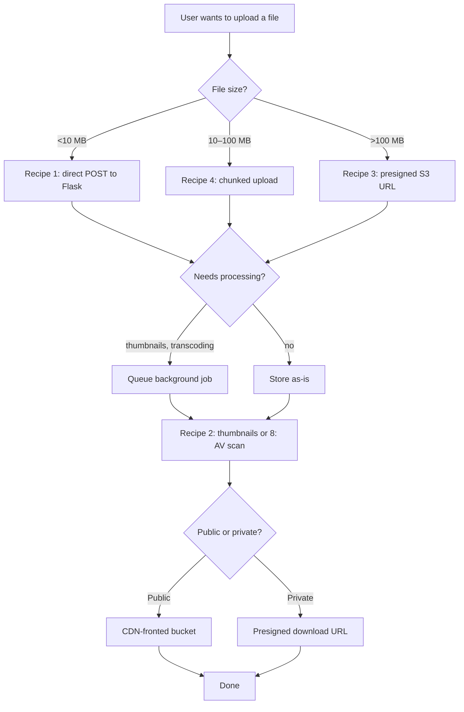
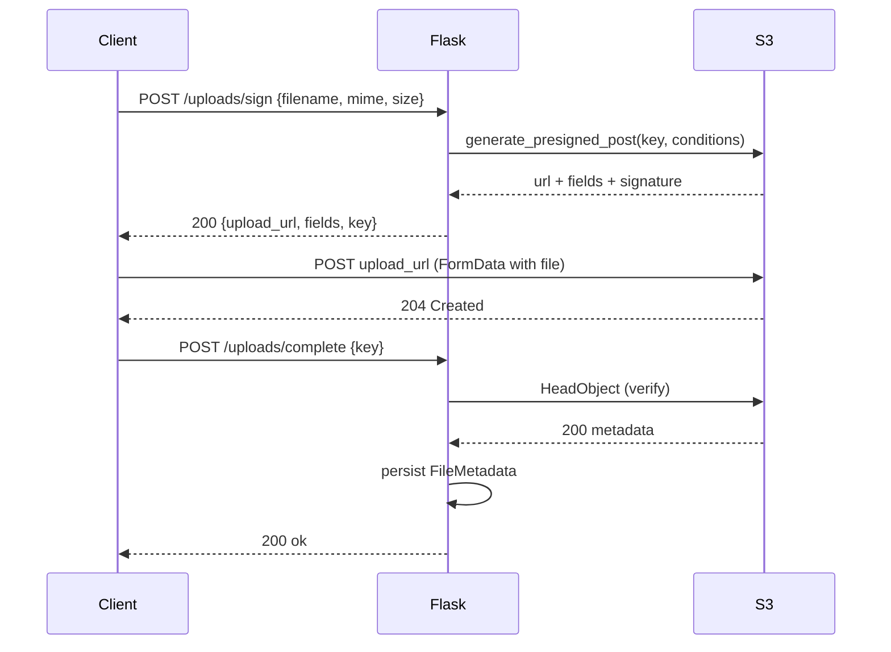
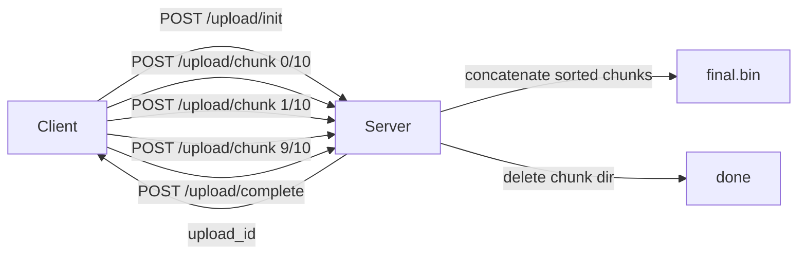
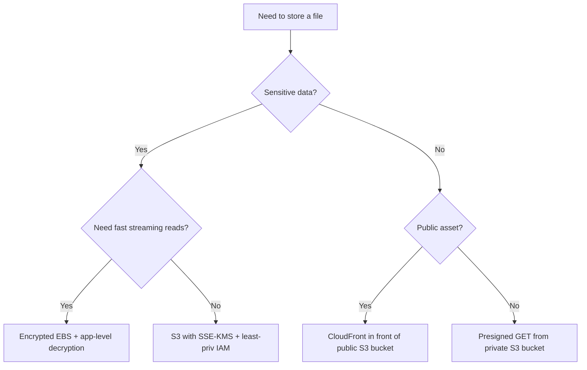

# File Handling Cookbook

#flask #file-handling #cookbook #recipes #upload #streaming

> [!info] Recipes for moving bytes safely in and out of Flask
> File handling looks deceptively easy — `request.files['x'].save(path)` — and then in production you discover 2 GB uploads, virus-laden PDFs, S3 presigned URLs, and range requests. This cookbook walks through every common file-handling pattern with copy-paste-ready code, variations, and the mistakes that turn a 5-line handler into a 4 a.m. incident.

---

## Recipe Index

| # | Recipe | Best For | Storage | Complexity |
|---|--------|----------|---------|------------|
| 1 | [Simple upload to disk](#recipe-1-simple-upload-to-disk) | Small files, single server | Local FS | Low |
| 2 | [Image upload with thumbnails](#recipe-2-image-upload-with-thumbnails) | User avatars, gallery apps | Local FS or S3 | Low |
| 3 | [Direct-to-S3 via presigned URLs](#recipe-3-direct-to-s3-via-presigned-urls) | Large files, mobile uploads | S3 | Medium |
| 4 | [Chunked upload](#recipe-4-chunked-upload) | 100 MB – 2 GB files | Any | Medium |
| 5 | [Resumable upload (tus)](#recipe-5-resumable-upload-tus-protocol) | Unreliable networks, huge files | Any | High |
| 6 | [File download with range support](#recipe-6-file-download-with-range-support) | Video, audio, large PDFs | Local FS or S3 | Medium |
| 7 | [Streaming to Azure/B2 backends](#recipe-7-streaming-upload-to-azureblob-or-backblaze) | Multi-cloud, archival | Azure / B2 | Medium |
| 8 | [Virus scanning with ClamAV](#recipe-8-virus-scanning-with-clamav) | User-uploaded docs | Any | Medium |
| 9 | [CSV/Excel import](#recipe-9-csvexcel-import-with-marshmallow) | Bulk data ingestion | In-memory | Medium |
| 10 | [PDF generation on the fly](#recipe-10-pdf-generation-on-the-fly) | Invoices, reports | Generated | Medium |

---

## Choosing a File Handling Strategy



> [!tip] The golden rule of uploads
> **Never buffer the whole file in memory.** Flask's `request.files['x']` is a `FileStorage` object backed by a `SpooledTemporaryFile`. Stream it to its final destination — disk, S3 multipart, or a chunked client — without ever calling `.read()` to grab all bytes. Anything else limits your concurrency to ~100 MB / worker of RAM.

---

## Recipe 1: Simple upload to disk

> [!summary] The 80% case
> A form POST with `enctype="multipart/form-data"`, validated extension and size, saved under a non-user-controlled filename.

### When to use

- Single-server apps (or with shared network storage).
- Files under ~10 MB.
- You control the server filesystem.

### Implementation

```python
import os, uuid, magic
from flask import Flask, request, jsonify, abort
from werkzeug.utils import secure_filename

app = Flask(__name__)
app.config["UPLOAD_DIR"] = "/var/app/uploads"
app.config["MAX_CONTENT_LENGTH"] = 10 * 1024 * 1024  # 10 MB
ALLOWED_MIME = {"image/png", "image/jpeg", "application/pdf"}

os.makedirs(app.config["UPLOAD_DIR"], exist_ok=True)

@app.post("/upload")
def upload():
    if "file" not in request.files:
        return jsonify(error="no_file"), 400
    f = request.files["file"]
    if not f.filename:
        return jsonify(error="empty_filename"), 400

    # 1. Validate MIME by content, not extension
    head = f.stream.read(2048)
    f.stream.seek(0)
    mime = magic.from_buffer(head, mime=True)
    if mime not in ALLOWED_MIME:
        return jsonify(error=f"unsupported_type_{mime}"), 415

    # 2. Generate a safe storage name — never trust client filename
    ext = {"image/png": ".png", "image/jpeg": ".jpg",
           "application/pdf": ".pdf"}[mime]
    stored_name = f"{uuid.uuid4().hex}{ext}"
    dest = os.path.join(app.config["UPLOAD_DIR"], stored_name)

    # 3. Stream-save
    f.save(dest)

    # 4. Persist metadata in DB (pseudocode)
    # FileMetadata.objects.create(
    #     id=stored_name, original_name=secure_filename(f.filename),
    #     mime=mime, size=os.path.getsize(dest), owner_id=current_user.id)

    return jsonify(id=stored_name, mime=mime)
```

### Variations

- **Sharded directories** — store under `ab/cd/<uuid>.png` (first 4 hex chars) to avoid 100k files in one dir, which slows `ls` and backups.
- **Atomic save** — write to `dest.tmp` then `os.rename` to avoid half-written files on crash.
- **Per-user quota** — track bytes in DB; check before saving.

> [!warning] Common mistakes
> 1. **Trusting the client filename** — `secure_filename` strips path separators but you should still never use it as the storage name; users can collide or supply `../../etc/passwd`.
> 2. **Validating by extension** — `evil.php.png` and renamed `.exe` sail past `str.endswith`. Always sniff with `python-magic`.
> 3. **No `MAX_CONTENT_LENGTH`** — without it, an attacker can exhaust disk by uploading a 1 TB sparse file.
> 4. **Serving uploads from the same dir as code** — a `app.py` upload becomes RCE. Serve from a separate domain or via a dedicated download route.

---

## Recipe 2: Image upload with thumbnails

> [!summary] Generate multiple sizes for avatars, gallery views, OpenGraph previews
> Pillow does the heavy lifting; we generate sizes synchronously for small files and via Celery for big batches.

### When to use

- User avatars, product images, social posts.
- You need responsive image sets (`srcset`).

### Implementation

```python
import io, os, uuid
from PIL import Image
from flask import Flask, request, jsonify

app = Flask(__name__)
app.config["UPLOAD_DIR"] = "/var/app/images"
SIZES = {"thumb": (128, 128), "small": (320, 240),
         "medium": (640, 480), "large": (1280, 960)}

@app.post("/images")
def upload_image():
    f = request.files["image"]
    img = Image.open(f.stream)
    img.load()  # force load before stream closes

    # Strip EXIF for privacy + rotate orientation
    from PIL.ImageOps import exif_transpose
    img = exif_transpose(img)
    img.info.pop("exif", None)

    # Convert palette/GIF to RGB for JPEG
    if img.mode != "RGB":
        img = img.convert("RGB")

    base = uuid.uuid4().hex
    os.makedirs(os.path.join(app.config["UPLOAD_DIR"], base))
    results = {}
    for label, (w, h) in SIZES.items():
        thumb = img.copy()
        thumb.thumbnail((w, h), Image.LANCZOS)
        path = os.path.join(app.config["UPLOAD_DIR"], base, f"{label}.jpg")
        thumb.save(path, "JPEG", quality=85, optimize=True, progressive=True)
        results[label] = f"/images/{base}/{label}.jpg"
    return jsonify(sizes=results)

@app.get("/images/<base>/<label>")
def serve_image(base, label):
    # In production: nginx serves these directly. Here for completeness.
    path = os.path.join(app.config["UPLOAD_DIR"], base, f"{label}.jpg")
    if not os.path.isfile(path):
        return "not found", 404
    return app.send_from_directory(os.path.dirname(path), os.path.basename(path))
```

### Variations

- **WebP/AVIF** — modern formats are 30 % smaller; detect `Accept` header and serve accordingly.
- **Blurhash placeholder** — generate a 20-char blurhash at upload time to render instant placeholders in the UI.
- **Background processing** — for >5 MB originals, save the original synchronously, queue a Celery task to generate sizes (see [[Celery]]).

> [!warning] Common mistakes
> 1. **Not stripping EXIF** — GPS coords in user-uploaded phone photos are a privacy lawsuit waiting.
> 2. **`Image.open()` without `.load()`** — Pillow is lazy; the file handle may close before pixels are decoded.
> 3. **No size cap on originals** — a 50 MP photo eats 600 MB of RAM during resize. Cap dimensions or pre-downscale.

---

## Recipe 3: Direct-to-S3 via presigned URLs

> [!summary] Let the browser upload straight to S3
> Your Flask server signs a URL; the browser PUTs the file directly to S3, bypassing your bandwidth and worker time entirely.

### When to use

- Files > 100 MB.
- Mobile clients on flaky networks (resumable via S3 multipart).
- You don't want to pay egress for files passing through your server.

### Implementation

```python
import boto3
from flask import Flask, jsonify, request
from botocore.client import Config

app = Flask(__name__)
app.config["S3_BUCKET"] = "my-uploads"
app.config["UPLOAD_TTL"] = 3600  # URL valid for 1 hour

s3 = boto3.client(
    "s3",
    region_name="us-east-1",
    config=Config(signature_version="s3v4"),
)

@app.post("/uploads/sign")
def sign_upload():
    filename = request.json.get("filename")
    mime = request.json.get("contentType")
    size = request.json.get("size")

    # Server-side policy constraints
    key = f"uploads/{uuid.uuid4().hex}/{filename}"
    conditions = [
        {"acl": "private"},
        ["content-length-range", 0, 500 * 1024 * 1024],  # ≤500 MB
        {"Content-Type": mime},
        {"key": key},
    ]
    fields = {"Content-Type": mime, "acl": "private"}
    presigned = s3.generate_presigned_post(
        Bucket=app.config["S3_BUCKET"],
        Key=key,
        Fields=fields,
        Conditions=conditions,
        ExpiresIn=app.config["UPLOAD_TTL"],
    )
    return jsonify(
        upload_url=presigned["url"],
        fields=presigned["fields"],
        key=key,
        expires_in=app.config["UPLOAD_TTL"],
    )

@app.post("/uploads/complete")
def upload_complete():
    """Client calls this after the PUT to S3 succeeds."""
    key = request.json.get("key")
    # Verify the object actually exists in S3
    head = s3.head_object(Bucket=app.config["S3_BUCKET"], Key=key)
    # Persist metadata
    # FileMetadata.objects.create(
    #     s3_key=key, size=head["ContentLength"], mime=head["ContentType"],
    #     owner_id=current_user.id)
    return jsonify(status="ok", size=head["ContentLength"])
```

### Frontend (browser side)

```javascript
async function upload(file) {
  const sign = await fetch("/uploads/sign", {
    method: "POST",
    headers: { "Content-Type": "application/json" },
    body: JSON.stringify({ filename: file.name, contentType: file.type, size: file.size }),
  }).then(r => r.json());

  const fd = new FormData();
  Object.entries(sign.fields).forEach(([k, v]) => fd.append(k, v));
  fd.append("file", file);

  const resp = await fetch(sign.upload_url, { method: "POST", body: fd });
  if (!resp.ok) throw new Error("Upload failed");

  await fetch("/uploads/complete", {
    method: "POST",
    headers: { "Content-Type": "application/json" },
    body: JSON.stringify({ key: sign.key }),
  });
}
```

### Presigned upload flow



### Variations

- **Multipart presigned** — for >5 GB files, sign each part separately (`create_multipart_upload` + `presign` per part + `complete_multipart_upload`).
- **Cross-region replication** — set bucket policy to replicate to a DR region; clients see no difference.
- **CloudFront in front** — sign CloudFront URLs (not S3 URLs) to use edge caching and TLS via your domain.

> [!warning] Common mistakes
> 1. **Public ACL on uploads** — always `private`; serve via presigned GET or CloudFront signed URLs.
> 2. **No `content-length-range` condition** — clients can upload arbitrarily large files.
> 3. **Long TTL on presigned URLs** — keep ≤1 hour; rotate keys monthly.
> 4. **Skipping the `/complete` callback** — without it you have orphaned S3 objects with no DB metadata.

---

## Recipe 4: Chunked upload

> [!summary] One file, many POSTs
> The client splits a large file into chunks and uploads them one at a time. The server reassembles or stores them by index. Survives flaky networks where one big PUT would fail.

### When to use

- 100 MB – 2 GB files.
- Networks where a single PUT is likely to fail (mobile, rural).
- You can't use S3 directly (e.g., storing on your own NAS).

### Implementation

```python
import os, uuid, json
from flask import Flask, request, jsonify

app = Flask(__name__)
app.config["CHUNK_DIR"] = "/var/app/chunks"
os.makedirs(app.config["CHUNK_DIR"], exist_ok=True)

@app.post("/upload/init")
def init():
    upload_id = uuid.uuid4().hex
    os.makedirs(os.path.join(app.config["CHUNK_DIR"], upload_id))
    return jsonify(upload_id=upload_id)

@app.post("/upload/chunk")
def chunk():
    upload_id = request.form["upload_id"]
    index = int(request.form["index"])
    total = int(request.form["total"])
    f = request.files["chunk"]

    chunk_dir = os.path.join(app.config["CHUNK_DIR"], upload_id)
    if not os.path.isdir(chunk_dir):
        return jsonify(error="bad_upload_id"), 400

    # Save chunk by zero-padded index so sort order is correct
    f.save(os.path.join(chunk_dir, f"{index:06d}"))
    received = len(os.listdir(chunk_dir))
    return jsonify(received=received, total=total)

@app.post("/upload/complete")
def complete():
    upload_id = request.form["upload_id"]
    chunk_dir = os.path.join(app.config["CHUNK_DIR"], upload_id)
    chunks = sorted(os.listdir(chunk_dir))
    final = os.path.join(app.config["UPLOAD_DIR"], f"{upload_id}.bin")
    with open(final, "wb") as out:
        for name in chunks:
            with open(os.path.join(chunk_dir, name), "rb") as c:
                while True:
                    buf = c.read(1024 * 1024)
                    if not buf:
                        break
                    out.write(buf)
    # cleanup chunks
    for name in chunks:
        os.remove(os.path.join(chunk_dir, name))
    os.rmdir(chunk_dir)
    return jsonify(path=final)
```

### Chunked upload flow



### Variations

- **Resume on reconnect** — client asks server `GET /upload/<id>/status` for missing indices, only sends what's missing.
- **Parallel chunks** — client uploads 3 chunks concurrently; server writes by index, not arrival.
- **S3 multipart under the hood** — each chunk maps to one S3 part number; `complete` calls `complete_multipart_upload`.

> [!warning] Common mistakes
> 1. **Naming chunks `0,1,2,...,10`** — string sort puts `10` before `2`. Zero-pad.
> 2. **No upload ID expiry** — orphaned chunk dirs fill disk; sweep with a cron.
> 3. **Trusting `total` from client** — recalculate from `os.listdir` length on `/complete`.

---

## Recipe 5: Resumable upload (tus protocol)

> [!summary] Industry-standard resumable uploads
> [tus](https://tus.io/) is an open HTTP protocol for resumable uploads. Use `tusd` as a sidecar and let Flask sign URLs and track metadata.

### When to use

- Files > 1 GB on unreliable networks.
- You want resume-on-reconnect without writing your own protocol.
- Multiple client platforms (web, iOS, Android) that all speak tus.

### Implementation (Flask as orchestrator)

```python
import os, uuid, requests
from flask import Flask, request, jsonify

app = Flask(__name__)
TUSD_URL = "http://tusd:1080/files/"

@app.post("/upload/tus/init")
def tus_init():
    size = request.json.get("size")
    metadata = {
        "filename": request.json.get("filename"),
        "filetype": request.json.get("contentType"),
        "owner_id": str(current_user.id),
    }
    # tus uses Upload-Metadata header (base64 comma-separated)
    meta_header = ",".join(
        f"{k} {base64.b64encode(v.encode()).decode()}"
        for k, v in metadata.items()
    )
    resp = requests.post(
        TUSD_URL,
        headers={
            "Tus-Resumable": "1.0.0",
            "Upload-Length": str(size),
            "Upload-Metadata": meta_header,
        },
    )
    if resp.status_code != 201:
        return jsonify(error="tus_init_failed"), 502
    location = resp.headers["Location"]  # full URL to upload to
    return jsonify(upload_url=location, expires_in=86400)

@app.post("/upload/tus/complete")
def tus_complete():
    tus_id = request.json.get("tus_id")
    # tusd can fire a webhook on completion; this is the Flask side
    metadata = fetch_tus_metadata(tus_id)
    move_to_final_storage(tus_id)
    persist_file_metadata(metadata)
    return jsonify(status="ok")
```

### Variations

- **S3 backend for tusd** — `tusd -s3-bucket=...` writes parts directly to S3.
- **Webhook on completion** — tusd POSTs to your Flask `/tus/complete` webhook so you don't poll.
- **Client libraries** — `tus-js-client` for browser, `TUSAndroid` for Android, `TUSKit` for iOS.

> [!warning] Common mistakes
> 1. **Exposing tusd directly to the internet** — Flask must sign init requests so anonymous users can't start uploads.
> 2. **Not cleaning expired uploads** — tusd has `--expiration-period`; wire its `expire` webhook to delete S3 parts.
> 3. **Mismatched `Tus-Resumable` versions** — client and server must agree; pin in config.

---

## Recipe 6: File download with range support

> [!summary] Let clients resume downloads and seek in videos
> HTTP `Range` requests let a client say "give me bytes 1000-2000." Essential for video streaming, large PDFs, and resuming interrupted downloads.

### When to use

- Video/audio files.
- Large PDFs or datasets.
- Anything users might pause and resume.

### Implementation

```python
import os, mimetypes
from flask import Flask, send_file, request, Response, abort

app = Flask(__name__)
app.config["STORAGE_DIR"] = "/var/app/files"

@app.get("/files/<file_id>")
def download(file_id):
    path = os.path.join(app.config["STORAGE_DIR"], file_id)
    if not os.path.isfile(path):
        abort(404)
    size = os.path.getsize(path)
    mime = mimetypes.guess_type(file_id)[0] or "application/octet-stream"

    range_header = request.headers.get("Range")
    if not range_header:
        # No range — send whole file with streaming
        return send_file(path, mimetype=mime, conditional=True)

    # Parse "bytes=start-end" (only single ranges for simplicity)
    try:
        unit, ranges = range_header.split("=")
        assert unit.strip() == "bytes"
        start_str, end_str = ranges.split("-")
        start = int(start_str) if start_str else 0
        end = int(end_str) if end_str else size - 1
    except (ValueError, AssertionError):
        return Response(status=416, headers={"Content-Range": f"bytes */{size}"})

    if start >= size or end >= size or start > end:
        return Response(status=416, headers={"Content-Range": f"bytes */{size}"})

    length = end - start + 1

    def generate():
        with open(path, "rb") as f:
            f.seek(start)
            remaining = length
            while remaining > 0:
                buf = f.read(min(64 * 1024, remaining))
                if not buf:
                    break
                remaining -= len(buf)
                yield buf

    resp = Response(generate(), status=206, mimetype=mime)
    resp.headers["Content-Range"] = f"bytes {start}-{end}/{size}"
    resp.headers["Content-Length"] = str(length)
    resp.headers["Accept-Ranges"] = "bytes"
    return resp
```

### Variations

- **S3 GET with range** — `s3.get_object(Bucket=..., Key=..., Range=f"bytes={start}-{end}")` returns a streaming body.
- **ETag for caching** — compute `md5(path)` or use S3's ETag; return `ETag` header and honor `If-None-Match` (304).
- **Nginx X-Accel-Redirect** — let nginx serve the bytes; Flask just sets `X-Accel-Redirect: /internal/files/<id>`.

> [!warning] Common mistakes
> 1. **Returning `Content-Length` for the whole file on a 206** — must be `end - start + 1`.
> 2. **Not honoring `Accept-Ranges: none`** — if you can't support ranges, say so to avoid client retries.
> 3. **Streaming with `send_file` but reading whole file into memory** — pass the path, not a `BytesIO`, so Werkzeug streams.

---

## Recipe 7: Streaming upload to Azure/Blob or Backblaze

> [!summary] Multi-cloud object storage with boto3-compatible SDKs
> Backblaze B2 and Azure Blob (via Wasabi-style S3 gateway) speak S3-compatible APIs. Use the same boto3 client with a different endpoint.

### When to use

- Multi-cloud or vendor-neutral storage.
- Cheaper egress than AWS S3 (Backblaze B2 is ~1/4 the price).
- Compliance requiring geographic separation.

### Implementation

```python
import boto3
from botocore.client import Config
from flask import Flask, request, jsonify

app = Flask(__name__)

def make_b2_client():
    return boto3.client(
        "s3",
        endpoint_url="https://s3.us-west-004.backblazeb2.com",
        region_name="us-west-004",
        aws_access_key_id=app.config["B2_KEY_ID"],
        aws_secret_access_key=app.config["B2_APP_KEY"],
        config=Config(signature_version="s3v4"),
    )

@app.post("/b2/upload")
def upload_to_b2():
    f = request.files["file"]
    key = f"uploads/{uuid.uuid4().hex}/{f.filename}"
    client = make_b2_client()
    # Stream straight to B2 — no local file
    client.upload_fileobj(
        Fileobj=f.stream,
        Bucket=app.config["B2_BUCKET"],
        Key=key,
        ExtraArgs={"ContentType": f.mimetype},
    )
    return jsonify(key=key, bucket=app.config["B2_BUCKET"])
```

### Azure Blob equivalent

```python
from azure.storage.blob import BlobServiceClient, BlobSasPermissions
from datetime import datetime, timedelta

def make_azure_client():
    return BlobServiceClient.from_connection_string(app.config["AZ_CONN_STR"])

def issue_download_url(container, blob):
    sas = generate_blob_sas(
        credential=app.config["AZ_CREDENTIAL"],
        container_name=container,
        blob_name=blob,
        permission=BlobSasPermissions(read=True),
        expiry=datetime.utcnow() + timedelta(hours=1),
    )
    return f"https://{account}.blob.core.windows.net/{container}/{blob}?{sas}"
```

### Variations

- **CDN in front of B2** — Cloudflare in front of B2 is free egress; common cost-saver.
- **Cross-cloud replication** — write to B2 with a Lambda that mirrors to S3; pick the cheaper primary.
- **Lifecycle policy** — `b2.lifecycle` to move objects to Glacier-class after 90 days.

> [!warning] Common mistakes
> 1. **Hardcoding region** — B2 region is in the endpoint URL; wrong region = silent 403.
> 2. **Not setting `ContentType`** — defaults to `binary/octet-stream`; browsers won't render images inline.
> 3. **Comparing S3 ETag to B2 ETag for multipart** — both are MD5-of-MD5s but different chunk sizes; just use them as opaque strings.

---

## Recipe 8: Virus scanning with ClamAV

> [!summary] Block malicious uploads before they reach storage
> ClamAV runs as a daemon (`clamd`); Flask talks to it over a Unix socket. Scan every upload asynchronously to keep latency low.

### When to use

- Any user-uploaded file that other users might download.
- Regulated industries (HIPAA, finance).
- Email-attachment-style flows.

### Implementation

```python
import pyclamd, asyncio
from flask import Flask, request, jsonify
from celery import Celery

app = Flask(__name__)
celery = Celery(app.name, broker=app.config["CELERY_BROKER"])

def scan_stream(stream) -> tuple[bool, str]:
    """Returns (clean, virus_name)."""
    cd = pyclamd.ClamdUnixSocket()  # or ClamdNetworkSocket(host, port)
    result = cd.instream(stream)
    if result is None:
        return True, ""
    # result is {"stream": ("FOUND", "VirusName")}
    status, name = result["stream"]
    return status == "OK", name

@app.post("/upload")
def upload():
    f = request.files["file"]
    # Save to a temp file first — scanning reads twice (head + tail)
    tmp_path = f"/tmp/{uuid.uuid4().hex}"
    f.save(tmp_path)
    try:
        with open(tmp_path, "rb") as fh:
            clean, virus = scan_stream(fh)
    finally:
        # We'll move to final storage only if clean
        pass
    if not clean:
        os.remove(tmp_path)
        # Alert SOC
        log.warning("virus_detected", virus=virus, ip=request.remote_addr)
        return jsonify(error="file_infected"), 422
    final_path = os.path.join(app.config["UPLOAD_DIR"], os.path.basename(tmp_path))
    os.rename(tmp_path, final_path)
    return jsonify(path=final_path)

@celery.task
def rescan_stored_files():
    """Periodic sweep — re-scan everything in storage."""
    for path in iter_storage_files():
        with open(path, "rb") as fh:
            clean, virus = scan_stream(fh)
            if not clean:
                quarantine(path, virus)
```

### Variations

- **Async scan** — save first, return 202, scan via Celery, mark file `available` or `quarantined` in DB.
- **Multiple engines** — add Windows Defender (`mdatp`) on a Linux box for defense in depth.
- **YARA rules** — custom rules for known-bad patterns (PII leaks, internal docs).

> [!warning] Common mistakes
> 1. **Blocking on scan for big files** — ClamAV scans ~50 MB/s; a 1 GB upload blocks the worker for 20 s. Move to async.
> 2. **No quarantine flow** — if you find a virus, you must remove it from disk and S3; otherwise the "scan" is theatre.
> 3. **Not updating signatures** — `freshclam` must run hourly; stale DB = useless scanner.

---

## Recipe 9: CSV/Excel import with Marshmallow

> [!summary] Validate and persist bulk data
> Parse CSV/XLSX row-by-row, validate each with a Marshmallow schema, batch-insert the valid rows, return a structured error report.

### When to use

- "Upload your contacts" features.
- Bulk product imports.
- Data migration from spreadsheets.

### Implementation

```python
import csv, io
from marshmallow import Schema, fields, ValidationError, validate
from flask import Flask, request, jsonify
import openpyxl

app = Flask(__name__)

class ContactSchema(Schema):
    email = fields.Email(required=True)
    name = fields.Str(required=True, validate=validate.Length(min=1, max=120))
    age = fields.Int(required=False, validate=validate.Range(min=0, max=150))

@app.post("/import/contacts")
def import_contacts():
    f = request.files["file"]
    rows = parse_upload(f)  # returns list of dicts
    schema = ContactSchema()
    valid, errors = [], []
    for i, row in enumerate(rows, start=2):  # row 1 is header
        try:
            valid.append(schema.load(row))
        except ValidationError as e:
            errors.append({"row": i, "errors": e.messages})
    # Batch insert valid
    db.session.bulk_insert_mappings(Contact, valid)
    db.session.commit()
    return jsonify(
        imported=len(valid),
        rejected=len(errors),
        errors=errors[:100],  # cap error payload
    )

def parse_upload(f):
    if f.filename.endswith(".csv"):
        text = f.read().decode("utf-8-sig")  # BOM-safe
        return list(csv.DictReader(io.StringIO(text)))
    elif f.filename.endswith((".xlsx", ".xls")):
        wb = openpyxl.load_workbook(f.stream, read_only=True)
        ws = wb.active
        headers = [c.value for c in next(ws.iter_rows(max_row=1))]
        return [dict(zip(headers, row)) for row in ws.iter_rows(min_row=2, values_only=True)]
    else:
        raise ValueError("unsupported_file_type")
```

### Variations

- **Streaming for huge CSVs** — `csv.DictReader` over `f.stream` directly to avoid loading all rows into memory.
- **Dry-run mode** — accept `?dry_run=true`, validate but don't insert; return error preview.
- **Async processing** — for >10k rows, accept the file, return 202 with a job ID, process in Celery, poll for status.

> [!warning] Common mistakes
> 1. **Inserting row-by-row** — `db.session.add()` per row is 100× slower than `bulk_insert_mappings`.
> 2. **Failing the whole batch on first error** — collect errors per row; the user wants to know which rows failed.
> 3. **No transaction** — wrap in a `with db.session.begin()` so a partial failure rolls back everything.

---

## Recipe 10: PDF generation on the fly

> [!summary] Server-generated invoices, reports, tickets
> Generate a PDF in-memory from a Jinja template and HTML, return it as a download or email it as an attachment.

### When to use

- Invoices, receipts, tickets.
- Downloadable reports.
- Anything that needs to look identical in print across browsers.

### Implementation (WeasyPrint)

```python
import io
from datetime import datetime
from flask import Flask, render_template, send_file
from weasyprint import HTML

app = Flask(__name__)

@app.get("/invoices/<int:invoice_id>.pdf")
def invoice_pdf(invoice_id):
    invoice = Invoice.query.get_or_404(invoice_id)
    # Ensure ownership
    if invoice.user_id != current_user.id:
        return "forbidden", 403

    html = render_template(
        "invoice.html",
        invoice=invoice,
        generated_at=datetime.utcnow(),
    )
    pdf = HTML(string=html).write_pdf()
    return send_file(
        io.BytesIO(pdf),
        mimetype="application/pdf",
        as_attachment=True,
        download_name=f"invoice-{invoice.number}.pdf",
    )
```

```html
<!-- templates/invoice.html -->
<!doctype html>
<html><head>
<style>
  @page { size: A4; margin: 2cm; }
  body { font-family: "Helvetica", sans-serif; }
  table { width: 100%; border-collapse: collapse; }
  th, td { padding: 6px; border-bottom: 1px solid #ddd; }
</style>
</head><body>
  <h1>Invoice {{ invoice.number }}</h1>
  <p>Bill to: {{ invoice.customer.name }}</p>
  <table>
    <thead><tr><th>Description</th><th>Qty</th><th>Price</th><th>Total</th></tr></thead>
    <tbody>
      
      <tr><td>{{ line.description }}</td><td>{{ line.qty }}</td>
          <td>{{ line.price }}</td><td>{{ line.total }}</td></tr>
      
    </tbody>
  </table>
  <p>Total: {{ invoice.total }}</p>
</body></html>
```

### Variations

- **WeasyPrint vs ReportLab** — WeasyPrint = HTML/CSS, easy for designers; ReportLab = programmatic, faster, more control. Pick based on who maintains the templates.
- **PDF → email** — generate to `BytesIO`, pass to Flask-Mail's `attach(filename, content_type, data=...)`.
- **Background generation** — for batches of invoices, queue a Celery task and upload PDFs to S3; email a download link.
- **PDF/A archival** — pass `pdf_variant="pdf/a-2b"` to `write_pdf` for long-term storage compliance.

> [!warning] Common mistakes
> 1. **Loading remote fonts/images** — WeasyPrint fetches them per request; bundle assets locally.
> 2. **No size cap on input HTML** — a 50-page table can OOM. Cap rows; paginate.
> 3. **Returning HTML with `?format=pdf`** — never render the HTML and let the user print; the layout will vary by browser.

---

## Cross-cutting concerns

### Storage backend decision tree



### Upload size & timeout matrix

| File size | Strategy | Timeout | Worker |
|-----------|----------|---------|--------|
| < 1 MB | Direct POST | 30 s | gunicorn sync |
| 1–10 MB | Direct POST | 60 s | gunicorn sync |
| 10–100 MB | Chunked | 30 s/chunk | gevent |
| 100 MB–2 GB | Presigned S3 | n/a (client→S3) | n/a |
| > 2 GB | tus protocol | n/a | n/a |

### Cleaning up orphaned files

```python
@celery.task
def sweep_orphaned_uploads():
    """Delete uploads not referenced in DB after 24 hours."""
    cutoff = datetime.utcnow() - timedelta(hours=24)
    for path in iter_storage_files():
        mtime = datetime.utcfromtimestamp(os.path.getmtime(path))
        if mtime < cutoff:
            file_id = os.path.basename(path)
            if not FileMetadata.query.filter_by(id=file_id).first():
                os.remove(path)
                log.info("swept_orphan", file_id=file_id)
```

Run hourly via Celery Beat; same pattern for S3 with lifecycle rules as a backup.

### Content-Disposition pitfalls

```python
# Inline (browser displays)
resp.headers["Content-Disposition"] = f'inline; filename="{filename}"'

# Attachment (forces download)
resp.headers["Content-Disposition"] = f'attachment; filename="{filename}"'

# Non-ASCII filenames (RFC 5987)
resp.headers["Content-Disposition"] = (
    f"attachment; filename*=UTF-8''{quote(filename)}"
)
```

Without `filename*=UTF-8''`, non-ASCII filenames get mangled in Safari.

---

## Related notes

- [[Flask-Uploads]] — upload-set configuration helper (legacy but still common)
- [[Marshmallow]] — validation schemas used in Recipe 9
- [[Flask-Limiter]] — rate-limiting uploads per IP
- [[Celery]] — background processing for thumbnails, AV scans, PDFs
- [[API-Design-Cookbook]] — how uploads plug into REST API design
- [[Security-Best-Practices]] — top-level file-handling hardening
- [[Production-Readiness-Checklist]] — verifying file handling in prod

#flask #file-handling #cookbook #patterns
