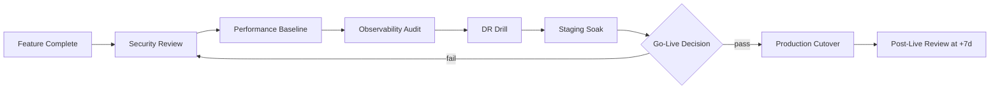
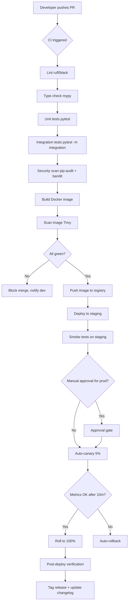
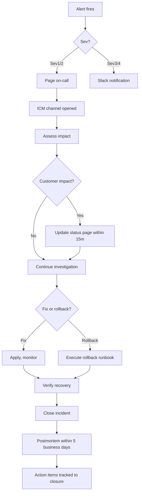

# Production Readiness Checklist

#flask #production #checklist #deployment #security #observability

> [!info] The "are we ready to ship?" gate
> Every item below has bitten someone in production. This checklist is what a senior engineer runs through before greenlighting a Flask app for production traffic. Each item has three parts: **What** (the change to make), **Why** (what happens if you don't), **How to verify** (a concrete check, not a vibe).

---

## How to use this checklist

1. **Run it twice.** Once at "feature complete" and once at "load test passed." Different issues surface at each stage.
2. **Don't skip sections.** Even if "observability isn't your job," you'll be paged at 3 a.m. without it.
3. **Treat any unchecked item as a known risk.** Either fix it or write a postmortem-ready justification in your team wiki.
4. **Automate what you can.** Many items below are checkable with `gunicorn --check-config`, `pip-audit`, or a CI script.



---

## 1. Security Checklist

> [!abstract] 25+ items — the floor, not the ceiling
> Security is the section where shortcuts cost the most. If you check every box below, you are *average*. If you skip any, you are below average.

### 1.1 Secrets management

- [ ] **No secrets in source control.** No API keys, DB passwords, JWT secrets in `.env` files committed to git.
  - *Why:* Leaked keys are the #1 cause of cloud account compromises.
  - *Verify:* `git log -p | rg -i 'password|secret|api[_-]?key'` should return nothing. Use `gitleaks` in CI.

- [ ] **Secrets loaded from a secrets manager** (AWS Secrets Manager, Vault, Doppler) or env vars at runtime.
  - *Why:* Rotating committed secrets is painful; rotating vault entries is a config change.
  - *Verify:* Application starts with an empty `.env` file if it can pull from the vault.

- [ ] **Distinct secrets per environment.** Dev, staging, prod use different JWT signing keys, DB passwords, and API keys.
  - *Why:* A leaked dev key shouldn't grant prod access.
  - *Verify:* Diff the secrets between envs; they should share zero values.

- [ ] **Secret rotation procedure documented and tested.** You can rotate the DB password without downtime.
  - *Why:* "We'll rotate after the breach" is not a rotation procedure.
  - *Verify:* Run the rotation runbook in staging quarterly.

### 1.2 Authentication & authorization

- [ ] **Passwords hashed with argon2id or bcrypt** (cost ≥12 for bcrypt, m=64MB for argon2).
  - *Why:* SHA-256/MD5 are crackable on commodity GPUs in seconds.
  - *Verify:* Inspect a stored hash; first segment is `$argon2id$` or `$2b$12$`.

- [ ] **MFA available and enforced for admin accounts.**
  - *Why:* Phishing takes passwords, not TOTP seeds.
  - *Verify:* Try to log in as an admin without MFA — should be impossible.

- [ ] **Rate limiting on `/login`, `/auth/refresh`, `/reset-password`** (e.g., 10/min/IP, 5/min/email).
  - *Why:* Without it, attackers run 10M guesses overnight.
  - *Verify:* Send 11 bad logins in a minute; the 11th gets 429.

- [ ] **Session cookies `HttpOnly`, `Secure`, `SameSite=Lax` or `Strict`.**
  - *Why:* HttpOnly blocks XSS theft; Secure blocks HTTP leak; SameSite blocks CSRF.
  - *Verify:* `curl -I https://app/` — `Set-Cookie` has all three flags.

- [ ] **CSRF protection on all state-changing routes** (Flask-WTF or custom tokens).
  - *Why:* SameSite cookies reduce but don't eliminate CSRF.
  - *Verify:* Submit a POST without the CSRF token; expect 400.

- [ ] **Authorization checked per request, not just at login.**
  - *Why:* Users with stale cookies after a role change still get access.
  - *Verify:* Demote a user; their next request to an admin endpoint returns 403.

- [ ] **No IDOR vulnerabilities** — every object access checks `obj.owner_id == current_user.id`.
  - *Why:* `GET /api/orders/42` should not work if order 42 isn't yours.
  - *Verify:* Two test users; user A can't fetch user B's order by ID.

### 1.3 Input & output

- [ ] **All inputs validated** with Marshmallow or Pydantic schemas.
  - *Why:* Unvalidated input is the root of SQLi, SSRF, command injection.
  - *Verify:* Try sending unexpected types in JSON fields; expect 422, not 500.

- [ ] **SQL queries use parameterized statements** (no f-strings or `%` formatting).
  - *Why:* SQLi is still in the OWASP top 10.
  - *Verify:* `rg "execute\(f['\"]" app/` returns nothing.

- [ ] **File uploads validated by content (MIME sniff)**, not extension.
  - *Why:* Renamed `.exe` to `.png` bypasses extension checks.
  - *Verify:* Upload a renamed binary; expect 415.

- [ ] **HTML output escaped by default** (Jinja2 autoescape is on for `.html` files).
  - *Why:* Stored XSS persists across sessions and users.
  - *Verify:* Submit `<script>alert(1)</script>` in a profile field; render the profile; no alert.

- [ ] **Outgoing email/links are sanitized** — no user-controlled `To:` or `Subject:` headers.
  - *Why:* Header injection turns your mailer into a spam relay.
  - *Verify:* Submit a `To` field with `\r\nBcc: evil@x.com`; expect rejection.

### 1.4 Transport & headers

- [ ] **HTTPS enforced** with HSTS (`Strict-Transport-Security: max-age=31536000; includeSubDomains`).
  - *Why:* Without HSTS, the first request over HTTP can be intercepted.
  - *Verify:* `curl -I https://app/` shows the HSTS header.

- [ ] **Security headers**: `X-Content-Type-Options: nosniff`, `X-Frame-Options: DENY`, `Content-Security-Policy: default-src 'self'`, `Referrer-Policy: strict-origin-when-cross-origin`.
  - *Why:* Defense in depth against XSS, clickjacking, MIME confusion.
  - *Verify:* Run `https://securityheaders.com/?q=yourdomain`.

- [ ] **TLS 1.2+ only**; 1.0/1.1 disabled at the load balancer.
  - *Why:* Older TLS versions have known vulnerabilities (BEAST, POODLE).
  - *Verify:* `nmap --script ssl-enum-ciphers -p 443 yourdomain`.

- [ ] **Cookies scoped to subdomains only when needed.** Don't set `Domain=.example.com` if you don't need it.
  - *Why:* A wildcard cookie is visible to every subdomain, including ones you don't control later.
  - *Verify:* Inspect `Set-Cookie`; `Domain` is omitted (host-only) for sensitive cookies.

### 1.5 Dependencies & infrastructure

- [ ] **`pip-audit` or `safety` runs in CI** and fails on known CVEs.
  - *Why:* 95% of breaches involve known vulnerabilities.
  - *Verify:* CI pipeline history shows the audit step passing (or failing on patches).

- [ ] **Dependencies pinned** with hashes (`pip-compile --generate-hashes`).
  - *Why:* Prevents supply-chain attacks where a transitive dep is compromised.
  - *Verify:* `requirements.txt` has `==` versions and `--hash=sha256:...` lines.

- [ ] **Containers run as non-root user.**
  - *Why:* If RCE happens, root in container = root on host in many configs.
  - *Verify:* `docker exec <container> id` shows `uid=1000(appuser)`.

- [ ] **Database runs on a private subnet** with no internet ingress.
  - *Why:* Publicly reachable RDS is a top finding in cloud audits.
  - *Verify:* Security group has no `0.0.0.0/0` inbound rules.

- [ ] **Principle of least privilege for IAM/DB roles.** App role can't drop tables or assume admin.
  - *Why:* Blast radius of a compromise = blast radius of permissions.
  - *Verify:* Try `DROP TABLE` from the app role; expect 403.

### 1.6 Logging & monitoring

- [ ] **No sensitive data in logs** (passwords, tokens, full credit card numbers).
  - *Why:* Logs aggregate to SIEMs, log aggregators, support tools — many viewers.
  - *Verify:* Log in with verbose logging; grep logs for your password; expect nothing.

- [ ] **Auth events logged** (login success/failure, MFA challenge, password reset, role change).
  - *Why:* Needed for incident response and audit.
  - *Verify:* Trigger each event; check the audit log table or SIEM.

- [ ] **Alerts on suspicious patterns** (5 failed logins in 1 min, login from new country, role change to admin).
  - *Why:* Logs without alerts are write-only.
  - *Verify:* Trigger the pattern; an alert fires in your SIEM.

> [!success] Security done right
> If you've checked every box above, you're at "industry baseline." To go beyond: add a bug bounty, run annual pentests, and threat-model new features before code.

---

## 2. Performance Checklist

> [!abstract] 20+ items — the latency and throughput floors
> Performance is a feature. Users perceive <200 ms as instant and >1 s as broken. The items below target the 99th percentile, not the average.

### 2.1 Database

- [ ] **N+1 queries eliminated.** Use `joinedload`, `selectinload`, or DataLoader.
  - *Why:* N+1 is the #1 cause of slow endpoints with no obvious single query.
  - *Verify:* Enable SQLAlchemy echo; one endpoint should produce 1–3 queries, not 1 + N.

- [ ] **Indexes on all columns used in `WHERE`, `ORDER BY`, `JOIN`.**
  - *Why:* A missing index turns a 5 ms query into a 5 s seq scan.
  - *Verify:* `EXPLAIN ANALYZE` on the slow query; no `Seq Scan` on large tables.

- [ ] **Read replicas for read-heavy routes.** Reporting/listing routes hit the replica.
  - *Why:* Reads shouldn't compete with writes for DB CPU.
  - *Verify:* App config routes `/reports/*` to the replica DSN.

- [ ] **Connection pool sized correctly.** Pool size = (workers × threads × concurrency).
  - *Why:* Too small → requests queue; too large → DB runs out of connections.
  - *Verify:* `pg_stat_activity` shows ≤80% of max_connections used at peak.

- [ ] **Long-running queries have timeouts** (`statement_timeout` in Postgres, `socket_timeout` in driver).
  - *Why:* A 30 s query holds a connection and blocks the pool.
  - *Verify:* `SET statement_timeout = 5000; SELECT pg_sleep(10);` → cancels after 5 s.

- [ ] **Migrations tested on prod-sized data.** Run the migration on a snapshot.
  - *Why:* `ALTER TABLE` can lock for minutes on large tables.
  - *Verify:* Migration completes in <5 s on a 10M-row copy.

### 2.2 Caching

- [ ] **Hot reads cached** (user profile, feature flags, config).
  - *Why:* 90% of requests often touch 10% of data.
  - *Verify:* Hit the same endpoint 100×; Redis `INFO stats` shows `keyspace_hits` increment.

- [ ] **Cache invalidation strategy explicit** (TTL, event-based, or versioned keys).
  - *Why:* "We'll figure it out later" = stale data bugs that erode trust.
  - *Verify:* Update a cached object; the next read returns fresh data.

- [ ] **Cache stampede protected** (locks, probabilistic early expiration, or `dogpile`).
  - *Why:* 1000 requests miss simultaneously on expiry; DB gets a thundering herd.
  - *Verify:* Drop the cache; peak QPS to DB stays under `worker_count`.

### 2.3 HTTP & frontend

- [ ] **Gzip or Brotli compression enabled** at the load balancer.
  - *Why:* JSON responses compress 5–10×.
  - *Verify:* `curl -H 'Accept-Encoding: gzip' -I https://app/api/...` shows `Content-Encoding: gzip`.

- [ ] **Static assets served via CDN** with far-future cache headers.
  - *Why:* CDNs offload bytes from your origin; cache headers prevent re-fetches.
  - *Verify:* First request 200, second request 304 or cache hit.

- [ ] **HTTP/2 or HTTP/3 enabled** at the load balancer.
  - *Why:* Multiplexing reduces connection overhead for asset-heavy pages.
  - *Verify:* `curl -I --http2 https://app/`.

- [ ] **Images served as WebP/AVIF** with `` for responsive sizes.
  - *Why:* 30% smaller payloads, mobile-friendly.
  - *Verify:* Network tab shows `image/webp` responses under 100 KB.

### 2.4 Application code

- [ ] **No synchronous I/O in request handlers** (no `requests.get`, no `time.sleep`).
  - *Why:* Blocks the worker; throughput = workers / latency.
  - *Verify:* `rg "requests\.(get|post)" app/` returns only async callers or background tasks.

- [ ] **Background jobs for slow work** (email sending, PDF generation, third-party API calls).
  - *Why:* Users shouldn't wait 5 s for a confirmation email to send.
  - *Verify:* Trace a request end-to-end; <200 ms with a Celery task spawned.

- [ ] **Jsonify uses `JSONIFY_PRETTYPRINT=False` in prod.**
  - *Why:* Pretty printing adds 20–40% to payload size.
  - *Verify:* `curl https://app/api/...` returns compact JSON.

- [ ] **Jinja2 template caching enabled** (`TEMPLATES_AUTO_RELOAD=False` in prod).
  - *Why:* Auto-reload recompiles templates per request.
  - *Verify:* Modify a template in prod; the running app doesn't pick it up until restart.

### 2.5 Capacity & load testing

- [ ] **Load test passes at 2× expected peak** with p99 < 500 ms.
  - *Why:* Traffic spikes happen; capacity headroom is mandatory.
  - *Verify:* Run `locust` or `k6` for 15 min at 2× peak; p99 latency under target.

- [ ] **Autoscaling configured** based on CPU and request queue depth.
  - *Why:* Manual scaling means humans are on the critical path for incidents.
  - *Verify:* Trigger load; new instances come up within 5 min.

- [ ] **Graceful shutdown** — workers finish in-flight requests before exit (`SIGTERM` handling).
  - *Why:* Rolling deploys without graceful shutdown drop in-flight requests.
  - *Verify:* Deploy during load; 5xx rate stays at zero.

> [!tip] Performance budget
> Define one. Example: "p99 latency per endpoint must be < 300 ms. If a PR adds >10 ms to p99, it needs explicit approval." A budget makes tradeoffs visible in code review.

---

## 3. Observability Checklist

> [!abstract] 15+ items — you can't fix what you can't see
> Observability is the difference between "the site is slow" and "the `/api/orders` endpoint has 2 s p99 due to a missing index on `created_at`." Without these items, you're flying blind.

### 3.1 Logging

- [ ] **Structured JSON logs** with `structlog` or `python-json-logger`.
  - *Why:* Parses cleanly into ELK, Loki, Datadog.
  - *Verify:* `kubectl logs` shows JSON lines, not free-text.

- [ ] **Every request logged with**: method, path, status, latency, user_id, request_id, ip, user_agent.
  - *Why:* This is the minimum needed to debug "what happened to my request?"
  - *Verify:* Make a request; find it in logs by `request_id`; all fields present.

- [ ] **Log levels used correctly** — DEBUG for dev, INFO for prod events, WARN for unusual, ERROR for failures.
  - *Why:* Mis-leveled logs either flood (too much INFO) or hide (ERROR for warnings).
  - *Verify:* Prod log volume per level matches expectations.

### 3.2 Metrics

- [ ] **RED metrics per endpoint** — Rate, Errors, Duration.
  - *Why:* Three numbers tell you if an endpoint is healthy.
  - *Verify:* Prometheus shows `http_requests_total{path="/api/orders",status="200"}` and a histogram for duration.

- [ ] **USE metrics per resource** — Utilization, Saturation, Errors for DB, Redis, queue.
  - *Why:* Resources saturate before endpoints degrade.
  - *Verify:* Grafana dashboard has DB connections, Redis memory, Celery queue length.

- [ ] **Custom business metrics** — signups, orders, revenue, error rate per tenant.
  - *Why:* Tech metrics tell you "is the app up," business metrics tell you "is the app working."
  - *Verify:* Dashboard shows real-time revenue; matches the DB.

### 3.3 Tracing

- [ ] **Distributed tracing** with OpenTelemetry or Jaeger.
  - *Why:* Single trace shows DB, Redis, external API calls in one timeline.
  - *Verify:* Open a trace for a slow request; see spans for each subsystem.

- [ ] **Trace context propagated** to downstream services and background jobs.
  - *Why:* A trace that ends at your service boundary is useless.
  - *Verify:* Trace ID from the inbound request appears in Celery task logs.

### 3.4 Alerting

- [ ] **Alerts on SLO burn rate**, not on static thresholds.
  - *Why:* Static thresholds (CPU > 80%) alert on irrelevant things; SLO alerts focus on user impact.
  - *Verify:* Alert policy references error budget burn, not raw CPU.

- [ ] **Runbook linked from every alert.**
  - *Why:* An alert without a runbook is a 3 a.m. guessing game.
  - *Verify:* Open any alert in your APM; link to the runbook is present.

- [ ] **On-call rotation defined** with PagerDuty or Opsgenie.
  - *Why:* "Someone will notice" is not an incident response plan.
  - *Verify:* Schedule shows primary and secondary for the next 4 weeks.

- [ ] **Alert fatigue tracked** — <10 alerts/week per on-call shift.
  - *Why:* More than that and alerts get ignored.
  - *Verify:* APM shows alert count per week; under threshold.

> [!example] Monitoring stack
> ```mermaid
> flowchart LR
>   A[Flask app] -->|JSON logs| B[Fluent Bit]
>   A -->|OTLP metrics| C[Prometheus]
>   A -->|OTLP traces| D[Tempo/Jaeger]
>   B --> E[Loki]
>   C --> F[Grafana]
>   D --> F
>   E --> F
>   F --> G[Alerts → PagerDuty]
>   F --> H[Dashboards for on-call]
> ```

---

## 4. Deployment Checklist

> [!abstract] 15+ items — ship safely, ship often
> The goal is "boring deployments": same path every time, automatic rollback, zero user impact.

### 4.1 Build & artifact

- [ ] **Reproducible builds** — same commit produces byte-identical image.
  - *Why:* Reproducibility = trust. You can verify a prod image matches a commit.
  - *Verify:* Build twice; `sha256sum` of the image matches.

- [ ] **Container image scanned** for CVEs (Trivy, Snyk) before push.
  - *Why:* Base images accumulate vulnerabilities.
  - *Verify:* CI blocks on `CRITICAL` CVEs.

- [ ] **Images tagged by git SHA**, not `latest`.
  - *Why:* `latest` is ambiguous; you can't roll back to "the previous one."
  - *Verify:* `kubectl describe pod` shows image tag matching a commit SHA.

### 4.2 Release strategy

- [ ] **Blue/green or canary deployments** in place.
  - *Why:* Big-bang deploys fail big. Canary catches issues at 5% traffic.
  - *Verify:* Deploy a version that returns 500; canary catches it before full rollout.

- [ ] **Health checks** (`/healthz` for liveness, `/readyz` for readiness) implemented and used by orchestrator.
  - *Why:* Without readiness checks, traffic hits pods before they're ready.
  - *Verify:* Start a pod; traffic only routes after `/readyz` returns 200.

- [ ] **Migrations run as a pre-deploy step**, separate from app deploy.
  - *Why:* Migrations need to run once, not per-pod. They also need to fail loudly.
  - *Verify:* CI pipeline shows a `migrate` job before the `deploy` job.

- [ ] **Backward-compatible migrations** (additive first, removal in a later deploy).
  - *Why:* Rolling deploys mean old and new code run simultaneously.
  - *Verify:* Deploy old → migrate → new; both versions work.

### 4.3 Rollback

- [ ] **One-command rollback** tested in staging.
  - *Why:* "We'll figure out rollback during the incident" is how you have a 6-hour outage.
  - *Verify:* Time a rollback drill; <5 min from trigger to old version serving traffic.

- [ ] **Database migrations are reversible** (`downgrade` function in Alembic).
  - *Why:* App rollback without DB rollback = broken state.
  - *Verify:* Run `alembic downgrade -1` in staging; succeeds cleanly.

### 4.4 Configuration

- [ ] **Config validated at startup** — app refuses to boot with missing required config.
  - *Why:* Misconfigured prod = silent broken behavior.
  - *Verify:* Delete an env var; app exits with a clear error.

- [ ] **Feature flags for risky changes** (LaunchDarkly, Unleash, [[Flask-FeatureFlags]]).
  - *Why:* Decouple deploy from release. Ship dark, turn on later.
  - *Verify:* New feature ships OFF; toggle in admin UI; users see it.

- [ ] **No debug mode in prod** (`FLASK_ENV=production`, `DEBUG=False`).
  - *Why:* Debug mode enables the Werkzeug debugger = remote code execution.
  - *Verify:* Trigger an error; no debugger PIN screen appears.

### 4.5 Pipeline

A repeatable pipeline is the difference between "deploys are scary" and "deploys are boring." Every step should be automated and observable.



Each box in this pipeline should map to a CI step you can grep in your pipeline definition. If a step is missing, the gap is a known risk.

```mermaid
flowchart LR
    A[Push to main] --> B[Lint + Type Check]
    B --> C[Unit Tests]
    C --> D[Integration Tests]
    D --> E[Build Image]
    E --> F[Scan Image]
    F --> G[Deploy to Staging]
    G --> H[Smoke Tests]
    H --> I[Manual Approval]
    I --> J[Canary 5%]
    J --> K[Canary 25%]
    K --> L[Full Rollout]
    L --> M[Post-Deploy Verification]
    M --> N[Tag Release + Changelog]
```




- [ ] **CI runs on every PR** with lint, type-check, tests, security scan.
  - *Why:* Catch issues before merge, not after.
  - *Verify:* Open a PR with a failing test; merge is blocked.

- [ ] **Staging mirrors prod** — same image, same config shape (different values), same DB engine version.
  - *Why:* "Works on staging" only matters if staging ≈ prod.
  - *Verify:* Diff the infra configs; only secrets and URLs differ.

- [ ] **Deploy artifacts retained** for at least 90 days (images, build logs).
  - *Why:* Needed for forensic analysis after incidents.
  - *Verify:* Pull an image from 60 days ago; still available.

---

## 5. Database Checklist

> [!abstract] 15+ items — the data is the business
> Databases fail in ways that don't show up in unit tests: corruption, replication lag, locked tables. These items target those failure modes.

### 5.1 Schema & migrations

- [ ] **Every table has a primary key** (prefer `uuid` or `bigserial`).
  - *Why:* Without a PK, replication breaks, ORM operations get weird, no point-in-time recovery.
  - *Verify:* `\d+ tablename` in psql shows a primary key.

- [ ] **Foreign keys have indexes** on the child column.
  - *Why:* Unindexed FKs cause full table scans on `JOIN` and locking on parent updates.
  - *Verify:* `\di tablename` shows an index on each FK column.

- [ ] **All columns are `NOT NULL` unless explicitly nullable.**
  - *Why:* Nullable columns introduce `None` handling bugs throughout the app.
  - *Verify:* Schema review checklist; justify every nullable column.

- [ ] **Enums are constraints, not strings** (use `Enum` type or `CHECK` constraint).
  - *Why:* Prevents invalid state (`status='paided'`).
  - *Verify:* Insert an invalid status; expect a constraint violation.

- [ ] **Timestamps in UTC** (`created_at TIMESTAMPTZ DEFAULT NOW()`).
  - *Why:* Local time zones cause off-by-one-hour bugs across DST.
  - *Verify:* Insert a row; `created_at` is in UTC.

### 5.2 Backups & recovery

- [ ] **Automated daily backups** with retention ≥30 days.
  - *Why:* Without backups, a `DROP TABLE` is permanent.
  - *Verify:* List backups; oldest is ≥30 days old.

- [ ] **Point-in-time recovery enabled** (PITR via WAL archiving or RDS automated backups).
  - *Why:* Daily snapshots can lose up to 24 hours of data.
  - *Verify:* Restore to "5 minutes ago" in a sandbox; succeeds.

- [ ] **Backup restore tested quarterly** in a separate environment.
  - *Why:* Untested backups are wishful thinking.
  - *Verify:* Most recent restore test report exists; <2 quarters old.

- [ ] **Replicas in a different region** (cross-region read replica or snapshot replication).
  - *Why:* Region outage shouldn't mean data loss.
  - *Verify:* Promote the replica in a DR drill; app keeps serving.

### 5.3 Operations

- [ ] **`VACUUM` and `ANALYZE` running** (autovacuum tuned, or scheduled).
  - *Why:* Bloat and stale stats degrade performance silently.
  - *Verify:* `pg_stat_user_tables` shows recent `last_autovacuum`.

- [ ] **Long-running transactions killed** (`idle_in_transaction_session_timeout`).
  - *Why:* Idle transactions block vacuum and bloat the table.
  - *Verify:* Open a transaction and leave it; killed after timeout.

- [ ] **Replication lag monitored** with alerts at >5s.
  - *Why:* Lagging replicas serve stale data; reads become inconsistent.
  - *Verify:* Stop WAL replay on a replica; alert fires.

- [ ] **DB CPU and disk space alerts** at 70%.
  - *Why:* Disk full = DB down. CPU pinned = slow queries.
  - *Verify:* Fill disk to 71%; alert fires.

---

## 6. Backup & Disaster Recovery Checklist

> [!abstract] 10+ items — for when everything else fails
> DR is the "break glass" plan. Practice it before you need it.

- [ ] **RTO and RPO defined** (Recovery Time Objective, Recovery Point Objective).
  - *Why:* "Recover fast" is not a target. "RTO 4h, RPO 15min" is.
  - *Verify:* Documented in your runbook; signed off by leadership.

- [ ] **Backups encrypted at rest** with a KMS key separate from prod.
  - *Why:* If prod keys are compromised, backups should still be safe.
  - *Verify:* Backup bucket has SSE-KMS with a different key than prod data.

- [ ] **Offsite backups** (different region or cloud).
  - *Why:* Region outages (us-east-1 has had several) shouldn't take backups with them.
  - *Verify:* List backup locations; at least two regions.

- [ ] **DR environment can be provisioned from scratch** in <RTO.
  - *Why:* "We have Terraform" ≠ "we can bring up prod in 4 hours."
  - *Verify:* Run the DR provisioning runbook quarterly; time it.

- [ ] **Application state recoverable** — sessions, queues, caches can be rebuilt or are persisted.
  - *Why:* Recovering the DB but losing in-flight Celery jobs means data loss.
  - *Verify:* Inspect queue persistence; restart broker; jobs resume.

- [ ] **DNS failover plan** documented.
  - *Why:* Failover doesn't help if users still hit the dead region.
  - *Verify:* Route53 health checks configured; documented TTL for the apex record.

- [ ] **Customer comms template** ready (status page, email, Twitter).
  - *Why:* Customers find out from your status page, not from Twitter.
  - *Verify:* Status page can be updated without prod access.

- [ ] **Postmortem template** and 5-whys process established.
  - *Why:* Incidents without postmortems repeat.
  - *Verify:* Last 3 incidents have postmortems with action items tracked.

### Incident response flow



---

## 7. Compliance Checklist

> [!abstract] 10+ items — depending on your industry
> Compliance scope depends on jurisdiction (GDPR, CCPA), industry (HIPAA, PCI), and customers (SOC 2, ISO 27001). Use this as a starting point, not a replacement for legal counsel.

### 7.1 Data privacy

- [ ] **PII inventory maintained** — every PII field documented with location, retention, purpose.
  - *Why:* GDPR Article 30 requires records of processing.
  - *Verify:* Inventory doc exists; reviewed in last 6 months.

- [ ] **Data retention policies enforced** — auto-delete after N days.
  - *Why:* "We keep everything forever" is non-compliant under most regulations.
  - *Verify:* Query for records older than retention; count should be 0.

- [ ] **Right to erasure endpoint** implemented (`DELETE /users/me` cascades to all PII).
  - *Why:* GDPR Article 17; CCPA equivalent.
  - *Verify:* Delete a test user; verify no PII remains in DB, logs, backups (within policy).

- [ ] **Data export endpoint** (`GET /users/me/export`) returns all user data in machine-readable form.
  - *Why:* GDPR Article 20 (data portability).
  - *Verify:* Export a test user; contains all their records.

- [ ] **Consent records** for marketing emails, tracking, cookies.
  - *Why:* GDPR requires proof of consent, not just an opt-in flag.
  - *Verify:* Audit log shows when/how consent was given.

### 7.2 Audit & access

- [ ] **Audit log of admin actions** with tamper-evident storage (append-only or WORM).
  - *Why:* SOC 2 CC7; required for any regulated data.
  - *Verify:* Try to UPDATE an audit row; constraint or trigger blocks it.

- [ ] **Access reviews quarterly** — list of users with prod access; remove stale.
  - *Why:* SOC 2 CC6; ex-employees with access = breach waiting.
  - *Verify:* Most recent review report; <90 days old.

- [ ] **SSO enforced for all internal tools** (no shared logins, no password auth).
  - *Why:* Shared logins = no individual accountability.
  - *Verify:* Try to log in to admin panel with a password; should require SSO.

### 7.3 Specific frameworks

- [ ] **PCI-DSS scope minimized** — Stripe/Braintree handles card data; your servers never see PANs.
  - *Why:* Out-of-scope = no annual audit needed.
  - *Verify:* Logs and DB don't contain card numbers; SAQ-A applies.

- [ ] **HIPAA BAA signed** with every vendor that touches PHI (AWS, Stripe, Datadog).
  - *Why:* Without a BAA, the vendor isn't HIPAA-compliant and neither are you.
  - *Verify:* BAAs on file; reviewed annually.

- [ ] **SOC 2 Type II report** current (within 12 months) or in progress.
  - *Why:* Required by most enterprise customers.
  - *Verify:* Report date on file; auditor engaged for next period.

> [!warning] Compliance is not security
> Passing a compliance audit doesn't mean your app is secure. Equifax was PCI-DSS certified when it was breached. Treat compliance as the floor and security as the ceiling.

---

## Pre-launch review summary

Run through this condensed checklist 1 week before go-live:

| Area | Critical items | Owner | Status |
|------|----------------|-------|--------|
| Security | Secrets in vault, rate limits, security headers, dep audit | Sec lead | ⬜ |
| Performance | Load test passes at 2× peak, p99 < 500 ms | Eng lead | ⬜ |
| Observability | Dashboards, alerts with runbooks, on-call set | SRE | ⬜ |
| Deployment | Canary in place, rollback tested, health checks | Eng lead | ⬜ |
| Database | Backups tested, PITR on, replicas up | DBA | ⬜ |
| DR | DR drill completed within 90 days | SRE | ⬜ |
| Compliance | PII inventory, retention policies, BAAs signed | Legal | ⬜ |

If any box is unchecked at T-7d, the launch is at risk. If any is unchecked at T-1d, **delay the launch.**

---

## Related notes

- [[Security-Best-Practices]] — deeper treatment of section 1
- [[Authentication-Cookbook]] — auth patterns behind the security checklist
- [[File-Handling-Cookbook]] — upload/download hardening
- [[API-Design-Cookbook]] — API-level reliability patterns
- [[Flask-Limiter]] — rate-limiting implementation
- [[Flask-Caching]] — caching patterns
- [[Flask-FeatureFlags]] — feature flag integration
- [[Pydantic-Settings]] — config validation at startup

#flask #production #checklist #go-live
