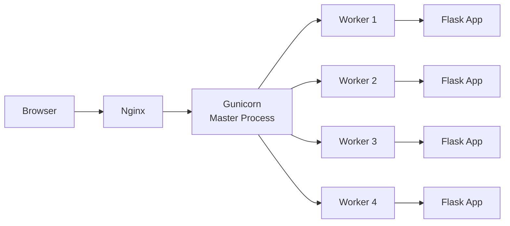

# Gunicorn Deep Dive

> Gunicorn (Green Unicorn) is a production-grade WSGI HTTP server for Python web applications. It is the recommended way to serve Flask applications in production. Understanding Gunicorn's worker models, configuration options, and performance characteristics is essential for deploying robust Flask applications.

## What Is Gunicorn?

Gunicorn is a pre-fork WSGI server that sits between your Flask application and the web (Nginx). It:

- Runs multiple worker processes to handle concurrent requests
- Manages the lifecycle of worker processes (spawning, killing, restarting)
- Provides a load balancer that distributes requests across workers
- Handles signals for graceful shutdowns and reloading



## Installation

```bash
pip install gunicorn
```

## Basic Usage

```bash
# Basic
 gunicorn -w 4 -b 127.0.0.1:8000 run:app

# Named workers, log to file
gunicorn -w 4 -b 127.0.0.1:8000 \
    --access-logfile /var/log/gunicorn/access.log \
    --error-logfile /var/log/gunicorn/error.log \
    run:app

# With config file
gunicorn -c gunicorn.conf.py run:app
```

## Worker Types

Gunicorn supports multiple worker classes:

| Worker | Description | Best For |
|--------|-------------|----------|
| `sync` | Synchronous, one request per worker | CPU-bound apps, simple workloads |
| `eventlet` | Eventlet-based async | I/O-bound apps |
| `gevent` | Gevent-based async | I/O-bound apps, WebSockets |
| `tornado` | Tornado-based | Tornado apps |
| `gthread` | Thread workers | Mixed workloads |

### Sync Workers (Default)

```bash
gunicorn -w 4 -k sync run:app
```

Each worker handles one request at a time. Good for CPU-bound work. The master process forks multiple worker processes.

### Gevent Workers (Async)

```bash
gunicorn -w 4 -k gevent --worker-connections 1000 run:app
```

Each worker can handle many concurrent connections using greenlets. Good for I/O-bound apps with many concurrent connections.

## Configuration File

```python
# gunicorn.conf.py
import multiprocessing
import os

# Server socket
bind = "127.0.0.1:8000"
backlog = 2048

# Worker processes
workers = multiprocessing.cpu_count() * 2 + 1
worker_class = "sync"
worker_connections = 1000
timeout = 30
keepalive = 2

# Logging
accesslog = "/var/log/gunicorn/access.log"
errorlog = "/var/log/gunicorn/error.log"
loglevel = "info"

# Process naming
proc_name = "myapp"

# Server mechanics
daemon = False
pidfile = "/tmp/gunicorn.pid"

# SSL (better to handle in Nginx)
# keyfile = "/path/to/key.pem"
# certfile = "/path/to/cert.pem"
```

## Worker Count Formula

The optimal number of workers depends on your workload:

```
CPU-bound: workers = (2 * CPU cores) + 1
I/O-bound: workers = (2 * CPU cores) + 1 (but use async workers)
Mixed: Start with (2 * CPU cores) + 1, then benchmark
```

> [!TIP]
> Monitor your application under load. If workers are idle, reduce the count. If requests queue up, increase it. Use monitoring tools to find the sweet spot.

## Signals

Gunicorn responds to Unix signals:

| Signal | Action |
|--------|--------|
| `TERM` | Quick shutdown |
| `QUIT` | Graceful shutdown (wait for workers to finish) |
| `HUP` | Reload configuration, restart workers |
| `USR1` | Reopen log files (for log rotation) |
| `USR2` | Upgrade Gunicorn on the fly |
| `TTIN` | Increase worker count by 1 |
| `TTOU` | Decrease worker count by 1 |

```bash
# Graceful reload
kill -HUP $(cat /tmp/gunicorn.pid)

# Graceful shutdown
kill -QUIT $(cat /tmp/gunicorn.pid)
```

## Integration with Nginx

```nginx
upstream app_server {
    server 127.0.0.1:8000 fail_timeout=0;
}

server {
    listen 80;
    server_name example.com;
    
    location / {
        proxy_pass http://app_server;
        proxy_set_header Host $host;
        proxy_set_header X-Real-IP $remote_addr;
        proxy_set_header X-Forwarded-For $proxy_add_x_forwarded_for;
        proxy_set_header X-Forwarded-Proto $scheme;
        proxy_redirect off;
    }
    
    location /static {
        alias /var/www/myapp/static;
        expires 1y;
    }
}
```

## Preloading Application

```bash
gunicorn -w 4 --preload run:app
```

Preloading loads the application code in the master process before forking workers. This reduces memory usage when all workers share the same application code.

## Graceful Timeouts

```bash
gunicorn -w 4 --graceful-timeout 30 --timeout 60 run:app
```

- `timeout`: Maximum time for a worker to handle a request (worker killed if exceeded)
- `graceful-timeout`: Time to wait for worker to finish current requests during shutdown

## Common Mistakes

**Mistake: Too many workers**
More workers than needed wastes memory and can cause contention.

**Mistake: Not using Nginx**
Gunicorn should not be exposed directly to the internet.

**Mistake: Blocking workers**
Long-running requests in sync workers block other requests. Use async workers for I/O-bound workloads.

**Mistake: No log rotation**
Logs can fill up disk space. Configure log rotation with logrotate.

## Best Practices

- Use `(2 * CPU cores) + 1` as starting point for worker count
- Use async workers (gevent/eventlet) for I/O-bound applications
- Always place Nginx in front of Gunicorn
- Use `--preload` to reduce memory usage
- Configure graceful timeouts for clean shutdowns
- Set up log rotation
- Monitor worker memory usage (restart if memory leaks)
- Use systemd to manage the Gunicorn process

## Exercises

1. **Benchmark Workers**: Test different worker counts under load using `wrk` or `ab`.

2. **Async Workers**: Switch from sync to gevent workers and measure the difference.

3. **Graceful Reload**: Practice reloading Gunicorn without dropping requests.

4. **Memory Monitoring**: Monitor Gunicorn worker memory usage over time.

## Quiz

**Question 1**: What is Gunicorn, and what role does it play in a Flask deployment?

**Question 2**: What is the difference between sync and async workers?

**Question 3**: How do you calculate the optimal number of workers?

**Question 4**: What is the purpose of the `--preload` flag?

**Question 5**: How do you gracefully reload Gunicorn configuration?

## Interview Questions

1. "What is Gunicorn, and why is it needed for Flask production deployments?"

2. "Explain the different Gunicorn worker types. When would you use each?"

3. "How would you tune Gunicorn for a high-traffic Flask application?"

4. "What is the relationship between Gunicorn and Nginx?"

5. "How do you handle zero-downtime deployments with Gunicorn?"

## Related Chapters

- [[07-Deployment/Deployment-Overview]] — Production deployment architecture
- [[07-Deployment/Nginx]] — Nginx reverse proxy
- [[10-Advanced/Docker]] — Dockerized deployments

## Official Documentation References

- [Gunicorn Documentation](https://docs.gunicorn.org/)
- [Gunicorn Settings](https://docs.gunicorn.org/en/stable/settings.html)
- [Gunicorn Design](https://docs.gunicorn.org/en/stable/design.html)

---

*Related: [[07-Deployment/Gunicorn]]*