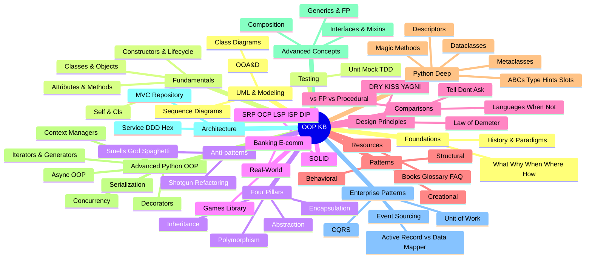
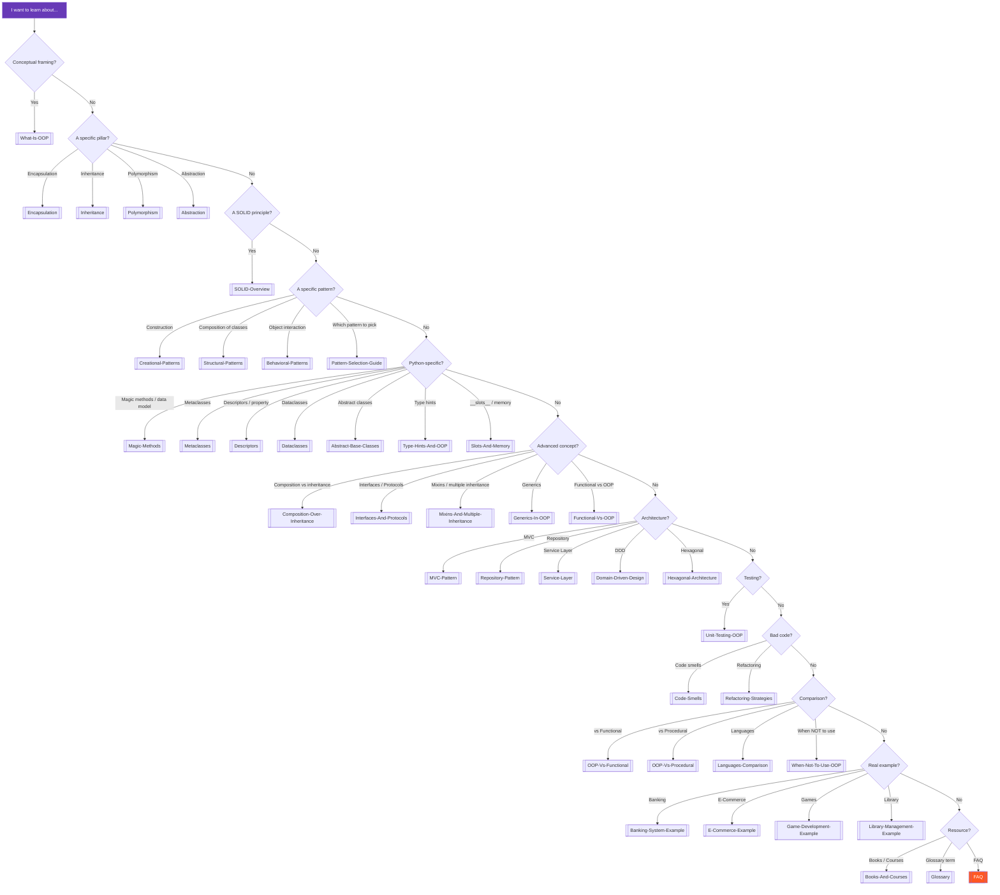
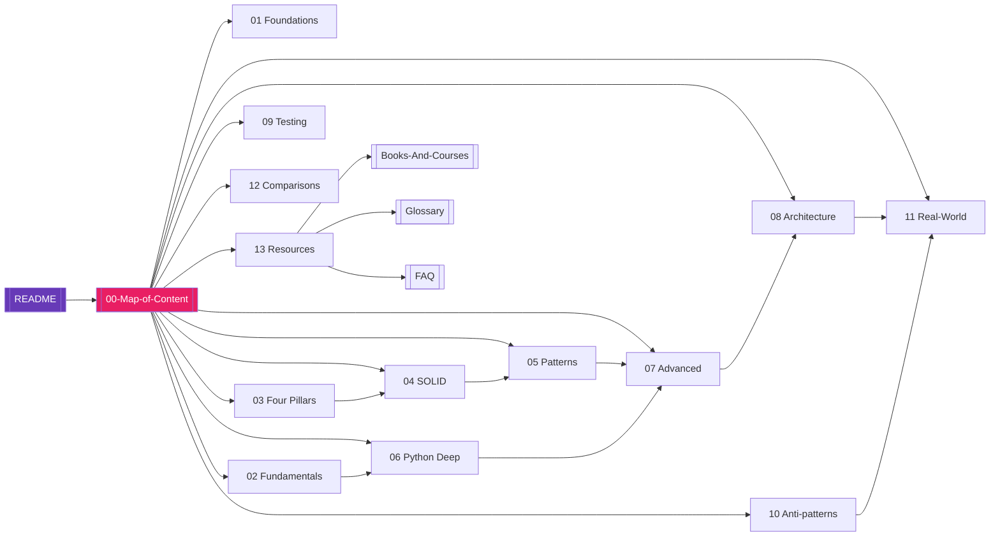

# Map of Content — OOP Knowledge Base

#oop #vault #moc #index #navigation #teaching

> [!info] You are here
> This is the **master index** of the OOP Knowledge Base. Every note in every section is listed below, with a one-line description. If you are lost, come back here. If you are looking for something specific, search this page (`Ctrl+F`). If you want a curated path, jump to [§15 Learning Paths](#15-learning-paths).

---

## 0. Quick Navigation

| Destination | Link |
| --- | --- |
| Home / Welcome | [[README]] |
| **This page** | [[00-Map-of-Content]] |
| Frequently Asked Questions | [[FAQ]] |
| Glossary of Terms | [[Glossary]] |
| Books & Courses | [[Books-And-Courses]] |

> [!tip] Bookmark this page
> In Obsidian, you can star this note (right-click the tab → **Pin**) so it stays open. The MOC is the closest thing this vault has to a homepage.

---

## 1. The Vault at a Glance

The vault is organised into 17 thematic sections. Each section below lists every note in that section, with a one-line description. Click any link to jump to that note.

---

## 2. Section 01 — Foundations

The conceptual and historical bedrock. Read these first if you are new to OOP; come back to them whenever you need to articulate *why* OOP exists.

| Note | Description |
| --- | --- |
| [[What-Is-OOP]] | The four canonical definitions (Booch, Rumbaugh, Stroustrup, Kay), the state+behavior+identity model, and ten common misconceptions. |
| [[Why-OOP]] | The seven problems OOP solves, with before/after code; cognitive and business-case arguments for OOP. |
| [[When-To-Use-OOP]] | A decision flowchart for "should this be OOP?", with eight "yes" and seven "no" scenarios. |
| [[Where-OOP-Is-Used]] | A territory map: web frameworks, GUIs, games, mobile, enterprise, OS, ORMs, scientific Python, AI/ML, compilers. |
| [[How-OOP-Works]] | The mechanics: memory layout, attribute lookup, descriptors, MRO, dispatch, lifecycle — what actually happens when you call a method. |
| [[History-Of-OOP]] | From Simula 67 through Smalltalk, C++, Java, Python, Ruby, C# to modern Go/Rust/Swift/Kotlin; Turing Award winners and key books. |
| [[OOP-Paradigms]] | Where OOP sits among imperative, functional, declarative, logic, and reactive paradigms; internal variations (class-based vs prototype-based, etc.). |

> [!tip] Suggested entry point
> Read [[What-Is-OOP]] first. Then read either [[Why-OOP]] (if you are motivated by problems) or [[History-Of-OOP]] (if you are motivated by stories).

---

## 3. Section 02 — Fundamentals

The vocabulary and mechanics of writing a class. Beginner-friendly, code-heavy, with many "gotcha" callouts.

| Note | Description |
| --- | --- |
| [[Classes-And-Objects]] | The cookie-cutter metaphor and its limits; class anatomy; the mutable-default trap; "a class is an object" demos. |
| [[Attributes-And-Properties]] | Instance vs class attributes; the lookup chain; `@property`; `_protected` vs `__mangled`; `__slots__`. |
| [[Methods-And-Functions]] | Instance/class/static/abstract methods; bound methods; method overloading workarounds; overriding with `super()`. |
| [[Constructors-And-Destructors]] | The two-step `__new__` → `__init__` model; `__del__` and its pitfalls; context managers as the right cleanup tool. |
| [[Object-Lifecycle]] | Allocation → use → unreferenced → collect; refcount + cyclic GC; weak references; identity vs equality; copying and interning. |
| [[Self-And-Cls]] | Why `self` exists, what `cls` is, why you should not rename them, and how bound methods work under the hood. |

> [!warning] Don't skip
> Even intermediate developers often have shaky understanding of [[Constructors-And-Destructors]] (especially `__new__`) and [[Object-Lifecycle]] (especially the cyclic GC). Read those two even if you think you know them.

---

## 4. Section 03 — The Four Pillars

The classical encapsulation / inheritance / polymorphism / abstraction quartet. Each note is a deep dive — 5,000+ words — with code, misconceptions, and cross-language comparisons.

| Note | Description |
| --- | --- |
| [[Encapsulation]] | Information hiding; `_`/`__` conventions; `@property` deep dive; Law of Demeter; encapsulation vs abstraction. |
| [[Inheritance]] | Single vs multiple inheritance; `super()` and cooperative MRO; LSP preview; when inheritance hurts. |
| [[Polymorphism]] | Four kinds (ad hoc, parametric, subtype, structural); duck typing; LSP; dispatch mechanisms compared. |
| [[Abstraction]] | ABCs and `@abstractmethod`; abstract vs interface; abstraction levels; over-abstraction as a code smell. |

> [!quote] Grady Booch
> "Encapsulation is the process of compartmentalizing the elements of an abstraction that constitute its structure and behavior."

---

## 5. Section 04 — SOLID Principles

The five principles that turn "I can write a class" into "I can design a maintainable system."

| Note | Description |
| --- | --- |
| [[SOLID-Overview]] | The acronym as a unified design philosophy; how the five principles interact; common misreadings. |
| [[Single-Responsibility]] | SRP — the cohesion principle; "reason to change"; module boundaries; gun-and-knife test. |
| [[Open-Closed]] | OCP — extending behavior without modifying source; strategy and template-method as canonical enablers. |
| [[Liskov-Substitution]] | LSP — subtypes must be substitutable for their base types; the Square/Rectangle problem; contract rules. |
| [[Interface-Segregation]] | ISP — no client should depend on methods it does not use; fat interface decomposition. |
| [[Dependency-Inversion]] | DIP — depend on abstractions, not concretions; dependency injection; the Hollywood Principle. |

> [!tip] Teaching Tip
> Teach SOLID in the order SRP → OCP → LSP → ISP → DIP. SRP is the easiest; DIP is the hardest. Many students give up at DIP because they have not yet seen a Dependency Injection container — give them a concrete example from [[Service-Layer]] or [[Hexagonal-Architecture]].

---

## 6. Section 05 — Design Patterns

The GoF patterns, reorganised by intent. Each note covers several related patterns with code, applicability, and trade-offs.

| Note | Description |
| --- | --- |
| [[Creational-Patterns]] | Singleton, Factory Method, Abstract Factory, Builder, Prototype — object construction patterns. |
| [[Structural-Patterns]] | Adapter, Decorator, Facade, Composite, Proxy, Bridge, Flyweight — class composition patterns. |
| [[Behavioral-Patterns]] | Strategy, Observer, Command, State, Template Method, Iterator, Chain of Responsibility, Visitor, Mediator, Memento — interaction patterns. |
| [[Pattern-Selection-Guide]] | Decision trees: "I want to add behavior at runtime" → Decorator or Strategy? "I want one instance" → Singleton or module-global? |

> [!warning] Common Student Misconception
> "Design patterns are recipes you must follow." No — they are *vocabulary* for talking about design. Knowing *when not* to use a pattern is more valuable than knowing when to use one. See [[Pattern-Selection-Guide]] and [[Code-Smells]].

---

## 7. Section 06 — Python OOP Deep Dives

The seven notes that take you from "I can write Python classes" to "I understand Python's object model." This is the section that distinguishes this vault from a generic OOP textbook.

| Note | Description |
| --- | --- |
| [[Magic-Methods]] | The Python data model: `__init__`, `__repr__`, `__eq__`, `__hash__`, `__lt__`, `__len__`, `__getitem__`, `__enter__`, `__iter__`, `__call__` and dozens more. |
| [[Metaclasses]] | Classes are objects; `type` is its own metaclass; when to write a custom metaclass; the `__init_subclass__` alternative. |
| [[Descriptors]] | The descriptor protocol; how `@property`, `@classmethod`, `@staticmethod` work; building ORM-style fields from scratch. |
| [[Dataclasses]] | `@dataclass` since Python 3.7; `frozen`, `slots`, `kw_only`; when to use them over regular classes. |
| [[Abstract-Base-Classes]] | `abc.ABC`, `@abstractmethod`; abstract properties; virtual subclasses; ABCs vs `Protocol`. |
| [[Type-Hints-And-OOP]] | PEP 484 typing for classes; `Protocol`, `TypeVar`, `Generic`, `overload`; runtime vs static checking. |
| [[Slots-And-Memory]] | `__slots__` for memory savings; trade-offs (no `__dict__`, no multiple inheritance with slots, etc.); benchmarks. |

> [!tip] Read order
> Read [[Magic-Methods]] and [[Descriptors]] before [[Metaclasses]]. The metaclass machinery is much easier to understand once you know that classes are themselves objects that respond to a protocol.

---

## 8. Section 07 — Advanced Concepts

Concepts that build on the fundamentals and the pillars. This is where modern OOP design lives.

| Note | Description |
| --- | --- |
| [[Composition-Over-Inheritance]] | The case for composition; "favor object composition over class inheritance" (GoF); when inheritance is still right. |
| [[Interfaces-And-Protocols]] | Structural vs nominal typing; `typing.Protocol` (PEP 544); ABC vs Protocol decision. |
| [[Mixins-And-Multiple-Inheritance]] | Mixin design; cooperative multiple inheritance; MRO; the deadly diamond of death. |
| [[Generics-In-OOP]] | Parametric polymorphism; `TypeVar`, `Generic`; covariance and contravariance; variance in practice. |
| [[Functional-Vs-OOP]] | The two paradigms compared; functional core / imperative shell; when to mix them. |

> [!info] Modern view
> Most senior OOP practitioners today would put [[Composition-Over-Inheritance]] at the top of this section. If you read only one note here, read that one.

---

## 9. Section 08 — Architecture

Where OOP meets system design. These patterns sit one level above the GoF patterns: they organise *whole applications*, not just classes.

| Note | Description |
| --- | --- |
| [[MVC-Pattern]] | Model-View-Controller; variants (MVP, MVVM); where the controller's responsibilities end. |
| [[Repository-Pattern]] | Mediating between domain and persistence; in-memory vs database repositories; query objects. |
| [[Service-Layer]] | Transaction scripts vs domain services; thin vs thick services; orchestration. |
| [[Domain-Driven-Design]] | DDD: ubiquitous language, bounded contexts, aggregates, entities, value objects, repositories. |
| [[Hexagonal-Architecture]] | Ports and Adapters; the application core knows nothing about delivery or infrastructure. |

> [!quote] Eric Evans
> "A model is a rigorously organized and selected abstraction of a domain, suitable for a particular purpose."

---

## 10. Section 09 — Testing

How to test OOP code — and how OOP code shapes what testing looks like.

| Note | Description |
| --- | --- |
| [[Unit-Testing-OOP]] | What is a "unit" in OOP? Testing classes in isolation; arrange-act-assert; naming conventions. |
| [[Mocking-And-Stubs]] | Test doubles: dummies, stubs, spies, mocks, fakes; `unittest.mock`; over-mocking as a code smell. |
| [[TDD-With-OOP]] | Red-Green-Refactor; how TDD pressures design (e.g. interfaces emerge naturally); London vs Chicago schools. |
| [[Test-Patterns]] | Test data builders, object mothers, fixture patterns, parametrised tests, golden-master tests. |

> [!warning] Common Student Misconception
> "Mocking is always good because it isolates the unit." No — mocking is a sign that your dependencies are concrete rather than abstract. If you find yourself mocking six classes to test one, read [[Dependency-Inversion]] and refactor.

---

## 11. Section 10 — Anti-patterns and Code Smells

What bad OOP looks like, and how to fix it. This section pairs naturally with Section 04 (SOLID) — every code smell is a SOLID violation in disguise.

| Note | Description |
| --- | --- |
| [[Code-Smells]] | The 22 classic Fowler smells: long method, large class, long parameter list, divergent change, etc. |
| [[God-Object]] | The one class that knows everything; causes; refactoring path; preventive design rules. |
| [[Spaghetti-Code]] | Tangled control flow, hidden coupling, global state; the procedural failure mode dressed as OOP. |
| [[Shotgun-Surgery]] | One change → edits in 17 files; the dual of divergent change; fix by class re-organisation. |
| [[Refactoring-Strategies]] | The refactoring catalog: extract method, extract class, move method, replace conditional with polymorphism, etc. |

> [!tip] Diagnostic loop
> When reviewing a codebase: skim [[Code-Smells]], pick the top three smells, look up their refactors in [[Refactoring-Strategies]], apply one refactor per commit. Repeat weekly.

---

## 12. Section 11 — Real-World Examples

Four worked examples, each a complete small domain model. Use these as in-class exercises or as templates for your own projects.

| Note | Description |
| --- | --- |
| [[Banking-System-Example]] | Accounts, transactions, transfer logic; encapsulating invariants; repository pattern; testing. |
| [[E-Commerce-Example]] | Cart, orders, payments, inventory; strategy pattern for discounts; state pattern for order lifecycle. |
| [[Game-Development-Example]] | Entities, components, systems (ECS hybrid); command pattern for input; observer for events. |
| [[Library-Management-Example]] | Books, patrons, loans, reservations; facade for the public API; iterator for catalog traversal. |

---

## 13. Section 12 — Comparisons

How OOP compares to other paradigms, and when you should *not* reach for a class.

| Note | Description |
| --- | --- |
| [[OOP-Vs-Functional]] | Side effects, immutability, higher-order functions vs objects; functional core / imperative shell. |
| [[OOP-Vs-Procedural]] | Why OOP emerged from procedural; what procedural still does better; the hybrid sweet spot. |
| [[Languages-Comparison]] | Python vs Java vs C++ vs JS vs Rust vs Go vs Kotlin vs Swift — feature matrix and idioms. |
| [[When-Not-To-Use-OOP]] | Scripts, pipelines, math, notebooks, hot paths, system software — and what to use instead. |

> [!danger] Sharp edge
> The most common OOP failure mode is *using OOP when it does not fit*. Read [[When-Not-To-Use-OOP]] before you reach for a class for the seventh time in a 50-line script.

---

## 14. Section 13 — Resources

Curated reading lists, vocabulary, and frequently asked questions.

| Note | Description |
| --- | --- |
| [[Books-And-Courses]] | Foundational books, Python-specific books, SOLID & design books, architecture books, online courses, websites, practice platforms. |
| [[Glossary]] | 100+ OOP terms with definitions and wikilinks, organised alphabetically and by category. |
| [[FAQ]] | 40+ frequently asked questions, organised by beginner / intermediate / advanced / teaching. |

---

## 15. Section 14 — Advanced Python OOP (NEW)

Advanced Python-specific OOP features that go beyond the basics in section 06. These topics are essential for intermediate-to-advanced Python OOP mastery.

| Note | Description |
| --- | --- |
| [[Iterators-And-Generators]] | The iterator protocol (`__iter__`/`__next__`), `yield`, generator pipelines, coroutines, `itertools`. |
| [[Context-Managers]] | The `with` statement, `__enter__`/`__exit__`, `contextlib`, async context managers, resource cleanup. |
| [[Decorators-As-OOP]] | Class-based decorators, parameterized decorators, stacking, `functools.wraps`, building `@cached`/`@logged`/`@retry`. |
| [[Async-OOP]] | async/await, async magic methods (`__await__`/`__aenter__`/`__aiter__`), async iterators, the event loop. |
| [[Serialization-And-Persistence]] | `pickle`, `json`, custom encoders, `__getstate__`/`__setstate__`, `shelve`, ORMs as persistence. |
| [[Concurrency-In-OOP]] | Threading, multiprocessing, `concurrent.futures`, the GIL, thread-safe classes, producer-consumer, actor model. |

---

## 16. Section 15 — Design Principles Beyond SOLID (NEW)

The five companion principles that work alongside SOLID. Together, SOLID + these five form the complete "principles of good OOP design" canon.

| Note | Description |
| --- | --- |
| [[DRY-Principle]] | Don't Repeat Yourself — single authoritative representation of knowledge; the Rule of Three; false-DRY trap. |
| [[KISS-Principle]] | Keep It Simple, Stupid — essential vs accidental complexity; Einstein's razor; the simplicity/expressiveness tension. |
| [[YAGNI-Principle]] | You Aren't Gonna Need It — don't build until you need it; the cost of speculation; XP origin. |
| [[Law-Of-Demeter]] | Principle of Least Knowledge — don't talk to strangers; the train-wreck smell; delegation as the fix. |
| [[Tell-Dont-Ask]] | Tell objects what to do; don't ask for state and decide for them; enables polymorphism and encapsulation. |

---

## 17. Section 16 — Enterprise Patterns (NEW)

Large-scale patterns for business/enterprise applications. These build on the Architecture section (08) and are essential for understanding systems like Django, Spring, and modern microservices.

| Note | Description |
| --- | --- |
| [[CQRS-Pattern]] | Command-Query Responsibility Segregation — separate read and write models; Meyer's CQS at architecture level. |
| [[Event-Sourcing]] | Store events, not state; replay to reconstruct; audit log, time travel, projections, snapshotting. |
| [[Unit-Of-Work]] | Maintain a list of changes in a transaction; commit or rollback atomically; SQLAlchemy session, Django transaction. |
| [[Active-Record-Vs-Data-Mapper]] | The two ORM patterns compared: `user.save()` (Active Record) vs `mapper.save(user)` (Data Mapper). |

---

## 18. Section 17 — UML & Modeling (NEW)

Visual modeling for OOP. How to read and draw the diagrams that communicate OOP designs. Essential teaching tools.

| Note | Description |
| --- | --- |
| [[UML-Class-Diagrams]] | Class boxes, visibility, six relationship types (association/aggregation/composition/inheritance/realization/dependency), multiplicity. |
| [[UML-Sequence-Diagrams]] | Lifelines, messages, activation bars, combined fragments; how objects collaborate over time. |
| [[Object-Oriented-Analysis-And-Design]] | OOA&D process: requirements → noun-verb analysis → CRC cards → class diagram → sequence diagram → code. |

---

## 19. Tag Index

The vault uses a small, deliberate tag taxonomy. Browse by tag in Obsidian's left sidebar.

| Tag | Section(s) | Purpose |
| --- | --- | --- |
| `#oop` | All | Universal tag; present on every note |
| `#foundations` | 01 | Conceptual / philosophical notes |
| `#fundamentals` | 02 | Class mechanics |
| `#four-pillars` | 03 | Encapsulation / Inheritance / Polymorphism / Abstraction |
| `#solid` | 04 | The five SOLID principles |
| `#design-pattern` | 05 | GoF and modern patterns |
| `#python` | 06 | Python-specific deep notes |
| `#advanced` | 07 | Composition, interfaces, mixins, generics, FP |
| `#architecture` | 08 | System-level patterns |
| `#testing` | 09 | Testing notes |
| `#anti-pattern` | 10 | Code smells and refactoring |
| `#real-world` | 11 | Worked examples |
| `#comparison` | 12 | Cross-paradigm and cross-language |
| `#teaching` | Many | Notes with explicit pedagogical content |
| `#deep-dive` | Many | Long-form, comprehensive notes |
| `#encapsulation` / `#inheritance` / `#polymorphism` / `#abstraction` | 03 | Per-pillar tags |
| `#srp` / `#ocp` / `#lsp` / `#isp` / `#dip` | 04 | Per-SOLID-principle tags |
| `#metaclass` / `#descriptor` / `#dataclass` / `#abc` / `#slots` / `#type-hints` | 06 | Per-topic Python tags |
| `#composition` / `#mixin` / `#generic` / `#protocol` | 07 | Per-topic advanced tags |
| `#moc` / `#vault` / `#index` / `#home` | MOC, README | Navigation tags |
| `#glossary` / `#faq` / `#resources` | 13 | Resource tags |

> [!tip] Combine tags
> In Obsidian's search, type `tag:#solid tag:#deep-dive` to find deep SOLID notes. Type `tag:#python -tag:#foundations` to find Python notes that are not conceptual.

---

## 16. Learning Paths

Each path is also described in the [[README]]. The paths below include the same notes but with explicit time estimates.

### 16.1 Complete Beginner Path (~25–30 hours)

1. [[What-Is-OOP]] → [[Why-OOP]] → [[How-OOP-Works]]
2. [[Classes-And-Objects]] → [[Attributes-And-Properties]] → [[Methods-And-Functions]] → [[Constructors-And-Destructors]] → [[Self-And-Cls]]
3. [[Encapsulation]] → [[Inheritance]] → [[Polymorphism]] → [[Abstraction]]
4. [[Banking-System-Example]]
5. [[FAQ]]

### 16.2 Intermediate Developer Path (~20 hours)

1. [[SOLID-Overview]] → [[Single-Responsibility]] → [[Open-Closed]] → [[Liskov-Substitution]] → [[Interface-Segregation]] → [[Dependency-Inversion]]
2. [[Composition-Over-Inheritance]] → [[Interfaces-And-Protocols]] → [[Mixins-And-Multiple-Inheritance]]
3. [[Creational-Patterns]] → [[Structural-Patterns]] → [[Behavioral-Patterns]] → [[Pattern-Selection-Guide]]
4. [[Magic-Methods]] → [[Descriptors]]
5. [[Code-Smells]] → [[Refactoring-Strategies]]

### 16.3 Teacher / Instructor Path (~10 hours)

1. [[README]] → [[00-Map-of-Content]]
2. [[What-Is-OOP]] → [[Why-OOP]]
3. [[FAQ]] (especially the **Teaching Questions** section)
4. [[Glossary]]
5. [[Banking-System-Example]] and [[E-Commerce-Example]]
6. [[Code-Smells]] → [[Refactoring-Strategies]]

### 16.4 Interview Prep Path (~6–8 hours)

1. [[What-Is-OOP]]
2. [[Encapsulation]] → [[Inheritance]] → [[Polymorphism]] → [[Abstraction]]
3. [[SOLID-Overview]] and the five SOLID notes
4. [[Creational-Patterns]] → [[Structural-Patterns]] → [[Behavioral-Patterns]]
5. [[Glossary]]
6. [[FAQ]]

---

## 17. Decision Tree — "I Want to Learn About X — Where Do I Start?"

Use this decision tree when you are unsure which note to open. Read the question, follow the arrow.

### 17.1 Quick heuristic

If you cannot be bothered with the tree:

- **Beginner**: start at [[What-Is-OOP]] and follow the [[#16.1 Complete Beginner Path (~25–30 hours)|Beginner Path]].
- **Intermediate**: start at [[SOLID-Overview]] and follow the [[#16.2 Intermediate Developer Path (~20 hours)|Intermediate Path]].
- **Just need a definition**: open [[Glossary]].
- **Just need an answer**: open [[FAQ]].
- **Just need a book**: open [[Books-And-Courses]].

---

## 18. The Vault as a Graph

The graph above is intentionally simplified — every section connects to every other in dozens of ways. Open Obsidian's graph view (`Ctrl+G`) to see the real picture.

---

## 19. How This MOC Is Maintained

This MOC is hand-curated. When new notes are added to the vault, a row should be added to the appropriate section table here, and the new note should be linked from at least one other note so it does not become an orphan in graph view.

> [!success] Checklist for new notes
> - [ ] Added to the appropriate section table above
> - [ ] Added to the appropriate learning path
> - [ ] Linked from at least one existing note
> - [ ] Has YAML frontmatter with `title`, `tags`, `aliases`, `related`, `created`, `updated`
> - [ ] Has inline tags after the H1
> - [ ] Uses at least one callout
> - [ ] Has at least one Mermaid diagram where appropriate
> - [ ] Cross-references [[Glossary]] entries where terms are introduced

---

## 20. Closing

The MOC is *not* the curriculum — the curriculum is the network of notes themselves, navigated in whatever order makes sense to *you*. The MOC is just the signpost.

If you are new, go to [[README]] and follow the [Complete Beginner Path](https://obsidian.md). If you are returning, use the search bar (`Ctrl+Shift+F`). If you are teaching, start at [[FAQ]].

> [!quote] John Dewey
> "Education is not preparation for life; education is life itself."
