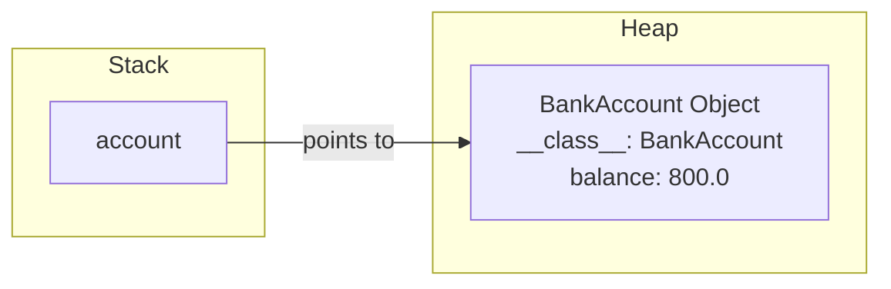

# 01 - Object-Oriented Programming

> **Phase:** 1 (Foundations) · **Time:** ~3–4 weeks · **Difficulty:** ⭐⭐

## What it is
**Object-Oriented Programming (OOP)** is a style of organizing code around **objects** — bundles of *data* (fields/attributes) and *behavior* (methods/functions) that represent real-world things or concepts.

Instead of writing long lists of functions and variables, you model your program as interacting objects: a `User`, a `BankAccount`, a `Car`.

### Code Execution Trace: Procedural vs OOP

**Procedural Approach:**
```python
# Procedural
balance = 1000
def withdraw(amount, current_balance):
    return current_balance - amount

balance = withdraw(200, balance)
```

**OOP Approach (Python 3.12+):**
```python
class BankAccount:
    def __init__(self, initial_balance: float):
        self.balance = initial_balance
        
    def withdraw(self, amount: float) -> None:
        if amount <= self.balance:
            self.balance -= amount

account = BankAccount(1000.0)
account.withdraw(200.0)
```
*Trace:* When `account.withdraw(200.0)` is called, `self` points to the specific `account` instance, allowing the method to modify the `balance` attached to that object directly.

### Memory Allocation Diagram


## Why it matters
- The dominant paradigm in industry (Java, C++, Python, C#, Swift).
- Lets you **scale** code: big systems stay manageable when split into clear objects.
- Frameworks (React, Spring, Django) assume you understand classes/objects.
- Enables **reuse** through inheritance and **safety** through encapsulation.

## The 4 pillars — detailed

### 1. Encapsulation
- Hiding internal state; exposing only what's needed via methods.
- Example: a `BankAccount` keeps `balance` private and only changes it through `deposit()` / `withdraw()`.

```python
class BankAccount:
    def __init__(self):
        self._balance = 0.0  # protected attribute
    
    def deposit(self, amount: float):
        if amount > 0:
            self._balance += amount
```

### 2. Abstraction
- Showing the *essential* features, hiding complex internals.
- A `Car.start()` method — you don't need to know the engine internals.

### 3. Inheritance
- A class (**child/subclass**) extends another (**parent/superclass**) and reuses its code ("is-a" relationship).
- `Dog extends Animal` → Dog gets `eat()` for free, adds `bark()`.

### 4. Polymorphism
- One interface, many implementations.
- A `shape.draw()` call behaves differently for `Circle` vs `Square`.

```python
from typing import override

class Animal:
    def speak(self) -> str:
        return "Generic sound"

class Dog(Animal):
    @override
    def speak(self) -> str:
        return "Woof!"

def make_sound(animal: Animal):
    print(animal.speak())

make_sound(Dog()) # Output: Woof!
```

## Key vocabulary
- **Class** = blueprint (e.g., `class Dog:`).
- **Object / Instance** = a concrete thing created from the class (`my_dog = Dog()`).
- **Constructor** = special method that runs when an object is created (`__init__` in Python).
- **`self` / `this`** = reference to the current object.
- **Static vs instance** methods.

## Interactive Practice Exercise
**Task:** Build a `Library` system using Python 3.12 syntax.
1. Define a `Book` class with `title`, `author`, and `is_checked_out` attributes.
2. Define a `Library` class that holds a list of `Book` objects.
3. Add a method `checkout_book(title: str)` that finds a book and sets `is_checked_out` to `True`.

*Try writing this in your local Python environment! Use `mypy` to verify your type hints.*

## Common mistakes
- Making everything a getter/setter with no behavior (anemic objects).
- Inheritance when **composition** ("has-a") fits better.
- Giant "God" classes doing too much.

## Free resources
- **GeeksforGeeks — OOP concepts**: https://www.geeksforgeeks.org/object-oriented-programming-oops-concept-in-cpp/
- **freeCodeCamp — OOP in Python/Java** (YouTube).
- **Refactoring Guru — OOP patterns explained visually**: https://refactoring.guru/

## Next
→ [[02 - Data Structures & Algorithms]]
