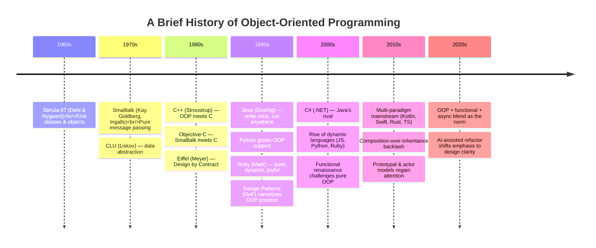
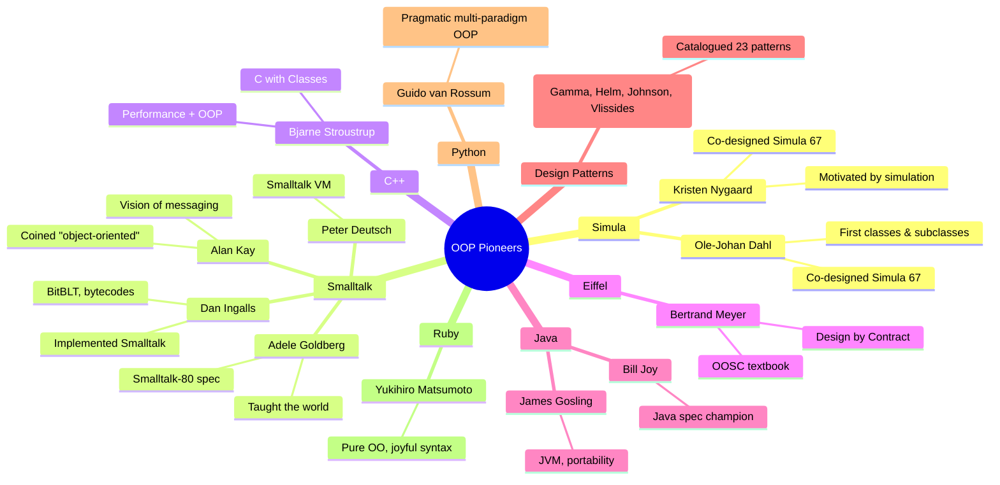

# History of Object-Oriented Programming

> [!note] Why study the history?
> OOP didn't arrive fully formed — it accreted over 60 years through a series of attempts to model **the real world in code**. Knowing the lineage tells you *why* modern OOP looks the way it does, *which* ideas got distorted in translation, and *which* debates were never actually settled.

This file traces the journey from a Norwegian simulation project in the 1960s to today's multi-paradigm languages, and along the way introduces the people who shaped the field.

---

## 1. The Big Picture: A 60-Year Arc



The arc has three great eras:

1. **1960s–70s — Birth.** OOP is invented as a *simulation tool*, then reconceived as a *general-purpose philosophy*.
2. **1980s–90s — Mainstreaming.** C++ and Java carry OOP into industry; the GUI era makes it the default.
3. **2000s–present — Synthesis.** Functional ideas re-enter; pure class hierarchies fall out of favour; multi-paradigm becomes the norm.

---

## 2. The Beginning: Simula (1962–1967)

### The problem that birthed OOP

In the early 1960s, **Kristen Nygaard** and **Ole-Johan Dahl** at the Norwegian Computing Center in Oslo needed to *simulate* real-world systems: ships entering a harbour, customers at a bank teller, machines on a factory floor. Existing languages forced them to represent everything as numbers and procedures — awkward for entities with identity, state, and behaviour.

Their first attempt, **Simula I** (1962), added "activities" to ALGOL 60. But the breakthrough came with **Simula 67**, which introduced:

- **Classes** — templates describing a category of objects.
- **Objects** — instances of classes with their own state.
- **Subclasses / inheritance** — extending a class to specialise it.
- **Virtual procedures** — early polymorphism (a precursor to dynamic dispatch).
- **Coroutines** — objects that could pause and resume each other.

> [!tip] The accidental discovery
> Nygaard and Dahl weren't trying to invent a "paradigm." They were trying to **make simulations easier to write**. The class/object idea was so effective that it generalised far beyond simulation. Many of the terms we use today — `class`, `object`, `instance`, `subclass` — are Simula's vocabulary.

### A Simula snippet (paraphrased)

```
Begin Class Animal(Name); Text Name;
Begin
  Procedure Speak;
    OutText("...silence...");
End;

Animal Class Dog;
Begin
  Procedure Speak;
    OutText("Woof!");
End;

Ref(Animal) a; Ref(Dog) d;
d :- New Dog("Rex");
d.Speak;  ! prints "Woof!" — late binding !;
```

Notice: a `Dog` *is an* `Animal`, and `Speak` is *dynamically dispatched*. These two ideas — **inheritance** and **polymorphism** — were already present in 1967.

> [!note] Why doesn't everyone use Simula today?
> Simula was slow for production code, ran on expensive hardware, and was tied to European academic circles. But it was the **direct inspiration** for both Smalltalk (Kay read the Simula papers) and C++ (Stroustrup explicitly cites Simula as the model).

---

## 3. Alan Kay and Smalltalk (1970s)

### The vision

In 1966–67, a young American researcher named **Alan Kay** at the University of Utah read the Simula papers and had an epiphany. He saw that the *computer itself* could be imagined as a **society of objects**, each one a little autonomous computer sending messages to the others.

Kay joined the Xerox Palo Alto Research Center (PARC) and, with **Dan Ingalls**, **Adele Goldberg**, **Peter Deutsch**, and others, built **Smalltalk** over the 1970s. Smalltalk-72, Smalltalk-74, and Smalltalk-80 progressively refined the ideas.

Kay coined the term **"object-oriented programming"** around 1967. His vision had three commitments:

1. **Everything is an object.** Numbers, booleans, classes themselves — all objects.
2. **All computation is message passing.** No object reaches into another's state. You can only ask.
3. **Late binding everywhere.** The receiver decides at runtime how to respond.

### What "message passing" really meant

In Smalltalk, `3 + 4` is parsed as: send the message `+` with argument `4` to the object `3`. The integer object `3` decides how to handle the message — typically returning a new integer `7`.

```smalltalk
Transcript show: (3 + 4) asString.   "Prints 7"
```

There is no `+` operator in the C sense; it's a method call on the receiver. This **uniformity** is what Kay considers the soul of OOP.

> [!warning] What most languages lost
> Modern Java/C#/Python use *method calls* — essentially compiled function dispatch. Kay's vision was *message passing*: the receiver can refuse, forward, queue, or reinterpret the message. Objective-C's `performSelector:` and Ruby's `method_missing` are closer to Kay's idea. Erlang actors are, in some ways, the truest spiritual descendant.

### The Smalltalk-80 legacy

Smalltalk-80 also gave the world:

- A **graphical development environment** with windows, menus, and a mouse — directly inspiring the Apple Lisa and Macintosh.
- **Live programming**: change a method, hit accept, the running program updates without recompilation.
- The **MVC (Model-View-Controller)** pattern for UIs.
- A culture of **pure OOP** that influenced Ruby, Objective-C, and to a degree Python's "everything is an object" philosophy.

### Adele Goldberg: the practical voice

**Adele Goldberg** was instrumental in turning Kay's vision into a working system and a teachable curriculum. She co-wrote *Smalltalk-80: The Language and its Implementation* (the "Blue Book"), which became the blueprint other language designers studied. She also famously resisted Steve Jobs's request to demo Smalltalk to Apple — Xerox management overrode her, and the demo shaped the Macintosh.

---

## 4. The 1980s: OOP Meets Industry

### Bjarne Stroustrup and C++ (1979–1985)

In 1979, Danish computer scientist **Bjarne Stroustrup** at Bell Labs wanted Simula's modelling power but with C's performance. He built "C with Classes," which became **C++** in 1985.

C++ was a *pragmatic* compromise: it added classes, inheritance, virtual functions (polymorphism), templates (generic programming), and RAII (resource management) — but kept C's low-level control and the ability to fall back to procedural code. This made OOP available to existing C codebases without a rewrite.

```cpp
class Shape {
public:
    virtual double area() const = 0;   // pure virtual — abstract method
    virtual ~Shape() {}
};

class Circle : public Shape {
    double r;
public:
    Circle(double r) : r(r) {}
    double area() const override { return 3.14159 * r * r; }
};
```

C++'s success was enormous: it became the language of systems programming, game engines, finance, and embedded systems through the 1990s and 2000s.

> [!note] The cost of pragmatism
> C++ inherited C's footguns (manual memory management, pointer arithmetic) and bolted OOP on top. This produced decades of subtle bugs (slicing, virtual destructor misses, memory leaks). Java and later languages responded by removing those footguns.

### Objective-C (1984)

Brad Cox and Tom Love combined C with Smalltalk's message-passing semantics. Objective-C's bracket syntax `[receiver message:arg]` is a literal echo of Smalltalk. It became the basis for NeXTSTEP, then macOS and iOS — until Swift replaced it in 2014.

### Eiffel and Design by Contract (1986)

Bertrand Meyer's **Eiffel** brought rigorous *formalism* to OOP: preconditions, postconditions, invariants. His book *Object-Oriented Software Construction* (1988) remains one of the deepest theoretical treatments of OOP.

### The Common Lisp Object System (CLOS, 1988)

Lisp got its OOP layer late, but with style: **multiple dispatch** (methods chosen by the types of *all* arguments, not just the receiver), **multimethods**, and the **Metaobject Protocol** — arguably the most powerful object system ever standardised.

---

## 5. The 1990s: OOP Becomes the Default

### Java (1995)

In 1991, James Gosling's team at Sun Microsystems began work on "Oak," intended for interactive television. When that market didn't materialise, they repurposed it for the Web, and in 1995 **Java** launched with the slogan *"Write Once, Run Anywhere."*

Java's design choices were deliberate reactions to C++:

- **No manual memory management** — a garbage collector reclaims objects.
- **No multiple inheritance** — interfaces instead, to avoid the diamond problem.
- **No pointers** — references only.
- **Platform-neutral bytecode** running on the JVM.

Java's timing was perfect: the Internet was booming, enterprises wanted portable code, and the JVM made "deploy everywhere" plausible. Java became the *lingua franca* of enterprise software, education, and Android (until Kotlin's rise).

### The Design Patterns canon (1994)

Erich Gamma, Richard Helm, Ralph Johnson, and John Vlissides — the "Gang of Four" — published *Design Patterns: Elements of Reusable Object-Oriented Software*. They catalogued 23 recurring OOP idioms (Singleton, Observer, Strategy, Factory, Decorator, …) and gave the industry a shared vocabulary. See [[design-patterns]] for the deep dive.

> [!tip] A double-edged sword
> Design Patterns gave OOP practitioners a common language — but also a generation of over-enthusiastic developers who applied patterns *everywhere*, producing "enterprise" code with seven layers of abstract factories for a "Hello, World." Patterns are tools, not commandments.

### The GUI era and OOP's symbiosis with it

The 1990s were also the decade of the **graphical user interface**: Windows 95, the Mac, Motif, later the Web. GUIs are *naturally* object-oriented — there are Windows, Buttons, Menus, each with state and behavior, organised in inheritance trees (`Button` extends `Widget`). OOP and GUIs reinforced each other: GUIs made OOP obvious, and OOP made GUIs buildable.

### Python grows up (1990s → 2000s)

**Guido van Rossum** released Python in 1991. From the start, Python had classes — but early Python's object model was quirky (old-style vs new-style classes, no `super()`-friendly MRO). Python 2.2 (2001) introduced **new-style classes** unifying types and classes — *everything* became an object, even `int` and `type`. Python 3 (2008) cleaned this up further.

Python's OOP is multi-paradigm and dynamic: no enforced encapsulation (just conventions like `_private`), duck typing for polymorphism, and first-class functions that interact smoothly with methods. See [[python-oop-mechanics]] for details.

### Ruby (1995)

**Yukihiro "Matz" Matsumoto** designed Ruby to be "more powerful than Perl, more object-oriented than Python." Every value in Ruby — including numbers — is an object with methods (`3.times { puts "hi" }`). Ruby's `method_missing` and open classes bring it close to Kay's vision of message passing.

---

## 6. The 2000s: Multi-Paradigm Mainstream

### C# and .NET (2002)

Microsoft's C# was Java's spiritual sibling with language-design lessons learned (properties, events, later LINQ, async, and pattern matching). The .NET framework and Visual Studio made C# the dominant enterprise language on Windows.

### The dynamic language renaissance

In the mid-2000s, **JavaScript**, **Python**, and **Ruby** surged. JavaScript (Brendan Eich, 1995) is *prototype-based* — objects inherit directly from other objects rather than from classes. ES6 (2015) added `class` syntax, but the underlying prototype model remains.

> [!note] Classes vs prototypes
> - **Class-based**: Java, C++, Python, Ruby, Swift. Objects are created from a class template.
> - **Prototype-based**: JavaScript, Self, Io. Objects are created by cloning other objects.
> Self (1987, Xerox/PARC) inspired JavaScript and showed that you don't need classes to have OOP.

### The functional renaissance

As multicore CPUs spread, developers rediscovered functional programming's strengths: immutability, pure functions, easy parallelism. Languages like **Haskell**, **Scala**, **F#**, **Clojure**, and **Erlang** showed that you could build huge systems without deep class hierarchies. Mainstream OOP languages responded by absorbing functional features:

- C# → LINQ, `async`, records
- Java → streams, lambdas
- Python → comprehensions, `dataclasses`, type hints
- JavaScript → arrow functions, `map`/`filter`/`reduce`
- C++ → lambdas, `std::function`, ranges

Today, the line between "OOP" and "functional" is fuzzy in practice. See [[paradigm-comparison]].

---

## 7. The 2010s–2020s: Synthesis and Critique

### Composition over inheritance

The 2010s saw a strong backlash against deep inheritance hierarchies (the "banana/gorilla/jungle" critique from Joe Armstrong of Erlang). Best practice shifted toward:

- **Composition**: build objects from other objects rather than inheriting.
- **Interfaces / protocols** (Java interfaces, Python `Protocol`, Go interfaces, Rust traits): prefer *behavior* contracts over *type* hierarchies.
- **Favor immutability** where practical (Java records, Kotlin `data class`, Python `dataclass(frozen=True)`).

See [[composition-over-inheritance]] for the full argument.

### Modern languages blend paradigms

| Language (year) | OOP style | Notable additions |
|---|---|---|
| **Kotlin** (2011) | JVM, Java-compatible | Null safety, data classes, coroutines |
| **Swift** (2014) | Apple platforms | Protocols, value types, `async/await` |
| **Rust** (2010) | Not OOP, but borrows ideas | Traits, no inheritance, ownership |
| **TypeScript** (2012) | Structural typing | Interfaces + types + classes coexist |
| **Go** (2009) | Anti-inheritance | Interfaces, composition, goroutines |
| **Julia** (2012) | Multiple dispatch (CLOS-like) | No classes, but rich type system |

### The actor model revival

Alan Kay's "objects as little computers sending messages" has a direct descendant in the **actor model** (Hewitt, 1973), revived in Erlang/Akka/Akka.NET. Microservices and concurrent systems increasingly use message-passing patterns — proving Kay's intuition about isolation and messaging was right, even if class-based OOP didn't fully embrace it.

---

## 8. Key People



### One-line bios

- **Kristen Nygaard (1926–2002)** — Norwegian mathematician; co-designer of Simula. Politically active, championed "Scandinavian style" OOP. Won the 2001 Turing Award with Dahl.
- **Ole-Johan Dahl (1931–2002)** — Norwegian computer scientist; the principal technical architect of Simula. Co-winner of the 2001 Turing Award.
- **Alan Kay (1940–)** — American computer scientist; coined "object-oriented," led Smalltalk at Xerox PARC, also pioneered the Dynabok (tablet computer vision). Turing Award 2003.
- **Dan Ingalls** — Principal implementer of Smalltalk; invented BitBLT (the graphics operation that made windowing practical) and just-in-time compilation for Smalltalk bytecode.
- **Adele Goldberg (1945–)** — Key Smalltalk developer and evangelist; prevented Apple from "borrowing" too much (mostly); wrote the canonical Smalltalk-80 books.
- **Bjarne Stroustrup (1950–)** — Danish computer scientist at Bell Labs; designed C++ to bring Simula's modeling power to systems programming.
- **Bertrand Meyer (1950–)** — French computer scientist; designed Eiffel and formulated Design by Contract; author of *Object-Oriented Software Construction*.
- **James Gosling (1955–)** — Canadian computer scientist at Sun Microsystems; "father of Java."
- **Guido van Rossum (1956–)** — Dutch programmer; creator of Python; its "Benevolent Dictator for Life" until 2018.
- **Yukihiro "Matz" Matsumoto (1965–)** — Japanese software engineer; creator of Ruby; champion of programmer happiness.
- **The Gang of Four** — Erich Gamma, Richard Helm, Ralph Johnson, John Vlissides; authors of *Design Patterns* (1994).

---

## 9. Milestones Table

| Year | Event | Significance |
|---:|---|---|
| 1962 | Simula I released | First object-like constructs for simulation |
| 1967 | **Simula 67** published | Classes, objects, inheritance, virtual dispatch — *the birth of OOP* |
| 1967 | Alan Kay coins "object-oriented" | Names the paradigm |
| 1972 | Smalltalk-72 at Xerox PARC | First pure OOP language |
| 1976 | CLU (Barbara Liskov) | Data abstraction, iterators — abstract data types |
| 1980 | **Smalltalk-80** released | Pure message passing, integrated IDE, MVC |
| 1981 | Objective-C created | Smalltalk-style messaging in C |
| 1983 | "C++" name adopted | OOP enters systems programming |
| 1985 | C++ 1.0 ships | Mainstream OOP on Unix workstations |
| 1986 | Eiffel released | Design by Contract |
| 1988 | CLOS standardised | Multiple dispatch, metaobject protocol |
| 1991 | Python 0.9 released | Pragmatic multi-paradigm OOP |
| 1993 | Ruby released | Pure OO, dynamic, joyful |
| 1994 | *Design Patterns* published | GoF canonises 23 patterns |
| 1995 | **Java 1.0** released | Write-once-run-anywhere; enterprises adopt OOP |
| 1995 | JavaScript released | Prototypal OOP for the browser |
| 2001 | C# / .NET released | Microsoft's enterprise OOP answer |
| 2001 | Python 2.2 new-style classes | Everything is an object; unified type system |
| 2006 | Ruby on Rails popularises MVC | Convention-over-configuration OOP web apps |
| 2008 | Python 3.0 | Cleanup of class semantics |
| 2011 | Kotlin project starts | Modern JVM OOP |
| 2014 | Swift released | Protocol-oriented programming |
| 2014 | Akka popularises actor model | Kay's messaging vision, revived |
| 2015 | JavaScript ES6 adds `class` | Class syntax over prototypes |
| 2018 | Java 10 `var`, Java 14 records | Java absorbs modern features |
| 2020s | Multi-paradigm default | OOP + functional + async blend everywhere |

---

## 10. Why OOP Won (and What That Means)

OOP didn't dominate because of theoretical superiority — it dominated because of a confluence of practical forces:

1. **GUIs in the 1990s** made the object metaphor visceral. Every button was a Button.
2. **Java's portability** let enterprises standardise on one language across platforms.
3. **Enterprise frameworks** (J2EE, Spring, .NET) optimised tooling, libraries, and hiring around OOP.
4. **Universities taught it** — by 2000, the ACM curriculum centred on Java, and a generation of programmers grew up thinking "programming = OOP."
5. **Design Patterns** gave practitioners a shared vocabulary that made large-scale collaboration feasible.

> [!warning] The pendulum swings
> By the 2010s, "OOP is bad" became a fashionable take — critics pointed to bloated enterprise codebases, fragile inheritance trees, and the "banana/gorilla/jungle" problem. The truth is more nuanced: **bad OOP is bad**; **good OOP — focused on messaging, encapsulation, and humble interfaces — remains one of the best tools we have for managing complexity.** Today's best systems use OOP *where it fits* and reach for functional, data-oriented, or actor-based ideas where *those* fit.

---

## 11. Key Takeaways

- **OOP began with Simula 67** (Dahl & Nygaard), invented to make simulations easier to write.
- **Alan Kay coined the term "object-oriented"** and led Smalltalk, where the *real* vision was **messaging**, not classes.
- **C++ (Stroustrup)** brought OOP to systems programming; **Java** brought it to enterprise; **Python** and **Ruby** made it dynamic.
- **Design Patterns (1994)** gave the industry a shared vocabulary — and a warning about over-application.
- **The 2010s brought a composition-over-inheritance turn**, and today's best code blends OOP with functional, data-oriented, and actor ideas.
- **The Turing Award winners** for OOP — Dahl, Nygaard, Kay — deserve to be known by name.

---

## 12. Practice Exercises

### Exercise 1 — Trace the lineage
Pick three features of Python's OOP (`class`, `self`, duck-typed polymorphism) and trace each back to its originating language (Simula, Smalltalk, etc.). Write one sentence per feature.

### Exercise 2 — Compare messages and method calls
In Smalltalk, `account deposit: 50` is a *message*. In Python, `account.deposit(50)` is a *method call*. List three concrete differences in what the *receiver* can do (refuse? forward? introspect?) between a pure message-passing model and Python's model. Hint: investigate Ruby's `method_missing` and Python's `__getattr__`.

### Exercise 3 — The banana/gorilla/jungle
Joe Armstrong (Erlang) famously said: *"The problem with object-oriented languages is they've got all this implicit environment that they carry around with them. You wanted a banana but what you got was a gorilla holding the banana and the entire jungle."* Explain what he meant, using a concrete Python example of inheritance gone wrong. How does composition ([[composition-over-inheritance]]) address his critique?

### Exercise 4 — Language archaeology
Pick any modern OOP language you use (Kotlin, Swift, TypeScript, C#, etc.). Find three features whose design was directly influenced by earlier OOP languages. Cite the source language for each. Example: *TypeScript's structural typing* descends from *ML's module system and Self's prototype model*.

### Exercise 5 — Time-travel debate
Imagine you could send one paragraph of advice back to Alan Kay in 1970. What would you tell him about how his idea would actually play out over the next 50 years? Aim for honest, specific, surprising advice — not flattery.

---

## 13. Where to Go Next

- [[what-is-oop]] — The conceptual foundations this history depends on.
- [[paradigm-comparison]] — How OOP compares to procedural and functional styles.
- [[core-concepts-overview]] — The four pillars and a glossary.
- [[encapsulation]] — The pillar Alan Kay cared about most.
- [[polymorphism]] — The feature Simula got right from day one.
- [[composition-over-inheritance]] — The modern reaction to the 1990s inheritance-heavy style.
