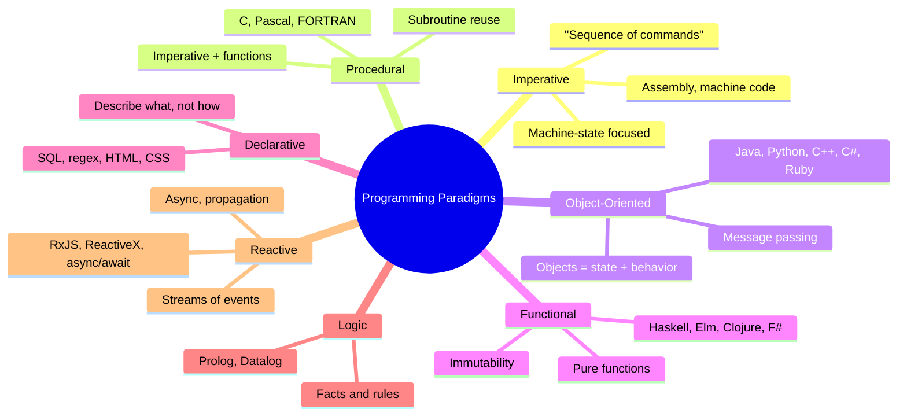
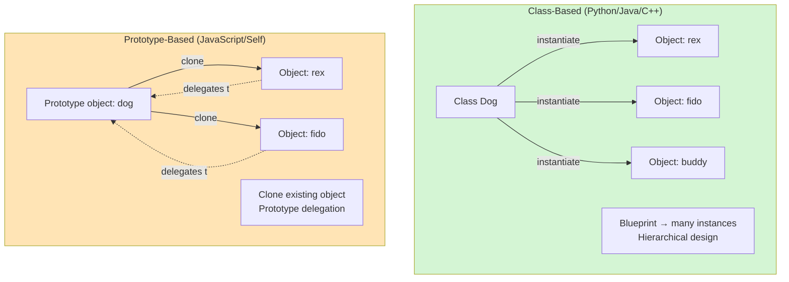
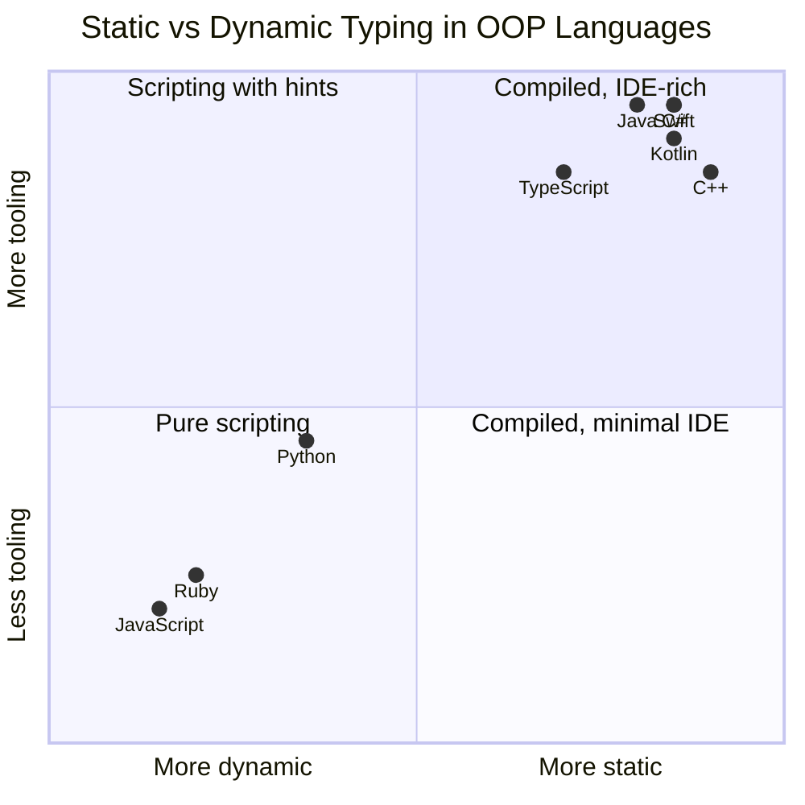
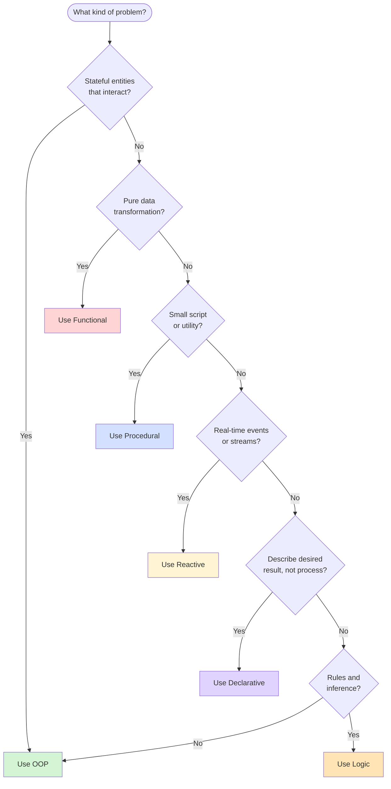
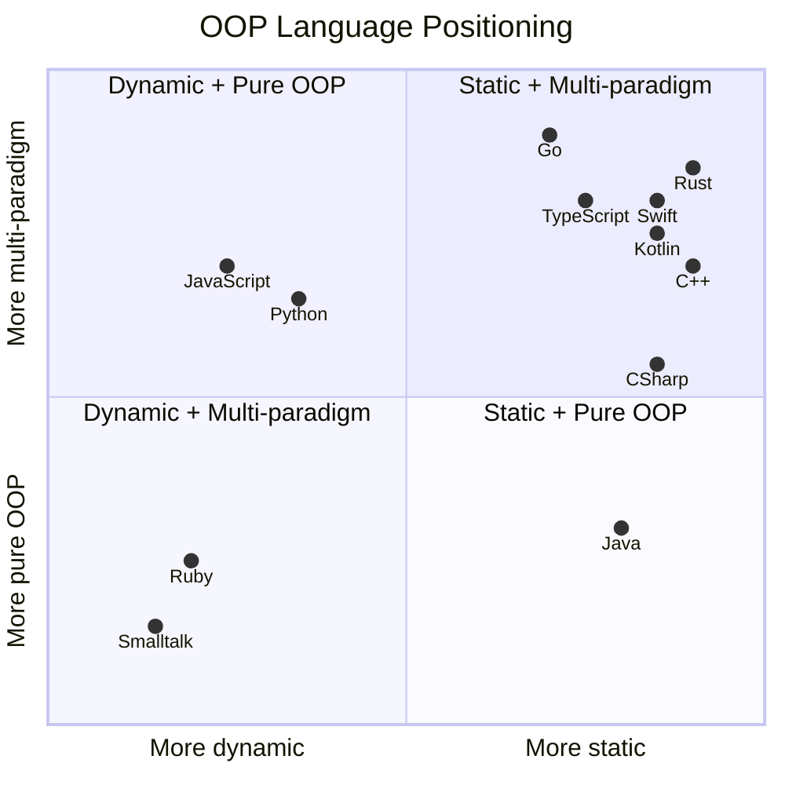

# OOP in the Landscape of Programming Paradigms

#oop #foundations #paradigms #comparison #teaching

> [!quote] Michael Fellinger
> "A programming paradigm is not a language, it's a way of thinking. Languages merely encourage or discourage certain ways of thinking."

Object-Oriented Programming is one paradigm among many. To truly understand OOP, you have to see it *in context* — alongside functional, procedural, declarative, logic, and reactive paradigms — and you have to understand the *internal variations* of OOP itself: class-based vs prototype-based, static vs dynamic, single vs multiple dispatch, pure vs multi-paradigm.

This note is a guided tour of that landscape.

---

## 1. What Is a Programming Paradigm?

A **programming paradigm** is a *way of thinking about computation*. It is a set of assumptions, idioms, and mental models that shape how you decompose a problem into code.

> [!info] Definition
> A paradigm is a *worldview* — a fundamental answer to the question "what is a program?" Different paradigms give different answers:
>
> - **Imperative**: a program is a *sequence of commands* that change the machine's state
> - **Functional**: a program is a *mathematical function* that transforms inputs to outputs
> - **Logic**: a program is a *set of facts and rules* from which conclusions can be derived
> - **Object-Oriented**: a program is a *community of objects* that send messages to each other
> - **Declarative**: a program is a *description of what should be true*, leaving the "how" to the system

### 1.1 Paradigms Are Not Languages

A single language can support many paradigms. Python supports procedural, OOP, and functional styles. JavaScript supports OOP (prototype-based), functional, and reactive. Rust supports OOP (trait-based), functional, and systems programming. The *language* nudges you toward certain paradigms, but it does not *determine* your paradigm.

> [!warning] Common Student Misconception
> "Language = paradigm." No. You can write functional code in C (with discipline), procedural code in Java (with static methods), and OOP code in C (with structs and function pointers). The language makes some paradigms *easier*; the programmer chooses which to use.

### 1.2 Paradigms Are Not Mutually Exclusive

Modern programming is overwhelmingly *multi-paradigm*. A typical Python web app might use:
- OOP for domain models (a `User` class, an `Order` class)
- Functional transformations in data pipelines (`map`, `filter`, `reduce`)
- Reactive streams for real-time updates (async generators)
- Declarative queries for the database (SQL or ORM querysets)

The paradigms combine productively. The dogma that "OOP and functional are enemies" is a relic of the 1990s language wars; modern engineers use both.

---

## 2. The Major Paradigms

Let's walk through the seven major paradigms, with Python examples for each.

### 2.1 Imperative

> The program is a sequence of commands that change machine state.

Imperative programming is the oldest paradigm — it's what assembly language gives you. You tell the computer *exactly what to do*, step by step.

```python
# Imperative: sum the numbers 1..10
total = 0
i = 1
while i <= 10:
    total += i
    i += 1
print(total)  # 55
```

Imperative code is *how* the computer actually executes things. All other paradigms eventually compile or interpret down to imperative machine code.

### 2.2 Procedural

> Imperative programming organized into named, reusable procedures (functions).

Procedural programming is *imperative + functions*. It was the dominant paradigm from the 1960s through the 1980s (FORTRAN, COBOL, Pascal, C).

```python
# Procedural: same problem, organized into functions
def sum_range(start: int, end: int) -> int:
    total = 0
    for i in range(start, end + 1):
        total += i
    return total

print(sum_range(1, 10))  # 55
```

Procedural code is still how most small scripts and system utilities are written. It's simple, direct, and sufficient for problems that don't have many interacting entities.

### 2.3 Object-Oriented

> Imperative programming organized around objects (state + behavior).

OOP keeps the imperative core but reorganizes the program around *objects* — bundles of state and behavior that collaborate via messages.

```python
# Object-Oriented: same problem, modeled as a Range object
class NumberRange:
    def __init__(self, start: int, end: int) -> None:
        if start > end:
            raise ValueError("start must be <= end")
        self.start = start
        self.end = end

    def sum(self) -> int:
        total = 0
        for i in range(self.start, self.end + 1):
            total += i
        return total

    def __iter__(self):
        return iter(range(self.start, self.end + 1))

r = NumberRange(1, 10)
print(r.sum())  # 55
print(list(r))  # [1, 2, 3, 4, 5, 6, 7, 8, 9, 10]
```

For a sum-of-range problem, OOP is overkill — that's the honest truth. OOP pays off when the problem has *many stateful entities interacting*, not when it's a one-shot calculation.

### 2.4 Functional

> Programs are compositions of pure functions, with no side effects and no mutable state.

Functional programming comes from LISP and lambda calculus. Its core ideas:

- **Pure functions** — same input always produces same output, no side effects
- **Immutability** — data structures don't change; you create new ones
- **Higher-order functions** — functions that take or return functions
- **Lazy evaluation** — compute only when needed
- **Algebraic data types** — sum types and product types

```python
# Functional: same problem, no mutation
from functools import reduce

def sum_range(start: int, end: int) -> int:
    return reduce(lambda a, b: a + b, range(start, end + 1), 0)

print(sum_range(1, 10))  # 55

# More idiomatic Python functional style
def sum_range_pythonic(start: int, end: int) -> int:
    return sum(range(start, end + 1))
```

Functional shines for data transformation pipelines, parallel computation (no shared state = no race conditions), and testability (pure functions are trivially testable).

### 2.5 Declarative

> Describe *what* you want, not *how* to compute it.

Declarative programming includes SQL, regular expressions, HTML, CSS, Prolog, and configuration languages like YAML. You specify the desired result; the system figures out how to achieve it.

```python
# Declarative: SQL query
"""
SELECT name, salary FROM employees
WHERE department = 'Engineering'
ORDER BY salary DESC
LIMIT 10;
"""

# Declarative: Python comprehension
top_engineers = [
    emp.name for emp in employees
    if emp.department == "Engineering"
][:10]
```

The SQL example doesn't tell the database *how* to scan or sort — it just describes the result. The Python list comprehension is similar: you describe the shape of the output, not the loop mechanics.

### 2.6 Logic

> Programs are sets of facts and rules; the system derives conclusions.

Logic programming (Prolog, Datalog) is rare in industry but powerful for certain domains: rule engines, type checkers, expert systems, and constraint satisfaction.

```prolog
% Prolog — facts and rules
parent(tom, bob).   % tom is a parent of bob
parent(bob, alice).

ancestor(X, Y) :- parent(X, Y).
ancestor(X, Y) :- parent(X, Z), ancestor(Z, Y).

% Query: who are alice's ancestors?
% ?- ancestor(X, alice).
% X = bob ;
% X = tom.
```

You don't write a search algorithm; you write the *relationship* and Prolog searches for you.

### 2.7 Reactive

> Programs are streams of events processed asynchronously.

Reactive programming (popularized by RxJS, RxJava, ReactiveX, and modern async/await) treats values as *streams over time*. You define how streams combine and transform; the system handles propagation.

```python
# Reactive: Python async generators
import asyncio

async def numbers(start: int, end: int):
    """An async stream of numbers."""
    for i in range(start, end + 1):
        await asyncio.sleep(0.01)
        yield i

async def sum_stream():
    total = 0
    async for n in numbers(1, 10):
        total += n
    print(total)  # 55

asyncio.run(sum_stream())
```

Reactive is dominant in UI programming, real-time systems, and event-driven backends.



---

## 3. Internal Variations of OOP

OOP itself has many sub-flavors. Two OOP programs can look radically different depending on which sub-paradigm the language follows.

### 3.1 Class-Based vs Prototype-Based

This is the biggest split inside OOP.

#### Class-Based OOP

In **class-based** OOP, you define a *class* (a blueprint), and then instantiate *objects* from that class. Every object has a class; classes are distinct from objects.

Languages: Java, C++, C#, Python, Ruby, Swift, Kotlin.

```python
# Python (class-based)
class Dog:
    def __init__(self, name):
        self.name = name

    def bark(self):
        return f"{self.name} says Woof!"

rex = Dog("Rex")
print(rex.bark())  # Rex says Woof!
print(type(rex))   # <class '__main__.Dog'>
```

#### Prototype-Based OOP

In **prototype-based** OOP, there are no classes. You create an object directly, and new objects are created by *cloning* (or *prototyping*) an existing object. The original is called the **prototype**.

Languages: JavaScript, Self, Io, Lua (via metatables), NewtonScript.

```javascript
// JavaScript (prototype-based)
const dog = {
    bark() { return `${this.name} says Woof!`; }
};

const rex = Object.create(dog);  // clone the prototype
rex.name = "Rex";
console.log(rex.bark());  // "Rex says Woof!"
console.log(Object.getPrototypeOf(rex) === dog);  // true
```

The `rex` object doesn't have a `bark` method of its own — it delegates to its prototype `dog`. If you add a method to `dog`, every clone immediately sees it.

#### Why the Difference Matters

Class-based OOP emphasizes *design up front*: you think hard about your class hierarchy before writing code. Prototype-based OOP emphasizes *experimentation*: you create one object, see if it works, then clone it when you need more.

ES6 added the `class` keyword to JavaScript, but it's *syntactic sugar* over the prototype system. Underneath, JavaScript is still prototype-based.



> [!tip] Teaching Tip
> Show students both versions of the same program — once in Python (class-based) and once in JavaScript (prototype-based). The contrast makes the *concept* of OOP clearer than either alone: OOP is about *objects*; classes are one mechanism for creating them.

### 3.2 Static vs Dynamic OOP

This axis is about *when types are checked*.

#### Static OOP

In **statically typed** OOP, every variable has a type known at compile time. The compiler checks that you only call methods that exist on that type.

Languages: Java, C++, C#, Swift, Kotlin, TypeScript (gradual).

```java
// Java (static)
Dog rex = new Dog("Rex");  // rex is declared as Dog
rex.bark();                  // OK — Dog has bark()
rex.meow();                  // Compile error — Dog has no meow()
```

Static typing catches errors early, enables better tooling (autocomplete, refactoring), and usually improves performance.

#### Dynamic OOP

In **dynamically typed** OOP, variables don't have types; *values* have types. Method calls are resolved at runtime.

Languages: Python, Ruby, JavaScript, Smalltalk.

```python
# Python (dynamic)
rex = Dog("Rex")  # rex has no declared type
rex.bark()          # OK at runtime
rex.meow()          # AttributeError at runtime (not at compile time)
```

Dynamic typing is more flexible and concise, but errors surface later (at runtime) and tooling is weaker.

#### Gradual Typing

Python's `typing` module and TypeScript bring *gradual typing*: you can add type annotations where they help, and leave them off where they don't.

```python
# Python with type hints (gradual)
def greet(name: str) -> str:
    return f"Hello, {name}!"

greet("Alice")  # OK
greet(42)       # Mypy warns, but Python runs it anyway
```



### 3.3 Single vs Multiple Dispatch

When you call `a.method(b)`, the *method* that runs is chosen based on the types of `a` and `b`. The question is: how many of those types does the language consider?

#### Single Dispatch

Most OOP languages use **single dispatch**: the method is chosen based only on the type of the *receiver* (`a`). The argument types (`b`) are not used for dispatch.

Languages: Python, Java, C++, C#, Ruby, JavaScript, Smalltalk.

```python
# Python — single dispatch
class Cat:
    def interact(self, other):
        return f"Cat meets {type(other).__name__}"

class Dog:
    def interact(self, other):
        return f"Dog meets {type(other).__name__}"

cat = Cat()
dog = Dog()
print(cat.interact(dog))  # "Cat meets Dog"
print(dog.interact(cat))  # "Dog meets Cat"
# But: what if I want behavior based on BOTH cat and dog?
```

#### Multiple Dispatch

**Multiple dispatch** (also called multimethods) chooses the method based on the types of *all* arguments. This is rare but powerful.

Languages: Common Lisp (CLOS), Julia, Dylan.

```julia
# Julia — multiple dispatch
interact(c::Cat, d::Dog) = "Cat hisses at Dog"
interact(d::Dog, c::Cat) = "Dog chases Cat"
interact(c1::Cat, c2::Cat) = "Cats ignore each other"

interact(Cat(), Dog())  # "Cat hisses at Dog"
interact(Dog(), Cat())  # "Dog chases Cat"
interact(Cat(), Cat())  # "Cats ignore each other"
```

The Julia version reads like a decision table. The Python equivalent would require nested `isinstance` checks or the **visitor pattern** — both awkward.

#### Python's `functools.singledispatch` — A Compromise

Python's standard library offers `singledispatch`, which dispatches on the *first argument's type*. It's a partial answer to multiple dispatch:

```python
from functools import singledispatch

@singledispatch
def interact(other):
    raise NotImplementedError

@interact.register
def _(other: Dog):
    return "Cat hisses at Dog"

@interact.register
def _(other: Cat):
    return "Cats ignore each other"
```

### 3.4 Single vs Multiple Inheritance

Can a class inherit from one parent, or from many?

#### Single Inheritance

Languages: Java, C#, Ruby, Swift, Smalltalk, Objective-C.

Java's designers deliberately rejected multiple inheritance to avoid the **diamond problem**: if `D` inherits from `B` and `C`, and both `B` and `C` inherit from `A`, which `A` does `D` get? Java solves this with **interfaces** (which can be multiple) and **abstract classes** (which can be single).

#### Multiple Inheritance

Languages: C++, Python, Eiffel, Common Lisp (CLOS).

Python uses the **C3 linearization** algorithm to resolve the diamond problem deterministically:

```python
class A:
    def hello(self):
        return "A"

class B(A):
    def hello(self):
        return "B"

class C(A):
    def hello(self):
        return "C"

class D(B, C):  # multiple inheritance
    pass

print(D().hello())  # "B" — MRO is D → B → C → A
print(D.__mro__)    # Shows the linearized method resolution order
```

> [!warning] The Diamond Problem
> Multiple inheritance is powerful but dangerous. Even with C3 linearization, you can produce designs where the inheritance order matters in subtle ways. Modern best practice prefers **composition** over multiple inheritance — see [[Composition-Over-Inheritance]].

### 3.5 Pure OOP vs Multi-Paradigm

#### Pure OOP

In **pure OOP** languages, *everything* is an object — including integers, booleans, classes, and code blocks. There are no free functions, no primitives, no exceptions to the object rule.

Languages: Smalltalk, Ruby.

```ruby
# Ruby — everything is an object
5.class            # => Integer
nil.class          # => NilClass
true.class         # => TrueClass
"hello".class      # => String
# Even Class is an object:
String.class       # => Class
Class.class        # => Class (yes, really)
```

#### Multi-Paradigm OOP

In **multi-paradigm** languages, OOP is one tool among many. You can use classes when they help, free functions when they help, and functional patterns when they help.

Languages: Python, JavaScript, Kotlin, Swift, Rust, C++, Scala.

```python
# Python — multi-paradigm
# Free function:
def greet(name): return f"Hello, {name}!"

# Class:
class Greeter:
    def __init__(self, name): self.name = name
    def greet(self): return f"Hello, {self.name}!"

# Functional pipeline:
names = ["Alice", "Bob", "Carol"]
greetings = list(map(greet, names))

# All three styles coexist in the same file with no friction.
```

> [!info] The Pragmatic View
> Pure OOP is intellectually elegant but can be verbose (everything must be a method on an object). Multi-paradigm is pragmatic: use the right tool for each task. Modern industry overwhelmingly favors multi-paradigm.

---

## 4. How Python Fits In

Python is one of the most paradigm-permissive languages ever designed. Let's pin down its specific OOP character.

### 4.1 Python's Paradigm Profile

| Aspect | Python's Choice |
|---|---|
| Primary paradigm | Multi-paradigm (OOP + procedural + functional) |
| OOP flavor | Class-based, dynamic, multi-paradigm |
| Typing | Dynamic, with gradual typing via `typing` |
| Dispatch | Single dispatch (with `singledispatch` as opt-in) |
| Inheritance | Multiple, with C3 MRO |
| Message passing | Implicit (method calls are message sends under the hood) |
| Everything is an object? | Almost — functions, classes, modules are objects; integers and strings are objects; but a few primitives are slightly optimized |
| Metaprogramming | First-class (metaclasses, descriptors, decorators) |

### 4.2 Python's Distinctive OOP Features

- **Duck typing**: no formal interface required; if an object has the right methods, it works.
- **Magic methods**: `__init__`, `__repr__`, `__add__`, etc., let user types behave like built-ins.
- **First-class classes**: classes are objects; you can pass them, return them, store them.
- **Metaclasses**: classes are instances of metaclasses; `type` is the default metaclass.
- **Descriptors**: the protocol powering `property`, `classmethod`, `staticmethod`.
- **Decorators**: a clean way to add behavior to classes and methods.
- **Dataclasses**: minimal-boilerplate data-holding classes.

```python
# Python showing off its multi-paradigm character
from dataclasses import dataclass
from typing import Callable
from functools import reduce

# OOP: a dataclass
@dataclass(frozen=True)
class Money:
    amount: float
    currency: str

    def plus(self, other: "Money") -> "Money":
        if self.currency != other.currency:
            raise ValueError("Currency mismatch")
        return Money(self.amount + other.amount, self.currency)

# Functional: pipeline of pure transformations
def sum_money(moneys: list[Money]) -> Money:
    return reduce(lambda a, b: a.plus(b), moneys)

# Procedural: a simple function
def print_total(total: Money) -> None:
    print(f"Total: {total.amount} {total.currency}")

# All three styles in one program
prices = [Money(10, "USD"), Money(20, "USD"), Money(5, "USD")]
print_total(sum_money(prices))  # Total: 35.0 USD
```

### 4.3 Python's Duck Typing — A Different Kind of Polymorphism

In Java or C#, polymorphism requires a shared interface or base class. In Python, it doesn't — any object with the right methods works:

```python
class Dog:
    def speak(self): return "Woof!"

class Cat:
    def speak(self): return "Meow!"

class Robot:
    def speak(self): return "BEEP."

# No common base class! No interface!
def make_speak(animals):
    for a in animals:
        print(a.speak())

make_speak([Dog(), Cat(), Robot()])
# Woof!
# Meow!
# BEEP.
```

> [!quote] Alex Martelli
> "Don't check whether it IS-a duck: check whether it QUACKS like a duck, WALKS like a duck, etc. ... In Python, you don't need an interface — you just call the method."

### 4.4 Abstract Base Classes in Python — When You Want Formal Interfaces

Python's `abc` module lets you formalize interfaces when you want to:

```python
from abc import ABC, abstractmethod

class Animal(ABC):
    @abstractmethod
    def speak(self) -> str:
        ...

class Dog(Animal):
    def speak(self) -> str:
        return "Woof!"

# Animal() would raise TypeError — can't instantiate abstract class
# Dog() works because it implements speak()
```

ABCs give you *some* of the safety of static interfaces, but at runtime, not compile time. They're most useful for documenting intent and enabling `isinstance` checks.

---

## 5. When Each Paradigm Wins

No paradigm is universally best. Here's a practical decision guide.

| Problem Type | Best Paradigm | Why |
|---|---|---|
| Small scripts (<200 lines) | Procedural | No ceremony, direct |
| System utilities (CLI tools) | Procedural | Direct, fast, readable |
| Large enterprise systems | OOP | Domain modeling, team coordination |
| UI / GUI applications | OOP + Reactive | Objects for components, events for interaction |
| Game engines | OOP (with ECS variant) | Entities with state and behavior |
| Data transformation pipelines | Functional | Pure functions compose, parallelize |
| Concurrent / parallel systems | Functional | No shared state = no races |
| Numerical / scientific computing | Functional + array ops | Vectorization outperforms method dispatch |
| Database queries | Declarative (SQL) | Describe what you want |
| Configuration | Declarative (YAML, TOML) | Static data |
| Rule engines, expert systems | Logic (Prolog, Datalog) | Rules and inference |
| Real-time event processing | Reactive | Streams propagate naturally |
| Compilers | Functional + OOP | AST = algebraic data type; visitors = objects |
| Web backends | Multi-paradigm (OOP domain + functional handlers) | Domain models + stateless handlers |
| Mobile apps | OOP (Swift/Kotlin) | UI components, lifecycle management |



---

## 6. Language Positioning — Where Modern Languages Sit



### Reading the Chart

- **Top-left (dynamic + multi-paradigm)**: Python, JavaScript — flexible, multi-style
- **Bottom-left (dynamic + pure OOP)**: Smalltalk, Ruby — everything is an object
- **Top-right (static + multi-paradigm)**: Swift, Rust, Kotlin — modern, safe, flexible
- **Bottom-right (static + pure-ish OOP)**: Java — strict class hierarchies, but loosening over time

The trend of the last decade is unmistakable: languages are moving **up and to the right** — toward static typing *and* multi-paradigm design. Pure OOP and pure dynamic typing are increasingly niche.

---

## 7. Comparing OOP Variations — A Synthesis Table

| Feature | Python | Java | C++ | JavaScript | Ruby | Swift | Rust | Go |
|---|---|---|---|---|---|---|---|---|
| Class-based | Yes | Yes | Yes | No (prototypes) | Yes | Yes | No (traits) | No (structs) |
| Static typing | No (gradual) | Yes | Yes | No (gradual via TS) | No | Yes | Yes | Yes |
| Multiple inheritance | Yes | No | Yes | No (mixins) | No (modules) | No (protocols) | No (traits) | No |
| Multiple dispatch | No (singledispatch) | No | No | No | No | No | No | No |
| Everything is an object | Mostly | No (primitives) | No | No | Yes | No (value types) | No | No |
| GC | Yes | Yes | Optional | Yes | Yes | ARC | Ownership | Yes |
| Interfaces | Duck typing + ABC | Yes | Abstract classes | No (informal) | Mixins | Protocols | Traits | Implicit interfaces |
| Pattern matching | Yes (3.10+) | Yes (21+) | No | No | Yes (case/when) | Yes | Yes | No |
| Async/await | Yes | Yes (virtual threads) | No (coroutines) | Yes | No (Fibers) | Yes | Yes (async) | Yes (goroutines) |

---

## 8. Common Student Misconceptions

> [!warning] Misconceptions About Paradigms
> 1. **"OOP and functional are opposites."** No — they're different *axes*. You can have functional OOP (Scala, Elixir) and pure OOP with functional features (Ruby with blocks).
> 2. **"JavaScript isn't really OOP because it has no classes."** JavaScript has always been OOP — it's just *prototype-based* OOP. ES6 `class` keyword is sugar over prototypes.
> 3. **"Python isn't really OOP because it has free functions."** Python is multi-paradigm *with first-class OOP*. Free functions are a feature, not a defect.
> 4. **"Statically typed languages are always safer."** Not necessarily — Python with `mypy` can catch the same errors as Java, with less ceremony.
> 5. **"Multiple inheritance is always bad."** It's *dangerous* but not *always* bad. Mixins (a restricted form of multiple inheritance) are widely used and effective.
> 6. **"Go and Rust aren't OOP because they have no classes."** They are *post-OOP* — they keep the principles (encapsulation, polymorphism, abstraction) but use different mechanisms (structs + interfaces, structs + traits).

---

## 9. Teaching Tips for OOP Paradigms

> [!tip] Classroom Activity — The Same Problem, Seven Ways
> Pick a small problem (e.g., "compute the average of a list of numbers"). Have students write seven solutions: imperative, procedural, OOP, functional, declarative, logic (using `python-constraint`), and reactive (async generator). The exercise teaches *paradigm awareness* — the most valuable skill in modern programming.

> [!tip] Classroom Activity — Cross-Language Compare
> Have students implement a `BankAccount` class in Python, Java, and JavaScript. The differences (Python's `self`, Java's `private`, JavaScript's prototype chain) make the *concepts* of OOP clearer than any single language can.

> [!tip] Classroom Activity — Trait vs Class Design
> Show students the same `Shape` hierarchy in Python (classes + inheritance) and Rust (structs + traits). Ask them which they prefer and why. This is the *post-OOP* question they'll face in modern industry.

---

## 10. Summary

- A **programming paradigm** is a way of thinking about computation, not a language.
- The **major paradigms** are imperative, procedural, OOP, functional, declarative, logic, and reactive. Modern code is usually multi-paradigm.
- **OOP has internal variations**: class-based vs prototype-based, static vs dynamic, single vs multiple dispatch, single vs multiple inheritance, pure vs multi-paradigm.
- **Python** is multi-paradigm with first-class OOP: class-based, dynamic (with gradual typing), single dispatch, multiple inheritance (C3 MRO), duck-typed, with powerful metaprogramming.
- **No paradigm is universally best**. Each shines for specific problem types: OOP for stateful domain modeling, functional for data transformation, declarative for queries, reactive for events, logic for rules.
- **Modern languages** (Swift, Rust, Kotlin, Go) are converging on *static typing + multi-paradigm + composition over inheritance*. Pure OOP and pure dynamic typing are increasingly niche.
- The **post-OOP synthesis**: keep the principles (encapsulation, polymorphism, abstraction), drop the dogma (classes, inheritance, everything-is-an-object).

> [!quote] Closing
> "The paradigm is not the language, and the language is not the paradigm. The mature engineer knows many paradigms, many languages, and chooses the right combination for each problem."

---

## 11. What's Next?

- [[What-Is-OOP]] — the foundational definition of OOP
- [[Why-OOP]] — the motivation and benefits
- [[History-Of-OOP]] — the people and languages that built OOP
- [[Classes-And-Objects]] — Python's specific implementation of the class concept
- [[Encapsulation]], [[Inheritance]], [[Polymorphism]], [[Abstraction]] — the four pillars
- [[Composition-Over-Inheritance]] — why modern OOP prefers composition
- [[SOLID-Principles]] — five design principles distilled from decades of OOP practice
