# UML Class Diagrams — The Visual Grammar of Object-Oriented Design

#oop #uml #modeling #class-diagram #design #documentation #teaching #deep-dive

> [!quote] Grady Booch, one of the UML authors
> "The UML is a standard language for specifying, visualizing, constructing, and documenting the artifacts of software systems, as well as for business modeling."

Code is the source of truth, but it is not always the best way to *communicate* a design. A class diagram compresses ten files of Python into one picture that a developer can absorb in seconds. It is the visual grammar of object-oriented design — a vocabulary of boxes, lines, and arrows that has been refined since the 1990s into a stable, useful notation.

This note covers what class diagrams are, how to read and draw them, how the notation maps to Python (which doesn't always have a one-to-one correspondence with UML's Java-flavoured assumptions), and how to use them effectively when teaching OOP. We will use **Mermaid** as our drawing tool — its `classDiagram` syntax is a near-perfect subset of UML and renders inline in [[README|Obsidian]].

Prerequisite reading: [[Classes-And-Objects]], [[Inheritance]], [[Composition-Over-Inheritance]], [[Interfaces-And-Protocols]], [[Encapsulation]].

---

## 1. What is UML?

**UML (Unified Modeling Language)** is a family of visual notations for software design, standardized by the OMG (Object Management Group) since 1997. Its three original authors — Grady Booch, James Rumbaugh, and Ivar Jacobson — unified their competing notations (Booch, OMT, OOSE) into one.

UML has **14 diagram types** in the current standard, split into two families:

- **Structural diagrams** (what the system *is*): class, object, component, deployment, package, composite structure, profile.
- **Behavioural diagrams** (what the system *does*): use case, activity, state machine, sequence, communication, interaction overview, timing.

The two you will use 90% of the time are **class diagrams** (structural) and **sequence diagrams** (behavioural). This note covers class diagrams; the companion [[UML-Sequence-Diagrams]] covers the other.

> [!info] UML is a language, not a method
> UML tells you *how to draw* a class diagram. It does not tell you *what classes to draw* or *when to draw them*. That is the job of a method like OOA&D (see [[Object-Oriented-Analysis-And-Design]]) or a process like RUP. UML is the notation; the method is the conversation.

---

## 2. The Class Box

The fundamental unit of a class diagram is the **class box**: a rectangle divided into three compartments.

```
+-----------------------------+
|         ClassName           |
+-----------------------------+
| - privateField: Type        |
| # protectedField: Type      |
| + publicField: Type         |
| ~ packageField: Type        |
+-----------------------------+
| + publicMethod(): ReturnType|
| - privateMethod(): void     |
+-----------------------------+
```

- **Top compartment**: the class name (bold, centred). Abstract classes are shown in *italics*.
- **Middle compartment**: attributes (fields). Each line is `visibility name: Type`.
- **Bottom compartment**: operations (methods). Each line is `visibility name(params): ReturnType`.

The **visibility markers** are:

| Symbol | Meaning | Python equivalent |
|---|---|---|
| `+` | public | normal attribute / method |
| `-` | private | `_name` (convention) or `__name` (name-mangled) |
| `#` | protected | `_name` (convention; Python has no real protected) |
| `~` | package-private | (Python has no package-private; closest is a `_` prefix) |

In Mermaid:

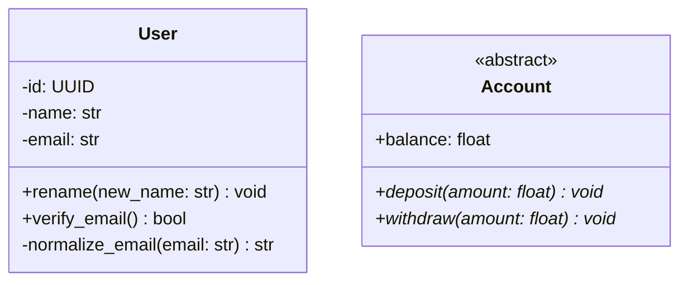

Note the `<<abstract>>` annotation — Mermaid's syntax for marking a class abstract. The `*` after a method name also indicates abstract.

> [!warning] Common Student Misconception
> "Python has no `private`, so the `-` symbol is meaningless in a Python class diagram." — The `-` symbol still communicates *intent*. A field marked `-` in the diagram says "the designer considers this internal; do not touch from outside the class". Python's convention `_name` is the runtime expression of the same intent. The diagram is a design document, not a code generator.

---

## 3. Relationships

The hardest part of UML is the set of **relationships** between classes. There are six, each with a distinct arrowhead. Memorize them; everything else in a class diagram is window dressing.

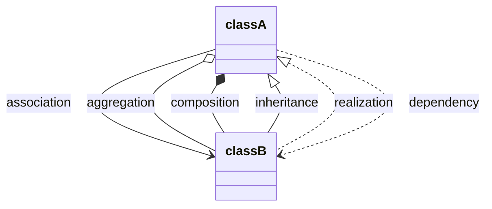

### 3.1 Association (`-->`)

A plain line (with optional arrowhead) means "Class A knows about Class B". The relationship is loose — A holds a reference to B, but they have no ownership relationship.

Example: a `Teacher` has many `Student`s they teach, but the students exist independently of the teacher.

```python
class Teacher:
    def __init__(self, students: list["Student"]):
        self._students = students  # association

class Student: ...
```

### 3.2 Aggregation (`o--`)

A hollow diamond on the **whole** side means "has-a, but the parts can exist independently". The whole is a collection of parts; if the whole is destroyed, the parts survive.

Example: a `Department` has `Professor`s, but if the department is dissolved, the professors still exist (they get reassigned).

```python
class Department:
    def __init__(self, professors: list["Professor"]):
        self._professors = professors  # aggregation — professors outlive dept

class Professor: ...
```

### 3.3 Composition (`*--`)

A filled diamond on the whole side means "has-a, and the parts cannot exist without the whole". The whole owns the parts; if the whole is destroyed, the parts are destroyed too.

Example: a `House` is composed of `Room`s. Demolish the house and the rooms cease to exist.

```python
class House:
    def __init__(self):
        # Composition — rooms are created with the house, die with it
        self._rooms = [Room("kitchen"), Room("bedroom")]

class Room: ...
```

> [!tip] Teaching Tip
> The classic mnemonic is: **aggregation = "has-a", composition = "owns-and-destroys"**. Or even simpler: **"Department has Professors"** (aggregation — profs exist before/after) vs. **"House has Rooms"** (composition — rooms live and die with the house). Students remember concrete examples long after they forget the definition.

### 3.4 Inheritance / Generalization (`<|--`)

A hollow triangle on the **parent** side means "is-a". The child class inherits from the parent.

```python
class Animal:
    def breathe(self): ...

class Dog(Animal):  # inheritance
    def bark(self): ...
```

### 3.5 Realization (`<|..`)

A dashed line with a hollow triangle means "implements interface". The implementing class declares it conforms to the interface's contract.

In Python (which has no explicit `interface` keyword), this maps to either an `abc.ABC` with `@abstractmethod`, or a `typing.Protocol`:

```python
from abc import ABC, abstractmethod

class Readable(ABC):
    @abstractmethod
    def read(self) -> bytes: ...

class FileReadable(Readable):  # realizes Readable
    def read(self) -> bytes:
        return open("/etc/passwd", "rb").read()
```

### 3.6 Dependency (`..>`)

A dashed arrow means "uses, but doesn't hold a reference permanently". The dependent class mentions the other in a method signature or a local variable, but doesn't own it.

```python
class OrderProcessor:
    def process(self, order: Order) -> None:  # depends on Order
        logger = Logger()
        logger.log(f"Processing {order.id}")
```

`OrderProcessor` depends on `Order` and `Logger`, but holds neither as a field.

---

## 4. Multiplicity

Every association, aggregation, and composition can be annotated with **multiplicity** — how many instances participate.

| Notation | Meaning |
|---|---|
| `1` | exactly one |
| `0..1` | zero or one (optional) |
| `*` or `0..*` | zero or more |
| `1..*` | one or more |
| `2..5` | between 2 and 5 |
| `3` | exactly 3 |

In Mermaid, multiplicity is written as labels on the relationship:

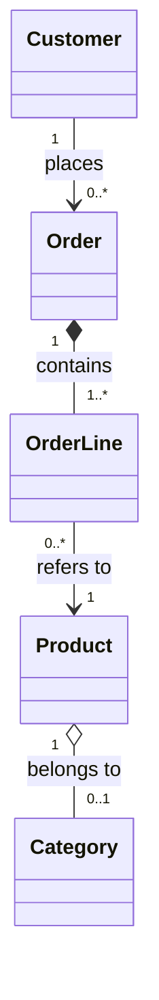

Reading this:
- One customer places zero or more orders.
- One order is composed of one or more order lines.
- Each order line refers to exactly one product.
- Each product belongs to zero or one category.

> [!warning] Common Student Misconception
> "Multiplicity is the same as a foreign key." — Not quite. A foreign key in the database is a runtime implementation; multiplicity is a design constraint. `1` means "by design, there is always one"; the database might enforce this with `NOT NULL`, but the diagram says it first. The diagram drives the schema, not the other way around.

---

## 5. Reading a Class Diagram

Given the diagram below, narrate it: "A `Library` is composed of `Book`s and `Member`s. A `Member` can borrow zero or more `Book`s; a `Book` can be borrowed by zero or one `Member` at a time. `Book` is abstract; `FictionBook` and `NonFictionBook` inherit from it. The `Library` depends on a `Catalog` for searching."

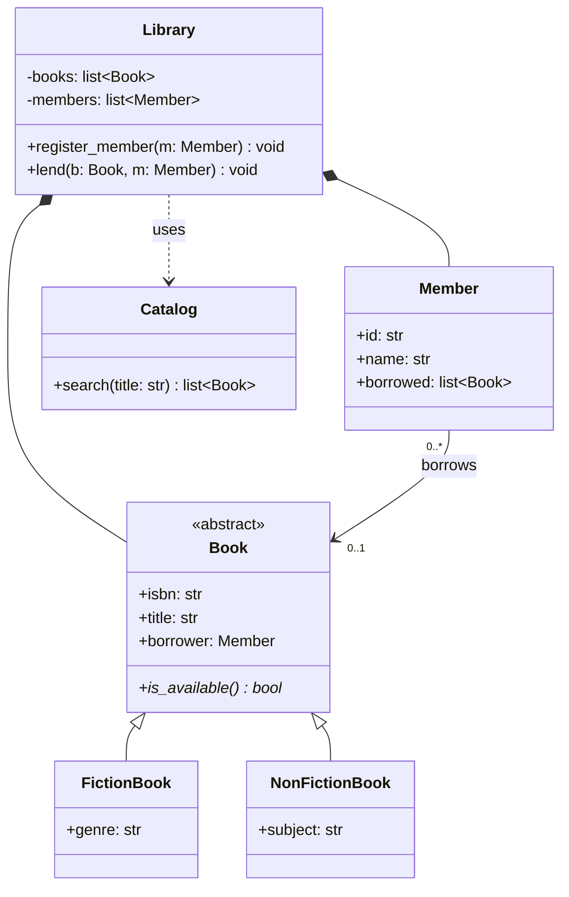

The narrative is the design. Reading the diagram aloud is the most reliable test of whether it communicates.

---

## 6. Drawing Class Diagrams in Mermaid

Mermaid's `classDiagram` syntax is the most accessible way to draw class diagrams in 2024. The basics:

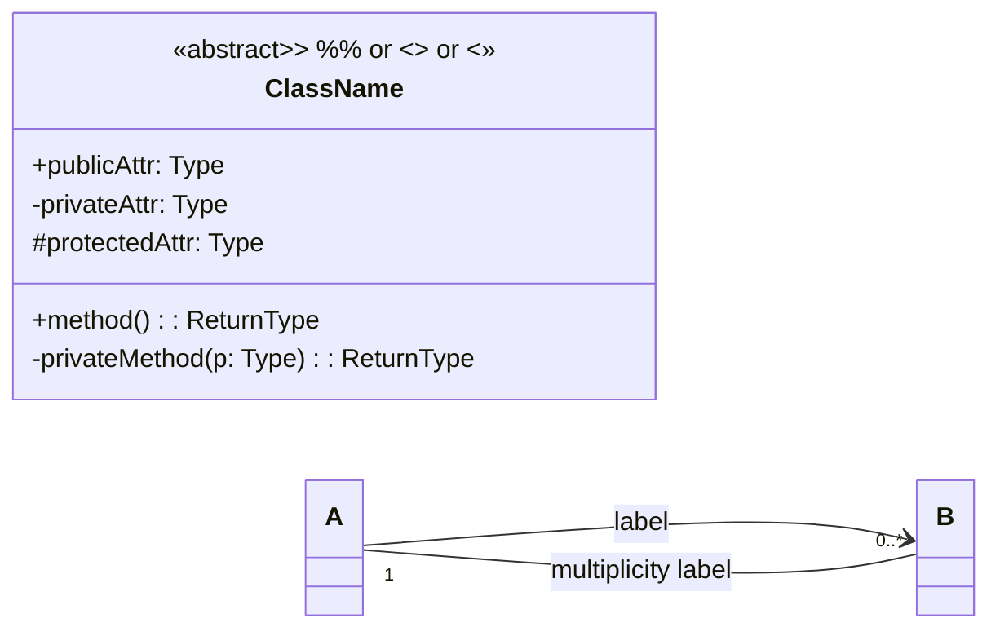

Relationship arrowheads in Mermaid:

| Meaning | Mermaid |
|---|---|
| Association | `-->` or `--` |
| Aggregation | `o--` |
| Composition | `*--` |
| Inheritance | `<\|--` |
| Realization | `<\|..` |
| Dependency | `..>` |
| Solid link (undirected) | `---` |

> [!info] Generics in Mermaid
> Mermaid supports generics with `~T~` syntax: `list~Book~`. Note the tilde, not angle brackets — Mermaid uses `<>` for relationship ends.

---

## 7. Mapping UML to Python

UML was designed when Java and C++ were the dominant OOP languages. Python doesn't always map 1:1, but the mapping is close enough to be useful.

| UML concept | Python equivalent |
|---|---|
| Class | `class Foo:` |
| Abstract class | `class Foo(ABC):` with `@abstractmethod` |
| Interface | `class Foo(Protocol):` (PEP 544) or `class Foo(ABC):` |
| Public attribute | `self.x = 1` |
| Private attribute | `self._x = 1` (convention) or `self.__x = 1` (name-mangled) |
| Protected attribute | `self._x = 1` (convention; no enforcement) |
| Static attribute / method | `class Foo: count = 0` / `@staticmethod` |
| Final attribute / method | `@final` (PEP 591) |
| Constructor | `__init__` |
| Inheritance | `class Dog(Animal):` |
| Realization | `class FileReadable(Readable):` where `Readable` is an ABC/Protocol |
| Association | A field of type B on A |
| Aggregation | A field of type B on A, where B's lifecycle is independent |
| Composition | A field of type B on A, where B is created in A's `__init__` and dies with A |
| Dependency | A method parameter or local variable of type B on A |
| Enumeration | `from enum import Enum; class Color(Enum):` |

### 7.1 Example: from Python to UML

Given this Python code:

```python
from abc import ABC, abstractmethod
from dataclasses import dataclass, field
from uuid import UUID

@dataclass
class Person:
    name: str
    email: str

class Account(ABC):
    @abstractmethod
    def deposit(self, amount: float) -> None: ...
    @abstractmethod
    def withdraw(self, amount: float) -> None: ...

class SavingsAccount(Account):
    def __init__(self, owner: Person, balance: float = 0):
        self._owner = owner
        self._balance = balance
    def deposit(self, amount: float) -> None:
        self._balance += amount
    def withdraw(self, amount: float) -> None:
        if amount > self._balance:
            raise ValueError("Insufficient funds")
        self._balance -= amount

class Bank:
    def __init__(self):
        self._accounts: list[Account] = []
    def open_account(self, owner: Person) -> SavingsAccount:
        acc = SavingsAccount(owner)
        self._accounts.append(acc)
        return acc
    def transfer(self, src: Account, dst: Account, amount: float) -> None:
        src.withdraw(amount)
        dst.deposit(amount)
```

The corresponding UML:

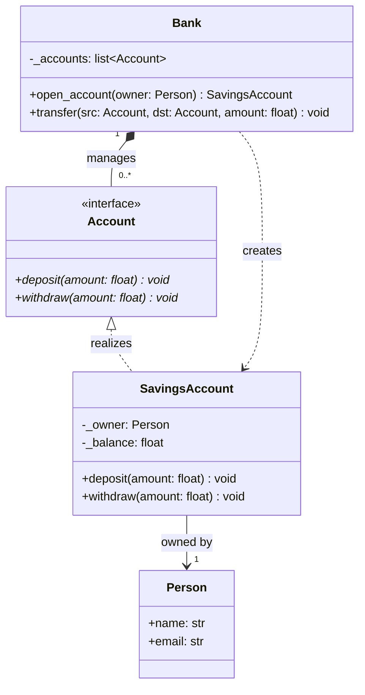

### 7.2 Example: from UML to Python

Read the diagram below and implement it:

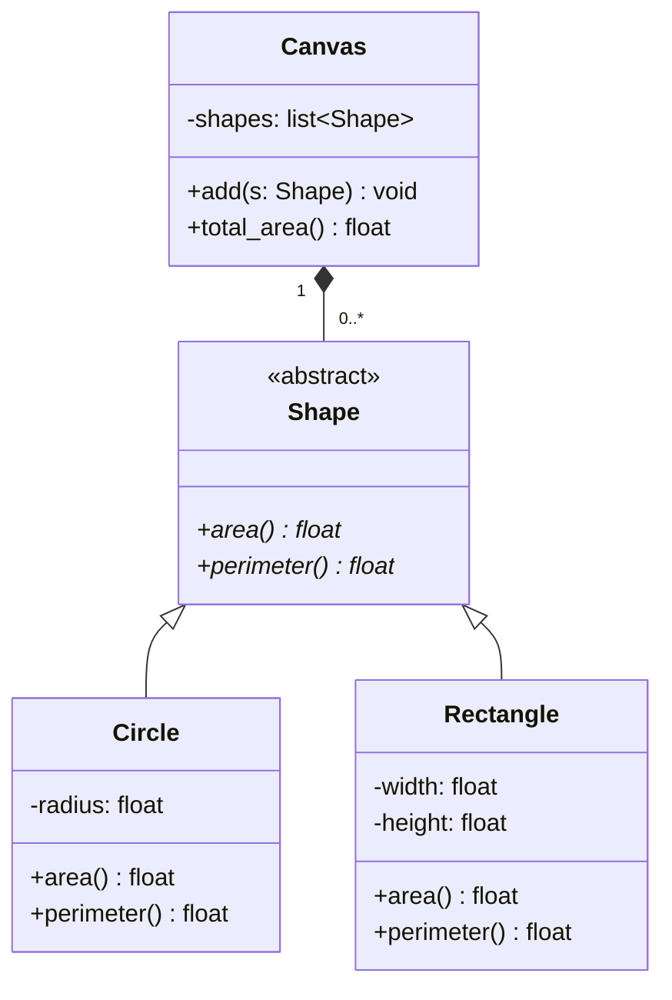

Implementation:

```python
from abc import ABC, abstractmethod
import math

class Shape(ABC):
    @abstractmethod
    def area(self) -> float: ...
    @abstractmethod
    def perimeter(self) -> float: ...

class Circle(Shape):
    def __init__(self, radius: float):
        self._radius = radius
    def area(self) -> float:
        return math.pi * self._radius ** 2
    def perimeter(self) -> float:
        return 2 * math.pi * self._radius

class Rectangle(Shape):
    def __init__(self, width: float, height: float):
        self._width = width
        self._height = height
    def area(self) -> float:
        return self._width * self._height
    def perimeter(self) -> float:
        return 2 * (self._width + self._height)

class Canvas:
    def __init__(self):
        self._shapes: list[Shape] = []
    def add(self, s: Shape) -> None:
        self._shapes.append(s)
    def total_area(self) -> float:
        return sum(s.area() for s in self._shapes)
```

> [!tip] Teaching Tip
> Give students a class diagram and ask them to implement it in Python *before* showing them any code. The translation forces them to confront each relationship: "How do I express composition in Python?" (Answer: instantiate the part in the whole's `__init__`.) "How do I express realization?" (Answer: inherit from an ABC.) The code they write reveals their understanding — and their misunderstandings — instantly.

---

## 8. Common Patterns as Class Diagrams

Class diagrams are especially useful for documenting [[05-Design-Patterns/Structural-Patterns|design patterns]] because patterns are *structural* — they are about how classes relate. Here are four classic patterns as class diagrams.

### 8.1 Strategy

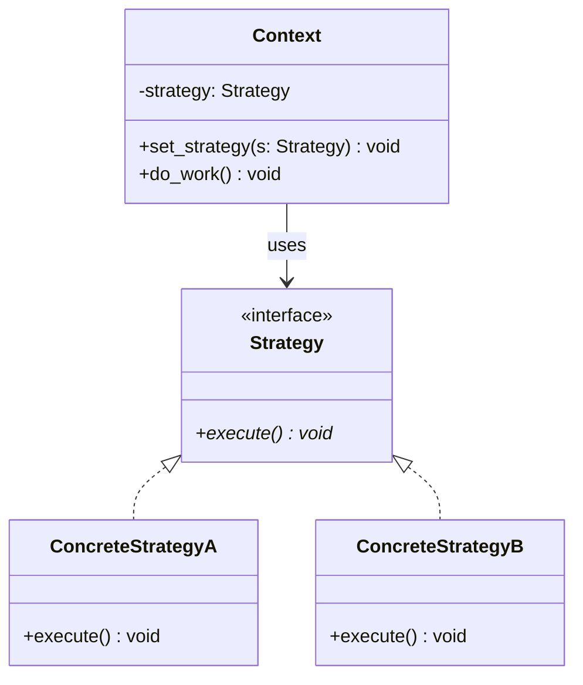

### 8.2 Observer

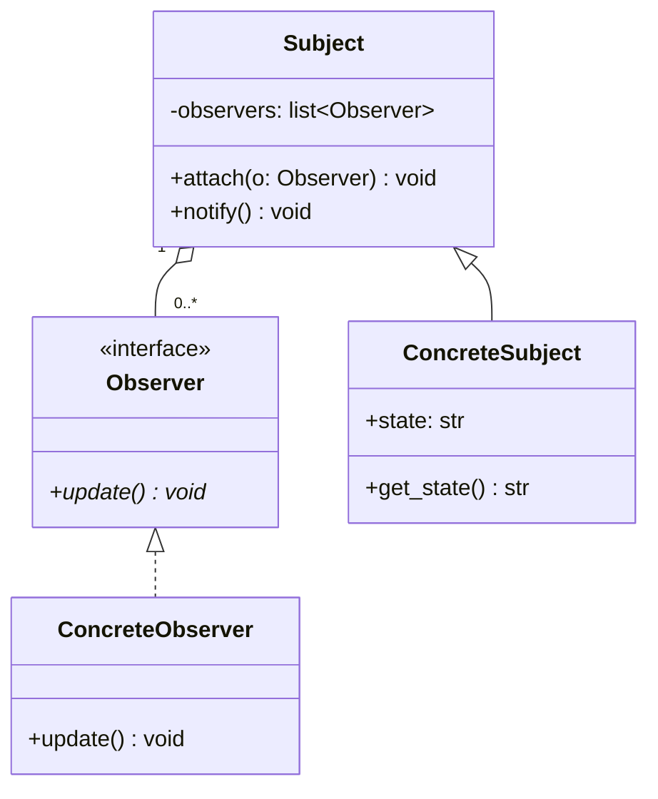

### 8.3 Decorator

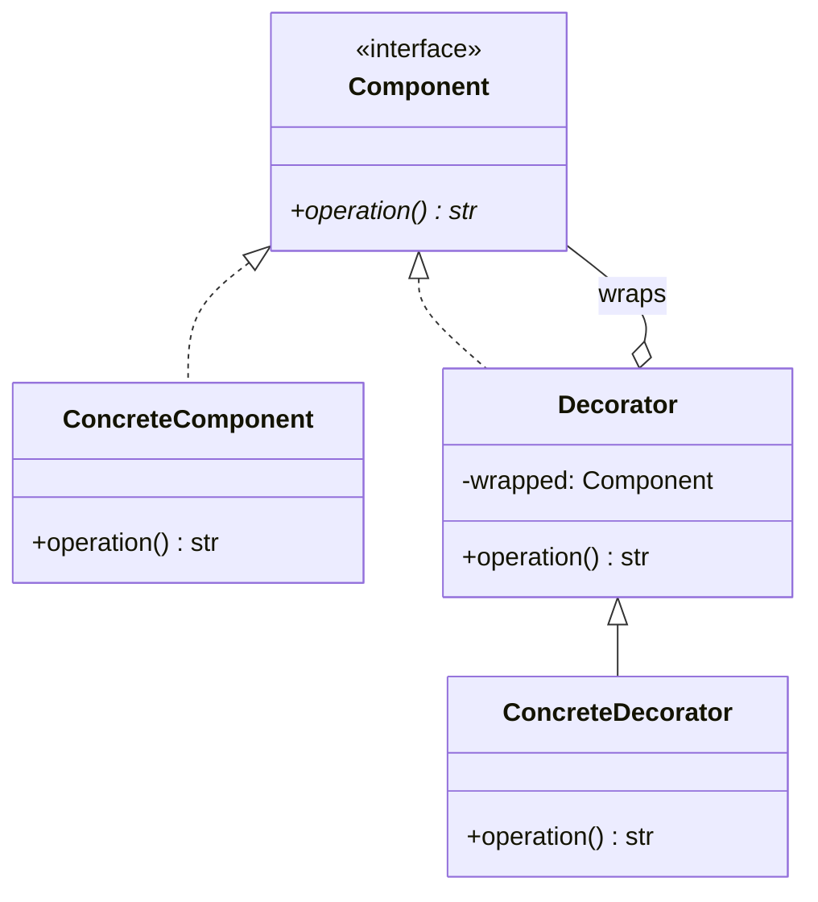

### 8.4 Composite

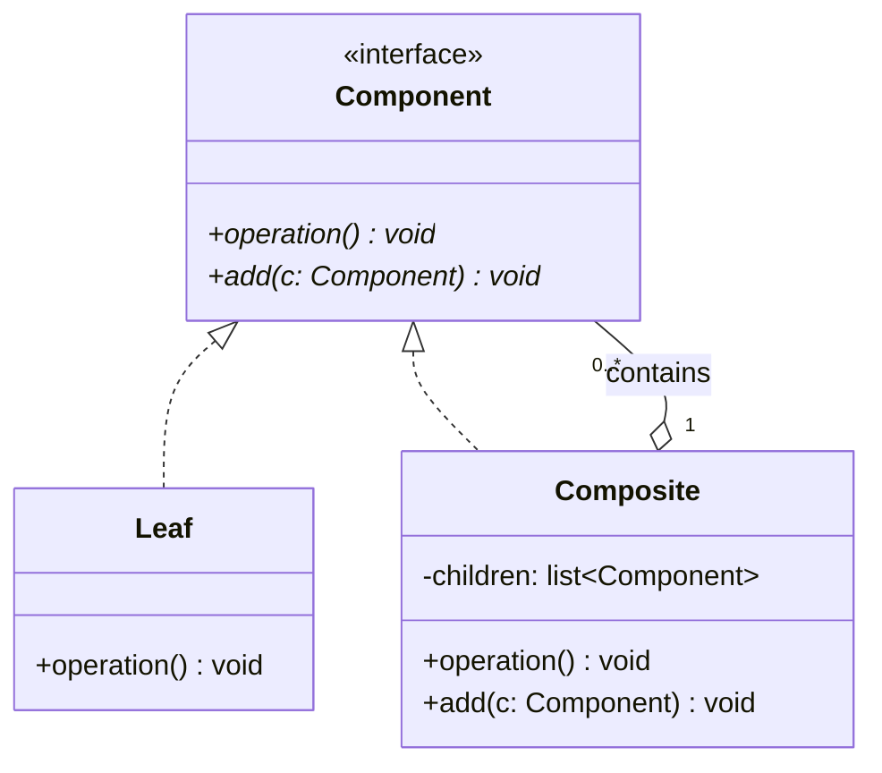

> [!info] Why patterns are clearer as diagrams
> Patterns are recurring *configurations* of classes. The configuration is what makes the pattern; the code is just an instance. A class diagram captures the configuration precisely and lets you compare (say) Decorator to Composite at a glance — they look almost identical, and the difference (decorator wraps one, composite contains many) is visible in the multiplicity.

---

## 9. UML Notation Reference (Cheat Sheet)

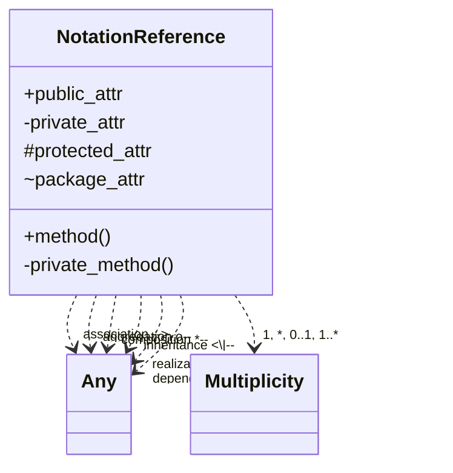

| Symbol | Meaning |
|---|---|
| `+` | public |
| `-` | private |
| `#` | protected |
| `~` | package |
| *italic name* | abstract |
| `<<interface>>` | interface stereotype |
| `<<abstract>>` | abstract stereotype |
| `: Type` | type annotation |
| `()` | method (vs. attribute) |
| `*` after method | abstract method |

---

## 10. Aggregation vs. Composition — The Eternal Confusion

The single most argued distinction in UML is between aggregation (`o--`) and composition (`*--`). Both mean "has-a"; the difference is the *lifecycle* of the parts.

- **Aggregation**: parts can outlive the whole.
- **Composition**: parts die with the whole.

In Python, the difference is in *who creates* the part:

```python
class Department:
    def __init__(self, professors: list[Professor]):
        # Professors were created elsewhere and passed in.
        # If this department is destroyed, professors continue to exist.
        # → Aggregation
        self._professors = professors

class House:
    def __init__(self):
        # Rooms are created here, owned by this house.
        # If the house is destroyed, the rooms go with it.
        # → Composition
        self._rooms = [Room("kitchen"), Room("bedroom")]
```

If you can't tell which one to draw, ask: **"If the whole is destroyed, are the parts destroyed too?"** If yes → composition. If no → aggregation. If you're not sure → aggregation (the weaker claim).

> [!warning] Common Student Misconception
> "Aggregation and composition are the same thing — both just mean 'has-a'." — They are different *because* they imply different lifecycle responsibilities. In code that does explicit cleanup (C++ destructors, Rust `Drop`), the distinction is enforced. In garbage-collected languages (Python, Java), the distinction is a design statement: "I intend to own these parts" (composition) vs. "I intend to share these parts" (aggregation). The diagram communicates intent to the next developer.

---

## 11. How to Use Class Diagrams When Teaching

### 11.1 Draw before code

Have students draw the class diagram for a small system (a vending machine, an ATM, a library) before they write any code. The diagram forces them to think about classes, attributes, and relationships without the distraction of syntax. Code is then a translation exercise.

### 11.2 Diagram the patterns

After teaching a pattern (Strategy, Observer, etc.), have students draw its class diagram from memory. The act of drawing tests whether they understood the *structure*, not just the example.

### 11.3 Use diagrams as review artefacts

In code review, sketch the class diagram of the changes. The diagram reveals couplings that are invisible in a 100-line diff: "This new `Order` class depends on `Logger`, `Metrics`, `Notifier`, and `Auditor` — that's a lot of dependencies for one class."

### 11.4 Don't over-diagram

A class diagram is a *map*, not the *territory*. Don't try to draw every private field and every helper method. Draw the public surface and the structural relationships; the code is the source of truth for the details. A diagram with 50 classes and 200 arrows is no more useful than no diagram.

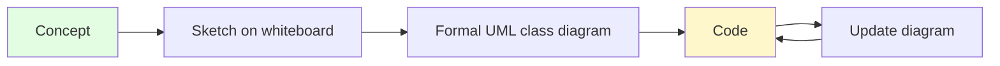

> [!tip] Teaching Tip
> Use a whiteboard or paper for the first sketch, then transcribe to Mermaid once the design stabilizes. The friction of redrawing on a whiteboard encourages iteration; the permanence of Mermaid encourages careful thought. Each medium has its place.

---

## 12. Common Mistakes in Class Diagrams

### 12.1 Drawing the database schema

Class diagrams are not ER diagrams. A class has methods; a database table does not. If your class diagram has only attributes and no operations, you've drawn an ER diagram in UML clothing.

### 12.2 Putting implementation details in the diagram

Private helper methods, internal cache fields, framework-specific annotations — these belong in code, not in the diagram. The diagram should communicate the design; the code should communicate the implementation.

### 12.3 Confusing inheritance and composition

Beginners often use inheritance where composition is correct ("a `Car` is-a `Engine`" — no, a `Car` *has-an* `Engine`). The rule of thumb: if you can substitute "is-a" with "has-a" and the sentence still makes sense, you wanted composition. See [[Composition-Over-Inheritance]].

### 12.4 Too many relationships per class

A class with eight arrows pointing at it has too many responsibilities. The diagram is showing you a [[God-Object]] — refactor before the code gets worse.

### 12.5 Ignoring multiplicities

Without multiplicities, "Customer → Order" is ambiguous — one customer and many orders? Many customers and one order? Always annotate. The diagram is a specification; vague specifications cost time.

---

## 13. Tools for Drawing Class Diagrams

- **Mermaid** (used in this note) — text-based, renders in Obsidian, GitHub, GitLab. Best for diagrams that live alongside code.
- **PlantUML** — text-based, more verbose than Mermaid, more complete UML coverage.
- **draw.io / diagrams.net** — graphical, free, exports to many formats. Good for whiteboard-style sketches.
- **Lucidchart** — commercial, collaborative, polished output.
- **Visual Paradigm** — commercial, full UML support, round-trip engineering from code.
- **StarUML** — commercial, focused on UML specifically.
- **pyreverse** (part of pylint) — generates class diagrams from Python code automatically. Useful for *documenting* existing code, not for designing.

For teaching, Mermaid is the right default — students can read and write it inline in their notes, version it with git, and render it anywhere Markdown renders.

---

## 13.5 A Larger Worked Example: From Requirements to Diagram

Consider the requirement: *A parking lot has multiple levels, each containing multiple parking spots. Cars enter through a gate, receive a ticket, and are assigned a spot. On exit, they pay based on duration.*

Step 1 — find the nouns (candidate classes): `ParkingLot`, `Level`, `ParkingSpot`, `Car`, `Gate`, `Ticket`, `Payment`.

Step 2 — find the relationships: a lot has levels (composition — levels are part of the lot); a level has spots (composition); a spot is occupied by zero or one car (association); a car receives a ticket (association); a ticket leads to a payment (composition — payment belongs to ticket).

Step 3 — draw the diagram:

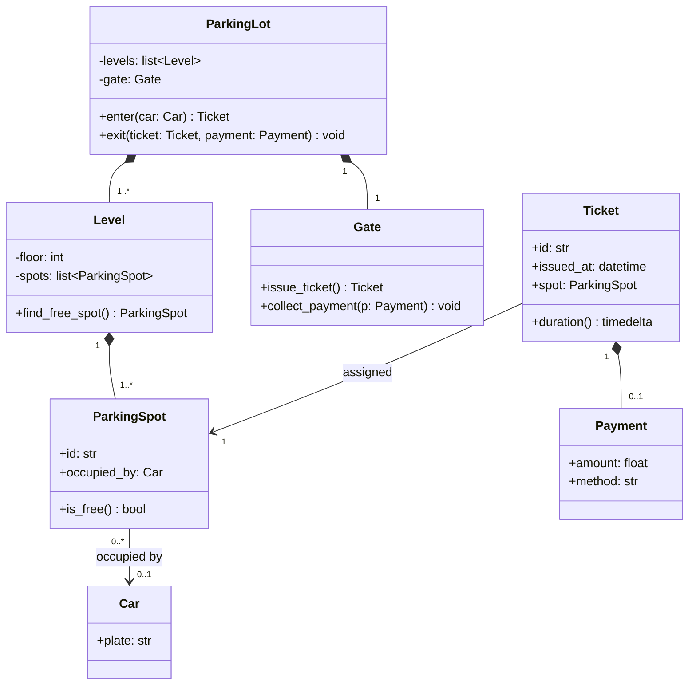

Notice how the diagram surfaces design questions immediately:
- Should `ParkingLot.exit` take the ticket or the car? (The diagram shows ticket — but is the ticket bound to the car? Add an association.)
- Should `Payment` be a separate class or just an attribute? (Separate — different methods, possibly different currencies.)
- Is the gate part of the lot or independent? (Composition — gates don't make sense without a lot.)

Each question is a design conversation the diagram enables. The code follows from the answers.

> [!tip] Teaching Tip
> Use this worked example with students. Walk them through the three steps (nouns → relationships → diagram), then ask each pair to extend the diagram with a new requirement ("electric vehicle charging stations", "monthly subscriptions"). The diagram is the focal point of the discussion; the code is the consequence.

---

## 14. Summary

| Question | Answer |
|---|---|
| What is a class diagram? | A structural UML diagram showing classes, their attributes/operations, and their relationships. |
| What are the six relationships? | Association, aggregation, composition, inheritance, realization, dependency. |
| Aggregation vs. composition? | Aggregation: parts outlive the whole. Composition: parts die with the whole. |
| How is it drawn in Mermaid? | `classDiagram` block with `class` definitions and relationship arrows. |
| Should I draw every field? | No — draw the public surface and structural relationships. |
| What's the most common mistake? | Confusing inheritance with composition, and using the diagram as a database schema. |
| When should I draw one? | Before coding (to design), during review (to communicate), and after refactoring (to document). |

Class diagrams are the most-used UML diagram type for a reason: they compress a lot of design information into a small, readable space. They are not a replacement for code; they are a *map* of the code, useful when you need to communicate structure to another human (or to your future self). Learn the six relationships cold, practice translating between Python and UML in both directions, and your design conversations will get sharper.

> [!quote] Grady Booch
> "A picture is worth a thousand lines of code — but only if the picture is right."

Continue with [[UML-Sequence-Diagrams]] for the behavioural counterpart, and [[Object-Oriented-Analysis-And-Design]] for the process of *arriving* at the classes you draw.

---

## See Also

- [[UML-Sequence-Diagrams]] — the behavioural counterpart.
- [[Object-Oriented-Analysis-And-Design]] — the process of finding the classes you draw.
- [[Classes-And-Objects]] — the Python primitives that classes represent.
- [[Inheritance]] — the OOP pillar that `is-a` expresses.
- [[Composition-Over-Inheritance]] — the modern OOP preference that `has-a` reflects.
- [[Interfaces-And-Protocols]] — Python's realization mechanism.
- [[Encapsulation]] — the principle behind visibility markers.
