# UML Sequence Diagrams — Modelling Object Interactions Over Time

#oop #uml #modeling #sequence-diagram #design #documentation #interactions #teaching #deep-dive

> [!quote] Ivar Jacobson, one of UML's creators
> "Sequence diagrams describe how groups of objects collaborate in some behaviour. They are the natural language of use-case realisation."

Class diagrams answer *"what are the things in my system?"* Sequence diagrams answer *"how do those things talk to each other to get something done?"* They capture the *dynamic* view of an OOP system — the choreography of messages that produces a behaviour.

A class diagram with no sequence diagram is a static picture of lonely objects; a sequence diagram with no class diagram is a script with no cast. Together, they describe both the *structure* and the *behaviour* of a design, and most useful UML modelling uses both.

This note covers sequence diagrams from the ground up: their elements, how to read them, how to draw them in Mermaid, common interaction patterns, and how to use them as a teaching tool. We will lean on [[UML-Class-Diagrams]] as a companion — read that first if you haven't.

Prerequisite reading: [[UML-Class-Diagrams]], [[Classes-And-Objects]], [[Methods-And-Functions]], [[Service-Layer]].

---

## 1. What is a Sequence Diagram?

A sequence diagram shows a **scenario** — a single, concrete path through a use case. The horizontal axis lists the **participants** (objects, components, or actors); the vertical axis is **time**, flowing top to bottom. Messages between participants are arrows from the sender's lifeline to the receiver's.

A sequence diagram is *not* a flowchart. It does not show "what could happen in all possible cases" — that's an activity diagram. It shows what *does* happen in one particular scenario. To describe the same use case with different outcomes (success path, error path, timeout path), you draw multiple sequence diagrams.

> [!info] Why scenarios, not branches?
> Branches are easy to express in code (`if/else`). Sequence diagrams are about communication — and humans communicate scenarios more clearly than they communicate branch trees. Showing three sequence diagrams ("happy path", "invalid input", "user cancels") is clearer than one diagram with three `alt` blocks full of arrows.

---

## 2. The Elements

A sequence diagram has six core elements.

### 2.1 Lifelines

Each participant has a **lifeline** — a vertical dashed line descending from the participant's name. The lifeline represents the participant's existence over time.

```
+----------+
| :Object  |       ← participant header (note the colon — instance, not class)
+----------+
     |
     |  ← lifeline (vertical dashed line)
     |
     v
```

In Mermaid:

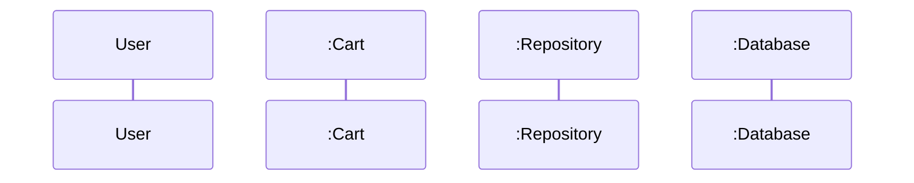

The colon before a name is UML convention: `:Cart` means "an anonymous instance of Cart". If you want a named instance, write `cart:Cart`. If you want an actor (a human user), draw them as a stick figure.

### 2.2 Messages

A **message** is an arrow from one lifeline to another. Three flavours:

| Arrow | Mermaid | Meaning |
|---|---|---|
| → solid, filled arrowhead | `->>` | Synchronous call: the sender waits for a return |
| ⇢ dashed, open arrowhead | `-->>` | Asynchronous message or return value |
| ⇢ dashed | `-->>` (return) | Return value from a synchronous call |

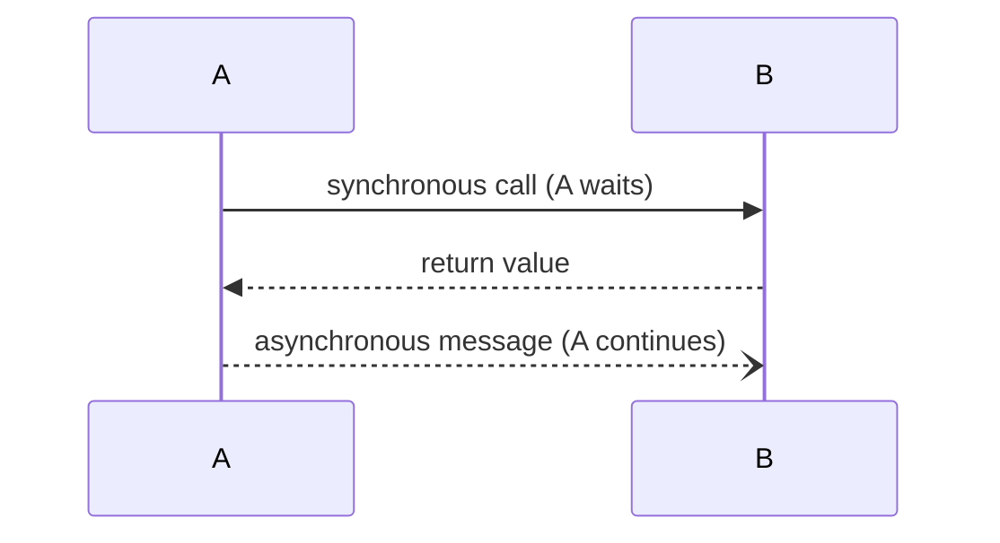

Synchronous calls block the sender until the receiver returns; asynchronous calls don't. In Python, this distinction maps roughly to: `result = b.method()` (sync) vs. `await b.method()` or `b.method_async()` (async).

### 2.3 Activation Bars

An **activation bar** is a thin rectangle on a lifeline showing when that object is *active* — i.e., executing a method. When A calls B, B's activation starts; when B returns, B's activation ends.

In Mermaid, activation bars are drawn with `activate` and `deactivate`:

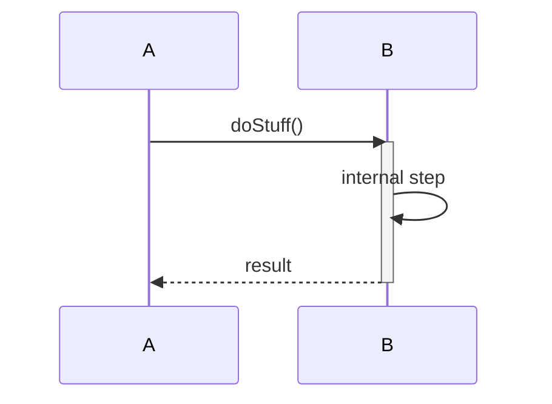

Activation bars are a visual cue for "this object is busy right now". They make nested calls visible: if A calls B which calls C, you see three stacked activations, one per object.

### 2.4 Self-message

An object can send a message to itself — `B->>B: helper()`. This represents an internal method call. In Mermaid, just use the same participant for source and target.

### 2.5 Create and destroy messages

A message can **create** a participant (drawn with `<<create>>` stereotype, arrow pointing to the new lifeline's head) or **destroy** one (drawn with an `X` at the bottom of the lifeline).

In Mermaid, creation is implicit when a participant first appears; destruction is harder but can be approximated with a note.

### 2.6 Notes

A **note** is a comment attached to a lifeline or a message. Use sparingly — they clutter the diagram quickly.

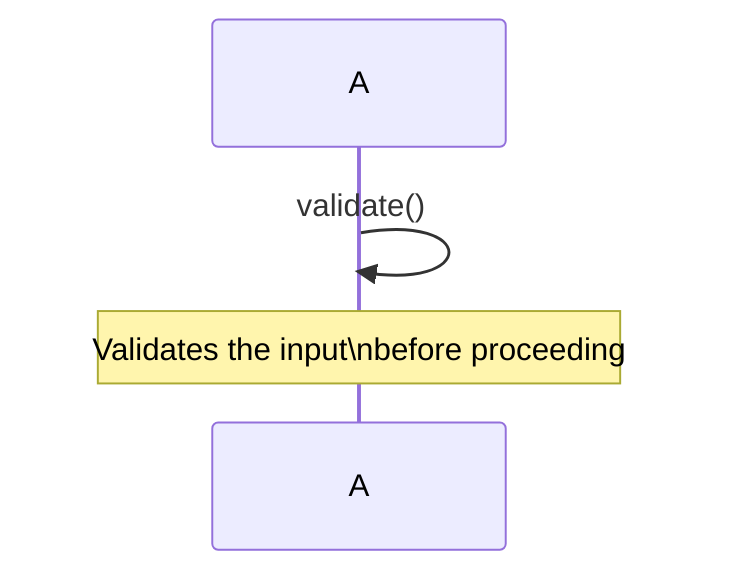

---

## 3. Combined Fragments

For more complex scenarios, UML defines **combined fragments** — boxes around groups of messages with a label that describes the control flow.

| Label | Meaning |
|---|---|
| `alt` | Alternative: only one branch executes (else if) |
| `opt` | Optional: a single branch executes if a condition holds |
| `loop` | Iteration: the fragment repeats while a condition holds |
| `par` | Parallel: the fragments execute concurrently |
| `break` | Break: if condition holds, the rest of the enclosing fragment is aborted |
| `critical` | Atomic: the fragment must execute without interruption |
| `ref` | Reference to another sequence diagram (sub-scenario) |

In Mermaid:

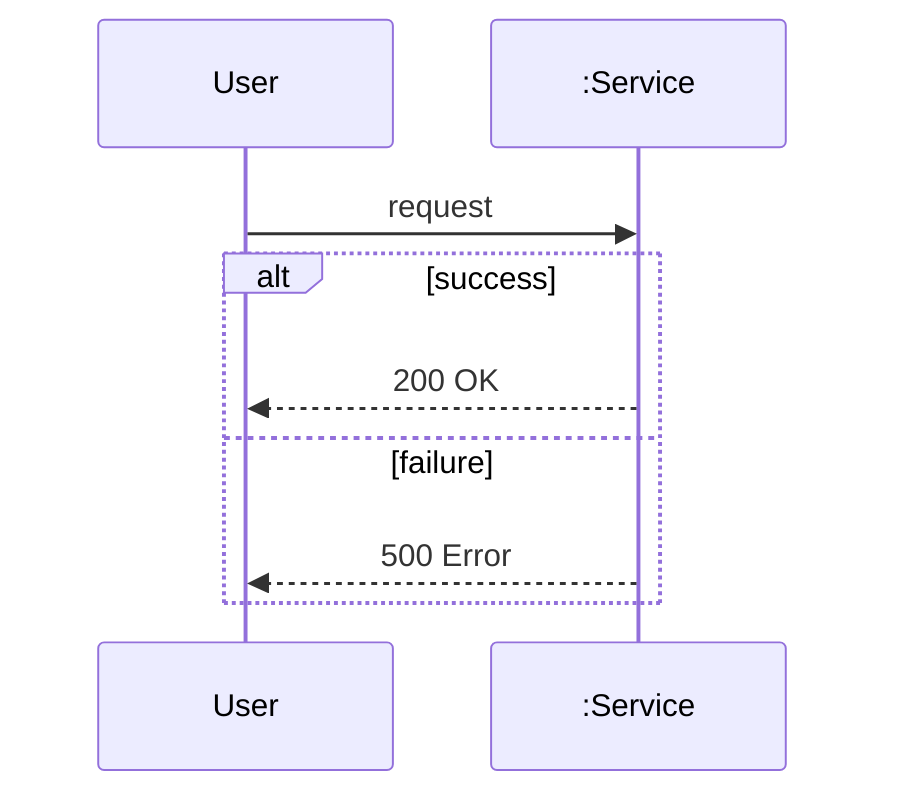

> [!warning] Common Student Misconception
> "Use `alt` for every `if` in the code." — No. Sequence diagrams are for *scenario-level* decisions, not code-level branches. If your `if` is "did the password match?", draw two scenarios: "valid login" and "invalid login". The `alt` fragment is for cases that share most of the diagram and differ in one spot — not for every micro-decision.

---

## 4. Reading a Sequence Diagram

Given this diagram:

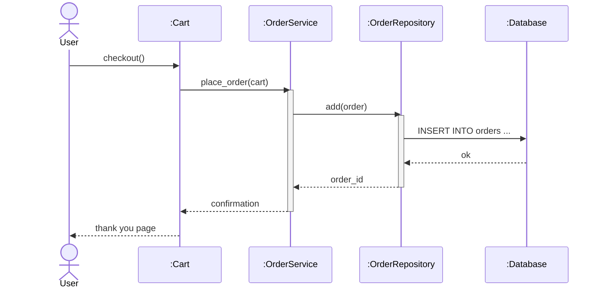

Narrate it top to bottom:

1. The User clicks "checkout" on the Cart.
2. The Cart asks the OrderService to place an order.
3. The OrderService (now active) asks the OrderRepository to add the order.
4. The Repository (now active) issues an INSERT to the Database.
5. The Database returns success.
6. The Repository returns the order id to the OrderService.
7. The OrderService returns a confirmation to the Cart.
8. The Cart shows a thank-you page to the User.

The narrative is the test: if you can read the diagram aloud and it makes sense, the design is communicated. If you can't, the diagram is broken.

---

## 5. Common Interaction Patterns

### 5.1 Request-response

The simplest pattern: A asks B for something, B returns a result.

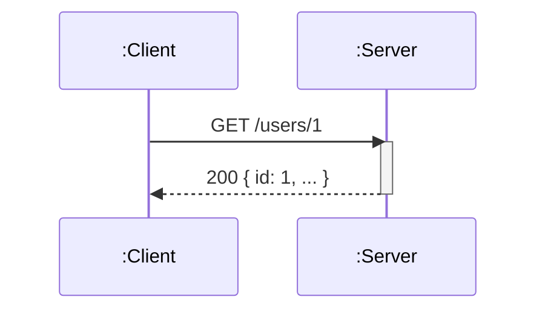

In Python:

```python
response = server.get("/users/1")
```

### 5.2 Callback

A asks B to do something; when B is done, B calls back a method on A (or a separate callback object).

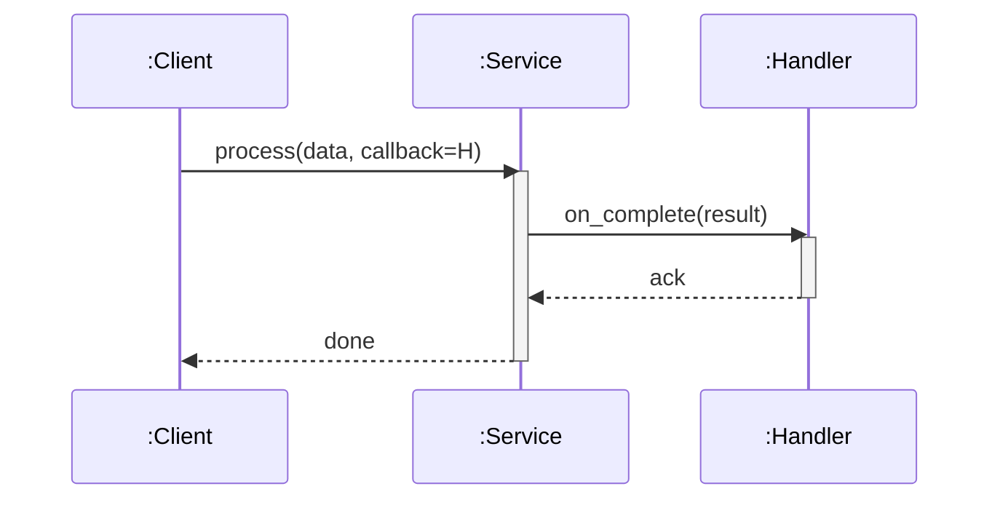

In Python:

```python
def on_complete(result):
    print(result)

service.process(data, callback=on_complete)
```

### 5.3 Publish-subscribe (event-driven)

A publishes an event to a broker; multiple subscribers receive it asynchronously. There is no return value.

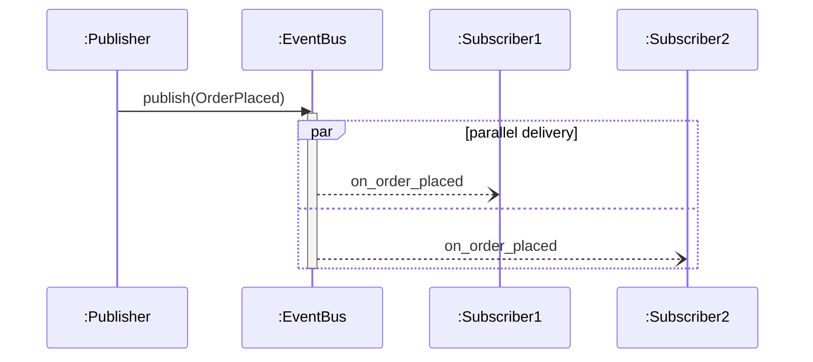

In Python:

```python
event_bus.publish(OrderPlaced(...))
# Subscribers receive it asynchronously — no return value.
```

### 5.4 Layered call (N-tier)

A request cascades through layers: controller → service → repository → database.

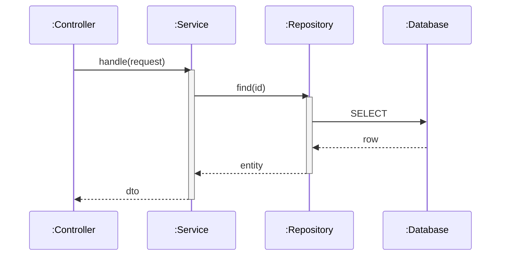

Each layer is a clear seam; the diagram makes the layering visible.

---

## 6. Mapping Python Code to Sequence Diagrams

Given this Python code:

```python
class Cart:
    def __init__(self, repo):
        self._repo = repo
        self._items = []

    def add(self, item):
        self._items.append(item)

    def checkout(self, user):
        order = Order(user, list(self._items))
        self._repo.save(order)
        self._items.clear()
        return order.id


class OrderRepository:
    def __init__(self, db):
        self._db = db

    def save(self, order):
        self._db.execute(
            "INSERT INTO orders (id, user, items) VALUES (?, ?, ?)",
            (order.id, order.user, [i.name for i in order.items]),
        )
        return order.id


# Usage
cart = Cart(OrderRepository(db))
cart.add(Item("Book", 12.99))
order_id = cart.checkout(user)
```

The corresponding sequence diagram for `checkout`:

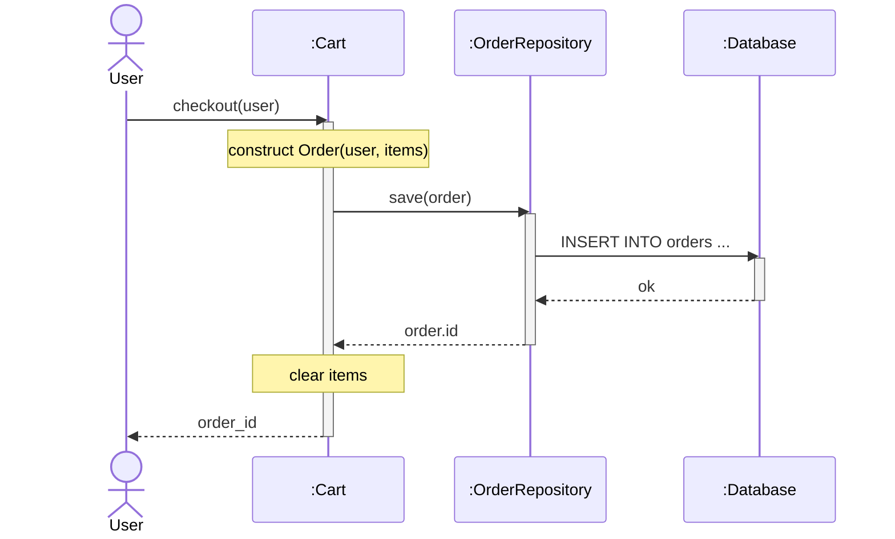

Notice how the diagram makes three things visible:
1. **The call chain**: User → Cart → Repository → Database → back up.
2. **The activation nesting**: when Cart calls Repository, both are active (Cart is waiting for the return).
3. **The side effects**: the Note about clearing items shows a state change in Cart that isn't a message.

> [!tip] Teaching Tip
> Have students read a piece of unfamiliar Python code and draw the sequence diagram. The exercise forces them to trace every call — and reveals which calls are missing from their mental model. They are often surprised by how many methods a single line of application code triggers.

---

## 7. From Sequence Diagram to Code

Reading the diagram below, implement it:

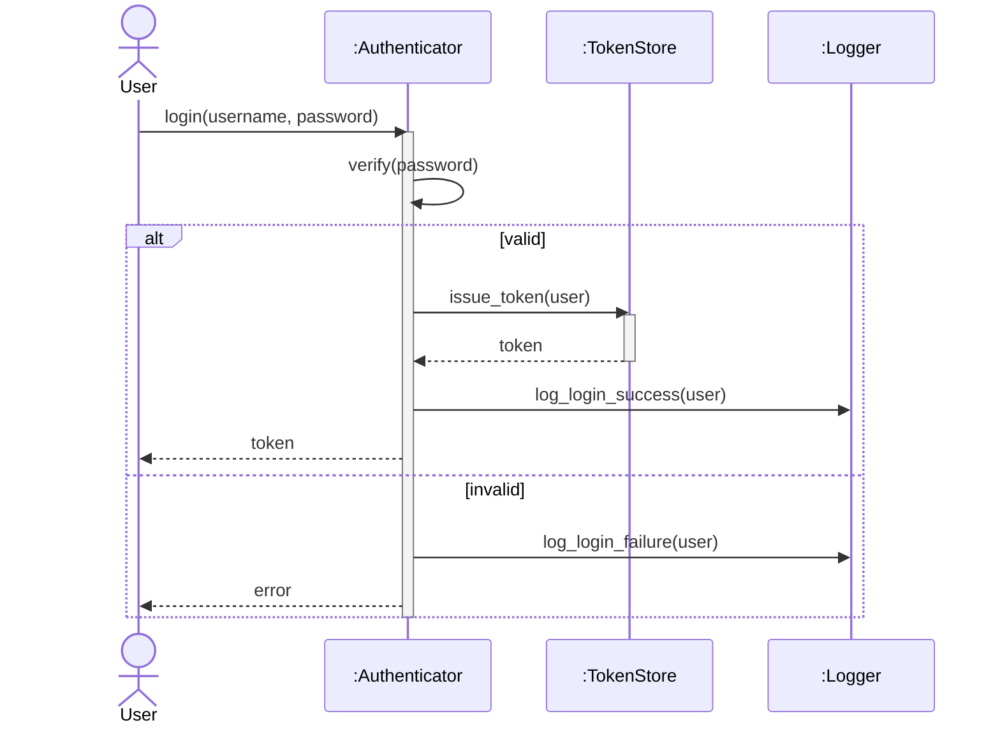

Implementation:

```python
class Authenticator:
    def __init__(self, token_store, logger, user_db):
        self._tokens = token_store
        self._logger = logger
        self._users = user_db

    def login(self, username, password):
        if not self._verify(password, username):
            self._logger.log_login_failure(username)
            raise AuthError("Invalid credentials")
        token = self._tokens.issue_token(username)
        self._logger.log_login_success(username)
        return token

    def _verify(self, password, username):
        stored = self._users.get_hash(username)
        return stored is not None and bcrypt.check(password, stored)


class TokenStore:
    def issue_token(self, user):
        return jwt.encode({"user": user, "exp": ...}, SECRET)


class Logger:
    def log_login_success(self, user): ...
    def log_login_failure(self, user): ...
```

The diagram is the *specification*; the code is the *implementation*. The act of translation tests whether the diagram is unambiguous.

> [!warning] Common Student Misconception
> "Every arrow must be a method call." — Most are, but not all. A self-message can represent an internal computation. A return arrow can represent a value flowing back. An asynchronous arrow can represent an event published to a queue. The diagram is about *communication*, not strictly about method calls. Don't try to mechanically translate every arrow into a Python method.

---

## 8. Sequence Diagram Notation Reference

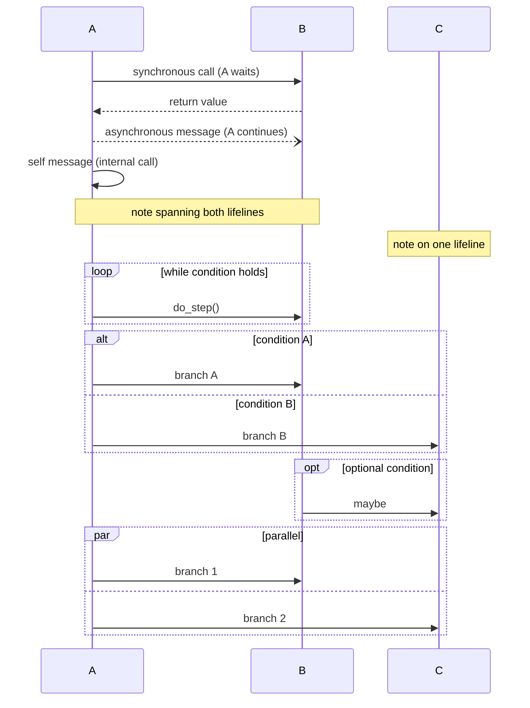

| Element | Mermaid | Meaning |
|---|---|---|
| `participant X` | defines a lifeline | creates a participant |
| `->>` | solid arrow, filled head | synchronous call |
| `-->>` | dashed arrow, open head | return / async message |
| `--)` | dashed arrow, no head | asynchronous (fire-and-forget) |
| `activate X` / `deactivate X` | activation bars | shows when X is busy |
| `Note over X: text` | note | a comment |
| `loop … end` | loop fragment | iteration |
| `alt … else … end` | alternative | mutually exclusive branches |
| `opt … end` | optional | single conditional |
| `par … and … end` | parallel | concurrent fragments |

---

## 9. Using Sequence Diagrams to Explain Object Collaboration

Sequence diagrams are the natural notation for *behaviour* — the part of OOP that class diagrams can't show. Use them when:

- A class diagram shows the relationships but you want to explain **how** a feature works.
- A piece of code has surprising behaviour and you want to communicate the call chain.
- You're designing a new feature and want to validate the object responsibilities before coding.

A particularly effective teaching technique: have students draw the sequence diagram for the same scenario at different levels of detail — first the "high-level" version (3 participants, 5 messages), then the "low-level" version (8 participants, 20 messages). The exercise teaches them that sequence diagrams have a *zoom level*, and that the right level depends on the audience.

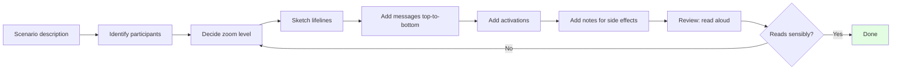

> [!tip] Teaching Tip
> Always have students *read aloud* their sequence diagrams after drawing. If they can't narrate it coherently, the diagram has a problem — usually a missing return arrow, an activation that doesn't close, or a message that has no source. The narration is the test.

---

## 10. Anti-Patterns in Sequence Diagrams

### 10.1 The "everything" diagram

A sequence diagram with 15 participants and 50 messages is unreadable. It tries to show every call, every database hit, every log statement — and ends up showing nothing. Cure: pick a zoom level and stick to it. If the diagram has more than ~7 participants, it's at the wrong level.

### 10.2 Forgetting the returns

A surprising number of students draw the call arrows but not the return arrows. The diagram looks complete but doesn't communicate *what* each call produces. Always include returns (even if just `-->>` with no label) — they show data flow back up the call stack.

### 10.3 Confusing sync and async

If a message is asynchronous (e.g., an event published to a queue), use `--)` not `->>`. Synchronous arrows imply the sender waits; if the sender doesn't wait, the diagram is misleading. In a CQRS or event-sourcing system (see [[CQRS-Pattern]], [[Event-Sourcing]]), this distinction is crucial.

### 10.4 Using `alt` for everything

`alt` fragments are powerful but they make diagrams ugly fast. If you have an `alt` with three branches that each take 10 messages, you have three diagrams squeezed into one. Pull them apart into three scenarios.

### 10.5 Drawing the database as an object

The database is a *system*, not an object. Drawing it as a participant is sometimes useful (as in the examples above), but be clear that it represents the *database system*, not an instance of a `Database` class in your code. If you find yourself drawing `:Database` as a participant in every diagram, you may be over-specifying the persistence layer.

---

## 11. Sequence Diagrams and Architecture

Sequence diagrams are especially useful for documenting architectural patterns because patterns are often about *message flow*. Three examples:

### 11.1 MVC request flow

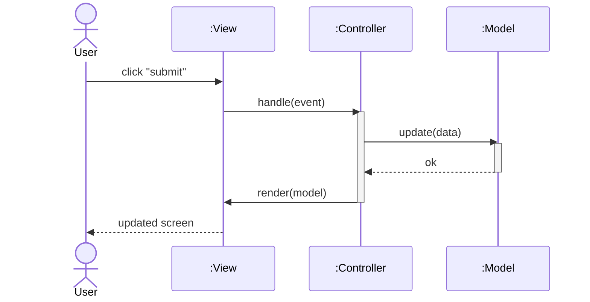

### 11.2 Repository + Unit of Work

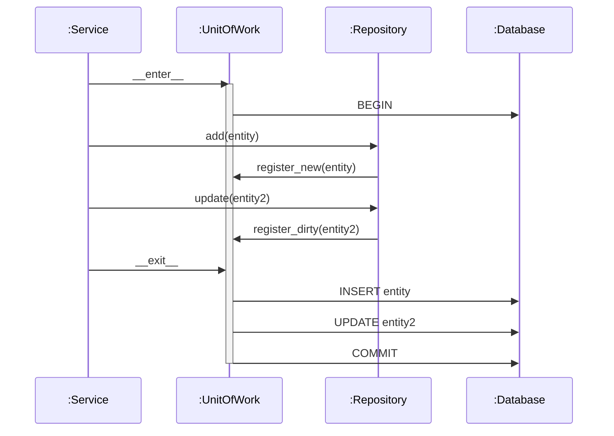

### 11.3 CQRS command + projection

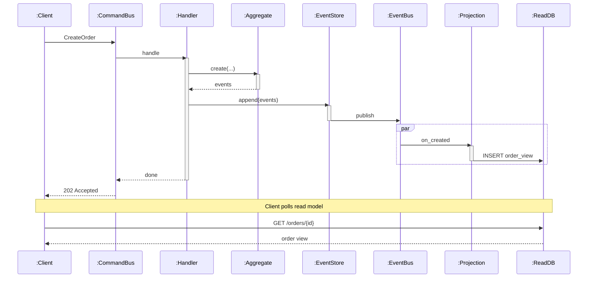

These diagrams make the architectural patterns *legible* in a way that prose cannot. A student who has seen the CQRS sequence diagram once will understand the pattern far better than a student who has only read the description.

---

## 12. Tools

- **Mermaid** (used here) — text-based, renders inline in [[README|Obsidian]], GitHub, GitLab. The `sequenceDiagram` block supports all the elements above.
- **PlantUML** — text-based, more verbose, slightly richer syntax for advanced fragments.
- **draw.io / diagrams.net** — graphical, good for whiteboard-style sketches.
- **WebSequenceDiagrams** (wsd) — web-based, purpose-built for sequence diagrams, very fast.
- **Lucidchart, Visual Paradigm** — commercial, full UML support.

For teaching, Mermaid is the right default. The text-based syntax means diagrams live in version control next to code, and students can write them in the same Markdown files as their notes.

> [!info] Sequence diagrams in code review
> A useful trick: when reviewing a complex PR, sketch the sequence diagram of the changes (or have the author sketch it). The diagram makes hidden couplings visible — "oh, this controller is calling the database directly, bypassing the service layer" — in a way that a diff does not.

---

## 13. Common Student Misconceptions — A Round-Up

> [!warning] Misconception 1
> "Sequence diagrams are flowcharts." — No. Flowcharts show *control flow* (branches, loops); sequence diagrams show *object interactions*. A flowchart could describe a single object's algorithm; a sequence diagram describes multiple objects' collaboration.

> [!warning] Misconception 2
> "Time goes left to right." — No, time goes top to bottom. Participants are arranged horizontally; their relative order on the x-axis is usually arbitrary (pick whatever reads best).

> [!warning] Misconception 3
> "Every method in the code must appear in the diagram." — No. Pick a zoom level. Diagrams at too fine a grain become unreadable; diagrams at too coarse a grain miss the point. The right level is "enough to communicate the scenario to a colleague".

> [!warning] Misconception 4
> "Return arrows are optional." — They are not. Without them, the reader can't tell which calls produce values and which are fire-and-forget. Always draw the return, even if it's `-->>` with no label.

> [!warning] Misconception 5
> "Sequence diagrams replace class diagrams." — They complement them. Class diagrams show structure; sequence diagrams show behaviour. A complete design uses both.

---

## 14. Summary

| Question | Answer |
|---|---|
| What is a sequence diagram? | A UML diagram showing how objects collaborate over time in a single scenario. |
| What are the main elements? | Lifelines, messages (sync/async/return), activation bars, notes, combined fragments. |
| What is the vertical axis? | Time, flowing top to bottom. |
| What is the horizontal axis? | Participants (objects, components, actors). |
| When to use `alt` vs. separate diagrams? | `alt` for closely-related branches; separate diagrams for fundamentally different scenarios. |
| Sync vs. async arrow? | `->>` sync (sender waits); `--)` async (sender continues). |
| Do returns need labels? | No, but they need to exist. |
| How is it drawn in Mermaid? | `sequenceDiagram` block with `participant`, `->>`, `-->>`, `--)`, `activate/deactivate`, `loop`, `alt`, `opt`, `par`. |

Sequence diagrams are the behavioural counterpart to class diagrams. Together they form a complete description of an OOP design: *what the things are* (classes) and *how they work together* (sequences). For any non-trivial design, drawing both is the single most effective communication technique available — far more powerful than prose alone.

> [!quote] Ivar Jacobson
> "Use cases are the what; sequence diagrams are the how."

Continue with [[Object-Oriented-Analysis-And-Design]] to see how both diagram types fit into the broader process of designing OOP systems from requirements.

---

## See Also

- [[UML-Class-Diagrams]] — the structural counterpart.
- [[Object-Oriented-Analysis-And-Design]] — the process that produces both.
- [[Service-Layer]] — a layer whose interactions sequence diagrams often depict.
- [[CQRS-Pattern]] — a pattern whose command and query flows are best shown as sequence diagrams.
- [[Event-Sourcing]] — whose event flows are likewise best as sequence diagrams.
- [[Repository-Pattern]] — whose call chain (service → repository → DB) is the canonical layered sequence.
- [[Methods-And-Functions]] — what a message typically maps to in Python.
