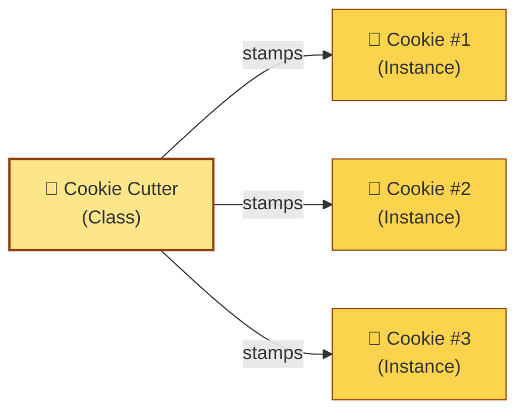
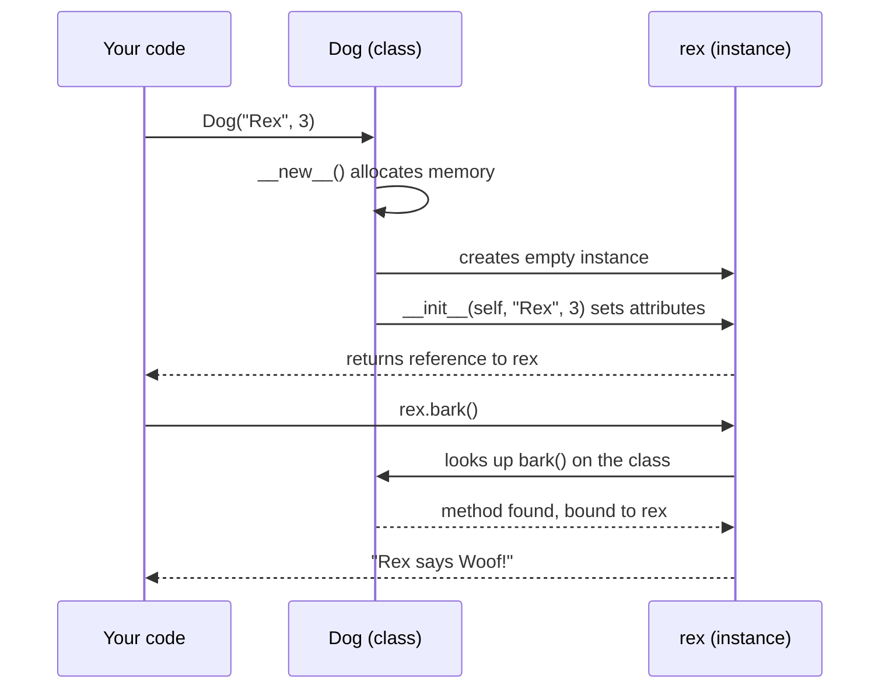

# What is Object-Oriented Programming (OOP)?

> [!note] The one-sentence definition
> **Object-Oriented Programming (OOP)** is a programming paradigm that organizes software around **objects** — bundles of **data** (state) and **behavior** (functions) that collaborate by **passing messages** to one another.

If you read only one sentence in this file, read that one. Everything else is unpacking *why* that sentence is profound and *how* it changes the way you write code.

---

## 1. A Definition in Three Layers

Let's build the definition up in three increasingly precise layers.

### Layer 1 — Plain English

In procedural programming, you write functions that operate on data. In OOP, you split your program into little **self-contained machines** called *objects*. Each object:

- **Knows something** (its data — e.g., a bank account knows its balance).
- **Does something** (its behavior — e.g., a bank account can deposit and withdraw).
- **Talks to other objects** by sending them *messages* (calling their methods).

> [!tip] Mental model
> Think of an object as a tiny clerk at a desk. The clerk keeps some papers in a drawer (state) and has a list of things they're allowed to do (methods). You don't reach into the clerk's drawer — you hand them a request, and they decide how to fulfil it.

### Layer 2 — The Textbook Definition

> Object-Oriented Programming is a paradigm based on the concept of **objects**, which are instances of **classes**. A class defines a data structure together with the methods that operate on it. Objects encapsulate their internal state and expose a controlled interface through which other objects may interact with them.

### Layer 3 — The Historical/Alan Kay Definition

Alan Kay, who coined the term "object-oriented" in 1967, intended something more radical than what most languages implement today. In his vision:

- **Everything is an object.** Even numbers, even booleans.
- **Objects communicate exclusively by message passing.** No object directly touches another object's internals.
- **State is private.** The only way to influence another object is to ask it to do something.
- **Late binding.** The receiver of a message decides at runtime how to respond.

> [!warning] Common misconception
> Many programmers think "OOP = classes + inheritance." That is the *implementation strategy* used by Java, C++, and Python — but it is not Alan Kay's definition. Kay has said he regretted focusing on the term "object" instead of **"messaging."** Modern OOP is often a watered-down descendant of his original idea. See [[history-of-oop]] for the full story.

---

## 2. Core Philosophy: Data + Behavior + Messaging

Three ideas form the philosophical core of OOP. Get these right, and the syntax follows naturally.

### 2.1 Objects bundle data and behavior

In procedural code, data and the functions that act on it live separate lives:

```python
# Procedural style
balance = 0
transactions = []

def deposit(amount):
    global balance
    balance += amount
    transactions.append(("deposit", amount))

def withdraw(amount):
    global balance
    balance -= amount
    transactions.append(("withdraw", amount))
```

The problem? Anyone, anywhere, can mutate `balance` directly. The functions `deposit` and `withdraw` are *suggestions*, not *gatekeepers*.

In OOP, the data and the rules for changing it live together:

```python
class BankAccount:
    def __init__(self, owner: str, opening_balance: float = 0.0):
        self.owner = owner
        self._balance = opening_balance      # "private" by convention
        self._transactions: list[tuple[str, float]] = []

    def deposit(self, amount: float) -> None:
        if amount <= 0:
            raise ValueError("Deposit must be positive")
        self._balance += amount
        self._transactions.append(("deposit", amount))

    def withdraw(self, amount: float) -> None:
        if amount <= 0:
            raise ValueError("Withdrawal must be positive")
        if amount > self._balance:
            raise ValueError("Insufficient funds")
        self._balance -= amount
        self._transactions.append(("withdraw", amount))

    @property
    def balance(self) -> float:
        return self._balance
```

Now the rules (no negative deposits, no overdrafts) are *embedded in the object itself*. You can't accidentally break the invariants because the object refuses to honour illegal requests.

### 2.2 Message passing

When you write `account.deposit(50)`, what you're really doing is:

> "Hey `account`, please run your `deposit` behavior with the argument `50`."

That is a **message**. The dot-notation is just syntactic sugar. In a pure OOP language like Smalltalk, this is explicit: `account deposit: 50.`

The receiver decides:
- whether it understands the message,
- how to respond,
- whether to forward it to another object.

This is the foundation of [[polymorphism]]: different objects can respond to the *same* message in *different* ways.

### 2.3 Encapsulation as a contract

Each object exposes a **public interface** (the messages it understands) and hides its **private implementation** (how it stores state, what algorithms it uses). Callers depend only on the interface; the implementer is free to rewrite the internals.

This is the *real* point of OOP: not code reuse (though that's a nice side effect), but **managing complexity through information hiding**. See [[encapsulation]] for the deep dive.

---

## 3. Objects, Classes, Instances — Intuitive Analogies

These three terms are tangled in beginners' minds. Untangle them with analogies.

| Term | Analogy | What it actually is |
|---|---|---|
| **Class** | A blueprint for a house | A *description* — defines what fields and methods objects of this kind will have |
| **Object** | A specific house built from that blueprint | A *value* in memory that has its own state |
| **Instance** | The same as "object" — "instance of the House class" | Synonym for object, used when emphasizing which class it came from |

### The cookie analogy (a classic for a reason)



- The **cutter** is the class — its shape determines what every cookie looks like.
- Each **cookie** is an instance — they all came from the same cutter, but each one has its own chocolate chips (state).
- You can't eat the cutter. You can only eat cookies.

### The dog analogy

```python
class Dog:
    # The class describes what every Dog has and can do.
    species = "Canis familiaris"   # class attribute — shared by all dogs

    def __init__(self, name: str, age: int):
        # The constructor — runs when a new Dog is created.
        self.name = name           # instance attribute — unique per dog
        self.age = age

    def bark(self) -> str:
        return f"{self.name} says Woof!"

# Two instances, same class, different state
rex = Dog("Rex", 3)
fido = Dog("Fido", 5)

print(rex.bark())   # Rex says Woof!
print(fido.bark())  # Fido says Woof!
print(rex.age, fido.age)  # 3 5
```

`rex` and `fido` are *both* instances of `Dog`, but they each have their *own* `name` and `age`. The `bark` method is shared (defined once on the class), but it operates on whichever instance calls it through `self`.

> [!tip] `self` explained
> `self` is Python's name for "the instance receiving this message." When you write `rex.bark()`, Python secretly passes `rex` as the first argument: `Dog.bark(rex)`. That's why methods always have `self` as their first parameter.

---

## 4. The Class–Object–Instance Relationship

Here's the structural picture you should carry in your head:

```mermaid
classDiagram
    class Class {
        +name: str
        +attributes: list
        +methods: list
        +__init__()
    }
    class Object {
        +identity
        +state
        +behavior
    }
    class Instance {
        +instance_attributes
        +reference_to_class
    }
    Class ..|> "instantiates" : creates
    Object ..|> "synonym" : Instance
    Instance --> Class : "is an instance of"

    note for Class "A blueprint / template"
    note for Object "A concrete value in memory"
    note for Instance "Same as Object — emphasizes origin class"
```

And here's how instantiation flows at runtime:



> [!note] Identity vs equality
> Two instances of the same class with identical attributes are *not* the same object. They have the same **state** but different **identity** (different memory addresses). Compare with `is` (identity) vs `==` (equality).

```python
rex_clone = Dog("Rex", 3)
print(rex == rex_clone)   # False (unless we define __eq__)
print(rex is rex_clone)   # False — different objects in memory
```

---

## 5. Why OOP Matters

You might ask: "I can write everything with functions and `dict`s. Why bother with classes?"

### 5.1 Modeling the real world

Software exists to serve the real world. Banks, patients, shopping carts, games — the domain is naturally full of *things* with *properties* and *behaviors*. OOP lets you write code whose structure mirrors the structure of the problem.

```python
class ShoppingCart:
    def __init__(self):
        self._items: list[tuple[str, int, float]] = []  # (name, qty, unit_price)

    def add(self, name: str, qty: int, unit_price: float) -> None:
        self._items.append((name, qty, unit_price))

    def total(self) -> float:
        return sum(qty * price for _, qty, price in self._items)
```

When you read `cart.add("Widget", 2, 9.99)`, the code reads like a sentence describing the real-world action.

### 5.2 Managing complexity

A 100,000-line procedural program quickly becomes an entangled web where any function can mutate any global. OOP gives you **bounded contexts**: each object owns a small slice of state, and only it can change it. The surface area for bugs shrinks dramatically.

> [!tip] The dependency rule
> A good object knows as **few** other objects as possible, and asks each of them for as **little** as possible. This is encapsulation applied at the architectural level — and it's the single biggest win OOP offers.

### 5.3 Reusability

A well-designed class is a self-contained module. You can:

- **Reuse** it in another project (drop the file in).
- **Extend** it via [[inheritance]] (a `SavingsAccount` extends `BankAccount`).
- **Substitute** it via [[polymorphism]] (any "account-like" object can be used where an account is expected).
- **Test** it in isolation by mocking its collaborators.

### 5.4 Team scalability

When 50 engineers work on the same codebase, you need clear ownership boundaries. Objects and classes provide a *natural unit of ownership*: "Alice owns `PaymentGateway`, Bob owns `OrderProcessor`, they communicate through documented interfaces." Try doing that cleanly with globals.

### 5.5 Domain-driven design

Modern enterprise software (banking, e-commerce, healthcare) leans heavily on [[core-concepts-overview|Domain-Driven Design]], which is essentially OOP taken to its logical conclusion: the code's classes mirror the business's vocabulary (`Invoice`, `Claim`, `Patient`, `Provider`). This shared language between developers and domain experts is impossible without objects.

---

## 6. A Minimal Python Example, End to End

Let's put it all together — class definition, instantiation, method calls, and a small program that uses the objects.

```python
from __future__ import annotations

class Lightbulb:
    """A tiny model of a smart lightbulb."""

    def __init__(self, name: str, wattage: int = 9) -> None:
        self.name = name
        self.wattage = wattage
        self._is_on: bool = False
        self._brightness: int = 100  # 0–100 percent

    def turn_on(self) -> None:
        self._is_on = True

    def turn_off(self) -> None:
        self._is_on = False

    def set_brightness(self, percent: int) -> None:
        if not 0 <= percent <= 100:
            raise ValueError("Brightness must be 0–100")
        self._brightness = percent
        self._is_on = percent > 0

    def status(self) -> str:
        state = "ON" if self._is_on else "OFF"
        return f"{self.name} ({self.wattage}W): {state} @ {self._brightness}%"


class Room:
    """A room that holds several lightbulbs."""

    def __init__(self, name: str) -> None:
        self.name = name
        self._bulbs: list[Lightbulb] = []

    def install(self, bulb: Lightbulb) -> None:
        self._bulbs.append(bulb)

    def all_off(self) -> None:
        for bulb in self._bulbs:
            bulb.turn_off()

    def status(self) -> str:
        lines = [f"Room: {self.name}"]
        for bulb in self._bulbs:
            lines.append("  " + bulb.status())
        return "\n".join(lines)


# --- Using the objects ---
living_room = Room("Living Room")
living_room.install(Lightbulb("Ceiling", wattage=12))
living_room.install(Lightbulb("Lamp", wattage=6))

living_room._bulbs[0].turn_on()
living_room._bulbs[1].set_brightness(40)

print(living_room.status())
# Room: Living Room
#   Ceiling (12W): ON @ 100%
#   Lamp (6W): ON @ 40%
```

### Execution Trace & Memory Allocation
*Trace:* When `living_room.install(Lightbulb("Ceiling", wattage=12))` runs:
1. `Lightbulb.__new__` allocates memory.
2. `Lightbulb.__init__` sets `name`, `wattage`, `_is_on`, and `_brightness`.
3. The resulting instance reference is passed to `living_room.install()`.
4. `install()` appends the reference to `living_room._bulbs`.

```mermaid
flowchart TD
    subgraph Stack
        lr_ref[living_room]
    end
    
    subgraph Heap
        room_obj[Room Object\nname: "Living Room"\n_bulbs: list]
        bulb1[Lightbulb Object\nname: "Ceiling"\nwattage: 12\n_is_on: True\n_brightness: 100]
        bulb2[Lightbulb Object\nname: "Lamp"\nwattage: 6\n_is_on: True\n_brightness: 40]
        
        list_obj[List Object]
    end
    
    lr_ref --> room_obj
    room_obj -- _bulbs --> list_obj
    list_obj -- [0] --> bulb1
    list_obj -- [1] --> bulb2
```

Notice:
- Each `Lightbulb` has its **own** state (`_is_on`, `_brightness`).
- The `Room` doesn't reach into a bulb's internals — it calls methods.
- Adding a new bulb type later (say, a `DimmableColorBulb`) wouldn't require touching `Room` as long as the new bulb has the same method names. That's a hint of [[polymorphism]].

---

## 7. Comparison: OOP vs Procedural vs Functional (Brief)

A full deep dive lives in [[paradigm-comparison]]. Here's the 30-second version:

| Aspect | Procedural | Object-Oriented | Functional |
|---|---|---|---|
| **Organizing unit** | Functions + global data | Objects (data + behavior) | Pure functions + immutable data |
| **State** | Mutable, often global | Mutable, encapsulated inside objects | Avoided — prefer immutability |
| **Code reuse** | Function calls | Inheritance, composition | Higher-order functions, composition |
| **Mental model** | "Do this, then that" | "Ask this object to do X" | "Transform data through pipelines" |
| **Strength** | Simple scripts, small programs | Modeling domains, large teams | Concurrency, predictable testing |
| **Weakness** | Spaghetti at scale | Boilerplate, over-engineering risk | Learning curve; awkward for stateful UIs |
| **Languages** | C, early BASIC, shell | Java, C++, Python, C# | Haskell, Elm, F# (Lisp is multi) |

> [!note] Python is multi-paradigm
> Python lets you write procedural code, OOP code, and functional-style code in the same file. Most real Python codebases are **hybrid** — using classes where state lives, functions for stateless transforms, and comprehensions/`map`/`filter` for data pipelines.

---

## 8. Common Misconceptions to Unlearn Early

> [!warning] Misconception 1: "OOP is about classes."
> Classes are an *implementation technique*. The heart of OOP is **messaging and encapsulation**. JavaScript (pre-ES6) had no `class` keyword but was thoroughly object-oriented.

> [!warning] Misconception 2: "Inheritance is the most important pillar."
> Many modern OOP designers argue inheritance is overused. [[composition-over-inheritance|Composition]] usually produces more flexible designs. The four pillars are equal — and [[encapsulation]] is the load-bearing one.

> [!warning] Misconception 3: "You must use classes for everything."
> A `math.sin(x)` function doesn't need to be a method on a `MathObject`. Wrapping every concept in a class is called **the King Entity antipattern**. Use classes when you have *state + behavior that goes together*.

> [!warning] Misconception 4: "Objects model the real world directly."
> They model *a perspective* on the real world. A `User` in a banking app and a `User` in a hospital app share a name but little else. The class is a *purpose-built abstraction*, not a mirror.

---

## 9. Key Takeaways

- **OOP organizes code around objects** — bundles of data and behavior that talk via messages.
- **A class is a blueprint; an object/instance is a value built from it.** Many instances can come from one class.
- **Encapsulation, message passing, and modeling the domain** are the philosophical core — not classes or inheritance per se.
- **OOP's biggest win is managing complexity** at scale: bounded state, clear interfaces, reusable modules, team ownership.
- **Alan Kay's original vision centred on messaging**, which most modern languages only approximate.
- **Python is multi-paradigm** — use OOP where it fits, not everywhere.

---

## 10. Practice Exercises

> [!tip] How to use these
> Try each in a Python REPL or a scratch file. Don't peek at the answers until you've attempted them. The goal is *thinking in objects*, not memorising syntax.

### Exercise 1 — Model a thermostat
Write a `Thermostat` class with:
- A target temperature (default 21°C).
- A current temperature (starts at 18°C).
- A `set_target(temp)` method that rejects values outside 5–30°C.
- A `tick(actual_room_temp)` method that returns `"heating"`, `"cooling"`, or `"idle"` based on the difference.

### Exercise 2 — Find the class boundary
You're modelling a library. Which of these should be classes, and which should be plain attributes? Defend each choice.
- Book, Author, Patron, Loan, DueDate, ISBN, Library, Catalog, Fine.

### Exercise 3 — Spot the procedural smell
Refactor this procedural code into OOP. What invariants does the class version protect?

```python
patient_name = "Alice"
patient_temp = 38.5
patient_medication = []

def take_temperature(temp):
    global patient_temp
    patient_temp = temp

def give_medication(med):
    patient_medication.append(med)
```

### Exercise 4 — Identity vs equality
Create two `Dog` instances with the same name and age. Print the result of `d1 == d2` and `d1 is d2`. Then implement `__eq__` on `Dog` and observe the change. Write one sentence explaining when you'd want `__eq__` defined and when you wouldn't.

### Exercise 5 — Alan Kay thought experiment
In a "pure" message-passing OOP language, how would you implement `1 + 2`? Sketch it as `1.send("+", 2)`. Why does Python choose not to do this for built-in numbers, even though *everything* in Python is technically an object? (Hint: performance, and the practical boundary between language primitives and user objects.)

---

## 11. Where to Go Next

- [[history-of-oop]] — How did we get here? From Simula to modern Python.
- [[paradigm-comparison]] — A deeper contrast with procedural and functional programming.
- [[core-concepts-overview]] — The four pillars and a glossary of essential terms.
- [[encapsulation]] — The most important pillar, deep dive.
- [[classes-and-objects|Python class mechanics]] — How `class`, `__init__`, and `self` actually work under the hood.
