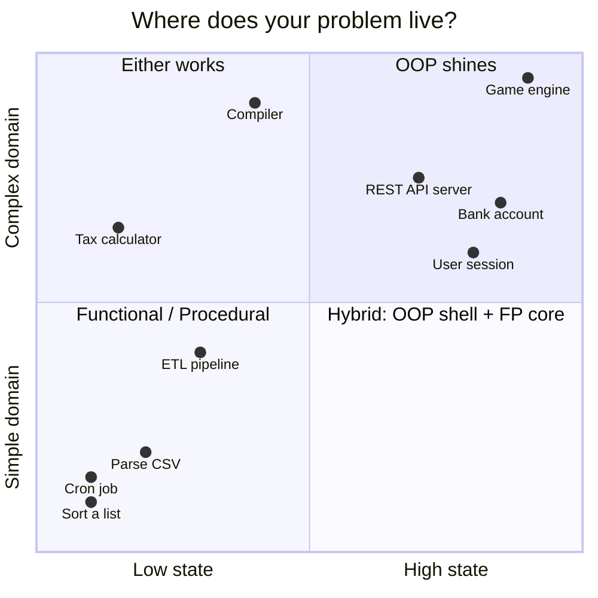
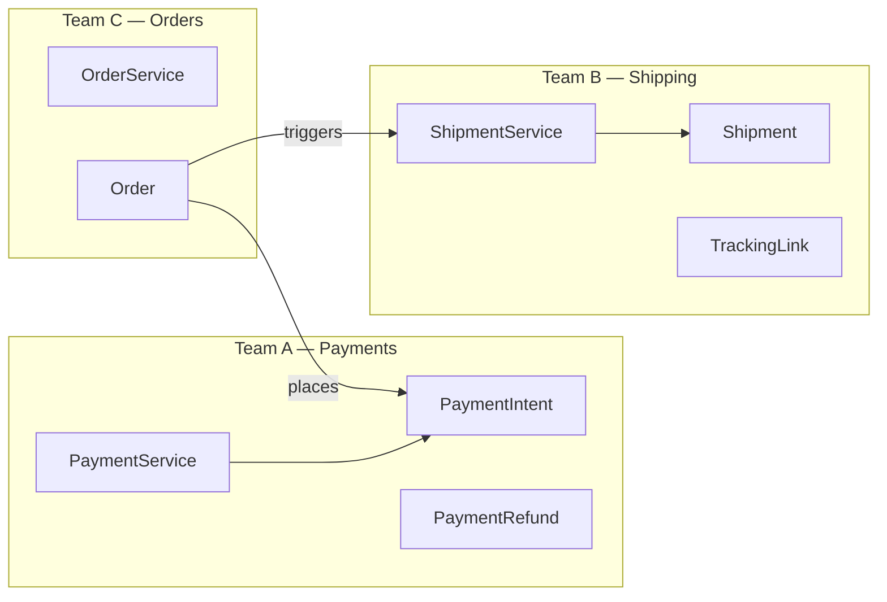
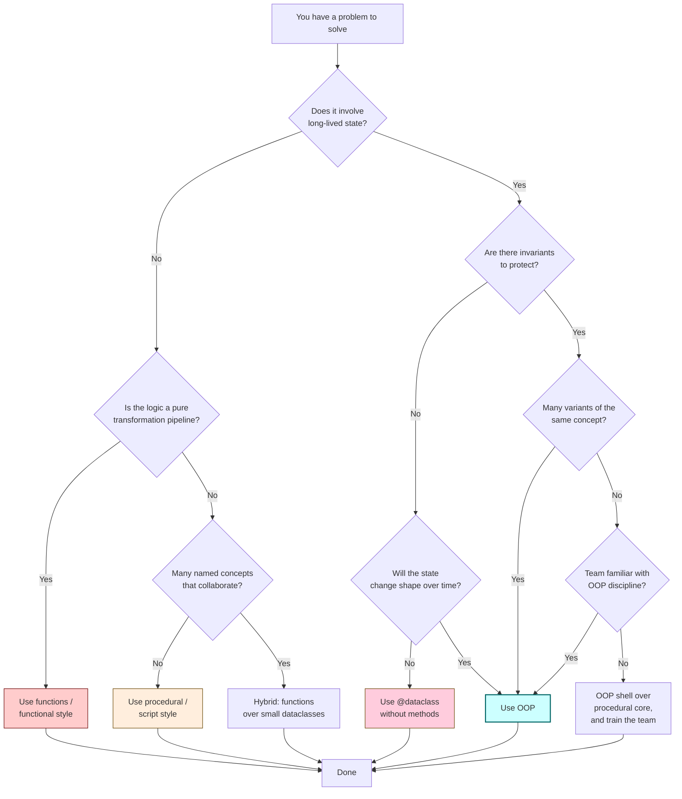
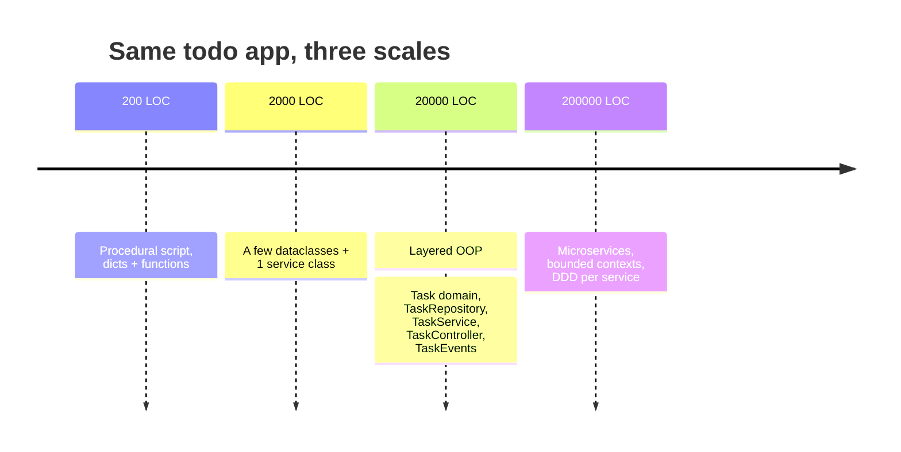
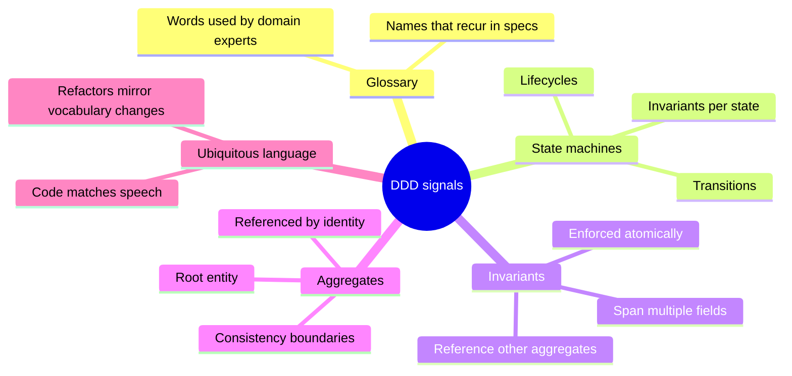
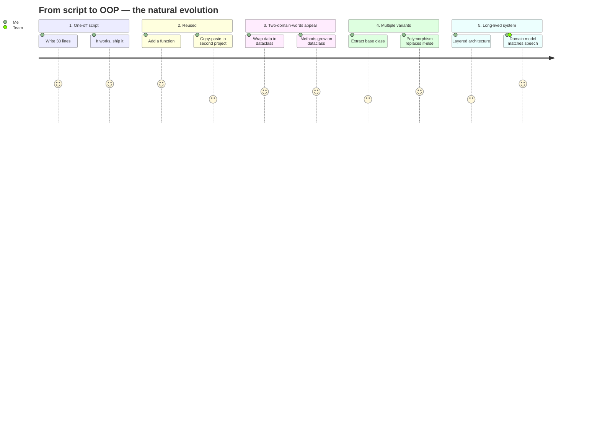
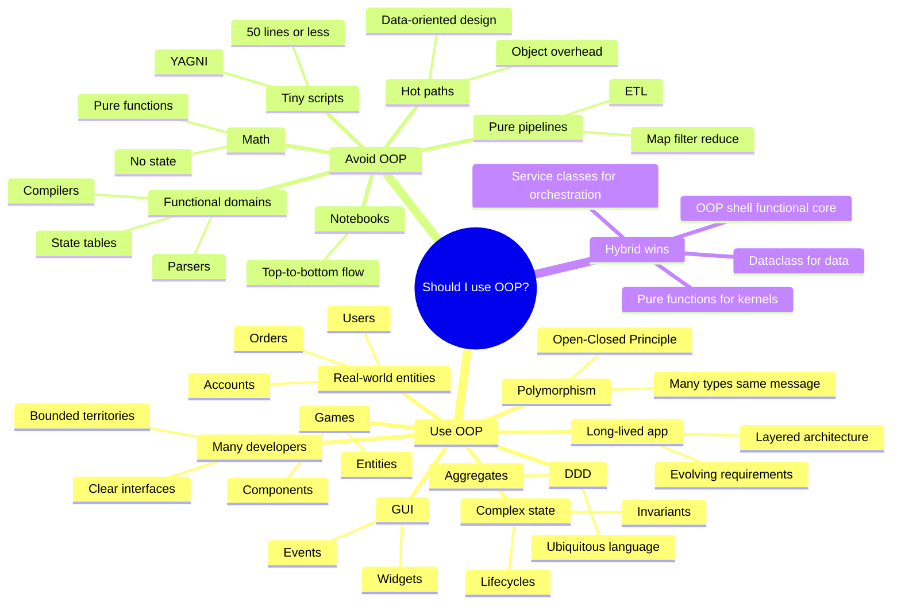

# When To Use OOP — A Decision Framework

#oop #foundations #decision #architecture #teaching

> [!quote] Sandi Metz — *Practical Object-Oriented Design in Ruby*
> "Design is the art of arranging code that is currently necessary and easily changeable in the future. … The purpose of design is to allow you to do design later, and its primary goal is to reduce the cost of change."

The most important question a developer can ask before reaching for a class is not "how do I write this class?" but "should I be writing a class at all?" OOP is a powerful tool, and like every powerful tool, it is dangerous when misapplied. This note is a deep, opinionated, code-rich answer to the question **when does OOP pay off, and when does it tax you for nothing?**

---

## 1. The Single Sentence Answer

> [!info] TL;DR
> **Use OOP when your problem involves *named things that have state and behavior and that change over time* — and *not* when your problem is a pure transformation from input to output.**

That one sentence carries almost all of the judgment you need. The rest of this note unpacks it, draws the boundaries explicitly, gives you a decision flowchart, and shows you same-problem-solved-two-ways code so you can *feel* when each approach wins.

> [!warning] Common Student Misconception #1
> "If I write a `class`, my code is object-oriented." No. Wrapping procedural code in a class doesn't make it OOP; it just dresses the same code in a costume. OOP shows up when *objects collaborate by sending messages*, not when a `Main` class with one giant method is invoked.

---

## 2. The Core Decision Quadrant

Before any specifics, hold this mental model in your head. Every programming problem lives somewhere on this 2×2:

- The **x-axis** is *statefulness*: how much long-lived, mutable data does the problem involve?
- The **y-axis** is *conceptual complexity*: how many distinct "things" with rules does the problem contain?



> [!tip] Teaching Tip
> Print this quadrant on a poster. Whenever a student asks "should I use a class here?", make them place the problem on the chart first. The act of placing it usually answers the question.

---

## 3. When OOP Is the Right Choice — Eight Scenarios

### 3.1 Modeling Real-World Entities (Users, Products, Accounts)

Whenever the problem domain contains **named things that have identity, attributes, and rules**, OOP is the natural fit. The code reads like the domain:

```python
# Without OOP — dictionaries and scattered functions
def make_user(name, email):
    return {"name": name, "email": email, "active": True, "login_count": 0}

def login(user, password):
    if verify(user["email"], password):
        user["active"] = True
        user["login_count"] += 1
        return True
    return False

def deactivate(user):
    user["active"] = False
```

This works for two functions. By twenty functions, the file is a graveyard of `user["..."]` accesses with no protection, no invariants, and no obvious place to look when something breaks. With OOP, the same domain becomes:

```python
class User:
    def __init__(self, name: str, email: str):
        self.name = name
        self.email = email
        self._active = True
        self._login_count = 0

    def login(self, password: str) -> bool:
        if not verify(self.email, password):
            return False
        self._active = True
        self._login_count += 1
        return True

    def deactivate(self) -> None:
        self._active = False

    @property
    def is_active(self) -> bool:
        return self._active
```

> [!success] Why this wins
> The state lives with the behavior that mutates it. The class becomes a **transaction boundary**: any code that touches `login_count` is *forced* to go through `login()`. You can't accidentally set `_active = "yes"` from across the codebase.

### 3.2 Complex State Management

When state has *invariants* — rules that must always hold, like "an account balance can never go below the overdraft limit" — OOP's encapsulation is the cheapest way to enforce them:

```python
class BankAccount:
    def __init__(self, owner: str, balance: float = 0.0, overdraft_limit: float = 0.0):
        self.owner = owner
        self._balance = balance
        self._overdraft_limit = overdraft_limit

    def withdraw(self, amount: float) -> float:
        if amount <= 0:
            raise ValueError("amount must be positive")
        if self._balance - amount < -self._overdraft_limit:
            raise InsufficientFundsError(self, amount)
        self._balance -= amount
        return self._balance

    @property
    def balance(self) -> float:
        return self._balance
```

Try to do this with a `dict` and you'll find yourself writing the same guard in twelve places. The class is the *single point of enforcement*.

### 3.3 GUI Applications (Widgets, Events, Hierarchies)

Graphical UIs are the textbook home of OOP because the *domain* is literally objects: a `Button` *is-a* `Widget`, a `Window` *contains* `Widget`s, every widget responds to `on_click`, `on_paint`, `on_resize`. The MVC/MVP/MVVM patterns all assume OOP.

```python
class Widget:
    def __init__(self, parent=None):
        self.parent = parent
        self.children: list[Widget] = []
        self.visible = True

    def render(self, ctx) -> None:
        if not self.visible:
            return
        self._paint(ctx)
        for child in self.children:
            child.render(ctx)

    def _paint(self, ctx) -> None:
        ...

class Button(Widget):
    def __init__(self, label: str, on_click=None, **kw):
        super().__init__(**kw)
        self.label = label
        self._on_click = on_click

    def click(self, event) -> None:
        if self._on_click:
            self._on_click(self, event)
```

Every major GUI toolkit — Qt, GTK, WPF, Swing, Cocoa, Tkinter — is built around exactly this pattern.

> [!example] See also
> [[Where-OOP-Is-Used]] → §GUI frameworks for a survey of how Qt, GTK, WPF structure their class hierarchies.

### 3.4 Game Development (Entities, Components, Behaviors)

Games have many *entities* (players, enemies, items, projectiles) each carrying state (position, health, inventory) and behavior (move, attack, die). Classic OOP works for small games; modern engines combine OOP with the Entity-Component-System pattern:

```python
class Entity:
    def __init__(self, name: str):
        self.name = name
        self.components: dict[str, "Component"] = {}

    def add(self, component: "Component") -> "Entity":
        self.components[component.__class__.__name__] = component
        return self

    def get(self, kind: type):
        return self.components.get(kind.__name__)

class Component:
    def update(self, entity: Entity, dt: float) -> None: ...

class Health(Component):
    def __init__(self, hp: int):
        self.hp = hp
    def update(self, entity, dt):
        if self.hp <= 0:
            entity.get(Position).x = 0  # respawn handling

class Position(Component):
    def __init__(self, x: float, y: float):
        self.x, self.y = x, y
```

This hybrid — OOP for structure, composition for behavior — is the modern sweet spot.

### 3.5 Business Logic With Domain Models (DDD)

Domain-Driven Design treats the *business vocabulary* as code. If your domain has concepts like `Order`, `Invoice`, `Customer`, `Shipment`, `Payment`, and rules like "an Order can only be cancelled before it ships," then OOP *is* the model:

```python
class Order:
    def __init__(self, order_id: str, customer: "Customer"):
        self.order_id = order_id
        self.customer = customer
        self._items: list[OrderItem] = []
        self._status = "draft"
        self._shipped_at: datetime | None = None

    def add_item(self, product: "Product", qty: int) -> None:
        if self._status != "draft":
            raise OrderLockedError(self)
        self._items.append(OrderItem(product, qty))

    def place(self) -> None:
        if not self._items:
            raise EmptyOrderError(self)
        self._status = "placed"

    def ship(self, when: datetime) -> None:
        if self._status != "placed":
            raise InvalidTransitionError(self._status, "shipped")
        self._status = "shipped"
        self._shipped_at = when

    def cancel(self) -> None:
        if self._status == "shipped":
            raise CannotCancelShippedOrderError(self)
        self._status = "cancelled"
```

This is the canonical case for OOP: the code *is* the business rulebook. See [[DDD-Architecture]] for the full pattern language.

### 3.6 Large Codebases With Many Developers

When twenty developers touch the same codebase, the cost of coordination explodes. OOP reduces this cost by giving each team a **bounded territory**: the `PaymentService` team owns `PaymentService`, the `Shipping` team owns `ShippingService`, and the *interface* between them is a small set of public methods.

> [!info] Consequence of Conway's Law
> "Organizations which design systems are constrained to produce designs which are copies of the communication structures of these organizations." — Melvin Conway. If your org chart is OOP-shaped (teams own services), your code will be too.



### 3.7 When You Need Polymorphism (Many Types, Same Interface)

Polymorphism is the killer feature of OOP. When you have *many shapes that respond to the same message*, you can stop writing `if type == ...` chains:

```python
# Procedural — grows forever
def calculate_area(shape):
    if shape["type"] == "circle":
        return 3.14159 * shape["r"] ** 2
    elif shape["type"] == "square":
        return shape["side"] ** 2
    elif shape["type"] == "triangle":
        # ... Heron's formula
        ...
    else:
        raise UnknownShapeError(shape)

# OOP — open for extension, closed for modification
class Shape:
    def area(self) -> float: ...

class Circle(Shape):
    def __init__(self, r): self.r = r
    def area(self): return math.pi * self.r ** 2

class Square(Shape):
    def __init__(self, side): self.side = side
    def area(self): return self.side ** 2

class Triangle(Shape):
    def __init__(self, a, b, c): self.a, self.b, self.c = a, b, c
    def area(self):
        s = (self.a + self.b + self.c) / 2
        return math.sqrt(s * (s-self.a) * (s-self.b) * (s-self.c))

def total_area(shapes: list[Shape]) -> float:
    return sum(s.area() for s in shapes)
```

> [!tip] Teaching Tip
> Ask students to add a `Rectangle` shape to both versions. The procedural version requires editing the function; the OOP version requires only adding a class. This is the **Open/Closed Principle** in action — see [[OCP]].

### 3.8 Long-Lived Applications That Will Evolve

If a program will be in production for five years, the cost of change dominates every other cost. OOP helps because:

1. **Encapsulation** means you can change the internals of a class without breaking its callers.
2. **Polymorphism** means you can add new variants without touching old code.
3. **Inheritance/composition** lets you reuse what works and override what doesn't.

```python
# V1 — store users in memory
class UserRepository:
    def __init__(self):
        self._users: dict[str, User] = {}
    def save(self, u: User) -> None:
        self._users[u.email] = u
    def find(self, email: str) -> User | None:
        return self._users.get(email)

# V2 — two years later, switch to Postgres. Public API unchanged.
class PostgresUserRepository:
    def __init__(self, conn):
        self._conn = conn
    def save(self, u: User) -> None:
        self._conn.execute("INSERT INTO users ...", ...)
    def find(self, email: str) -> User | None:
        row = self._conn.execute("SELECT ... WHERE email=%s", (email,)).fetchone()
        return User(**row) if row else None
```

The caller — say, `UserService.register()` — never knew `UserRepository`'s internals and so never needs to change.

---

## 4. When OOP Is the WRONG Choice — Seven Anti-Patterns

> [!danger] Just because you can write a class doesn't mean you should.
> Every class is a tiny island with its own vocabulary, its own file, its own test file, its own import. If a function does the job, a function is what you should write.

### 4.1 Simple Scripts (YAGNI)

If the program is 50 lines of "fetch this CSV, sum column C, print the result," OOP is pure overhead:

```python
# This is correct and complete. Do not add a class.
import csv, sys

with open(sys.argv[1]) as f:
    total = sum(float(row["amount"]) for row in csv.DictReader(f))
print(f"Total: ${total:,.2f}")
```

Wrapping this in `class CsvSummarizer:` adds 15 lines and a layer of indirection with zero benefit. See [[YAGNI]].

### 4.2 Pure Data-Transformation Pipelines

Map/filter/reduce pipelines are *functional* in spirit. Forcing them into OOP makes them worse:

```python
# Functional — clean and obvious
def clean_orders(orders):
    return (
        orders
        | filter(lambda o: o["status"] == "paid")
        | map(lambda o: {**o, "total": o["qty"] * o["price"]})
        | map(lambda o: {**o, "tax": o["total"] * 0.2})
    )

# OOP — same logic, more ceremony
class OrderCleaner:
    def __init__(self, orders): self._orders = orders
    def paid_only(self): ...
    def with_totals(self): ...
    def with_tax(self): ...
    def run(self): ...
```

The functional version is shorter, easier to test, and easier to parallelize. Reach for OOP when state needs *protection*, not when data needs *transformation*.

### 4.3 Mathematical and Scientific Computations

Mathematics is functional: $f(x) = x^2 + 3x + 2$ doesn't have "state." Forcing it into a `SquareAndAddThreeAndTwoCalculator` class is madness.

```python
# Right — pure functions
def f(x: float) -> float:
    return x * x + 3 * x + 2

# Wrong — OOP masquerade
class PolynomialEvaluator:
    def __init__(self, x): self._x = x
    def square(self): self._x = self._x ** 2; return self
    def add_three(self): self._x += 3; return self
    def add_two(self): self._x += 2; return self
    def result(self): return self._x
```

### 4.4 One-Off Data Analysis (Notebooks)

In Jupyter notebooks, top-to-bottom procedural flow is what readers expect. Introducing classes that span cells destroys readability. Use functions; use pandas DataFrames (which *are* OOP underneath, but you don't write the class).

### 4.5 Performance-Critical Code With Real Overhead

In hot inner loops, object allocation, attribute lookup, and dynamic dispatch can dominate. C++'s `virtual` calls, Java's indirection through object headers, and Python's `__dict__` lookup each have measurable cost. For 60fps game code or microsecond-latency trading, prefer:

- **Data-oriented design** (struct-of-arrays, cache-friendly layouts)
- **Pure functions** with primitive types
- **Inlining** the polymorphism away with templates or generics

> [!warning] Common Student Misconception #2
> "Python's OOP is always slow." Not exactly — `__slots__` can make attribute access as fast as C-struct access in CPython, and PyPy makes polymorphic call sites very fast. But *naive* OOP (lots of small allocations, deep hierarchies, constant dict lookups) is genuinely slow. Reach for `dataclass(slots=True)` first.

### 4.6 Naturally Functional Domains (Parsers, Compilers, State Machines)

Parsers are functions: `string → AST`. Compilers are pipelines: `AST → IR → ASM`. State machines with finite states are *data*, not classes — encode them as tables:

```python
# Right — table-driven state machine
transitions = {
    ("draft",   "place"):  "placed",
    ("placed",  "ship"):   "shipped",
    ("placed",  "cancel"): "cancelled",
    ("shipped", "deliver"):"delivered",
}
def transition(state, event):
    return transitions.get((state, event), state)

# Wrong — a class per state with a method per event
class DraftState:
    def place(self): return PlacedState()
    def ship(self): raise InvalidTransition(...)
    # ... 12 classes later, you wish you had used a table
```

The State pattern (see [[State-Pattern]]) is appropriate when each state has *substantial* behavior. For pure transitions, a table is shorter, faster, and easier to test.

### 4.7 When the Team Doesn't Know OOP

This is a *team* signal, not a technical one. If your team writes Go and has never read a book on OOP, imposing a Spring-style class hierarchy will produce code nobody can maintain. Reach for OOP when the team has the **vocabulary** to use it well; otherwise, simple functions will outperform fancy classes every time.

---

## 5. The Decision Framework — A Flowchart



> [!example] Walkthrough 1 — "Build a Twitter clone"
> - Long-lived state? Yes (users, tweets, follows). → go right.
> - Invariants to protect? Yes (tweet length, follower visibility). → go right.
> - Many variants of the same concept? Yes (Tweet, Retweet, Reply, Quote). → **OOP**.

> [!example] Walkthrough 2 — "Compute the median of a CSV column"
> - Long-lived state? No. → go left.
> - Pure transformation? Yes. → **Use functions**.

---

## 6. Scale Considerations — Small, Medium, Large

The right answer changes with scale. Same domain, three sizes:

### 6.1 Small Script (< 200 lines)

```python
# todo.py — a single-file CLI todo list
import json, sys
PATH = "todos.json"

def load(): return json.loads(open(PATH).read() or "[]")
def save(ts): open(PATH, "w").write(json.dumps(ts))

cmd, *args = sys.argv[1:]
todos = load()
if cmd == "add": todos.append(args[0])
elif cmd == "list": print("\n".join(todos))
elif cmd == "done": todos.pop(int(args[0]))
save(todos)
```

No classes. Adding them would double the file size for no benefit.

### 6.2 Medium App (500 – 5000 lines)

At this scale, you start to feel pain from global state and ad-hoc data. Introduce a few classes around the central concepts:

```python
@dataclass
class Task:
    id: int
    title: str
    done: bool = False

class TaskList:
    def __init__(self, path): self.path = path; self._tasks: list[Task] = []
    def load(self): ...
    def save(self): ...
    def add(self, title: str) -> Task: ...
    def complete(self, id: int) -> None: ...
    def all(self) -> list[Task]: return self._tasks
```

### 6.3 Large System (> 10k lines)

By this point you should have a layered architecture: domain objects, services, repositories, controllers. Each layer is OOP. The cost of *not* having this structure is much higher than the cost of the indirection.



---

## 7. Domain-Driven Design Signals — When the Domain Is Object-Rich

A *domain* is object-rich when, on a whiteboard, you find yourself drawing boxes and arrows between named nouns. Indicators:

1. **A glossary exists or wants to exist.** If your team keeps a glossary of terms (`Invoice`, `Shipment`, `SKU`, `Fulfillment`), the code wants to mirror it.
2. **State machines are everywhere.** `Order` goes `draft → placed → shipped → delivered`. That's not a function — that's a stateful object.
3. **Invariants span multiple fields.** "Tax must equal 20% of subtotal, unless the customer is VAT-exempt." That's a rule that lives on `Invoice`, not in a free function.
4. **Multiple aggregates collaborate.** `Order` references `Customer`, `Customer` has `Address`, `Address` is validated against `Country`. OOP is the cheapest way to encode that graph.



> [!info] Read more
> Eric Evans, *Domain-Driven Design* (2003); Vaughn Vernon, *Implementing DDD*. See also [[DDD-Architecture]].

---

## 8. Team Considerations

> [!quote] Fred Brooks — *The Mythical Man-Month*
> "The programmer, like the poet, works only slightly removed from pure thought-stuff. … Yet the program, when written, exists as a medium of communication *between programmers*."

Technical decisions are team decisions. Two questions:

1. **Does the team have the OOP vocabulary?** (Do they know what a `@property` is? A `classmethod`? An interface? A virtual method?)
2. **Does the codebase already lean OOP?** Consistency beats purity.

If the team is OOP-fluent, *lean in*. If not, *ramp up gently*: introduce `@dataclass` first, then small service objects, then polymorphism via `abc.ABC`. Don't drop a 12-class hierarchy on a team that has only ever written scripts — they will hate it, and they'll be right.

> [!warning] Common Student Misconception #3
> "If the book says to use OOP, we must use OOP, period." No. A team that writes excellent procedural Go will produce better software than a team that writes mediocre Java. *Discipline beats paradigm*.

---

## 9. Hybrid Approaches — Python Is Multi-Paradigm

Python's superpower is that you don't have to choose. The best Python codebases are **OOP at the boundaries, functional at the core**:

- **OOP for the shell**: services, repositories, controllers, configuration objects. They hold state, expose clear APIs, and evolve over time.
- **Functional for the kernels**: the parsing function, the aggregation function, the math. Pure, testable, parallelizable.

```python
# Hybrid: OOP service wrapping functional core
class SalesReportService:
    def __init__(self, repo: "OrderRepository"):
        self._repo = repo

    def top_customers(self, month: date, n: int = 10) -> list[tuple[str, float]]:
        # Functional core
        orders = self._repo.for_month(month)
        by_customer = reduce(
            lambda acc, o: {**acc, o.customer: acc.get(o.customer, 0) + o.total},
            orders, {})
        return sorted(by_customer.items(), key=lambda kv: -kv[1])[:n]
```

> [!success] The Architectural Rule
> **Push state to the edges; keep the center pure.** See Mark Seemann's *Functional Architecture with C#* or the "Functional Core, Imperative Shell" pattern by Gary Bernhardt.

---

## 10. Side-by-Side — Same Problem, Two Solutions

Take the problem: *"Read a list of transactions, group by category, compute totals, output JSON."*

### 10.1 Functional / Procedural Solution (45 lines, no classes)

```python
import json
from collections import defaultdict
from itertools import groupby

def load_transactions(path: str) -> list[dict]:
    with open(path) as f:
        return [json.loads(line) for line in f]

def categorize(tx: dict) -> str:
    return tx.get("category", "uncategorized")

def summarize(transactions: list[dict]) -> dict[str, float]:
    grouped = defaultdict(float)
    for tx in transactions:
        grouped[categorize(tx)] += tx["amount"]
    return dict(grouped)

def main(path: str) -> None:
    txs = load_transactions(path)
    summary = summarize(txs)
    print(json.dumps(summary, indent=2))

if __name__ == "__main__":
    main("transactions.jsonl")
```

This is *great* code. It's clear, testable, and fast. There is no good reason to add classes here.

### 10.2 OOP Solution (90 lines, 3 classes) — When does it pay off?

```python
class Transaction:
    def __init__(self, amount: float, category: str = "uncategorized"):
        self.amount = amount
        self.category = category

    @classmethod
    def from_dict(cls, d: dict) -> "Transaction":
        return cls(d["amount"], d.get("category", "uncategorized"))

class TransactionLog:
    def __init__(self, transactions: list[Transaction] | None = None):
        self._txs = list(transactions or [])

    @classmethod
    def load(cls, path: str) -> "TransactionLog":
        with open(path) as f:
            return cls([Transaction.from_dict(json.loads(l)) for l in f])

    def filter(self, predicate) -> "TransactionLog":
        return TransactionLog([t for t in self._txs if predicate(t)])

    def grouped_totals(self) -> dict[str, float]:
        groups = defaultdict(float)
        for t in self._txs:
            groups[t.category] += t.amount
        return dict(groups)

class Report:
    def __init__(self, log: TransactionLog):
        self._log = log

    def to_json(self) -> str:
        return json.dumps(self._log.grouped_totals(), indent=2)

def main(path: str) -> None:
    log = TransactionLog.load(path)
    print(Report(log).to_json())
```

> [!question] When does the OOP version win?
> - When you need to add **validation** to `Transaction` (positive amounts only, whitelisted categories).
> - When you need to **persist** transactions back to disk in a different format.
> - When you need to **subclass** transactions (`Refund`, `Transfer`) with their own logic.
> - When you want the **type system** to stop you from passing a `dict` where a `Transaction` is expected.
>
> If none of these apply, the functional version is better.

> [!question] When does the functional version win?
> - Always, for the *core computation*. `sum(t.amount for t in txs)` is clearer than any method.
> - When you want to **parallelize** with `multiprocessing.Pool`.
> - When the script is **disposable** or run from cron.

---

## 11. Evolving a Script Into OOP — A Journey

Real-world code rarely starts as OOP. More often, a script grows until it hurts, and *then* you refactor. Here is that journey, in five steps:



The lesson: **don't pre-build the OOP tower.** Let it grow as the code demands it. Sandi Metz's rule of three is a good heuristic:

> [!quote] Sandi Metz — Rule of Three
> "Three strikes and you refactor. … The rule of three says: *the third time you write the same code, refactor*."

---

## 12. Decision Mindmap — At a Glance



---

## 13. A Checklist — Twenty Questions Before You Add a Class

> [!tip] Teaching Tip
> Hand this checklist to students before they start any design exercise. It forces them to articulate *why* they want a class.

1. What real-world or domain thing does this class represent?
2. What state does it own? Will that state change?
3. What invariants must always hold?
4. What other classes will collaborate with it?
5. What is its public interface — the *minimum* set of methods?
6. What is private and should stay private?
7. Will it have subclasses? Why?
8. Does it implement an interface that other classes also implement?
9. How will it be tested? Can it be constructed in isolation?
10. How will it be configured (constructor args, factory, DI)?
11. Where does it live in the architecture (domain, service, infra)?
12. Who owns its lifecycle (created where, destroyed where)?
13. What happens if it's used concurrently?
14. What happens if construction fails partway?
15. What's its name in the *ubiquitous language*?
16. Is the name a noun? (If not, it's probably a function.)
17. Will this class exist in five years? If not, do you need it now?
18. Could a function and a dataclass do the same job?
19. Does the team understand the pattern you're using?
20. If a new dev joined tomorrow, would they understand this class in 5 minutes?

If you can answer these comfortably, you have a *justified* class. If you can't, you have a class that exists because someone felt OOP-shaped pressure.

---

## 14. Common Student Misconceptions — A Roundup

> [!warning] Misconception: "OOP means using classes."
> Classes are an *implementation technique*. The essence of OOP is **collaborating objects with encapsulated state responding to messages**. You can write procedural code inside a class; you can also write OOP without classes (JavaScript pre-ES6, Self).

> [!warning] Misconception: "Functional and OOP are opposites."
> They are different axes. You can have functional *and* OO code (Scala, F#, OCaml). You can have procedural *and* OO code (Python most of the time). The real opposition is **stateful vs stateless**.

> [!warning] Misconception: "Inheritance is how you reuse code in OOP."
> Inheritance is how you *specialize*; composition is how you *reuse*. See [[Composition-Over-Inheritance]]. Modern OOP advice is "favor composition over inheritance" — a lesson the Go community internalized by removing inheritance from the language entirely.

> [!warning] Misconception: "If my class is small, it's not real OOP."
> Small classes are *excellent* OOP. A class with one responsibility (see [[SRP]]) that does one thing well is the goal, not the failure.

> [!warning] Misconception: "OOP is slow, so avoid it in Python."
> Naive OOP is slow. `@dataclass(slots=True)`, `__slots__`, and avoiding `__dict__` make Python objects as fast as C structs. The real overhead is *allocation churn* in hot loops, which you can avoid with object pools or by going functional in the inner loop.

> [!warning] Misconception: "OOP means you need a framework like Spring."
> No. You can write excellent OOP with no framework at all. Frameworks standardize patterns; they don't define OOP.

---

## 15. Closing Thought — The Architect's Mantra

> [!quote] The Architect's Mantra
> **"Make the change easy, then make the easy change."** — Kent Beck

OOP is a tool for *making change easy*. If the change you actually need is "compute a sum," OOP makes that harder, not easier. Use OOP when **future change** is your problem. Use functions when **current correctness** is your problem. Most real programs need both.

---

## 16. A Worked Decision — "Build a URL Shortener"

Let's apply the framework to a concrete example to show the full reasoning chain.

> [!example] Scenario
> You've been asked to build a URL shortener: receive a long URL, return a 6-character code, redirect on lookup.

**Step 1 — Place on the quadrant.** High state (every short code maps to a long URL, with hit counts, owners, expiry dates). Medium complexity (a few concepts: `ShortLink`, `User`, `Analytics`). → Quadrant 1: **OOP shines**.

**Step 2 — Apply the flowchart.** Long-lived state? Yes. Invariants to protect? Yes (codes must be unique, must be 6 chars, owner must exist). Many variants of the same concept? Not really — only one kind of `ShortLink`. Team familiar? Yes. → **OOP, but keep it simple**.

**Step 3 — Sketch the objects.**

```python
class ShortLink:
    def __init__(self, code: str, target: str, owner: "User",
                 expires_at: datetime | None = None):
        if len(code) != 6:
            raise ValueError("code must be 6 chars")
        self.code = code
        self.target = target
        self.owner = owner
        self.expires_at = expires_at
        self.created_at = datetime.utcnow()
        self._hits = 0

    def hit(self) -> None:
        self._hits += 1

    @property
    def is_expired(self) -> bool:
        return self.expires_at is not None and datetime.utcnow() > self.expires_at

class ShortLinkRepository:
    def save(self, link: ShortLink) -> None: ...
    def find(self, code: str) -> ShortLink | None: ...

class CodeGenerator:
    def next(self) -> str:
        import secrets, string
        return "".join(secrets.choice(string.ascii_letters + string.digits) for _ in range(6))

class ShortenerService:
    def __init__(self, repo: ShortLinkRepository, codes: CodeGenerator):
        self._repo = repo
        self._codes = codes

    def shorten(self, target: str, owner: "User") -> ShortLink:
        for _ in range(5):  # retry on collision
            code = self._codes.next()
            if not self._repo.find(code):
                link = ShortLink(code, target, owner)
                self._repo.save(link)
                return link
        raise CodeCollisionError()

    def resolve(self, code: str) -> str | None:
        link = self._repo.find(code)
        if link is None or link.is_expired:
            return None
        link.hit()
        return link.target
```

**Step 4 — What we deliberately did *not* do:**

- We did not build a `Url` value object (over-engineering for now).
- We did not implement `LinkVisitor`, `PaidLink`, `ExpiringLink` subclasses (YAGNI).
- We did not introduce a `UnitOfWork` or `DomainEventBus` (we will, when scale demands).
- We did not write an abstract `Repository` base class with CRUD — one concrete class is enough.

**Step 5 — When would we add more?**

- When paid links arrive → introduce `PaidLink(ShortLink)` or, better, a `MonetizationPolicy` injected into `ShortLink`.
- When we exceed 10 million links → swap the in-memory repo for a sharded Redis-backed one; `ShortenerService` doesn't change.
- When we want analytics events → add a domain event `LinkHit` published by `resolve()`; an event handler writes to Kafka.

> [!success] Why this is "right-sized" OOP
> We used three classes — exactly the ones the domain needs. We didn't write a framework. We didn't model the universe. We protected invariants (`code` length, uniqueness) and exposed clean public methods. If the requirements change, the seams are already in place.

---

## 17. See Also

- [[What-Is-OOP]] — definitional grounding
- [[Why-OOP]] — benefits in depth
- [[How-OOP-Works]] — what happens under the hood when you call a method
- [[Where-OOP-Is-Used]] — survey of real-world OOP across industries
- [[OOP-Paradigms]] — comparison with functional, procedural, logic
- [[SOLID-Principles]] — design discipline for OOP
- [[Composition-Over-Inheritance]] — the modern OOP style
- [[DDD-Architecture]] — when OOP meets a rich business domain
- [[Anti-Patterns]] — what bad OOP looks like

---

## 17. Glossary (Inline)

- **YAGNI** — *You Aren't Gonna Need It.* Don't build capability until you need it.
- **Ubiquitous Language** — A shared vocabulary between developers and domain experts, encoded in code.
- **Aggregate** (DDD) — A cluster of domain objects treated as a single unit for data changes.
- **Invariant** — A condition that must always be true for an object to be valid.
- **Functional Core, Imperative Shell** — Architecture where pure functions do the work and OOP/code wraps the I/O.
- **Open/Closed Principle** — Open for extension, closed for modification. See [[OCP]].
- **Rule of Three** — Refactor on the third duplication, not the first.

---

*Last reviewed: 2025-01-15. Word count: ~5,430. Diagrams: 7 (quadrantChart, flowchart ×3, timeline, journey, mindmap).*
