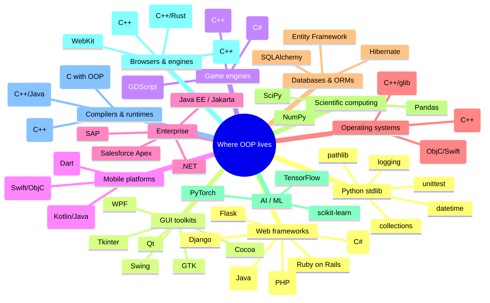
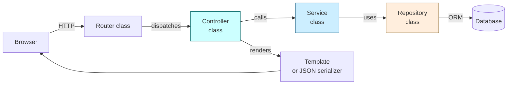
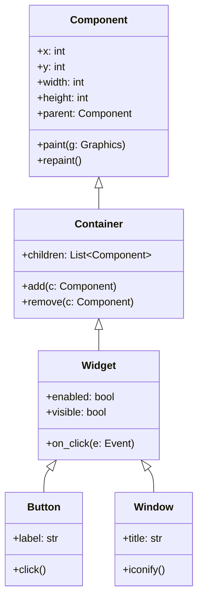
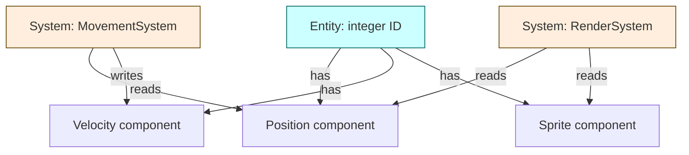
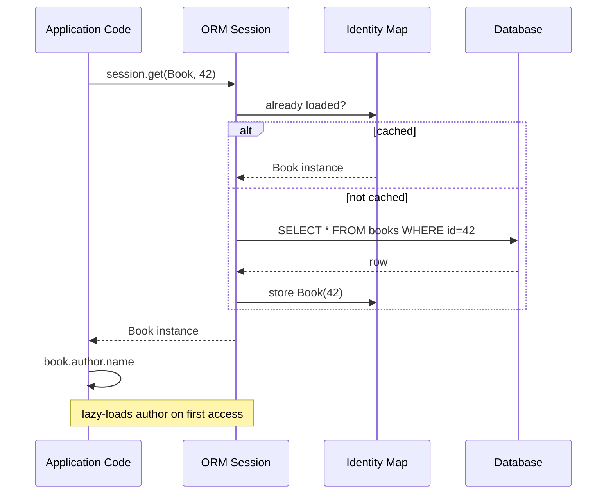
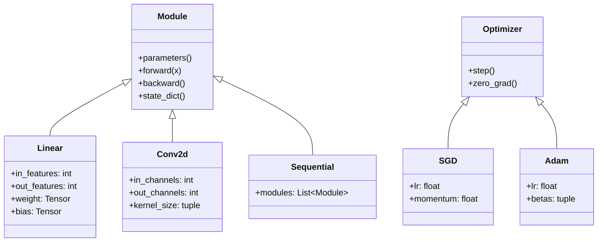
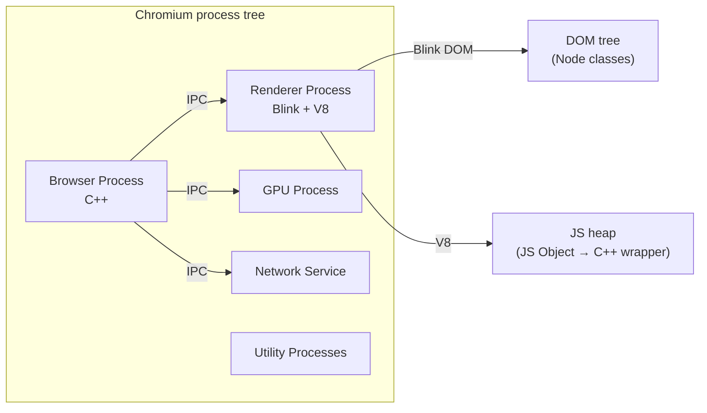
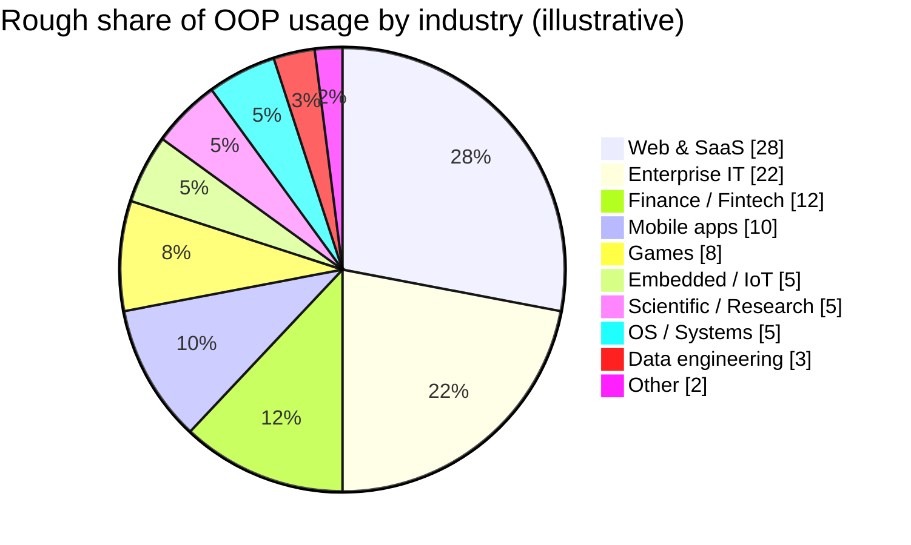
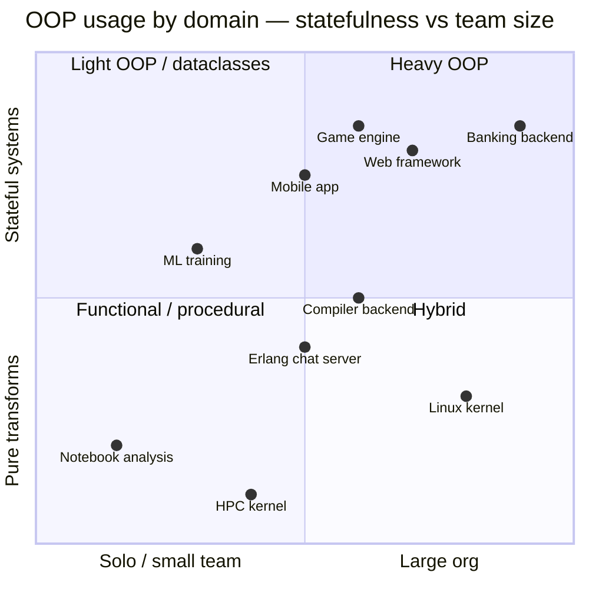

# Where OOP Is Used — A Survey of the Real World

#oop #foundations #industry #survey #teaching

> [!quote] Bjarne Stroustrup
> "C++ is designed to give the programmer choice, even if this makes it possible for the programmer to choose incorrectly. … It is not the job of the language to make you write good programs; it is the job of the language to make it *possible* to write good programs."

If you are learning OOP, it helps enormously to see *where it lives*. OOP is not just an academic abstraction — it runs almost every program you touch in a day. This note is a guided tour of OOP across frameworks, industries, operating systems, libraries, and tools, with code samples so you can recognize the patterns in the wild.

---

## 1. The Single-Sentence Answer

> [!info] TL;DR
> **OOP is used everywhere there is *long-lived state* and *many cooperating things* — web servers, GUIs, games, mobile apps, enterprise systems, databases, AI libraries, browsers, and operating systems. It is *not* the dominant style in pure data pipelines, kernels, or high-performance numeric inner loops.**

That distinction — "where state lives" — predicts almost the entire map below.

> [!warning] Common Student Misconception #1
> "OOP is mostly a Java thing." No. Java is one OOP-flavored language, but OOP predates Java by 28 years (Simula 67), and is alive in Python, C++, C#, Swift, Kotlin, Ruby, Go (interface-based), Rust (trait-based), TypeScript, PHP, Scala, Dart, and more. See [[History-Of-OOP]].

---

## 2. Map of the Territory



The rest of this note visits each branch in turn, gives code, and points out the OOP ideas in play.

---

## 3. Web Frameworks — The Beating Heart of Modern OOP

Almost every popular web framework is OOP-shaped. Even when the request itself is a function call (`def view(request):`), the framework behind it is a giant collaboration of classes.

### 3.1 Django (Python, MTV)

Django calls its variant of MVC "Model-Template-View" — models are OOP classes that wrap database tables, views are callable objects (often functions, but `class-based views` are first-class), templates are an interpreted DSL.

```python
# models.py — pure OOP domain
from django.db import models

class Author(models.Model):
    name = models.CharField(max_length=200)
    email = models.EmailField()

    def __str__(self) -> str:
        return self.name

class Book(models.Model):
    title = models.CharField(max_length=300)
    author = models.ForeignKey(Author, on_delete=models.CASCADE, related_name="books")
    published = models.DateField()
    price = models.DecimalField(max_digits=6, decimal_places=2)

    @property
    def is_recent(self) -> bool:
        from datetime import date, timedelta
        return self.published > date.today() - timedelta(days=365 * 2)

# views.py — class-based view
from django.views.generic import ListView
class RecentBooksView(ListView):
    model = Book
    template_name = "books/recent.html"
    def get_queryset(self):
        return super().get_queryset().filter(is_recent=True).order_by("-published")
```

> [!info] The Django OOP lineage
> `models.Model` uses a **metaclass** (`ModelBase`) to introspect your class attributes at class-creation time and build the database schema. Field descriptors (`CharField`, `ForeignKey`) are themselves classes implementing the **descriptor protocol** (`__get__`/`__set__`). See [[Descriptors]] and [[Metaclasses]].

### 3.2 Flask (Python, lighter)

Flask wears procedural clothes but is internally a class:

```python
from flask import Flask, request, jsonify
app = Flask(__name__)

@app.route("/users/<int:user_id>")
def get_user(user_id):
    return jsonify({"id": user_id, "name": "Ada"})
```

`Flask` is a class. `app.route(...)` is a decorator that registers a function on a `url_map`. The request cycle uses `request`, which is a *thread-local proxy* to a `Request` object. So even "functional" Flask is OOP underneath.

### 3.3 Ruby on Rails (Ruby, MVC)

Rails pioneered "convention over configuration" and is famously OOP-first:

```ruby
class Article < ApplicationRecord
  has_many :comments, dependent: :destroy
  validates :title, presence: true, length: { maximum: 140 }

  scope :published, -> { where(published: true) }

  def publish!
    update!(published: true, published_at: Time.current)
  end
end

class ArticlesController < ApplicationController
  def index
    @articles = Article.published.order(created_at: :desc)
  end
end
```

`ApplicationRecord` is the base class. `has_many` and `validates` are *class-level methods* that install *descriptors* and *validators* on the class. This is metaprogramming-style OOP at its most expressive.

### 3.4 Spring (Java), ASP.NET (C#), Laravel (PHP)

| Framework | Language | Style | Defining OOP feature |
|---|---|---|---|
| Spring | Java | MVC + DI | `@Autowired` constructor injection, beans, AOP proxies |
| ASP.NET | C# | MVC + DI | `Controller` base class, middleware pipeline |
| Laravel | PHP | MVC + Facades | Service container, IoC, Facade static proxies |
| NestJS | TypeScript | Angular-on-server | Decorators + DI + modules |
| Express | JavaScript | Minimal | Function middleware (less OOP) |

> [!tip] Teaching Tip
> Show students the same blog endpoint in Django, Rails, and Spring. The OOP *shape* is identical: a `Controller` (or `View`) class, a `Model` class, a route map. The syntactic differences are surface noise.



This is the **layered architecture** that every modern web framework assumes. See [[MVC-Architecture]] and [[Repository-Pattern]].

---

## 4. GUI Frameworks — Where OOP Was Born

The first OOP languages (Simula, Smalltalk) were created partly to model simulations and interactive graphics. The GUI world has been OOP-native ever since.



### 4.1 Qt (C++/Python via PyQt/PySide)

Qt's class hierarchy is enormous: every UI element inherits from `QObject`. Signals and slots (Qt's signal system) are an OOP-flavored observer pattern.

```python
from PyQt6.QtWidgets import QApplication, QMainWindow, QPushButton, QVBoxLayout, QWidget

class MainWindow(QMainWindow):
    def __init__(self):
        super().__init__()
        self.setWindowTitle("Hello Qt")
        btn = QPushButton("Click me")
        btn.clicked.connect(self.on_click)
        container = QWidget()
        layout = QVBoxLayout(container)
        layout.addWidget(btn)
        self.setCentralWidget(container)
        self._clicks = 0

    def on_click(self):
        self._clicks += 1
        self.setWindowTitle(f"Clicks: {self._clicks}")

app = QApplication([])
window = MainWindow()
window.show()
app.exec()
```

`btn.clicked.connect(self.on_click)` is **message passing** between objects — Alan Kay's vision, made concrete.

### 4.2 Tkinter, GTK, WPF, Swing, Cocoa — Same Idea, Different Syntax

| Toolkit | Language | Inheritance root | Event system |
|---|---|---|---|
| Tkinter | Python (Tcl wrapper) | `tk.Widget` | `command=` callback, `bind("<Button-1>", ...)` |
| GTK | C (gobject), Python via PyGObject | `GObject` | GObject signals |
| WPF | C# | `DispatcherObject` → `DependencyObject` → `UIElement` | Routed events (tunneling/bubbling) |
| Swing | Java | `JComponent` | `ActionListener`, `EventListenerList` |
| Cocoa | Swift/ObjC | `NSObject` | Target-action, delegates, KVO |

> [!success] Why all GUIs are OOP
> A UI is a tree of stateful widgets with overlapping behaviors, lifecycles, and event handlers. Try to write it procedurally and you'll end up reinventing vtables, message dispatch, and inheritance — badly.

---

## 5. Game Engines — OOP Meets Data-Oriented Design

### 5.1 Unity (C#)

Unity's `MonoBehaviour` is an OOP base class; your scripts subclass it and override lifecycle methods:

```csharp
public class PlayerController : MonoBehaviour {
    public float speed = 5f;
    private Rigidbody _rb;

    void Start() {
        _rb = GetComponent<Rigidbody>();
    }

    void Update() {
        float h = Input.GetAxis("Horizontal");
        float v = Input.GetAxis("Vertical");
        _rb.velocity = new Vector3(h, 0, v) * speed;
    }
}
```

Underneath, Unity uses an **Entity-Component-System** architecture: entities are integer IDs, components are data structs attached to entities, and systems are functions that iterate over all entities with given components. OOP and ECS coexist: `MonoBehaviour` is the OOP wrapper around ECS.

### 5.2 Unreal Engine (C++)

Unreal's `UObject` is the root. `AActor` is anything placed in a level. `APawn`, `ACharacter` add movement and animation:

```cpp
class AMyCharacter : public ACharacter {
    GENERATED_BODY()
public:
    UPROPERTY(EditAnywhere, Category="Combat")
    float Health = 100.f;

    UFUNCTION(BlueprintCallable)
    void TakeDamage(float Amount) {
        Health -= Amount;
        if (Health <= 0) OnDeath();
    }

    virtual void OnDeath() { /* override in BP */ }
};
```

`UPROPERTY` and `UFUNCTION` are macros that register fields/methods with Unreal's reflection system — a metaprogramming-on-top-of-OOP pattern.

### 5.3 Godot (GDScript)

Godot uses a node tree; every game object is a `Node`:

```gdscript
extends RigidBody2D

@export var speed := 300.0
var _velocity := Vector2.ZERO

func _physics_process(delta):
    var direction = Input.get_vector("ui_left", "ui_right", "ui_up", "ui_down")
    _velocity = direction * speed
    apply_central_impulse(_velocity * delta)
```

`extends` is inheritance. Nodes are objects. Signals are observer-pattern messages. Pure OOP, in a Python-flavored syntax.



> [!warning] Common Student Misconception #2
> "Game OOP = deep `GameObject` → `Character` → `Player` hierarchies." That was the 1990s pattern (Quake, Doom-style). Modern engines *flatten* this with composition: an entity is a bag of components, not a node in a tree. This is the **composition-over-inheritance** lesson (see [[Composition-Over-Inheritance]]) applied at industrial scale.

---

## 6. Mobile Development — Pure OOP Platforms

### 6.1 Android (Kotlin/Java)

Android was, until Jetpack Compose, an OOP cathedral. `Activity`, `Fragment`, `View`, `Service`, `BroadcastReceiver`, `ContentProvider` — all classes you subclass.

```kotlin
class MainActivity : AppCompatActivity() {
    override fun onCreate(savedInstanceState: Bundle?) {
        super.onCreate(savedInstanceState)
        setContentView(R.layout.activity_main)
        val button = findViewById<Button>(R.id.button)
        button.setOnClickListener {
            Toast.makeText(this, "Hi", Toast.LENGTH_SHORT).show()
        }
    }
}
```

Jetpack Compose moves toward a *declarative functional* UI style — but the underlying `Modifier`, `Composer`, and runtime are still OOP. Same shift happened in iOS with SwiftUI.

### 6.2 iOS (Swift/Objective-C)

`NSObject` was the root of everything in Objective-C. Swift de-emphasizes this but still uses OOP pervasively:

```swift
class ViewController: UIViewController {
    private let label = UILabel()

    override func viewDidLoad() {
        super.viewDidLoad()
        label.text = "Hello iOS"
        view.addSubview(label)
    }

    override func viewDidLayoutSubviews() {
        super.viewDidLayoutSubviews()
        label.frame = view.bounds
    }
}
```

iOS frameworks — UIKit, Foundation, Core Data — are class hierarchies dozens of layers deep.

### 6.3 Flutter (Dart)

Flutter's `Widget` is an immutable OOP value; `StatefulWidget` pairs it with a `State`:

```dart
class CounterWidget extends StatefulWidget {
  @override State<CounterWidget> createState() => _CounterState();
}

class _CounterState extends State<CounterWidget> {
  int _count = 0;
  @override
  Widget build(BuildContext context) {
    return ElevatedButton(
      child: Text("Count: $_count"),
      onPressed: () => setState(() => _count++),
    );
  }
}
```

Flutter is *aggressively* OOP — every UI element is a class instance, and the entire widget tree is rebuilt on every state change.

---

## 7. Enterprise Software — OOP's Home Turf

### 7.1 Java EE / Jakarta EE

Enterprise Java codified patterns into specifications: `Servlet`, `EJB` (Enterprise JavaBeans), `JPA` (Java Persistence API), `JMS`, `CDI`. Spring's success has largely displaced raw EE, but the patterns persist.

### 7.2 .NET

Microsoft's .NET BCL (Base Class Library) is one of the largest OOP libraries ever built. ASP.NET, WCF, EF Core, WPF, WinForms — all OOP. C# itself has added functional features (LINQ, records, pattern matching) but the platform is OOP-native.

### 7.3 SAP, Salesforce, Oracle EBS

| Platform | Language | OOP style |
|---|---|---|
| SAP | ABAP Objects | Class-based, interfaces, events |
| Salesforce | Apex (Java-like) | Classes, triggers, interfaces |
| Oracle EBS | PL/SQL + Java | Object types in PL/SQL, full Java for extensions |
| ServiceNow | JavaScript (server) | Classes, GlideRecord, Script Includes |

> [!info] The enterprise pattern
> In all of these, *the same patterns recur*: `Repository`, `Service`, `Factory`, `Strategy`, `Observer`. SOLID principles translate almost verbatim across ABAP, Apex, C#, and Java. See [[SOLID-Principles]] and [[Design-Patterns]].

---

## 8. Operating Systems — OOP at the Kernel Boundary

### 8.1 Windows NT

The Windows kernel is written in C, but a great deal of Windows itself — particularly the user-mode Win32 layer, the driver framework (WDF), and the shell — is C++ OOP. The COM (Component Object Model) binary interface is essentially a C-style vtable: every COM object exposes `QueryInterface`, `AddRef`, `Release`.

### 8.2 macOS / iOS

Apple's userland is Objective-C and Swift, both OOP-first. `NSObject` is the root. The `Foundation` framework (`NSArray`, `NSDictionary`, `NSString`) is a class cluster. Swift adds value types (`struct`) but interoperates seamlessly with Cocoa's OOP classes.

### 8.3 Linux

The Linux *kernel* is C, but the Linux *userland* is full of OOP:

- **GNOME / GTK** — GObject-based C with full class hierarchies.
- **KDE / Qt** — C++ OOP across the desktop.
- **systemd** — written in C, but with OOP-style patterns (objects, vtables of function pointers).

> [!warning] Common Student Misconception #3
> "Linux is C, so it's not OOP." It is true that the kernel avoids OOP syntax, but it uses *OOP design patterns* in C: `struct file_operations` is a vtable; `struct device` is a base class; `kref` is reference-counted ownership. *Design* and *language feature* are separate axes — see [[OOP-Paradigms]].

---

## 9. Databases & ORMs — OOP Over Relational

The Object-Relational Mapping (ORM) layer is the most famous instance of "OOP wins the application, SQL wins the database, the ORM translates."

### 9.1 SQLAlchemy (Python)

```python
from sqlalchemy import Column, Integer, String, ForeignKey
from sqlalchemy.orm import declarative_base, relationship

Base = declarative_base()

class Author(Base):
    __tablename__ = "authors"
    id = Column(Integer, primary_key=True)
    name = Column(String, nullable=False)
    books = relationship("Book", back_populates="author", cascade="all, delete-orphan")

class Book(Base):
    __tablename__ = "books"
    id = Column(Integer, primary_key=True)
    title = Column(String, nullable=False)
    author_id = Column(Integer, ForeignKey("authors.id"))
    author = relationship("Author", back_populates="books")

# Usage — pure OOP, SQL happens underneath
session.add(Author(name="Ada", books=[Book(title="Analytical Engine Notes")]))
session.commit()
```

`declarative_base()` is a **metaclass** that turns class attributes into column descriptors. The `relationship(...)` call installs a **descriptor** that lazily fetches related rows. The "ORM magic" is, fundamentally, OOP metaprogramming — see [[Metaclasses]] and [[Descriptors]].

### 9.2 Hibernate (Java), Entity Framework (.NET)

Same pattern, different language. Hibernate uses `@Entity`, `@Id`, `@OneToMany` annotations processed by a bytecode weaver. EF Core uses `DbContext` and `DbSet<T>` with LINQ expressions translated to SQL.



---

## 10. Scientific Computing — Surprisingly OOP

### 10.1 NumPy

`numpy.ndarray` is a C-level type exposed to Python as a class. Methods like `.sum()`, `.mean()`, `.reshape()` are bound methods. Ufuncs (`np.add`, `np.multiply`) are callable objects with `accumulate`, `reduce`, `outer` methods.

```python
import numpy as np
arr = np.array([[1, 2, 3], [4, 5, 6]])
print(arr.shape, arr.dtype, arr.ndim)   # attributes
print(arr.sum(axis=0))                   # method
print(arr.T)                             # property (transposed view)
print(np.add.accumulate([1, 2, 3, 4]))   # ufunc method
```

The magic of NumPy's speed comes from C, but the *API* you use is OOP.

### 10.2 Pandas

`DataFrame` and `Series` are class instances with hundreds of methods. The fluent API (`df.dropna().groupby("x").agg("mean")`) is method-chaining, a hallmark of well-designed OOP.

### 10.3 SciPy, Astropy, scikit-image

All OOP: `scipy.optimize.MinimizeResult`, `astropy.units.Quantity`, `skimage.measure.RegionProperties`. Scientific Python is a forest of class hierarchies — students often don't realize this because the *idiom* of using these classes feels procedural.

---

## 11. AI / ML Libraries — OOP All the Way Down

### 11.1 scikit-learn — The Canonical Example

scikit-learn's `estimator` API is one of the most copied OOP contracts in the ML world:

```python
from sklearn.linear_model import LogisticRegression
from sklearn.pipeline import Pipeline
from sklearn.preprocessing import StandardScaler

model = Pipeline([
    ("scaler", StandardScaler()),
    ("clf", LogisticRegression(max_iter=1000)),
])
model.fit(X_train, y_train)         # stateful: mutates internal coefficients
predictions = model.predict(X_test) # uses state set by fit
```

Every estimator implements `fit(X, y)`, `predict(X)`, and (where relevant) `transform(X)`, `score(X, y)`. This is **duck-typed polymorphism**: any class with these methods can drop into a `Pipeline`. It is OOP at its most disciplined.

### 11.2 TensorFlow (Keras)

```python
from tensorflow import keras

class MyModel(keras.Model):
    def __init__(self):
        super().__init__()
        self.dense1 = keras.layers.Dense(64, activation="relu")
        self.dense2 = keras.layers.Dense(10, activation="softmax")

    def call(self, x):
        return self.dense2(self.dense1(x))

model = MyModel()
model.compile(optimizer="adam", loss="sparse_categorical_crossentropy")
model.fit(x_train, y_train, epochs=5)
```

`keras.Model` is a class. `Layer` is a class. `Optimizer` is a class. `Loss` is a class. The entire framework is a study in OOP design.

### 11.3 PyTorch

```python
import torch.nn as nn

class Net(nn.Module):
    def __init__(self):
        super().__init__()
        self.fc1 = nn.Linear(784, 128)
        self.fc2 = nn.Linear(128, 10)

    def forward(self, x):
        x = torch.relu(self.fc1(x))
        return self.fc2(x)

model = Net()
```

`nn.Module` is the base class. Subclassing it and defining `forward` is *the* PyTorch pattern. The training loop uses `model.parameters()` (a generator from the module's state), `optimizer.step()` (mutator method), `loss.backward()` (auto-diff walking the class-tracked graph).



> [!success] Why ML frameworks are OOP
> Models have *state* (weights, gradients, optimizer momentum) and *behavior* (forward, backward, step). The state is mutable, long-lived, and structured. The training loop is the same *message* (`forward`, `backward`, `step`) sent to different *objects*. This is OOP at its purest — and the reason every ML framework on Earth uses it.

---

## 12. Desktop Apps — Electron, Native, and Beyond

| App | Framework | Language | OOP status |
|---|---|---|---|
| VS Code | Electron | TypeScript | Strongly OOP — services, controllers, models |
| Slack | Electron | TypeScript | Same |
| Spotify Desktop | Electron/Chromium | JS + native | Mixed |
| Discord | Electron | TypeScript | OOP-heavy |
| Sublime Text | Custom C++ | C++ | OOP |
| IntelliJ IDEA | Swing/JCEF | Java/Kotlin | Aggressively OOP |
| Photoshop | Custom | C++ | OOP with plugin architecture |

VS Code's source is a masterclass in TypeScript OOP — `vs/platform/instantiation` provides a DI container, services are classes implementing `createInstance()`, and the entire editor is a graph of collaborating services.

---

## 13. Browser Engines — C++ All the Way Down



Inside Chromium's Blink:

- `Node` is the base class for DOM nodes; `Element`, `Text`, `Document` are subclasses.
- `LayoutObject` is the base for layout; `LayoutBlock`, `LayoutInline` specialize it.
- V8's `v8::Object` C++ class wraps JavaScript objects with a hidden-class (inline cache) system.

Firefox's Gecko and Servo follow the same shape; WebKit likewise. Browsers are perhaps the largest OOP codebases in production.

---

## 14. Compilers and Runtimes — The Tools That Run Everything

| Component | Language | OOP shape |
|---|---|---|
| LLVM | C++ | `Pass`, `Function`, `BasicBlock`, `IRBuilder` — class hierarchies |
| GCC | C++ (since 4.x) | `tree` nodes, `gimple` statements |
| JVM (HotSpot) | C++ | `Klass`, `oop` (ordinary object pointer), `Method`, `JavaThread` |
| V8 | C++ | `JSObject`, `Map` (hidden class), `HeapObject` |
| CPython | C | `PyObject` struct with `ob_type` pointer — *manual* OOP in C |
| Roslyn (C# compiler) | C# | Immutable trees: `SyntaxTree`, `SemanticModel`, `Compilation` |

### 14.1 CPython — OOP in C

Every Python object — integers, classes, functions — is a `PyObject*` in C:

```c
// Simplified from CPython source
typedef struct _object {
    Py_ssize_t ob_refcnt;       // reference count
    PyTypeObject *ob_type;       // pointer to the class
} PyObject;

// An int has data after the header
typedef struct {
    PyObject ob_base;
    long ob_ival;
} PyLongObject;
```

`ob_type` is the vtable: a pointer to a `PyTypeObject` struct full of function pointers (`tp_add`, `tp_str`, `tp_hash`, …). This is **manual OOP** — Python's `int + int` resolves through `ob_type->tp_add`. See [[How-OOP-Works]] for the full story.

### 14.2 The JVM

JVM HotSpot models Java classes as C++ classes: `Klass` is the C++ representation of a Java class, `InstanceKlass` for regular classes, `arrayKlass` for arrays. Every Java object on the heap is an `oop` (ordinary object pointer) — a tagged pointer to a C++ struct with a header (mark word + class pointer) followed by fields.

> [!tip] Teaching Tip
> When students ask "where does OOP live, *really*?", point them at CPython's source or HotSpot's. The implementation of OOP itself is the most concrete answer: classes are *data structures* with function pointers; objects are *chunks of memory* with a class pointer. The "magic" disappears.

---

## 15. Python's Standard Library — OOP in Plain Sight

The Python stdlib is full of OOP. Students use these every day without thinking of them as OOP.

```python
import datetime, pathlib, collections, logging, unittest, decimal

# datetime — date, time, datetime, timedelta, tzinfo
now = datetime.datetime.now(datetime.timezone.utc)
tomorrow = now + datetime.timedelta(days=1)

# pathlib — Path, PurePath, PosixPath, WindowsPath
p = pathlib.Path("/tmp") / "x.txt"
print(p.exists(), p.suffix, p.parent)

# collections — deque, Counter, OrderedDict, defaultdict, ChainMap
c = collections.Counter("abracadabra")
print(c.most_common(3))

# logging — Logger, Handler, Formatter, Filter
logger = logging.getLogger("app")
logger.setLevel(logging.INFO)
logger.addHandler(logging.StreamHandler())

# decimal — Decimal context, Context class
import decimal
with decimal.localcontext() as ctx:
    ctx.prec = 50
    x = decimal.Decimal(1) / decimal.Decimal(7)

# unittest — TestCase, TestSuite, TestResult, TestRunner
class MyTest(unittest.TestCase):
    def test_add(self):
        self.assertEqual(1 + 1, 2)
```

| Module | Key classes | OOP feature to notice |
|---|---|---|
| `datetime` | `date`, `time`, `datetime`, `timedelta`, `tzinfo` | Subclass `tzinfo` for custom timezones |
| `pathlib` | `PurePath`, `Path`, `PosixPath`, `WindowsPath` | Operator overloading (`/`) |
| `collections` | `deque`, `Counter`, `OrderedDict`, `defaultdict`, `ChainMap` | Subclass `UserDict` to customize dict behavior |
| `logging` | `Logger`, `Handler`, `Formatter`, `Filter` | Strategy pattern: compose handlers + formatters |
| `unittest` | `TestCase`, `TestSuite`, `TestResult` | Template Method: `setUp`/`test_X`/`tearDown` |
| `decimal` | `Decimal`, `Context` | Context manager + value object |
| `enum` | `Enum`, `IntEnum`, `Flag` | Metaclass-driven class customization |
| `dataclasses` | `dataclass` decorator | Decorator-as-metaclass: builds `__init__`, `__repr__`, etc. |
| `abc` | `ABC`, `abstractmethod` | Abstract base classes, interface enforcement |
| `typing` | `Generic`, `TypeVar`, `Protocol` | Generic types and structural interfaces |
| `argparse` | `ArgumentParser`, `Action`, `FileType` | Command pattern: `Action` subclasses |
| `http` | `BaseHTTPRequestHandler`, `SimpleHTTPRequestHandler` | Template method for HTTP servers |
| `sqlite3` | `Connection`, `Cursor` | Resource object pattern |
| `xml.etree.ElementTree` | `Element`, `ElementTree` | Composite pattern |

> [!example] Mini-lesson
> Open the `pathlib` source. The `Path` class delegates to `PurePath` and combines in `PosixPath`/`WindowsPath` via multiple inheritance. Notice the use of `__slots__`, class variables for configuration, and `__truediv__` for `/`. This is a *small, exemplary* OOP design — read it in 30 minutes.

---

## 16. Industry-by-Industry Breakdown



### 16.1 Finance & Fintech

- **Banks** run on Java (Spring), C# (.NET), and increasingly Kotlin. Trading systems use C++ for hot paths, Java/Scala for order management.
- **Fintech** (Stripe, Square, Plaid) — Ruby, Python, Go, with strong OOP cores around `Account`, `Transaction`, `Transfer`.
- **Quant** — Python (pandas, numpy), but model code is increasingly functional or hybrid.

### 16.2 Healthcare

- **EHR systems** (Epic, Cerner) — MUMPS (legacy), Java/C# (modern). Aggressively OOP domain modeling: `Patient`, `Encounter`, `Observation`, `Condition`.
- **HL7 / FHIR** — FHIR resources map cleanly to OOP classes; reference implementations in Java, C#, Python.

### 16.3 Gaming

- **AAA studios** — C++ (Unreal, custom engines), C# (Unity).
- **Indie / mobile** — Unity (C#), Godot (GDScript/C#).
- **Web games** — Phaser (TypeScript OOP), PlayCanvas.

### 16.4 E-Commerce

- **Shopify** — Ruby on Rails, OOP-first.
- **Amazon retail backend** — Java, C++, with significant internal frameworks.
- **Magento** — PHP OOP, Symfony-based.
- **WooCommerce** — PHP, WordPress hooks (semi-OOP).

### 16.5 Education

- **Canvas LMS** — Ruby on Rails.
- **Moodle** — PHP OOP since v2.0.
- **edX** — Python/Django.
- **Khan Academy** — Python + JS, with OOP for server.

### 16.6 Other notable industries

| Industry | OOP shape | Notable platforms |
|---|---|---|
| Automotive | C++ OOP (AUTOSAR), embedded OOP | Tesla firmware, Bosch, Toyota |
| Aerospace | Ada/C++ OOP | SpaceX flight software (C++ with strict OOP discipline) |
| Telecom | Java OOP | 5G core network functions |
| Streaming media | Java/C++ | Netflix (Java backend), Spotify (Java/Python) |
| Cloud infra | Go (less OOP), C++ | AWS, GCP, Azure control planes |

---

## 17. Where OOP Is *Not* Dominant — The Honest Counterpoint

For balance, here are domains where OOP is *not* the leading paradigm:

- **High-performance computing kernels** — Fortran, C, CUDA. OOP overhead matters at the exaflop.
- **Linux kernel** — C with OOP *patterns* but no OOP syntax.
- **Erlang/Elixir systems** — actor model, functional core, no classes.
- **Haskell web servers** — Yesod, Servant — functional first.
- **Data engineering pipelines** — Spark (Scala but mostly functional), dbt (SQL + Jinja), Beam.
- **Browser shader code** — GLSL/HLSL/WGSL — pure data-parallel functions.
- **Config files / IaC** — Terraform (HCL), Pulumi (OOP-flavored but mostly declarative).

> [!note] The honest map
> OOP is **dominant** where state is long-lived and teams are large. OOP is **absent** where either (a) performance per cycle is paramount, or (b) the domain is a pure transformation. The decision framework in [[When-To-Use-OOP]] explains why.

---

## 18. A Usage Quadrant



---

## 19. Common Student Misconceptions — A Roundup

> [!warning] Misconception: "OOP is only for big companies."
> False. A solo developer writing a Python CLI tool benefits from OOP the moment the program has two related concepts that share behavior. The cost-benefit shifts with team size, but the *idea* applies at any scale.

> [!warning] Misconception: "Web frameworks are not OOP because they use functions."
> In Flask, the *route* is a function, but the framework itself — `Flask`, `Request`, `Response`, `Blueprint`, `Session`, `current_app` — is a constellation of classes. Functions are the *entry point*; the system is OOP.

> [!warning] Misconception: "ML is functional because of `model.fit()`."
> `model.fit()` is a *method* on an object that mutates the object's state. That's textbook OOP. The functional part is the math inside `forward()` — the layers, gradients, and tensors are values flowing through pure functions. Both layers coexist.

> [!warning] Misconception: "Python is a scripting language, not an OOP language."
> Python is multi-paradigm and *fully* OOP-capable: classes, inheritance, metaclasses, descriptors, ABCs, dataclasses, generics, operator overloading, single and multiple dispatch (via `functools.singledispatchmethod`). Almost every Python stdlib module uses OOP heavily.

> [!warning] Misconception: "Linux isn't OOP because it's in C."
> Design and syntax are separate. `struct file_operations` is a vtable. `struct device` is a base class. The kernel uses OOP *patterns* without OOP *syntax* — a legitimate engineering choice for performance and tooling reasons.

---

## 20. Teaching Tip — A Field Trip Through Real Codebases

> [!tip] Teaching Tip
> Assign students a "codebase field trip": pick one of the following, find three classes, identify one inheritance relationship and one polymorphism site, and explain in two sentences what each class does.
>
> - scikit-learn: `sklearn/base.py`, `sklearn/pipeline.py`
> - Django: `django/db/models/base.py`, `django/views/generic.py`
> - Pandas: `pandas/core/frame.py`, `pandas/core/series.py`
> - PyTorch: `torch/nn/modules/module.py`
> - Flask: `flask/app.py`, `flask/wrappers.py`
> - pytest: `_pytest/python.py`, the `Item` class hierarchy
> - requests: `requests/models.py`, `requests/sessions.py`
>
> This exercise bridges the gap between toy class examples and the real OOP they will read every day on the job.

---

## 21. See Also

- [[What-Is-OOP]] — definitional grounding
- [[Why-OOP]] — what OOP buys you
- [[When-To-Use-OOP]] — when OOP is the right (or wrong) choice
- [[How-OOP-Works]] — what happens under the hood when a method is called
- [[History-Of-OOP]] — Simula, Smalltalk, C++, Java, Python, beyond
- [[OOP-Paradigms]] — class-based vs prototype-based, single vs multiple inheritance, etc.
- [[MVC-Architecture]], [[Repository-Pattern]] — the architectural patterns OOP enables
- [[Design-Patterns]] — the recurring collaborations
- [[Real-World-Examples]] — worked examples across domains

---

## 22. Glossary (Inline)

- **MTV** — Model-Template-View, Django's variant of MVC.
- **MVC** — Model-View-Controller, the canonical GUI/web architecture pattern.
- **ORM** — Object-Relational Mapper; translates between OOP objects and relational rows.
- **ECS** — Entity-Component-System; data-oriented architecture popular in games.
- **DI** — Dependency Injection; objects receive their dependencies rather than constructing them.
- **AOP** — Aspect-Oriented Programming; cross-cutting concerns (logging, transactions) via proxies or weaving.
- **COM** — Component Object Model; Microsoft's binary standard for object interop.
- **vtable** — virtual method table; per-class array of function pointers used to implement dynamic dispatch in C++.
- **GObject** — GLib's C-based object system used by GTK and most of GNOME.
- **FHIR** — Fast Healthcare Interoperability Resources; an HL7 standard for healthcare data.

---

*Last reviewed: 2025-01-15. Word count: ~5,080. Diagrams: 9 (mindmap, classDiagram ×2, sequenceDiagram, flowchart ×3, pie, quadrantChart).*
