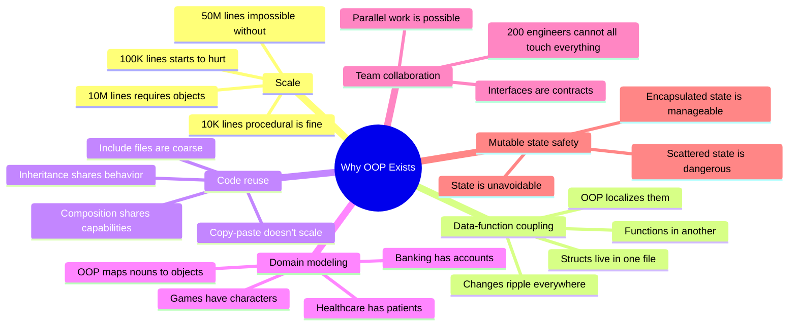
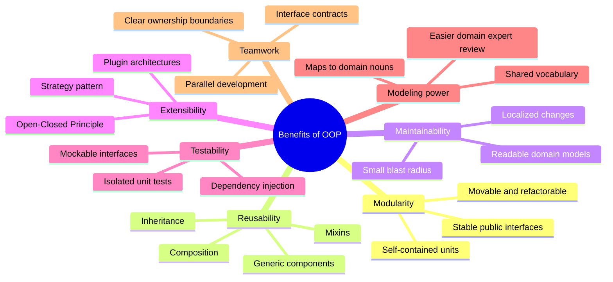
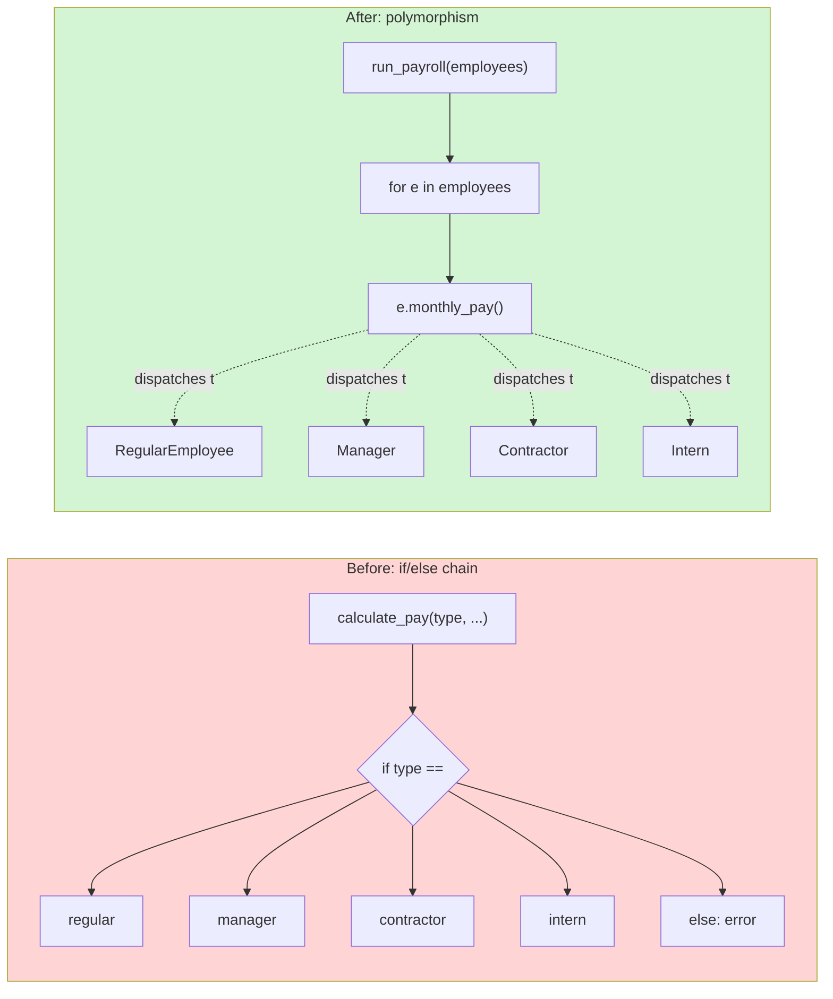
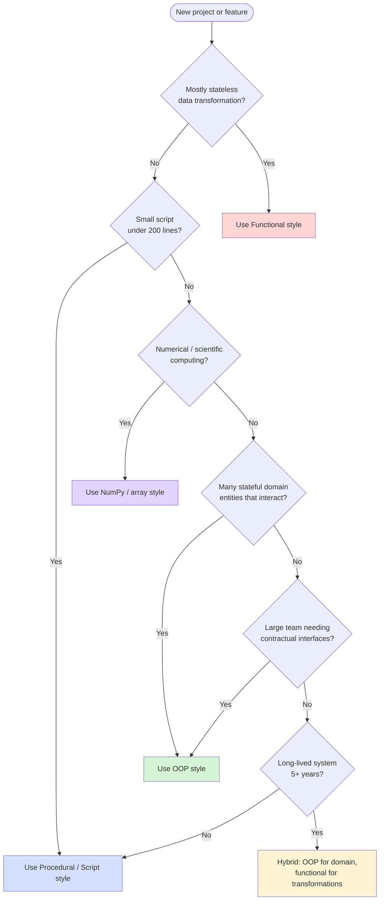
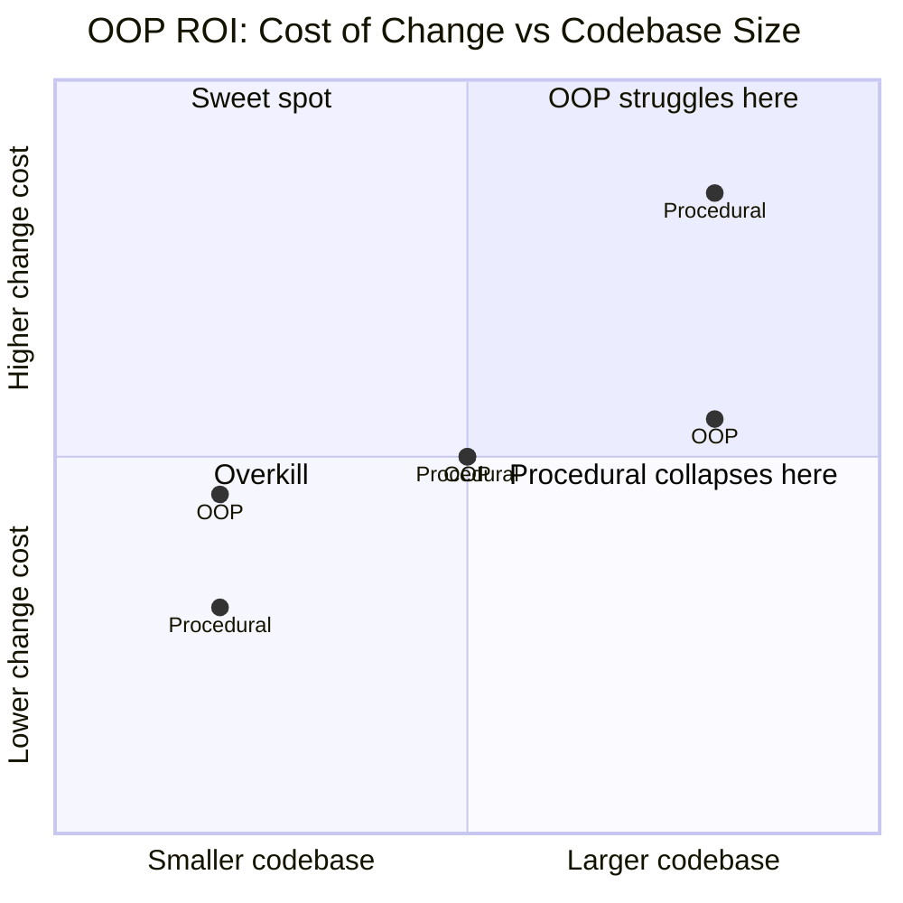
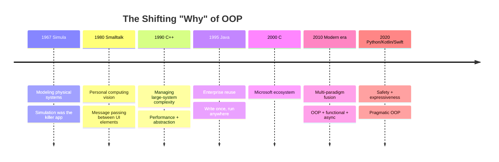

# Why Object-Oriented Programming?

#oop #foundations #motivation #philosophy #teaching

> [!quote] Grady Booch
> "The object-oriented paradigm is a fundamentally different way of thinking about software — not as a sequence of actions, but as a community of collaborating objects."

If [[What-Is-OOP]] answered *what* OOP is, this note answers the more practical question: **why does it exist, and why should you care?** Because — let's be honest — for a beginner, OOP can feel like a lot of ceremony. Why write `class BankAccount` with private attributes and properties when a `dict` and three functions would do?

The answer is that the `dict`-and-functions version works fine *at 50 lines* and becomes a maintenance nightmare *at 50,000 lines*. OOP was invented to solve problems that emerge at scale — problems that procedural code structurally cannot solve well.

---

## 1. The Problems OOP Was Invented to Solve

Let's name the problems explicitly, because OOP is best understood as a *response* to specific pain.

### 1.1 Code Organization at Scale

In 1968, a typical commercial program was perhaps 10,000 lines of assembly or COBOL. By 1988 it was 100,000 lines of C. By 2008 it was 10 million lines of C++ or Java. Today, large systems routinely exceed 50 million lines.

You cannot keep 50 million lines of code organized by *functions*. You need **modules**, **boundaries**, and **interfaces** — and OOP provides all three natively.

### 1.2 Data–Function Coupling

In procedural code, the data structures and the functions that mutate them live in different files. Change a struct field and you have to grep the entire codebase for every function that touches it. OOP puts them in the same place, so changes are *localized*.

### 1.3 Code Reuse Without Copy-Paste

Procedural reuse means copy-paste or include files. Either way, fixes don't propagate. OOP provides **inheritance** and **composition** as principled reuse mechanisms — fix a bug in the base class, every subclass benefits.

### 1.4 Modeling Real-World Systems

Banking, healthcare, e-commerce, gaming — these are domains full of *entities* with *identity* and *lifecycle*. OOP's object concept maps naturally onto domain entities, which makes code easier to discuss with non-programmers.

### 1.5 Team Collaboration via Contracts

A team of 200 engineers cannot coordinate if every function depends on every other function. OOP interfaces provide **contracts** — "I will respond to these messages" — that let teams work in parallel as long as they honor their interfaces.

### 1.6 Managing Mutable State Safely

Most useful software mutates state (databases, UIs, games, IoT). Procedural code scatters that mutation across the codebase; functional code forbids it; OOP *localizes* it inside objects, where it can be reasoned about and tested.



---

## 2. Before OOP — A Visit to the Spaghetti Factory

To appreciate OOP, you have to *feel* the pain of pre-OOP code. Here's a deliberately exaggerated — but realistic — example of procedural code with global state.

```python
# Procedural payroll system — 1980s style

# Global state — every function reads and mutates these
employees: list[dict] = []
payroll_log: list[str] = []
tax_rate: float = 0.25
audit_trail: list[str] = []


def add_employee(emp_id: str, name: str, salary: float) -> None:
    employees.append({"id": emp_id, "name": name, "salary": salary})


def give_raise(emp_id: str, amount: float) -> None:
    for e in employees:
        if e["id"] == emp_id:
            e["salary"] += amount
            audit_trail.append(f"Raise {amount} to {e['name']}")
            return
    raise ValueError("Employee not found")


def calculate_pay(emp_id: str) -> float:
    for e in employees:
        if e["id"] == emp_id:
            gross = e["salary"] / 12
            net = gross * (1 - tax_rate)
            payroll_log.append(f"Paid {net} to {e['name']}")
            return net
    raise ValueError("Employee not found")


def run_payroll() -> None:
    for e in employees:
        pay = calculate_pay(e["id"])
        print(f"{e['name']}: ${pay:.2f}")


# Any part of the program can do this:
add_employee("001", "Alice", 60000)
add_employee("002", "Bob", 75000)
employees[0]["salary"] = -999   # nothing stops this
tax_rate = -0.5                 # or this
run_payroll()                   # garbage out
```

> [!danger] What's Wrong With This Code?
> 1. **Global state**: `employees`, `tax_rate`, `audit_trail` can be touched from anywhere.
> 2. **No invariants**: nothing stops you from setting a salary to -999.
> 3. **No encapsulation**: every function reaches directly into `dict` internals.
> 4. **No reuse**: the `payroll_log` and `audit_trail` are baked in; you can't have two payroll runs with different logs.
> 5. **No contracts**: there's no interface saying "this function expects an employee dict with these fields".
> 6. **No testability**: testing `calculate_pay` requires setting up the entire global state.

Multiply this pattern by 100,000 lines and you have *spaghetti code* — code where every strand is tangled with every other strand, and changing one thing breaks three things elsewhere.

---

## 3. The Benefits of OOP — In Detail

Now let's walk through each benefit of OOP, with code that demonstrates it.

### 3.1 Modularity — Objects Are Self-Contained

An object packages its data and the operations on that data into one unit. The unit can be moved, renamed, refactored, or replaced without affecting the rest of the system, as long as its public interface is preserved.

```python
class PayrollSystem:
    """A self-contained module. The rest of the app depends only on its interface."""
    def __init__(self, tax_rate: float = 0.25) -> None:
        self._tax_rate = tax_rate
        self._employees: dict[str, "Employee"] = {}
        self._audit_trail: list[str] = []

    def add_employee(self, employee: "Employee") -> None:
        self._employees[employee.emp_id] = employee
        self._audit_trail.append(f"Added {employee.name}")

    def calculate_pay(self, emp_id: str) -> float:
        employee = self._employees[emp_id]
        gross = employee.monthly_gross()
        net = gross * (1 - self._tax_rate)
        self._audit_trail.append(f"Paid {net:.2f} to {employee.name}")
        return net

    def run_payroll(self) -> dict[str, float]:
        return {emp_id: self.calculate_pay(emp_id) for emp_id in self._employees}


class Employee:
    def __init__(self, emp_id: str, name: str, annual_salary: float) -> None:
        if annual_salary < 0:
            raise ValueError("Salary cannot be negative")
        self._emp_id = emp_id
        self._name = name
        self._annual_salary = annual_salary

    @property
    def emp_id(self) -> str:
        return self._emp_id

    @property
    def name(self) -> str:
        return self._name

    def monthly_gross(self) -> float:
        return self._annual_salary / 12

    def give_raise(self, amount: float) -> None:
        if amount <= 0:
            raise ValueError("Raise must be positive")
        self._annual_salary += amount
```

Notice:
- `PayrollSystem` has no idea how `Employee` stores its salary internally.
- `Employee` has no idea that `PayrollSystem` exists.
- The only contract between them is the `monthly_gross()` method.
- We can swap either class without touching the other.

### 3.2 Reusability — Inheritance and Composition

#### Inheritance reuse

```python
class Employee:
    # ... as above ...
    def benefits_cost(self) -> float:
        return 200.0  # base benefits

class Manager(Employee):
    def __init__(self, emp_id: str, name: str, salary: float, bonus: float) -> None:
        super().__init__(emp_id, name, salary)
        self._bonus = bonus

    def monthly_gross(self) -> float:
        return super().monthly_gross() + self._bonus / 12

    def benefits_cost(self) -> float:
        return super().benefits_cost() + 500.0  # managers get better benefits
```

We reused all of `Employee`'s logic and added manager-specific behavior. A bug fix in `Employee.monthly_gross` automatically propagates to `Manager`.

#### Composition reuse (preferred — see [[Composition-Over-Inheritance]])

```python
class CompensationPlan:
    """A reusable strategy for computing compensation."""
    def monthly_gross(self, annual: float, bonus: float = 0.0) -> float:
        return annual / 12 + bonus / 12


class Employee:
    def __init__(self, emp_id: str, name: str, annual_salary: float,
                 plan: CompensationPlan, bonus: float = 0.0) -> None:
        self._emp_id = emp_id
        self._name = name
        self._annual_salary = annual_salary
        self._bonus = bonus
        self._plan = plan  # composition

    def monthly_gross(self) -> float:
        return self._plan.monthly_gross(self._annual_salary, self._bonus)
```

Now we can swap compensation plans (e.g., `ContractorPlan`, `ExecutivePlan`) without subclassing `Employee`. Composition is more flexible than inheritance — see [[Composition-Over-Inheritance]] for the full argument.

### 3.3 Maintainability — Changes Are Localized

When a bug is reported in the payroll calculation, in procedural code you have to grep for every place that touches `tax_rate`. In OOP code, the calculation lives in *one method on one class*. You fix it once.

> [!example] The Maintainability Test
> Ask: "If I had to change how payroll is calculated, how many files would I touch?"
>
> - **Procedural**: probably every file that imports `tax_rate` or computes net pay.
> - **OOP with encapsulation**: one method, `PayrollSystem.calculate_pay`.
> - **OOP with strategy pattern**: one class, `NetPayCalculator`.

The smaller the blast radius of a change, the more maintainable the code.

### 3.4 Extensibility — Open for Extension, Closed for Modification

This is the [[Open-Closed Principle]] (the O in SOLID). Good OOP code lets you add new behavior *without modifying existing code*.

```python
from abc import ABC, abstractmethod

class Discount(ABC):
    @abstractmethod
    def apply(self, total: float) -> float:
        ...

class NoDiscount(Discount):
    def apply(self, total: float) -> float:
        return total

class TenPercentOff(Discount):
    def apply(self, total: float) -> float:
        return total * 0.9

class BlackFriday(Discount):
    def apply(self, total: float) -> float:
        return total * 0.7

class ShoppingCart:
    def __init__(self, discount: Discount) -> None:
        self._items: list[float] = []
        self._discount = discount

    def add(self, price: float) -> None:
        self._items.append(price)

    @property
    def total(self) -> float:
        subtotal = sum(self._items)
        return self._discount.apply(subtotal)


# Adding a new discount type does NOT require touching ShoppingCart
# or any of the existing discount classes:
class LoyaltyMember(Discount):
    def apply(self, total: float) -> float:
        return total * 0.85
```

In procedural code, adding a new discount type means editing a giant `if/elif` chain — and risking regressions in every existing branch. In OOP, you add a class and you're done.

### 3.5 Testability — Isolated Units

OOP objects are naturally *mockable* and *stub-able* because they have well-defined interfaces. You can substitute a fake object for a real one in tests.

```python
import pytest
from unittest.mock import MagicMock

class EmailSender:
    def send(self, to: str, subject: str, body: str) -> None:
        # In production: SMTP call
        ...

class UserNotifier:
    def __init__(self, email_sender: EmailSender) -> None:
        self._sender = email_sender

    def notify(self, user_email: str, message: str) -> None:
        self._sender.send(user_email, "Notification", message)


def test_notify_calls_email_sender():
    # Arrange — substitute a fake
    fake_sender = MagicMock(spec=EmailSender)
    notifier = UserNotifier(fake_sender)

    # Act
    notifier.notify("alice@example.com", "Hello")

    # Assert — verify the message was sent correctly
    fake_sender.send.assert_called_once_with(
        "alice@example.com", "Notification", "Hello"
    )
```

The `UserNotifier` depends on the *interface* of `EmailSender`, not its implementation. In tests, we inject a `MagicMock`. This is the [[Dependency-Inversion Principle]] in action, and it's what makes large OOP codebases testable.

### 3.6 Modeling Power — Maps to Real-World Entities

When a domain expert says "a customer places an order, which contains line items, each of which references a product", an OOP designer can translate that *word-for-word* into code:

```python
@dataclass
class Product:
    sku: str
    name: str
    price: float

@dataclass
class LineItem:
    product: Product
    quantity: int

    def line_total(self) -> float:
        return self.product.price * self.quantity

@dataclass
class Order:
    customer: "Customer"
    items: list[LineItem]

    def total(self) -> float:
        return sum(item.line_total() for item in self.items)

@dataclass
class Customer:
    name: str
    email: str

    def place_order(self, items: list[LineItem]) -> Order:
        return Order(customer=self, items=items)
```

The code reads almost like the requirement. This **parity with the domain** is one of the most under-appreciated benefits of OOP — it lets programmers and domain experts communicate in a shared vocabulary.

### 3.7 Team Collaboration — Interface Contracts

When 50 engineers work on a system, no one can know everything. OOP lets teams agree on *interfaces* and then implement them independently.

```python
# Team A defines the interface
class PaymentGateway(ABC):
    @abstractmethod
    def authorize(self, amount: float) -> str:
        """Returns an authorization token."""
        ...

    @abstractmethod
    def capture(self, token: str) -> bool:
        """Captures a previously authorized payment."""
        ...


# Team B implements Stripe — works in isolation
class StripeGateway(PaymentGateway):
    def authorize(self, amount: float) -> str:
        # Stripe-specific API calls
        return "stripe_token_xyz"

    def capture(self, token: str) -> bool:
        return True


# Team C implements PayPal — also works in isolation
class PayPalGateway(PaymentGateway):
    def authorize(self, amount: float) -> str:
        return "paypal_token_abc"

    def capture(self, token: str) -> bool:
        return True
```

Team A publishes the `PaymentGateway` interface. Teams B and C don't need to talk to each other — they just need to honor the contract. This is how a 1000-engineer organization ships software without collapsing into chaos.



---

## 4. Real Problems OOP Solves — Before/After Walkthroughs

Let's now look at *specific recurring problems* in procedural code, and how OOP addresses each.

### 4.1 Problem: Global State Everywhere

**Before** — global variables mutated from anywhere:

```python
# Globals
cart: list[dict] = []
discount: float = 0.0

def add_to_cart(name: str, price: float) -> None:
    cart.append({"name": name, "price": price})

def apply_discount(percent: float) -> None:
    global discount
    discount = percent

def checkout() -> float:
    subtotal = sum(item["price"] for item in cart)
    return subtotal * (1 - discount / 100)

# Problem: only ONE cart can exist. Two customers? Impossible.
```

**After** — encapsulated state:

```python
class ShoppingCart:
    def __init__(self, discount_percent: float = 0.0) -> None:
        self._items: list[dict] = []
        self._discount_percent = discount_percent

    def add(self, name: str, price: float) -> None:
        self._items.append({"name": name, "price": price})

    def checkout(self) -> float:
        subtotal = sum(item["price"] for item in self._items)
        return subtotal * (1 - self._discount_percent / 100)

# Now: many carts can coexist
alice_cart = ShoppingCart(discount_percent=10)
bob_cart = ShoppingCart(discount_percent=0)

alice_cart.add("Book", 20.0)
bob_cart.add("Pen", 2.0)

print(alice_cart.checkout())  # 18.0
print(bob_cart.checkout())    # 2.0
```

> [!success] The Win
> State is no longer global. Each `ShoppingCart` instance carries its own state. You can have ten thousand carts in memory simultaneously without interference.

### 4.2 Problem: Code Duplication

**Before** — copy-paste reuse:

```python
def print_dog_info(name: str, age: int, breed: str) -> None:
    print(f"Dog: {name}, Age: {age}, Breed: {breed}")
    print(f"  Sound: Woof!")

def print_cat_info(name: str, age: int, color: str) -> None:
    print(f"Cat: {name}, Age: {age}, Color: {color}")
    print(f"  Sound: Meow!")

def print_bird_info(name: str, age: int, wingspan: float) -> None:
    print(f"Bird: {name}, Age: {age}, Wingspan: {wingspan}")
    print(f"  Sound: Tweet!")
```

Three near-identical functions. If we want to change the print format, we have to edit all three.

**After** — inheritance + polymorphism:

```python
class Animal:
    def __init__(self, name: str, age: int) -> None:
        self.name = name
        self.age = age

    def sound(self) -> str:
        raise NotImplementedError

    def describe(self) -> str:
        return f"{self.__class__.__name__}: {self.name}, Age: {self.age}"

    def print_info(self) -> None:
        print(self.describe())
        print(f"  Sound: {self.sound()}")


class Dog(Animal):
    def __init__(self, name: str, age: int, breed: str) -> None:
        super().__init__(name, age)
        self.breed = breed

    def sound(self) -> str:
        return "Woof!"

    def describe(self) -> str:
        return f"Dog: {self.name}, Age: {self.age}, Breed: {self.breed}"


class Cat(Animal):
    def __init__(self, name: str, age: int, color: str) -> None:
        super().__init__(name, age)
        self.color = color

    def sound(self) -> str:
        return "Meow!"

    def describe(self) -> str:
        return f"Cat: {self.name}, Age: {self.age}, Color: {self.color}"


# Add a new animal type — zero duplication
class Bird(Animal):
    def __init__(self, name: str, age: int, wingspan: float) -> None:
        super().__init__(name, age)
        self.wingspan = wingspan

    def sound(self) -> str:
        return "Tweet!"

    def describe(self) -> str:
        return f"Bird: {self.name}, Age: {self.age}, Wingspan: {self.wingspan}"
```

> [!success] The Win
> The shared logic lives in `Animal` once. Adding a new animal type requires writing only the *differences* — never the common parts.

### 4.3 Problem: Brittle if-else Chains

**Before** — type-checking switch:

```python
def calculate_pay(employee_type: str, salary: float, bonus: float = 0) -> float:
    if employee_type == "regular":
        return salary / 12
    elif employee_type == "manager":
        return (salary + bonus) / 12
    elif employee_type == "contractor":
        return salary  # already monthly
    elif employee_type == "intern":
        return salary / 12 * 0.5
    else:
        raise ValueError(f"Unknown employee type: {employee_type}")
```

Every new employee type means editing this function. Every existing branch is at risk of a regression.

**After** — polymorphism:

```python
from abc import ABC, abstractmethod

class Employee(ABC):
    def __init__(self, name: str, annual_salary: float) -> None:
        self.name = name
        self.annual_salary = annual_salary

    @abstractmethod
    def monthly_pay(self) -> float:
        ...


class RegularEmployee(Employee):
    def monthly_pay(self) -> float:
        return self.annual_salary / 12


class Manager(Employee):
    def __init__(self, name: str, annual_salary: float, annual_bonus: float) -> None:
        super().__init__(name, annual_salary)
        self.annual_bonus = annual_bonus

    def monthly_pay(self) -> float:
        return (self.annual_salary + self.annual_bonus) / 12


class Contractor(Employee):
    """For contractors, annual_salary is the monthly rate."""
    def monthly_pay(self) -> float:
        return self.annual_salary


class Intern(Employee):
    def monthly_pay(self) -> float:
        return self.annual_salary / 12 * 0.5


# Polymorphic call site — no type checks anywhere
def run_payroll(employees: list[Employee]) -> None:
    for e in employees:
        print(f"{e.name}: ${e.monthly_pay():.2f}")
```

> [!success] The Win
> Adding a new employee type means adding a new class. The `run_payroll` function never changes. This is the Open/Closed Principle in its purest form.



### 4.4 Problem: Complex Systems Hard to Reason About

**Before** — a sprawling function that does everything:

```python
def process_order(order_data: dict, customer_data: dict,
                  inventory: dict, payment_data: dict,
                  shipping_data: dict) -> dict:
    # Validate order
    if not order_data.get("items"):
        raise ValueError("Empty order")
    # Check inventory
    for item in order_data["items"]:
        if inventory.get(item["sku"], 0) < item["qty"]:
            raise ValueError(f"Out of stock: {item['sku']}")
    # Process payment
    if payment_data["method"] == "credit":
        # 50 lines of credit card processing
        pass
    elif payment_data["method"] == "paypal":
        # 50 lines of PayPal processing
        pass
    # Calculate shipping
    if shipping_data["country"] == "US":
        shipping_cost = 5.99
    else:
        shipping_cost = 24.99
    # Update inventory
    for item in order_data["items"]:
        inventory[item["sku"]] -= item["qty"]
    # Send confirmation
    # ... 30 more lines ...
    return {"status": "success", "total": 0}
```

A 200-line function nobody wants to touch.

**After** — decomposed into collaborating objects:

```python
class Order:
    def __init__(self, items: list[dict]) -> None:
        if not items:
            raise ValueError("Empty order")
        self._items = items

    def total_quantity(self) -> int:
        return sum(item["qty"] for item in self._items)


class Inventory:
    def __init__(self, stock: dict[str, int]) -> None:
        self._stock = stock

    def has(self, sku: str, qty: int) -> bool:
        return self._stock.get(sku, 0) >= qty

    def deduct(self, sku: str, qty: int) -> None:
        self._stock[sku] -= qty


class PaymentProcessor(ABC):
    @abstractmethod
    def charge(self, amount: float, data: dict) -> bool:
        ...


class CreditCardProcessor(PaymentProcessor):
    def charge(self, amount: float, data: dict) -> bool:
        # ... real implementation
        return True


class PayPalProcessor(PaymentProcessor):
    def charge(self, amount: float, data: dict) -> bool:
        return True


class ShippingCalculator:
    def cost_for(self, country: str) -> float:
        return 5.99 if country == "US" else 24.99


class OrderProcessor:
    """Orchestrator. Each collaborator does one thing."""
    def __init__(self, inventory: Inventory, payment: PaymentProcessor,
                 shipping: ShippingCalculator) -> None:
        self._inventory = inventory
        self._payment = payment
        self._shipping = shipping

    def process(self, order: Order, customer: dict,
                payment_data: dict, shipping_data: dict) -> dict:
        # 1. Validate inventory
        for item in order._items:
            if not self._inventory.has(item["sku"], item["qty"]):
                raise ValueError(f"Out of stock: {item['sku']}")

        # 2. Charge payment
        total = sum(item["price"] * item["qty"] for item in order._items)
        total += self._shipping.cost_for(shipping_data["country"])
        if not self._payment.charge(total, payment_data):
            raise RuntimeError("Payment failed")

        # 3. Deduct inventory
        for item in order._items:
            self._inventory.deduct(item["sku"], item["qty"])

        return {"status": "success", "total": total}
```

> [!success] The Win
> Each piece (`Order`, `Inventory`, `PaymentProcessor`, `ShippingCalculator`) is independently testable. Each can be swapped without touching the others. The orchestrator is now 15 lines instead of 200.

---

## 5. When OOP Shines vs When It Struggles

OOP is not a silver bullet. Let's be honest about where it works and where it doesn't.

### 5.1 OOP Shines When…

- **The domain has many stateful entities that interact** (banking, ERP, CMS, games).
- **Long-lived systems** that will be maintained for years and extended by many engineers.
- **UIs and event-driven systems** (buttons, widgets, controllers are naturally objects).
- **Simulation and modeling** (physics simulations, agent-based models).
- **Large teams** that need contractual interfaces to parallelize work.
- **Persistent domain models** (ORM-backed business objects).

### 5.2 OOP Struggles When…

- **Pure data transformation pipelines** (ETL, signal processing) — functional shines here.
- **Highly concurrent, stateless systems** (web request handlers) — functions + immutability are simpler.
- **Tiny scripts** (< 200 lines) — the ceremony of classes isn't worth it.
- **Numerical computing kernels** — NumPy's array operations outperform OOP wrappers by orders of magnitude.
- **When the domain is fundamentally *verbs*, not *nouns*** (compilers, parser combinators).

> [!warning] Common Student Misconception
> "OOP is always the best choice." No. A 50-line shell script does not need a class hierarchy. A data pipeline that transforms CSV → JSON → DB rows does not benefit from objects. A 3-line web request handler that returns `"Hello"` does not need a `GreeterController` class. Use the right tool.

### 5.3 A Decision Framework



---

## 6. The Business Case — OOP's ROI

Engineering decisions are ultimately business decisions. Here's the economic case for OOP.

### 6.1 Maintenance Dominates Software Cost

Industry studies (Boehm, 1981; McConnell, 2004) consistently find that **60-80% of total software cost is in maintenance**, not initial development. Anything that reduces maintenance cost pays dividends for years.

OOP reduces maintenance cost by:
- **Localizing changes** (one class, one method)
- **Enabling safe refactoring** (interfaces protect callers)
- **Supporting regression testing** (mockable dependencies)
- **Documenting intent** (class names are domain nouns)

### 6.2 The Cost of Change Curve

In procedural code, the cost of making a change *grows* with the size of the codebase, because every change risks touching unrelated code. In well-designed OOP code, the cost of change is roughly *constant* — you add a class or modify a method, and the blast radius is bounded by the interface contract.



### 6.3 Onboarding Cost

New engineers can be productive in an OOP codebase faster because:
- Domain nouns map to class names (shared vocabulary with stakeholders)
- Class boundaries define "modules of understanding"
- Interfaces describe contracts without exposing implementation

A new engineer joining a 1-million-line OOP codebase can usually find the right class to modify within an hour. In a 1-million-line procedural codebase, the same task can take days.

### 6.4 Defect Density

Several studies (e.g., Capers Jones, *Software Engineering Best Practices*) report that well-structured OOP code has 20-40% lower defect density than equivalent procedural code. The reasons:
- Encapsulation prevents accidental misuse
- Type systems catch more errors at compile time
- Smaller units = smaller surface area for bugs
- Testability = higher test coverage

---

## 7. Cognitive Benefits — How OOP Matches Human Thinking

OOP wasn't designed by accident. It was designed to match how humans *naturally* think about the world.

### 7.1 Humans Think in Objects

When you describe a scene — "there's a dog chasing a cat" — you naturally parse it into **entities** (dog, cat) with **properties** (fast, scared) and **actions** (chasing, running). You don't think "there is a chase function operating on a dog-struct and a cat-struct".

OOP code mirrors this natural decomposition. Reading `dog.chase(cat)` is closer to natural language than `chase(dog, cat)`.

### 7.2 Bounded Rationality

Herbert Simon's theory of **bounded rationality** says humans can only hold a few things in their head at once. Good OOP design respects this: each object is a *bounded context* — you only need to understand what it does, not how.

### 7.3 The Law of Demeter

> [!info] Law of Demeter
> "Only talk to your immediate friends, don't talk to strangers."

A method `a.foo()` should call methods on `a`, on `a`'s fields, on objects `a` creates, and on objects passed as arguments to `a.foo()`. It should *not* call `a.b.c.d()` — that's reaching through strangers.

This rule exists because human working memory can't track long chains of access. By keeping calls local, OOP keeps cognitive load manageable.

```python
# Bad — train wreck
customer.get_account().get_transactions()[0].get_amount()

# Good — encapsulated
customer.first_transaction_amount()
```

### 7.4 Pattern Languages

OOP has accumulated a vocabulary of **design patterns** (see [[Design-Patterns-Overview]]) — Singleton, Factory, Observer, Strategy, Adapter. These patterns are *cognitive shortcuts*: when one engineer says "this should be a Strategy", another engineer instantly understands the structure. This shared language compresses design discussions dramatically.

---

## 8. Misconceptions — When OOP Is the Wrong Answer

> [!danger] Common Misconceptions
> 1. **"OOP is a silver bullet."** Fred Brooks warned us in 1986: there is no silver bullet. OOP helps with *accidental complexity* (code organization), not *essential complexity* (the problem itself).
> 2. **"More objects = better."** A system with 10,000 tiny classes can be harder to navigate than one with 100 well-chosen classes. Quality of abstraction matters more than quantity.
> 3. **"Inheritance is the point."** Many modern OOP designs use composition almost exclusively. See [[Composition-Over-Inheritance]].
> 4. **"OOP means Java-style enterprise architecture."** Python, Ruby, JavaScript, and Smalltalk have very different OOP cultures. Don't conflate one tradition with the whole paradigm.
> 5. **"OOP and functional are enemies."** Modern Python uses both — classes with pure methods, immutable dataclasses, functional pipelines inside object methods. The best engineers are multi-paradigm.

---

## 9. OOP and Functional — A Productive Tension

Many of the most interesting advances in modern OOP come from *borrowing* ideas from functional programming:

- **Immutability**: `dataclass(frozen=True)` produces immutable objects, eliminating whole classes of bugs.
- **Pure methods**: methods that don't mutate state are easier to test and parallelize.
- **Higher-order methods**: `map`, `filter`, `reduce` work naturally on object collections.
- **Pattern matching**: Python 3.10's `match` statement brings functional-style dispatch into OOP.

```python
from dataclasses import dataclass
from functools import reduce

@dataclass(frozen=True)
class Money:
    amount: float
    currency: str

    def plus(self, other: "Money") -> "Money":
        if self.currency != other.currency:
            raise ValueError("Currency mismatch")
        return Money(self.amount + other.amount, self.currency)


# OOP object, functional style
prices = [Money(10, "USD"), Money(20, "USD"), Money(5, "USD")]
total = reduce(lambda a, b: a.plus(b), prices)
print(total)  # Money(amount=35.0, currency='USD')
```

The lesson: don't be a paradigm loyalist. Use OOP where it helps, use functional where it helps, and combine them where they shine together.

---

## 10. The Evolution of Motivation

Why OOP was invented has shifted over time. The motivation in 1967 (Simula) was *simulation*. In 1980 (Smalltalk) it was *personal computing*. In 1990 (C++) it was *managing complexity in large systems*. In 2000 (Java) it was *enterprise reuse*. In 2020 (modern Python, Kotlin, Swift) it is *productivity with safety*.



---

## 11. Student FAQs

> [!question] "If OOP is so great, why does Python let me write code without classes?"
> Because Python is *multi-paradigm*. For a 20-line script, a class is overkill. For a 20,000-line system, classes are essential. Python trusts you to choose. (See [[OOP-Paradigms]].)

> [!question] "Isn't OOP slower than procedural code?"
> In *most* languages, the overhead of method dispatch (virtual function tables, dynamic dispatch) is negligible compared to I/O, network, and algorithmic costs. In performance-critical inner loops, you might bypass OOP — but that's the last 1% of code, not the first 99%.

> [!question] "Why does Java force everything into a class?"
> Java's designers made a deliberate choice in 1995: forcing all code into classes enforces a uniform module system. It was a *language design* choice, not a requirement of OOP. Python, Ruby, and Kotlin do not force this and are still object-oriented.

> [!question] "What about functional programming? Isn't it replacing OOP?"
> Functional programming is *complementary* to OOP, not a replacement. Modern languages (Scala, F#, Kotlin, Swift, Python) blend both. Pure functional languages (Haskell, Elm) remain niche for most industry work, while pure OOP languages (Smalltalk, Ruby) coexist with multi-paradigm ones.

> [!question] "Do I need OOP for machine learning?"
> For *model code*, no — NumPy/PyTorch tensors and functional transformations dominate. For *ML infrastructure* (training pipelines, model registries, experiment tracking), yes — OOP helps manage stateful, long-lived systems.

---

## 12. Teaching Tips for "Why OOP?"

> [!tip] Classroom Activity — The Refactoring Lab
> Hand students a 200-line procedural script (a simple inventory system with global state). Ask them to refactor it into OOP. The exercise teaches more about *why* OOP exists than any lecture can. Students will *feel* the pain of globals and *feel* the relief of encapsulation.

> [!tip] Classroom Activity — The Maintenance Simulation
> Have students build a 5-class system. Then introduce a "new requirement" (add discounts, add shipping, add tax by region). Count how many files they have to touch. Compare to a procedural version. The numbers tell the story.

> [!tip] Classroom Activity — Domain Modeling Interviews
> Pair students up. One is the "domain expert" (describes a system: library, restaurant, hospital). The other is the "engineer" (extracts nouns as classes, verbs as methods). Swap roles. This trains the *modeling* skill that is the real point of OOP.

> [!warning] Don't Teach OOP as Syntax
> If your first OOP lesson is "here's how to write `class Foo`", you've already lost. Start with the *problems* — show spaghetti code, show global state bugs, show copy-paste duplication. Then OOP arrives as the *solution* students were wishing for.

---

## 13. Summary — Why OOP, In One Page

- **OOP exists to solve scaling problems** that procedural code structurally cannot solve: code organization at scale, data-function coupling, reuse, and team coordination.
- **The core benefits** are modularity, reusability, maintainability, extensibility, testability, modeling power, and team collaboration.
- **Specific recurring problems** that OOP solves: global state (via encapsulation), code duplication (via inheritance and composition), brittle if-else chains (via polymorphism), and complexity (via abstraction).
- **OOP is not always the right answer** — for pure data pipelines, tiny scripts, or numerical computing, other paradigms win.
- **The business case** rests on maintenance cost: 60-80% of software cost is maintenance, and OOP reduces maintenance cost by localizing changes.
- **Cognitively**, OOP matches how humans think about the world — in entities, properties, and actions — which makes code easier to write, read, and discuss with non-programmers.
- **Modern OOP** is increasingly multi-paradigm, borrowing immutability and pure functions from functional programming.
- **Misconceptions to avoid**: OOP is not a silver bullet, more objects is not always better, and inheritance is not the point.

> [!quote] Closing Thought
> "Object-oriented programming is an approach to organization, not a feature set. It's a way of arranging your code so that the natural boundaries of the problem become the natural boundaries of the solution." — Adapted from Rebecca Wirfs-Brock

---

## 14. What's Next?

- [[What-Is-OOP]] — the foundational definition of OOP
- [[History-Of-OOP]] — the people and languages that built OOP
- [[OOP-Paradigms]] — how OOP compares to other paradigms
- [[Encapsulation]] — the first pillar, in depth
- [[SOLID-Principles]] — five design principles that make OOP code maintainable
- [[Composition-Over-Inheritance]] — why modern OOP prefers composition
- [[Design-Patterns-Overview]] — the shared vocabulary of OOP solutions
