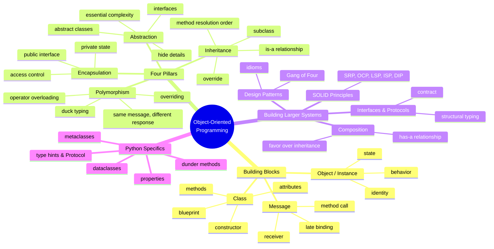
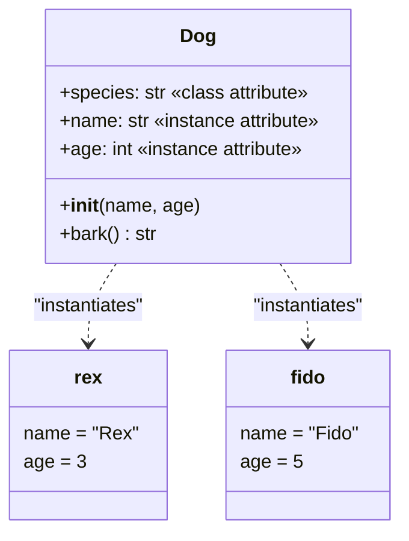
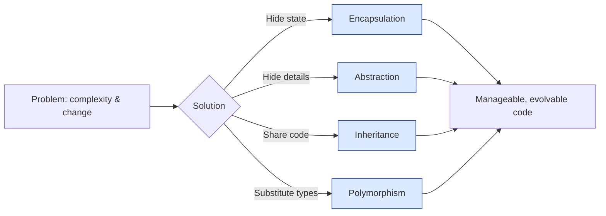

# Core Concepts Overview — The Four Pillars & Essential Vocabulary

> [!note] What this file is for
> This is your **map of OOP territory**. It introduces the four pillars *intuitively* (deep dives are other agents' jobs), defines the essential vocabulary, and shows how the pieces fit together. Bookmark this — every other file in the knowledge base links back to it.

If you've read [[what-is-oop]] and [[history-of-oop]], you already know what an object *is* and where the idea came from. Now we open up the toolbox: the four pillars, the basic class mechanics, and a glossary you'll lean on for the rest of your OOP career.

---

## 1. The Big Picture: A Mind Map of OOP



Each leaf in this map is a concept you'll meet repeatedly. The rest of this file expands the most central nodes.

---

## 2. The Building Blocks: Class, Object, Method, Attribute, Constructor

Before the pillars, the bricks.

### 2.1 Class

A **class** is a *blueprint* — a description of what data its instances will hold and what behaviors they will support.

```python
class Dog:
    species = "Canis familiaris"   # class attribute — shared by all dogs

    def __init__(self, name: str, age: int) -> None:
        self.name = name           # instance attribute
        self.age = age

    def bark(self) -> str:
        return f"{self.name} says Woof!"
```

The class itself is an object in Python (`type(Dog) is type`), but for now think of it as a template. See [[python-oop-mechanics]] for the metaclass rabbit hole.

### 2.2 Object / Instance

An **object** is a concrete value created from a class. Each object has its own copy of instance attributes.

```python
rex = Dog("Rex", 3)         # rex is an instance of Dog
fido = Dog("Fido", 5)       # fido is another, separate instance
print(rex.name, fido.name)  # Rex Fido
```

### 2.3 Attribute

An **attribute** is a named piece of data attached to an object (or class). Two flavors:

- **Instance attribute** — unique per object (`self.name`, `self.age`).
- **Class attribute** — shared by all instances (`Dog.species`).

```python
print(rex.species)   # Canis familiaris  (from the class)
print(Dog.species)   # Canis familiaris  (also accessible on the class)
```

### 2.4 Method

A **method** is a function defined inside a class. The first parameter (`self` by convention) is the instance receiving the call.

```python
rex.bark()         # equivalent to Dog.bark(rex)
```

> [!tip] `self` is just a parameter
> `self` is not a keyword — it's a parameter name. Python passes the instance automatically when you call `rex.bark()`. You could rename it `this` or `me`, but **don't** — `self` is universal in the Python community.

### 2.5 Constructor (`__init__`)

The **constructor** is the method that runs when you create a new instance. In Python it's `__init__` (technically the *initialiser*; `__new__` is the true constructor).

```python
class Account:
    def __init__(self, owner: str, balance: float = 0.0) -> None:
        self.owner = owner
        self.balance = balance
```

`__init__` doesn't return anything; its job is to *set up* the just-created object.

### 2.6 How it all fits



---

## 3. The Four Pillars: An Intuitive Introduction

The four pillars are traditionally listed as **Encapsulation, Abstraction, Inheritance, Polymorphism**. They are not equal in importance — but together they describe what makes OOP *OOP*.

> [!warning] Don't memorise the list — understand the problems
> The pillars are answers to specific design problems. Memorising them without the problems they solve is useless. Below, each pillar is introduced with the *problem* it addresses.

### 3.1 Encapsulation — "Keep your hands off my state"

**The problem.** In procedural code, any function can mutate any data. As a codebase grows, you can't reason about who changes what. Bugs multiply.

**The answer.** Bundle the data and the operations on it inside a class. Hide the data behind methods. Callers talk to the *methods*, not the *fields*.

```python
class BankAccount:
    def __init__(self, owner: str, opening: float = 0.0) -> None:
        self.owner = owner
        self._balance = opening           # convention: "private"

    def deposit(self, amount: float) -> None:
        if amount <= 0:
            raise ValueError("Deposit must be positive")
        self._balance += amount

    def withdraw(self, amount: float) -> None:
        if amount > self._balance:
            raise ValueError("Insufficient funds")
        self._balance -= amount

    @property
    def balance(self) -> float:
        return self._balance              # read-only from outside
```

The `_balance` is "private by convention" — Python doesn't enforce it, but linters and culture do. The `balance` property lets callers *read* but not *write*. The class controls every change.

> [!note] Deep dive
> See [[encapsulation]] for access modifiers (`_`/`__`), `@property`, name mangling, and when to break encapsulation.

### 3.2 Abstraction — "Show me what, hide me how"

**The problem.** When you call `account.deposit(50)`, you don't want to know whether the balance is stored as cents, floats, or a database row. Knowing those details *couples* you to them.

**The answer.** Expose only the *essential* operations. Hide the *implementation*. In Python, abstraction is expressed via abstract base classes, `Protocol`, and plain duck typing.

```python
from abc import ABC, abstractmethod

class PaymentMethod(ABC):
    @abstractmethod
    def pay(self, amount: float) -> None: ...

class CreditCard(PaymentMethod):
    def pay(self, amount: float) -> None:
        print(f"Charging card for ${amount:.2f}")

class PayPal(PaymentMethod):
    def pay(self, amount: float) -> None:
        print(f"Charging PayPal for ${amount:.2f}")
```

A caller needs to know only that something is a `PaymentMethod` — not which kind. The `pay` operation is the *abstraction*; the card vs PayPal machinery is the *implementation*.

> [!note] Deep dive
> See [[abstraction]] for ABCs, `Protocol`, structural typing, and the Liskov Substitution Principle.

### 3.3 Inheritance — "A `SavingsAccount` is a `BankAccount`"

**The problem.** Two classes share most of their data and behavior. Duplicating the shared parts is error-prone; a bug fixed in one copy might not be fixed in the other.

**The answer.** Let one class **inherit** from another. The subclass gets the parent's attributes and methods automatically; it can add or override as needed.

```python
class SavingsAccount(BankAccount):
    def __init__(self, owner: str, opening: float = 0.0, rate: float = 0.02) -> None:
        super().__init__(owner, opening)
        self.rate = rate

    def apply_interest(self) -> None:
        self._balance *= (1 + self.rate)

# SavingsAccount inherits deposit, withdraw, balance
s = SavingsAccount("Alice", 100.0)
s.deposit(50.0)           # inherited
s.apply_interest()        # specific to SavingsAccount
print(s.balance)          # 153.0
```

> [!warning] Inheritance is seductive but fragile
> Deep inheritance trees are a common source of bugs. Modern design advice is to **favor composition over inheritance**. See [[composition-over-inheritance]] and [[inheritance]].

### 3.4 Polymorphism — "Same message, different response"

**The problem.** You want to write code that works with many different types without knowing which one specifically. A `process_payment(method)` function shouldn't care whether `method` is a card or PayPal.

**The answer.** Different classes can implement the *same method name* in *different ways*. The caller doesn't care which; the right behavior kicks in at runtime.

```python
def checkout(method: PaymentMethod, amount: float) -> None:
    method.pay(amount)         # polymorphic call

checkout(CreditCard(), 100.0)   # "Charging card for $100.00"
checkout(PayPal(), 100.0)       # "Charging PayPal for $100.00"
```

In Python, polymorphism is mostly **duck typing**: "if it walks like a duck and quacks like a duck, it's a duck." No interface declaration required — just define the method.

> [!note] Deep dive
> See [[polymorphism]] for duck typing, overriding, operator overloading (`__add__`, `__eq__`), and parametric polymorphism via generics.

### 3.5 Putting the four pillars together



---

## 4. One Tiny Snippet per Pillar

To cement each pillar, here's a minimal Python example you can run.

### Encapsulation

```python
class Counter:
    def __init__(self) -> None:
        self._count = 0          # private-by-convention
    def increment(self) -> None:
        self._count += 1
    @property
    def count(self) -> int:
        return self._count       # readable, not writable

c = Counter()
c.increment(); c.increment()
print(c.count)   # 2
# c.count = 5    # AttributeError — can't write
# c._count = 5   # works but breaks the social contract
```

### Abstraction

```python
from abc import ABC, abstractmethod

class Shape(ABC):
    @abstractmethod
    def area(self) -> float: ...

class Square(Shape):
    def __init__(self, side: float) -> None:
        self.side = side
    def area(self) -> float:
        return self.side ** 2

# s = Shape()      # TypeError — can't instantiate abstract
s = Square(3)
print(s.area())    # 9.0
```

### Inheritance

```python
class Animal:
    def __init__(self, name: str) -> None:
        self.name = name
    def speak(self) -> str:
        return f"{self.name} makes a sound"

class Cat(Animal):
    def speak(self) -> str:
        return f"{self.name} says Meow"

c = Cat("Mittens")
print(c.speak())   # Mittens says Meow
```

### Polymorphism

```python
class Dog:
    def speak(self) -> str: return "Woof"
class Duck:
    def speak(self) -> str: return "Quack"
class Robot:
    def speak(self) -> str: return "BEEP"

for thing in [Dog(), Duck(), Robot()]:
    print(thing.speak())   # no shared base class needed — duck typing
```

---

## 5. Beyond the Pillars: Composition, Interfaces, SOLID

The four pillars are *foundational* but not *exhaustive*. Real OOP design also leans on:

### 5.1 Composition — "has-a" beats "is-a"

Instead of inheriting, **build objects out of other objects**. A `Car` *has an* `Engine` rather than *being an* `Engine`.

```python
class Engine:
    def start(self) -> None: print("vroom")

class Car:
    def __init__(self) -> None:
        self._engine = Engine()        # composition
    def start(self) -> None:
        self._engine.start()
        print("car is moving")
```

See [[composition-over-inheritance]].

### 5.2 Interfaces & Protocols

A **contract** that says "any class with these methods counts as one of us." Python's `Protocol` (PEP 544) enables *structural typing* — you don't even need to inherit.

```python
from typing import Protocol

class Speaks(Protocol):
    def speak(self) -> str: ...

def make_noise(thing: Speaks) -> None:
    print(thing.speak())

class Cow:
    def speak(self) -> str: return "Moo"

make_noise(Cow())   # works — Cow has the right shape
```

### 5.3 SOLID principles

Five design principles that keep OOP codebases healthy:

- **S**ingle Responsibility — each class does one thing.
- **O**pen/Closed — open for extension, closed for modification.
- **L**iskov Substitution — subclasses must be substitutable for their parents.
- **I**nterface Segregation — many small interfaces beat one big one.
- **D**ependency Inversion — depend on abstractions, not concretions.

See [[solid-principles]] for the deep dive.

### 5.4 Design patterns

The Gang of Four's 23 patterns (Singleton, Observer, Strategy, Factory, Decorator, …) are recurring solutions to OOP design problems. See [[design-patterns]].

---

## 6. Glossary of Essential OOP Terms

> [!tip] How to use this glossary
> Skim once now. Return whenever a term feels fuzzy. Each entry is one line; the linked files have the full story.

| # | Term | One-line definition |
|---:|---|---|
| 1 | **Abstraction** | Exposing only essential operations; hiding implementation details. |
| 2 | **Abstract class** | A class that can't be instantiated directly; may contain abstract methods to be implemented by subclasses. |
| 3 | **Abstract method** | A method declared but not implemented in a base class; subclasses must implement it. |
| 4 | **Access modifier** | Keywords/conventions (`public`, `private`, `protected`, `_`, `__`) controlling visibility of attributes. |
| 5 | **Aggregation** | A "has-a" relationship where the part can exist independently of the whole. |
| 6 | **Attribute** | A named piece of data stored on an object or class. |
| 7 | **Class** | A blueprint describing the attributes and methods of a category of objects. |
| 8 | **Class attribute** | An attribute shared by all instances of a class, defined on the class itself. |
| 9 | **Class method** | A method that receives the class as its first argument (`@classmethod`, `cls`). |
| 10 | **Composition** | Building an object from other objects ("has-a") rather than inheriting ("is-a"). |
| 11 | **Constructor** | The method (`__init__`) that initialises a newly created instance. |
| 12 | **Coupling** | The degree to which classes depend on each other; lower is better. |
| 13 | **Cohesion** | The degree to which a class's elements belong together; higher is better. |
| 14 | **Delegation** | One object forwards a call to another, rather than handling it itself. |
| 15 | **Duck typing** | Python's style: "if it has the right methods, it's the right type." |
| 16 | **Encapsulation** | Bundling data and behavior together and hiding internal state behind an interface. |
| 17 | **Friend class / method** | (C++) A class granted access to another's private members. No exact Python equivalent. |
| 18 | **Getter / Setter** | Methods (or `@property`) that read or write a private attribute. |
| 19 | **Identity** | Whether two references point to the *same* object (`is` in Python). |
| 20 | **Inheritance** | A class automatically receiving attributes and methods from a parent class. |
| 21 | **Instance** | A specific object created from a class; synonym for *object*. |
| 22 | **Instance attribute** | An attribute whose value is unique per instance, set in `__init__`. |
| 23 | **Instance method** | A method that operates on an instance, taking `self` as its first parameter. |
| 24 | **Instantiation** | The act of creating an instance from a class (`Dog("Rex")`). |
| 25 | **Interface** | A contract specifying which methods a class must provide. |
| 26 | **Late binding** | Deciding at runtime which method to call, based on the receiver's actual type. |
| 27 | **Message** | A request sent to an object to perform one of its methods (Alan Kay's term). |
| 28 | **Message passing** | The model of computation where objects interact by sending messages, not by sharing memory. |
| 29 | **Method** | A function defined inside a class; operates on instances (or the class itself). |
| 30 | **Method Resolution Order (MRO)** | The order in which Python searches base classes for a method; visible via `ClassName.__mro__`. |
| 31 | **Mixin** | A class designed to be combined with others via multiple inheritance to add behavior. |
| 32 | **Multiple inheritance** | A class inheriting from more than one parent. |
| 33 | **Object** | A value with identity, state, and behavior; an instance of a class. |
| 34 | **Override** | A subclass redefining a method inherited from a parent. |
| 35 | **Polymorphism** | The ability of different objects to respond to the same message in different ways. |
| 36 | **Property** | Python's `@property` decorator — a method that behaves like an attribute. |
| 37 | **Protocol** | Python's structural interface (PEP 544); a class is a member by *shape*, not by declaration. |
| 38 | **Self** | The conventional name for the instance parameter in Python instance methods. |
| 39 | **Static method** | A method that doesn't take `self` or `cls`; lives on the class for organisational reasons (`@staticmethod`). |
| 40 | **State** | The current values of an object's attributes. |
| 41 | **Subclass** | A class that inherits from another (its *superclass*). |
| 42 | **Super()** | Python built-in to call a parent class's method from a subclass. |
| 43 | **Type hint** | An annotation (`name: str`) telling readers and tools the expected type. |
| 44 | **Virtual method** | A method whose concrete implementation is chosen at runtime (default in Python; explicit in C++). |

> [!note] Glossary growth
> Bookmark this section. As you read deeper into the knowledge base, every bold term will eventually have its own file: [[encapsulation]], [[abstraction]], [[inheritance]], [[polymorphism]], [[composition-over-inheritance]], [[solid-principles]], [[design-patterns]], and more.

---

## 7. Common Misconceptions (Foundations Edition)

> [!warning] "Abstraction = abstract classes"
> Abstract *classes* are a language feature. *Abstraction* is a design principle — picking the right essential operations to expose, regardless of whether you use ABCs, interfaces, or just well-named methods.

> [!warning] "Inheritance is for code reuse"
> Inheritance *provides* code reuse, but its *purpose* is **subtyping**: expressing "B is substitutable for A." If you inherit just to reuse a method, you've probably misused it. Composition is usually the better tool for pure reuse.

> [!warning] "Encapsulation = private fields"
> Encapsulation is about **protecting invariants**, not about hiding fields. A class with all-private fields but no validation in its setters isn't really encapsulated. The class's *interface* — the methods it exposes and the rules they enforce — is what matters.

> [!warning] "Polymorphism requires inheritance"
> In Python, polymorphism is **duck typing** — no inheritance required. Two unrelated classes with a `speak()` method are polymorphic for `speak`. Inheritance-based polymorphism (subtyping) is one mechanism, but not the only one.

---

## 8. A First Real Example: Tying It Together

Here's a small program that uses all four pillars plus composition:

```python
from abc import ABC, abstractmethod
from dataclasses import dataclass, field

# --- Abstraction: an interface for any shape ---
class Shape(ABC):
    @abstractmethod
    def area(self) -> float: ...

# --- Inheritance + Encapsulation: Square and Circle extend Shape ---
class Square(Shape):
    def __init__(self, side: float) -> None:
        if side <= 0:
            raise ValueError("Side must be positive")
        self._side = side            # encapsulated
    @property
    def side(self) -> float:
        return self._side
    def area(self) -> float:
        return self._side ** 2

class Circle(Shape):
    def __init__(self, radius: float) -> None:
        if radius <= 0:
            raise ValueError("Radius must be positive")
        self._radius = radius
    def area(self) -> float:
        return 3.14159 * self._radius ** 2

# --- Composition: a Canvas holds shapes ---
@dataclass
class Canvas:
    shapes: list[Shape] = field(default_factory=list)
    def add(self, shape: Shape) -> None:
        self.shapes.append(shape)
    def total_area(self) -> float:
        return sum(shape.area() for shape in self.shapes)

# --- Polymorphism: total_area works for any Shape ---
canvas = Canvas()
canvas.add(Square(3))
canvas.add(Circle(2))
print(canvas.total_area())   # 9 + 12.566 ≈ 21.566
```

**Reading the design:**
- **Abstraction**: `Shape` defines the essential operation `area`.
- **Encapsulation**: `Square` validates `side` and hides `_side` behind a read-only property.
- **Inheritance**: `Square` and `Circle` inherit from `Shape`.
- **Polymorphism**: `Canvas.total_area` works for any `Shape` — it doesn't know which.
- **Composition**: `Canvas` *has a* list of `Shape`s rather than *being a* shape.

---

## 9. Key Takeaways

- The **building blocks** of OOP are class, object/instance, attribute, method, and constructor. Get these rock-solid before going deeper.
- The **four pillars** are: Encapsulation (hide state), Abstraction (hide details), Inheritance (share and specialise), Polymorphism (substitute types).
- Each pillar solves a *specific problem* — complexity, change, reuse, substitution. Knowing the problem is more important than the name.
- Modern OOP adds **composition, interfaces/protocols, SOLID, and design patterns** as essential second-tier ideas.
- The **glossary** (44 terms here) is the shared vocabulary every OOP practitioner must speak.
- Python's OOP is **dynamic and multi-paradigm**: duck typing for polymorphism, `@property` for encapsulation, `Protocol` for abstraction, and `dataclass` for clean data carriers.

---

## 10. Practice Exercises

### Exercise 1 — Vocabulary self-test
Cover the right column of the glossary and try to define each term in your own words. Mark any you stumble on and re-read its deep-dive file.

### Exercise 2 — Pillar identification
For each of the following code snippets, identify which pillar (encapsulation, abstraction, inheritance, polymorphism) is *most* on display, and justify your choice in one sentence:

```python
# (a)
class LoggedList(list):
    def append(self, item):
        print(f"Appending {item}")
        super().append(item)

# (b)
class Temperature:
    def __init__(self, celsius: float) -> None:
        self._celsius = celsius
    @property
    def fahrenheit(self) -> float:
        return self._celsius * 9/5 + 32

# (c)
def make_sound(animal) -> None:
    print(animal.speak())

# (d)
from abc import ABC, abstractmethod
class Repository(ABC):
    @abstractmethod
    def get(self, id: int): ...
    @abstractmethod
    def save(self, entity) -> None: ...
```

### Exercise 3 — Design a tiny system
Model a library checkout system with: `Book`, `Patron`, `Loan`, and `Library`. Identify:
- Which classes should use **encapsulation** for which invariants?
- Where **inheritance** might fit (and where you'd reject it for composition)?
- Where **polymorphism** lets you swap implementations (e.g., different overdue policies)?
- Where **abstraction** simplifies the public surface?

Sketch a Mermaid class diagram.

### Exercise 4 — Pillar trade-offs
Pick one pillar and argue, in a paragraph, a situation where *over-applying* it produces worse code than *under-applying* it. Example: deep inheritance trees (over-applied inheritance) vs ad-hoc duplication (under-applied inheritance).

### Exercise 5 — Map the concepts
Open a blank page. Without looking, draw the mind map from §1 from memory. Compare against the diagram and note which branches you missed. Repeat tomorrow. The mind map is the foundation for everything else in this knowledge base.

---

## 11. Where to Go Next

This file is your launchpad. From here, follow the path that matches your goal:

- **Go deep on a pillar:**
  - [[encapsulation]] — the most load-bearing pillar.
  - [[abstraction]] — ABCs, `Protocol`, and the LSP.
  - [[inheritance]] — MRO, `super()`, and the costs.
  - [[polymorphism]] — duck typing, overriding, operator overloading.
- **Go deep on Python mechanics:**
  - [[python-oop-mechanics]] — classes, `__init__`, `self`, dunder methods.
  - [[dataclasses]] — modern lightweight data carriers.
  - [[properties]] — `@property`, getters, setters.
- **Go deep on design:**
  - [[composition-over-inheritance]] — modern OOP design.
  - [[solid-principles]] — five rules for healthy codebases.
  - [[design-patterns]] — Gang of Four catalog.
- **Step back:**
  - [[what-is-oop]] — the philosophy you're now ready to revisit.
  - [[history-of-oop]] — why the pillars are *these* four.
  - [[paradigm-comparison]] — what OOP is *not*.
