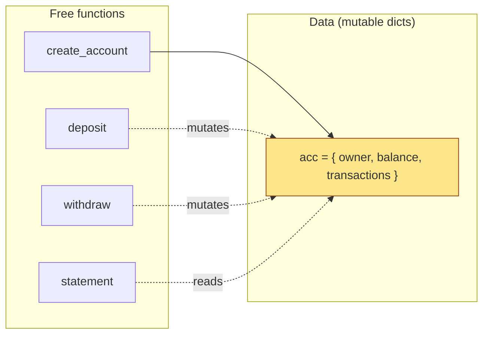
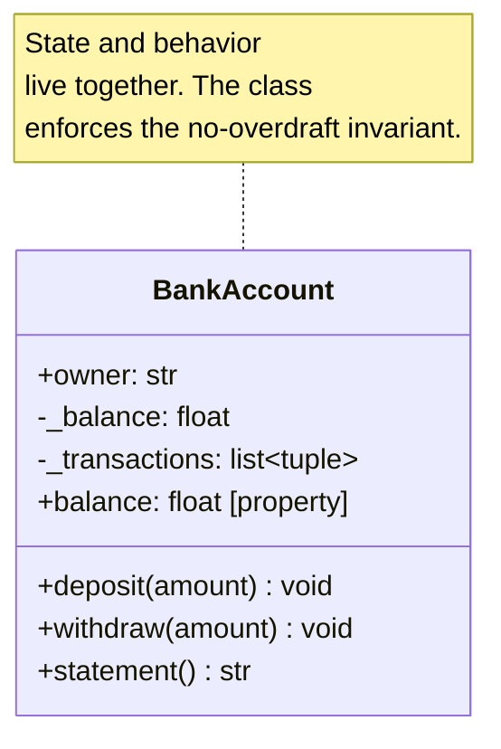
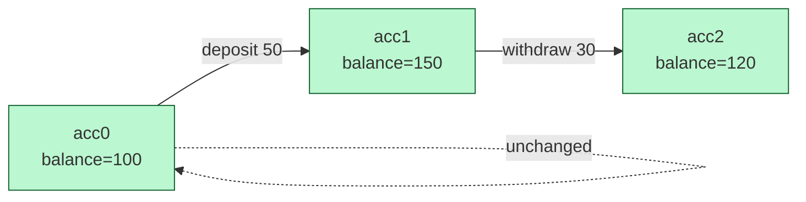
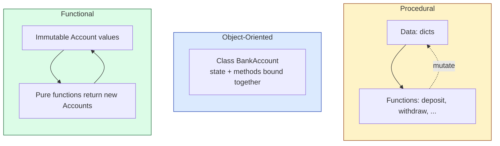
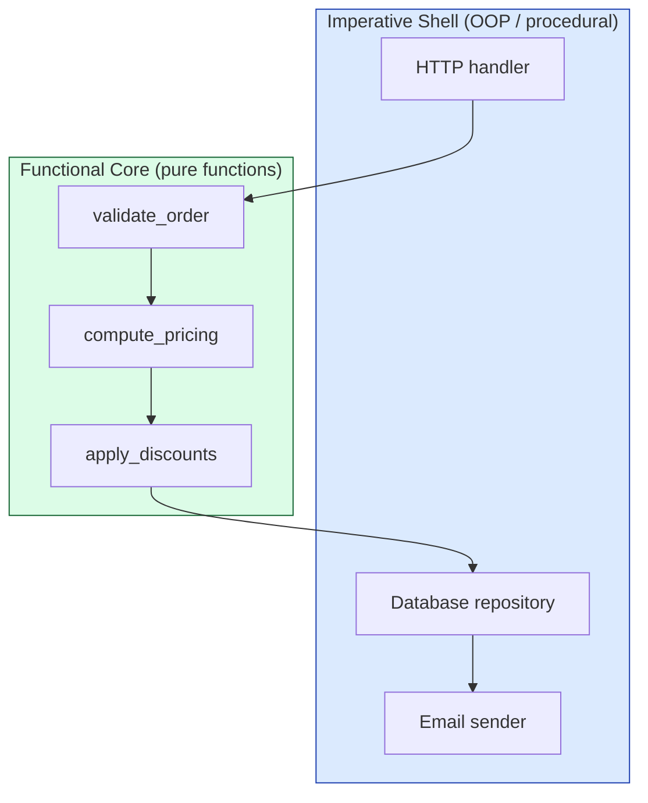
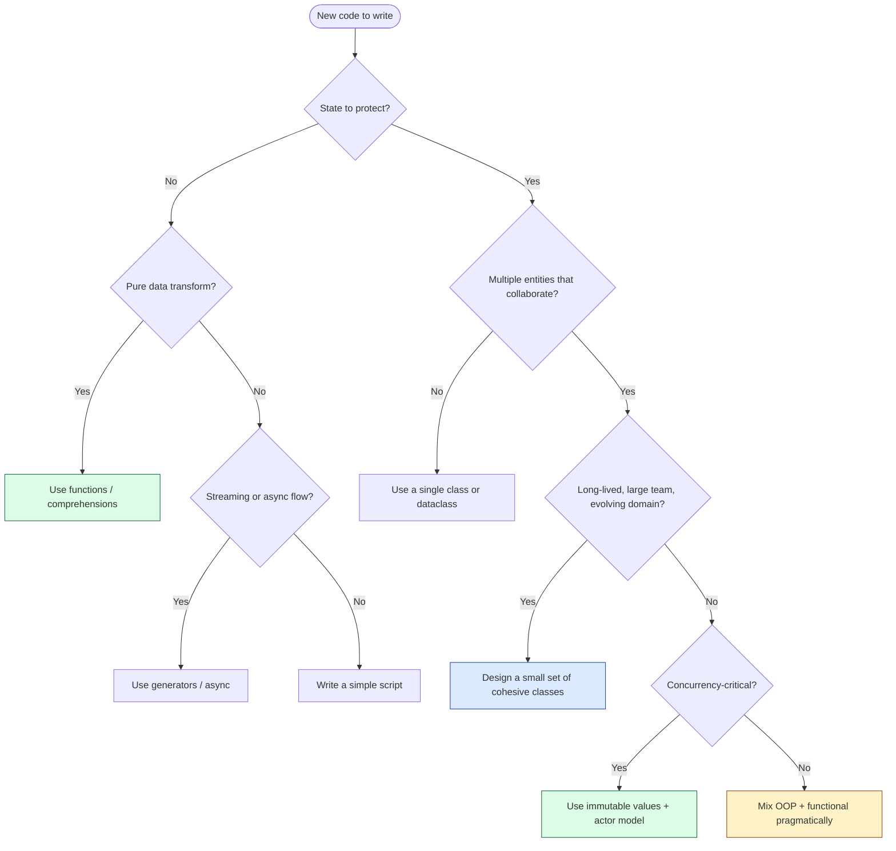

# Paradigm Comparison — Procedural vs OOP vs Functional

> [!note] The honest truth
> There is no "best" paradigm. There are **tools that fit certain problems** and **tools that fit certain teams**. A great programmer is fluent in several and picks deliberately. This file gives you the mental scaffolding to choose.

We will compare the three dominant paradigms — **Procedural**, **Object-Oriented**, and **Functional** — using the *same* small problem (a bank account) so the differences are concrete, not abstract.

---

## 1. The Three Paradigms at a Glance

| | **Procedural** | **Object-Oriented** | **Functional** |
|---|---|---|---|
| **Core idea** | A program is a sequence of steps that transform data | A program is a society of objects exchanging messages | A program is a pipeline of pure functions over immutable data |
| **Organising unit** | Procedures / functions | Classes / objects | Functions / values |
| **Where state lives** | Global variables, structs passed around | Inside objects, encapsulated | Nowhere — state is recreated, not mutated |
| **Reuse mechanism** | Calling functions | Inheritance, composition, polymorphism | Higher-order functions, composition |
| **Control flow** | Explicit (loops, conditionals) | Method dispatch (objects decide) | Function application, recursion |
| **Mental model** | "Do this, then that" | "Ask this object to do X" | "Transform data through pipes" |
| **Representative languages** | C, Fortran, classic Pascal, shell | Java, C++, Python, C#, Ruby | Haskell, Elm, F#, Clojure |

> [!tip] Paradigms are perspectives, not languages
> You can write procedural code in Java (a giant `main` method) or functional-style code in Python (list comprehensions, immutability). The **paradigm** is a *style of thought*; the **language** merely makes some styles easier than others.

---

## 2. The Same Problem, Three Ways

> Build a small **bank account** system. Requirements:
> 1. An account has an owner and a balance.
> 2. You can deposit and withdraw money.
> 3. Withdrawals must not overdraw the account.
> 4. Every transaction must be recorded for an audit trail.

### 2.1 Procedural Solution

In procedural style, data and the functions that act on it live separate lives. State is typically a `dict` or `struct` passed around explicitly.

```python
from typing import TypedDict

# --- Data structure ---
class Account(TypedDict):
    owner: str
    balance: float
    transactions: list[tuple[str, float]]

# --- Constructor function ---
def create_account(owner: str, opening_balance: float = 0.0) -> Account:
    return {
        "owner": owner,
        "balance": opening_balance,
        "transactions": [],
    }

# --- Operations ---
def deposit(account: Account, amount: float) -> None:
    if amount <= 0:
        raise ValueError("Deposit must be positive")
    account["balance"] += amount
    account["transactions"].append(("deposit", amount))

def withdraw(account: Account, amount: float) -> None:
    if amount <= 0:
        raise ValueError("Withdrawal must be positive")
    if amount > account["balance"]:
        raise ValueError("Insufficient funds")
    account["balance"] -= amount
    account["transactions"].append(("withdraw", amount))

def statement(account: Account) -> str:
    lines = [f"Account owner: {account['owner']}",
             f"Balance: {account['balance']:.2f}",
             "Transactions:"]
    for kind, amount in account["transactions"]:
        lines.append(f"  {kind}: {amount:.2f}")
    return "\n".join(lines)

# --- Usage ---
acc = create_account("Alice", 100.0)
deposit(acc, 50.0)
withdraw(acc, 30.0)
print(statement(acc))
```



**Strengths**
- Simple, no ceremony.
- Easy to read top-to-bottom.
- No hidden state — every function takes the data it needs.

**Weaknesses**
- Nothing stops `acc["balance"] = -99999` from anywhere in the codebase.
- Every function must defensively check the account's structure.
- Adding a new field (e.g., `currency`) means touching every function.
- As the program grows, the functions and data drift apart; "spaghetti" looms.

### 2.2 Object-Oriented Solution

The OOP version bundles the data **and** the operations on it inside a single `class`. Invariants are enforced by the class's methods.

```python
from dataclasses import dataclass, field

@dataclass
class BankAccount:
    owner: str
    _balance: float = 0.0
    _transactions: list[tuple[str, float]] = field(default_factory=list)

    def deposit(self, amount: float) -> None:
        if amount <= 0:
            raise ValueError("Deposit must be positive")
        self._balance += amount
        self._transactions.append(("deposit", amount))

    def withdraw(self, amount: float) -> None:
        if amount <= 0:
            raise ValueError("Withdrawal must be positive")
        if amount > self._balance:
            raise ValueError("Insufficient funds")
        self._balance -= amount
        self._transactions.append(("withdraw", amount))

    @property
    def balance(self) -> float:
        return self._balance

    def statement(self) -> str:
        lines = [f"Account owner: {self.owner}",
                 f"Balance: {self._balance:.2f}",
                 "Transactions:"]
        for kind, amount in self._transactions:
            lines.append(f"  {kind}: {amount:.2f}")
        return "\n".join(lines)

# --- Usage ---
acc = BankAccount("Alice", opening_balance := 100.0)
acc.deposit(50.0)
acc.withdraw(30.0)
print(acc.statement())
```



**Strengths**
- The no-overdraft rule is enforced by the class — you can't accidentally break it.
- Methods are *colocated* with the data they operate on; you find them by typing `acc.`.
- The class is a natural unit for testing, mocking, and reuse.
- Adding new account types (`SavingsAccount`, `CheckingAccount`) is supported by [[inheritance]] or composition.

**Weaknesses**
- More ceremony for tiny problems.
- The "everything is a class" temptation produces god-objects.
- Mutable state inside objects is harder to reason about than immutable data.

### 2.3 Functional Solution

In functional style, we **don't mutate** the account. Each operation returns a *new* account value. The original is unchanged.

```python
from dataclasses import dataclass, field, replace
from functools import reduce

@dataclass(frozen=True)
class Account:
    """Immutable account value."""
    owner: str
    balance: float = 0.0
    transactions: tuple[tuple[str, float], ...] = ()

def deposit(account: Account, amount: float) -> Account:
    if amount <= 0:
        raise ValueError("Deposit must be positive")
    return replace(
        account,
        balance=account.balance + amount,
        transactions=account.transactions + (("deposit", amount),),
    )

def withdraw(account: Account, amount: float) -> Account:
    if amount <= 0:
        raise ValueError("Withdrawal must be positive")
    if amount > account.balance:
        raise ValueError("Insufficient funds")
    return replace(
        account,
        balance=account.balance - amount,
        transactions=account.transactions + (("withdraw", amount),),
    )

def statement(account: Account) -> str:
    lines = [f"Account owner: {account.owner}",
             f"Balance: {account.balance:.2f}",
             "Transactions:"]
    for kind, amount in account.transactions:
        lines.append(f"  {kind}: {amount:.2f}")
    return "\n".join(lines)

# --- Usage ---
acc0 = Account("Alice", balance=100.0)
acc1 = deposit(acc0, 50.0)
acc2 = withdraw(acc1, 30.0)
print(statement(acc2))
# acc0 is unchanged — its balance is still 100.0
```



**Strengths**
- **No mutation** ⇒ trivial to test, trivial to parallelise.
- Old states are preserved automatically — perfect for auditing, undo, time travel.
- Pure functions compose like Lego bricks: `acc |> deposit(50) |> withdraw(30)`.

**Weaknesses**
- Storage and performance overhead (each operation allocates).
- Awkward for inherently stateful systems (UIs, hardware interfaces) without a wrapper.
- Most production codebases don't have the discipline to keep mutation out of the rest of the system.

---

## 3. Side-by-Side Structure Comparison



The diagram above tells you the *essential* difference:
- **Procedural** separates data from the functions that transform it.
- **OOP** glues data and functions together so each protects the other.
- **Functional** keeps data immutable and treats functions as first-class values that compose.

---

## 4. Pros and Cons of Each Paradigm

### Procedural

| Pros | Cons |
|---|---|
| Minimal ceremony — fast to write for small problems | Global mutable state becomes spaghetti at scale |
| Easy to learn; close to how the CPU works | No encapsulation ⇒ any function can corrupt any data |
| Excellent performance (no vtable dispatch, no allocation overhead) | Reuse is limited to copy-paste or function calls |
| Predictable control flow | Hard to model rich domains cleanly |

> [!tip] When procedural shines
> - Small scripts, build tools, CLI utilities.
> - Performance-critical inner loops (number crunching, kernel code).
> - Pipeline-style data transforms (`bash`, `awk`, numerical recipes).

### Object-Oriented

| Pros | Cons |
|---|---|
| Models real-world domains naturally | Boilerplate for small problems |
| Encapsulation bounds complexity and protects invariants | Mutable state complicates concurrency |
| Inheritance and polymorphism enable substitution and extension | Inheritance is easily overused → fragile hierarchies |
| Industry-standard tooling, libraries, and hiring pool | Designing good classes is a skill — easy to make god-objects |
| Excellent for UIs, simulations, business logic | "Enterprise" code can balloon into layers of abstraction |

> [!tip] When OOP shines
> - Rich business domains (banking, e-commerce, healthcare).
> - GUIs and games (entities with state and behavior).
| - Large teams where clear ownership of modules matters.
> - Long-lived codebases where maintenance cost dominates.

### Functional

| Pros | Cons |
|---|---|
| Pure functions are trivially testable | Learning curve for programmers from imperative backgrounds |
| Immutability eliminates whole classes of concurrency bugs | Performance and memory overhead for state-heavy apps |
| Composition via higher-order functions is extremely expressive | Modeling inherently stateful systems (UIs, IO) requires monads or wrappers |
| Algebraic data types model domains precisely | Tooling and ecosystem historically weaker (though Haskell/Scala/Elm have caught up) |
| Excellent for data pipelines, ETL, compilers | Some teams find the style less "obvious" to read at a glance |

> [!tip] When functional shines
> - Data pipelines, ETL, compilers, financial calculations.
> - Concurrent and distributed systems (immutability + message passing).
> - Code where correctness and testability are paramount.
> - React-style UIs (state as immutable snapshots).

---

## 5. When to Use OOP — and When NOT To

### Use OOP when…

- **The problem is full of entities with state and behavior.** (A game with `Player`, `Enemy`, `Projectile` objects; a CMS with `User`, `Post`, `Comment`.)
- **You need to enforce invariants.** (`BankAccount` must not overdraft; `Order` must not ship before being paid.)
- **You're working on a large team.** Classes and interfaces give you natural ownership boundaries.
- **The domain is long-lived and changes over time.** Encapsulated objects can absorb internal changes without breaking callers.
- **You're building a framework or library.** A documented class API is the contract callers depend on.

### Do NOT use OOP when…

- **The problem is a pure data transform.** (Parsing a CSV, computing statistics over numbers.) Use functions and comprehensions.
- **The code is a one-off script.** Wrapping everything in classes adds ceremony without payoff.
- **You only have data, no behavior.** A `User` that's just five fields with no methods should be a `dataclass`, not a deep class hierarchy.
- **Mutable state will cause concurrency bugs.** Consider functional or actor-based designs.
- **You're tempted to build deep inheritance trees.** That's almost always a sign to switch to composition or interfaces — see [[composition-over-inheritance]].

> [!warning] The "Object-Oriented Programming System" antipattern
> Beginners sometimes wrap every value in a class — a `Name` class, an `Address` class, a `Money` class — each with getters and setters wrapping a single field. This is **not** OOP; it's ceremony. OOP earns its keep when an object has *cohesive state + behavior that needs protecting*. A `Money` class with arithmetic and currency conversion? Yes. A `Money` class that just stores a float? No — use a float (or better, an `int` of cents).

---

## 6. Hybrid Approaches: The Real World

Most production code is **multi-paradigm**. Python, JavaScript, C#, Kotlin, Swift, Rust, and modern Java all explicitly support mixing styles. The art is using each tool where it's strongest.

### 6.1 Python's multi-paradigm sweet spot

A typical Python service might use:
- **Classes** for stateful entities (`UserRepository`, `OrderService`, `HttpClient`).
- **Pure functions** for transformations (`compute_total`, `normalize_email`, `parse_csv`).
- **Dataclasses** for plain data carriers (`User`, `Order`).
- **Comprehensions and `map`/`filter`** for collection pipelines.
- **Generators** for streaming/lazy evaluation.
- **Async functions** for I/O concurrency.

```python
from dataclasses import dataclass
from functools import reduce

# Functional-style pure data + transforms
@dataclass(frozen=True)
class Transaction:
    kind: str
    amount: float

def apply(account_balance: float, tx: Transaction) -> float:
    return account_balance + tx.amount if tx.kind == "deposit" \
           else account_balance - tx.amount

# Functional pipeline
transactions = [Transaction("deposit", 100), Transaction("withdraw", 30)]
final_balance = reduce(apply, transactions, 0)

# Object-Oriented wrapper for state + behavior + collaborators
class Ledger:
    def __init__(self) -> None:
        self._transactions: list[Transaction] = []

    def record(self, tx: Transaction) -> None:
        self._transactions.append(tx)

    @property
    def balance(self) -> float:
        return reduce(apply, self._transactions, 0)
```

> [!note] The hybrid rule of thumb
> - Reach for **objects** when you have *state that needs protecting*.
> - Reach for **functions** when you have *data that needs transforming*.
> - Reach for **generators/async** when you have *flow that needs streaming*.
> - Reach for **immutability** when you have *concurrency that needs reasoning*.

### 6.2 Functional core, imperative shell

A powerful architectural pattern: keep your **business logic** as pure functions (no I/O, no mutation), and wrap them in a thin **imperative shell** that handles I/O, persistence, and side effects. This combines functional testability with OOP's organizational clarity.



### 6.3 Data-oriented design (for performance)

In games, simulation, and high-performance computing, a fourth paradigm — **data-oriented design (DOD)** — beats OOP. Instead of one `Entity` object holding all its data, you store all positions in one array, all velocities in another, and process them in tight cache-friendly loops. C++ game engines (ECS architectures) lean heavily on this. It's neither procedural nor OOP nor functional — it's about **memory layout**.

---

## 7. A Decision Heuristic



---

## 8. Common Misconceptions

> [!warning] "Functional has no state"
> False. Functional programs have state — they just express it as **a sequence of values** rather than **a series of mutations**. The state exists; it's just *not mutable in place*.

> [!warning] "OOP means classes"
> False. JavaScript (pre-ES6) and Self are object-oriented without classes — they use prototypes. See [[history-of-oop]].

> [!warning] "Procedural code is obsolete"
> False. The Linux kernel, numpy's inner loops, and most shell scripts are procedural — and rightly so. Procedural is the right tool when state is simple and performance matters.

> [!warning] "You must pick one paradigm per project"
> False. Modern codebases blend paradigms constantly. The skill is **knowing which to reach for in which situation**.

---

## 9. Key Takeaways

- **Procedural** separates data from the functions that transform it. Simple, fast, but scales poorly.
- **Object-Oriented** binds data and behavior together to protect invariants and model domains. Excellent for long-lived, team-built systems.
- **Functional** treats data as immutable and computation as function composition. Excellent for correctness, concurrency, and pipelines.
- **The same problem solved three ways** reveals that the choice is rarely about capability — it's about *which trade-offs you accept*.
- **Hybrid code is the norm**: use objects where state lives, functions where data flows, immutability where concurrency bites.
- **There is no best paradigm** — only the best paradigm *for this problem, this team, this codebase*.

---

## 10. Practice Exercises

### Exercise 1 — Convert procedural to OOP
Take the procedural bank account above and rewrite it as a class hierarchy with `SavingsAccount` (no overdraft, earns interest) and `CheckingAccount` (allows overdraft up to a limit). What methods are shared? What differs? Where would [[polymorphism]] help?

### Exercise 2 — Convert OOP to functional
Take the OOP `BankAccount` and rewrite it as immutable values with pure functions. Then implement an `audit(account, start_time, end_time)` function that returns all transactions in a time window. How does immutability make the audit easier?

### Exercise 3 — Hybrid design
Design a tiny order-processing service with:
- A `Order` class (state + invariants).
- Pure functions for `compute_total`, `apply_discount`, `validate_order`.
- An async `OrderService` shell that loads orders from a database and emails confirmations.
Draw a Mermaid diagram showing the data flow.

### Exercise 4 — Paradigm critique
Find a popular open-source Python library (e.g., `requests`, `pandas`, `Django`). Identify:
- Three places it uses OOP well.
- Three places it uses functional style.
- One place where the choice is debatable.
Write a paragraph defending or critiquing each.

### Exercise 5 — The 30-second elevator pitch
For each paradigm (procedural, OOP, functional), write a one-sentence pitch a non-programmer would understand. Then write a one-sentence critique. The goal: be able to explain *why* someone would choose each.

---

## 11. Where to Go Next

- [[what-is-oop]] — What OOP actually is, in depth.
- [[history-of-oop]] — How each paradigm evolved, with OOP as the focus.
- [[core-concepts-overview]] — The four pillars and a glossary.
- [[encapsulation]] — The pillar that most distinguishes OOP from procedural.
- [[composition-over-inheritance]] — A modern reaction that blurs OOP and functional styles.
- [[functional-core-imperative-shell|Functional Core, Imperative Shell]] — The hybrid architecture pattern.
