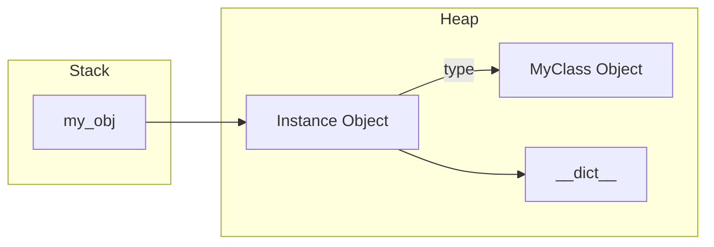

# 05.01 - Classes & Objects

## 🎯 What You Will Learn
- What Object-Oriented Programming (OOP) is and its core paradigms.
- Creating classes and instantiating objects in Python.
- Understanding memory allocation and references (with diagrams).
- Class attributes vs. instance attributes, and how they resolve.
- The meaning and mechanical behavior of the `self` keyword.
- Best practices for modern Python 3.12+ (type hinting, strictness).

---

## 🧠 1. What is OOP?

Object-Oriented Programming (OOP) is a programming paradigm that organizes software design around **data**, or **objects**, rather than functions and logic. An object is a data field that has unique attributes and behavior.

- **Class**: A blueprint or template. It defines what attributes and methods an object will have.
- **Object / Instance**: A concrete realization of a class. When you build a house (object) from a blueprint (class).

> [!NOTE]
> Everything in Python is an object! Integers, strings, functions, and even classes themselves are objects.

---

## 🏗️ 2. Creating a Class (Modern Python 3.12+)

Let's create a `Dog` class using modern type hints and syntax.

```python
class Dog:
    # Class attribute: shared by all instances of this class.
    # It exists in the class's namespace, not the instance's.
    species: str = "Canis familiaris"

    # The __init__ method is the initializer (often called the constructor).
    # It sets up the initial state of the newly created object.
    def __init__(self, name: str, age: int) -> None:
        # Instance attributes: unique to each created object (instance).
        self.name: str = name
        self.age: int = age

    # Instance method: takes 'self' as the first parameter.
    def bark(self) -> str:
        return f"{self.name} says woof!"

    def describe(self) -> str:
        return f"{self.name} is {self.age} years old."

# Instantiating objects (creating instances)
buddy = Dog("Buddy", 3)
max_dog = Dog("Max", 5)

print(buddy.name)       # Buddy
print(buddy.bark())     # Buddy says woof!
print(buddy.species)    # Canis familiaris
```

### Step-by-Step Code Execution Trace

When Python executes `buddy = Dog("Buddy", 3)`:
1. **Allocation**: Python calls `Dog.__new__(Dog)` to allocate memory for a new empty `Dog` object.
2. **Initialization**: Python calls `Dog.__init__(<new_object>, "Buddy", 3)`.
3. **Binding**: Inside `__init__`, `self` points to the `<new_object>`. The attributes `name` and `age` are added to the object's local namespace (`__dict__`).
4. **Assignment**: The reference to this newly populated object is returned and bound to the variable `buddy`.

---

## 🔍 3. Memory Allocation: Classes vs Instances

Understanding how attributes are stored in memory is critical to mastering Python OOP.

```mermaid
flowchart TD
    subgraph Global Namespace
        DogClass[Dog Class Object]
        BuddyRef[buddy Variable]
        MaxRef[max_dog Variable]
    end

    subgraph Memory Heap (Objects)
        ClassState[Dog Class Dict\n----------\n__name__: 'Dog'\nspecies: 'Canis familiaris'\nbark: <function>\n__init__: <function>]
        
        BuddyState[Dog Instance\n----------\nname: 'Buddy'\nage: 3]
        
        MaxState[Dog Instance\n----------\nname: 'Max'\nage: 5]
    end

    DogClass -.-> ClassState
    BuddyRef --> BuddyState
    MaxRef --> MaxState
    
    BuddyState -.-> |Class Reference| DogClass
    MaxState -.-> |Class Reference| DogClass
```

### Attribute Resolution Order (How Python looks up data)

If you ask for `buddy.species`, Python does this:
1. Looks in the instance's `__dict__` (Namespace of `buddy`). Is `species` there? No.
2. Looks in the class's `__dict__` (Namespace of `Dog`). Is `species` there? Yes! Returns `"Canis familiaris"`.

> [!WARNING]
> **Edge Case:** If you do `buddy.species = "Wolf"`, it creates a *new* instance attribute on `buddy`. It does **not** change `Dog.species`!

```python
buddy.species = "Wolf"
print(buddy.species)      # "Wolf" (found on instance)
print(max_dog.species)    # "Canis familiaris" (fell back to class)
print(Dog.species)        # "Canis familiaris"
```

---

## ⚡ 4. The `self` Keyword Deep Dive

`self` is not a reserved keyword in Python, it's just a strong convention. It represents the instance upon which a method is being called.

When you do:
```python
buddy.bark()
```
Python translates this internally into:
```python
Dog.bark(buddy)
```
This is why all instance methods must have `self` as their first parameter.

---

## 🛠️ 5. Modern Python Features in OOP

Python 3.10+ introduced structural pattern matching, which works beautifully with classes!

```python
class Point:
    def __init__(self, x: int, y: int) -> None:
        self.x = x
        self.y = y

def process_point(pt: Point | str) -> str:
    match pt:
        case Point(x=0, y=0):
            return "Origin"
        case Point(x=0, y=y):
            return f"On Y axis at {y}"
        case Point(x=x, y=0):
            return f"On X axis at {x}"
        case Point():
            return "Somewhere in 2D space"
        case _:
            return "Not a point!"

p = Point(0, 5)
print(process_point(p)) # On Y axis at 5
```

---

## 🧪 6. Interactive Practice Exercises

### Challenge 1: The E-Commerce Cart
Create a `Cart` class that holds items.
- It should have a class attribute `store_name`.
- It should have an instance attribute `items` (a list).
- Implement an `add_item(item_name: str)` method.
- Implement a `get_total_items()` method.

<details>
<summary><b>View Solution</b></summary>

```python
class Cart:
    store_name: str = "PyShop"

    def __init__(self) -> None:
        # Crucial: instantiate a new list per instance!
        # If placed at the class level, all carts would share the same list.
        self.items: list[str] = []

    def add_item(self, item_name: str) -> None:
        self.items.append(item_name)

    def get_total_items(self) -> int:
        return len(self.items)

my_cart = Cart()
my_cart.add_item("Laptop")
my_cart.add_item("Mouse")
print(my_cart.get_total_items()) # 2
```
</details>

### Challenge 2: Bank Account with Transactions Trace
Create a `BankAccount` class using modern type hinting.
Include `deposit`, `withdraw`, and handle edge cases like insufficient funds.

<details>
<summary><b>View Solution</b></summary>

```python
class BankAccount:
    bank_name: str = "Python Bank"

    def __init__(self, owner: str, balance: float = 0.0) -> None:
        self.owner = owner
        self.balance = balance

    def deposit(self, amount: float) -> str:
        if amount <= 0:
            raise ValueError("Deposit amount must be positive.")
        self.balance += amount
        return f"Deposited ${amount:.2f}. New balance: ${self.balance:.2f}"

    def withdraw(self, amount: float) -> str:
        if amount <= 0:
            raise ValueError("Withdraw amount must be positive.")
        if amount > self.balance:
            return "Insufficient funds"
        self.balance -= amount
        return f"Withdrew ${amount:.2f}. New balance: ${self.balance:.2f}"

account = BankAccount("Alice", 1000.0)
print(account.deposit(500))
print(account.withdraw(2000)) # Insufficient funds
```
</details>

---

## ✅ Check Your Understanding

1. What exactly happens in memory when `Dog("Max", 5)` is called?
2. If `class Config:` has `retries = 3`, and you change `my_config.retries = 5`, does it change for other instances?
3. Why does `my_obj.method()` require `self` as the first argument in the class definition?
4. How do you type-hint an instance attribute initialized in `__init__`?

**Answers:**
1. A new object is allocated in heap memory, `__init__` sets `name='Max'` and `age=5` in the object's `__dict__`, and the reference is returned.
2. No, it creates a new instance-level attribute that shadows the class attribute.
3. Python automatically passes the instance itself (`my_obj`) as the first positional argument.
4. Using colon syntax: `self.name: str = name` or define it at the class body level as an annotation.

---

## 🔗 Next Steps

→ [[05.02 - __init__ & Self]]
→ [[MOC - Python Master Guide]]


## Deep Dive: Python OOP Basics

### Memory Allocation Diagram (`self` and `__init__`)


### Code Execution Trace
1. `obj = MyClass(10)`
2. Python calls `MyClass.__new__` to allocate memory for the object.
3. Python calls `MyClass.__init__(self, 10)` passing the newly allocated object as `self`.
4. `self.value = 10` is executed, storing it in the instance's `__dict__`.
5. The memory reference is returned and bound to `obj`.

### Interactive Practice Exercise
**Exercise:** Create a `Student` class. Implement `__init__` and a custom `__del__` method. Instantiate it, explicitly `del` it, and observe the lifecycle hook being triggered.
