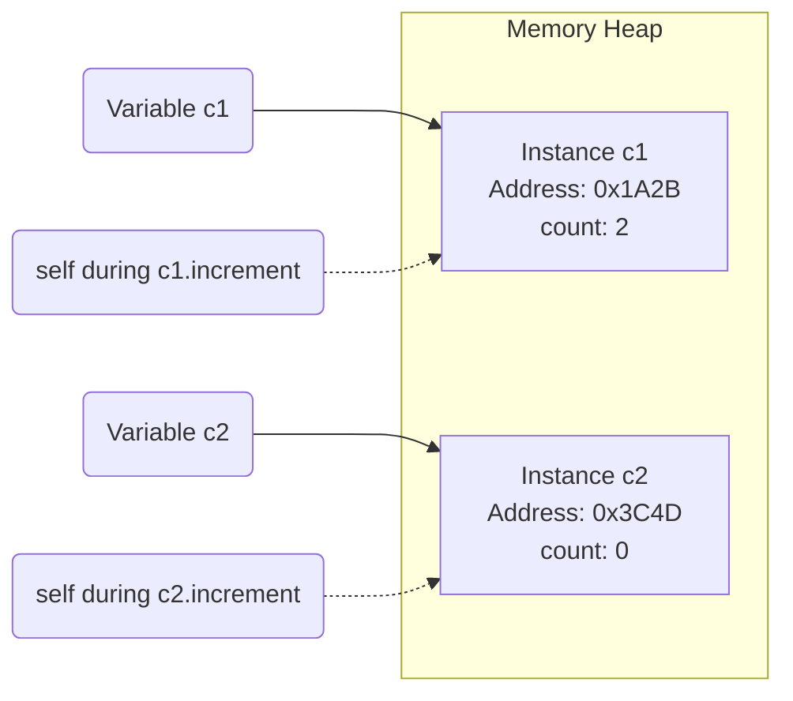

# 05.02 - __init__ & Self in Python

## 🎯 What You Will Learn
- Deep dive into object initialization (`__init__`) vs creation (`__new__`)
- Understanding `self` in memory (allocation and reference)
- Modern Python 3.12+ type hinting for constructors
- Default values and validation in `__init__`
- Multiple constructors pattern using `@classmethod` and `typing.Self`
- Memory tracing and code execution steps

---

## 🧠 The `__init__` Method: Initialization, Not Creation

While `__init__` is often called the "constructor", in Python, it's actually the **initializer**. The actual creation of the object in memory happens in `__new__`, which then passes the newly created object to `__init__` to initialize its attributes.

```python
class Person:
    def __init__(self, name: str, age: int) -> None:
        """Initialize a new Person instance."""
        print(f"Initializing person: {name}")
        self.name = name
        self.age = age

# Creating an instance
p = Person("Alice", 25) 
```

### 🔍 Execution Trace: What happens when you call `Person("Alice", 25)`?
1. Python calls `Person.__new__(Person)` to allocate memory for the new object.
2. `__new__` returns an empty `Person` object.
3. Python calls `Person.__init__(<empty_person_object>, "Alice", 25)`.
4. Inside `__init__`, `self` is bound to the empty object. Attributes are attached.
5. `Person("Alice", 25)` returns the fully initialized object.

---

## 🏗️ Understanding `self` in Memory

`self` is simply a reference to the current instance in memory. It is passed automatically by Python when you call instance methods.


*(Diagram illustrating two separate objects in the heap. `self` points to either 0x1A2B or 0x3C4D depending on which object invokes the method.)*

```python
class Counter:
    def __init__(self) -> None:
        self.count: int = 0  # self refers to the specific instance

    def increment(self) -> int:
        self.count += 1
        return self.count

c1 = Counter()
c2 = Counter()

print(c1.increment())  # 1 (Modifies c1's count)
print(c1.increment())  # 2 (Modifies c1's count)
print(c2.increment())  # 1 (Modifies c2's count - independent!)
```

---

## 🛠️ Validation & Default Parameters

Modern Python 3.12+ encourages type hints and clear validation inside `__init__`.

```python
class Temperature:
    def __init__(self, celsius: float = 0.0) -> None:
        if celsius < -273.15:
            raise ValueError(f"Temperature {celsius}°C is below absolute zero!")
        self.celsius = celsius

    def to_fahrenheit(self) -> float:
        return (self.celsius * 9/5) + 32

# Using defaults
freezing = Temperature() 
print(freezing.celsius)  # 0.0

# Using custom values
room_temp = Temperature(25.0)
print(room_temp.to_fahrenheit())  # 77.0
```

---

## 🔄 Class Methods as Alternative Constructors (Python 3.11/3.12+)

Sometimes you need to create objects from different data formats (e.g., JSON, strings). In Python, we use `@classmethod` for alternative constructors. Using the modern `typing.Self` (introduced in 3.11), we can properly type-hint them.

```python
from typing import Self
import datetime

class Date:
    def __init__(self, year: int, month: int, day: int) -> None:
        self.year = year
        self.month = month
        self.day = day

    @classmethod
    def from_string(cls, date_string: str) -> Self:
        """Alternative constructor: create a Date from 'YYYY-MM-DD'"""
        year, month, day = map(int, date_string.split("-"))
        return cls(year, month, day)

    @classmethod
    def today(cls) -> Self:
        """Alternative constructor: create a Date for today"""
        now = datetime.datetime.now()
        return cls(now.year, now.month, now.day)

d1 = Date(2024, 1, 15)
d2 = Date.from_string("2024-03-20")
d3 = Date.today()
```

---

## 🧪 Interactive Practice Exercises

### Exercise 1: Bank Account with Validation
Create a `BankAccount` class. It should initialize with an `owner` (string) and a `balance` (float, default 0.0). If a negative balance is passed, raise a `ValueError`. Add a `deposit` method.

<details>
<summary>💡 Click to reveal solution</summary>

```python
class BankAccount:
    def __init__(self, owner: str, balance: float = 0.0) -> None:
        if balance < 0:
            raise ValueError("Initial balance cannot be negative")
        self.owner = owner
        self.balance = balance
        
    def deposit(self, amount: float) -> None:
        if amount <= 0:
            raise ValueError("Deposit amount must be positive")
        self.balance += amount

acc = BankAccount("Alice", 100.0)
acc.deposit(50)
print(acc.balance)  # 150.0
```
</details>

### Exercise 2: Alternative Constructor for Employee
Given the `Employee` class, implement an alternative constructor `from_csv_row` that takes a string like `"Alice,Developer,85000"`.

<details>
<summary>💡 Click to reveal solution</summary>

```python
from typing import Self

class Employee:
    def __init__(self, name: str, role: str, salary: int) -> None:
        self.name = name
        self.role = role
        self.salary = salary

    @classmethod
    def from_csv_row(cls, csv_row: str) -> Self:
        name, role, salary_str = csv_row.split(",")
        return cls(name, role, int(salary_str))

emp = Employee.from_csv_row("Bob,Manager,95000")
print(f"{emp.name} works as a {emp.role}")
```
</details>

---

## ✅ Check Your Understanding

1. **Why is `__init__` technically not a constructor?**
   *Because `__new__` actually constructs/allocates the object. `__init__` just initializes the state of the already-created object.*
2. **What does `self` represent?**
   *A reference to the specific instance of the class in memory that is currently being operated on.*
3. **What return type should `__init__` always have?**
   *It must always return `None` (annotated as `-> None`).*
4. **What is the modern way to type-hint alternative constructors?**
   *Using `from typing import Self` as the return type for the `@classmethod`.*

---

## 🔗 Next Steps

→ [[05.03 - Inheritance]]
→ [[MOC - Python Master Guide]]
